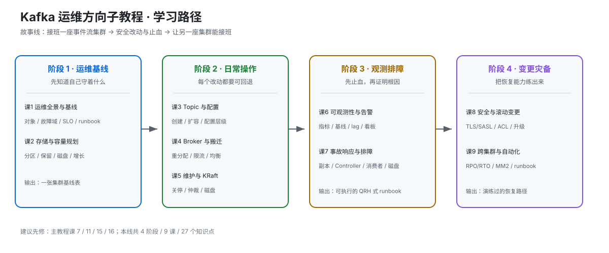
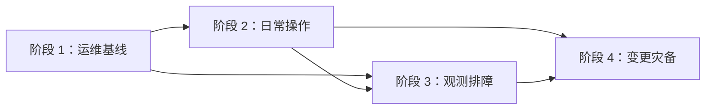

# Kafka 运维方向子教程 · 学习路径总览

> 本文件是活文档。它是现有 Kafka 主教程的运维专线，不替换主线课程。

## 🎯 学习目标

- **目标类型**：动手实操
- **目标说明**：能从值班基线出发，安全完成 Kafka 的日常变更，依据指标和日志排障，并为升级、权限轮换和跨机房容灾留下可验证的 runbook 证据。
- **完成标准**：不是背命令，而是每次操作都能回答“改什么、风险是什么、看什么确认成功、失败如何回退”。

## 故事主线

- **主角**：一座持续承载事件流的 Kafka 集群。
- **冲突**：平时能发收消息，不代表上线后能被安全地观察、扩容、维护、止血和恢复。
- **收束**：把 Kafka 运维成一个有基线、有证据、有回滚、有演练的生产系统。

## 学习路径图

> SVG 展示 4 个阶段、9 课与阶段依赖；正文中的命令、指标和版本参数以官方文档核对结果为准。

## 与主教程的衔接

建议先读主教程的 [课 15：监控与可观测](../stages/6-运维与可观测/lessons/lesson-15-监控与可观测.md) 和 [课 16：集群运维操作](../stages/6-运维与可观测/lessons/lesson-16-集群运维操作.md)。如果需要理解副本、权限、配额和协议兼容，再回看 [课 7](../stages/3-可靠性与高可用/lessons/lesson-07-副本机制与故障转移.md)、[课 11](../stages/5-生产落地延伸/lessons/lesson-11-Kafka安全体系.md)、[课 12](../stages/5-生产落地延伸/lessons/lesson-12-多租户与配额.md) 和 [课 19](../stages/7-实现原理/lessons/lesson-19-协议版本与兼容性.md)。

## 阶段总览

### 阶段 1：集群运维基线（“先知道自己守着什么”）

- **目标**：建立集群对象、故障域、容量、版本和 SLO 的共同语言。
- **学习重点**：KRaft 角色与元数据、Broker/磁盘/网络边界、分区规模、日志保留、容量预警。
- **必须掌握**：能画出集群基线；能解释分区数、复制因子和磁盘增长如何共同决定风险。
- **对应课**：课 1《运维全景与集群基线》、课 2《存储、容量与分区规划》

### 阶段 2：日常操作与容量治理（“每个改动都要可回退”）

- **目标**：能安全管理 Topic、分区、Broker 成员、数据搬迁和维护窗口。
- **学习重点**：配置层级、分区扩容、重分配、限流、优先副本、优雅关停、KRaft 仲裁。
- **必须掌握**：能把一次数据搬迁拆成 prepare → execute → verify → rollback，并记录操作前后证据。
- **对应课**：课 3《Topic 生命周期与配置治理》、课 4《Broker 成员与数据搬迁》、课 5《日常维护与 KRaft 运维》

### 阶段 3：可观测与故障排查（“先止血，再证明根因”）

- **目标**：把指标、日志、CLI 输出和客户端现象拼成一条排障证据链。
- **学习重点**：JMX/Prometheus、健康基线、lag、ISR、Controller、磁盘、再均衡和事故分诊。
- **必须掌握**：面对常见症状，先采取低风险止血动作，再按条件分支定位，最后给出升级出口。
- **对应课**：课 6《可观测性基线与告警》、课 7《Kafka 事故响应与故障排查》

### 阶段 4：安全变更与灾备自动化（“把恢复能力练出来”）

- **目标**：能运营安全配置，设计不停服变更，规划跨集群恢复并用自动化固化流程。
- **学习重点**：Listener、TLS/SASL、ACL、证书轮换、滚动升级、RPO/RTO、MirrorMaker 2、runbook 自动化。
- **必须掌握**：能为一次高风险变更写出前置检查、分批执行、成功判据、回滚和演练记录。
- **对应课**：课 8《安全运营与滚动变更》、课 9《跨集群灾备与运维自动化》

## 阶段依赖

## 当前进度

- [x] 阶段 1：集群运维基线（课 1–2 已完成）
- [x] 阶段 2：日常操作与容量治理（课 3–5 已完成，2026-09-16 完成）
- [ ] 阶段 3：可观测与故障排查（课 6 已完成，课 7 未开始）
- [ ] 阶段 4：安全变更与灾备自动化（未开始）

详细知识点状态以 [00-学习档案](./00-学习档案.md) 为准，评审状态以 [00-评审清单](./00-评审清单.md) 为准。
