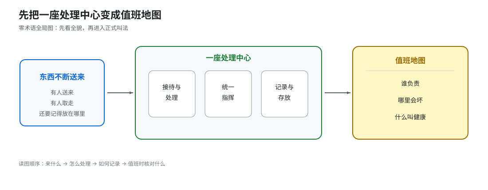
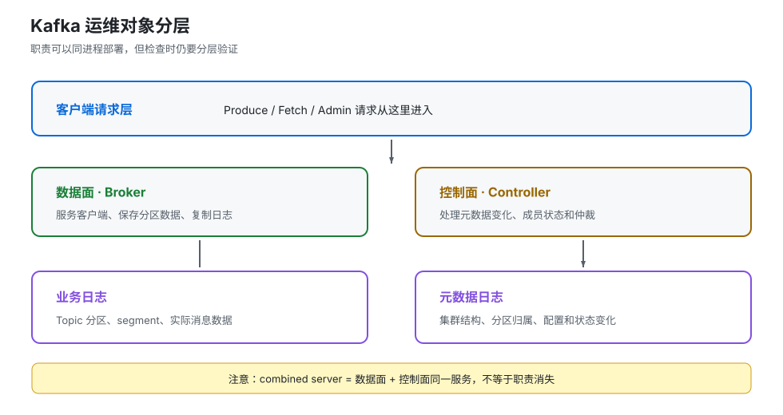
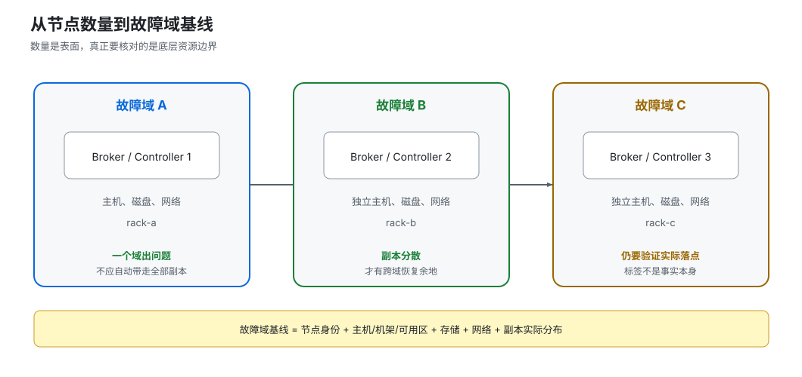

# 第 1 课：运维全景与集群基线

> 所属阶段：阶段 1《集群运维基线》｜水平：入门｜目标：动手实操
> 故事情节：第一次接班——先弄清自己守着哪些对象、哪些边界、哪些承诺。

> 📖 **结论已按官方文档核对**（核查于 2026-09 ｜ 来源：[KRaft](../../../web-index/kafka/topics/operations.md)、[Monitoring](../../../web-index/kafka/topics/operations.md)、[Hardware and OS](../../../web-index/kafka/topics/operations.md)、[Java Version](../../../web-index/kafka/topics/operations.md)）。本课按 Kafka 4.3 文档作为概念核对基线；实验沿用主教程的 Kafka 4.0.0 本地 Compose，仅用于验证命令和观察路径，版本差异以目标环境官方文档与 --help 为准。

## 🎯 本课目标

- 画出 Kafka 运维对象从业务使用者到处理、指挥、记录和存放的分层地图。
- 能记录节点角色、故障域、版本、Java/OS、文件系统和日志目录等集群基线。
- 把“集群健康”变成可观测、可交接的 SLO、值班台账和 runbook 入口。

## 第一幕：起源与场景引入

你第一次接手 Kafka 值班。业务同事问得很简单：

> “今晚能不能重启这一台？它看起来只是三台机器中的一台。”

你打开监控，大屏是绿色的；再看容器，三个进程都在运行；消息也还能发进去。可是你马上发现，自己还答不上四个问题：

1. 这一台除了接收和存放消息，是不是还承担了“指挥”工作？
2. 如果它所在的磁盘坏了，坏的是一个目录、一个节点，还是一整批备份数据？
3. “能发消息”到底算不算健康？有没有一条命令能证明集群的指挥工作也正常？
4. 这套集群是开发环境的简化形态，还是可以照搬到关键生产环境？

### 一句话本质

**本课把一座“能流消息的黑盒”变成一张“能逐项核对的值班地图”：谁负责什么、哪里会一起坏、怎样才算健康。**

### 处境对照

| 处境 | 你能看到什么 | 可能付出的代价 |
|------|--------------|----------------|
| 只看进程是否存活 | 3 个容器都是 Up，消息也能发 | 仍不知道控制面、磁盘、日志目录和故障域；一次重启可能同时触碰两类职责 |
| 先建立运维基线 | 每个节点都有角色、故障域、版本、存储和健康判据 | 交接和变更多花一张表的时间，但后续能在维护前后逐项证明结果 |

> **量化锚点说明**：本课实验 Compose 明确声明 3 个 Kafka 服务，每个服务同时配置 broker,controller；这是仓库内实验文件的事实，不是生产规模建议。健康阈值优先采用官方监控页给出的副本与日志目录判据，而不是凭经验编造一个“绿色就算正常”。

## 第二幕：认知冲突

### 冲突一：进程活着，不等于集群健康

docker ps 只能回答“进程还在不在”。它回答不了：

- 集群的统一指挥是否有明确负责人；
- 指挥层是否仍保持多数可用；
- 数据的多份拷贝是否掉队；
- 某个数据存放目录是否已经离线；
- 客户端请求是否已经错误或排队。

### 冲突二：一台机器可能同时扮演两种角色

在小型本地环境里，一个 Kafka 服务可以同时承担数据服务和集群指挥。这样启动简单，但维护时不能把它当成“只有接收和存放消息的一台机器”：重启它既会影响客户端请求，也会影响集群指挥职责。

### 冲突三：三台机器不自动等于三个故障域

如果三台机器实际共享同一台宿主机、同一块存储或同一条网络出口，那么“3 个实例”仍可能在一次底层故障里一起消失。**运维基线必须记录故障边界，而不是只数进程数量。**

## 第三幕：层层揭示

### 一眼全局图：先把黑盒画成值班地图

> **看图**：左边是东西不断送来的处理中心，中间把它拆成“接待与处理、统一指挥、记录与存放”三块，右边再把这三块翻译成值班时要核对的“谁负责、哪里会坏、什么叫健康”。本课就是沿着这条路，把一座黑盒变成一张地图。

### 本课地图（分三步走）

| 步 | 这一步要解决什么（人话） | 对应知识点 |
|:--:|------------------------|-----------|
| 1 | 先把“谁在接活、谁在指挥、谁在记账和存货”分清楚 | 运维对象分层与集群基线 |
| 2 | 再确认哪些机器、磁盘和网络会一起出问题 | 环境、拓扑与故障域基线 |
| 3 | 最后把“健康”写成能检查、能交接、能升级的标准 | SLO、值班台账与 runbook |

### 知识点一：运维对象分层与集群基线

> 🧭 **第 1/3 步｜承接**：第二幕留下的问题是“进程活着为什么仍不代表健康” → **本步**：先把集群里的职责分层，知道每个对象出了问题会影响哪一面。

#### 一句话定义

**运维对象分层，就是把 Kafka 拆成“数据面、控制面、元数据记录和业务日志”四类对象，并为每一类写清责任边界。**

#### 直觉建立：把 Kafka 想成物流中心

想象一座持续收货的物流中心：

- **Broker**：接待窗口和仓库管理员，接收请求、保存分区数据、把数据发给客户端。
- **Controller**：调度台，负责处理集群元数据和状态变化，例如谁是 leader、哪个节点加入或离开。
- **元数据日志**：总账，记录“这座中心有哪些分区、谁负责哪一块、集群配置发生过什么变化”。
- **业务日志目录**：货架上的实际货物，保存业务 Topic 的消息段。

这个类比的边界是：真实 Kafka 中 Broker 和 Controller 可能运行在同一个进程里，但**职责仍然不同**；把它们放在一起只是部署形态，不是把两种职责变成一种职责。

#### 核心原理：KRaft 下的两种部署形态

在 KRaft 模式中，Kafka 服务可以配置为：

| 本课说法（人话） | 行业标准叫法 | 典型配置 / 在哪遇到 | 代价 |
|------------------|--------------|---------------------|------|
| 只负责接收、存放和服务客户端 | Broker | process.roles=broker；Broker 配置 | 控制面与数据面分开，需要额外的 Controller 节点 |
| 只负责元数据和仲裁 | Controller | process.roles=controller；KRaft 运维页 | 角色隔离更清楚，但节点和部署成本更高 |
| 一台服务同时做两件事 | Combined server（组合服务器） | process.roles=broker,controller；本地开发 Compose 常见 | 简单，但 Controller 无法独立滚动或扩缩；官方不建议关键生产环境采用 |

官方对 combined server 的定位很明确：它对小型开发环境更易操作，但控制器与其他系统部分隔离不足，关键部署环境应避免把两种角色绑在一起。[KRaft 官方文档](https://kafka.apache.org/43/operations/kraft/)（核查于 2026-09）

#### 示例演示：读懂本地实验的角色声明

仓库已有实验环境的每个 Kafka 服务都配置了类似下面的变量：

~~~yaml
environment:
  KAFKA_NODE_ID: 1
  KAFKA_PROCESS_ROLES: "broker,controller"
  KAFKA_CONTROLLER_QUORUM_VOTERS: "1@kafka-1:29093,2@kafka-2:29093,3@kafka-3:29093"
  KAFKA_LOG_DIRS: /tmp/kraft-logs
~~~

把它翻译成人话：

1. node.id=1：这是集群中的一个节点身份。
2. process.roles=broker,controller：它同时接客户端请求、存数据，也参与控制面。
3. controller.quorum.voters：它知道哪些节点参与 Controller 仲裁。
4. log.dirs：业务日志的存放位置；生产环境还要单独记录元数据日志位置、磁盘挂载和备份策略。

> **看图**：从上到下是“客户端请求 → Broker 数据面 → Controller 控制面 → 元数据与业务日志”；最容易误判的地方在中间——同一个服务进程可以同时承载 Broker 和 Controller，但运维检查仍应分别验证两条路径。

#### 常见误区

- **误区 1：**“三台 combined server 就等于三台纯 Broker。”错；每台同时承担控制面和数据面。
- **误区 2：**“Controller 只在选举时有用。”错；元数据变更、分区状态和集群成员变化都需要控制面。
- **误区 3：**“看到了 process.roles 就知道生产架构合理。”错；还要结合部署环境、故障域、维护窗口和是否需要独立扩缩 Controller 判断。

#### 行话锚定

| 行话 | 在哪里遇到 |
|------|------------|
| Broker | process.roles、Broker 配置、客户端 bootstrap 连接、Broker 指标 |
| Controller | KRaft 运维页、Controller quorum、Controller 指标、元数据变更日志 |
| Combined server | KRaft 文档的部署注意事项、process.roles=broker,controller |
| Metadata quorum（元数据仲裁） | kafka-metadata-quorum.sh describe --status、KRaft 监控指标 |

#### 一句话记住

**先分职责，再看进程：Broker 管数据服务，Controller 管集群状态，同进程运行不等于同一职责。**

📚 **官方文档**： [KRaft：Process Roles / Controllers / Deploying Considerations](https://kafka.apache.org/43/operations/kraft/) ｜ 本教程路由：[operations 聚焦索引](../../../web-index/kafka/topics/operations.md)

### 知识点二：环境、拓扑与故障域基线

> 🧭 **第 2/3 步｜承接**：上一步知道了“一个服务可能同时扮演两种角色” → **本步**：把服务放回真实机器、磁盘和网络中，确认哪些故障会被隔离，哪些会一起发生。

#### 一句话定义

**故障域（Failure Domain）是可能在同一次底层故障中一起失效的资源边界；拓扑基线就是把这些边界记录下来。**

#### 直觉建立：不要只数房间，要看整栋楼

三间办公室分别亮着灯，不代表它们真的独立：如果三间办公室共用一台总电源、同一台交换机，电源或交换机坏了，三间会一起黑。

Kafka 运维要记录的不只是“有几个 Broker”，还包括：

- 节点实际在哪台主机、哪个机架或可用区；
- 数据盘是否独立、是否共享底层存储；
- 客户端入口和 Controller 入口是否走同一条网络；
- 副本是否被放到了不同故障域；
- Kafka、Java、OS、文件系统和启动参数是否一致。

#### 核心原理：Controller 多数与角色隔离

KRaft Controller 参与元数据仲裁。官方文档给出的原则是：多数 Controller 存活，集群才保持控制面的可用性；3 个 Controller 可以承受 1 个 Controller 故障，5 个可以承受 2 个故障。这里的“多数”是仲裁规则，不是“只要还有一个 Controller 就行”。

同时，broker.rack 可用于机架感知的副本分配，让副本尽量跨越故障域。**它只能提供放置依据，不能替你确认底层网络、电源和存储真的独立。**

#### 拓扑基线表

| 层次 | 要记录的内容 | 例子（示例，不是生产推荐） | 缺失时的风险 |
|------|--------------|--------------------------|--------------|
| 角色 | process.roles、node.id、Controller 成员 | broker / controller / broker,controller | 重启前不知道会影响数据面还是控制面 |
| 网络 | 客户端 listener、Controller listener、DNS/端口 | PLAINTEXT 与 CONTROLLER 分开记录 | 误把客户端可达当成控制面可达 |
| 故障域 | 主机、机架、可用区、供电、交换机 | rack-a / rack-b / rack-c | 多个副本可能一起失效 |
| 存储 | log.dirs、metadata.log.dir、挂载点、文件系统 | 数据目录与元数据目录分别登记 | 磁盘故障时无法判断影响范围 |
| 软件 | Kafka 版本、Java 版本、OS、启动参数 | 版本号 + 镜像摘要 + JVM 参数 | 滚动变更时无法做一致性比对 |

#### 示例演示：把 Compose 变成基线，而不是把它当成生产标准

本课沿用主教程的实验工程。先只解析 Compose，不启动服务：

~~~bash
docker compose \
  -f kafka/assets/stage6-observability/docker-compose.yml \
  config --services

docker compose \
  -f kafka/assets/stage6-observability/docker-compose.yml \
  config --quiet
~~~

本轮实际验证输出：

~~~text
grafana
kafka-1
kafka-2
kafka-3
prometheus
~~~

config --quiet 返回码为 0。这只能证明 Compose 配置可解析，**不能证明 Kafka 集群已经健康**；它属于“配置基线检查”，不是运行态检查。

> **看图**：三个逻辑节点分别放在三个故障域时，单个域的故障不会天然带走全部节点；如果三个逻辑节点其实落在同一个底层边界，图上的“3”只是数量，不是冗余。

若实验集群已经由读者自行启动，再执行官方 KRaft 元数据仲裁检查。命令中的 unset KAFKA_JMX_OPTS 是因为主教程实验把 JMX Exporter 注入了 Broker JVM，CLI 继承该变量时可能尝试重复绑定 Exporter 端口：

~~~bash
docker exec l15-kafka-1 bash -c '
  export PATH=/opt/kafka/bin:$PATH
  unset KAFKA_JMX_OPTS
  kafka-metadata-quorum.sh \
    --bootstrap-server kafka-1:9092 \
    describe --status
'
~~~

成功时重点看这些字段是否存在并能解释：ClusterId、LeaderId、HighWatermark、MaxFollowerLag、CurrentVoters。不要把某一次输出里的 ID 或数值抄成通用答案；它们属于当前集群的运行态证据。

#### 常见误区

- **误区 1：**“broker.rack 写了，副本就一定跨机房。”错；还要核对实际部署标签和副本分配结果。
- **误区 2：**“Controller 只要有一个活着就行。”错；控制面可用性取决于多数 Controller。
- **误区 3：**“Compose 能解析就等于服务能启动。”错；配置解析、容器启动、Broker 加入仲裁和业务健康是四层不同判据。
- **误区 4：**“实验中的 broker,controller 可以直接当生产模板。”错；官方明确建议关键环境避免组合模式。

#### 行话锚定

| 行话 | 在哪里遇到 |
|------|------------|
| Failure Domain（故障域） | 架构设计、broker.rack、副本放置、容灾评审 |
| broker.rack | Broker 配置、分区副本分配、跨机架部署 |
| KRaft quorum（KRaft 仲裁） | kafka-metadata-quorum.sh、Controller 监控 |
| CurrentVoters | kafka-metadata-quorum.sh describe --status 输出 |

#### 一句话记住

**节点数量只是表面冗余；真正的冗余要穿过主机、网络、供电、存储和 Controller 仲裁边界。**

📚 **官方文档**： [KRaft：Controllers / Deploying Considerations](https://kafka.apache.org/43/operations/kraft/) ｜ [Hardware and OS](https://kafka.apache.org/43/operations/hardware-and-os/) ｜ 本教程路由：[operations 聚焦索引](../../../web-index/kafka/topics/operations.md)

### 知识点三：SLO、值班台账与 runbook

> 🧭 **第 3/3 步｜承接**：上一步画出了“哪些资源会一起坏” → **本步**：把地图变成值班动作，明确怎样算健康、谁来检查、何时升级。

#### 一句话定义

**SLO（Service Level Objective，服务等级目标）是对服务状态的可度量承诺；runbook（运行手册）是把检查、处置和升级写成可执行步骤。**

#### 直觉建立：值班不是“看一眼大屏”

值班像飞机起飞前检查：

- “仪表亮着”只是设备通电；
- “每一项都在允许范围内”才接近可起飞；
- “异常时知道先做什么、何时停止、找谁接手”才是可运营。

所以 Kafka 的健康定义至少要分层：控制面、数据可靠性、请求性能、消费者进度、资源容量和变更状态。它们不能被一个 Up 状态代替。

#### 核心原理：把健康写成判据

官方 Monitoring 页面给出了一组可用于绘图和告警的指标。下面把其中与本课最相关的信号翻译成值班基线：

| 健康维度 | 关键判据 | 正常值 / 判定方式 | 异常时先问什么 |
|----------|----------|------------------|----------------|
| 副本可靠性 | UnderReplicatedPartitions | 0 | 是否有 Broker 掉线、复制掉队或搬迁未完成 |
| 日志目录 | OfflineLogDirectoryCount | 0 | 哪个 log.dirs 不可用，是否需要隔离磁盘 |
| 控制器 | ActiveControllerCount | 全集群恰好一个 Broker 为 1 | 是正常 leader，还是出现多个/没有 active Controller |
| 分区与 leader 分布 | PartitionCount、LeaderCount | 各 Broker 大致均衡 | 是否刚扩容、搬迁或发生 leader 不均衡 |
| 请求错误 | ErrorsPerSec、Failed Produce/Fetch | 结合业务基线，不能只看单个瞬时点 | 是客户端配置、权限、消息大小，还是 Broker 过载 |
| 消费进度 | lag 及客户端 records-lag-max | 以业务 SLO 定义，不照搬固定数字 | 是生产变快、消费变慢、再均衡，还是提交停滞 |

> **关键区分**：官方给出的 0 是某些指标的健康判据；请求延迟、吞吐、lag 等性能信号必须结合业务基线和时间窗口，不能把一个环境的数字硬塞给另一个环境。

#### 值班台账最小字段

每个节点至少登记下面 10 类字段。它不是额外文档负担，而是后续扩容、重启、排障时的参照物：

| 字段 | 记录问题 |
|------|----------|
| 节点身份 | 这个节点的 node.id、容器/服务名是什么？ |
| 角色 | 它是 Broker、Controller，还是 combined server？ |
| 连接入口 | 客户端和 Controller 分别从哪个 listener 进入？ |
| 故障域 | 主机、机架、可用区、电源、交换机分别是什么？ |
| 存储 | log.dirs、元数据目录、挂载点、文件系统是什么？ |
| 软件版本 | Kafka、Java、OS 和镜像版本是什么？ |
| 副本职责 | 它承载哪些关键 Topic 的 leader / follower？ |
| 健康判据 | 哪些指标必须为 0，哪些要求恰好一个或大致均衡？ |
| 最近变更 | 最近一次配置、搬迁、升级是什么时候做的？ |
| 升级出口 | 异常时转给哪个团队、哪条 runbook 或哪个故障条目？ |

#### 示例演示：反例对照

| “能跑但很糟”的检查 | 为什么不够 | 基线式检查 |
|----------------------|------------|------------|
| docker ps 显示 3 个容器都是 Up | 只证明进程存在，不证明仲裁、副本和日志目录健康 | 进程层 + KRaft quorum + 副本/日志目录指标 |
| 看到一台机器 CPU 不高就重启 | CPU 正常不代表磁盘、Controller 或副本同步正常 | 先对照节点角色、故障域和维护前健康快照 |
| 看到 ActiveControllerCount 大于 0 就认为健康 | 正常情况下一个 Broker 就应为 1，会把健康状态误报成异常 | 以全集群“恰好一个为 1”为判据 |
| 只保存“执行成功”的命令 | 没有执行前后状态，无法证明变更造成了什么 | 保存前置快照、命令、关键输出、成功判据和回滚出口 |

#### Runbook 的最小结构

~~~text
标题：重启一个 Kafka Broker 前的基线检查

适用条件：单节点维护，当前无 URP、无离线日志目录、Controller 仲裁健康
止损条件：出现副本继续收缩、仲裁失去多数、业务错误率升高
前置快照：节点角色 / CurrentVoters / URP / OfflineLogDirectory / 请求错误
执行动作：优雅关停 → 观察 leader/ISR → 维护 → 启动 → 等待恢复
成功判据：节点回到预期角色，副本恢复，关键指标回到基线
若无效：停止继续维护，转“Broker/ISR/Controller 故障处置”runbook
证据：时间线、命令、输出、指标截图或导出、变更单链接
~~~

这就是运维者要建立的“可交接动作”，而不是一段只对作者自己有用的经验描述。

#### 常见误区

- **误区 1：**“SLO 就是把所有指标都设成 0。”错；有的指标正常值是恰好一个、有的要求均衡、有的必须结合业务基线。
- **误区 2：**“runbook 是故障后才写的。”错；高风险维护、升级和权限轮换都应提前写。
- **误区 3：**“有监控就有证据。”错；没有时间窗口、前后快照和成功判据，监控只是图，不是变更证据。

#### 行话锚定

| 行话 | 在哪里遇到 |
|------|------------|
| SLO（Service Level Objective，服务等级目标） | 服务等级协议、告警规则、值班目标、复盘 |
| Runbook（运行手册） | 值班系统、变更单、事故响应、排障速查手册 |
| UnderReplicatedPartitions | Broker 指标、告警规则、副本故障排查 |
| OfflineLogDirectoryCount | Broker 指标、磁盘故障排查 |
| ActiveControllerCount | Controller 指标、KRaft 健康检查 |

#### 一句话记住

**健康不是绿色，而是一组能被命令、指标和时间线共同证明的判据。**

📚 **官方文档**： [Monitoring](https://kafka.apache.org/43/operations/monitoring/) ｜ [KRaft](https://kafka.apache.org/43/operations/kraft/) ｜ 本教程路由：[operations 聚焦索引](../../../web-index/kafka/topics/operations.md)

## 第四幕：实操验证——给接班的集群做第一次基线检查

回到第一幕的问题：业务问“能不能重启这一台”。现在先不重启，先把“能不能”拆成证据。

### 4.1 机制验证

### 练习 1：解析实验配置，不碰运行中的服务

> 以下命令从学习仓库根目录执行；它们只解析配置，不启动、停止或重建任何容器。

~~~bash
COMPOSE_FILE=kafka/assets/stage6-observability/docker-compose.yml

docker compose -f "$COMPOSE_FILE" config --services
docker compose -f "$COMPOSE_FILE" config --quiet
~~~

**你要得到的不是一句“成功”，而是三层结论：**

| 检查层 | 能证明什么 | 不能证明什么 |
|--------|------------|--------------|
| Compose 解析 | 服务定义和 YAML 结构能被 Docker Compose 解析 | Kafka 进程已经启动 |
| 服务清单 | 实验里有 3 个 Kafka 服务和 2 个观测服务 | 三个 Kafka 已加入同一个仲裁 |
| 运行态仲裁 | 需要在集群已启动后执行 kafka-metadata-quorum.sh | 单靠配置文件推断当前 leader 和 follower lag |

### 练习 2：运行态检查（仅在你自行启动实验集群后执行）

~~~bash
docker exec l15-kafka-1 bash -c '
  export PATH=/opt/kafka/bin:$PATH
  unset KAFKA_JMX_OPTS
  kafka-metadata-quorum.sh \
    --bootstrap-server kafka-1:9092 \
    describe --status
'
~~~

把输出填入这张最小记录表：

| 字段 | 你的输出 | 为什么记录 |
|------|----------|------------|
| ClusterId | | 确认你查的是哪座集群 |
| LeaderId | | 确认元数据仲裁当前 leader |
| HighWatermark | | 观察元数据日志提交位置 |
| MaxFollowerLag | | 观察 Controller follower 是否掉队 |
| CurrentVoters | | 记录仲裁成员及其端点 |

### 练习 3：写出自己的基线，而不是抄本课样例

复制下面的表格到你的值班台账，至少补齐一行节点信息：

| node.id | process.roles | 客户端入口 | Controller 入口 | 故障域 | 数据目录 | Kafka/Java/OS | 维护前判据 |
|---------|---------------|------------|-----------------|--------|----------|---------------|------------|
| | | | | | | | |

**判定标准：**

- 看到的 process.roles 与实际维护影响一致；
- 能说出这台节点所在的故障域；
- 能指出业务日志和元数据检查分别从哪里入手；
- 至少列出一条“正常值为 0”和一条“不是 0，而是恰好一个/大致均衡”的判据；
- 如果任何字段不知道，状态应写成“基线缺失”，而不是“未知但默认没问题”。

### 4.2 应用实战：集群交接基线包（入口）

> 🎯 **本课应用实战独立成篇**：[第 1 课实战 · 集群交接基线包](../../../应用实战/01-运维全景与集群基线.md)
> 含**分步设计图**与“基础 → 综合”的完整演进；通览全部：📚 [应用实战索引](../../../应用实战/INDEX.md)
> **课内不重复实战正文**：本课负责讲清基线对象与判断方式，实战篇负责带着你把它整理成交接材料。

## 第五幕：体系收束

今天你完成的不是“看懂几个配置”，而是建立了运维专线的第一个闭环：

~~~mermaid
flowchart LR
    A[对象分层 谁负责什么] --> B[拓扑基线 哪里会一起坏]
    B --> C[健康判据 怎样证明正常]
    C --> D[值班台账与 runbook 如何交接与升级]
    D -. 支撑后续操作 .-> E[容量规划与日常变更]
~~~

> **看图**：先分清职责，再画出故障边界，随后把健康写成判据，最后沉淀成能交接的动作；下一课将在这张基线上继续算分区、日志、磁盘和增长的账。

### 🐞 常见误区速查

| 误区 | 正确判断 |
|------|----------|
| 进程是 Up 就算健康 | 还要查仲裁、副本、日志目录、错误率和业务 lag |
| 3 个实例就是 3 个故障域 | 要核对主机、机架、可用区、网络和存储边界 |
| combined server 适合所有环境 | 它是小型开发环境的简化部署，关键生产环境要评估角色隔离 |
| ActiveControllerCount 大于 0 就健康 | 全集群应恰好一个 Broker 为 1 |
| Compose 配置可解析就能维护 | 配置、启动、加入仲裁、业务健康是四层不同证据 |

### 一图总结

~~~mermaid
flowchart TB
    A[Kafka 运维基线] --> B[对象地图]
    A --> C[故障域地图]
    A --> D[健康判据]
    A --> E[值班台账]
    B --> B1[Broker / Controller / 日志]
    C --> C1[主机 / 网络 / 存储 / 机架]
    D --> D1[仲裁 / 副本 / 日志目录 / 请求]
    E --> E1[前置快照 / 成功判据 / 升级出口]
~~~

> **三方分界**：课首 SVG 只回答“这课要把黑盒变成什么”；这里的一图总结回答“刚学完，基线由哪些知识组成”；下一课会把这些知识放进容量和分区规划。

## 🧪 课后小测

1. 为什么 process.roles=broker,controller 不能只按“一台 Broker”理解？

因为同一个服务同时承担客户端数据服务和 KRaft 控制面职责；重启它时，数据面和控制面都可能受到影响。组合部署是部署形态，不会消除两种职责的差异。

2. 三个 Kafka 实例为什么不自动等于三个故障域？

它们可能共享同一台宿主机、存储、网络或供电边界；一次底层故障仍可能同时带走多个实例。故障域要按实际资源边界核对。

3. ActiveControllerCount 的健康判据是什么？

不是“总数大于 0”这么简单，而是全集群恰好一个 Broker 的值为 1，其余为 0。

4. docker compose config --quiet 返回 0 能证明什么，不能证明什么？

能证明 Compose 配置可解析；不能证明容器已启动、Broker 已加入 KRaft 仲裁、业务请求成功或副本健康。

## 命令速查卡

| 目的 | 命令 |
|------|------|
| 查看实验服务清单 | docker compose -f kafka/assets/stage6-observability/docker-compose.yml config --services |
| 只验证 Compose 配置 | docker compose -f kafka/assets/stage6-observability/docker-compose.yml config --quiet |
| 查看 KRaft 元数据仲裁 | kafka-metadata-quorum.sh --bootstrap-server <BROKER_ENDPOINT> describe --status |
| CLI 继承 JMX Exporter 时 | docker exec <CONTAINER> bash -c 'export PATH=/opt/kafka/bin:$PATH; unset KAFKA_JMX_OPTS; <COMMAND>' |

> 上表中的 <BROKER_ENDPOINT> 和 <CONTAINER> 是占位符；替换成你自己的实验或目标环境值，不要把内部地址写进可分享的教程材料。

## 📚 官方文档

- [Kafka Operations 总览](https://kafka.apache.org/43/operations/)
- [KRaft：Process Roles、Controllers、Metadata Quorum Tool](https://kafka.apache.org/43/operations/kraft/)
- [Monitoring：关键指标与远程 JMX 安全](https://kafka.apache.org/43/operations/monitoring/)
- [Hardware and OS：page cache、文件系统与数据目录](https://kafka.apache.org/43/operations/hardware-and-os/)
- [Java Version：支持版本与 JVM 运行建议](https://kafka.apache.org/43/operations/java-version/)
- [本子教程官方文档聚焦索引](../../../web-index/kafka/index.md)

## 🚀 下一批接力提示词

> 学完本批后，**复制下面这段文字发给 AI**，即可无缝进入下一批：

~~~text
继续学 Kafka 运维方向子教程。我的学习档案在 kafka/kafka-operations/00-学习档案.md，
刚学完阶段 1《集群运维基线》的课《运维全景与集群基线》知识点：运维对象分层与集群基线、环境拓扑与故障域基线、SLO/值班台账/runbook，
请按大纲继续讲解下一批知识点。
~~~

## 🧭 课程导航

- **下一课**：[课 2：存储、容量与分区规划](lesson-02-存储、容量与分区规划.md)
- **返回目录**：[Kafka 运维方向子教程课程目录](../../../02-课程目录.md)
