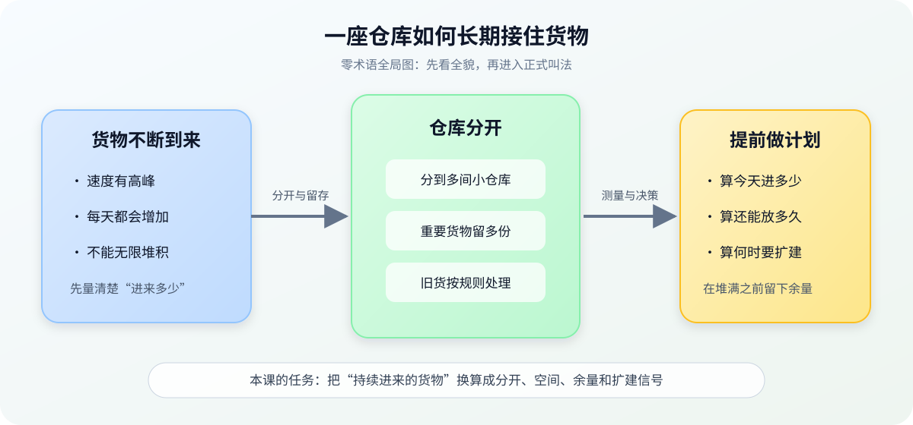
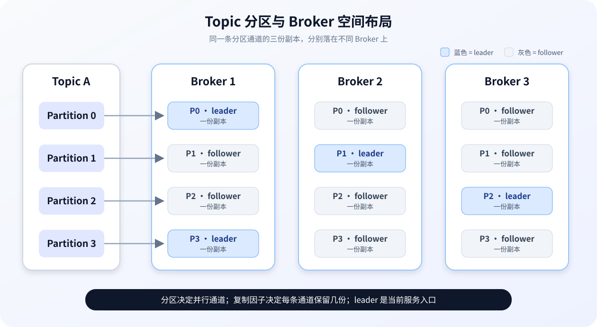

# 第 2 课：存储、容量与分区规划

> 所属阶段：阶段 1《集群运维基线》｜水平：入门｜目标：动手实操
> 故事情节：账单来了——磁盘、网络和恢复窗口开始为每一个分区收费。

> 📖 **结论已按官方文档核对**（核查于 2026-09 ｜ 来源：[Basic Kafka Operations](../../../web-index/kafka/topics/operations.md)、[Topic Configs](../../../web-index/kafka/topics/configuration.md)、[Broker Configs](../../../web-index/kafka/topics/configuration.md)、[Hardware and OS](../../../web-index/kafka/topics/operations.md)）。本课以 Kafka 4.3 文档作为概念和默认值核对基线；示例容量数字均明确标注为假设计算，不是生产阈值。
>
> ⚠️ **版本边界**：仓库现有本地 Compose 实验使用 Kafka 4.0.0 镜像；本课默认值按 Kafka 4.3 文档核对。真正执行命令前，请以目标环境的版本文档和 `--help` 输出为准。

## 🎯 本课目标

- 用吞吐、并行度、复制因子和恢复代价理解分区规模，而不是只凭经验填数字。
- 解释日志段、保留策略、清理、page cache 与文件系统的关系。
- 建立包含 headroom、复制放大和增长趋势的容量预警模型。

## 第一幕：起源与场景引入

业务团队提交了一张“新主题”的申请单：

> “这个新主题（Topic）峰值大约每秒 20 MiB，至少保留 7 天，读取方希望能同时开 6 个消费者实例。给我一个分区数和磁盘规格。”

看起来只是填三格表单，但你不能直接写“6 个分区、三副本、买几块盘”。因为这三个数字互相牵制：

1. 分区太少，消费者并行不起来；分区太多，又会增加管理对象和恢复工作。
2. 保留 7 天不等于磁盘只放 7 天的原始消息，还要算复制、压缩差异、日志段和安全余量。
3. 分区扩容不是随时可逆的按钮，Key 的分布和顺序语义可能因此变化。

### 一句话本质

**本课把“消息一直进来”变成一张可计算的账：分成多少份、每份留多久、要占多少空间、故障时要花多久恢复。**

### 处境对照

| 做法 | 眼前结果 | 后续风险 |
|------|----------|----------|
| 先拍一个分区数和磁盘数 | Topic 很快建出来，申请单也能关闭 | 消费者并行度、复制流量、保留空间和恢复窗口没有依据 |
| 先做分区与容量模型 | 先得到候选值，再用压测和运行数据校正 | 设计阶段多花几分钟，但扩容、迁移和磁盘告警更可控 |

> **数字来源说明**：20 MiB/s、7 天、6 个消费者是本课的虚构申请场景；后文 44.99 TiB 是按明确公式算出的示例结果，不代表任何通用容量建议。Kafka 4.3 的配置默认值和行为以官方文档为准，已在本课顶部留痕。

## 第二幕：认知冲突

### 冲突一：分区不是“越多越快”

分区数会影响消费者最大并行度，也会决定一个 Topic 的读写负载最多能分散到多少台服务器；但每增加一个分区，也增加一个日志目录对象、更多副本关系和更多需要观察的状态。**分区数是吞吐、并行和运维成本的共同旋钮。**

> 这里先把“分区”理解成一条可并行的通道；下一步会给出它在 Kafka 中的精确定义和规划约束。

### 冲突二：保留 7 天不是“7 天后立刻删除”

Kafka 按日志段进行保留和清理。日志段没有滚动出来，旧数据就可能还和新数据待在同一个文件里；清理还受检查周期、文件删除延迟和当前写入状态影响。**配置了时间，不等于磁盘会在某一秒精确腾出空间。**

### 冲突三：复制因子不是备份套餐

复制因子决定 Kafka 在集群内保留多少份副本，也会放大本地存储和复制流量。它提升的是集群内可用性和故障承受能力，不等于跨集群、跨区域的独立备份；跨集群灾备留到阶段 4。

## 第三幕：层层揭示

### 一眼全局图：先看仓库如何接住持续到来的货物

> **看图**：左边是货物不断到来，中间把货物分到多个小仓库并保留多份，右边再按时间和空间规则清理或扩建；本课要做的，就是在货物堆满之前先算清这四件事。

### 本课地图（分三步走）

| 步 | 这一步要解决什么（人话） | 对应知识点 |
|:--:|------------------------|-----------|
| 1 | 先决定消息要分成多少条并行通道，以及每条通道放几份 | 分区规模与并行度规划 |
| 2 | 再弄清数据文件怎样滚动、保留和清理 | 日志存储与保留生命周期 |
| 3 | 最后把速率、时间、复制和余量换算成磁盘与扩容信号 | 容量模型与增长预警 |

### 知识点一：分区规模与并行度规划

> 🧭 **第 1/3 步｜承接**：第二幕留下的问题是“分区不是越多越快” → **本步**：先把 Topic 拆成可并行、可放置、可恢复的最小通道。

#### 一句话定义

**分区（Partition）是 Topic 内可以独立读写和存储的一条日志通道；复制因子（Replication Factor）决定这条通道在集群内保留几份副本。**

#### 直觉建立：把总货架拆成多个通道

仓库只有一条传送带时，所有货物都排一队；增加传送带后，多个工人可以同时处理。但每条传送带都需要：

- 自己的货架和记录；
- 自己的搬运关系；
- 自己的故障和恢复状态；
- 一个消费者只能占用一条传送带的一个处理位置。

这个类比的边界是：Kafka 的分区不是简单的线程数开关；它还决定日志文件布局、leader/follower 副本关系和 Key 的路由结果。增加分区后，历史数据不会自动重新分布。

#### 核心原理：分区数的三个硬约束

官方 Basic Kafka Operations 文档给出了三个很实用的约束：

1. **一个分区的日志必须完整放在一台服务器上**；副本会分布在不同服务器，但单个分区的每份副本仍各自落在一台服务器上。
2. **分区数影响一个 Topic 的最大读写并行范围**；如果 Topic 有 20 个分区，不计副本，业务负载最多由 20 台服务器共同承接。
3. **分区数影响消费者的最大并行度**；消费者实例超过可分配的分区数时，多出来的实例没有分区可消费。

复制因子则是另一根轴：复制因子为 3，表示每个分区在集群中有 3 份副本；它会同时增加存储需求和副本复制流量。不要把“分区数”和“复制因子”混成一个数字。

> **看图**：每个 Topic 分成 4 条分区通道，每条通道有一份 leader 和两份 follower；分区决定并行通道数量，复制因子决定每条通道要保留几份，不是“4 个分区就只占 4 份数据”。

#### 一个候选值怎么出来

对第一幕的申请单，不能直接给最终答案，但可以先产生候选值：

| 约束 | 假设 | 推导 |
|------|------|------|
| 吞吐 | 压测得到单分区可持续承接 5 MiB/s | 20 ÷ 5 = 4，吞吐下限为 4 个分区 |
| 消费并行度 | 业务希望 6 个消费者实例同时工作 | 并行度下限为 6 个分区 |
| 候选分区数 | 同时满足上述两个下限 | 先选 max(4, 6) = 6，再用压测和恢复演练复核 |

上表中的 5 MiB/s 是假设的压测结果，不是 Kafka 默认能力。真实设计还要补查消息大小、Key 分布、单分区顺序要求、消费者处理时延、复制因子、Broker 网络和恢复窗口。

#### 分区扩容的不可逆风险

Kafka 官方文档明确提醒：动态增加分区可能改变默认分区器的 Key 映射。如果路由逻辑是 hash(key) % number_of_partitions，那么分区数变化后，同一个 Key 可能被送到不同分区，已有 Key 的顺序保证可能受到影响；Kafka 也不会自动重新分配历史数据。

因此，扩容前至少问三件事：

- 这个 Topic 是否依赖同 Key 有序？
- 消费者是否能接受新分区发现和短暂的元数据传播延迟？
- 新分区是否会让负载暂时不均匀，或让 auto.offset.reset=latest 的消费者错过窗口内的数据？

#### 常见误区

- **误区 1：**“分区越多，吞吐一定线性增长。”错；瓶颈可能在磁盘、网络、Broker 线程、消费者处理或 Key 热点。
- **误区 2：**“复制因子 3 等于跨机房灾备。”错；它是同一 Kafka 集群内的副本，跨集群恢复需要单独的方案和演练。
- **误区 3：**“消费者实例想扩多少都可以。”错；同一消费者组在一个 Topic 上的有效并行度受分区数限制。
- **误区 4：**“分区扩容只是把旧数据平均搬开。”错；历史数据不会自动重新分布，Key 路由和顺序还可能发生变化。

#### 行话锚定

| 行话 | 在哪里遇到 |
|------|------------|
| Partition（分区） | kafka-topics.sh --describe、Topic 配置、消费者组分配 |
| Replication Factor（复制因子） | Topic 创建命令、分区描述、重分配计划 |
| Leader / Follower | 分区描述、ISR、Broker 指标和故障排查 |
| Key distribution（Key 分布） | Producer 分区器、分区扩容评审、顺序语义排查 |

#### 一句话记住

**分区数决定能并行多少，复制因子决定要保留几份；先满足业务约束，再用压测验证候选值。**

📚 **官方文档**： [Basic Kafka Operations：partition count / replication factor / increasing partitions](https://kafka.apache.org/43/operations/basic-kafka-operations/) ｜ 本教程路由：[operations 聚焦索引](../../../web-index/kafka/topics/operations.md)

### 知识点二：日志存储与保留生命周期

> 🧭 **第 2/3 步｜承接**：上一步决定了“有多少条通道、每条保留几份” → **本步**：把每条通道上的数据文件变成会滚动、会保留、会清理的生命周期。

#### 一句话定义

**日志段（Log Segment）是分区日志的文件单元；保留策略决定哪些旧段可以删除或压实，segment 的滚动决定清理何时有机会发生。**

#### 直觉建立：账本写满一册就封存

一本正在填写的账本不能随时撕掉前几页，否则正在写的人会失去连续记录。更安全的做法是：

1. 当前册继续写；
2. 到大小或时间条件后封册，开启下一册；
3. 已封存的旧册按保存规则删除，或把同一 Key 的旧版本压实为最新版本。

类比的边界是：Kafka 的删除发生在日志段级别，不保证“某条消息到点立即消失”；压实也不是简单按文件大小删除，而是针对 Key 的保留语义。

#### 核心原理：从写入到清理

~~~mermaid
stateDiagram-v2
    [*] --> ActiveSegment: 当前写入
    ActiveSegment --> RolledSegment: 达到 segment.bytes 或 segment.ms
    RolledSegment --> EligibleForCleanup: 满足 retention 条件
    EligibleForCleanup --> Deleted: cleanup.policy=delete
    EligibleForCleanup --> Compacted: cleanup.policy=compact
    EligibleForCleanup --> DeletedAndCompacted: cleanup.policy=delete,compact
    Deleted --> [*]
    Compacted --> [*]
    DeletedAndCompacted --> [*]
~~~

> **看图**：只有已经滚动出来的旧日志段，才会进入“可按规则清理”的候选；当前正在写的段、时间条件和清理策略共同决定磁盘何时下降。

#### 多种保留策略对照

| 本课说法（人话） | 行业标准叫法 | 典型配置 / 在哪遇到 | 代价 |
|------------------|--------------|---------------------|------|
| 到期整册丢掉 | delete | cleanup.policy=delete；事件流、可重放窗口 | 需要接受历史消息过期，清理不一定瞬时完成 |
| 每个 Key 只留最新有效值 | compact | cleanup.policy=compact；状态、配置、用户最新快照 | 清理是渐进式，仍可能暂时存在旧版本和 tombstone |
| 先按时间/大小删除，再做 Key 压实 | delete,compact | cleanup.policy=delete,compact；既要有限窗口又要最新状态 | 规则叠加，容量和恢复行为更复杂 |

#### Kafka 4.3 配置基线

下面是本课按官方 Kafka 4.3 Topic Configs 页面核对的默认值：

| 配置 | 官方默认值 | 作用 |
|------|------------|------|
| cleanup.policy | delete | 默认按时间或大小删除旧日志段 |
| retention.ms | 604800000（7 天） | delete 策略下的时间上限 |
| retention.bytes | -1 | 默认没有按大小设置上限，实际容量仍需由运维模型约束 |
| segment.bytes | 1073741824（1 GiB） | 单个日志段的目标大小；清理按文件进行，越大越不细粒度 |
| segment.ms | 604800000（7 天） | 即使段未写满，也允许按时间滚动以便清理/压实 |

这些默认值不应脱离版本使用。尤其是 retention.ms=7 天不是“任何 Topic 都应该保留 7 天”，只是官方文档的默认配置。

#### page cache 与刷盘边界

Kafka 使用普通磁盘文件，Linux 会把写入先放进 page cache，再由应用 fsync 或操作系统后台策略刷到磁盘。官方 Hardware and OS 页面指出，page cache 能帮助操作系统批量和重排小写入；但当后台刷盘跟不上写入时，写入过程最终会阻塞并抬高延迟。

Topic Configs 页面还明确写出：一般建议依赖复制和操作系统后台刷盘，不要随意把 flush.messages 或 flush.ms 配成极小值来追求“每条消息都刷盘”。这不是说 fsync 永远不能用，而是说它会把持久性策略和吞吐/延迟代价绑在一起，必须有明确需求和实测依据。

#### 文件系统选择的正确读法

官方文档没有说 Kafka 强依赖某一种文件系统，而是指出 EXT4 与 XFS 都被广泛使用，并报告其测试中 XFS 具有更好的性能特征和较低波动；文档给出的 160ms 对比 250ms+ 是官方测试背景下的结果，**不是你所有机器都必然复现的固定收益**。[Hardware and OS](https://kafka.apache.org/43/operations/hardware-and-os/)（核查于 2026-09）

#### 常见误区

- **误区 1：**“retention.ms 到点就删除单条消息。”错；保留和清理以日志段为重要边界，并受滚动和清理时机影响。
- **误区 2：**“retention.bytes=-1 就不用管磁盘。”错；它只表示默认没有 Topic 大小上限，运维仍必须做容量和告警。
- **误区 3：**“把 flush.messages=1 就能替代副本。”错；官方通常建议依靠复制和 OS 后台刷盘，逐消息 fsync 会改变性能特征。
- **误区 4：**“XFS 的官方测试数字就是我的 SLO。”错；官方测试可作为方向性依据，自己的磁盘、内核和负载仍要实测。

#### 行话锚定

| 行话 | 在哪里遇到 |
|------|------------|
| Log Segment（日志段） | segment.bytes、segment.ms、日志目录、磁盘清理 |
| Retention（保留） | retention.ms、retention.bytes、容量规划 |
| Log Compaction（日志压实） | cleanup.policy=compact、状态 Topic、tombstone |
| Page Cache | Linux /proc/meminfo、磁盘延迟、刷盘和恢复排障 |

#### 一句话记住

**Kafka 的磁盘不是一桶无限增长的消息，而是一组会滚动、按段清理、受策略和刷盘节奏影响的日志文件。**

📚 **官方文档**： [Topic Configs：cleanup / retention / segment](https://kafka.apache.org/43/configuration/topic-configs/) ｜ [Hardware and OS：page cache / filesystem](https://kafka.apache.org/43/operations/hardware-and-os/) ｜ 本教程路由：[configuration 聚焦索引](../../../web-index/kafka/topics/configuration.md)

### 知识点三：容量模型与增长预警

> 🧭 **第 3/3 步｜承接**：上一步知道了日志怎样滚动和清理 → **本步**：把写入速率、保留时间、复制和安全余量换算成可执行的容量计划。

#### 一句话定义

**容量模型是对未来一段时间内存储、网络和恢复资源的粗估，用来决定扩容时机；它不是把某个结果当成永久真理。**

#### 直觉建立：先算仓库底线，再看今天剩多少

只看“当前磁盘还剩 40%”像只看仓库今天有多少空位，却不问每天进来多少货、每件要留几份、清理是否跟得上。容量模型至少要回答：

- 每秒有多少原始数据写入？
- 要保留多长时间？
- 集群内保留几份？
- 压缩后大小会变多少？
- 需要为副本追赶、故障恢复、系统和临时峰值留下多少余量？

#### 核心公式：先用粗估筛掉明显错误的方案

在“均匀写入、无压缩、所有副本都本地保存”的简化假设下：

~~~text
原始保留量 = 写入速率 × 保留秒数
副本后容量 = 原始保留量 × 复制因子
规划容量 = 副本后容量 × (1 + headroom)
~~~

这个公式故意简单：压缩、批次开销、索引、日志清理滞后、分区不均衡、操作系统保留空间和恢复临时空间都需要在正式设计中补充验证。

~~~mermaid
flowchart LR
    A[写入速率] --> B[保留秒数]
    B --> C[原始保留量]
    C --> D[复制因子]
    D --> E[副本后容量]
    E --> F[安全余量]
    F --> G[规划容量]
~~~

> **看图**：先把“每秒进多少”乘上“留多久”，得到原始保留量；再乘副本数，最后加上不能被业务数据吃掉的安全余量，才得到可拿来做扩容评审的规划容量。

#### 数字算给你看：20 MiB/s、7 天、三副本、30% 余量

这是第一幕的虚构申请单，不是生产推荐。用命令复算：

~~~bash
awk 'BEGIN {
  rate=20
  days=7
  rf=3
  headroom=0.30
  raw=rate*86400*days
  replicated=raw*rf
  planned=replicated*(1+headroom)
  printf "raw=%.0f MiB\nreplicated=%.0f MiB\nwith_headroom=%.0f MiB\nwith_headroom=%.2f TiB\nideal_per_broker=%.2f TiB\n", raw, replicated, planned, planned/1024/1024, planned/1024/1024/3
}'
~~~

本轮实际运行输出：

~~~text
raw=12096000 MiB
replicated=36288000 MiB
with_headroom=47174400 MiB
with_headroom=44.99 TiB
ideal_per_broker=15.00 TiB
~~~

这组数字应这样读：

1. 20 MiB/s 连续写 7 天，原始数据约 11.54 TiB。
2. 三副本后约 34.61 TiB。
3. 加 30% headroom 后约 44.99 TiB。
4. 如果 3 台 Broker 完全均匀，平均约 15 TiB/台；真实副本和 leader 分布不保证完美均匀，不能把 15 TiB 当作每台的硬上限。

#### 从容量模型推导预警信号

| 资源 | 要观察的趋势 | 为什么不能只看一个百分比 |
|------|--------------|--------------------------|
| 磁盘 | 使用量、增长斜率、日志目录离线、清理滞后 | 磁盘可能还没满，但恢复余量已经不够 |
| 网络 | 客户端写入、Follower 复制、搬迁流量 | 复制追赶会和业务写入争用带宽 |
| 恢复窗口 | 副本追赶速度、故障后重建时间 | 空间够不代表能在业务允许时间内恢复 |
| 分区与分布 | 每个 Broker 的分区数、leader 数、最大分区大小 | 集群平均值可能掩盖单个热点 Broker |
| 消息大小与压缩 | 批次大小、压缩后字节、异常大消息 | 原始速率和实际落盘量可能不同 |

#### 容量不足时的多策略对照

| 解法 | 适合解决什么 | 代价 / 边界 |
|------|--------------|-------------|
| 扩大磁盘或增加 Broker | 业务增长真实、保留要求不能降 | 还要做数据搬迁；新 Broker 不会自动承接旧数据 |
| 缩短 retention.ms / retention.bytes | 历史重放窗口可以缩短 | 读者必须在更短时间内完成消费，数据治理要先获业务确认 |
| 调整压缩与消息批次 | 网络和磁盘都受压，且客户端可配合 | CPU 会增加；不能把压缩收益当成固定比例 |
| 启用分层存储 | 热数据和冷数据访问模式差异明显 | 引入额外存储系统和运维面，需在阶段 4/后续专题单独评估 |

#### 常见误区

- **误区 1：**“按磁盘总容量平均除以 Broker 数就够了。”错；要加复制、分区不均衡、故障恢复和 headroom。
- **误区 2：**“30% headroom 是 Kafka 官方固定值。”错；本课只是示例假设，真实余量应由业务峰值和恢复目标决定。
- **误区 3：**“容量不够就把 retention.bytes 改小。”错；这是业务数据保留策略变更，必须确认消费和合规要求。
- **误区 4：**“平均每台 15 TiB 就能安全装 15 TiB。”错；平均值不是故障时的可用容量，也没有覆盖搬迁和恢复临时空间。

#### 行话锚定

| 行话 | 在哪里遇到 |
|------|------------|
| Headroom（安全余量） | 容量评审、扩容阈值、故障恢复预算 |
| Ingress / Egress | 业务写入、客户端读取、网络容量看板 |
| Replica traffic（副本流量） | Follower 追赶、重分配、Broker 网络指标 |
| Recovery window（恢复窗口） | 故障演练、SLO、容量和扩容决策 |

#### 一句话记住

**容量规划不是问“今天还剩多少”，而是算“按当前增长和最坏操作，系统还能安全撑多久”。**

📚 **官方文档**： [Topic Configs：retention / segment](https://kafka.apache.org/43/configuration/topic-configs/) ｜ [Basic Kafka Operations：partition / replication](https://kafka.apache.org/43/operations/basic-kafka-operations/) ｜ [Hardware and OS](https://kafka.apache.org/43/operations/hardware-and-os/) ｜ 本教程路由：[运维专线聚焦索引](../../../web-index/kafka/index.md)

## 第四幕：实操验证——把申请单变成容量评审单

本课不启动或修改 Kafka 集群；练习分成“只读检查”和“离线计算”两类。以下命令从学习仓库根目录执行。

### 4.1 机制验证

### 练习 1：查看一个 Topic 的分区与副本状态

仅在你自行启动实验集群后执行，并将占位符替换为自己的值：

~~~bash
docker exec <CONTAINER> bash -c '
  export PATH=/opt/kafka/bin:$PATH
  unset KAFKA_JMX_OPTS
  kafka-topics.sh \
    --bootstrap-server <BROKER_ENDPOINT> \
    --describe \
    --topic <TOPIC_NAME>
'
~~~

把输出中的以下字段抄进评审单：

| 字段 | 要回答的问题 |
|------|--------------|
| PartitionCount | 当前并行通道有多少条？ |
| ReplicationFactor | 每条通道保留几份？ |
| Replicas | 每个分区落在哪些 Broker？ |
| Isr | 哪些副本当前跟得上？ |
| Leader | 客户端当前主要访问哪份副本？ |

### 练习 2：复算容量模型

先用上面的 awk 示例复算 44.99 TiB，再把四个假设换成自己的申请单：写入速率、保留天数、复制因子、headroom。**换参数后的结果必须重新标注为你的假设计算。**

### 练习 3：填写容量评审单

| 项目 | 当前值 / 假设 | 证据或来源 | 是否需要复核 |
|------|---------------|------------|--------------|
| 峰值写入速率 | | 压测 / 业务峰值 | |
| 平均写入速率 | | 监控 / 业务估算 | |
| 保留时间 | | 业务确认 | |
| 复制因子 | | Topic 描述 | |
| 分区数 | | 并行度 + 压测 | |
| 压缩后落盘比例 | | 实测 | |
| headroom | | 故障与恢复目标 | |
| 每 Broker 目标水位 | | 容量模型 | |
| 扩容触发条件 | | 监控与变更流程 | |

### 练习 4：给分区扩容做“先不执行”评审

在真正执行 --alter --partitions 之前，写下这四个答案：

1. 扩容会不会破坏同 Key 顺序或路由假设？
2. 新分区的消费者发现和 offset 起点如何处理？
3. 扩容后的副本分布是否仍符合故障域设计？
4. 如果新分区负载不均或消费者落后，回退和补偿怎么做？

只要其中一项答不上来，状态就应是“待评估”，不要把命令直接放进生产变更单。

### 4.2 应用实战：Topic 容量评审单（入口）

> 🎯 **本课应用实战独立成篇**：[第 2 课实战 · Topic 容量评审单](../../../应用实战/02-存储、容量与分区规划.md)
> 含**分步设计图**与“基础 → 综合”的完整演进；通览全部：📚 [应用实战索引](../../../应用实战/INDEX.md)
> **课内不重复实战正文**：本课负责讲清容量和分区计算，实战篇负责带着你把申请变成评审单。

## 第五幕：体系收束

本课把上一课的“值班地图”向下推进了一层：

~~~mermaid
flowchart LR
    A[写入速率] --> B[分区并行度]
    A --> C[保留周期]
    B --> D[Broker 分布与消费者并行]
    C --> E[日志段与清理]
    D --> F[复制因子与恢复代价]
    E --> F
    F --> G[磁盘 / 网络 / 恢复窗口 / 扩容信号]
~~~

> **看图**：写入速率同时影响“怎么分”和“要存多久”；分区、日志生命周期和复制因子最后汇聚成磁盘、网络与恢复压力。下一阶段会把这张账变成 Topic 创建、配置变更和数据搬迁动作。

### 🐞 常见误区速查

| 误区 | 正确判断 |
|------|----------|
| 分区越多越快 | 先看消费者并行、单分区压测、Broker 资源和恢复代价 |
| RF=3 就是灾备 | 这是集群内副本，不是跨集群恢复 |
| retention.ms 到点立即释放磁盘 | 清理受日志段滚动、检查周期和文件删除影响 |
| retention.bytes=-1 不会爆盘 | 默认不限 Topic 大小，更要靠容量模型和告警 |
| 30% headroom 是统一标准 | 只是本课示例，实际要按峰值与恢复目标确定 |
| 分区扩容可随时回退 | Kafka 不支持直接减少分区，扩容前要评估 Key 路由和顺序 |

### 一图总结

~~~mermaid
flowchart TB
    A[存储 / 容量 / 分区规划] --> B[分区规模]
    A --> C[日志生命周期]
    A --> D[容量模型]
    B --> B1[并行度 / 副本 / 分布]
    C --> C1[segment / retention / cleanup]
    D --> D1[速率 / 时间 / RF / headroom]
    B1 --> E[恢复与运维代价]
    C1 --> E
    D1 --> E
~~~

> **三方分界**：课首 SVG 讲“持续进来的货物要怎样被分、存、清”；这里的一图总结讲“刚学完，规划由哪些知识组成”；下一课进入 Topic 生命周期和配置治理。

## 🧪 课后小测

1. 为什么 20 MiB/s 的 Topic 不能只按吞吐除以单分区能力决定分区数？

因为还要同时满足消费者并行度、Key 分布、单分区顺序、Broker 资源、复制和恢复窗口等约束。吞吐计算只能先给出一个下限。

2. Kafka 4.3 的 retention.bytes=-1 代表什么？

代表默认没有按 Topic 大小设置上限，不代表磁盘无限，也不代表运维可以省略容量模型。

3. 为什么日志段大小会影响保留的精细程度？

因为保留和清理按日志段进行；段越大，文件数量可能更少，但清理边界更粗，旧数据可能等待更久才被释放。

4. 为什么分区扩容可能影响同 Key 顺序？

如果分区器的路由依赖 hash(key) % 分区数，分区数变化会改变映射，同一个 Key 可能进入不同分区，从而影响已有 Key 的顺序保证。

## 命令速查卡

| 目的 | 命令 |
|------|------|
| 查看 Topic 分区与副本 | kafka-topics.sh --bootstrap-server <BROKER_ENDPOINT> --describe --topic <TOPIC_NAME> |
| 查看 Topic 配置覆盖 | kafka-configs.sh --bootstrap-server <BROKER_ENDPOINT> --entity-type topics --entity-name <TOPIC_NAME> --describe |
| 复算容量示例 | awk 'BEGIN {rate=20; days=7; rf=3; headroom=0.30; print rate*86400*days*rf*(1+headroom)}' |
| CLI 继承 JMX Exporter 时 | docker exec <CONTAINER> bash -c 'export PATH=/opt/kafka/bin:$PATH; unset KAFKA_JMX_OPTS; <COMMAND>' |

> <BROKER_ENDPOINT>、<TOPIC_NAME>、<CONTAINER> 是占位符；替换成自己的环境值。不要把真实内网地址或凭据写入可分享的学习档案。

## 📚 官方文档

- [Basic Kafka Operations：Topic、分区、复制、扩容注意事项](https://kafka.apache.org/43/operations/basic-kafka-operations/)
- [Topic Configs：cleanup.policy、retention、segment、flush](https://kafka.apache.org/43/configuration/topic-configs/)
- [Broker Configs：Broker 级配置](https://kafka.apache.org/43/configuration/broker-configs/)
- [Hardware and OS：page cache、文件系统与数据目录](https://kafka.apache.org/43/operations/hardware-and-os/)
- [本子教程官方文档聚焦索引](../../../web-index/kafka/index.md)

## 🎉 阶段完成 · 下一阶段接力提示词

> 本课是阶段 1《集群运维基线》的最后一课。学完本批后，**复制下面这段文字发给 AI**，即可进入阶段 2：

~~~text
继续学 Kafka 运维方向子教程。我的学习档案在 kafka/kafka-operations/00-学习档案.md，
刚完成阶段 1《集群运维基线》，已学完知识点：运维对象分层与集群基线、环境拓扑与故障域基线、SLO/值班台账/runbook、分区规模与并行度规划、日志存储与保留生命周期、容量模型与增长预警，
请按大纲开始阶段 2《日常操作与容量治理》的课《Topic 生命周期与配置治理》。
~~~

## 🧭 课程导航

- **上一课**：[课 1：运维全景与集群基线](lesson-01-运维全景与集群基线.md)
- **下一课**：[课 3：Topic 生命周期与配置治理](../../2-日常操作与容量治理/lessons/lesson-03-Topic生命周期与配置治理.md)
- **返回目录**：[Kafka 运维方向子教程课程目录](../../../02-课程目录.md)
