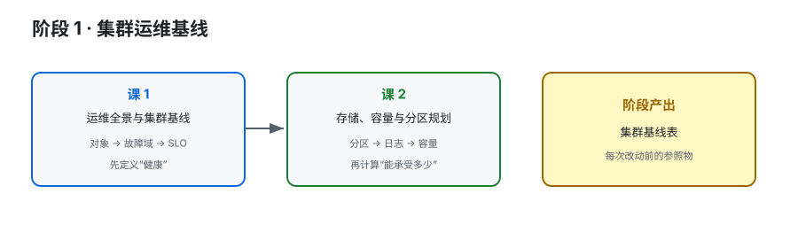

# 阶段 1：集群运维基线

> 所属课程：Kafka 运维方向子教程 ｜ 故事章节：先知道自己守着什么 ｜ [返回总览](../../01-学习路径总览.md)

## 🎯 本阶段目标

- 建立 Kafka 集群从角色、存储、网络到客户端的运维对象地图。
- 能为一个新集群记录故障域、版本、容量和 SLO 基线。
- 理解分区规模、日志生命周期和增长速度如何变成运维风险。

## 📍 学习重点

- Kafka 集群不是“几台机器”，而是 Broker、Controller、元数据日志、业务日志、客户端和外部监控共同组成的系统。
- 容量规划不是只看磁盘剩余，还要同时看分区数、复制因子、保留周期、网络和恢复窗口。
- 运维判断必须有基线：没有基线，就没有“异常”的定义。

## ✅ 必须掌握的知识点

| 知识点 | 所属课 | 学完应能 |
|--------|--------|----------|
| 运维对象分层与集群基线 | 课 1 | 说清 Broker、Controller、元数据和日志目录各自承担什么责任 |
| 环境、拓扑与故障域基线 | 课 1 | 画出节点、机架/可用区、磁盘与客户端的故障边界 |
| SLO、值班台账与 runbook | 课 1 | 写出健康判据、值班检查项和升级出口 |
| 分区规模与并行度规划 | 课 2 | 用吞吐、并发和恢复代价估算分区规模 |
| 日志存储与保留生命周期 | 课 2 | 解释 segment、保留、清理和 page cache 的关系 |
| 容量模型与增长预警 | 课 2 | 建立磁盘、网络、复制流量和增长趋势的预警模型 |

## 🗺️ 本阶段路径图

> SVG 展示从对象地图到容量模型的学习顺序；先有基线，后谈容量和风险。

## 本阶段产出

- [x] [lessons/lesson-01-运维全景与集群基线.md](lessons/lesson-01-运维全景与集群基线.md)
- [x] [lessons/lesson-02-存储、容量与分区规划.md](lessons/lesson-02-存储、容量与分区规划.md)
