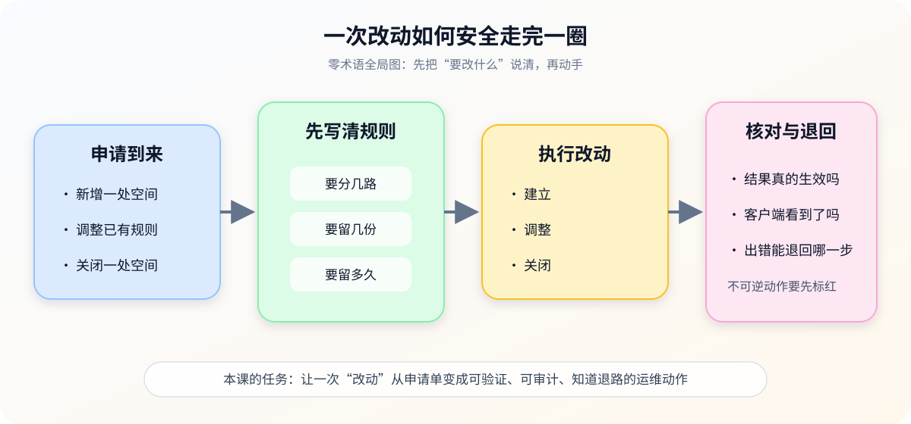
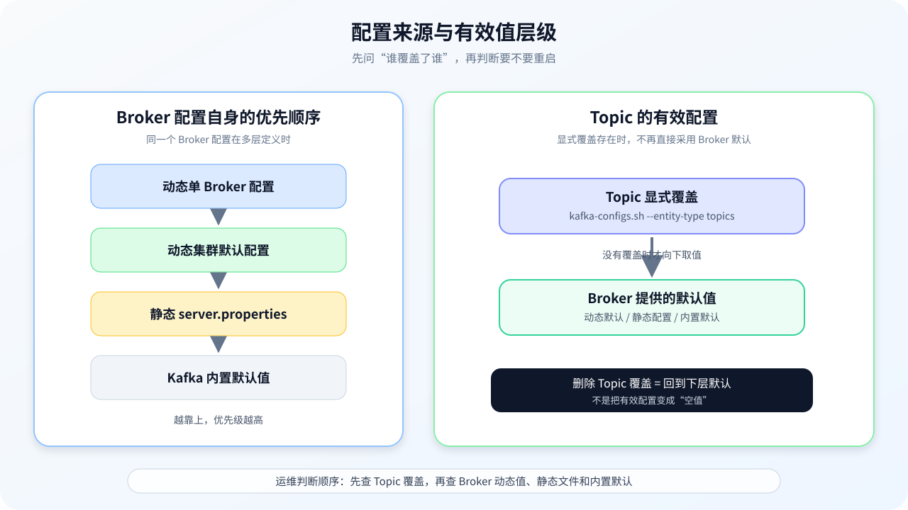

# 第 3 课：Topic 生命周期与配置治理

> 所属阶段：阶段 2《日常操作与容量治理》｜水平：入门｜目标：动手实操
> 故事情节：申请单来了——“帮我建个 Topic”，但每一个默认值都可能变成未来的事故。

> 📖 **结论已按官方文档核对**（核查于 2026-09 ｜ 来源：[Basic Kafka Operations](../../../web-index/kafka/topics/operations.md)、[Topic Configs](../../../web-index/kafka/topics/configuration.md)、[Broker Configs](../../../web-index/kafka/topics/configuration.md)）。本课以 Kafka 4.3 文档作为概念、命令和默认值核对基线；命令示例均使用占位符，删除和扩分区示例只用于演练前评审。
>
> ⚠️ **版本边界**：仓库现有本地 Compose 实验使用 Kafka 4.0.0 镜像；本课默认值按 Kafka 4.3 文档核对。真正执行命令前，请以目标环境的版本文档和 --help 输出为准。

## 🎯 本课目标

- 写出可复用的 Topic 创建基线，并识别业务 Topic 与内部 Topic 的保护边界。
- 区分 Broker 默认值、Topic 覆盖值、动态配置和静态配置，知道变更在哪里生效。
- 安全处理分区扩容、Topic 删除和保留策略变更，给出前后验证与回滚边界。

## 第一幕：起源与场景引入

值班群里来了一张申请单：

> “请为订单事件建立一个叫 orders-events 的消息空间：12 条并行通道、每条保留 3 份、至少保存 7 天；生产者必须在两份副本跟上时才算写成功；另外不要让第一次写入自动创建未知的消息空间。今天能直接执行吗？”

申请人看见的是几个数字，你看见的是一条完整生命周期：

1. 这是不是允许业务团队自己管理的 Topic（消息空间），还是 Kafka 内部状态 Topic？
2. 12 条通道和 3 份副本是否符合阶段 1 的并行、容量和故障域基线？
3. 可靠性写在 Topic 配置里后，生产者是否真的使用了“等待同步副本确认”的 acks=all？
4. 以后谁能改保留时间？改完如何证明生效？如果分区不够，能不能退回？

### 一句话本质

**Topic 治理不是“把一条命令跑通”，而是给一块消息空间建立明确的创建规则、配置来源、变更证据和不可逆边界。**

### 处境对照

| 做法 | 当下看起来 | 后续可能发生 |
|------|------------|--------------|
| 直接执行创建命令 | Topic 立刻出现，申请单关闭 | 默认副本、自动创建、保留时间和写入可靠性没有被确认 |
| 先形成 Topic 变更单 | 创建值、配置来源、验证命令和退路都写清楚 | 执行前多花几分钟，但后续扩容、审计和事故排查有证据 |

> **场景数字说明**：12 个分区、复制因子 3、最少同步副本数（min.insync.replicas）=2 和 7 天保留是虚构申请单，不是通用生产阈值；真正数值必须接上课 2 的容量、并行和恢复模型。

## 第二幕：认知冲突

### 冲突一：命令返回成功，不等于基线正确

Topic 创建命令只说明这次请求被接受了。它不自动回答命名是否合规、分区是否够用、复制是否跨故障域、写入端是否使用 acks=all，也不替你确认后续谁能改配置。

**运维成功的定义要从“命令返回 0”升级为“目标状态、客户端行为和审计证据都对得上”。**

### 冲突二：默认值不是中立值

Kafka 4.3 文档中的自动创建开关（auto.create.topics.enable）默认值为 true，新 Topic 默认复制因子（default.replication.factor）为 1，最少同步副本数（min.insync.replicas）默认为 1。默认值方便快速启动，却未必符合生产 Topic 的可靠性和命名治理要求。

所以“没写配置”也是一种配置选择：它把决策交给了 Broker 默认值和当时的环境状态。

### 冲突三：在线变更不等于可回退

Topic 配置覆盖通常可以在线增加或删除，但分区数只能增加、不能直接减少；删除 Topic 更是破坏性动作。**是否在线**回答的是“要不要重启”，**是否可逆**回答的是“失败后能不能回到原状态”，这是两条不同的轴。

## 第三幕：层层揭示

### 一眼全局图：一次改动如何安全走完一圈

> **看图**：左边是申请，中间先写清分路、份数和时间，再执行建立或调整；右边必须核对结果，并把不可逆动作的退路提前写出来。

### 本课地图（分三步走）

| 步 | 这一步要解决什么（人话） | 对应知识点 |
|:--:|------------------------|-----------|
| 1 | 先给一块消息空间写好创建时的责任和可靠性规则 | Topic 创建基线 |
| 2 | 再判断一个值来自哪里、改了是否需要重启、怎样回到默认 | 配置层级与在线变更 |
| 3 | 最后处理扩分区、删 Topic 和保留策略，把不可逆风险单独标红 | 分区扩容、删除与保留策略 |

### 知识点一：Topic 创建基线

> 🧭 **第 1/3 步｜承接**：第二幕留下的问题是“命令成功为什么仍不代表基线正确” → **本步**：先把创建请求拆成名称、分区、副本和写入可靠性四类检查。

#### 一句话定义

**Topic 创建基线，是在 Topic 第一次出现时明确写下分区数、复制因子、可靠性配置、保留策略和管理责任的一组初始约束。**

#### 直觉建立：给一间新仓库发使用证

把 Topic 想成一间新仓库。申请人不应该只报一个名字，还要说明：

- 仓库分成几条通道，避免所有货物排成一队；
- 每件货物留几份，避免一台机器坏了就只剩一份；
- 至少几份仍在岗时才允许继续收货；
- 货物保留多久，避免仓库无期限增长；
- 谁负责这间仓库，出现异常时谁确认。

类比的边界是：Topic 不是物理仓库，分区和副本还会受到客户端路由、故障域和控制面状态影响；这张申请单只是把运维决策显式化。

#### 核心原理：四项创建检查

1. **先确认对象类型**：业务 Topic 可以按团队规则创建；Kafka 内部状态 Topic 由系统管理，不应当按普通业务 Topic 手工改分区或配置。
2. **显式写分区和复制因子**：分区数承接课 2 的并行与恢复模型；复制因子承接故障域和容量模型。不要依赖默认复制因子 1。
3. **把写入可靠性拆成两端**：Topic 的 min.insync.replicas 规定 ISR 至少剩几份时才允许 acks=all 写入成功；生产者仍必须把 acks 设置为 all 或 -1。RF=3、min.insync.replicas=2 不是“永远三份都写完才返回”，而是 ISR 少于 2 时拒绝这类写入，ISR 有 3 份时 acks=all 仍会等待 3 份确认。
4. **保留和自动创建要有明确归属**：保留时间、大小、cleanup.policy 等属于 Topic 初始策略；是否允许未知 Topic 被第一次写入自动创建，则是 Broker 级治理选择，不要把两者混成一个 Topic 参数。

~~~mermaid
flowchart LR
    A[申请单] --> B{业务 Topic?}
    B -->|是| C[核对名称与责任人]
    C --> D[确定分区与复制因子]
    D --> E[确定 min.insync.replicas 与保留]
    E --> F[显式创建]
    B -->|否：内部 Topic| G[停止手工创建或扩分区]
~~~

> **看图**：正常业务 Topic 沿着“名称 → 分区/副本 → 可靠性/保留 → 创建”向右走；一旦发现是内部 Topic，就在分支处停止，不把系统状态当成普通业务对象。

#### 创建命令与申请单

下面是一个“显式创建”的示例，数字只对应第一幕的虚构申请单；执行前必须换成自己的环境值，并完成变更审批：

~~~bash
docker exec <CONTAINER> bash -c '
  export PATH=/opt/kafka/bin:$PATH
  unset KAFKA_JMX_OPTS
  kafka-topics.sh \
    --bootstrap-server <BROKER_ENDPOINT> \
    --create \
    --topic <TOPIC_NAME> \
    --partitions 12 \
    --replication-factor 3 \
    --config min.insync.replicas=2 \
    --config cleanup.policy=delete \
    --config retention.ms=604800000
'
~~~

这条命令只表达了 Topic 的创建请求，不替代创建后的验证。至少要再查看分区、复制因子、Replicas、Isr、Leader 和显式配置覆盖。

如果组织决定禁止未知 Topic 自动出现，Broker 配置可以采用下面的治理方向：

~~~properties
auto.create.topics.enable=false
~~~

这是 Broker 级配置；Kafka 4.3 文档把它标为 read-only，不能把它当作普通 Topic 在线覆盖。修改时要进入维护窗口，并先确认所有生产者都显式创建目标 Topic。

#### 创建前评审单

| 项目 | 本例值 | 必须回答 |
|------|--------|----------|
| Topic 名称 | orders-events | 是否符合命名、归属和生命周期规则 |
| 类型 | 业务 Topic | 是否误指向内部状态 Topic |
| 分区数 | 12 | 是否满足并行、单分区吞吐和恢复窗口 |
| 复制因子 | 3 | 是否满足故障域、容量和副本流量约束 |
| min.insync.replicas | 2 | 生产者是否使用 acks=all；ISR 少于 2 时业务如何处理 |
| cleanup.policy | delete | 是事件保留窗口，还是应使用 compact 的最新状态语义 |
| retention.ms | 604800000 | 7 天是否得到业务确认；容量模型是否能承受 |
| 自动创建 | 组织策略 | 是否关闭 Broker 自动创建；客户端是否会先显式创建 |
| Owner / 值班出口 | 待填写 | 出故障谁确认、谁批准保留策略变化 |

#### 常见误区

- **误区 1：**“RF=3 后业务天然强持久。”错；生产者还要使用 acks=all，并结合 min.insync.replicas 形成写入门槛。
- **误区 2：**“min.insync.replicas=2 会让每次写入永远等 2 份。”错；acks=all 会等待当前 ISR 中的所有副本确认，minISR 主要规定 ISR 太少时拒绝写入。
- **误区 3：**“所有 Topic 都能用同一个默认值。”错；事件流、状态 Topic、审计数据的保留和压实语义不同。
- **误区 4：**“内部 Topic 只是名字特殊的业务 Topic。”错；官方文档明确把内部状态 Topic 列为不应手工增加分区的对象。

#### 行话锚定

| 行话 | 在哪里遇到 |
|------|------------|
| Topic | kafka-topics.sh、Topic 配置、ACL 和监控标签 |
| Replication Factor | 创建命令、Topic describe、分区重分配计划 |
| min.insync.replicas | Topic 配置、NotEnoughReplicas / NotEnoughReplicasAfterAppend |
| acks=all / -1 | Producer 配置、写入可靠性排查 |
| Internal Topics | __consumer_offsets、__transaction_state、__share_group_state、__cluster_metadata |

#### 一句话记住

**创建 Topic 时显式写下“分几路、留几份、何时算写成功、保留多久、谁负责”，就是在给未来的运维动作建立起点。**

📚 **官方文档**：[Basic Kafka Operations：Topic 创建、复制因子、内部 Topic](https://kafka.apache.org/43/operations/basic-kafka-operations/) ｜ [Topic Configs：min.insync.replicas](https://kafka.apache.org/43/configuration/topic-configs/) ｜ [Broker Configs：自动创建与默认复制因子](https://kafka.apache.org/43/configuration/broker-configs/) ｜ 本教程路由：[operations 聚焦索引](../../../web-index/kafka/topics/operations.md)

### 知识点二：配置层级与在线变更

> 🧭 **第 2/3 步｜承接**：上一步建立了 Topic 的初始规则 → **本步**：追踪一个配置值从哪里来、谁覆盖谁，以及改变它是否需要重启。

#### 一句话定义

**配置层级治理，就是先定位有效值的来源，再选择合适的变更入口，并验证新值已经在目标范围生效。**

#### 直觉建立：小区公约、楼栋规则和住户申请

同一件事可能有三层规则：

- 整个小区的公约；
- 某栋楼的规则；
- 某一户的特殊申请。

住户特殊申请存在时，不能只看小区公约；特殊申请撤销后，才回到下层规则。Kafka 的 Topic 显式覆盖、Broker 默认和内置默认也有类似关系。

类比的边界是：Kafka 还有动态单 Broker 配置、动态集群默认配置和静态 server.properties；它们的生效范围和是否需要重启必须查具体配置的 Update Mode，不能只凭“层级”猜。

> **看图**：左侧是 Broker 配置同名值的优先顺序，右侧是 Topic 显式覆盖与 Broker 默认的关系；执行 delete-config 时，删的是覆盖层，值会回到下层默认。

#### 核心原理：先分清两条链

**第一条链：Topic 的有效值。**

- Topic 有显式覆盖时，优先使用 Topic 覆盖；
- 没有 Topic 覆盖时，才使用 Broker 提供的默认值；
- Broker 默认值还可能来自动态默认、静态 server.properties 或 Kafka 内置默认。

**第二条链：Broker 配置的同名值。**

Kafka 4.3 Broker Configs 文档给出的优先级是：

1. 动态单 Broker 配置；
2. 动态集群默认配置；
3. 静态 server.properties；
4. Kafka 内置默认值。

动态更新模式还要单独看：

| Update Mode | 含义 | 运维动作 |
|-------------|------|----------|
| read-only | 修改后需要 Broker 重启 | 进入维护窗口，做滚动变更和前后验证 |
| per-broker | 可针对单个 Broker 动态修改 | 先确认是否只影响一个节点，再观察指标 |
| cluster-wide | 可作为集群范围默认动态修改 | 评估所有 Broker 和未覆盖 Topic 的影响 |

#### kafka-configs.sh：查看、增加、删除和验证

查看 Topic 当前的显式覆盖：

~~~bash
kafka-configs.sh \
  --bootstrap-server <BROKER_ENDPOINT> \
  --entity-type topics \
  --entity-name <TOPIC_NAME> \
  --describe
~~~

增加或修改一个 Topic 覆盖：

~~~bash
kafka-configs.sh \
  --bootstrap-server <BROKER_ENDPOINT> \
  --entity-type topics \
  --entity-name <TOPIC_NAME> \
  --alter \
  --add-config retention.ms=259200000
~~~

删除 Topic 覆盖，使它回到下层默认：

~~~bash
kafka-configs.sh \
  --bootstrap-server <BROKER_ENDPOINT> \
  --entity-type topics \
  --entity-name <TOPIC_NAME> \
  --alter \
  --delete-config retention.ms
~~~

查看或修改动态集群默认：

~~~bash
kafka-configs.sh \
  --bootstrap-server <BROKER_ENDPOINT> \
  --entity-type brokers \
  --entity-default \
  --describe

kafka-configs.sh \
  --bootstrap-server <BROKER_ENDPOINT> \
  --entity-type brokers \
  --entity-default \
  --alter \
  --add-config log.retention.ms=259200000
~~~

上面的 Topic 配置使用 retention.ms，Broker 默认使用 log.retention.ms；它们不是同一个层级的同名键。**看见一个值不够，必须同时知道它是 Topic 显式覆盖，还是 Broker 提供的默认。**

#### 多种配置策略对照

| 本课说法（人话） | 行业标准叫法 | 典型配置 / 在哪遇到 | 代价 |
|------------------|--------------|---------------------|------|
| 建立时把规则写在 Topic 上 | Topic config override | kafka-topics.sh --config、kafka-configs.sh --entity-type topics | 精准，但 Topic 多时治理和审计成本增加 |
| 给没有单独申请的 Topic 一个共同默认 | Dynamic cluster-wide default | kafka-configs.sh --entity-type brokers --entity-default | 覆盖面大，误伤未显式覆盖的 Topic 风险更高 |
| 把节点启动规则写进文件 | Static broker config | server.properties | 易于版本化，但 read-only 配置通常需要重启 |
| 临时只改一个节点 | Dynamic per-broker config | kafka-configs.sh --entity-type brokers --entity-name | 适合受控实验，长期不一致会增加排障难度 |

#### 一个值如何追溯

以 <TOPIC_NAME> 的 retention.ms 为例，变更单不能只写“改成 3 天”，应记录：

| 检查顺序 | 查什么 | 结果应如何解释 |
|----------|--------|----------------|
| 1 | kafka-configs.sh --entity-type topics --describe | 有 explicit retention.ms 就优先采用它 |
| 2 | Broker 的 log.retention.ms 动态值 | 只影响没有 Topic 覆盖的 Topic |
| 3 | server.properties | 看是否存在静态 Broker 配置 |
| 4 | Kafka 4.3 Topic Configs | 没有更高层配置时才看内置默认 |

删除 Topic 覆盖后再次 describe，是验证“回到默认链”的关键动作；不能把命令返回成功当成回退完成。

#### 常见误区

- **误区 1：**“所有配置都可以用 kafka-configs.sh 在线改。”错；具体配置的 Update Mode 可能是 read-only。
- **误区 2：**“delete-config 会把配置删除成空白。”错；它删除的是显式覆盖，生效值回到下层。
- **误区 3：**“Topic 覆盖和 Broker 默认可以混着解释。”错；必须区分 Topic 层的 retention.ms 与 Broker 层的 log.retention.ms 等默认属性。
- **误区 4：**“动态集群默认只影响新建 Topic。”错；官方说明中，未设置对应 Topic 覆盖的 Topic 也会使用 Broker 提供的默认值。

#### 行话锚定

| 行话 | 在哪里遇到 |
|------|------------|
| Topic config override | kafka-configs.sh --entity-type topics --describe |
| Dynamic Update Mode | Broker Configs 的 read-only / per-broker / cluster-wide |
| Dynamic cluster-wide default | --entity-default、集群范围配置变更 |
| Static broker config | server.properties、重启或滚动维护 |
| Effective value | 配置审计、变更验证和故障排查 |

#### 一句话记住

**先查覆盖层，再查默认链；先看 Update Mode，再决定在线改还是进入维护窗口。**

📚 **官方文档**：[Broker Configs：动态更新模式与优先级](https://kafka.apache.org/43/configuration/broker-configs/) ｜ [Topic Configs：Topic 覆盖、查看与删除](https://kafka.apache.org/43/configuration/topic-configs/) ｜ [Basic Kafka Operations：kafka-configs.sh](https://kafka.apache.org/43/operations/basic-kafka-operations/) ｜ 本教程路由：[configuration 聚焦索引](../../../web-index/kafka/topics/configuration.md)

### 知识点三：分区扩容、删除与保留策略

> 🧭 **第 3/3 步｜承接**：上一步知道了配置值从哪里来 → **本步**：给扩分区、删 Topic 和改保留策略分别标注可逆性、影响面和验证方式。

#### 一句话定义

**Topic 生命周期治理，是把建立、调整、缩短或延长保留、扩分区和删除拆成不同风险等级的动作，而不是把它们都当成普通在线修改。**

#### 直觉建立：扩建、改货架规则和拆除仓库不是一回事

一间仓库可以有三种完全不同的动作：

- 增加通道：未来多几条路，但旧货不会自动平均搬到新路上；
- 改保存规则：新旧货的清理资格会随规则和文件边界变化；
- 拆除仓库：不是把“配置改回原值”，而是让这块空间和其中的货物退出服务。

类比的边界是：Kafka 的分区、消费者元数据和日志段有自己的传播与清理节奏，客户端还可能依赖 Key 到分区的稳定映射；所以每个动作都要单独评审。

~~~mermaid
flowchart TD
    A[变更申请] --> B{目标动作}
    B -->|增加分区| C[只能把总数调大]
    C --> C1[检查 Key 路由与消费者发现]
    C1 --> C2[执行后验证分区与 lag]
    B -->|调整保留| D[修改 retention.ms 或 retention.bytes]
    D --> D1[验证覆盖值与日志段清理趋势]
    B -->|删除 Topic| E[二次确认名称与数据责任]
    E --> E1[执行破坏性删除]
    C2 --> F[记录证据与退回边界]
    D1 --> F
    E1 --> G[无原地回滚：依赖备份或重建方案]
~~~

> **看图**：扩分区、改保留和删 Topic 在申请处分叉；前两者有条件的后续修正，删除则进入没有原地回滚的路径，不能共用一张“成功/失败”判断表。

#### 分区扩容：总数只能增加

Kafka 4.3 官方文档明确说明：可以通过 kafka-topics.sh --alter --partitions 增加分区，但目前不支持减少 Topic 的分区数。命令里的 partitions 是**新的总分区数**，不是“增加几个”：

~~~bash
kafka-topics.sh \
  --bootstrap-server <BROKER_ENDPOINT> \
  --alter \
  --topic <TOPIC_NAME> \
  --partitions <NEW_TOTAL_PARTITIONS>
~~~

扩容前至少检查：

1. **对象**：确认不是 __consumer_offsets、__transaction_state、__share_group_state 或 __cluster_metadata 等内部 Topic。
2. **Key 路由**：分区数变化可能改变 hash(key) % number_of_partitions 的映射，同一个 Key 可能进入不同分区，已有 Key 的顺序语义可能受到影响。
3. **消费者发现**：新分区需要等待客户端刷新元数据和再均衡；使用 auto.offset.reset=latest 的消费者存在发现窗口风险。
4. **恢复与分布**：新分区的副本分布、故障域、容量和恢复窗口要重新评审；扩分区不会自动重新分布历史数据。

扩容后验证：

~~~bash
kafka-topics.sh \
  --bootstrap-server <BROKER_ENDPOINT> \
  --describe \
  --topic <TOPIC_NAME>

kafka-consumer-groups.sh \
  --bootstrap-server <BROKER_ENDPOINT> \
  --describe \
  --group <GROUP_NAME>
~~~

验证重点是分区总数、每个分区的 Replicas/Isr/Leader、消费者是否发现新分区，以及 lag 是否在预期范围内。**分区扩容没有直接的缩容回滚**；若确实需要更少的并行通道，应设计新 Topic、迁移和消费者切换，而不是寻找不存在的 shrink 命令。

#### Topic 删除：先确认，这是破坏性动作

删除 Topic 的命令是：

~~~bash
kafka-topics.sh \
  --bootstrap-server <BROKER_ENDPOINT> \
  --delete \
  --topic <TOPIC_NAME>
~~~

执行前的二次确认单至少包括：

- 名称、环境和集群是否完全匹配；
- Owner 是否确认不再需要历史消息；
- 消费者、生产者、审计和合规保留要求是否已处理；
- 是否已保存删除前的 describe、配置和业务确认记录；
- 误删后是依赖外部备份/重建，还是根本没有恢复路径。

**删除 Topic 不是删除一个配置覆盖，也不是把分区数设为 0；它应按破坏性变更处理。** 本课不在共享环境执行该命令。

#### 保留策略：在线改，也要等证据

对 cleanup.policy=delete 的 Topic：

- retention.ms 控制时间维度的保留上限；
- retention.bytes 控制每个分区可以增长到的大小上限，Topic 级粗估需要结合分区数；
- segment.ms 和 segment.bytes 影响日志段滚动，保留与清理按日志段发生；
- 改短保留时间不等于磁盘在同一秒下降，必须观察日志段滚动、清理和文件删除延迟。

修改保留时间的示例：

~~~bash
kafka-configs.sh \
  --bootstrap-server <BROKER_ENDPOINT> \
  --entity-type topics \
  --entity-name <TOPIC_NAME> \
  --alter \
  --add-config retention.ms=259200000
~~~

修改后不要只看命令返回值，还要分别验证：

| 验证层 | 检查方式 | 成功判据 |
|--------|----------|----------|
| 配置层 | kafka-configs.sh --describe | explicit retention.ms 是预期值 |
| 日志层 | 观察日志段数量、最老段时间和清理延迟 | 旧段逐步达到清理条件 |
| 资源层 | 观察 log.dirs 使用量和增长斜率 | 磁盘趋势与容量模型一致 |
| 业务层 | 查消费者 lag 和重放需求 | 消费者能在新的窗口内完成读取 |

如果 Topic 使用 cleanup.policy=compact，保留语义是按 Key 保留最新值，不应把它当成普通事件流的“保存 N 天”。如果使用 delete,compact，两种规则叠加，容量验证必须覆盖两条清理路径。

#### 三类动作的可逆性对照

| 动作 | 是否通常在线 | 原地可逆吗 | 主要风险 | 最小验证 |
|------|--------------|------------|----------|----------|
| 增加分区 | 是 | 否，不能直接减少 | Key 路由、顺序、消费者发现、容量 | describe + 消费者分配 + lag |
| 修改 Topic 保留覆盖 | 是 | 通常可以删除覆盖回默认 | 数据窗口变化、清理延迟、容量趋势 | configs describe + 日志/磁盘趋势 |
| 删除 Topic | 取决于集群策略和执行状态 | 否 | 数据不可用、误删、合规和恢复 | 删除前证据 + 业务确认；不以“回滚命令”假设安全 |

#### 常见误区

- **误区 1：**“--partitions 20 表示再增加 20 个分区。”错；它表示新的总分区数，必须大于当前值。
- **误区 2：**“分区扩容后历史数据会平均搬到新分区。”错；Kafka 不会自动重新分布已有数据。
- **误区 3：**“把 retention.ms 改短，磁盘马上释放。”错；清理受日志段滚动、检查和文件删除节奏影响。
- **误区 4：**“删除 Topic 失败就再试几次。”错；先确认权限、集群策略和目标名称，不能把破坏性命令当重试型操作。
- **误区 5：**“需要缩容就执行一个相反的 alter。”错；Kafka 不支持直接减少分区，需设计新 Topic 和迁移切换。

#### 行话锚定

| 行话 | 在哪里遇到 |
|------|------------|
| Partition expansion | kafka-topics.sh --alter --partitions、客户端元数据和消费者再均衡 |
| auto.offset.reset=latest | 消费者配置、扩分区发现窗口风险 |
| retention.ms / retention.bytes | Topic 配置、磁盘告警和容量评审 |
| cleanup.policy | delete、compact、delete,compact；日志清理行为 |
| Log Segment | segment.ms、segment.bytes、最老日志段和清理滞后 |

#### 一句话记住

**扩分区要先接受“不能直接缩回去”，改保留要等待日志证据，删 Topic 要假设没有原地回滚。**

📚 **官方文档**：[Basic Kafka Operations：扩分区、删除 Topic、内部 Topic 风险](https://kafka.apache.org/43/operations/basic-kafka-operations/) ｜ [Topic Configs：retention、segment、cleanup.policy](https://kafka.apache.org/43/configuration/topic-configs/) ｜ 本教程路由：[operations 聚焦索引](../../../web-index/kafka/topics/operations.md)

## 第四幕：实操验证——把申请单变成变更单

本课不启动或修改 Kafka 集群。练习默认针对你自己启动的实验环境；删除和扩分区练习只做评审，除非你明确使用可丢弃的 Topic。

### 4.1 机制验证

### 练习 1：先查现状，再决定能不能改

~~~bash
docker exec <CONTAINER> bash -c '
  export PATH=/opt/kafka/bin:$PATH
  unset KAFKA_JMX_OPTS
  kafka-topics.sh --bootstrap-server <BROKER_ENDPOINT> --describe --topic <TOPIC_NAME>
  kafka-configs.sh --bootstrap-server <BROKER_ENDPOINT> --entity-type topics --entity-name <TOPIC_NAME> --describe
'
~~~

把结果填进下面的变更前快照：

| 字段 | 变更前值 | 解释 |
|------|----------|------|
| Topic 是否存在 | | 不存在才进入创建流程 |
| PartitionCount | | 当前总分区数 |
| ReplicationFactor | | 每个分区的副本份数 |
| Replicas / Isr / Leader | | 分布、跟随状态和当前服务入口 |
| 显式 Topic 配置 | | 判断哪些值覆盖了 Broker 默认 |
| Owner / 业务状态 | | 是否允许操作、是否在发布或事故窗口 |

### 练习 2：模拟创建基线

不要在共享环境直接执行第一幕的命令。先写一张创建评审单，并回答：

1. 分区数是否承接课 2 的吞吐和并行度证据？
2. 复制因子是否承接故障域和容量证据？
3. 生产者是否配置 acks=all，消费者和生产者是否知道 Topic 名称？
4. retention.ms、cleanup.policy 和 Topic Owner 是否已经得到业务确认？
5. 如果自动创建关闭，所有接入方是否会在写入前显式创建 Topic？

### 练习 3：做一次可回到默认的配置变更

对一个自己拥有的实验 Topic，把保留时间改为 3 天，然后 describe 验证：

~~~bash
kafka-configs.sh --bootstrap-server <BROKER_ENDPOINT> --entity-type topics --entity-name <TOPIC_NAME> --alter --add-config retention.ms=259200000
kafka-configs.sh --bootstrap-server <BROKER_ENDPOINT> --entity-type topics --entity-name <TOPIC_NAME> --describe
~~~

如果要回到 Broker 默认，再执行：

~~~bash
kafka-configs.sh --bootstrap-server <BROKER_ENDPOINT> --entity-type topics --entity-name <TOPIC_NAME> --alter --delete-config retention.ms
~~~

注意：第二条命令回退的是 Topic 覆盖，不保证有效值回到某个你心里预想的数字；必须再次 describe 并沿默认链追溯。

### 练习 4：只评审，不执行分区扩容

把当前分区数和目标总数写入评审单，补全以下四项：

| 风险问题 | 你的答案 |
|----------|----------|
| 同 Key 顺序是否依赖稳定分区映射 | |
| 消费者如何发现新分区，latest 窗口如何保护 | |
| 新分区的副本和故障域如何放置 | |
| 不能缩容时，失败方案和迁移方案是什么 | |

四项中有一项答不上来，状态就标为“待评估”，不要把 alter 命令直接放进生产变更单。

### 练习 5：删除动作的反例对照

**反例：**看到一个旧 Topic 很久没有写入，就直接执行 delete。

**正确做法：**先确认环境、名称、Owner、合规保留、消费者和恢复路径；保存删除前证据；得到明确批准后，才在允许的环境执行，并把“无原地回滚”写进风险栏。

### 变更单最小模板

| 阶段 | 必填内容 | 通过标准 |
|------|----------|----------|
| Prepare | 目标、Owner、当前 describe、配置来源、风险和审批 | 目标对象唯一且证据齐全 |
| Execute | 精确命令、执行窗口、操作者、变更时间 | 只执行批准过的参数 |
| Verify | describe、configs describe、客户端分配、lag、磁盘趋势 | 目标状态与业务影响均符合预期 |
| Rollback | 配置覆盖删除 / 新 Topic 迁移 / 外部恢复路径 | 不把不存在的缩容或删除回滚当方案 |

### 4.2 应用实战：Topic 变更申请与验证（入口）

> 🎯 **本课应用实战独立成篇**：[第 3 课实战 · Topic 变更申请与验证](../../../应用实战/03-Topic生命周期与配置治理.md)
> 含**分步设计图**与“基础 → 综合”的完整演进；通览全部：📚 [应用实战索引](../../../应用实战/INDEX.md)
> **课内不重复实战正文**：本课负责讲清配置层级和不可逆边界，实战篇负责带着你把申请变成可验证变更单。

## 第五幕：体系收束

本课把阶段 1 的“基线”和阶段 2 的“可回退改动”接起来：

~~~mermaid
flowchart LR
    A[阶段 1：容量与可靠性基线] --> B[Topic 创建单]
    B --> C[配置来源追踪]
    C --> D[在线或维护窗口决策]
    D --> E[扩分区 / 改保留 / 删除]
    E --> F[配置与客户端验证]
    F --> G[证据归档与后续治理]
~~~

> **看图**：阶段 1 给出“为什么这样设计”的依据，课 3 把依据落到 Topic 创建和配置变更；所有动作最终都要回到客户端行为、资源趋势和证据归档。

### 🐞 常见误区速查

| 误区 | 正确判断 |
|------|----------|
| 命令成功就是运维成功 | 还要验证有效值、分区副本、客户端行为和业务影响 |
| 默认值不用记录 | 默认值也是环境基线，版本升级后还可能变化 |
| delete-config 后值就没了 | 删除的是 Topic 覆盖，生效值回到下层默认 |
| 在线变更就能回滚 | 配置覆盖通常可回默认，分区扩容和删除不可原地回滚 |
| 分区扩容只是提高吞吐 | 还会影响 Key 路由、顺序、消费者发现和恢复代价 |
| retention 改短立即释放磁盘 | 需要等待日志段达到清理条件并观察资源趋势 |

### 一图总结

~~~mermaid
flowchart TB
    A[Topic 生命周期治理] --> B[创建基线]
    A --> C[配置层级]
    A --> D[高风险变更]
    B --> B1[分区 / RF / minISR / Owner]
    C --> C1[Topic 覆盖 > Broker 默认链]
    D --> D1[扩分区不可直接缩]
    D --> D2[删除无原地回滚]
    D --> D3[保留变更需等清理证据]
    B1 --> E[可验证的变更单]
    C1 --> E
    D1 --> E
    D2 --> E
    D3 --> E
~~~

> **三层回扣**：创建基线解决“起点是什么”，配置层级解决“有效值是谁给的”，高风险变更解决“失败后还能不能回去”；三者合起来才是 Topic 运维，而不是命令记忆。

## 🧪 课后小测

1. RF=3、min.insync.replicas=2 是否代表每条消息只要写入两份就会成功？

不完全是。只有生产者使用 acks=all 或 -1 时，min.insync.replicas 才形成对应的写入门槛；acks=all 会等待当前 ISR 中的所有副本确认，而 ISR 少于 2 时请求会失败。

2. 为什么删除 Topic 配置覆盖后，必须再次 describe？

因为 delete-config 删除的是显式覆盖，生效值会回到 Broker 动态默认、静态配置或 Kafka 内置默认。再次 describe 并追溯默认链，才能证明回退到了预期来源。

3. 为什么 Kafka 不支持直接减少分区会影响运维设计？

分区数只能增加，扩容后不能用相反命令直接缩回去；如果并行度设计错了，就需要新 Topic、数据迁移和消费者切换等替代方案。

4. 把 retention.ms 改短后，验证项为什么不只有配置值？

还要观察日志段滚动和清理、磁盘使用趋势以及消费者是否能在新保留窗口内完成读取。配置已写入不等于旧段已经立即被删除。

## 命令速查卡

| 目的 | 命令 |
|------|------|
| 创建 Topic | kafka-topics.sh --bootstrap-server <BROKER_ENDPOINT> --create --topic <TOPIC_NAME> --partitions <PARTITIONS> --replication-factor <RF> |
| 查看 Topic 状态 | kafka-topics.sh --bootstrap-server <BROKER_ENDPOINT> --describe --topic <TOPIC_NAME> |
| 查看 Topic 覆盖 | kafka-configs.sh --bootstrap-server <BROKER_ENDPOINT> --entity-type topics --entity-name <TOPIC_NAME> --describe |
| 增加 Topic 配置 | kafka-configs.sh --bootstrap-server <BROKER_ENDPOINT> --entity-type topics --entity-name <TOPIC_NAME> --alter --add-config <KEY>=<VALUE> |
| 删除 Topic 覆盖 | kafka-configs.sh --bootstrap-server <BROKER_ENDPOINT> --entity-type topics --entity-name <TOPIC_NAME> --alter --delete-config <KEY> |
| 增加分区 | kafka-topics.sh --bootstrap-server <BROKER_ENDPOINT> --alter --topic <TOPIC_NAME> --partitions <NEW_TOTAL_PARTITIONS> |
| 查看消费者 lag | kafka-consumer-groups.sh --bootstrap-server <BROKER_ENDPOINT> --describe --group <GROUP_NAME> |
| CLI 继承 JMX Exporter 时 | docker exec <CONTAINER> bash -c 'export PATH=/opt/kafka/bin:$PATH; unset KAFKA_JMX_OPTS; <COMMAND>' |

> <BROKER_ENDPOINT>、<TOPIC_NAME>、<CONTAINER>、<GROUP_NAME> 和 <KEY>/<VALUE> 是占位符；替换成自己的环境值。不要把真实内网地址、凭据或业务名称写入可分享的学习档案。

## 📚 官方文档

- [Basic Kafka Operations：Topic 创建、配置、扩分区、删除与内部 Topic 风险](https://kafka.apache.org/43/operations/basic-kafka-operations/)
- [Topic Configs：min.insync.replicas、cleanup.policy、retention、segment](https://kafka.apache.org/43/configuration/topic-configs/)
- [Broker Configs：自动创建、默认复制因子、动态更新模式与优先级](https://kafka.apache.org/43/configuration/broker-configs/)
- [本子教程官方文档聚焦索引](../../../web-index/kafka/index.md)

## 🚀 下一批接力提示词

> 学完本批后，**复制下面这段文字发给 AI**，即可继续阶段 2：

~~~text
继续学 Kafka 运维方向子教程。我的学习档案在 kafka/kafka-operations/00-学习档案.md，
刚学完阶段 2《日常操作与容量治理》的课《Topic 生命周期与配置治理》知识点：Topic 创建基线、配置层级与在线变更、分区扩容/删除与保留策略，
请按大纲继续讲解下一批知识点。
~~~

## 🧭 课程导航

- **上一课**：[课 2：存储、容量与分区规划](../../1-集群运维基线/lessons/lesson-02-存储、容量与分区规划.md)
- **下一课**：[课 4：Broker 成员与数据搬迁](lesson-04-Broker成员与数据搬迁.md)
- **返回目录**：[Kafka 运维方向子教程课程目录](../../../02-课程目录.md)
