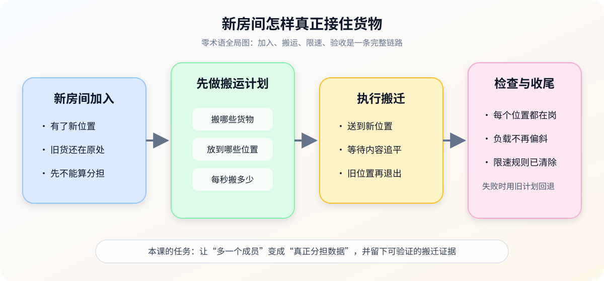
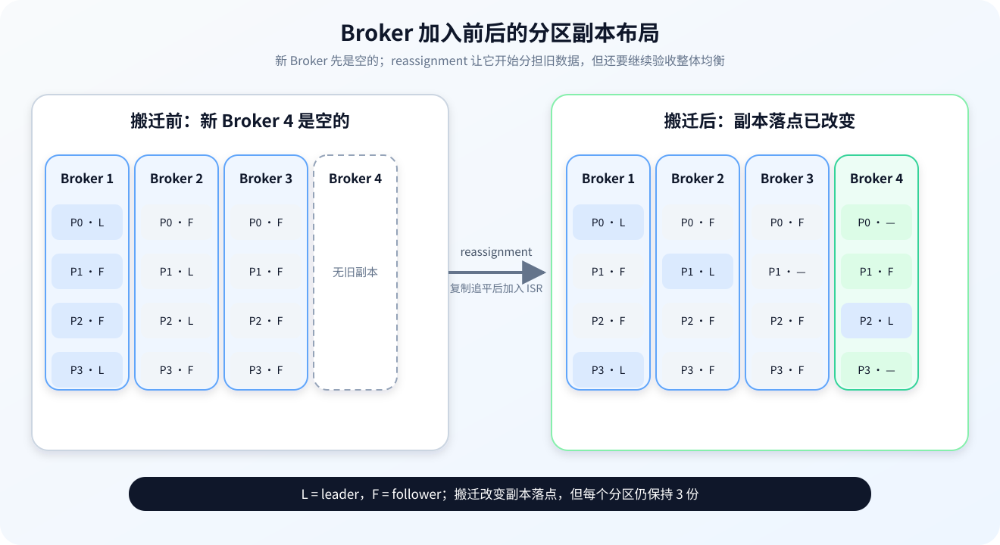

# 第 4 课：Broker 成员与数据搬迁

> 所属阶段：阶段 2《日常操作与容量治理》｜水平：入门｜目标：动手实操
> 故事情节：新 Broker 搬进机房，却发现它没有承接任何旧数据——扩容只是“多了一间空屋子”。

> 📖 **结论已按官方文档核对**（核查于 2026-09 ｜ 来源：[Basic Kafka Operations](../../../web-index/kafka/topics/operations.md)、[Broker Configs](../../../web-index/kafka/topics/configuration.md)、[Monitoring](../../../web-index/kafka/topics/operations.md)）。本课以 Kafka 4.3 文档作为成员扩展、分区重分配、机架感知、限流和下线流程的核对基线；示例 Broker ID、Topic 和限流数值均为演练占位或假设值。
>
> ⚠️ **版本边界**：仓库现有本地 Compose 实验使用 Kafka 4.0.0 镜像；本课命令和配置行为按 Kafka 4.3 文档核对。真正执行前，请以目标环境的版本文档和 --help 输出为准。

## 🎯 本课目标

- 理解 Broker 加入、下线与既有分区数据之间的关系。
- 能设计分区重分配、机架感知和复制限流流程。
- 能用 generate → execute → verify → rollback 的闭环完成一次数据搬迁。

## 第一幕：起源与场景引入

容量评审刚通过，团队把一个新 Broker 加入了集群。几分钟后，业务同事问：

> “不是已经从 3 台扩成 4 台了吗？为什么新 Broker 的磁盘还是空的，旧 Broker 反而继续增长？能不能顺便把最忙的分区搬过去？”

你查看申请单，发现它同时包含三件事：

1. **成员变化**：新 Broker 是否已经用唯一的 node.id 加入并能被集群识别？
2. **数据变化**：旧分区的副本是否真的迁移到了新 Broker？
3. **风险变化**：迁移流量会不会挤占业务流量，副本是否跨越故障域，搬完后 leader 是否仍然偏斜？

### 一句话本质

**Broker 扩容只是增加“可放置的位置”；数据搬迁要靠显式的分区重分配，并用限流、验证和旧计划把风险关在变更窗口里。**

### 处境对照

| 做法 | 眼前结果 | 后续风险 |
|------|----------|----------|
| 只启动新 Broker | 集群成员数增加，新节点看起来正常 | 旧数据不动，磁盘和负载仍集中在老节点 |
| 先生成并审查搬迁计划 | 能看到哪些分区去哪里、复制因子是否保持、是否跨故障域 | 需要准备 JSON、监控进度并安排收尾 |
| 不限速直接全量搬迁 | 迁移可能更快结束 | 网络、磁盘和副本追赶争用业务资源，ISR 可能抖动 |

> **场景数字说明**：从 3 台到 4 台、把一个 Topic 的部分副本迁往新 Broker 是虚构演练；它只用来说明“成员增加”和“数据迁移”是两个动作，不代表任何集群规模建议。

## 第二幕：认知冲突

### 冲突一：新成员上线，不等于旧数据自动搬家

Kafka 允许给新服务器配置唯一 ID 并启动进程，但新服务器不会自动获得既有分区。除非显式执行分区重分配，否则它可能只等待未来新建 Topic，无法解决当前热点和磁盘倾斜。

### 冲突二：搬迁不是复制一个文件夹

分区迁移的过程是：目标 Broker 先成为 follower，追平现有数据并加入 ISR，之后旧副本才退出。中间任何一步都可能受到网络、磁盘、限流、消息写入速度和故障域布局影响。

### 冲突三：数据搬完，不等于整个集群平衡

重分配完成后，副本落点可能已经符合计划，但 leader 仍可能集中在少数 Broker；或者磁盘容量均匀了，leader 数和客户端流量却没有均匀。**副本平衡、leader 平衡和资源平衡要分别验收。**

## 第三幕：层层揭示

### 一眼全局图：新房间怎样真正接住货物

> **看图**：左边的新位置只是空房间，中间必须先决定搬什么、搬到哪里、每秒搬多少，右边再检查追平、分布和限速是否收尾。

### 本课地图（分三步走）

| 步 | 这一步要解决什么（人话） | 对应知识点 |
|:--:|------------------------|-----------|
| 1 | 认识新成员为什么是空的，以及下线前为什么必须先搬完 | Broker 加入、下线与数据不会自动搬家 |
| 2 | 把要搬的数据写成副本计划，并让故障域和流量边界进入计划 | 分区重分配、机架感知与限流 |
| 3 | 用状态、指标、磁盘和 leader 分布验收，并准备真正可用的回退计划 | 验证、回滚与优先副本均衡 |

### 知识点一：Broker 加入、下线与数据不会自动搬家

> 🧭 **第 1/3 步｜承接**：第二幕留下的问题是“新 Broker 为什么还是空的” → **本步**：先把成员发现和数据承接拆成两个明确动作。

#### 一句话定义

**Broker 加入是让新节点进入集群成员视野；数据承接是把既有分区副本通过 reassignment 显式放到它身上，二者不会自动合并发生。**

#### 直觉建立：新仓库开门，但旧货不会自己长脚

你新开了一间仓库，门牌和钥匙都登记好了，但旧仓库里的货不会自己搬过去。需要一张搬运清单，指定哪些货、搬到哪几个位置，并等新位置核对完内容后，旧位置才能退出。

类比的边界是：Kafka 搬的是分区副本，不是简单的文件复制；复制过程会经过 follower、ISR 和 leader 角色变化，还要受客户端写入和故障域约束。

#### 核心原理：加入、承接、下线三段分离

1. **加入成员**：新进程使用唯一的 node.id（节点身份编号）；在 KRaft 部署里，process.roles、监听地址和控制器连接方式还要符合现有集群拓扑。部署方式不同，启动参数不能照抄别的环境。
2. **承接数据**：通过 partition reassignment 指定目标副本集合。Kafka 会让目标节点先复制并追平分区，加入 ISR 后再清理旧副本。
3. **下线成员**：先把 Broker 上的分区副本迁走，验证所有目标分区完成，再关停并 unregister；不能把“进程已停”当作“数据已安全迁出”。

~~~mermaid
sequenceDiagram
    participant A as 运维者
    participant C as 集群控制面
    participant N as 新 Broker
    participant O as 旧 Broker
    A->>C: 登记唯一 node.id 并启动新 Broker
    C-->>A: 成员可见，但新 Broker 无既有分区
    A->>C: 提交 reassignment 计划
    C->>N: 复制目标分区
    N-->>C: 追平并加入 ISR
    C->>O: 删除已迁出的旧副本
    A->>C: describe / verify / 指标验收
~~~

> **看图**：新 Broker 先被集群看见，再通过计划获得副本；只有追平并进入 ISR 后，旧副本才有资格退出，最后由运维者完成验证。

#### 加入前后的检查单

| 检查项 | 加入前要确认 | 加入后要证明 |
|--------|--------------|--------------|
| 身份 | node.id 唯一，启动角色和监听配置符合拓扑 | 集群能看到该成员且没有 ID 冲突 |
| 容量 | 磁盘、网络和恢复窗口足够 | 新节点磁盘和分区数量开始承接负载 |
| 故障域 | rack / 可用区标签准确 | 新副本没有集中到同一故障域 |
| 数据 | 旧 Broker 上哪些 Topic/Partition 最值得迁移 | 目标副本进入 ISR，旧副本按计划退出 |
| 业务 | 迁移窗口、流量峰值和变更联系人 | 生产/消费错误、lag 和延迟没有越过基线 |

#### Broker 下线的正确顺序

Kafka 4.3 Basic Kafka Operations 给出的下线思路是：先 cordon Broker 的日志目录，再把该 Broker 上的所有分区副本重分配到其他 Broker，完成后关停并注销成员。

~~~bash
kafka-configs.sh \
  --bootstrap-server <BROKER_ENDPOINT> \
  --alter \
  --add-config cordoned.log.dirs="*" \
  --entity-type brokers \
  --entity-name <BROKER_ID>

# 按当前分区清单生成“所有副本离开该 Broker”的计划
# 计划完成并验证后再关停进程
kafka-cluster.sh unregister \
  --bootstrap-server <BROKER_ENDPOINT> \
  --id <BROKER_ID>
~~~

上面第二条命令只是注销示意，不能跳过“先搬完、再关停”的顺序。下线计划通常需要管理员自己列出该 Broker 承载的全部分区，官方文档明确提示工具目前不会自动为下线 Broker 生成完整迁移计划。

#### 常见误区

- **误区 1：**“Broker 启动成功，扩容就完成了。”错；还要证明既有分区副本已迁入并开始承接资源。
- **误区 2：**“直接删掉旧 Broker 的日志目录就能触发搬迁。”错；先 cordon，再制定并执行 reassignment。
- **误区 3：**“下线就是 stop 进程。”错；下线前必须迁走副本，确认 ISR、磁盘和业务状态。
- **误区 4：**“新 Broker 空闲说明它没有问题。”错；它可能只是没有被分配任何既有分区。

#### 行话锚定

| 行话 | 在哪里遇到 |
|------|------------|
| Broker / node.id | Broker 启动配置、成员列表、KRaft 部署 |
| Partition reassignment | kafka-reassign-partitions.sh、迁移计划和 verify |
| Cordon | cordoned.log.dirs、Broker / 日志目录下线 |
| ISR | Topic describe、复制追平和故障排查 |
| Decommission / unregister | Broker 下线流程、kafka-cluster.sh unregister |

#### 一句话记住

**成员加入解决“谁能承接”，重分配解决“承接什么”，下线流程解决“如何安全退出”；三件事不能用一次启动或停止代替。**

📚 **官方文档**：[Basic Kafka Operations：集群扩展、下线 Broker 与日志目录](https://kafka.apache.org/43/operations/basic-kafka-operations/) ｜ [Broker Configs：node.id、process.roles、cordoned.log.dirs](https://kafka.apache.org/43/configuration/broker-configs/) ｜ 本教程路由：[operations 聚焦索引](../../../web-index/kafka/topics/operations.md)

### 知识点二：分区重分配、机架感知与限流

> 🧭 **第 2/3 步｜承接**：上一步知道了“新成员不会自动接货” → **本步**：把搬什么、搬到哪里和每秒搬多少写成可审查的计划。

#### 一句话定义

**分区重分配，是重新指定分区副本集合并让 Kafka 自动完成复制、追平和旧副本退出的过程；机架感知约束位置，限流约束搬迁对业务资源的侵占。**

#### 直觉建立：搬家公司需要三张纸

一次跨仓搬运至少需要：

1. 货物清单：哪些箱子要搬；
2. 目的地地图：每个箱子要保留几份、分别放在哪些房间；
3. 交通限速：不能因为搬家把日常配送的道路全部堵死。

类比的边界是：Kafka 的目的地不是随便填的房间，副本集合会影响 leader、ISR 和故障承受能力；限流太低会导致复制不前进，太高会挤压业务流量。

#### 核心原理：generate、execute、verify

官方 reassignment 工具提供三个互斥模式：

| 模式 | 做什么 | 是否开始搬迁 |
|------|--------|--------------|
| generate | 根据 Topic 清单和目标 Broker 列表生成候选计划 | 否，只生成当前/建议分配 |
| execute | 使用 reassignment JSON 启动搬迁 | 是 |
| verify | 检查上一次 execute 中列出的分区状态 | 否，负责验收；完成时还会清理工具设置的限流 |

> **看图**：左侧的 Broker 3 虽然已经加入但没有旧副本；右侧重分配完成后，四个分区仍各保留三份，但副本落点开始分散到三个 Broker。

如果是扩容并把一批 Topic 搬到新 Broker，可以先准备一个 Topic 清单：

~~~json
{
  "topics": [
    { "topic": "<TOPIC_NAME>" }
  ],
  "version": 1
}
~~~

再生成候选计划：

~~~bash
kafka-reassign-partitions.sh \
  --bootstrap-server <BROKER_ENDPOINT> \
  --topics-to-move-json-file topics-to-move.json \
  --broker-list "<TARGET_BROKER_ID_LIST>" \
  --generate
~~~

generate 的输出包含当前分配和建议分配。**必须把旧分配保存成回滚材料，把建议分配另存为 execute 使用的 JSON**；此时尚未开始搬迁。

generate 是按给定 Topic 清单和目标 Broker 列表生成候选计划的便利工具，不会自动扫描整个集群并替管理员找到全局最优的均衡方案；最终计划仍要人工检查分区大小、磁盘、故障域和 leader 目标。

自定义分区计划的最小结构如下：

~~~json
{
  "version": 1,
  "partitions": [
    {
      "topic": "<TOPIC_NAME>",
      "partition": 0,
      "replicas": [1, 2, 3]
    }
  ]
}
~~~

replicas 数组是该分区的新副本集合，数组顺序还关系到 preferred replica 和 leader 位置，不能只看“有几个 Broker”。

#### 机架感知：把共同故障拆开

在 Broker 配置中为节点设置故障域标签：

~~~properties
broker.rack=<RACK_ID>
~~~

Kafka 官方文档说明，创建、修改或重新分布副本时，会尽量让同一分区的副本跨不同 rack；一个分区最多跨 min(机架数, 复制因子) 个 rack。若不同 rack 的 Broker 数量不均衡，副本、存储和复制资源也可能不均衡，所以故障域设计不能只填标签，还要检查每个 rack 的容量。

#### 限流：给复制流量设上限

执行计划时可以设置 Broker 间和 Broker 内磁盘搬迁限流。下面数值沿用官方示例的量级，仅用于说明单位和位置，不是生产阈值：

~~~bash
kafka-reassign-partitions.sh \
  --bootstrap-server <BROKER_ENDPOINT> \
  --reassignment-json-file reassignment.json \
  --execute \
  --throttle 50000000 \
  --replica-alter-log-dirs-throttle 100000000
~~~

- throttle 控制 Broker 间复制带宽，单位是 bytes/s；
- replica-alter-log-dirs-throttle 控制 Broker 内日志目录搬迁带宽；
- 限流太低、低于持续写入压力时，复制可能无法持续追平；
- 搬迁完成后必须使用同一份 JSON 执行 verify，及时清除工具设置的限流，避免正常复制流量继续被压住。

搬迁中可检查：

~~~bash
kafka-reassign-partitions.sh \
  --bootstrap-server <BROKER_ENDPOINT> \
  --reassignment-json-file reassignment.json \
  --verify

kafka-configs.sh \
  --bootstrap-server <BROKER_ENDPOINT> \
  --entity-type brokers \
  --describe
~~~

#### 常见误区

- **误区 1：**“generate 就已经开始搬数据。”错；它只输出当前和候选分配。
- **误区 2：**“只要目标 Broker 数量够，副本就天然跨故障域。”错；要核对 broker.rack 和每个 rack 的容量。
- **误区 3：**“限流越低越安全。”错；低于持续写入压力可能让复制没有进展。
- **误区 4：**“verify 只是看一眼状态。”错；应使用同一份计划验收，完成后还要确认限流已清除。

#### 行话锚定

| 行话 | 在哪里遇到 |
|------|------------|
| Reassignment JSON | reassignment-json-file、replicas 数组和回滚材料 |
| generate / execute / verify | kafka-reassign-partitions.sh 的三种模式 |
| Rack awareness | broker.rack、可用区分散和副本布局 |
| Replication throttle | throttle、replica-alter-log-dirs-throttle、复制延迟 |
| Replica movement | Broker 间副本迁移、日志目录搬迁和磁盘流量 |

#### 一句话记住

**generate 先看计划，execute 才开始搬，verify 负责验收；rack 决定故障域，throttle 决定搬迁对业务资源的礼貌程度。**

📚 **官方文档**：[Basic Kafka Operations：generate / execute / verify、重分配 JSON 与限流](https://kafka.apache.org/43/operations/basic-kafka-operations/) ｜ [Broker Configs：broker.rack 与动态配置](https://kafka.apache.org/43/configuration/broker-configs/) ｜ 本教程路由：[operations 聚焦索引](../../../web-index/kafka/topics/operations.md)

### 知识点三：验证、回滚与优先副本均衡

> 🧭 **第 3/3 步｜承接**：上一步已经把搬迁计划写出来 → **本步**：证明数据搬完、资源恢复、leader 没有留下新的偏斜，并明确失败时真正能退到哪里。

#### 一句话定义

**搬迁验收不是只看“completed”，而是同时验证计划状态、ISR、复制健康、磁盘/网络水位、分区分布和 leader 分布；回滚则是用保存的旧副本计划发起另一轮 reassignment。**

#### 直觉建立：搬完箱子，还要验收房间和交通

搬家公司说“箱子已送达”，你还要检查：

- 每个箱子是否真的在目标房间；
- 每套备份是否齐全；
- 新房间有没有挤爆；
- 交通限速是否还残留；
- 负责接待客人的窗口是否集中在少数房间。

类比的边界是：Kafka 里的“箱子已送达”对应副本追平，但 leader 可能仍按副本列表顺序集中；因此数据落点验收和客户端服务入口验收要分开。

~~~mermaid
flowchart TD
    A[搬迁完成提示] --> B[工具 verify]
    B --> C[Replicas / Isr]
    C --> D[URP / OfflineReplica]
    D --> E[磁盘 / 网络 / FetcherLag]
    E --> F[PartitionCount / LeaderCount]
    F --> G{所有证据达标?}
    G -->|是| H[清除限流并收尾]
    G -->|否| I[暂停或调整计划，必要时回滚]
~~~

> **看图**：验收从工具状态开始，逐层经过副本、资源和分布证据；只有所有层都达标才收尾，否则回到计划调整或旧计划回滚。

#### 核心原理：五层验收

| 验收层 | 观察对象 | 通过方向 |
|--------|----------|----------|
| 工具状态 | reassignment verify | 所有目标分区 completed，不能有 failed 或长期 in progress |
| 副本状态 | Replicas、Isr、UnderReplicatedPartitions | ISR 恢复到计划期望，URP 回到 0 或基线 |
| 资源状态 | 磁盘、网络、FetcherLag、日志目录 | 迁移流量和追赶 lag 下降，资源回到可接受范围 |
| 分布状态 | PartitionCount、每 Broker 分区/磁盘水位 | 不再把负载集中在少数 Broker |
| 服务入口 | LeaderCount、preferred replica | leader 分布与吞吐目标一致，必要时再做 preferred election |

Kafka 官方 Monitoring 页列出了 UnderReplicatedPartitions、OfflineReplicaCount、PartitionCount、LeaderCount、ISR shrink/expand 和 follower fetch lag 等指标。它们是证据集合，不是要凭一个指标做结论：

- UnderReplicatedPartitions 目标通常为 0；
- OfflineReplicaCount 目标通常为 0；
- PartitionCount 和 LeaderCount 应结合容量与吞吐判断“mostly even”，没有统一百分比阈值；
- 搬迁期间 ISR shrink/expand 可能变化，收尾后应回到环境基线；
- FetcherLagMetrics 的 ConsumerLag 在迁移期间应持续下降，否则要检查限流和写入压力。

#### 回滚：旧计划就是材料，不是时间机器

官方文档要求保存旧分配，以便在需要时把它作为 reassignment JSON 再次 execute。这个动作是**另一轮数据搬迁**，不是瞬间恢复：

~~~bash
kafka-reassign-partitions.sh \
  --bootstrap-server <BROKER_ENDPOINT> \
  --reassignment-json-file <OLD_ASSIGNMENT_JSON> \
  --execute

kafka-reassign-partitions.sh \
  --bootstrap-server <BROKER_ENDPOINT> \
  --reassignment-json-file <OLD_ASSIGNMENT_JSON> \
  --verify
~~~

回滚前要重新确认：旧 Broker 是否仍在线、容量是否足够、故障域是否仍有效、业务是否已经接受部分分区在新位置产生的读写变化。**回滚计划保存了落点，不保存“已经发生的流量和时间”。**

#### 数据搬完但 leader 未均衡

副本列表中排在第一位的 Broker 是 preferred replica。Broker 重启或副本重分配后，leader 可能暂时不在 preferred replica 上，导致数据落点已经平衡但客户端入口偏斜。

如果 auto.leader.rebalance.enable 没有自动恢复，且变更评审允许恢复 preferred leader，可执行：

~~~bash
kafka-leader-election.sh \
  --bootstrap-server <BROKER_ENDPOINT> \
  --election-type preferred \
  --all-topic-partitions
~~~

这条命令也属于会改变服务入口的运维动作，执行前要确认 ISR 健康和业务窗口；不要把它当成“搬迁 verify 的附带清理”。

#### 常见误区

- **误区 1：**“verify completed 就可以立刻关掉监控。”错；还要确认 URP、OfflineReplica、磁盘、FetcherLag 和 leader 分布。
- **误区 2：**“回滚就是修改 JSON 后再 execute 一次。”错；应保存原始旧分配，回滚本身也会产生复制流量和风险。
- **误区 3：**“副本均匀就代表 leader 均匀。”错；副本落点和 preferred leader 是不同验收面。
- **误区 4：**“限流会在搬迁结束后自动永远恢复。”错；要用 verify 收尾并检查 Broker / Topic throttle 是否清除。
- **误区 5：**“为了快可以忽略 rack。”错；同一故障域里的多份副本不能提供等价的故障承受能力。

#### 行话锚定

| 行话 | 在哪里遇到 |
|------|------------|
| UnderReplicatedPartitions / URP | JMX 指标、告警和副本健康 |
| OfflineReplicaCount | Broker 监控、日志目录和副本可用性 |
| LeaderCount / preferred replica | leader 负载、优先副本均衡 |
| FetcherLagMetrics / ConsumerLag | follower 追赶、搬迁进度和限流判断 |
| Rollback reassignment | 旧副本计划、失败迁移和回退窗口 |

#### 一句话记住

**迁移完成要验收五层证据；回滚是用旧计划重新搬，数据均衡后还要单独确认 leader 是否均衡。**

📚 **官方文档**：[Basic Kafka Operations：回滚、verify、优先副本与限流清除](https://kafka.apache.org/43/operations/basic-kafka-operations/) ｜ [Monitoring：URP、OfflineReplica、PartitionCount、LeaderCount、FetcherLag](https://kafka.apache.org/43/operations/monitoring/) ｜ 本教程路由：[operations 聚焦索引](../../../web-index/kafka/topics/operations.md)

## 第四幕：实操验证——先演练计划，再搬真实数据

本课不启动或修改 Kafka 集群。练习默认针对你自己启动的实验环境；重分配 execute、下线和 leader election 都属于真实变更，只有在目标明确、计划已保存、监控可见且允许丢弃的环境中执行。

### 4.1 机制验证

### 练习 1：建立搬迁前快照

~~~bash
docker exec <CONTAINER> bash -c '
  export PATH=/opt/kafka/bin:$PATH
  unset KAFKA_JMX_OPTS
  kafka-topics.sh --bootstrap-server <BROKER_ENDPOINT> --describe
  kafka-configs.sh --bootstrap-server <BROKER_ENDPOINT> --entity-type brokers --describe
'
~~~

把以下信息保存到变更单：

| 快照 | 记录内容 |
|------|----------|
| 成员 | Broker ID / node.id、rack、角色、版本 |
| 分区 | Topic、Partition、Replicas、Isr、Leader |
| 资源 | 每 Broker 磁盘、网络、日志目录和容量余量 |
| 健康 | URP、OfflineReplica、ISR shrink/expand、FetcherLag |
| 目标 | 哪些分区要移动、目标副本集合和预期 leader 分布 |

### 练习 2：只生成，不执行

准备 topics-to-move.json 后执行 generate，保存输出中的 current assignment 和 proposed assignment。回答：

1. 新 Broker 是否真正出现在目标副本集合中？
2. 复制因子是否保持不变？
3. 同一分区的副本是否跨越预期 rack？
4. 最大分区和最大磁盘水位是否仍在恢复窗口内？
5. 旧 assignment 是否已经单独保存？

没有回答完之前，不要执行 execute。

### 练习 3：执行、限流、验证和收尾

在可丢弃实验 Topic 上，按下面顺序填写自己的参数：

~~~bash
kafka-reassign-partitions.sh --bootstrap-server <BROKER_ENDPOINT> --reassignment-json-file <NEW_ASSIGNMENT_JSON> --execute --throttle <INTER_BROKER_BYTES_PER_SEC> --replica-alter-log-dirs-throttle <DISK_BYTES_PER_SEC>
kafka-reassign-partitions.sh --bootstrap-server <BROKER_ENDPOINT> --reassignment-json-file <NEW_ASSIGNMENT_JSON> --verify
kafka-topics.sh --bootstrap-server <BROKER_ENDPOINT> --describe
kafka-configs.sh --bootstrap-server <BROKER_ENDPOINT> --entity-type brokers --describe
~~~

成功判据不是某一条命令返回成功，而是：

- reassignment verify 全部 completed；
- Replicas / Isr / Leader 与计划一致；
- URP 和 OfflineReplica 回到基线；
- FetcherLag 持续下降并最终稳定；
- 磁盘、网络和业务延迟回到变更前可接受范围；
- Broker / Topic 限流已被清除；
- 新 Broker 确实分担了分区与资源。

### 练习 4：模拟 Broker 下线

不要直接停止共享环境 Broker。先写出完整流程：

| 阶段 | 你要写什么 |
|------|------------|
| Cordon | 哪个 Broker、哪些日志目录、如何确认不再放置新副本 |
| Reassign | 该 Broker 上的全部分区如何迁走，目标 rack 和容量是否足够 |
| Verify | 哪些分区完成，ISR/URP/磁盘/leader 是否正常 |
| Shutdown | 什么时候允许关停进程 |
| Unregister | 什么时候允许注销成员，失败时如何升级 |

### 练习 5：建立回滚包

一个合格的搬迁回滚包至少包含：

- 变更前的 Topic describe；
- 旧副本分配 JSON；
- 新副本分配 JSON；
- 变更窗口、限流参数和负责人；
- verify 结果和关键指标截图/导出；
- 失败时的停止、回退和升级条件。

### 4.2 应用实战：Broker 下线与分阶段搬迁（入口）

> 🎯 **本课应用实战独立成篇**：[第 4 课实战 · Broker 下线与分阶段搬迁](../../../应用实战/04-Broker成员与数据搬迁.md)
> 含**分步设计图**与“基础 → 综合”的完整演进；通览全部：📚 [应用实战索引](../../../应用实战/INDEX.md)
> **课内不重复实战正文**：本课负责讲清成员变更和重分配机制，实战篇负责带着你把搬迁拆成可暂停循环。

## 第五幕：体系收束

本课把课 3 的“配置可追溯”推进成了“数据落点可追溯”：

~~~mermaid
flowchart LR
    A[新 Broker 加入] --> B[生成分区计划]
    B --> C[检查容量与故障域]
    C --> D[execute 搬迁]
    D --> E[副本追平并进入 ISR]
    E --> F[verify 与指标验收]
    F --> G[清除限流 / 恢复 leader]
    F --> H[失败时用旧计划回滚]
~~~

> **看图**：加入成员只是起点，计划和故障域检查决定能不能搬，execute 负责开始，ISR/verify 负责证明，收尾还要清限流和看 leader；失败时回到旧计划，而不是回到“什么都没发生”。

### 🐞 常见误区速查

| 误区 | 正确判断 |
|------|----------|
| 新 Broker 会自动接收旧数据 | 不会，必须显式 reassignment |
| generate 就开始迁移 | generate 只生成候选计划 |
| 迁移只影响磁盘 | 还会占用网络、复制线程、磁盘 I/O 和恢复窗口 |
| 目标副本数对了就安全 | 还要看 rack、ISR、URP、磁盘和 leader |
| verify 完成就全部结束 | 还要确认限流清除、资源回稳和 leader 分布 |
| 回滚可瞬间恢复 | 回滚仍是一轮数据搬迁，需要旧计划和资源 |
| 关停 Broker 后再想办法搬数据 | 必须先 cordon、reassign、verify，再关停和 unregister |

### 一图总结

~~~mermaid
flowchart TB
    A[Broker 成员变化] --> B[数据是否真的移动]
    B --> C[副本计划]
    C --> D[故障域与限流]
    D --> E[追平 / ISR / verify]
    E --> F[磁盘 / 网络 / URP]
    E --> G[leader / preferred replica]
    F --> H[完成或回滚]
    G --> H
~~~

> **三层回扣**：成员变化只是“有了新位置”，副本计划决定“数据放哪”，验收证据决定“是否能收尾”；课 5 将继续处理 Broker 维护窗口、优雅关停和 KRaft 运维。

## 🧪 课后小测

1. 新 Broker 启动后为什么可能完全没有旧数据？

因为 Kafka 不会自动把既有分区分配给新 Broker；需要显式生成并执行分区重分配计划。

2. generate、execute、verify 分别做什么？

generate 生成候选计划但不搬数据；execute 按 JSON 启动搬迁；verify 检查上一次 execute 的分区状态，完成时还应确认工具设置的限流已清除。

3. 为什么复制因子保持不变，仍然要检查 broker.rack？

因为副本数量不变不代表故障域分散；同一 rack 或可用区中的多份副本可能一起受到底层故障影响。

4. 为什么数据搬完后还要检查 LeaderCount？

因为副本落点均匀不等于 leader 均匀；leader 是客户端服务入口，仍可能集中在少数 Broker，需要单独评估 preferred replica 和 leader 分布。

## 命令速查卡

| 目的 | 命令 |
|------|------|
| 生成候选计划 | kafka-reassign-partitions.sh --bootstrap-server <BROKER_ENDPOINT> --topics-to-move-json-file <TOPICS_JSON> --broker-list "<BROKER_ID_LIST>" --generate |
| 执行重分配 | kafka-reassign-partitions.sh --bootstrap-server <BROKER_ENDPOINT> --reassignment-json-file <ASSIGNMENT_JSON> --execute |
| 执行并限流 | kafka-reassign-partitions.sh --bootstrap-server <BROKER_ENDPOINT> --reassignment-json-file <ASSIGNMENT_JSON> --execute --throttle <BYTES_PER_SEC> --replica-alter-log-dirs-throttle <DISK_BYTES_PER_SEC> |
| 验证并清理工具限流 | kafka-reassign-partitions.sh --bootstrap-server <BROKER_ENDPOINT> --reassignment-json-file <ASSIGNMENT_JSON> --verify |
| 查看分区副本 | kafka-topics.sh --bootstrap-server <BROKER_ENDPOINT> --describe |
| 查看 Broker 动态配置 | kafka-configs.sh --bootstrap-server <BROKER_ENDPOINT> --entity-type brokers --describe |
| 恢复 preferred leader | kafka-leader-election.sh --bootstrap-server <BROKER_ENDPOINT> --election-type preferred --all-topic-partitions |
| Cordon Broker | kafka-configs.sh --bootstrap-server <BROKER_ENDPOINT> --alter --add-config cordoned.log.dirs="*" --entity-type brokers --entity-name <BROKER_ID> |
| 注销已迁空 Broker | kafka-cluster.sh unregister --bootstrap-server <BROKER_ENDPOINT> --id <BROKER_ID> |

> <BROKER_ENDPOINT>、<BROKER_ID>、<BROKER_ID_LIST>、<TOPIC_NAME>、<ASSIGNMENT_JSON> 和限流占位符都要替换成自己的环境值；不要把真实内网地址、凭据或业务拓扑写入可分享的学习档案。

## 📚 官方文档

- [Basic Kafka Operations：集群扩展、重分配、下线 Broker、回滚、限流与优先副本](https://kafka.apache.org/43/operations/basic-kafka-operations/)
- [Broker Configs：node.id、process.roles、broker.rack、cordoned.log.dirs](https://kafka.apache.org/43/configuration/broker-configs/)
- [Monitoring：副本、分区、leader、ISR 和 follower lag 指标](https://kafka.apache.org/43/operations/monitoring/)
- [本子教程官方文档聚焦索引](../../../web-index/kafka/index.md)

## 🚀 下一批接力提示词

> 学完本批后，**复制下面这段文字发给 AI**，即可继续阶段 2：

~~~text
继续学 Kafka 运维方向子教程。我的学习档案在 kafka/kafka-operations/00-学习档案.md，
刚学完阶段 2《日常操作与容量治理》的课《Broker 成员与数据搬迁》知识点：Broker 加入/下线与数据不会自动搬家、分区重分配/机架感知与限流、验证/回滚与优先副本均衡，
请按大纲继续讲解下一批知识点。
~~~

## 🧭 课程导航

- **上一课**：[课 3：Topic 生命周期与配置治理](lesson-03-Topic生命周期与配置治理.md)
- **下一课**：[课 5：日常维护与 KRaft 运维](lesson-05-日常维护与KRaft运维.md)
- **返回目录**：[Kafka 运维方向子教程课程目录](../../../02-课程目录.md)
