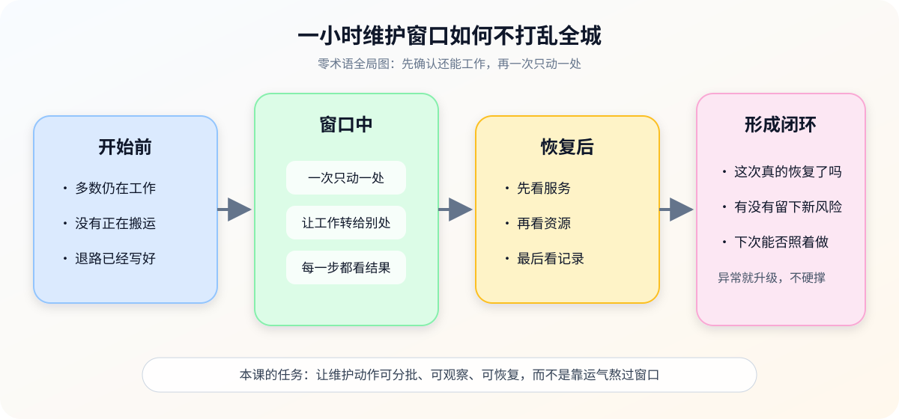
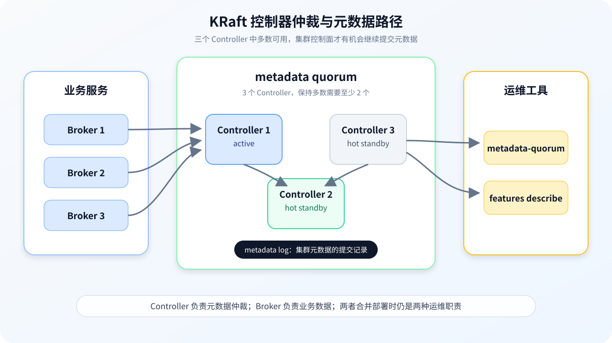

# 第 5 课：日常维护与 KRaft 运维

> 所属阶段：阶段 2《日常操作与容量治理》｜水平：入门｜目标：动手实操
> 故事情节：维护窗口只有一小时——重启、换盘、JVM/OS 维护和控制面检查必须排出不会互相放大的顺序。

> 📖 **结论已按官方文档核对**（核查于 2026-09 ｜ 来源：[Basic Kafka Operations](../../../web-index/kafka/topics/operations.md)、[KRaft](../../../web-index/kafka/topics/operations.md)、[Monitoring](../../../web-index/kafka/topics/operations.md)、[Hardware and OS](../../../web-index/kafka/topics/operations.md)、[Java Version](../../../web-index/kafka/topics/operations.md)）。本课以 Kafka 4.3 文档作为优雅关停、KRaft 仲裁、磁盘和 JVM/OS 维护的核对基线；示例窗口与资源数字均为演练假设。
>
> ⚠️ **版本边界**：仓库现有本地 Compose 实验使用 Kafka 4.0.0 镜像，且采用 broker,controller combined 部署；本课命令和配置行为按 Kafka 4.3 文档核对。真正执行前，请以目标环境的版本文档和 --help 输出为准。

## 🎯 本课目标

- 设计 Broker 优雅关停、leader 迁移和维护窗口。
- 识别 KRaft Controller/仲裁状态的运维信号和升级出口。
- 区分磁盘空间、日志目录离线、JVM/GC 与 OS 资源问题。

## 第一幕：起源与场景引入

今晚有一个 60 分钟维护窗口，申请单里却塞了四件事：

> “重启一台 Broker（承载业务数据的服务节点），替换一块数据盘，给 JVM（Java 运行时）打补丁，再确认 KRaft 控制器是否健康。最好一次做完，业务不要感知。”

你不能把它理解成四条可以随便排列的命令，因为它们会互相放大：

1. 重启前如果副本、leader 或控制器多数已经不健康，维护会把余量继续压低。
2. 数据盘和元数据盘不是同一种资产，换盘前的搬迁顺序完全不同。
3. JVM 的 GC 暂停、文件句柄耗尽和磁盘 I/O 延迟，表面上都可能像“Kafka 变慢”。
4. 控制器短暂换 leader 可能是自愈，也可能是多数失去联系；值班者必须知道何时继续、何时升级。

### 一句话本质

**日常维护的本质，是让一次“必须动机器”的动作变成可分批、可观察、可停止的状态变化，并始终保护数据面和控制面的最低可用余量。**

### 处境对照

| 做法 | 眼前看起来 | 后续风险 |
|------|------------|----------|
| 先重启、出问题再看 | 维护命令少，窗口内动作快 | 可能同时放大 ISR、leader、仲裁、磁盘和客户端错误 |
| 先做维护前快照 | 多花几分钟确认状态、角色和资源 | 能判断这台机器是否值得现在动，也能提供回退和升级证据 |
| 一次维护多台 | 任务集中完成 | 可能同时失去副本、leader 或控制器多数，恢复路径变窄 |

> **场景数字说明**：60 分钟窗口和“四件事”是虚构演练；Kafka 官方文档提供的是行为和命令，不提供适用于所有集群的固定维护阈值。

## 第二幕：认知冲突

### 冲突一：优雅关停不是“温柔地 kill”

优雅关停的价值不只是让进程收到退出信号。Kafka 可以在受控停止时同步日志，并把本机承担的 leader 迁移到其他副本，减少启动恢复和短暂不可用；强制终止则可能把日志恢复工作留到下次启动。

### 冲突二：Controller 有 leader，不等于仲裁多数健康

KRaft 需要 Controller 参与 metadata quorum。一个 active Controller 仍然存在，不代表多数 Controller 都能提交元数据；3 个 Controller 至少要有 2 个保持可用，才能承受 1 个 Controller 故障并继续维持可用性。

### 冲突三：磁盘还有空间，不等于日志目录健康

磁盘容量、磁盘 I/O、Kafka 日志目录是否 offline、JVM 堆和 OS 文件句柄是不同维度。只看 df 的剩余百分比，可能漏掉目录已经离线、I/O 延迟飙升或 mmap 数量不足。

## 第三幕：层层揭示

### 一眼全局图：一小时维护窗口如何不打乱全城

> **看图**：左边先确认多数仍工作、没有搬运和已有退路；中间一次只动一处并逐步观察；右边从服务、资源到记录逐层收尾，异常就升级。

### 本课地图（分三步走）

| 步 | 这一步要解决什么（人话） | 对应知识点 |
|:--:|------------------------|-----------|
| 1 | 明确一台 Broker 什么时候能安全停、停完看什么 | 优雅关停与维护窗口 |
| 2 | 看懂 KRaft 控制器多数、元数据提交和成员变更边界 | KRaft 控制器仲裁运维 |
| 3 | 把磁盘、日志目录、JVM 和 OS 症状分开诊断 | 磁盘、日志目录与 JVM/OS 维护 |

### 知识点一：优雅关停与维护窗口

> 🧭 **第 1/3 步｜承接**：第二幕留下的问题是“重启为什么会放大风险” → **本步**：先把停一台 Broker 的前置检查、受控退出和逐步验证排成顺序。

#### 一句话定义

**优雅关停，是让 Broker 在退出前完成日志同步和必要的 leader 迁移，再由维护者确认集群仍处于可维护状态；维护窗口是这套动作的时间、并发和升级边界。**

#### 直觉建立：修一条路，先让车绕行

道路施工前，要先确认还有足够的绕行道路，并把车流切走；修完后不能只看挖掘机停了，还要确认车真的能从新路线通过。

类比的边界是：Kafka 的“车辆”是客户端请求，“绕行”是 leader 转移和副本承接；它还受 ISR、控制器状态和客户端重试影响，不是所有请求都会立刻无感切换。

#### 核心原理：单 Broker 维护四步

1. **Prepare**：确认没有未完成的 reassignment，URP/OfflineReplica/UnderMinIsr 等健康指标符合基线，控制器多数和业务流量有余量。
2. **Transfer**：让 leader 迁移到其他可用副本；不要把数据副本迁移和单纯重启混为一谈，前者应按课 4 的 reassignment 流程处理。
3. **Stop**：使用运行环境提供的优雅停止方式，给进程足够时间完成受控关停；不要把 kill -9 当作日常维护命令。
4. **Verify**：进程恢复后检查成员、leader、ISR、客户端错误和资源趋势，确认稳定后才进入下一台。

Kafka 4.3 Broker Configs 将 controlled.shutdown.enable 标为 read-only，默认值为 true；它不是可以随手用 kafka-configs.sh 在线改的 Topic 配置。目标环境若有不同部署约定，必须先核对版本和启动配置。

~~~mermaid
sequenceDiagram
    participant O as 运维者
    participant C as 集群控制面
    participant B as 目标 Broker
    participant K as 客户端
    O->>C: 检查 ISR、URP、leader、仲裁和搬迁状态
    C-->>O: 允许维护 / 暂停并升级
    O->>B: 发起优雅停止
    B->>C: 同步日志并迁移受控 leader
    C->>K: 返回新的 leader 路径
    O->>B: 启动或恢复服务
    O->>C: 验证成员、ISR、leader 和资源
~~~

> **看图**：维护者先向控制面确认能不能动，再让目标 Broker 有序退出；客户端路径随 leader 迁移，恢复后还必须重新检查集群状态。

#### 维护前后判据

| 阶段 | 必看内容 | 继续条件 |
|------|----------|----------|
| 前置 | reassignment、URP、OfflineReplica、UnderMinIsr、ActiveControllerCount | 没有正在放大的异常，剩余节点有余量 |
| 停止中 | leader election、ISR shrink、客户端 Produce/Fetch 错误 | 变化短暂且符合预期，没有持续恶化 |
| 恢复后 | Broker 成员、PartitionCount、LeaderCount、ISR、磁盘和延迟 | 关键指标回到基线，再动下一台 |
| 异常 | 多数丢失、ISR 持续收缩、客户端错误持续增长 | 停止批次，保留证据并升级 |

#### 合并部署的特别边界

KRaft 的 broker,controller combined 模式适合小型开发环境，优点是简单；官方文档指出它会让 Controller 与 Broker 的资源和维护边界耦合，关键生产环境不建议采用。当前仓库实验使用该模式，所以实验结果不能直接当成生产维护拓扑。

#### 常见误区

- **误区 1：**“优雅关停等于进程收到 SIGTERM。”错；重点是日志同步和受控 leader 迁移是否完成。
- **误区 2：**“一台没问题，就可以连续重启下一台。”错；每台恢复后的副本、leader、客户端和资源状态都要重新验证。
- **误区 3：**“重启 Broker 会顺便把数据搬到别处。”错；重启和副本重分配是两个不同动作。
- **误区 4：**“combined 模式的本地实验可以代表生产控制器隔离。”错；它的职责和资源耦合更强。

#### 行话锚定

| 行话 | 在哪里遇到 |
|------|------------|
| Graceful shutdown / controlled shutdown | Broker 配置、维护窗口、leader 迁移 |
| Leader election | Controller 指标、重启后的分区服务入口 |
| ISR shrink / expand | 副本追赶、Broker 停止和恢复 |
| UnderMinIsr | min.insync.replicas 约束、写入失败排查 |
| Rolling maintenance | 一次一台或一小批、前后验证和升级出口 |

#### 一句话记住

**维护不是“停一台再开一台”，而是检查余量 → 有序退出 → 恢复验证 → 再决定下一台。**

📚 **官方文档**：[Basic Kafka Operations：优雅关停、leader 迁移与 controlled.shutdown.enable](https://kafka.apache.org/43/operations/basic-kafka-operations/) ｜ [Broker Configs：controlled.shutdown.enable](https://kafka.apache.org/43/configuration/broker-configs/) ｜ [KRaft：combined server 与 Controller 多数](https://kafka.apache.org/43/operations/kraft/) ｜ 本教程路由：[operations 聚焦索引](../../../web-index/kafka/topics/operations.md)

### 知识点二：KRaft 控制器仲裁运维

> 🧭 **第 2/3 步｜承接**：上一步保证一台 Broker 的维护不把集群余量打穿 → **本步**：把“控制面是否还能提交元数据”从感觉变成 quorum status 和 replication 证据。

#### 一句话定义

**KRaft Controller quorum，是由多个 Controller 共同保存和提交集群元数据的仲裁集合；运维重点是确认 active leader、多数成员、追赶状态和元数据高水位。**

#### 直觉建立：三位值班长必须有多数同意

三位值班长轮流主持会议，一位是当前主持人，另外两位是热备用。主持人换人不一定是事故；真正危险的是只剩一位，已经无法形成多数决定。

类比的边界是：KRaft 的 Controller 不只是投票，它们还保存 metadata log，并让 Broker 根据已提交的元数据运行；因此要同时看 leader、epoch、高水位和 follower lag。

> **看图**：中间的三个 Controller 共同组成 metadata quorum，右侧工具查询控制面状态，左侧 Broker 依赖提交后的元数据；active 变化不等于多数丢失，但多数不足会阻塞控制面。

#### 核心原理：先判断“自愈”还是“事故”

Kafka 4.3 KRaft 文档给出的基础边界：

- 每个 Kafka server 可以是 broker、controller 或两者 combined；
- Controller 参与 metadata quorum，一个 active，其余可以是 hot standby；
- 3 个 Controller 至少保留 2 个，才能容忍 1 个 Controller 故障而保持可用；
- 为了承受 N 个并发 Controller 故障，通常需要 2N+1 个 Controller；
- **运维推断：**如果只有 active Controller 变化，但多数仍在且 metadata log 能继续提交并追平，可以先按自愈观察项处理；
- 多数丢失、LeaderEpoch/HighWatermark 长时间不推进、MaxFollowerLag 持续扩大，应停止高风险维护并升级控制面事故。

查询 metadata quorum 摘要：

~~~bash
kafka-metadata-quorum.sh \
  --bootstrap-server <BROKER_ENDPOINT> \
  describe --status
~~~

查询各 Controller 的复制追赶：

~~~bash
kafka-metadata-quorum.sh \
  --bootstrap-server <BROKER_ENDPOINT> \
  describe --replication
~~~

重点字段：

| 字段 | 人话解释 | 运维用法 |
|------|----------|----------|
| LeaderId | 当前 metadata log leader | leader 变化要结合多数和 epoch 判断 |
| LeaderEpoch | leader 任期编号 | 持续变化或不推进都要结合日志排查 |
| HighWatermark | 已提交到多数的元数据位置 | 长时间不推进表示控制面可能卡住 |
| MaxFollowerLag | 最落后的 Controller 追赶量 | 追赶持续扩大说明成员或网络有问题 |
| CurrentVoters | 当前仲裁成员 | 确认维护是否碰到多数 |
| LastFetchTimestamp / LastCaughtUpTimestamp | Controller 最近拉取和追平时间 | 判断是否真的追上 active |

#### 静态 quorum 与动态 quorum

可以用 features describe 判断当前 KRaft feature version：

~~~bash
kafka-features.sh \
  --bootstrap-controller <CONTROLLER_ENDPOINT> \
  describe
~~~

Kafka 4.3 文档说明：kraft.version 为 0 或不存在时，通常是 static quorum；为 1 或更高时，通常是 dynamic quorum。静态仲裁与动态仲裁的成员变更命令不能混用，先识别再操作。

动态 Controller 的新增顺序：

1. 用同一 cluster ID 和 no-initial-controllers 方式准备新节点；
2. 启动新 Controller；
3. 用 describe --replication 等待它追上；
4. 追平后执行 add-controller；
5. 再次查看 CurrentVoters 和复制状态。

~~~bash
kafka-storage.sh format \
  --cluster-id <CLUSTER_ID> \
  --config <CONTROLLER_CONFIG> \
  --no-initial-controllers

kafka-metadata-quorum.sh \
  --bootstrap-controller <CONTROLLER_ENDPOINT> \
  describe --replication

kafka-metadata-quorum.sh \
  --bootstrap-controller <CONTROLLER_ENDPOINT> \
  add-controller
~~~

动态 Controller 的移除顺序是先 remove-controller，再关停；命令需要准确的 controller-id 和 controller-directory-id。静态 quorum 不要照抄这组动态成员变更命令。

~~~bash
kafka-metadata-quorum.sh \
  --bootstrap-controller <CONTROLLER_ENDPOINT> \
  remove-controller \
  --controller-id <CONTROLLER_ID> \
  --controller-directory-id <CONTROLLER_DIRECTORY_ID>
~~~

#### 常见误区

- **误区 1：**“有一个 active Controller 就一定健康。”错；还要确认多数、HighWatermark 和 follower lag。
- **误区 2：**“Controller 3 个就是永远能停 2 个。”错；3 个通常只能容忍 1 个故障，维护还要考虑其他异常和业务余量。
- **误区 3：**“任何 KRaft 集群都能直接 add-controller。”错；先判断 static 还是 dynamic quorum。
- **误区 4：**“新 Controller 启动后马上加入 voters。”错；先确认 metadata log 已追平，再执行成员加入。
- **误区 5：**“元数据目录丢了就直接 format。”错；必须先证明多数 Controller 已有 committed data，避免覆盖唯一可恢复状态。

#### 行话锚定

| 行话 | 在哪里遇到 |
|------|------------|
| KRaft Controller | process.roles、metadata quorum、Controller 指标 |
| Metadata quorum | kafka-metadata-quorum.sh、CurrentVoters、HighWatermark |
| Static / Dynamic quorum | kraft.version、controller.quorum.voters / bootstrap.servers |
| LeaderEpoch | quorum status、Controller 选举和元数据提交 |
| Add/remove controller | 动态 quorum 成员变更、追平后的维护流程 |

#### 一句话记住

**控制面先看多数，再看 leader 和提交进度；成员变更先看 static/dynamic，再看追平证据。**

📚 **官方文档**：[KRaft：角色、Controller 多数、static/dynamic quorum 与成员变更](https://kafka.apache.org/43/operations/kraft/) ｜ [Monitoring：Controller、ISR 和副本健康指标](https://kafka.apache.org/43/operations/monitoring/) ｜ [Broker Configs：控制器相关配置](https://kafka.apache.org/43/configuration/broker-configs/) ｜ 本教程路由：[operations 聚焦索引](../../../web-index/kafka/topics/operations.md)

### 知识点三：磁盘、日志目录与 JVM/OS 维护

> 🧭 **第 3/3 步｜承接**：上一步把控制面状态变成 quorum 证据 → **本步**：把“磁盘满、目录离线、GC 卡顿和 OS 资源不足”分成不同处置路径。

#### 一句话定义

**资源维护，是把 Kafka 的数据目录、metadata.log.dir、JVM 和 OS 资源分别建立基线，并在换盘、补丁或异常时按正确顺序恢复。**

#### 直觉建立：仓库满、仓门坏和管理员疲劳不是同一件事

一座仓库可能出现三类问题：

- 仓库空间快满了；
- 某个仓门坏了，货物无法从这扇门取放；
- 管理员反应变慢，导致所有操作排队。

它们都可能表现为“出货慢”，但处理方法不同：扩容、修门和调整管理员资源不能互相替代。

类比的边界是：Kafka 还有多个 log.dirs、每个分区完整落在一个目录、KRaft metadata.log.dir，以及索引文件和 mmap 对 OS 资源的占用；必须先定位层次。

~~~mermaid
flowchart TD
    A[服务变慢或告警] --> B{日志目录是否 offline?}
    B -->|是| C[停止继续写入风险，保全目录与副本证据]
    C --> D[按课 4 迁走副本并修复目录]
    B -->|否| E{磁盘容量或 I/O 异常?}
    E -->|是| F[查 df / I/O / log.dirs / 增长趋势]
    E -->|否| G{JVM 或 OS 资源异常?}
    G -->|JVM| H[查堆、GC 暂停和线程]
    G -->|OS| I[查 fd、vm.max_map_count、内存和 socket]
    F --> J[验证 Broker、ISR、客户端和资源回稳]
    H --> J
    I --> J
~~~

> **看图**：先把日志目录 offline 单独分叉，再区分磁盘/I/O 和 JVM/OS；修复动作不同，最后都要回到 Broker、ISR、客户端和资源验证。

#### 核心原理：四种资源问题分开看

| 症状 | 可能层次 | 只看什么会误判 | 首先查什么 |
|------|----------|----------------|------------|
| 磁盘使用量持续上升 | 容量 / retention / 分区不均 | 只看集群平均磁盘 | 每个 log.dirs、增长斜率、最大分区 |
| OfflineLogDirectoryCount > 0 | Kafka 日志目录状态 | 只看 df 仍有空间 | 目录挂载、I/O 错误、Broker 日志和副本承接 |
| I/O 延迟变高 | 设备 / 文件系统 / flush | 只看 CPU 正常 | 磁盘 await、队列、page cache、日志段写入 |
| GC 暂停或请求排队 | JVM / 线程 / 堆 | 只看堆使用率 | GC pause、线程池、请求队列和堆配置 |
| 打开文件或 mmap 失败 | OS 限制 | 只看 Kafka 参数 | ulimit -n、vm.max_map_count、分区和日志段数量 |

#### 数据日志目录维护

Kafka 官方 Hardware and OS 文档指出，如果配置多个数据目录，分区会轮询分配到目录；每个分区完整位于一个数据目录，不均衡的分区大小可能造成磁盘间负载不均。

数据目录换盘或下线时，沿用课 4 的安全顺序：

1. cordon 目标日志目录，阻止继续向它放置副本；
2. 生成并执行把该目录上的副本搬到其他目录或 Broker 的计划；
3. verify 并确认 ISR、URP、磁盘和业务状态；
4. 更新 log.dir / log.dirs，移除旧目录；
5. 重启 Broker，再验证目录、分区和 leader。

不要直接删除目录，也不要把“目录被卸载”当成“数据已迁走”。

#### KRaft metadata.log.dir 维护

KRaft Controller 把集群元数据存放在 metadata.log.dir；如果未配置，使用第一个日志目录。这个目录丢失或硬件需要替换时，处理顺序比普通业务数据目录更谨慎：

1. 先用 kafka-metadata-quorum.sh describe --replication 检查 Controller；
2. 等多数 Controller 的 Lag 足够小，且 LastFetchTimestamp 与 LastCaughtUpTimestamp 接近；
3. 确认多数 Controller 已经拥有 committed data；
4. 再按 cluster ID 和目标配置执行 kafka-storage.sh format；
5. 启动 Controller，重新检查 quorum status 和 replication。

--ignore-formatted 只能用于官方文档描述的特定场景，例如 combined 模式下仅 metadata 目录丢失但其他目录仍已格式化；它不是“format 失败就加上”的通用重试参数。

#### JVM 与 OS 维护

Kafka 4.3 Java Version 文档显示，Java 17、21、25 fully supported，Java 11 仅支持部分模块；官方通常建议使用最新 LTS 的最新 patch，但环境升级仍应按兼容性和滚动维护验证。

可在目标主机对运行进程做只读快照：

~~~bash
java -version
ulimit -n
cat /proc/meminfo
sysctl vm.max_map_count

jcmd <JAVA_PID> VM.flags
jcmd <JAVA_PID> GC.heap_info
jstat -gcutil <JAVA_PID> 1000 5
~~~

官方 Hardware and OS 文档给出两个重要的量级判断：

- Broker 需要文件描述符处理日志段和连接，官方建议至少以 100000 个 allowed file descriptors 作为起点，再按分区、日志段和连接数量校准；
- 每个日志段至少消耗两个 mmap 区域，因此分区数、segment 数和 vm.max_map_count 必须一起评估。

这些是核查起点，不是你的 SLO 或永久固定值；不要把某个繁忙集群的 JVM 参数和 GC 数字直接复制到当前环境。

#### 常见误区

- **误区 1：**“df 还有空间，所以 Kafka 的日志目录一定健康。”错；目录可能 offline，或 I/O 已经无法承接写入。
- **误区 2：**“删掉坏盘目录，副本会自动补回来。”错；先 cordon、reassign、verify，再处理目录和重启。
- **误区 3：**“metadata.log.dir 和普通 log.dirs 可以同样处理。”错；元数据目录关系到控制面提交，必须先证明多数已有 committed data。
- **误区 4：**“GC 频繁就把堆直接调大。”错；还要查堆外、线程、请求队列、消息批次和 OS 资源。
- **误区 5：**“官方建议 100000 fd 就是所有集群阈值。”错；它只是官方起点，需结合自身分区、日志段和连接数校准。

#### 行话锚定

| 行话 | 在哪里遇到 |
|------|------------|
| OfflineLogDirectoryCount | Kafka Monitoring、日志目录离线和磁盘故障 |
| metadata.log.dir | KRaft Controller、元数据日志和换盘 |
| page cache / fsync | Linux 内存、刷盘、I/O 延迟和恢复 |
| vm.max_map_count | mmap 索引、分区/日志段规模和 OS 限制 |
| GC pause / heap / thread pool | JVM 维护、请求延迟和 Broker 资源 |

#### 一句话记住

**空间满、目录离线、I/O 慢、GC 卡和 OS 限制不是一个问题；先定位资源层，再按数据目录或元数据目录的顺序恢复。**

📚 **官方文档**：[Hardware and OS：文件句柄、mmap、数据目录、page cache 与 metadata.log.dir](https://kafka.apache.org/43/operations/hardware-and-os/) ｜ [Java Version：支持的 Java 版本与 JVM 参考](https://kafka.apache.org/43/operations/java-version/) ｜ [Monitoring：OfflineLogDirectoryCount 与副本/资源指标](https://kafka.apache.org/43/operations/monitoring/) ｜ 本教程路由：[operations 聚焦索引](../../../web-index/kafka/topics/operations.md)

## 第四幕：实操验证——把维护窗口排成可执行清单

本课不启动或修改 Kafka 集群。以下命令默认只读；format、add-controller、remove-controller、cordon、重启和换盘动作只做评审，不在共享环境执行。

### 4.1 机制验证

### 练习 1：维护前快照

~~~bash
docker exec <CONTAINER> bash -c '
  export PATH=/opt/kafka/bin:$PATH
  unset KAFKA_JMX_OPTS
  kafka-topics.sh --bootstrap-server <BROKER_ENDPOINT> --describe
  kafka-metadata-quorum.sh --bootstrap-server <BROKER_ENDPOINT> describe --status
  kafka-metadata-quorum.sh --bootstrap-server <BROKER_ENDPOINT> describe --replication
'
~~~

结合监控记录：

| 类别 | 维护前记录 |
|------|------------|
| 成员 | Broker、Controller、combined/分离角色、版本 |
| 副本 | URP、OfflineReplica、UnderMinIsr、ISR shrink/expand |
| leader | LeaderCount、近期 leader election、客户端错误 |
| 控制面 | LeaderId、LeaderEpoch、HighWatermark、MaxFollowerLag、CurrentVoters |
| 资源 | log.dirs、metadata.log.dir、磁盘 I/O、fd、mmap、GC |
| 变更 | 是否有 reassignment、是否有未清除 throttle、负责人和升级出口 |

### 练习 2：模拟单 Broker 维护

把维护窗口拆成下面五格，任何一格没有证据就暂停：

1. Prepare：健康基线、仲裁多数、客户端窗口和回退条件；
2. Transfer：leader 是否会转移，副本是否仍足够；
3. Stop：运行环境的优雅停止方式和超时时间；
4. Start：进程恢复、成员重新出现、日志恢复是否完成；
5. Verify：ISR、leader、客户端、磁盘、控制面和资源回到基线。

如果要维护的是 Controller，不要只套用 Broker 重启流程：先判断 static/dynamic quorum 和多数余量。

### 练习 3：模拟 Controller 成员维护

只在动态 quorum 的可丢弃环境中评审：

| 顺序 | 证据 |
|------|------|
| 1 | features describe 确认 kraft.version 和 quorum 类型 |
| 2 | 当前 CurrentVoters 和多数余量 |
| 3 | describe --replication 确认目标 Controller 已追平或可安全移除 |
| 4 | add-controller 或 remove-controller 的目标 ID/目录 ID |
| 5 | 变更后 status、replication、HighWatermark 和多数 |

静态 quorum 不要执行动态 Controller 成员变更命令；不确定时先升级。

### 练习 4：模拟换数据盘与换 metadata 目录

| 资产 | 正确顺序 | 绝不能做 |
|------|----------|----------|
| 业务数据 log.dirs | cordon → reassignment → verify → 更新目录 → 重启 → 验证 | 先卸载/删除目录，再期待副本自动修复 |
| KRaft metadata.log.dir | quorum replication → 多数 committed data → format → 启动 → quorum 验证 | 未确认多数数据就 format，或把 ignore-formatted 当普通重试 |

### 练习 5：JVM/OS 只读基线

在目标主机记录 Java patch、堆参数、GC pause、文件句柄上限、vm.max_map_count、内存和磁盘 I/O。不要只记录“CPU 低/高”，要把 Kafka 指标与 OS 指标放在同一张维护单里。

### 维护窗口最小模板

| 阶段 | 必填内容 | 通过标准 |
|------|----------|----------|
| Prepare | 当前健康、仲裁多数、资源余量、变更范围、回退和升级 | 目标明确，剩余余量可证明 |
| Execute | 一台/一批边界、优雅停止、超时和操作者 | 只执行批准过的动作 |
| Observe | leader、ISR、Controller、客户端、磁盘、GC | 指标变化符合预期 |
| Verify | 成员、分区、资源、日志目录和控制面 | 全部回到基线或有书面偏差 |
| Close | throttle、临时状态、证据、后续观察项 | 没有遗留限流和未登记风险 |

### 4.2 应用实战：一小时维护窗口编排（入口）

> 🎯 **本课应用实战独立成篇**：[第 5 课实战 · 一小时维护窗口编排](../../../应用实战/05-日常维护与KRaft运维.md)
> 含**分步设计图**与“基础 → 综合”的完整演进；通览全部：📚 [应用实战索引](../../../应用实战/INDEX.md)
> **课内不重复实战正文**：本课负责讲清关停、仲裁和资源维护边界，实战篇负责带着你把维护窗口编排成分支 Runbook。

## 第五幕：体系收束

本课把课 4 的“数据搬迁”继续推进成“维护窗口治理”：

~~~mermaid
flowchart LR
    A[维护申请] --> B[Broker / Controller 身份]
    B --> C[副本与仲裁健康]
    C --> D[磁盘 / metadata / JVM / OS 基线]
    D --> E[一次只动一处]
    E --> F[优雅退出或成员变更]
    F --> G[服务 / 副本 / 控制面验证]
    G --> H[记录与升级出口]
~~~

> **看图**：先识别要动的是 Broker 还是 Controller，再确认副本和仲裁余量，随后把数据目录、元数据目录和 JVM/OS 分开处理；最后用统一验收单收尾。

### 🐞 常见误区速查

| 误区 | 正确判断 |
|------|----------|
| 优雅关停就是不使用 kill -9 | 还要确认日志同步、leader 迁移和恢复后的指标 |
| active Controller 在就没事 | 还要确认 quorum 多数、HighWatermark 和 follower lag |
| 一次维护多台更高效 | 先证明剩余副本和 Controller 多数仍有余量 |
| 磁盘不满就不用查目录 | OfflineLogDirectoryCount、I/O 和挂载状态可能先出问题 |
| 数据目录与 metadata 目录同样换 | 业务副本可按课 4 搬，元数据目录必须先保护多数 committed data |
| 调大堆就能解决 GC | GC、线程、请求队列、消息批次和 OS 资源要联合判断 |

### 一图总结

~~~mermaid
flowchart TB
    A[日常维护与 KRaft 运维] --> B[优雅关停]
    A --> C[控制器仲裁]
    A --> D[资源维护]
    B --> B1[leader 转移 / 日志同步 / 逐台验证]
    C --> C1[多数 / epoch / high watermark / lag]
    D --> D1[log.dirs / metadata.log.dir / JVM / OS]
    B1 --> E[维护窗口可控]
    C1 --> E
    D1 --> E
    E --> F[下一阶段：可观测与故障排查]
~~~

> **三层回扣**：Broker 维护保护服务入口，KRaft 运维保护控制面，资源维护保护数据与运行时底座；下一阶段会把这些基线变成指标、告警和事故分诊。

## 🧪 课后小测

1. 为什么优雅关停前要先看 ISR 和 Controller 多数？

因为停止一台 Broker 或 Controller 会消耗集群余量；如果副本已经掉队或控制器多数不足，维护动作可能把可用性进一步打穿。

2. active Controller 变化为什么不一定是事故？

只要新的 active 正常选出、Controller 多数仍在、metadata log 能继续提交并追平，leader 切换可能是正常自愈；若多数丢失或高水位长期不推进，才应升级控制面事故。

3. 为什么业务数据目录和 KRaft metadata.log.dir 不能用同一套换盘流程？

业务数据目录可以先 cordon、迁移副本、verify 后处理；metadata.log.dir 保存控制面元数据，必须先证明多数 Controller 已有 committed data，再格式化和启动。

4. 为什么文件句柄和 vm.max_map_count 要和分区数一起规划？

Broker 的日志段、索引文件和连接都会消耗 OS 资源；分区越多、日志段越多，文件句柄和 mmap 区域需求可能越高，不能只看 JVM 堆。

## 命令速查卡

| 目的 | 命令 |
|------|------|
| 查询 KRaft 摘要 | kafka-metadata-quorum.sh --bootstrap-server <BROKER_ENDPOINT> describe --status |
| 查询 KRaft 复制 | kafka-metadata-quorum.sh --bootstrap-server <BROKER_ENDPOINT> describe --replication |
| 查询 KRaft feature | kafka-features.sh --bootstrap-controller <CONTROLLER_ENDPOINT> describe |
| 查看 Topic / ISR / Leader | kafka-topics.sh --bootstrap-server <BROKER_ENDPOINT> --describe |
| 优雅停止容器服务 | docker compose stop --timeout <SECONDS> <KAFKA_SERVICE> |
| 只读查看 Java/OS | java -version; ulimit -n; cat /proc/meminfo; sysctl vm.max_map_count |
| 只读查看 JVM | jcmd <JAVA_PID> VM.flags; jcmd <JAVA_PID> GC.heap_info; jstat -gcutil <JAVA_PID> 1000 5 |
| 动态 quorum 移除 Controller | kafka-metadata-quorum.sh --bootstrap-controller <CONTROLLER_ENDPOINT> remove-controller --controller-id <CONTROLLER_ID> --controller-directory-id <CONTROLLER_DIRECTORY_ID> |

> <BROKER_ENDPOINT>、<CONTROLLER_ENDPOINT>、<KAFKA_SERVICE>、<JAVA_PID>、<CONTROLLER_ID>、<CONTROLLER_DIRECTORY_ID> 和 <SECONDS> 是占位符；format、add-controller、remove-controller、重启和换盘命令必须先经过目标环境评审。不要把真实地址、凭据或内部拓扑写入学习档案。

## 📚 官方文档

- [Basic Kafka Operations：优雅关停、leader 迁移和维护相关操作](https://kafka.apache.org/43/operations/basic-kafka-operations/)
- [KRaft：Controller 角色、仲裁多数、static/dynamic quorum、metadata 工具](https://kafka.apache.org/43/operations/kraft/)
- [Monitoring：Controller、ISR、OfflineLogDirectory、分区和 leader 指标](https://kafka.apache.org/43/operations/monitoring/)
- [Hardware and OS：文件句柄、mmap、数据目录、page cache 与 metadata.log.dir](https://kafka.apache.org/43/operations/hardware-and-os/)
- [Java Version：支持的 Java 版本与 JVM 参考](https://kafka.apache.org/43/operations/java-version/)
- [本子教程官方文档聚焦索引](../../../web-index/kafka/index.md)

## 🎉 阶段完成 · 下一阶段接力提示词

> 本课是阶段 2《日常操作与容量治理》的最后一课。学完本批后，**复制下面这段文字发给 AI**，即可进入阶段 3：

~~~text
继续学 Kafka 运维方向子教程。我的学习档案在 kafka/kafka-operations/00-学习档案.md，
刚完成阶段 2《日常操作与容量治理》，已学完知识点：Topic 创建基线、配置层级与在线变更、分区扩容/删除与保留策略、Broker 加入/下线与数据不会自动搬家、分区重分配/机架感知与限流、验证/回滚与优先副本均衡、优雅关停与维护窗口、KRaft 控制器仲裁运维、磁盘/日志目录与 JVM/OS 维护，
请按大纲开始阶段 3《可观测与故障排查》的课《可观测性基线与告警》。
~~~

## 🧭 课程导航

- **上一课**：[课 4：Broker 成员与数据搬迁](lesson-04-Broker成员与数据搬迁.md)
- **下一阶段**：[阶段 3：可观测与故障排查](../../3-可观测与故障排查/overview.md)
- **返回目录**：[Kafka 运维方向子教程课程目录](../../../02-课程目录.md)
