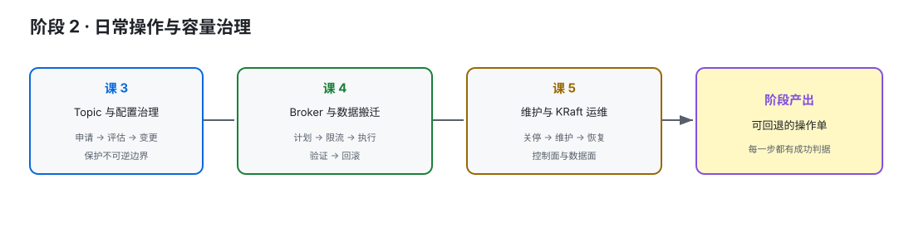

# 阶段 2：日常操作与容量治理

> 所属课程：Kafka 运维方向子教程 ｜ 故事章节：每个改动都要可回退 ｜ 上一阶段：[阶段 1](../1-集群运维基线/overview.md) ｜ [返回总览](../../01-学习路径总览.md)

## 🎯 本阶段目标

- 能安全完成 Topic 生命周期、配置变更和分区扩容。
- 能把 Broker 加入、下线与分区搬迁拆成可验证的步骤。
- 能在维护窗口内处理关停、磁盘和 KRaft 运维问题。

## 📍 学习重点

- Kafka 的许多运维命令是“发起变更”，不是“变更已经完成”；必须有 verify 和回滚意识。
- 新 Broker 不会自动分担既有数据；数据移动本身会消耗网络、磁盘和副本同步能力。
- 在线变更要区分静态配置、动态配置、Topic 配置和内部 Topic 的边界。

## ✅ 必须掌握的知识点

| 知识点 | 所属课 | 学完应能 |
|--------|--------|----------|
| Topic 创建基线 | 课 3 | 为 Topic 选择分区数、复制因子和可靠性基线 |
| 配置层级与在线变更 | 课 3 | 判断配置来源、变更范围和生效方式 |
| 分区扩容、删除与保留策略 | 课 3 | 识别不可逆操作与客户端分布风险 |
| Broker 加入、下线与数据不会自动搬家 | 课 4 | 规划成员变更而不误以为数据会自动均衡 |
| 分区重分配、机架感知与限流 | 课 4 | 生成、执行、限流和清理一次搬迁 |
| 验证、回滚与优先副本均衡 | 课 4 | 用前后证据确认搬迁和 leader 分布是否达标 |
| 优雅关停与维护窗口 | 课 5 | 让维护动作尽量避开不必要的 leader 和 ISR 抖动 |
| KRaft 控制器仲裁运维 | 课 5 | 识别仲裁状态并知道什么时候升级处理 |
| 磁盘、日志目录与 JVM/OS 维护 | 课 5 | 区分磁盘空间、目录离线和 JVM/OS 资源问题 |

## 🗺️ 本阶段路径图

> SVG 展示从 Topic 级变更到 Broker 级维护的推进关系；每次变更都要以可观察的成功判据收尾。

## 本阶段产出

- [x] [lessons/lesson-03-Topic生命周期与配置治理.md](lessons/lesson-03-Topic生命周期与配置治理.md)
- [x] [lessons/lesson-04-Broker成员与数据搬迁.md](lessons/lesson-04-Broker成员与数据搬迁.md)
- [x] [lessons/lesson-05-日常维护与KRaft运维.md](lessons/lesson-05-日常维护与KRaft运维.md)
