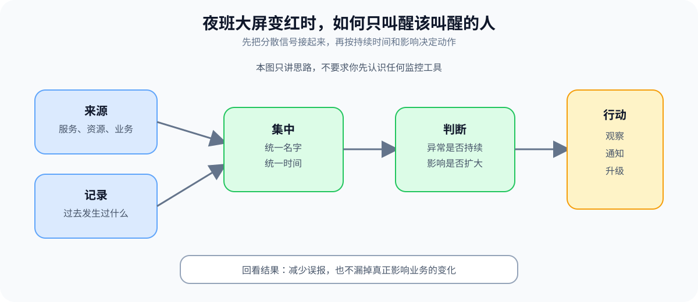
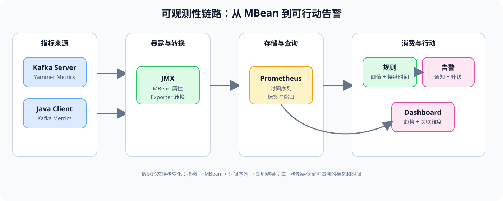

# 第 6 课：可观测性基线与告警

> 所属阶段：阶段 3《可观测与故障排查》｜水平：入门｜目标：动手实操
> 故事情节：夜班大屏变红了——真正的问题不是“有没有指标”，而是“哪一个信号值得叫醒人”。

> 📖 **结论已按官方文档核对**（核查于 2026-09 ｜ 来源：[Monitoring](../../../web-index/kafka/topics/operations.md)、[Basic Kafka Operations](../../../web-index/kafka/topics/operations.md)、[Topic Configs](../../../web-index/kafka/topics/configuration.md)、[Prometheus JMX Exporter](https://github.com/prometheus/jmx_exporter/blob/main/README.md)）。本课以 Kafka 4.3 文档作为服务端指标、客户端指标、JMX、Consumer Group CLI 和告警候选的核对基线。
>
> ⚠️ **版本边界**：仓库现有本地 Compose 实验使用 Kafka 4.0.0 镜像；本课命令和指标名称按 Kafka 4.3 文档核对。Kafka 指标经过 Exporter 后的 Prometheus 名称取决于转换规则，不能把本文的 MBean 名称直接当成所有环境的 Prometheus 指标名。

## 🎯 本课目标

- 画出 Kafka Server、Java Client、JMX、Exporter、Prometheus 和告警消费端之间的采集链路。
- 为副本、Controller、请求、磁盘和客户端建立“正常值—持续时间—影响—动作”的告警基线。
- 区分 Broker 侧副本追赶、Consumer 侧消费积压和业务端到端延迟。

## 第一幕：起源与场景引入

凌晨 02:10，值班大屏突然变红：一个 Broker 的请求延迟升高，某个 Consumer Group 的 lag 也在增长，另一个面板却显示吞吐量没有明显下降。通知渠道同时收到五条告警，没人确定应该先处理哪一条。

你需要在几分钟内回答：

1. 这个红色信号来自服务端、客户端，还是监控系统自己的计算？
2. 它是瞬时抖动，还是已经持续到可能影响 SLO？
3. 现在该观察、通知业务、限制变更，还是升级事故？

### 一句话本质

**可观测性不是把所有数字堆到看板上，而是把系统状态变成有来源、有时间、有上下文、能触发动作的证据。**

### 处境对照

| 做法 | 夜班看到什么 | 处理结果 |
|------|--------------|----------|
| 只采集不分级 | 面板很多、告警很多，但不知道先看哪条 | 认知负担上升，真正异常可能被噪声淹没 |
| 指标加标签、窗口和动作 | 能看出来源、持续时间、影响范围和下一步 | 可以先止损，再沿证据链定位 |
| 只看 Broker 指标 | 看到服务端有流量，却不知道消费端是否落后 | 可能把“生产正常”误判成“业务正常” |

> **场景数字说明**：02:10、五条告警和上述夜班事件是虚构演练；Kafka 官方文档提供指标定义和正常方向，不提供适用于所有集群的固定 SLO 阈值。

## 第二幕：认知冲突

### 冲突一：有指标，不等于有可观测性

同一个指标如果没有来源、时间、Topic、分区、Broker 或客户端维度，值班者只能看到“有变化”，不能判断“谁受到影响”。标签太少无法定位，标签太多又会制造高基数和查询噪声。

### 冲突二：Broker 的 lag 和 Consumer 的 lag 不是同一个 lag

Broker 监控中的 FetcherLagMetrics 关注副本 follower 与 leader 的追赶；Consumer Group CLI 和客户端 records-lag-max 关注消费者位置与日志末端的差距。名字相似，责任对象不同，处置动作也不同。

### 冲突三：阈值没有持续时间，就会把抖动当事故

UnderReplicatedPartitions 短暂从 0 变成非 0，可能与一次维护或 Broker 故障有关；如果没有持续时间、抑制条件和升级出口，告警会在“刚出现”和“真正恶化”之间反复跳动。

## 第三幕：层层揭示

### 一眼全局图：夜班大屏为什么需要一条证据链

> **看图**：左侧是服务、资源和业务信号，中间先统一名称和时间再做持续性判断，右侧才决定观察、通知或升级；这张图不要求你先记住任何 Kafka 组件名。

### 本课地图（分三步走）

| 步 | 这一步要解决什么（人话） | 对应知识点 |
|:--:|------------------------|-----------|
| 1 | 让分散的信号能被采集、转换、查询和追踪 | 指标采集链路与标签设计 |
| 2 | 让“异常”有正常基线、持续时间和动作等级 | 健康基线、告警分级与 SLO |
| 3 | 让消费积压、服务端复制延迟和业务延迟不再混淆 | Consumer lag、日志与看板 |

### 知识点一：指标采集链路与标签设计

> 🧭 **第 1/3 步｜承接**：第二幕留下的问题是“有数字为什么仍然定位不了” → **本步**：先把每个数字的来源、名字、标签和去向接起来。

#### 一句话定义

**指标采集链路，是从 Kafka Server 或 Java Client 产生指标，经 JMX 或其他 Reporter 暴露，再由 Exporter 转成监控系统可查询时间序列的路径。**

#### 直觉建立：水表读数要带房间号和时间

一栋楼有很多水表。只收集“总用水量”无法知道哪一户漏水；只收集每一秒的所有读数，又会让抄表系统和查询系统变得很重。可用的抄表记录至少要带房间、时间、读数和采集来源。

类比的边界是：Kafka 指标不只有一个数值，还可能是累计计数、速率、队列、分区和客户端维度；标签设计也不能把所有动态 ID 不加筛选地塞进监控系统。

#### 核心原理：来源、转换和消费端分层

Kafka 4.3 Monitoring 文档说明：

- Kafka Server 使用 Yammer Metrics；
- Java Client 使用 Kafka Metrics；
- 两者都可以通过 JMX 暴露，也可以通过可插拔的 stats reporter 接入监控系统；
- rate 指标通常有对应的累计计数指标，名称带有 total 后缀；
- Kafka 默认关闭远程 JMX；生产环境启用远程 JMX 时必须配置安全措施，避免未授权用户监控或控制 Broker、应用和主机。

Prometheus JMX Exporter 是外部转换组件，不是 Kafka Server 自带的 Prometheus 后端。它的职责是把 JMX MBean 映射为 Prometheus 可抓取的指标；映射后的名称、标签和是否保留某些维度，要以目标环境的 Exporter 配置为准。

> **看图**：左侧 Kafka Server 和 Java Client 产生不同来源的指标，中间通过 JMX 和 Exporter 统一成时间序列，右侧再由规则、Dashboard 和通知系统消费；每一步都可能改变名称和标签。

#### 标签设计：定位能力和基数成本一起算

| 维度 | 适合回答的问题 | 风险 |
|------|----------------|------|
| cluster / environment | 哪个集群、哪个环境 | 通常是低基数，适合作为全局筛选 |
| broker / controller | 哪台服务节点有问题 | 节点数可控，但扩容会增加序列 |
| topic / partition | 哪个业务流或分区异常 | 分区数多时序列会快速增长 |
| client-id / group | 哪类客户端或消费组受影响 | 业务客户端命名不受控时容易膨胀 |
| request / error | 哪类请求或错误在增长 | 避免把完整错误文本当标签 |

标签的选择原则是：**每个标签都要能改变一次排障决策**。如果一个标签只用于展示、不用于筛选或关联，就应评估是否值得长期保留。
#### 只读验证：先看到 MBean，再谈 Exporter

~~~bash
# 只读查看 Java 进程版本；不启用远程 JMX
java -version

# 在已授权且自行运行的环境中，用 JConsole 浏览 JMX MBean
jconsole
~~~

可以先从官方文档中的 MBean 名称建立白名单，再将其映射到目标 Exporter 的配置：

~~~text
kafka.server:type=ReplicaManager,name=UnderReplicatedPartitions
kafka.log:type=LogManager,name=OfflineLogDirectoryCount
kafka.controller:type=KafkaController,name=ActiveControllerCount
kafka.consumer:type=consumer-fetch-manager-metrics,client-id=<CLIENT_ID>
~~~

这几行是名称白名单示例，不是 Prometheus 查询表达式；真正的 Prometheus 指标名必须从 Exporter 输出或配置中核对。

#### 常见误区

- **误区 1：**“Kafka 有 JMX，所以直接打开公网端口就行。”错；官方文档明确要求生产远程 JMX 配置安全措施。
- **误区 2：**“把 Topic、Partition、Client ID 全部做成标签一定更好。”错；定位能力和时间序列数量需要共同评估。
- **误区 3：**“MBean 名称就是 Prometheus 指标名。”错；Exporter 会按规则转换名称和标签。
- **误区 4：**“只看 rate 就够了。”错；累计 total 能帮助判断是否真的发生过事件，不能把速率和累计量混为一谈。

#### 行话锚定

| 行话 | 在哪里遇到 |
|------|------------|
| Yammer Metrics | Kafka Server 指标来源、Monitoring 官方文档 |
| Kafka Metrics | Java Producer/Consumer Client 指标来源 |
| JMX / MBean | jconsole、远程监控、MBean 名称 |
| Stats Reporter | Kafka 指标接入其他监控系统 |
| Label cardinality | Prometheus 查询、序列数量和监控成本 |

#### 一句话记住

**先确认指标从谁来、经过什么转换、带哪些标签，再决定它能不能成为告警依据。**

📚 **官方文档**：[Monitoring：Yammer Metrics、Kafka Metrics、JMX 与指标表](https://kafka.apache.org/43/operations/monitoring/) ｜ [Prometheus JMX Exporter：JMX 到 Prometheus 的转换组件](https://github.com/prometheus/jmx_exporter/blob/main/README.md)

### 知识点二：健康基线、告警分级与 SLO

> 🧭 **第 2/3 步｜承接**：上一步把数字接成了链路 → **本步**：为这些数字补上正常方向、持续时间、影响级别和动作出口。

#### 一句话定义

**健康基线，是描述系统正常状态的可观测范围；告警策略是在基线偏离后，结合持续时间、影响范围和 SLO 决定通知级别与处理动作。**

#### 直觉建立：体温计读数不能只看一次

一个人刚跑完步，体温短时间升高不一定是疾病；如果高温持续、伴随其他症状，就需要升级处理。告警也一样：数值、持续时间和关联症状要一起看。

类比的边界是：Kafka 指标之间存在因果和依赖关系，例如 ISR 收缩可能由 Broker 故障、网络或磁盘 I/O 引起；不能把每个指标都单独设成同等紧急度。

#### 核心原理：正常值只是起点

Kafka 4.3 Monitoring 文档给出了一组可作为起点的正常方向：

| 指标 / 状态 | 官方文档中的正常方向 | 告警设计提示 |
|------------|---------------------|--------------|
| OfflineLogDirectoryCount | 0 | 非 0 直接关联日志目录、磁盘和副本承接 |
| UnderReplicatedPartitions | 0 | 非 0 需要结合 ISR shrink、故障和搬迁状态 |
| UnderMinIsrPartitionCount | 0 | 非 0 可能已经影响写入可靠性 |
| AtMinIsrPartitionCount | 0 | 接近最小 ISR 是风险余量变薄，不等同于已经故障 |
| UncleanLeaderElectionsPerSec | 0 | 非 0 需要升级数据可靠性风险 |
| ActiveControllerCount | 只有一个 Broker 应为 1 | 多于一个或没有一个为 1 都要检查控制面 |
| PartitionCount / LeaderCount | 各 Broker 大致均衡 | 作为分布性信号，不能单独替代容量评审 |
| IsrShrinksPerSec / IsrExpandsPerSec | 非故障或非操作期间通常为 0 | 维护窗口内的短暂变化要与变更关联 |
| RequestHandlerAvgIdlePercent | 官方示例给出理想上大于 0.3 的方向 | 这是官方起点，不是所有集群的 SLO 阈值 |

> ⚠️ **上表最后一行的 `RequestHandlerAvgIdlePercent` 在本实验环境已被实测证伪**：教程常用的 `< 0.3` 告警**永不触发**——实测 5 次采样 `2.36e11 → 2.62e11` 严格单调递增，HELP 行是 `attribute=Count`（累积计数），不是 0~1 比率。完整实测与替代指标（`RequestQueueSize` + `TotalTimeMs`）见 [课 17：网络层与请求处理模型](../../../../stages/7-实现原理/lessons/lesson-17-网络层与请求处理模型.md)。
>
> 配这条告警前先做三步核验：curl 看实际值域、读 HELP 行的 `attribute=`、连续采样 3~5 次确认单调性。

这些“正常方向”不是生产阈值。真正的告警还要加入持续时间、业务影响和维护抑制条件。

#### 告警分级：信号、影响和动作

| 级别 | 典型条件 | 动作 |
|------|----------|------|
| 🔴 立即处理 | 日志目录离线、UnderMinIsr 非 0、客户端错误持续增长且已有业务影响 | 先止损，通知值班负责人并升级事故 |
| 🟡 尽快处理 | URP 持续非 0、ISR 持续收缩、Controller 状态异常但业务暂未受损 | 暂停高风险变更，补齐证据并安排处理 |
| ⚪ 有时间再看 | LeaderCount 或 PartitionCount 轻微倾斜、单次短暂抖动 | 记录趋势，纳入容量或均衡计划 |

#### 告警规则的最小字段

一条可执行告警至少要能回答：

1. **Signal**：哪个指标或状态偏离？
2. **Scope**：哪个集群、Broker、Topic、Partition、Group 或客户端？
3. **Duration**：偏离持续多久才算异常？
4. **Impact**：影响写入、读取、复制、控制面还是业务 SLO？
5. **Action**：观察、通知、暂停变更、止损还是升级？
6. **Suppression**：已批准的搬迁、滚动维护或已知事件是否需要抑制？

~~~mermaid
flowchart TD
    A[指标偏离基线] --> B{是否处于批准的维护窗口?}
    B -->|是| C[关联变更单并观察预期变化]
    B -->|否| D{是否有业务影响或可靠性风险?}
    D -->|是| E[红色：先止损并升级]
    D -->|否| F{是否持续或反复扩大?}
    F -->|是| G[黄色：补证据并尽快处理]
    F -->|否| H[白色：记录趋势，暂不打扰值班]
    C --> I{恢复到基线?}
    I -->|是| J[关闭并记录证据]
    I -->|否| E
    E --> K[通知相关负责人并转事故响应]
    G --> K
~~~

> **看图**：先判断异常是否有批准变更背景，再判断业务影响和持续性；恢复不了就从观察分支回到红色处置，避免“维护窗口”成为永久抑制器。

#### SLO 回扣：指标是代理，不是目标本身

| 目标 | 相关信号 | 不能单独证明什么 |
|------|----------|------------------|
| 写入可用性 | UnderMinIsr、Produce error、RemoteTimeMs | 不能只凭 Broker 成功响应推断业务端到端成功 |
| 数据可靠性 | URP、ISR shrink、UncleanLeaderElections | 指标正常不代表所有客户端都能访问 |
| 消费时效 | Group lag、records-lag-max、业务处理延迟 | lag 数字本身不等于用户可感知延迟 |
| 控制面可用性 | ActiveControllerCount、Controller event queue、KRaft quorum | active Controller 存在不等于多数和元数据提交都健康 |

#### 常见误区

- **误区 1：**“所有非 0 都红色告警。”错；要结合指标语义、持续时间、维护背景和业务影响。
- **误区 2：**“官方给出的理想值就是我的 SLO。”错；官方值是监控起点，SLO 需结合环境和业务目标校准。
- **误区 3：**“告警抑制就是把维护期间的所有告警关掉。”错；抑制要绑定批准的范围和时间，恢复失败仍要升级。
- **误区 4：**“指标越多，看板越可靠。”错；没有动作和上下文的指标只会增加噪声。

#### 行话锚定

| 行话 | 在哪里遇到 |
|------|------------|
| Baseline | 健康基线、上线前后对比、SLO 评审 |
| Alert severity | 告警平台的通知级别和升级策略 |
| Suppression / inhibition | 维护窗口、关联告警和噪声控制 |
| UnderReplicatedPartitions（URP） | ReplicaManager 指标、Broker 故障和搬迁 |
| UnderMinIsrPartitionCount | min.insync.replicas、写入可靠性风险 |

#### 一句话记住

**告警不是“指标超过一个数”，而是基线偏离 + 持续时间 + 影响判断 + 明确动作。**

📚 **官方文档**：[Monitoring：健康指标、正常方向、Controller、ISR、请求与磁盘指标](https://kafka.apache.org/43/operations/monitoring/) ｜ [Basic Kafka Operations：Consumer Group、Topic 和集群操作背景](https://kafka.apache.org/43/operations/basic-kafka-operations/)

### 知识点三：Consumer lag、日志与看板

> 🧭 **第 3/3 步｜承接**：上一步把指标变成了有等级的告警 → **本步**：把消费积压、Broker 副本追赶和业务延迟放回各自的时间轴。

#### 一句话定义

**Consumer lag，是消费者当前位置与日志末端之间的差距；运维要同时知道这个差距由谁测量、按哪个 offset 计算、持续多久，以及它是否真的影响业务时效。**

#### 直觉建立：传送带末端与工人的手

工厂传送带不断把货物送到末端，工人处理到哪里是当前位置。末端和工人之间的货物数量就是积压；如果传送带停了、工人变慢、或者工人刚换班，积压变化的解释都不同。

类比的边界是：Kafka 的位置以 offset 表示，日志清理和分区切换会影响可读取范围；不同工具可能展示组提交位置、消费者当前读取位置或 Broker follower 追赶位置。

#### 核心原理：三种“落后”要分开

1. **Consumer Group CLI 的组级 lag**：Kafka 官方 Basic Operations 示例展示了 CURRENT-OFFSET、LOG-END-OFFSET 和 LAG，适合查看某个 Consumer Group 的组级位置。
2. **Java Consumer 的 records-lag-max**：Kafka Monitoring 文档明确说明，这个客户端指标由 Consumer 发布，表示窗口内任意分区的最大记录 lag，并基于当前 offset，而不是 committed offset。
3. **Broker FetcherLagMetrics / ConsumerLag**：这是 Broker 侧 follower replica 的追赶指标，不能当成业务 Consumer 的积压。

最常见的简化关系是：

~~~text
group_lag ≈ LOG-END-OFFSET - CURRENT-OFFSET
~~~

但这个式子只说明一条分区上的位置差，不能代替对工具语义、分区分布、消费速率和业务处理延迟的核对。

#### 组件交互与时间窗口

~~~mermaid
sequenceDiagram
    participant P as Producer
    participant B as Broker log
    participant C as Consumer
    participant M as Client metrics
    participant A as Admin CLI
    participant D as Dashboard
    P->>B: 追加记录，推进 Log End Offset
    C->>B: 拉取记录，推进当前读取位置
    C->>M: 发布 records-lag-max 与消费速率
    A->>B: 查询 Consumer Group offsets
    B-->>A: CURRENT-OFFSET / LOG-END-OFFSET / LAG
    M-->>D: 写入客户端时间序列
    A-->>D: 写入组级快照
    D->>D: 关联 lag、吞吐、再均衡和业务延迟
~~~

> **看图**：Producer 推进日志末端，Consumer 推进自己的读取位置；客户端指标和 Admin CLI 的采样口径不同，Dashboard 必须保留来源和时间窗口，不能把两条曲线直接当成同一个值。

#### 只读验证：组级位置与 Topic 状态一起看

~~~bash
kafka-consumer-groups.sh \
  --bootstrap-server "<BROKER_ENDPOINT>" \
  --describe \
  --group "<GROUP_NAME>"

kafka-topics.sh \
  --bootstrap-server "<BROKER_ENDPOINT>" \
  --describe \
  --topic "<TOPIC_NAME>"
~~~

将输出整理为一张最小证据表：

| 维度 | 记录内容 | 能回答什么 |
|------|----------|------------|
| Group / Topic / Partition | 对象范围 | 这条 lag 属于谁 |
| CURRENT-OFFSET | 组级当前位置 | 消费进度走到哪里 |
| LOG-END-OFFSET | 日志末端 | 生产端或日志末端推进到哪里 |
| LAG | 工具计算的差距 | 当前观察窗口积压多少 |
| Consumer ID / Client ID | 消费者身份 | 是否有成员缺失或重新分配 |
| 时间窗口 | 采集时间与持续时间 | 是一次性快照还是趋势 |
| 业务处理延迟 | 应用侧时间 | lag 是否已转成用户可感知延迟 |

#### 看板分层：先健康，再定位，再回扣业务

| 看板层 | 建议内容 | 目的 |
|--------|----------|------|
| 集群层 | URP、UnderMinIsr、OfflineLogDirectory、ActiveController | 先判断集群是否值得继续深挖 |
| Broker 层 | RequestQueue、RequestHandlerIdle、网络空闲、磁盘 I/O | 找服务节点瓶颈 |
| Topic / Partition 层 | LogEndOffset、Partition size、LeaderCount、分区 lag | 找热点和副本位置 |
| Group 层 | LAG、成员、分配、rebalance | 找消费端跟不上还是频繁换班 |
| 业务层 | 处理耗时、成功率、端到端延迟 | 判断技术信号是否已影响用户 |

#### 日志与取证保留

日志不是“看到一句 ERROR 就结束”，而是要和指标共用同一时间窗口：

- 保存告警触发时间、恢复时间和规则版本；
- 记录当时的 Broker、Topic、Partition、Group 和 Client ID；
- 关联是否发生过重分配、维护、再均衡或客户端发布；
- 不把含真实地址、凭据或用户信息的原始日志直接复制进教程或共享档案；
- 如果指标和日志时间不一致，先标记时钟或采集延迟，再解释根因。

#### 常见误区

- **误区 1：**“Consumer lag 一定来自 Broker 慢。”错；也可能是消费者处理慢、频繁再均衡、分区热点或下游阻塞。
- **误区 2：**“records-lag-max 就是提交 offset 的 lag。”错；官方文档说明它基于当前 offset，而不是 committed offset。
- **误区 3：**“Broker 的 FetcherLagMetrics ConsumerLag 就是业务消费 lag。”错；它描述的是 follower replica 追赶。
- **误区 4：**“lag 归零就代表业务恢复。”错；还要看消费处理延迟、错误率、重试和端到端 SLO。

#### 行话锚定

| 行话 | 在哪里遇到 |
|------|------------|
| Log End Offset（LEO） | Consumer Group CLI、Broker Log 指标 |
| Current Offset | Consumer Group CLI、消费当前位置 |
| Committed Offset | Consumer Group 管理、故障恢复和 offset 语义 |
| records-lag-max | Java Consumer 指标、客户端 JMX |
| FetcherLagMetrics / ConsumerLag | Broker follower 复制追赶指标 |
| Consumer Group Rebalance | Group Coordinator 指标、客户端成员变化 |

#### 一句话记住

**先确认 lag 的测量者和 offset 口径，再把它与吞吐、再均衡、日志和业务处理延迟放在同一时间轴。**

📚 **官方文档**：[Basic Kafka Operations：Consumer Group describe 与 LAG 输出](https://kafka.apache.org/43/operations/basic-kafka-operations/) ｜ [Monitoring：records-lag-max、LogEndOffset、ConsumerLag 与 Group Coordinator 指标](https://kafka.apache.org/43/operations/monitoring/)

## 第四幕：实操验证——把告警变成可执行证据

本课不启动或修改 Kafka 集群。以下命令默认只读；告警规则、Exporter 配置、JMX 暴露和通知策略只做评审，不在共享环境直接发布。

### 4.1 机制验证

### 练习 1：检查采集链路和指标来源

在自己的实验记录中画出：

~~~text
Kafka Server / Java Client
        ↓
JMX MBean 或 Stats Reporter
        ↓
Exporter 转换
        ↓
Prometheus 时间序列
        ↓
Dashboard / Alerting
~~~

逐层回答：

| 层 | 证据 | 未证明的事情 |
|----|------|--------------|
| Server / Client | 指标来源和 MBean 名称 | 指标已经被采集 |
| JMX / Reporter | 暴露方式和安全边界 | Exporter 已正确映射 |
| Exporter | 指标输出和标签 | 告警规则语义正确 |
| Prometheus | 查询结果和时间窗口 | 业务已经受影响 |
| Dashboard / Alerting | 面板和通知 | 处置动作真的恢复了服务 |

### 练习 2：做一次健康基线快照

~~~bash
kafka-topics.sh \
  --bootstrap-server "<BROKER_ENDPOINT>" \
  --describe

kafka-consumer-groups.sh \
  --bootstrap-server "<BROKER_ENDPOINT>" \
  --describe \
  --group "<GROUP_NAME>"
~~~

把指标和业务状态放到同一张表中：

| 类别 | 维护前 | 采集时间 | 判定 |
|------|--------|----------|------|
| UnderReplicatedPartitions | | | 0 / 有批准搬迁 / 异常 |
| UnderMinIsrPartitionCount | | | 0 / 风险 |
| OfflineLogDirectoryCount | | | 0 / 风险 |
| ActiveControllerCount | | | 只有一个 Broker 为 1 |
| RequestHandlerAvgIdlePercent | | | 与本环境基线比较 |
| Group LAG | | | 趋势、最大分区和持续时间 |
| 业务处理延迟 | | | 是否回扣 SLO |

### 练习 3：模拟“lag 增长但 Broker 正常”

不要把这个练习做成真实故障注入，使用静态场景推演：

| 观察 | 可能解释 | 下一步只读证据 |
|------|----------|----------------|
| Group LAG 增长，Broker 请求指标稳定 | Consumer 处理慢、下游阻塞或分区热点 | Group members、分区 lag、records-consumed-rate、应用处理延迟 |
| Broker FetcherLagMetrics 增长，Group LAG 不变 | 副本 follower 追赶慢，业务消费者未必受影响 | URP、ISR、磁盘 I/O、网络复制速率 |
| LAG、请求错误和业务延迟同时增长 | 可能已经影响端到端 SLO | Produce/Fetch 错误、再均衡、日志、业务失败率 |
| 只有一次短暂抖动 | 可能是采集窗口或短暂再均衡 | 延长时间窗口，查看恢复与是否反复 |

### 练习 4：设计一条不吵醒人的告警

按以下模板写一条评审规则，不填写固定生产阈值：

~~~yaml
alert:
  name: "<ALERT_NAME>"
  signal: "<METRIC_OR_STATE>"
  scope:
    cluster: "<CLUSTER_LABEL>"
    broker: "<BROKER_LABEL_OR_ALL>"
    topic: "<TOPIC_LABEL_OR_ALL>"
    group: "<GROUP_LABEL_OR_ALL>"
  condition: "<BASELINE_DEVIATION>"
  duration: "<APPROVED_DURATION>"
  severity: "<CRITICAL_WARNING_INFO>"
  impact: "<SLO_OR_NO_KNOWN_IMPACT>"
  action: "<OBSERVE_NOTIFY_ESCALATE>"
  suppression: "<APPROVED_MAINTENANCE_WINDOW_ONLY>"
  evidence:
    - "<DASHBOARD_QUERY>"
    - "<CLI_SNAPSHOT>"
    - "<LOG_TIME_WINDOW>"
~~~

**验收问题：**

- 指标名称能追溯到 MBean 或客户端指标；
- 标签不会把完整错误文本或无界动态 ID 当成高基数维度；
- 持续时间和维护抑制范围明确；
- 告警级别能回扣 SLO 或明确写出“暂无业务影响”；
- 告警关闭时仍保留触发、恢复和处置证据。

### 4.2 应用实战：从指标堆到可行动看板（入口）

> 🎯 **本课应用实战独立成篇**：[第 6 课实战 · 可行动告警看板](../../../应用实战/06-可观测性基线与告警.md)
> 含**分步设计图**与“基础 → 综合”的完整演进；通览全部：📚 [应用实战索引](../../../应用实战/INDEX.md)
> **课内不重复实战正文**：本课负责讲清采集、基线和 lag 口径，实战篇负责带着你把这些信号组合成可处置看板。

## 第五幕：体系收束

本课把阶段 2 的“操作后验证”推进成阶段 3 的“持续可观测”：

~~~mermaid
flowchart LR
    A[采集来源] --> B[统一指标与标签]
    B --> C[健康基线]
    C --> D[持续时间与影响]
    D --> E[告警分级]
    E --> F[看板与证据]
    F --> G[事故响应与故障排查]
~~~

> **看图**：先把来源和标签做对，再建立健康基线；只有把持续时间、影响和动作接上，指标才会变成告警，告警才会成为下一课事故响应的入口。

### 🐞 常见误区速查

| 误区 | 正确判断 |
|------|----------|
| 看板有很多曲线就等于可观测 | 还要有来源、标签、时间窗口、SLO 影响和动作 |
| Broker ConsumerLag 就是业务 Consumer lag | 先看指标发布者；Broker follower lag 与 Consumer backlog 不同 |
| lag 归零就关闭事故 | 还要核对业务处理延迟、错误率和恢复证据 |
| 告警规则只写阈值 | 还要写持续时间、影响、抑制和升级出口 |
| JMX 端口开起来就能生产使用 | 远程 JMX 必须配置认证、加密和访问边界 |

### 一图总结

~~~mermaid
flowchart TB
    A[可观测性基线与告警] --> B[指标采集链路]
    A --> C[健康基线与告警分级]
    A --> D[Consumer lag、日志与看板]
    B --> B1[Server / Client → JMX / Reporter → Exporter]
    C --> C1[正常方向 + 持续时间 + 影响 + 动作]
    D --> D1[组级位置 + 客户端 lag + Broker follower lag]
    B1 --> E[可追溯证据]
    C1 --> E
    D1 --> E
    E --> F[下一课：事故响应与故障排查]
~~~

> **三层回扣**：采集链路解决“数字从哪里来”，健康基线解决“什么时候值得处理”，lag 与看板解决“哪个消费者或业务真的受影响”；下一课会把这些证据用于事故止血、分诊和升级。

## 🧪 课后小测

1. 为什么不能把 MBean 名称直接当成 Prometheus 指标名？

MBean 由 Kafka 或 Java Client 暴露，Exporter 会按映射规则转换名称和标签；不同 Exporter 配置可能产生不同的 Prometheus 指标名。

2. 为什么 UnderReplicatedPartitions 非 0 不一定要按同一等级告警？

要结合持续时间、是否处于批准的搬迁或维护、ISR 是否继续收缩、UnderMinIsr 是否出现以及业务是否受影响来分级。

3. Broker 的 FetcherLagMetrics ConsumerLag 和 Consumer Group LAG 有什么不同？

前者关注 Broker 上 follower replica 追赶 leader，后者关注 Consumer Group 位置与日志末端的差距；发布者、对象和处置路径不同。

4. 为什么 records-lag-max 不能直接等同于 committed offset lag？

Kafka Monitoring 文档说明 records-lag-max 基于 Consumer 当前 offset，而不是 committed offset；需要结合工具语义和采样口径判断。

## 命令速查卡

| 目的 | 命令 |
|------|------|
| 查看 Topic、分区和副本 | kafka-topics.sh --bootstrap-server "<BROKER_ENDPOINT>" --describe --topic "<TOPIC_NAME>" |
| 查看 Consumer Group lag | kafka-consumer-groups.sh --bootstrap-server "<BROKER_ENDPOINT>" --describe --group "<GROUP_NAME>" |
| 浏览 JMX MBean | jconsole |
| 查看 Java 版本 | java -version |
| 查看 Exporter 文本端点 | curl -sS "http://<EXPORTER_ENDPOINT>/metrics" |
| 只读核对 MBean | kafka.server:type=ReplicaManager,name=UnderReplicatedPartitions |

> 占位符 <BROKER_ENDPOINT>、<TOPIC_NAME>、<GROUP_NAME> 和 <EXPORTER_ENDPOINT> 必须替换为自己的环境值；远程 JMX、Exporter、告警规则和通知策略需先完成安全与权限评审。不要把真实地址、凭据或内部标签写入学习档案。

## 📚 官方文档

- [Monitoring：Kafka Server、Java Client、JMX、健康指标、Consumer 指标和 Group Coordinator](https://kafka.apache.org/43/operations/monitoring/)
- [Basic Kafka Operations：Consumer Group describe、CURRENT-OFFSET、LOG-END-OFFSET 和 LAG](https://kafka.apache.org/43/operations/basic-kafka-operations/)
- [Prometheus JMX Exporter：官方仓库与配置说明](https://github.com/prometheus/jmx_exporter/blob/main/README.md)
- [本子教程官方文档聚焦索引](../../../web-index/kafka/index.md)

## 🚀 下一批接力提示词

> 学完本课后，**复制下面这段文字发给 AI**，即可进入下一课：

~~~text
继续学 Kafka 运维方向子教程。我的学习档案在 kafka/kafka-operations/00-学习档案.md，
刚学完阶段 3《可观测与故障排查》的课《可观测性基线与告警》知识点：指标采集链路与标签设计、健康基线与告警分级、Consumer lag/日志/看板，
请按大纲继续讲解下一课，并同步生成对应的应用实战。
~~~

## 🧭 课程导航
