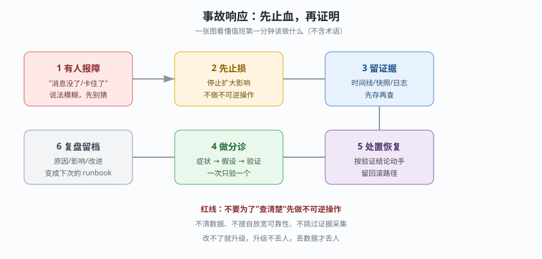
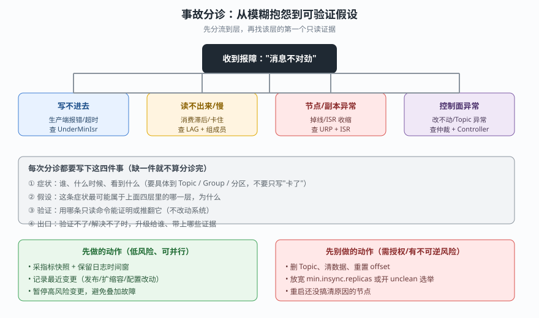
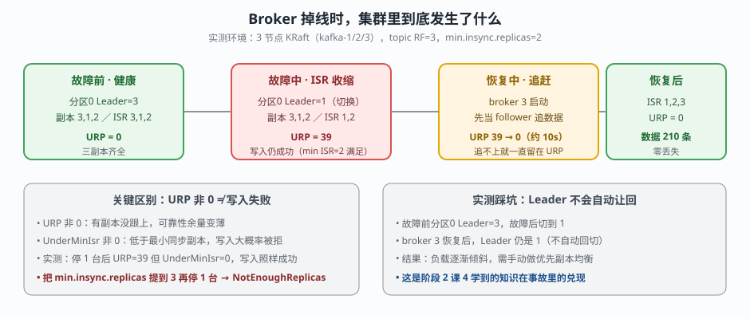
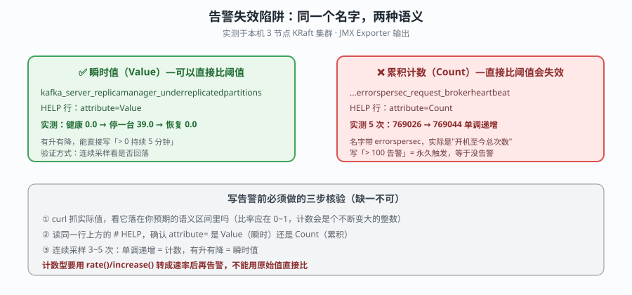

# 第 7 课：Kafka 事故响应与故障排查

> 所属阶段：阶段 3《可观测与故障排查》｜水平：入门｜目标：动手实操
> 故事情节：用户说"消息没了"——值班者必须在最短时间内止损、保留证据，再把模糊抱怨拆成可验证的假设。

> 📖 **结论已按官方文档核对**（核查于 2026-09 ｜ 来源：[Monitoring](https://kafka.apache.org/43/operations/monitoring/)、[Basic Kafka Operations](https://kafka.apache.org/43/operations/basic-kafka-operations/)、[KRaft](https://kafka.apache.org/43/operations/kraft/)、[Topic Configs](https://kafka.apache.org/43/configuration/topic-configs/)）。本课以 Kafka 4.3 文档作为指标语义、ISR/URP 定义、`min.insync.replicas` 行为和消费者组工具的核对基线。
>
> 🧪 **本课结论全部来自本机真跑**（2026-09-20）：3 节点 KRaft 集群（`kafka-1/2/3`，镜像 `apache/kafka:4.0.0`），topic `ops-incident-demo`（6 分区 / RF=3）。文中所有数字均为实测输出，未实测的部分会显式标注。
> ⚠️ **版本边界**：实验镜像为 Kafka 4.0.0，文档核对基线为 4.3；指标经过 JMX Exporter 转换后的 Prometheus 名称取决于 Exporter 配置，不能把本文名称直接照搬到所有环境。

## 🎯 本课目标

- 建立第一分钟止血、证据保全、分诊和升级的事故流程。
- 区分 Broker、ISR/副本、Controller、消费者和存储层故障。
- 依据症状倒查 lag、再均衡、生产失败、磁盘和元数据问题。

## 第一幕：起源与场景引入

晚上 21:40，业务群弹出一条消息："订单消息好像没了，看不到新数据。"

这句话里有三个陷阱：**"好像"**（不确定）、**"没了"**（可能是丢、可能是慢、可能是消费端停了）、**"消息"**（不知道是哪个 Topic、哪个消费组）。

值班者此时面对的不是"修好 Kafka"，而是三个更紧迫的问题：

1. 现在还在继续恶化吗？如果有，怎么先让它停下来？
2. 我接下来要做的每个动作，会不会把证据毁掉？
3. 这条模糊抱怨，能拆成哪几个可以逐条验证的假设？

### 一句话本质

**事故响应不是"找到根因"，而是"在损失最小的前提下，把不确定变成可验证，并在验证不了时知道该叫谁"。**

### 处境对照

| 做法 | 值班现场发生什么 | 最终结果 |
|------|------------------|----------|
| 上来就重启 Broker | 现场恢复了，但不知道为什么 | 根因未除，且重启可能丢掉未刷盘状态与现场日志 |
| 先删 Topic 重建"图个干净" | 数据真的没了 | 把可恢复的故障变成不可恢复的事故 |
| 先止损 + 留证据 + 分诊 | 慢一点，但每一步都可回退 | 能定位根因，恢复后还能沉淀成 runbook |
| 只盯一个指标下结论 | 看到 URP 非 0 就判定"写入挂了" | 实测中 URP=39 而写入完全正常，属于误判 |

> **场景说明**：21:40 与"订单消息"是虚构演练场景；集群拓扑、命令和实测数字来自本机实验环境。

## 第二幕：认知冲突

### 冲突一：恢复服务 和 保留证据 会抢同一分钟

重启一个 Broker 可能让业务立刻恢复，但也会清掉内存中的现场状态、让日志滚动、改变 leader 分布。正确顺序不是二选一，而是**先花几十秒做无损取证**（快照、指标、日志时间窗），再做有副作用的操作。

### 冲突二：指标名字一样，语义可能完全相反

本课实测遇到两个典型：

- `kafka_server_replicamanager_underreplicatedpartitions`：HELP 行 `attribute=Value`，实测健康时 `0.0`，停一台后 `39.0`，恢复后回到 `0.0`——可以直接比阈值。
- `kafka_network_requestmetrics_errorspersec_request_brokerheartbeat`：HELP 行 `attribute=Count`，实测 5 次采样为 `769026 → 769031 → 769035 → 769041 → 769044`，**严格单调递增**。名字里带 `errorspersec`，实际是"开机至今累计次数"。

如果给后者写一条 `> 100 就告警` 的规则，它会**永久处于告警态**，等价于没有告警——比阈值写错更危险，因为它让你误以为监控在工作。

### 冲突三：URP 非 0 不等于写入失败

这是最容易误判的一条。URP（UnderReplicatedPartitions）只说明"有副本没跟上"，是否影响写入取决于 `min.insync.replicas`。

本课实测：停掉 1 台 Broker 后，URP=39，但 `UnderMinIsrPartitionCount` 仍为 `0.0`，`acks=all` 写入**照常成功**。只有当把 `min.insync.replicas` 从 2 提到 3、再停 1 台时，ISR 降到 2 < 3，才出现 `NOT_ENOUGH_REPLICAS`。

## 第三幕：层层揭示

### 一眼全局图：事故第一分钟该做什么

> **看图**：左侧是"有人报障"，中间必须先止损、再留证据，右侧才做分诊和处置；下方的红线是本课最重要的约束——不要为了查清楚而先做不可逆操作。这张图不要求你先记住任何 Kafka 组件名。

### 本课地图（分三步走）

| 步 | 这一步要解决什么（人话） | 对应知识点 |
|:--:|------------------------|-----------|
| 1 | 把"先干什么"固化成不动脑也能执行的动作 | 事故止血、证据保全与分诊 |
| 2 | 区分节点掉线、副本收缩和控制面异常 | Broker/ISR/Controller 故障处置 |
| 3 | 按症状倒查积压、再均衡、生产失败和磁盘 | Lag、再均衡、生产失败与磁盘故障 |

### 知识点一：事故止血、证据保全与分诊

> 🧭 **第 1/3 步｜承接**：第二幕留下的问题是"恢复和取证抢时间" → **本步**：把先后顺序固化成清单，让值班不靠临场发挥。

#### 一句话定义

**事故响应，是在故障发生后按固定顺序执行止损、取证、分诊、处置和复盘，使恢复动作可回退、根因可追溯的标准化流程。**

#### 直觉建立：火灾现场先疏散，再查起火点

楼房起火，第一反应不是找是谁丢的烟头，而是先让人撤离、切断燃气、保留现场监控。等人和现场都安全了，消防和调查人员才有条件还原原因。

类比的边界是：Kafka 的"现场"是指标快照、日志时间窗和元数据状态，它们会随时间被覆盖；但 Kafka 也不允许为了取证就长期停服——取证动作必须在几十秒到几分钟内完成，且本身要保持只读。

#### 核心原理：三层动作，顺序不能反

| 层 | 目的 | 典型动作 | 为什么必须在这个位置 |
|----|------|----------|---------------------|
| 止损 | 停止影响扩大 | 暂停高风险变更、必要时限流或摘除异常节点 | 不先止损，后面的诊断会被新故障污染 |
| 取证 | 保住可回溯的现场 | 指标快照、日志时间窗、`--describe` 输出、最近变更记录 | 很多现场状态不可逆，错过就永久丢失 |
| 分诊 | 把模糊症状变成假设 | 症状 → 假设 → 只读验证 → 升级出口 | 不分诊会导致"每个可能都试一遍"，把事故拖长 |
| 处置 | 按验证结论恢复 | 重启、重分配、回滚配置 | 有前三层做支撑，处置才有回退路径 |
| 复盘 | 把事故变成资产 | 时间线、根因、影响面、改进项 | 不复盘，同样的故障会再发生 |

#### 证据保全清单（实测可用）

本课实验中实际执行的取证动作，可直接作为模板：

~~~bash
# ① 在线节点清单（谁还活着）
kafka-broker-api-versions.sh --bootstrap-server "<BROKER_ENDPOINT>" | grep -E '^kafka-'

# ② Topic / 分区 / ISR 布局（谁在当 leader、副本在哪）
kafka-topics.sh --bootstrap-server "<BROKER_ENDPOINT>" --describe --topic "<TOPIC_NAME>"

# ③ 消费组位置（积压多少、有没有活着的消费者）
kafka-consumer-groups.sh --bootstrap-server "<BROKER_ENDPOINT>" --describe --group "<GROUP_NAME>"

# ④ KRaft 仲裁状态（控制面是否健康）
kafka-metadata-quorum.sh --bootstrap-server "<BROKER_ENDPOINT>" describe --status

# ⑤ 指标快照（保留当前值域，不要只存结论）
curl -sS "http://<EXPORTER_ENDPOINT>/metrics" | grep -E \
  '^kafka_server_replicamanager_(underreplicatedpartitions|underminisrpartitioncount)|^kafka_log_logmanager_offlinelogdirectorycount|^kafka_controller_kafkacontroller_activecontrollercount'
# ※ 必须锚定行首 ^：裸 grep 除命中 # HELP/# TYPE 行外，还会混入
#   kafka_cluster_partition_underreplicated_* / _underminisr_* 这类每分区指标（语义不同）
~~~

> ⚠️ **实测踩坑（容器内跑 CLI）**：在本课环境中，直接在容器内执行 CLI 会继承 broker 的 `KAFKA_JMX_OPTS`，其中的 `-javaagent=...17071` 会与已占用端口冲突，报 `Failed to start Prometheus JMX Exporter / java.net.BindException: Address in use`，CLI 起不来。
> 解法是执行时清空该变量：
> ~~~bash
> docker exec -e KAFKA_JMX_OPTS="" l15-kafka-1 /opt/kafka/bin/kafka-topics.sh --bootstrap-server "kafka-1:9092" --list
> ~~~
> 另一个踩坑：`19192` 是**宿主机**映射端口；在容器网络内部要用 advertised listener 地址 `kafka-1:9092`。用错会看到 `Connection to node -1 could not be established`。这两个坑本身就是"分诊要先确认观察位置"的例子。

#### 分诊：四层分流

> **看图**：先把报障分到写、读、节点/副本、控制面四层之一，每层都有对应的第一个只读证据；右侧列出先做和先别做的动作。

分诊记录必须写下四项，缺一项不算分诊完成：

1. **症状**：谁、什么时候、看到什么——要具体到 Topic / Group / 分区。
2. **假设**：最可能属于四层中的哪一层，理由是什么。
3. **验证**：用哪条**只读**命令能证明或推翻它。
4. **出口**：验证不了时升级给谁，带哪些证据。

#### 常见误区

- **误区 1：**"先把服务恢复了再说，原因以后查。"错；恢复动作常会销毁现场。先做几十秒无损取证，成本极低。
- **误区 2：**"重启是最快的办法。"错；重启改变 leader 分布、滚动日志，且本课实测显示重启后 leader **不会自动让回**，会留下负载倾斜。
- **误区 3：**"告警在响，说明监控是好的。"错；本课实测的 Count 型指标会永久触发，看起来在告警，实际提供不了有效信息。
- **误区 4：**"分诊是资深工程师的事，新手就照 runbook 做。"错；runbook 只能覆盖已知故障，分诊能力决定你能否处理 runbook 之外的第一条。

#### 行话锚定

| 行话 | 在哪里遇到 |
|------|------------|
| Incident response（事故响应，社区常用译法、官方未定中文名） | 值班流程、on-call 手册 |
| Triage（分诊，社区常用译法、官方未定中文名） | 事故前几分钟的症状归类 |
| Mitigation（止损，社区常用译法、官方未定中文名） | 与 root cause 相对的第一步动作 |
| Runbook | 值班台账、本课课 1 的交接基线包 |
| Evidence preservation | 取证清单、复盘材料 |
| Escalation（升级） | 分诊出口、值班升级链路 |

#### 一句话记住

**先止损，再取证，后分诊；每一步都要能回答"验证不了时我找谁"。**

📚 **官方文档**：[Basic Kafka Operations：Topic/Consumer Group 的 describe 与只读核查](https://kafka.apache.org/43/operations/basic-kafka-operations/) ｜ [Monitoring：URP、UnderMinIsr、OfflineLogDirectory 等指标定义](https://kafka.apache.org/43/operations/monitoring/)

### 知识点二：Broker/ISR/Controller 故障处置

> 🧭 **第 2/3 步｜承接**：上一步把动作顺序固化成清单 → **本步**：面对最常见的"掉了一台"，看懂集群到底发生了什么。

#### 一句话定义

**Broker 故障处置，是在节点不可用时，判断 leader 切换、ISR 收缩和 URP 变化是否在可靠性预算内，并选择恢复、等待还是升级的过程。**

#### 直觉建立：三班倒的柜台，一个人临时离开

银行开三个柜台，每个业务都要两个柜员同时记账才算数。一个人临时离开，剩下两人还能办业务（只是余量变少）；人回来后要把离开期间的业务补记完，才重新变成"三人在岗"。

类比的边界是：Kafka 里"补记"是 follower 追上 leader 的日志，需要时间和网络；如果离开太久（超过保留期）或积压太多，追赶可能失败，这时需要人工介入。

#### 核心原理：一次真实掉线的三个阶段

> **看图**：健康 → ISR 收缩 → 追赶恢复 → 恢复后；注意中间 URP=39 但写入仍成功，以及恢复后 leader 未自动让回。

本课实测输出（topic `ops-incident-demo`，6 分区 / RF=3 / `min.insync.replicas=2`）：

**阶段 1 · 故障前**

~~~text
Topic: ops-incident-demo  Partition: 0  Leader: 3  Replicas: 3,1,2  Isr: 3,1,2
URP = 0.0
~~~

**阶段 2 · 停掉 broker 3 后约 12 秒**

~~~text
Topic: ops-incident-demo  Partition: 0  Leader: 1  Replicas: 3,1,2  Isr: 1,2
URP = 39.0        UnderMinIsrPartitionCount = 0.0
在线节点：kafka-1(id=1)、kafka-2(id=2)   ← broker 3 已从列表消失
acks=all 写入：成功
~~~

三个关键读法：

1. **Leader 从 3 切到 1**：副本列表 `3,1,2` 没变（副本位置不会因为故障而重排），变的是谁在提供服务。
2. **ISR 从 `3,1,2` 收缩成 `1,2`**：broker 3 被移出同步集合，这是 URP 上升的直接原因。
3. **URP=39 但写入正常**：因为 39 个分区的 ISR 仍有 2 个副本，满足 `min.insync.replicas=2`。

**阶段 3 · 恢复 broker 3**

~~~text
URP 收敛采样（每 5 秒）：
t=5s  URP=39.0     ← 还在追赶
t=10s URP=0.0      ← 已追平
t=15s~60s URP=0.0  ← 持续稳定

Topic: ops-incident-demo  Partition: 0  Leader: 1  Replicas: 3,1,2  Isr: 1,2,3
数据完整性校验：消费总数 = 210 条（= 故障前 200 + 故障中 10），零丢失
~~~

> 🔎 **实测发现（值得记住）**：恢复后 `Isr` 变回 `1,2,3`，但 **Leader 仍然是 1，没有自动让回给 broker 3**。这意味着故障恢复后集群能继续服务，但 leader 分布会逐渐倾斜——这正是阶段 2 课 4 学过的**优先副本均衡**要在事故后执行的原因。这不是 bug，是 Kafka 避免不必要的 leader 抖动的设计取舍。

#### Controller 与 KRaft 仲裁：控制面故障长什么样

控制面（谁当 Controller、元数据能否提交）和数据面（消息能否读写）要分开判断。实测健康基线：

~~~bash
kafka-metadata-quorum.sh --bootstrap-server "kafka-1:9092" describe --status
~~~

~~~text
ClusterId:              5L6g3nShT-eMCtK--X86sw
LeaderId:               1
LeaderEpoch:            3
HighWatermark:          1032160
MaxFollowerLag:         0
MaxFollowerLagTimeMs:   0
CurrentVoters:          [{"id": 1, ...}, {"id": 2, ...}, {"id": 3, ...}]
CurrentObservers:       []
~~~

判断要点：

| 字段 | 健康含义 | 异常时的含义 |
|------|----------|-------------|
| `LeaderId` | 有且仅有一个 leader | 缺失或频繁变更，说明仲裁不稳定 |
| `MaxFollowerLag` | 元数据同步滞后量，理想为 0 | 持续非 0 说明 follower 追不上 |
| `MaxFollowerLagTimeMs` | 滞后时间 | 持续增长要查网络和磁盘 |
| `CurrentVoters` | 投票成员名单 | 成员缺失会导致仲裁能力下降 |
| `ActiveControllerCount` | 实测 `1.0`，只有一台应为 1 | 多台为 1 或全为 0 都是控制面异常 |

**控制面异常 vs 数据面异常的处置差别**：控制面出问题时，`kafka-topics.sh --create`、`--alter` 这类元数据操作会失败或挂起，但**已经建立的读写连接通常不受影响**。所以"改不动 Topic"和"读不到消息"要分别归因，不要混为一谈。

#### 处置动作与红线

| 状况 | 可以做 | 不要做 |
|------|--------|--------|
| 单台掉线，URP 非 0 但 UnderMinIsr=0 | 观察、准备恢复、暂停高风险变更 | 立刻删分区、放宽 min.insync |
| UnderMinIsr 非 0，写入被拒 | 恢复副本、评估是否临时调整（需审批） | 擅自把 `min.insync.replicas` 降到 1 |
| Leader 在 ISR 外且无法恢复 | 评估数据丢失风险后决策，需上报 | **擅自开启 unclean leader election** |
| 恢复后负载倾斜 | 执行优先副本均衡（见课 4） | 认为"URP 归零就完事了" |

> 🚫 **关于 unclean leader election 的边界**：它允许 ISR 之外的副本成为 leader，可能**永久丢失**已提交数据。这是业务决策，不是技术操作，必须走审批。课 7 的目标是让你知道在什么时候**停下来去叫人**，而不是学会怎么开这个开关。

#### 常见误区

- **误区 1：**"URP 非 0 就是写入要挂了。"错；实测 URP=39 时 `acks=all` 写入完全正常，关键看 UnderMinIsr。
- **误区 2：**"副本列表变了，说明数据重新分布了。"错；实测 `Replicas: 3,1,2` 始终不变，变的是 ISR 和 Leader。
- **误区 3：**"URP 归零就代表事故结束。"错；恢复后还要检查 leader 是否倾斜、是否需要优先副本均衡。
- **误区 4：**"控制面有问题，业务一定受影响。"错；元数据操作失败和消息读写失败是两回事。

#### 行话锚定

| 行话 | 在哪里遇到 |
|------|------------|
| ISR（In-Sync Replicas） | `kafka-topics.sh --describe` 输出、副本同步集合 |
| URP（UnderReplicatedPartitions） | ReplicaManager 指标、故障第一信号 |
| UnderMinIsrPartitionCount | 低于 `min.insync.replicas` 的分区数，直接关联写入 |
| Leader epoch | 副本选举轮次、日志截断判断 |
| Unclean leader election | 允许非 ISR 副本当 leader，可能丢数据 |
| Preferred leader（优先副本） | 课 4 的均衡操作、事故后整理 |
| KRaft quorum（仲裁） | `kafka-metadata-quorum.sh`、控制面健康 |

#### 一句话记住

**副本列表不会变，变的是 ISR 和 Leader；URP 非 0 只是余量变薄，UnderMinIsr 非 0 才是写入危机。**

📚 **官方文档**：[KRaft：仲裁、Controller 与元数据运维](https://kafka.apache.org/43/operations/kraft/) ｜ [Monitoring：ActiveControllerCount、OfflinePartitionsCount 与 ISR 指标](https://kafka.apache.org/43/operations/monitoring/)

### 知识点三：Lag、再均衡、生产失败与磁盘故障

> 🧭 **第 3/3 步｜承接**：上一步处理了节点和副本 → **本步**：按症状倒查消费积压、生产失败和磁盘问题，并学会核对指标语义。

#### 一句话定义

**症状倒查，是从"读得慢/写不进/盘要满"这类可观察现象出发，用只读命令逐层排除，最终收敛到具体根因的过程。**

#### 直觉建立：水管没水，先分清是水厂、管道还是龙头

家里龙头没水，可能是水厂停供、管道破裂、或者只是龙头堵了。你会先打开其他龙头（判断范围），再看邻居家（判断边界），而不是立刻挖开院子。

类比的边界是：Kafka 的"没水"在指标上可能表现为 lag、错误率或磁盘水位，三者对应的处置完全不同，必须先分层再动手。

#### 场景一：Consumer lag——"有 lag"不等于"有活着的消费者"

本课实测制造积压后的输出（灌入 801 条消息，消费组只消费了 1 条就退出）：

~~~bash
kafka-consumer-groups.sh --bootstrap-server "kafka-1:9092" --describe --group "ops-lag-cg"
~~~

~~~text
GROUP       TOPIC             PARTITION  CURRENT-OFFSET  LOG-END-OFFSET  LAG   CONSUMER-ID  HOST  CLIENT-ID
ops-lag-cg  ops-incident-demo 1          80              217             137   -            -     -
ops-lag-cg  ops-incident-demo 2          89              223             134   -            -     -
ops-lag-cg  ops-incident-demo 3          76              201             125   -            -     -
ops-lag-cg  ops-incident-demo 4          104             228             124   -            -     -
ops-lag-cg  ops-incident-demo 0          80              238             158   -            -     -
ops-lag-cg  ops-incident-demo 5          82              205             123   -            -     -
~~~

同时查状态：

~~~text
GROUP       COORDINATOR (ID)   ASSIGNMENT-STRATEGY  STATE   #MEMBERS
ops-lag-cg  kafka-2:9092 (2)   -                    Empty   0
~~~

> 🔎 **实测得到的两个关键结论**：
> 1. **`CONSUMER-ID` 和 `HOST` 是 `-`**：没有任何活跃消费者在持有这些分区。lag 存在只说明"有人提交过 offset，但当前没人消费"。
> 2. **`STATE=Empty`**：组里零成员。此时"lag 增长"不是"消费变慢"，而是**消费者整体不在了**——可能是应用崩溃、发布失败或被误停。
>
> 这两点决定了完全不同的处置方向：前者要扩容或优化消费逻辑，后者要先找回消费者进程。**只看 LAG 数字会误判**。

对照实验（对照组：有活跃消费者时）：同样灌数据，8 秒后查询 LAG 全为 `0`，`STATE=Stable`、`#MEMBERS=1`——消费者追得上，就没有积压。

**lag 倒查三问**：

| 问 | 用什么看 | 不同答案意味着什么 |
|----|----------|-------------------|
| 组里有活着的成员吗？ | `--describe` 的 CONSUMER-ID / `--state` 的 #MEMBERS | 没有 → 先找进程，不是先调分区 |
| lag 是在增长还是静止？ | 间隔 10 秒采样两次 | 增长 → 消费跟不上；静止 → 消费者已停 |
| 是单分区还是全分区？ | 逐分区 LAG 列 | 单分区 → 热点或该分区卡住；全分区 → 全局问题 |

#### 场景二：再均衡（Rebalance）

再均衡频繁是"消费变慢"的常见伪装。观察方式：

~~~bash
kafka-consumer-groups.sh --bootstrap-server "kafka-1:9092" --describe --group "<GROUP_NAME>" --state
kafka-consumer-groups.sh --bootstrap-server "kafka-1:9092" --describe --group "<GROUP_NAME>" --members
~~~

实测输出示例（健康状态）：

~~~text
GROUP            COORDINATOR (ID)   ASSIGNMENT-STRATEGY  STATE    #MEMBERS
ops-incident-cg  kafka-1:9092 (1)   range                Stable   1
~~~

判读要点：

| 观察 | 可能原因 | 下一步只读证据 |
|------|----------|---------------|
| STATE 在 `Stable` / `PreparingRebalance` 间反复 | 消费者频繁加入退出 | 查应用重启记录、`session.timeout.ms`、`max.poll.interval.ms` |
| #MEMBERS 忽多忽少 | 实例被驱逐或网络抖动 | 查实例数、GC 日志、网络 |
| 分配策略为 `range` 且分区不均 | 分区数不能被成员数整除 | 查各成员 `#PARTITIONS` 列 |

> ⚠️ **边界说明**：本课实测环境只跑到单成员稳定态，未复现高频再均衡。上表为按官方文档与客户端参数语义给出的**判读框架**，具体阈值与参数需在你的环境中实测校准（未实测）。相关参数细节参见主教程课 18《消费者位移与协调者》。

#### 场景三：生产失败——`min.insync.replicas` 与 `acks` 的真实交互

这是本课最有价值的实测之一。同一个集群，只改一个配置，写入行为完全相反。

**情况 A：ISR 充足（min.insync.replicas=2，停 1 台后 ISR=2）**

~~~bash
kafka-console-producer.sh --bootstrap-server "kafka-1:9092" --topic "ops-incident-demo" \
  --producer-property acks=all --property "key.separator=," --property "parse.key=true"
~~~

~~~text
（无报错，写入成功）
~~~

**情况 B：把 min.insync.replicas 提到 3，再停 1 台（ISR=2 < 3）**

~~~bash
kafka-configs.sh --bootstrap-server "kafka-1:9092" --alter --entity-type topics \
  --entity-name "ops-incident-demo" --add-config min.insync.replicas=3
~~~

~~~text
[2026-09-20 02:58:08,815] WARN [Producer clientId=console-producer] Got error produce response
  with correlation id 5 on topic-partition ops-incident-demo-1, retrying (2 attempts left).
  Error: NOT_ENOUGH_REPLICAS
[2026-09-20 02:58:08,907] WARN ... retrying (1 attempts left). Error: NOT_ENOUGH_REPLICAS
[2026-09-20 02:58:09,127] WARN ... retrying (0 attempts left). Error: NOT_ENOUGH_REPLICAS
[2026-09-20 02:58:09,606] ERROR Error when sending message to topic ops-incident-demo ...
org.apache.kafka.common.errors.NotEnoughReplicasException:
  Messages are rejected since there are fewer in-sync replicas than required.
~~~

**情况 C：同样的 ISR 不足，改用 acks=1**

~~~text
（写入成功，无报错）
~~~

> 🔎 **这张对照表是事故决策的核心**：

| 配置组合 | ISR 充足时 | ISR 不足时 | 可靠性含义 |
|----------|-----------|-----------|-----------|
| `acks=all` + `min.insync.replicas=2` | ✅ 成功 | ✅ 成功（实测） | 可容忍 1 台故障，写入不中断 |
| `acks=all` + `min.insync.replicas=3` | ✅ 成功 | ❌ `NOT_ENOUGH_REPLICAS`（实测） | 不容忍副本缺失，宁可拒绝写入 |
| `acks=1` + 任意 | ✅ 成功 | ✅ 成功（实测） | **写入可能只落在 1 个副本，有丢数据风险** |

**处置含义**：当生产端报 `NOT_ENOUGH_REPLICAS` 时，"把 `acks` 改成 1"是最容易想到也最危险的做法——它让报错消失，但把**可观测的失败变成了不可见的可靠性损失**。正确动作是先恢复副本，恢复不了再走审批流程评估是否临时调整。

#### 场景四：磁盘与日志目录

磁盘问题的只读证据链（本环境实测值）：

~~~bash
# 磁盘水位
df -h /tmp            # overlay  1007G  224G  733G  24% /
du -sh /tmp/kraft-logs  # 111M

# 日志目录离线指标
curl -s http://localhost:17071/metrics | grep -E 'offlinelogdirectorycount|logdirectoryoffline'
~~~

~~~text
kafka_log_logmanager_offlinelogdirectorycount  0.0
kafka_log_logmanager_logdirectoryoffline       0.0
~~~

| 指标 | 正常值 | 非 0 时意味着什么 |
|------|--------|------------------|
| `OfflineLogDirectoryCount` | 0 | 有日志目录离线，该目录上的分区无法写入 |
| `LogDirectoryOffline` | 0 | 可按目录定位具体是哪个路径 |
| `FailedProduceRequestsPerSec` | 0（实测） | 生产端失败速率，配合上两项定位 |

> ⚠️ **未实测声明**：本课**没有**真正把磁盘写满来触发故障（避免破坏实验环境）。上表指标的正常值来自本环境健康态实测；"磁盘写满后的具体行为"属于未实测部分，官方行为应以 [Monitoring](https://kafka.apache.org/43/operations/monitoring/) 与 [Hardware and OS](https://kafka.apache.org/43/operations/hardware-and-os/) 文档为准。

#### 场景五：指标语义陷阱（本课最重要的方法论）

> **看图**：左边是可以直接比阈值的 Value 型指标，右边是名字像速率、实际是累积计数的 Count 型指标；下方是写告警前的三步核验。

实测对比：

~~~bash
curl -s http://localhost:17071/metrics | grep '^# HELP.*underreplicatedpartitions'
curl -s http://localhost:17071/metrics | grep '^# HELP.*brokerheartbeat'
~~~

~~~text
# HELP kafka_server_replicamanager_underreplicatedpartitions
  Attribute exposed for management kafka.server:name=UnderReplicatedPartitions,type=ReplicaManager,attribute=Value

# HELP kafka_network_requestmetrics_errorspersec_request_brokerheartbeat
  Attribute exposed for management kafka.network:name=ErrorsPerSec,type=RequestMetrics,attribute=Count
~~~

连续 5 次采样（间隔 3 秒）：

~~~text
Value 型（URP）：        0.0 → 39.0 → 0.0          （有升有降，可直接比阈值）
Count 型（heartbeat）：  769026 → 769031 → 769035 → 769041 → 769044   （单调递增）
~~~

**三步核验法**（写任何告警规则之前都要走一遍）：

1. `curl` 抓实际值，判断它是否落在你预期的语义区间（比率应在 0~1，计数会是个不断变大的整数）。
2. 读该行上方的 `# HELP`，确认 `attribute=` 是 **Value（瞬时）** 还是 **Count（累积）**。
3. 连续采样 3~5 次：单调递增 = 计数；有升有降 = 瞬时值。

> 计数型指标要用 `rate()` / `increase()` 转成速率后才能用于告警，用原始值直接比阈值会产生"永久告警"或"永不告警"这两种静默失效。

#### 常见误区

- **误区 1：**"lag 大就是消费者慢。"错；实测 `STATE=Empty`、`CONSUMER-ID=-` 时，lag 大是因为**消费者不在了**。
- **误区 2：**"生产报 NOT_ENOUGH_REPLICAS，把 acks 改成 1 就好了。"错；这让失败从可见变成不可见，风险更高。
- **误区 3：**"指标名带 errorspersec，就是每秒错误数。"错；实测该指标 `attribute=Count`，是累积计数。
- **误区 4：**"磁盘还有空间，Kafka 就一定健康。"错；还要看日志目录是否离线、分区是否可写。
- **误区 5：**"删除 Topic 的命令返回了，就是删掉了。"错；本课实测首次删除后 topic 仍在列表中（且变成 RF=1/1 分区的中间态），需复查 `--list` 确认。

#### 行话锚定

| 行话 | 在哪里遇到 |
|------|------------|
| Consumer lag | `--describe` 的 LAG 列、积压判断 |
| Committed offset | 消费组提交位置、lag 计算基准 |
| Rebalance（再均衡） | `--state` 输出、消费组状态变化 |
| `min.insync.replicas` | Topic 配置、写入可靠性门槛 |
| `acks` | Producer 配置、写入确认级别 |
| `NOT_ENOUGH_REPLICAS` | 生产端报错、ISR 不足 |
| `NOT_LEADER_FOR_PARTITION` | leader 切换期间的常见瞬时错误 |
| OfflineLogDirectoryCount | 日志目录离线指标、磁盘故障 |

#### 一句话记住

**先分清"慢"和"不在"，再分清"瞬时值"和"累积计数"；让失败保持可见，比让它消失更安全。**

📚 **官方文档**：[Topic Configs：min.insync.replicas 与保留策略](https://kafka.apache.org/43/configuration/topic-configs/) ｜ [Monitoring：failed produce/fetch、日志目录与请求指标](https://kafka.apache.org/43/operations/monitoring/) ｜ [Basic Kafka Operations：Consumer Group 与 Topic 只读核查](https://kafka.apache.org/43/operations/basic-kafka-operations/)

## 第四幕：实操验证——把事故流程跑一遍

> 🧪 **本课为实测课**：以下练习在 3 节点 KRaft 实验集群上真实执行过，输出均为原始结果。若你在自己的环境复现，请把 broker 地址、topic 名和端口替换为你的环境值。
> ⚠️ **安全边界**：以下操作会**停止容器**和**修改 topic 配置**。只在你自己的实验集群执行，不要在共享或生产环境运行。

### 4.1 机制验证

### 练习 1：建立故障前的健康基线（只读）

~~~bash
# ① 谁在线
kafka-broker-api-versions.sh --bootstrap-server "kafka-1:9092" | grep -E '^kafka-'
# 预期：3 个节点，isFenced: false

# ② 控制面健康
kafka-metadata-quorum.sh --bootstrap-server "kafka-1:9092" describe --status
# 记录 LeaderId、MaxFollowerLag、CurrentVoters

# ③ 关键指标基线
curl -s http://localhost:17071/metrics | grep -E \
  '^kafka_server_replicamanager_underreplicatedpartitions|underminisrpartitioncount|offlinelogdirectorycount|activecontrollercount'
# 预期：URP=0、UnderMinIsr=0、OfflineLogDir=0、ActiveController=1
~~~

**验收问题**：四个基线值里，哪一个非 0 会直接影响写入？答案是 `UnderMinIsrPartitionCount`——URP 非 0 只代表余量变薄。

### 练习 2：真实制造一次 Broker 掉线

~~~bash
# 建一个有可靠性基线的 topic
kafka-topics.sh --bootstrap-server "kafka-1:9092" --create --if-not-exists \
  --topic "ops-incident-demo" --partitions 6 --replication-factor 3 \
  --config min.insync.replicas=2

# 灌 200 条带 key 的消息
seq 1 200 | awk '{print "k"$1",v"$1}' | \
  kafka-console-producer.sh --bootstrap-server "kafka-1:9092" --topic "ops-incident-demo" \
    --property "key.separator=," --property "parse.key=true"

# 停掉一个 broker（故障注入）
docker stop l15-kafka-3
sleep 12

# 观察 ISR 收缩
kafka-topics.sh --bootstrap-server "kafka-1:9092" --describe --topic "ops-incident-demo"
~~~

**对照你的观察填写**：

| 项 | 故障前 | 故障中 | 你的解释 |
|----|--------|--------|----------|
| Leader（分区 0） | | | 为什么变了？ |
| ISR | | | 少了谁？ |
| URP | | | 为什么是这个数？ |
| UnderMinIsr | | | 为什么仍是 0？ |
| 写入是否成功 | | | 与 min.insync.replicas 的关系？ |

> 本课实测答案：Leader 3→1，ISR `3,1,2`→`1,2`，URP 0→39，UnderMinIsr 保持 0，写入成功。

### 练习 3：观测恢复过程（URP 收敛曲线）

~~~bash
docker start l15-kafka-3

for i in $(seq 1 12); do
  echo "t=$((i*5))s URP=$(curl -s http://localhost:17071/metrics | \
    grep '^kafka_server_replicamanager_underreplicatedpartitions' | awk '{print $2}')"
  sleep 5
done
~~~

本课实测：`t=5s URP=39.0` → `t=10s URP=0.0` → 后续稳定为 0。

**验收问题**：

1. URP 从 39 回到 0 用了多久？你的环境更快还是更慢？可能受哪些因素影响？
2. 恢复后查一次 `--describe`，**分区 0 的 Leader 是谁？** 和故障前一样吗？（本课实测：仍是 1，未自动让回）
3. 消费总数校验：应该是 `故障前 200 + 故障中新增`。你测得多少？

### 练习 4：制造 lag 并区分"慢"与"不在"

~~~bash
# 先让一个消费者只消费 1 条就退出（留下 committed offset）
kafka-console-consumer.sh --bootstrap-server "kafka-1:9092" --topic "ops-incident-demo" \
  --group "ops-lag-cg" --max-messages 1 --timeout-ms 20000

# 再灌 800 条制造积压
seq 300 1100 | awk '{print "k"$1",v"$1}' | \
  kafka-console-producer.sh --bootstrap-server "kafka-1:9092" --topic "ops-incident-demo" \
    --property "key.separator=," --property "parse.key=true"

# 关键：同时看 lag 和组状态
kafka-consumer-groups.sh --bootstrap-server "kafka-1:9092" --describe --group "ops-lag-cg"
kafka-consumer-groups.sh --bootstrap-server "kafka-1:9092" --describe --group "ops-lag-cg" --state
~~~

**验收问题**：

1. `CONSUMER-ID` 列显示的是什么？如果是 `-`，说明什么？
2. `#MEMBERS` 是 0 时，你的处置动作应该是什么？（提示：不是调分区数）
3. 起一个真正的消费者再查一次，`STATE` 和 `LAG` 分别变成什么？

### 练习 5：验证 min.insync.replicas 与 acks 的交互

~~~bash
# 提到 3
kafka-configs.sh --bootstrap-server "kafka-1:9092" --alter --entity-type topics \
  --entity-name "ops-incident-demo" --add-config min.insync.replicas=3

# 停 1 台后，acks=all 写入（预期失败）
docker stop l15-kafka-3
sleep 12
echo "probe,fail" | kafka-console-producer.sh --bootstrap-server "kafka-1:9092" \
  --topic "ops-incident-demo" --producer-property acks=all \
  --property "key.separator=," --property "parse.key=true"

# 同样条件下 acks=1 写入（预期成功，但可靠性下降）
echo "probe,acks1" | kafka-console-producer.sh --bootstrap-server "kafka-1:9092" \
  --topic "ops-incident-demo" --producer-property acks=1 \
  --property "key.separator=," --property "parse.key=true"
~~~

**验收问题**：`NOT_ENOUGH_REPLICAS` 出现时，为什么"改成 acks=1"是错误动作？请写出你的理由。

### 练习 6：指标语义三步核验

~~~bash
# ① 抓实际值
curl -s http://localhost:17071/metrics | grep 'errorspersec_request_brokerheartbeat'

# ② 读 HELP 行
curl -s http://localhost:17071/metrics | grep '^# HELP.*brokerheartbeat'

# ③ 连续采样 5 次
for i in 1 2 3 4 5; do
  curl -s http://localhost:17071/metrics | \
    grep '^kafka_network_requestmetrics_errorspersec_request_brokerheartbeat' | awk '{print $2}'
  sleep 3
done
~~~

**验收问题**：这个指标是单调的还是波动的？如果直接写 `> 100 告警`，会发生什么？

### 4.2 应用实战：一小时事故响应 runbook（入口）

> 🎯 **本课应用实战独立成篇**：[第 7 课实战 · 事故响应 runbook](../../../应用实战/07-Kafka事故响应与故障排查.md)
> 含**分步设计图**与"基础 → 综合"的完整演进；通览全部：📚 [应用实战索引](../../../应用实战/INDEX.md)
> **课内不重复实战正文**：本课负责讲清止血、分诊和症状倒查，实战篇负责把这些动作组装成一份能真的在值班时照着执行的 runbook。

## 第五幕：体系收束

本课把阶段 3 前一半的"看得到"推进成"处理得了"：

~~~mermaid
flowchart LR
    A[信号与告警] --> B[第一分钟止损]
    B --> C[证据保全]
    C --> D[四层分诊]
    D --> E[Broker/ISR/Controller 处置]
    D --> F[Lag/再均衡倒查]
    D --> G[生产失败与磁盘]
    E --> H[验证恢复与复盘]
    F --> H
    G --> H
    H --> I[下一阶段：安全变更与灾备]
~~~

> **看图**：告警只是入口，止损和取证是所有分支的共同前置；三种症状各有倒查路径，最终都要回到"验证恢复并复盘"。

### 🐞 常见误区速查

| 误区 | 正确判断 |
|------|----------|
| URP 非 0 就是写入要挂 | 关键看 UnderMinIsr；实测 URP=39 时写入正常 |
| 副本列表变了说明数据重分布 | 变的是 ISR 和 Leader，Replicas 不变 |
| URP 归零就是事故结束 | 还要查 leader 倾斜，可能需要优先副本均衡 |
| lag 大就是消费者慢 | 先看 CONSUMER-ID 和 #MEMBERS，可能是消费者不在了 |
| NOT_ENOUGH_REPLICAS 就改 acks=1 | 把可见失败变成不可见的可靠性损失 |
| 指标名带 errorspersec 就是速率 | 读 HELP 行的 attribute，实测有 Count 型陷阱 |
| 删除命令返回就是删掉了 | 实测需复查 --list 确认 |
| 控制面异常业务一定受影响 | 元数据操作与消息读写要分别归因 |

### 一图总结

~~~mermaid
flowchart TB
    A[事故响应与故障排查] --> B[止血·取证·分诊]
    A --> C[Broker/ISR/Controller]
    A --> D[Lag/再均衡/生产失败/磁盘]
    B --> B1[三层动作顺序 + 四层分流 + 升级出口]
    C --> C1[URP vs UnderMinIsr + 优先副本均衡]
    D --> D1[慢 vs 不在 + acks/min.insync + 指标语义三步核验]
    B1 --> E[可回退的处置]
    C1 --> E
    D1 --> E
    E --> F[阶段 4：安全运营与滚动变更]
~~~

> **三层回扣**：第一层让值班有固定动作顺序，第二层让"掉一台"不再恐慌，第三层让每种症状都有对应的倒查路径和红线；下一阶段将把这些处置经验用于**不引发事故的变更**。

## 🧪 课后小测

1. 停掉一台 Broker 后 URP=39，但 acks=all 写入仍然成功，为什么？

URP 只说明有副本未跟上；是否拒绝写入取决于 ISR 是否仍满足 `min.insync.replicas`。本例 `min.insync.replicas=2`，停 1 台后 ISR=2 仍满足条件，所以写入正常。真正预示写入被拒的是 `UnderMinIsrPartitionCount` 非 0。

2. 消费者组的 LAG 很大，但 STATE=Empty、CONSUMER-ID 为 `-`，这说明什么？该怎么处置？

说明当前**没有任何活跃消费者**在消费该组，lag 只是"上次提交位置与日志末端的差"。处置方向是找回消费者进程（查应用是否崩溃、被停或发布失败），而不是调整分区数或消费逻辑。

3. 为什么不能把 MBean 名称直接当作 Prometheus 指标名？本课哪个指标体现了这一点？

Exporter 会按映射规则转换名称和标签。本课实测 `kafka_network_requestmetrics_errorspersec_request_brokerheartbeat` 就是例子：名字像速率，但 HELP 行 `attribute=Count`、连续采样单调递增，实为累积计数。

4. 生产端报 NOT_ENOUGH_REPLICAS，为什么"改成 acks=1"是危险动作？

`acks=1` 会让写入在只落到一个副本时就返回成功，报错消失但**已提交数据的可靠性保障同时消失**。故障从"可见的拒绝"变成"不可见的丢数据风险"。正确做法是先恢复副本，恢复不了则走审批评估是否临时调整可靠性配置。

5. Broker 恢复后 URP 回到 0，事故是否可以宣告结束？还差什么？

还差两步：① 检查 leader 分布是否倾斜——本课实测恢复后分区 0 的 Leader 仍是 1，未自动让回给 broker 3，需要执行优先副本均衡；② 校验数据完整性（消费总数是否等于预期）并完成复盘留档。

## 命令速查卡

| 目的 | 命令 |
|------|------|
| 查看在线节点 | `kafka-broker-api-versions.sh --bootstrap-server "<BROKER_ENDPOINT>" \| grep -E '^kafka-'` |
| 查看分区/ISR/Leader | `kafka-topics.sh --bootstrap-server "<BROKER_ENDPOINT>" --describe --topic "<TOPIC_NAME>"` |
| 查看消费组 lag | `kafka-consumer-groups.sh --bootstrap-server "<BROKER_ENDPOINT>" --describe --group "<GROUP_NAME>"` |
| 查看组状态与成员 | `kafka-consumer-groups.sh --bootstrap-server "<BROKER_ENDPOINT>" --describe --group "<GROUP_NAME>" --state` |
| 查看 KRaft 仲裁 | `kafka-metadata-quorum.sh --bootstrap-server "<BROKER_ENDPOINT>" describe --status` |
| 修改 topic 配置 | `kafka-configs.sh --bootstrap-server "<BROKER_ENDPOINT>" --alter --entity-type topics --entity-name "<TOPIC_NAME>" --add-config <K>=<V>` |
| 抓关键指标 | `curl -sS "http://<EXPORTER_ENDPOINT>/metrics" \| grep -E '^kafka_server_replicamanager_(underreplicatedpartitions\|underminisrpartitioncount)\|^kafka_log_logmanager_offlinelogdirectorycount\|^kafka_controller_kafkacontrollercount'`（须锚定 `^`，否则会命中 HELP 行并混入 `kafka_cluster_partition_*` 每分区指标） |
| 读指标语义 | `curl -sS "http://<EXPORTER_ENDPOINT>/metrics" \| grep '^# HELP.*<METRIC>'` |
| 磁盘水位 | `df -h <LOG_DIR>` ／ `du -sh <LOG_DIR>` |
| 容器内跑 CLI 的坑 | `docker exec -e KAFKA_JMX_OPTS="" <CONTAINER> <COMMAND>` |

> 占位符必须替换为你自己的环境值。容器内执行 CLI 时用 advertised listener 地址（如 `kafka-1:9092`），不要用宿主机映射端口。所有会停节点、改配置、删 Topic 的操作只可在自有实验环境执行。

## 📚 官方文档

- [Monitoring：URP、UnderMinIsr、OfflineLogDirectory、ActiveControllerCount 与请求指标](https://kafka.apache.org/43/operations/monitoring/)
- [Basic Kafka Operations：Topic / Consumer Group describe 与只读核查](https://kafka.apache.org/43/operations/basic-kafka-operations/)
- [KRaft：仲裁、Controller 与元数据运维](https://kafka.apache.org/43/operations/kraft/)
- [Topic Configs：min.insync.replicas、保留策略与 Topic 级配置](https://kafka.apache.org/43/configuration/topic-configs/)
- [Hardware and OS：磁盘、文件系统与 OS 层选型建议](https://kafka.apache.org/43/operations/hardware-and-os/)
- [本子教程官方文档聚焦索引](../../../web-index/kafka/index.md)

## 🚀 下一批接力提示词

> 学完本课后，**复制下面这段文字发给 AI**，即可进入下一课：

~~~text
继续学 Kafka 运维方向子教程。我的学习档案在 kafka/kafka-operations/00-学习档案.md，
刚学完阶段 3《可观测与故障排查》的课《Kafka事故响应与故障排查》知识点：事故止血/证据保全/分诊、Broker/ISR/Controller 故障处置、Lag/再均衡/生产失败/磁盘故障，
请按大纲继续讲解下一课，并同步生成对应的应用实战。
~~~

## 🧭 课程导航

> **上一课**：[课 6：可观测性基线与告警](./lesson-06-可观测性基线与告警.md) ｜ **下一课**：阶段 4《安全变更与灾备自动化》课 8《安全运营与滚动变更》（待讲解）
> **阶段主页**：[阶段 3：可观测与故障排查](../overview.md) ｜ **返回**：[课程目录](../../../02-课程目录.md) · [学习路径总览](../../../01-学习路径总览.md)

