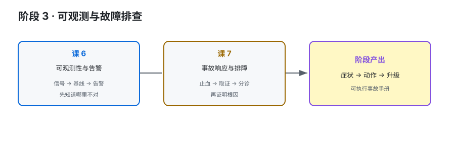

# 阶段 3：可观测与故障排查

> 所属课程：Kafka 运维方向子教程 ｜ 故事章节：先止血，再证明根因 ｜ 上一阶段：[阶段 2](../2-日常操作与容量治理/overview.md) ｜ [返回总览](../../01-学习路径总览.md)

## 🎯 本阶段目标

- 建立从指标采集到告警、日志、CLI 和客户端现象的证据链。
- 能按症状倒查 Broker、副本、Controller、消费者和磁盘问题。
- 能写出先止血、后定位、有升级出口的事故 runbook。

## 📍 学习重点

- 采集很多指标不等于可观测；必须有健康基线、告警分级和业务 SLO。
- lag、ISR、磁盘和 Controller 问题需要交叉验证，不能只看一块大屏。
- 线上排障先降低损失，再保留证据；不要为了“查清楚”先做不可逆操作。

## ✅ 必须掌握的知识点

| 知识点 | 所属课 | 学完应能 |
|--------|--------|----------|
| 指标采集链路与标签设计 | 课 6 | 说清 JMX、Exporter、Prometheus 与客户端指标的关系 |
| 健康基线、告警分级与 SLO | 课 6 | 为关键指标写正常值、紧急度和抑制条件 |
| Consumer lag、日志与看板 | 课 6 | 选择合适的 lag 测量方法并避免误判 |
| 事故止血、证据保全与分诊 | 课 7 | 按症状建立第一分钟动作和升级出口 |
| Broker/ISR/Controller 故障处置 | 课 7 | 区分节点、复制和控制器层面的故障 |
| Lag、再均衡、生产失败与磁盘故障 | 课 7 | 按条件分支收敛根因并验证恢复 |

## 🗺️ 本阶段路径图

> SVG 展示从“看见信号”到“形成故障闭环”的路径；先定义健康，再设计排障动作。

## 本阶段产出

- [x] [lessons/lesson-06-可观测性基线与告警.md](lessons/lesson-06-可观测性基线与告警.md)
- [ ] `lessons/lesson-07-Kafka事故响应与故障排查.md`
