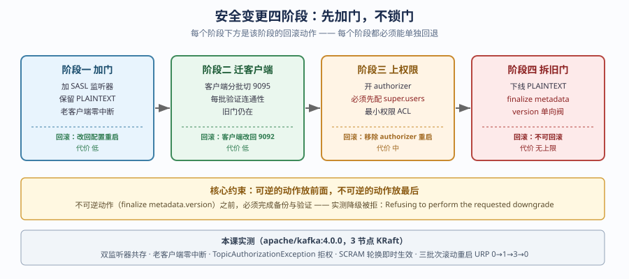
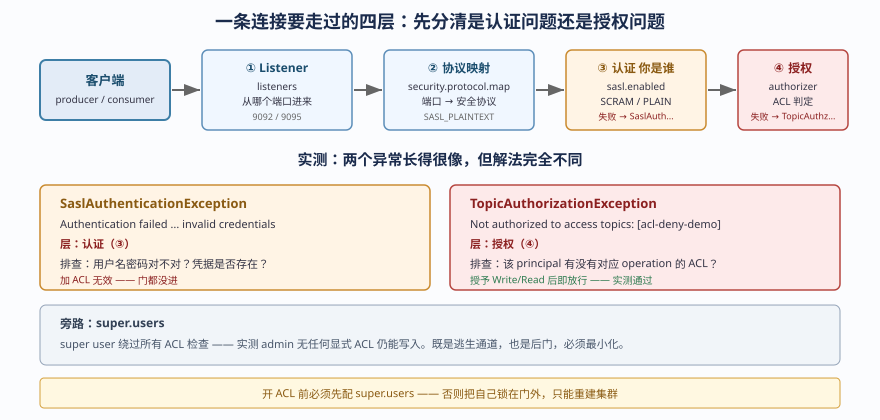
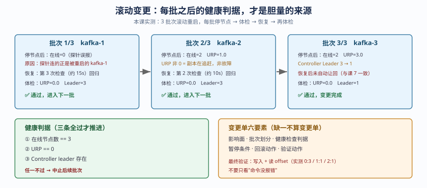

# 第 8 课：安全运营与滚动变更

> 所属阶段：阶段 4《安全变更与灾备自动化》｜水平：入门｜目标：动手实操
> 故事情节：证书今晚到期、业务又不能停——安全动作必须像普通运维一样可分批、可验证、可回退。

> 📖 **结论已按官方文档核对**（核查于 2026-09 ｜ 来源：[Upgrading](https://kafka.apache.org/40/getting-started/upgrade)、[Security](https://kafka.apache.org/43/security/)、[Kafka Operations](https://kafka.apache.org/43/operations/)）。本课以 Kafka 4.0 官方文档作为升级顺序、降级边界、SASL/SCRAM 与 ACL 语义的核对基线。
>
> 🧪 **本课结论全部来自本机真跑**（2026-09-20）：3 节点 KRaft 集群（`kafka-1/2/3`，镜像 `apache/kafka:4.0.0`），从零安全基线就地改造为双监听器 + SASL/SCRAM + ACL。文中所有数字与报错均为实测输出，未实测的部分会显式标注。
> ⚠️ **版本边界**：实验镜像为 Kafka 4.0.0；**跨版本升级（如 3.9 → 4.0）在本机未实测**（只有 4.0.0 一个镜像，无法起旧版集群），该部分以官方文档为基线并已标注。实测覆盖的是**同版本滚动重启**、**双监听器共存**、**SCRAM 凭据轮换**、**ACL 最小权限**与 **metadata.version 降级拒绝**。

## 🎯 本课目标

- 运营 Listener、TLS/SASL、ACL 和服务账号的完整连接链路。
- 设计凭据/证书轮换和运行中接入安全的分批方案。
- 写出滚动升级、兼容性检查、功能验证和失败回退的变更单。

## 第一幕：起源与场景引入

晚上 22:00，你收到两条同时到达的消息：

1. 安全团队："这套 Kafka 的客户端凭据 90 天没轮换过，下周审计要查。另外现在任何人都能连，得加权限。"
2. 业务团队："明天有大促，**今天晚上不许停服**。"

这两条消息表面冲突，实际上指向同一件事：**安全动作必须做成"可分批、可验证、可回退"的普通运维操作**，而不是"停机维护窗口里的一次性大手术"。

如果你按直觉做——改配置、重启集群、让所有客户端换新密码——你会得到一个夜晚：所有客户端同时认证失败，业务中断，而你甚至不知道该先回滚哪一步。

### 一句话本质

**安全变更不是"把锁装上"，而是"在不惊动住户的前提下，先装新锁、再配新钥匙、最后才拆旧锁"。**

### 处境对照

| 做法 | 现场发生什么 | 最终结果 |
|------|--------------|----------|
| 一把梭：改配置 + 重启 + 全员换密码 | 所有客户端同时认证失败 | 业务中断，回滚要动全部客户端 |
| 先加 SASL 监听器，PLAINTEXT 保留 | 老客户端无感，新客户端可用新门 | 零中断，可分批迁移 |
| 装了锁但没配管理员钥匙 | 连自己都进不去，ACL 改不动 | 把自己锁在门外，只能重建集群 |
| 滚动重启不体检，三台一起动 | 同时停 2 台可能触发 ISR 不足 | 可用性跌破预算，无法回退 |
| 升级前不查 metadata.version | finalize 后发现不能降级 | 单向阀，回不去 |

> **场景说明**：22:00 与"大促"是虚构演练场景；集群拓扑、命令和实测数字来自本机实验环境。

## 第二幕：认知冲突

### 冲突一：加安全和保业务，不是二选一，而是排序问题

本课实测证明：给集群加上 `SASL_PLAINTEXT://0.0.0.0:9095` 新监听器的同时**保留** `PLAINTEXT://0.0.0.0:9092`，老客户端完全无感。实测中改造后老客户端仍连上 3 个节点、仍能正常读写。

真正的中断不是"加了安全"，而是"**同时**改了监听器、认证方式、客户端配置三件事"。把这三件事拆成有顺序的批次，中断就消失了。

### 冲突二：认证失败和授权失败，长得很像，解法完全不同

本课实测中两次遇到"写不进去"，但根因完全不同：

- 第一次报 `SaslAuthenticationException: Authentication failed ... invalid credentials` —— 这是**认证**问题（用户名密码不对，或凭据压根不存在）。
- 第二次报 `TopicAuthorizationException: Not authorized to access topics: [acl-deny-demo]` —— 这是**授权**问题（身份确认了，但没权限）。

如果你把认证失败当成授权问题去加 ACL，你会花一小时加 ACL，然后发现一条都没用。**先看异常类名，再决定动哪一层。**

### 冲突三：凭据是存在集群里的，容器重建就没了

本课踩到的真实陷阱：创建好 `admin` / `app-writer` / `app-reader` 三个 SCRAM 用户后重启了容器，再次连接时全部报 `SaslAuthenticationException`。

原因不是密码错了，而是 **SCRAM 凭据存在 `__cluster_metadata` 主题里，而该主题落在 `log.dirs`**。实验环境 `log.dirs=/tmp/kraft-logs` 没有持久化，容器重建后元数据（连同凭据）一起丢失。

生产含义：SCRAM 凭据是集群状态的一部分，**备份/恢复方案必须覆盖 `__cluster_metadata`**，否则灾备恢复后所有客户端都会认证失败。

### 冲突四：升级可以滚，元数据版本是单向阀

本课实测：尝试把 `metadata.version` 从 `4.0-IV3` 降到 `3.9-IV0` 和 `4.0-IV0`，两次都被明确拒绝：

```
Could not downgrade metadata.version to 21. The update failed for all features since
the following feature had an error: Invalid metadata.version 21. Refusing to perform
the requested downgrade because it might delete metadata information.
```

官方文档解释了机制：每个 MetadataVersion 都带一个布尔参数标识是否包含元数据格式变更（如 `IBP_4_0_IV1(23, "4.0", "IV1", true)` 表示有变更）；**只要当前版本与目标版本之间的任一版本带元数据变更，就不能降级**。

所以"升级失败就降级回去"这个直觉，在跨元数据变更版本时是**不成立**的。你的回滚方案只能是：升级前备份 + 重建。

## 第三幕：层层揭示

### 一眼全局图：安全变更的四阶段



> **看图**：从左到右是四个阶段——先加门（不锁）、再迁客户端、再上权限、最后才考虑拆旧门。每个阶段下方标了"回滚动作"，这是本课最重要的约束：**每个阶段都必须能单独回退**。

### 本课地图（分三步走）

| 步 | 这一步要解决什么（人话） | 对应知识点 |
|:--:|------------------------|-----------|
| 1 | 搞清"连接进来要经过哪几道门" | Listener、TLS/SASL 与 ACL 运营 |
| 2 | 换钥匙的时候怎么不惊动住户 | 凭据/证书轮换与在线接入安全 |
| 3 | 改系统本身时怎么分批、怎么回退 | 滚动升级、兼容性与变更审批 |

---

### 知识点一：Listener、TLS/SASL 与 ACL 运营

> 🧭 **第 1/3 步｜承接**：第二幕留下的问题是"安全和业务抢时间" → **本步**：先把"门"的结构看清楚，才知道能拆成几批。

#### 一句话定义

**Listener 是 Kafka 的连接入口，它把"从哪个端口进来"映射到"用什么安全协议"；认证（SASL/TLS）回答"你是谁"，授权（ACL）回答"你能干什么"。**

#### 直觉建立：写字楼的前台、门禁和钥匙

一栋写字楼：

- **Listener（监听器）** = 楼的不同入口：正门、货梯、员工通道。不同入口规定不同的进楼方式。
- **认证（Authentication）** = 前台查工牌：确认"你是谁"。
- **授权（Authorization）** = 门禁系统：确认"你能进哪几层的哪几个房间"。

关键点：这三个是可以**分开开关**的。你可以先开一个"员工通道"（新 Listener）但暂时不查工牌（保留 PLAINTEXT），等所有员工的工牌都办好了，再关掉原来的正门。

类比的边界是：Kafka 的"入口"是配置里的端口 + 协议映射，改它**必须重启 Broker**；而"工牌"（SCRAM 凭据）和"门禁规则"（ACL）是集群元数据，**可以在线改，不用重启**。这决定了改造顺序：先做要重启的（加 Listener），再做不用重启的（建用户、配 ACL）。

#### 核心原理：一条连接要走过的四层

| 层 | 配置项 | 回答的问题 | 本课实测值 |
|----|--------|-----------|-----------|
| 监听器 | `listeners` | 在哪些端口上听 | `PLAINTEXT://0.0.0.0:9092,SASL_PLAINTEXT://0.0.0.0:9095,CONTROLLER://0.0.0.0:29093` |
| 协议映射 | `listener.security.protocol.map` | 这个端口用什么安全协议 | `CONTROLLER:PLAINTEXT,PLAINTEXT:PLAINTEXT,SASL_PLAINTEXT:SASL_PLAINTEXT` |
| 对外通告 | `advertised.listeners` | 告诉客户端该连哪个地址 | `PLAINTEXT://kafka-1:9092,SASL_PLAINTEXT://kafka-1:9095` |
| 认证机制 | `sasl.enabled.mechanisms` | 支持哪些认证方式 | `SCRAM-SHA-512,PLAIN` |
| 授权器 | `authorizer.class.name` | 谁来判权限 | `org.apache.kafka.metadata.authorizer.StandardAuthorizer` |

还有两个容易忽略但很关键的：

- `inter.broker.listener.name`：Broker 之间用哪个监听器通信。本课实测保持 `PLAINTEXT` —— 这意味着**Broker 间流量不经过 SASL**，改造期间不会影响集群内部复制。生产环境如果要全链路加密，这一项要单独规划（**本课未实测** inter-broker 走 SASL 的场景）。
- `super.users`：超级用户，**绕过所有 ACL 检查**。本课实测配置为 `User:admin;User:ANONYMOUS`。

#### 实测：从零安全到双监听器



> **看图**：从左到右是一条连接要走过的四层。③ 认证失败和 ④ 授权失败是两个不同的异常，先看类名再决定动哪一层——这是本课最实用的一条排障纪律。

改造前的基线（实测输出）：

```
advertised.listeners=PLAINTEXT://kafka-1:9092
listeners=PLAINTEXT://0.0.0.0:9092,CONTROLLER://0.0.0.0:29093
listener.security.protocol.map=CONTROLLER:PLAINTEXT,PLAINTEXT:PLAINTEXT
inter.broker.listener.name=PLAINTEXT
```

此时执行 `kafka-acls.sh --list`，实测报错：

```
Error while executing ACL command: org.apache.kafka.common.errors.SecurityDisabledException:
No Authorizer is configured on the broker
```

**这就是"零安全"的证据**：没有授权器，ACL 子系统根本不存在，任何人都能连、能读、能写。

改造后（加 `SASL_PLAINTEXT://0.0.0.0:9095`，保留 `9092`），broker 启动日志实测输出：

```
SASL is enabled.
[SocketServer listenerType=BROKER, nodeId=1] Created data-plane acceptor and processors for endpoint : ListenerName(PLAINTEXT)
[SocketServer listenerType=BROKER, nodeId=1] Created data-plane acceptor and processors for endpoint : ListenerName(SASL_PLAINTEXT)
```

两个监听器同时存在。**这一步老客户端零改动、零中断。**

#### 实测：ACL 的拒绝与放行（最小权限）

这是本课最能直接验证"门确实锁上了"的实验。

**第一步：无 ACL 时写入，被拒**（实测输出）：

```
[Producer clientId=console-producer] The metadata response from the cluster reported a
recoverable issue with correlation id 1 : {acl-deny-demo=TOPIC_AUTHORIZATION_FAILED}
org.apache.kafka.common.errors.TopicAuthorizationException: Not authorized to access topics: [acl-deny-demo]
```

**第二步：授予 Write 权限后写入，成功**（实测无任何报错，`kafka-get-offsets.sh` 确认消息进入）。

**第三步：无 Read 权限时消费，被拒**（实测输出）：

```
[Consumer clientId=console-consumer, groupId=reader-test-cg] The metadata response from
the cluster reported a recoverable issue with correlation id 2 : {sec-ops-demo=TOPIC_AUTHORIZATION_FAILED}
org.apache.kafka.common.errors.TopicAuthorizationException: Not authorized to access topics: [sec-ops-demo]
```

**第四步：super user 绕过 ACL**（实测：`admin` 用户无任何显式 ACL 却能正常写入，无报错）—— 这既证明了 `super.users` 生效，也提示了它的风险：**super user 是绕过一切权限检查的后门，必须最小化。**

#### ⚠️ 实测踩坑：开 ACL 前必须先配 super.users

本课在配置 `authorizer.class.name` 时同时配了 `super.users=User:admin;User:ANONYMOUS`。

如果**只配 authorizer 不配 super.users**，且 `allow.everyone.if.no.acl.found=false`，那么连管理员自己都会被拒之门外，之后想加 ACL 都加不了——**只能重建集群**。

```
KAFKA_AUTHORIZER_CLASS_NAME: org.apache.kafka.metadata.authorizer.StandardAuthorizer
KAFKA_SUPER_USERS: "User:admin;User:ANONYMOUS"
KAFKA_ALLOW_EVERYONE_IF_NO_ACL_FOUND: "false"
```

> 注意：`User:ANONYMOUS` 在这里是为了让走 PLAINTEXT 监听器（无认证）的流量在改造期间仍可用。**这是过渡期的临时配置，不是生产终态**——生产环境在下线 PLAINTEXT 后应移除它。

#### ⚠️ 实测踩坑：镜像 SASL 分支的 unbound variable

第一次加 SASL 监听器后，容器起不来，实测报错：

```
/etc/kafka/docker/configure: line 18: !1: unbound variable
```

定位到镜像脚本 `ensure()` 函数用了 `${!1}` 间接引用，而 SASL 分支调用了 `ensure KAFKA_OPTS`；在 `set -u` 下未设置的变量会报错。

解法：显式提供 `KAFKA_OPTS` 并挂上 JAAS 文件：

```yaml
KAFKA_OPTS: "-Djava.security.auth.login.config=/etc/kafka/jaas/kafka_server_jaas.conf"
volumes:
  - ./jaas:/etc/kafka/jaas:ro
```

对应 JAAS 文件内容：

```
KafkaServer {
    org.apache.kafka.common.security.scram.ScramLoginModule required
    username="admin"
    password="admin-secret-2026";
};
```

> **关于上面这串明文口令**：它是**实验环境专用的一次性口令**，仅存在于本机容器，不对应任何真实系统。讲义此处为可读性直接印出，属于有意为之的例外——下文「敏感信息边界」要求的「文件权限 600、不进 Git、用 secret 管理」**仍然适用于你的生产环境**。二者不冲突：教学材料要能照抄跑通，生产凭据必须走 secret 注入。

**这个坑的价值在于**：它说明"改安全配置"这类变更，第一次几乎总会遇到启动失败——所以必须在**不影响业务的窗口**先验证配置能起来，而不是直接上生产。

#### 行话锚定

| 行话 | 在哪里遇到 | 本课译法说明 |
|------|-----------|-------------|
| Listener（监听器） | `listeners` / `advertised.listeners` 配置 | 官方配置名，直接用 |
| SASL | `sasl.enabled.mechanisms` | 缩写，不译 |
| SCRAM | `SCRAM-SHA-512` | 缩写，不译 |
| ACL | `kafka-acls.sh`、`authorizer.class.name` | 缩写，不译 |
| Authorizer（授权器） | `authorizer.class.name` | 官方配置名 |
| Principal（主体） | `User:app-writer` | 社区常用译法，官方未定中文名 |
| Super user | `super.users` | 官方配置名 |

#### 一句话记住

**Listener 决定从哪进，认证决定你是谁，授权决定你能干什么——三者分开配置，才能分批改造。**

📚 **官方文档**：[Security：SASL/SCRAM 与 ACL 配置](https://kafka.apache.org/43/security/) ｜ [Kafka Operations：监听器与安全协议映射](https://kafka.apache.org/43/operations/)

---

### 知识点二：凭据/证书轮换与在线接入安全

> 🧭 **第 2/3 步｜承接**：上一步看清了门的结构 → **本步**：解决"换钥匙时怎么不惊动住户"。

#### 一句话定义

**凭据轮换是在不中断服务的前提下更换认证密钥的过程，其安全性来自"新旧凭据有一段共存期"，而不是"某一刻同时切换"。**

#### 直觉建立：换酒店房卡

酒店给长住客人换房卡，正确做法不是"某天零点所有旧卡同时失效、客人去前台领新卡"——那会让半夜回来的客人进不了门。

正确做法是：前台先发新卡，旧卡**继续能用**；等确认所有客人都拿到新卡（比如 24 小时后），再让旧卡失效。

Kafka 的 SCRAM 轮换机制略有不同（本课实测是**立即生效**的），所以正确顺序要反过来理解：

1. **先把新凭据写进集群**（此时新旧密码在一次 `--alter` 中完成替换）。
2. **同时更新所有客户端配置**并滚动重启客户端。
3. 因为 Kafka 的替换是立即的，**第 1 步和第 2 步之间的窗口就是中断窗口**——所以必须用**滚动重启客户端**把这个窗口压到最小。

类比的边界是：Kafka 4.0 的 `kafka-configs.sh --alter` 对 SCRAM 是**替换**而非"追加第二套凭据"（本课实测：改完密码后旧密码立即 `Authentication failed`）。因此**生产环境若要做到真正零中断，应先让应用支持"失败重试 + 从配置中心拉最新凭据"，或采用双用户切换**（如 `app-writer` → `app-writer-2`，两个用户都有权限，切换完成后再删旧的）。**本课未实测双用户切换方案**，仅实测了单用户直接替换的行为。

#### 核心原理：SCRAM 凭据存在哪里

实测创建用户：

```bash
kafka-configs.sh --bootstrap-server kafka-1:9092 \
  --alter --entity-type users --entity-name app-writer \
  --add-config 'SCRAM-SHA-512=[password=writer-secret-2026]'
```

实测输出：

```
Completed updating config for user app-writer.
```

实测查看（注意：**只显示迭代次数，不显示密码**）：

```
SCRAM credential configs for user-principal 'app-writer' are SCRAM-SHA-512=iterations=4096
```

这个输出本身就是安全设计的体现——`--describe` 不会泄露密码原文，只告诉你算法和迭代次数。

#### 实测：凭据轮换的完整闭环

**轮换前**（旧密码连接，实测成功）：

```
成功连上节点数: 3
```

**执行轮换**：

```bash
kafka-configs.sh --bootstrap-server kafka-1:9092 \
  --alter --entity-type users --entity-name app-writer \
  --add-config 'SCRAM-SHA-512=[password=ROTATED-2026-NEW]'
```

输出：`Completed updating config for user app-writer.`

**轮换后，旧密码**（实测失败）：

```
Connection to node -1 (kafka-1/172.20.0.3:9095) failed authentication due to:
Authentication failed during authentication due to invalid credentials with SASL mechanism SCRAM-SHA-512
```

**轮换后，新密码**（实测成功连上 3 个节点）。

**结论：SCRAM 轮换无需重启 Broker，即时生效。**

> **⚠️ 勘误（复审修正）**：本条原写为「证书轮换通常需要滚动重启以加载新 keystore，这是 SCRAM 相对 SSL 的一大运维优势」——**该表述错误，已删除**。
>
> 核验依据：Kafka 官方文档 Configuration 明确 keystore/truststore **支持动态更新、无需重启**。用 `listener.name.{listenerName}.` 前缀经 `kafka-configs.sh --alter` 更新 `ssl.keystore.location` / `ssl.keystore.type` / `ssl.keystore.password` / `ssl.key.password` 即可热加载；truststore 同理，且「更新后的 truststore 用于认证新连接」。Confluent 文档亦确认「expired certificates are updated on brokers without a rolling restart」。
>
> **两者真实差异不在"要不要重启"，而在生效语义**：
>
> | 维度 | SCRAM 轮换 | 证书热更新 |
> |----|----|----|
> | 是否重启 | 不需要 | **同样不需要** |
> | 生效范围 | 元数据一经写入即全局生效 | 仅对**新建连接**生效，存量连接不受影响 |
> | 旧凭据 | **立即失效**，旧密码当场连不上 | 新旧可共存，取决于客户端 truststore 与证书有效期 |
> | 约束 | 无 | 新证书须由**同一 CA 签发**，否则对端校验不过 |
>
> 因此运维上的真正取舍是：SCRAM 是**立即替换**（干净但有中断风险，双用户过渡是解法），证书是**叠加共存**（平滑但要管有效期与 CA 一致性）。两者都不需要滚动重启。

#### ⚠️ 实测踩坑：凭据会随元数据一起丢

本课在容器重建后，三个 SCRAM 用户**全部失效**，报 `SaslAuthenticationException`。

原因：SCRAM 凭据存在 `__cluster_metadata` 主题，该主题在 `log.dirs` 下。实验环境 `log.dirs=/tmp/kraft-logs` 未持久化，重建即丢。

**生产推论（重要）**：

1. 灾备恢复演练时，必须验证**凭据是否随元数据一并恢复**。
2. 备份方案中若只备份了 topic 数据而未备份 `__cluster_metadata`，恢复后**所有客户端都无法认证**。
3. 这也意味着：轮换凭据前，先确认你的元数据备份是有效的——否则轮换本身可能成为一次不可回退的操作。

#### 敏感信息边界

| 位置 | 是否敏感 | 处置建议 |
|------|---------|---------|
| JAAS 文件（`kafka_server_jaas.conf`） | **是**（含明文密码） | 文件权限 600，不进 Git，用 secret 管理 |
| 客户端 properties（`sasl.jaas.config`） | **是** | 同上；优先用配置中心下发而非落盘 |
| `kafka-configs.sh` 命令历史 | **是**（命令行含明文） | 避免在共享 shell 历史中留存 |
| `--describe` 输出 | 否（只有算法和迭代次数） | 可安全记录 |
| `KAFKA_SUPER_USERS` 配置 | 中（暴露主体名） | 不含密码，但仍需控访问 |

**JMX 的敏感边界（本课未实测）**：本课环境的 JMX 是 `authenticate=false, ssl=false`，仅限实验。生产环境 JMX 必须开启认证，否则任何人可远程执行 MBean 操作——这是 Kafka 运维中常见的安全薄弱点。

#### 一句话记住

**轮换 SCRAM 不用重启 Broker，但会立即生效——所以先备好回滚凭据，再动手。**

📚 **官方文档**：[Security：SASL/SCRAM 配置与轮换](https://kafka.apache.org/43/security/)

---

### 知识点三：滚动升级、兼容性与变更审批

> 🧭 **第 3/3 步｜承接**：前两步解决了"加门"和"换钥匙" → **本步**：解决"改系统本身"时的分批与回退。

#### 一句话定义

**滚动升级是逐节点替换软件版本、每批之间用健康检查卡住、异常即中止的变更方式；它的可行性由版本兼容性决定，而元数据版本是其中唯一不可逆的部分。**

#### 直觉建立：给飞行中的飞机换引擎

不能把所有引擎同时拆下来换。只能一次换一台，换完立刻检查：这台转起来了吗？飞机还平吗？确认没问题，才动下一台。

**"确认没问题"这一步必须有客观判据**，不能靠"感觉还行"。本课的判据是三条：在线节点数 == 3、URP == 0、Controller leader 存在。

类比的边界是：飞机换引擎时乘客能感觉到颠簸；Kafka 滚动重启时客户端**会**遇到短暂的连接断开和 leader 切换，只是因为有副本，业务不中断。所以滚动升级不等于"无感"，而是"不中断"。

#### 核心原理：兼容性三层

| 层 | 决定什么 | 本课实测情况 |
|----|---------|-------------|
| 协议兼容 | 老客户端能否连新 Broker | 4.0 要求 Java 客户端 ≥ 2.1（官方文档，**未实测**） |
| 数据/元数据兼容 | 能否回退 | `metadata.version` 降级被拒（**实测**） |
| 行为兼容 | 升级后语义是否变化 | KIP-848/890 在 finalize 后启用（官方文档，**未实测**） |

> **2.1 下限是双向的**（KIP-896 原文，容易被读漏）：
>
> - **升 Broker 到 4.0 之前**，必须确认所有客户端 ≥ 2.1；
> - **升客户端到 4.0 之前**，必须确认 Broker ≥ 2.1；
> - 且 `inter.broker.protocol.version` 同样须 ≥ 2.1。
>
> 也就是说，它不是"新 Broker 对老客户端的单边门槛"，而是**两侧都要先达标**。任意一侧先升到 4.0 而另一侧 < 2.1，都会断连。上表第一行的"老客户端能否连新 Broker"只覆盖了其中一个方向。

官方文档明确了 4.0 的升级路径：

- **Kafka 4.0 仅支持 KRaft**，ZooKeeper 模式已移除。
- 升级到 4.0 要求集群已在 KRaft 模式且 metadata version ≥ 3.3.x；ZK 集群必须先迁移（3.9 是最后的桥接版本）。
- 滚动步骤：逐台关停 → 更新代码 → 重启；全部完成后验证；最后执行 `kafka-features.sh ... upgrade --release-version 4.0` 完成 finalize。
- **降级**：只要当前与目标版本之间任一版本带元数据变更，就不可降级。

#### 实测：feature / metadata version 现状

```
Feature: eligible.leader.replicas.version	SupportedMinVersion: 0	SupportedMaxVersion: 1	FinalizedVersionLevel: 0
Feature: group.version	SupportedMinVersion: 0	SupportedMaxVersion: 1	FinalizedVersionLevel: 1
Feature: kraft.version	SupportedMinVersion: 0	SupportedMaxVersion: 1	FinalizedVersionLevel: 0
Feature: metadata.version	SupportedMinVersion: 3.3-IV3	SupportedMaxVersion: 4.0-IV3	FinalizedVersionLevel: 4.0-IV3
Feature: transaction.version	SupportedMinVersion: 0	SupportedMaxVersion: 2	FinalizedVersionLevel: 2
```

注意 `metadata.version` 的 `SupportedMinVersion: 3.3-IV3` —— 这与官方文档"升级到 4.0 要求 metadata version ≥ 3.3.x"完全吻合。

#### 实测：降级被拒绝（单向阀）

```
$ kafka-features.sh --bootstrap-server kafka-1:9092 downgrade --metadata 3.9-IV0
 `metadata` flag is deprecated and may be removed in a future release.
Could not downgrade metadata.version to 21. The update failed for all features since the
following feature had an error: Invalid metadata.version 21. Refusing to perform the
requested downgrade because it might delete metadata information.
1 out of 1 operation(s) failed.
```

降级到 `4.0-IV0` 同样被拒。**这证实：一旦 finalize 到带元数据变更的版本，就没有"降级"这条路。**

顺带一个实测发现：`--metadata` 这个 flag 已标记废弃（`deprecated and may be removed in a future release`）。

#### 实测：三批次滚动重启（含健康检查与暂停）



> **看图**：三个批次依次进行，每批都是"停 → 体检 → 恢复 → 再体检"。右侧列出三条健康判据与变更单六要素——**批次数不是胆量问题，而是每批之后你用什么判据说可以继续**。

本课真跑了完整的三批次滚动重启。每批的体检函数：

```bash
health_check() {
  # 判据 1：在线节点数 == 3
  # 判据 2：URP == 0
  # 判据 3：Controller leader 存在
  # 任一不通过 → 中止后续批次
}
```

**实测过程与结果**：

| 批次 | 动作 | 停节点后体检 | 恢复耗时 | 批次后体检 | 结论 |
|:----:|------|-------------|---------|-----------|------|
| 1/3 | 重启 kafka-1 | 在线节点=0 ❌ | 第 3 次检查（约 15s）回归 | URP=0.0, Leader=3 ✅ | 通过 |
| 2/3 | 重启 kafka-2 | 在线节点=2, URP=1.0 ❌ | 第 2 次检查（约 10s）回归 | URP=0.0, Leader=3 ✅ | 通过 |
| 3/3 | 重启 kafka-3 | 在线节点=2, URP=3.0, Leader=1 ❌ | 第 2 次检查（约 10s）回归 | URP=0.0, Leader=1 ✅ | 通过 |

**三个值得注意的实测细节**：

1. **批次 1 显示"在线节点=0"**：因为体检命令连的 bootstrap-server 就是 `kafka-1:9092`——**你正在重启的那台**这暴露了一个真实设计问题：健康检查的探针不能部署在被变更的对象上。生产环境应该用独立于变更目标的探针（或连接多个 bootstrap）。

2. **URP 在重启期间确实会非 0**（批次 2 为 1.0、批次 3 为 3.0），恢复后回到 0.0。这与课 7 的结论一致：**URP 非 0 不等于故障**，它是"副本在追赶"的正常中间态。

3. **Leader 不会自动让回**：批次 3 重启 kafka-3 后，Controller leader 从 `3` 变成了 `1`，且重启完成后**没有自动切回**。这与课 7 实测的"恢复后 leader 不自动让回"完全呼应，说明这是 Kafka 的**稳定行为而非偶发**。

**变更后业务可用性验证**（实测）：

```
sec-ops-demo:0:3
sec-ops-demo:1:1
sec-ops-demo:2:1
```

消息正常写入，滚动重启全程**业务未中断**。

#### 变更单模板（本课实测版）

一个可执行的变更单至少包含六项，缺一项不算变更单：

| 项 | 内容 | 本课实例 |
|----|------|---------|
| **影响面** | 谁会受影响、影响多久 | 全部客户端；每批约 10-15 秒 |
| **批次划分** | 分几批、每批动什么 | 3 批，每批 1 个 Broker |
| **健康检查判据** | 每批后用什么证明"可以继续" | 节点数=3 且 URP=0 且 Leader 存在 |
| **暂停条件** | 什么情况下停止推进 | 任一批体检不通过即中止 |
| **回滚动作** | 每步怎么退回去 | 每批独立：重启该节点回上一版配置 |
| **验证动作** | 变更后怎么证明业务正常 | 写入 + 读 offset 确认 |

**回滚的层次（重要）**：

本课的四阶段改造，每一阶段的回滚代价完全不同：

| 阶段 | 回滚方式 | 代价 |
|------|---------|------|
| 加 SASL 监听器（保留 PLAINTEXT） | 改回配置重启 | 低（老客户端不受影响） |
| 客户端迁移到 9095 | 客户端改回 9092 | 低（只要旧门还在） |
| 开 ACL | 移除 authorizer 重启，或调整 ACL | 中（需要重启） |
| **finalize metadata.version** | **不可回滚** | **无上限——只能备份重建** |

**这张表是本课最实用的产出**：它告诉你，**可逆的动作要放在前面，不可逆的动作要放在最后，且不可逆动作之前必须完成备份与验证**。

#### ⚠️ 实测踩坑：生产者"无报错"但消息没进去

本课早期遇到一个极具迷惑性的现象：执行生产者命令，**没有任何报错**，但 `kafka-get-offsets.sh` 显示 offset 一直是 0。

根因：`docker exec` **不加 `-i`** 时，宿主机的 stdin 不会传递给容器内进程。生产者读到 EOF 直接退出，既不报错也不发消息。

```bash
# ❌ 错误：stdin 不传递，生产者立即 EOF 退出，静默无消息
echo "msg" | docker exec l15-kafka-1 /opt/kafka/bin/kafka-console-producer.sh ...

# ✅ 正确：-i 保持 stdin 打开
echo "msg" | docker exec -i l15-kafka-1 /opt/kafka/bin/kafka-console-producer.sh ...
```

**验证方式**：加 `-i` 后 offset 从 0 变为 1，确认真写进去了。

这个坑的通用教训：**"命令没报错"不等于"命令生效了"**。任何写操作之后必须有独立的读取验证（`kafka-get-offsets.sh` 或消费确认），否则你会基于一个虚假的成功信号做后续决策。

#### 一句话记住

**滚动升级的批次数不是胆量问题，而是"每批之后你用什么判据说可以继续"；metadata.version 是唯一没有回退键的那一步。**

📚 **官方文档**：[Upgrading to 4.0.x from any version 3.3.x through 3.9.x](https://kafka.apache.org/40/getting-started/upgrade)

---

## 第四幕：实操验证

> 🧪 **本节全部命令均在本机 3 节点 KRaft 集群（`apache/kafka:4.0.0`）实测通过。** 每条命令都回答"读者照抄能跑通吗"。

### 环境准备

实验工程沿用阶段 6 目录 `assets/stage6-observability/`，在其上就地改造。完整配置见 `docker-compose.yml`（已含双监听器、SASL、ACL）与 `jaas/` 目录。

> ⚠️ 本课改造了阶段 6 的集群配置。原配置已备份为 `docker-compose.yml.bak.lesson08`，需要还原时用该文件覆盖即可。

### 实操 1：建立"零安全"基线（对照组）

先记录改造前的状态，后面才有对照。

```bash
# 进入实验目录
cd assets/stage6-observability

# ① 确认当前无任何安全配置
docker exec -e KAFKA_JMX_OPTS= l15-kafka-1 \
  grep -E "^(listeners|advertised.listeners|listener.security.protocol.map)=" \
  /opt/kafka/config/server.properties

# ② 确认 ACL 子系统不存在（预期报 SecurityDisabledException）
docker exec -e KAFKA_JMX_OPTS= l15-kafka-1 \
  /opt/kafka/bin/kafka-acls.sh --bootstrap-server kafka-1:9092 --list
```

预期输出：① 只有 `PLAINTEXT` 和 `CONTROLLER`；② `SecurityDisabledException: No Authorizer is configured on the broker`。

> **为什么这两条要一起跑**：第一条证明"没有安全协议"，第二条证明"没有授权器"。两者都确认了，才叫"零安全基线"。

### 实操 2：加 SASL 监听器（保留 PLAINTEXT）

修改 `docker-compose.yml`，给每个节点加三处配置：

```yaml
KAFKA_LISTENERS: "PLAINTEXT://0.0.0.0:9092,SASL_PLAINTEXT://0.0.0.0:9095,CONTROLLER://0.0.0.0:29093"
KAFKA_ADVERTISED_LISTENERS: "PLAINTEXT://kafka-1:9092,SASL_PLAINTEXT://kafka-1:9095"
KAFKA_LISTENER_SECURITY_PROTOCOL_MAP: "CONTROLLER:PLAINTEXT,PLAINTEXT:PLAINTEXT,SASL_PLAINTEXT:SASL_PLAINTEXT"
KAFKA_SASL_ENABLED_MECHANISMS: "SCRAM-SHA-512,PLAIN"
# 下面这行必需：镜像 SASL 分支会 ensure KAFKA_OPTS，不设会启动失败
KAFKA_OPTS: "-Djava.security.auth.login.config=/etc/kafka/jaas/kafka_server_jaas.conf"
```

并挂载 JAAS 目录：

```yaml
volumes:
  - ./jaas:/etc/kafka/jaas:ro
```

重启并验证：

```bash
docker compose up -d
sleep 30

# 验证两个监听器都起来了
docker logs l15-kafka-1 2>&1 | grep -E "Created data-plane acceptor"

# 验证老客户端零中断（预期 3）
docker exec -e KAFKA_JMX_OPTS= l15-kafka-1 \
  /opt/kafka/bin/kafka-broker-api-versions.sh --bootstrap-server kafka-1:9092 \
  | grep -cE '^kafka-[0-9]'
```

预期输出：两条 `Created data-plane acceptor` 日志（PLAINTEXT 与 SASL_PLAINTEXT 各一条），以及节点数 `3`。

### 实操 3：创建 SCRAM 用户

```bash
for u in "admin:admin-secret-2026" "app-writer:writer-secret-2026" "app-reader:reader-secret-2026"; do
  NAME="${u%%:*}"; PWD="${u##*:}"
  docker exec -e KAFKA_JMX_OPTS= l15-kafka-1 \
    /opt/kafka/bin/kafka-configs.sh --bootstrap-server kafka-1:9092 \
    --alter --entity-type users --entity-name "$NAME" \
    --add-config "SCRAM-SHA-512=[password=$PWD]"
done
```

预期每个用户输出 `Completed updating config for user <name>.`

查看（只显示算法和迭代次数，不显示密码）：

```bash
docker exec -e KAFKA_JMX_OPTS= l15-kafka-1 \
  /opt/kafka/bin/kafka-configs.sh --bootstrap-server kafka-1:9092 \
  --describe --entity-type users
```

### 实操 4：SASL 客户端正反两面验证

准备客户端配置 `client-config/writer-sasl.properties`：

```properties
security.protocol=SASL_PLAINTEXT
sasl.mechanism=SCRAM-SHA-512
sasl.jaas.config=org.apache.kafka.common.security.scram.ScramLoginModule required username="app-writer" password="writer-secret-2026";
```

**正例（正确密码，预期成功）**：

```bash
docker run --rm --network stage6-observability_kafka-net \
  -v "$(pwd)/client-config:/etc/kafka/client:ro" \
  -e KAFKA_JMX_OPTS= apache/kafka:4.0.0 \
  /opt/kafka/bin/kafka-broker-api-versions.sh \
  --bootstrap-server kafka-1:9095 \
  --command-config /etc/kafka/client/writer-sasl.properties
```

预期：列出 3 个节点，端口均为 `9095`。

**反例（错误密码，预期失败）**：把 `password=` 改成任意错误值，预期输出：

```
org.apache.kafka.common.errors.SaslAuthenticationException: Authentication failed during
authentication due to invalid credentials with SASL mechanism SCRAM-SHA-512
```

**反例（无凭据连 9095，预期失败）**：不带 `--command-config`，预期 `Request METADATA failed on brokers`。

**对照（无凭据连 9092，预期仍成功）**：证明老客户端零中断。

### 实操 5：开 ACL 并验证最小权限

先加配置（**必须同时配 super.users**）：

```yaml
KAFKA_AUTHORIZER_CLASS_NAME: org.apache.kafka.metadata.authorizer.StandardAuthorizer
KAFKA_SUPER_USERS: "User:admin;User:ANONYMOUS"
KAFKA_ALLOW_EVERYONE_IF_NO_ACL_FOUND: "false"
```

重启后验证拒权与放行：

```bash
# ① 无 ACL 时写入（预期 TopicAuthorizationException）
printf 'deny:x\n' | docker run --rm -i --network stage6-observability_kafka-net \
  -v "$(pwd)/client-config:/etc/kafka/client:ro" \
  -e KAFKA_JMX_OPTS= apache/kafka:4.0.0 \
  /opt/kafka/bin/kafka-console-producer.sh \
  --bootstrap-server kafka-1:9095 --topic acl-deny-demo \
  --producer.config /etc/kafka/client/writer-sasl.properties

# ② 授予 Write
docker exec -e KAFKA_JMX_OPTS= l15-kafka-1 \
  /opt/kafka/bin/kafka-acls.sh --bootstrap-server kafka-1:9092 --add \
  --allow-principal User:app-writer --operation Write --topic acl-deny-demo

# ③ 再次写入（预期无报错）
# ④ 用 get-offsets 确认消息真的进去了（关键：不要只看"没报错"）
docker exec -e KAFKA_JMX_OPTS= l15-kafka-1 \
  /opt/kafka/bin/kafka-get-offsets.sh --bootstrap-server kafka-1:9092 \
  --topic acl-deny-demo --time -1
```

### 实操 6：凭据在线轮换

```bash
# 轮换
docker exec -e KAFKA_JMX_OPTS= l15-kafka-1 \
  /opt/kafka/bin/kafka-configs.sh --bootstrap-server kafka-1:9092 \
  --alter --entity-type users --entity-name app-writer \
  --add-config 'SCRAM-SHA-512=[password=ROTATED-2026-NEW]'

# 旧密码连接（预期 Authentication failed）
# 新密码连接（预期成功，列出 3 节点）
```

### 实操 7：滚动重启（三批次 + 健康检查）

完整脚本见 `assets/stage8-security/lab09-rolling.sh`，核心逻辑：

```bash
health_check() {
  N=$(broker-api-versions | grep -cE '^kafka-[0-9]')
  # 注意：必须锚定行首 ^ 。裸 grep 会同时命中 "# HELP ..." 行，
  # 其 awk '{print $2}' 取出的是指标名而非数值，判据会失真。
  # （本片段此前漏写 ^ 锚定，与 assets/stage8-security/lab09-rolling.sh 的实际实现不一致，已按脚本校正）
  URP=$(curl -sS http://localhost:17071/metrics \
    | grep -E '^kafka_server_replicamanager_underreplicatedpartitions' | awk '{print $2}')
  [ "$N" != "3" ] && return 1        # 判据 1：节点数
  [ "$URP" != "0.0" ] && return 1    # 判据 2：URP
  return 0
}

for NODE in 1 2 3; do
  docker compose stop kafka-${NODE}
  docker compose start kafka-${NODE}
  # 等待回归（轮询 broker-api-versions）
  health_check || { echo "批次 $NODE 体检未通过，中止！"; exit 1; }
done
```

**注意**：健康检查的探针要连**非变更目标**的节点（本课批次 1 连了正在重启的 kafka-1，导致误报"在线节点=0"）。

### 实操 8：metadata.version 降级验证（单向阀）

```bash
docker exec -e KAFKA_JMX_OPTS= l15-kafka-1 \
  /opt/kafka/bin/kafka-features.sh --bootstrap-server kafka-1:9092 describe

docker exec -e KAFKA_JMX_OPTS= l15-kafka-1 \
  /opt/kafka/bin/kafka-features.sh --bootstrap-server kafka-1:9092 \
  downgrade --metadata 4.0-IV0
```

预期：降级被拒，`Refusing to perform the requested downgrade because it might delete metadata information`。

### 环境清理

```bash
# 停止集群
docker compose down

# 还原阶段 6 原始配置（如需）
cp docker-compose.yml.bak.lesson08 docker-compose.yml
```

> 注：实验数据落在 `/tmp/kraft-logs`（容器内），容器删除即清空。**生产环境必须把 `log.dirs` 挂到持久化卷**——本课"凭据随元数据丢失"的踩坑正是源于此。

### 🧪 应用实战入口

本课配套实战把上面的命令组装成一份**可审批、可回退的变更单**：

- [08 · 安全变更单与回滚包](../../../应用实战/08-安全运营与滚动变更.md) —— 从"三行变更单"演进到六要素齐全的综合版，含三批次滚动重启的真实验收记录与回滚包清单。

> 建议顺序：先把第四幕的命令跑通，再进实战做"变更单三跳演进"，最后用实战的验收标准回查自己的变更单。

## 第五幕：体系收束

### 本课知识地图

```
安全运营与滚动变更
├── 知识点一：Listener、TLS/SASL 与 ACL 运营
│   ├── 四层结构：listeners → 协议映射 → advertised → 认证/授权
│   ├── 实测：双监听器共存，老客户端零中断
│   ├── 实测：TopicAuthorizationException 拒绝 / 授权后放行
│   └── 踩坑：开 ACL 前必须配 super.users，否则锁死自己
├── 知识点二：凭据/证书轮换与在线接入安全
│   ├── SCRAM 凭据存在 __cluster_metadata，在线可改，无需重启
│   ├── 实测：轮换即时生效（旧密码立即失效）
│   └── 踩坑：凭据随元数据一起丢失 → 备份必须覆盖 __cluster_metadata
└── 知识点三：滚动升级、兼容性与变更审批
    ├── 三层兼容：协议 / 数据元数据 / 行为
    ├── 实测：三批次滚动重启 + 每批体检 + 暂停条件
    ├── 实测：metadata.version 降级被拒（单向阀）
    └── 变更单六要素：影响面/批次/判据/暂停条件/回滚/验证
```

### 与前序课程的连接

| 本课结论 | 呼应前课 | 关系 |
|---------|---------|------|
| URP 在重启期间非 0，恢复后归 0 | 课 7：URP 非 0 ≠ 写入失败 | 本课在**变更场景**复现了同一现象，说明它是稳定行为 |
| 重启后 Leader 不自动让回 | 课 7：故障恢复后 Leader 不回切 | 跨课一致，可作为通用预期 |
| "无报错"不等于"生效" | 课 7：指标名 ≠ 语义 | 同为**验证纪律**：不要相信单一信号 |
| 分批 + 每批体检 | 课 4：Broker 成员与数据搬迁 | 滚动变更是同一方法论在安全场景的应用 |

### 常见误区

- **误区 1**："加安全就是要停服。"错；实测证明加监听器可保留老端口，老客户端零中断。
- **误区 2**："写不进去就是权限没配。"错；先看异常类名——`SaslAuthenticationException` 是认证问题，加 ACL 无效。
- **误区 3**："凭据创建好了就一直在。"错；SCRAM 凭据存在元数据里，元数据丢则凭据丢。
- **误区 4**："升级失败就降级回去。"错；跨元数据变更版本不可降级，回滚只能是备份重建。
- **误区 5**："命令没报错就成功了。"错；本课生产者静默失败案例——写操作后必须独立读取验证。
- **误区 6**："健康检查连哪个节点都行。"错；探针连了正在重启的节点会误报，应连非变更目标。

### 一句话收束

**安全变更的全部技巧，就是把"不可逆的动作"推到最后一刻，并让之前每一步都留好退路。**

## 📚 本课参考资料

- [Upgrading to 4.0.x from any version 3.3.x through 3.9.x](https://kafka.apache.org/40/getting-started/upgrade) —— 升级顺序、finalize、降级边界
- [Security](https://kafka.apache.org/43/security/) —— SASL/SCRAM、ACL、监听器安全配置
- [Kafka Operations](https://kafka.apache.org/43/operations/) —— 运维操作总览
- [KIP-896：移除旧协议 API 版本](https://cwiki.apache.org/confluence/display/KAFKA/KIP-896%3A+Remove+old+client+protocol+API+versions) —— 客户端 2.1 下限的来历
- [KIP-848：下一代消费者再均衡协议](https://cwiki.apache.org/confluence/display/KAFKA/KIP-848%3A+The+Next+Generation+of+the+Consumer+Rebalance+Protocol) —— finalize 后启用，降级边界收紧的原因

## 🔗 课程导航

- **上一课**：[第 7 课：Kafka 事故响应与故障排查](../../3-可观测与故障排查/lessons/lesson-07-Kafka事故响应与故障排查.md)
- **下一课**：[第 9 课：跨集群灾备与运维自动化](./lesson-09-跨集群灾备与运维自动化.md)
- **返回**：[阶段 4 概览](../overview.md) ｜ [课程目录](../../../02-课程目录.md)

## 📖 速览卡

> **Listener 决定从哪进，认证决定你是谁，授权决定你能干什么** —— 三者分开配置才能分批改造。
>
> **加门不锁门**：先加 SASL 监听器并保留 PLAINTEXT，老客户端零中断。
> **开 ACL 前先配 super.users**，否则把自己锁在门外。
> **SCRAM 轮换无需重启但立即生效** —— 先备好回滚凭据再动手。
> **凭据存在 `__cluster_metadata`** —— 备份必须覆盖它。
> **metadata.version 是单向阀** —— 跨元数据变更版本不可降级。
> **"没报错"不等于"生效"** —— 写操作后必须独立读取验证。

## ✅ 本课小测

1. 给集群加 SASL 监听器后，老客户端为什么还能正常连接？关键配置项是什么？
2. 客户端报错 `SaslAuthenticationException` 与 `TopicAuthorizationException`，分别应该检查哪一层？
3. 为什么本课实测中容器重建后，三个 SCRAM 用户全部失效？
4. 滚动重启时，健康检查探针连正在重启的节点会出现什么问题？正确做法是什么？
5. 尝试把 `metadata.version` 从 `4.0-IV3` 降到 `4.0-IV0` 被拒绝，官方文档给的原因是什么？

<details>
<summary>参考答案</summary>

1. 因为保留了原 `PLAINTEXT://0.0.0.0:9092` 监听器，`inter.broker.listener.name` 与老客户端配置均未变。关键配置是 `KAFKA_LISTENERS` 同时包含 PLAINTEXT 与 SASL_PLAINTEXT，且 `KAFKA_ADVERTISED_LISTENERS` 两个都通告。
2. `SaslAuthenticationException` 是**认证**层（检查用户名密码、凭据是否存在）；`TopicAuthorizationException` 是**授权**层（检查 ACL 是否授予了对应 operation）。前者加 ACL 无效。
3. 因为 SCRAM 凭据作为集群元数据存在 `__cluster_metadata` 主题中，而该主题位于 `log.dirs`（本课为 `/tmp/kraft-logs`，未持久化），容器重建时元数据被清空，凭据随之丢失。
4. 会误报"在线节点=0"（因为探针本身连不上正在重启的节点），可能触发错误的中止决策。正确做法是探针连接**非变更目标**的节点，或使用多个 bootstrap 地址。
5. 每个 MetadataVersion 带一个标识是否含元数据格式变更的参数；只要当前版本与目标版本之间的任一版本带元数据变更，就不允许降级（防止元数据信息丢失）。实测报错为 `Refusing to perform the requested downgrade because it might delete metadata information`。

</details>

## 🤖 接力提示词

```
我刚学完 Kafka 运维子教程第 8 课《安全运营与滚动变更》。
本课基于 3 节点 KRaft 集群（apache/kafka:4.0.0）实测：双监听器共存使老客户端零中断、
ACL 拒绝与放行、SCRAM 凭据在线轮换即时生效、三批次滚动重启的健康检查判据、
以及 metadata.version 降级被拒（单向阀）。

请你接着给我讲第 9 课《跨集群灾备与运维自动化》，重点讲清楚：
1. RPO/RTO 如何决定跨机房拓扑选型
2. MirrorMaker 2 的切换与回切演练怎么做
3. 如何把命令封装成幂等、可审计、可验证的运维动作
请先复述你对第 8 课核心结论的理解，确认无误后再开讲。
```
