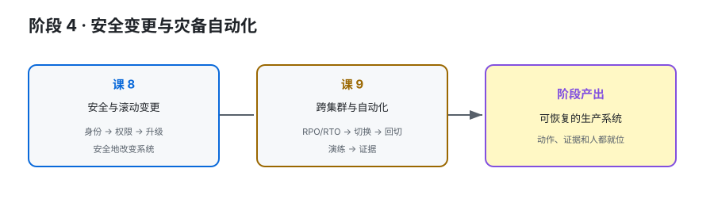

# 阶段 4：安全变更与灾备自动化

> 所属课程：Kafka 运维方向子教程 ｜ 故事章节：把恢复能力练出来 ｜ 上一阶段：[阶段 3](../3-可观测与故障排查/overview.md) ｜ [返回总览](../../01-学习路径总览.md)

## 🎯 本阶段目标

- 能运营 Listener、TLS/SASL、ACL 与凭据/证书轮换。
- 能设计滚动升级和高风险在线变更的分批、验证与回滚路径。
- 能从 RPO/RTO 出发规划跨集群灾备，并用自动化和演练留下证据。

## 📍 学习重点

- 安全配置不是一次性“打开开关”，而是身份、权限、监听器、轮换和审计的运营闭环。
- 兼容性让滚动升级成为可能，但不能替代版本核对、功能验证和回滚预案。
- 跨机房不是把一套集群复制到另一套就结束；切换、回切、数据方向和 offset 语义都要演练。

## ✅ 必须掌握的知识点

| 知识点 | 所属课 | 学完应能 |
|--------|--------|----------|
| Listener、TLS/SASL 与 ACL 运营 | 课 8 | 从连接入口走到身份认证和资源授权 |
| 凭据/证书轮换与在线接入安全 | 课 8 | 设计分批轮换、验证和失败回退 |
| 滚动升级、兼容性与变更审批 | 课 8 | 写出升级前检查、分批执行和升级后验证 |
| RPO/RTO 与跨机房拓扑 | 课 9 | 选择本地集群 + 镜像等拓扑并说清代价 |
| MirrorMaker 2、切换与回切演练 | 课 9 | 设计切换、回切和数据一致性检查 |
| Admin 自动化、runbook 与演练证据 | 课 9 | 将命令封装为幂等、可审计、可验证的运维动作 |

## 🗺️ 本阶段路径图

> SVG 展示从安全运营到灾备演练的闭环；每个高风险动作都必须有回滚和证据。

## 本阶段产出

- [x] `lessons/lesson-08-安全运营与滚动变更.md` — 2026-09-20 完成（实测课）
- [ ] `lessons/lesson-09-跨集群灾备与运维自动化.md`

## 课 8 核心结论（实测，2026-09-20）

基于 3 节点 KRaft 集群（`apache/kafka:4.0.0`）就地改造，从零安全基线做到双监听器 + SASL/SCRAM + ACL：

1. **加门不锁门**：新增 `SASL_PLAINTEXT://0.0.0.0:9095` 并保留 `PLAINTEXT://0.0.0.0:9092`，老客户端零中断（实测仍连上 3 节点且可读写）。
2. **认证 ≠ 授权**：`SaslAuthenticationException`（认证层）与 `TopicAuthorizationException`（授权层）必须先看异常类名再决定动哪层。
3. **开 ACL 前必须配 `super.users`**，否则管理员自己被锁在门外，只能重建集群。
4. **SCRAM 轮换无需重启但立即生效**：实测改密码后旧密码立即 `Authentication failed`；生产若需零中断应采用双用户切换（本课未实测）。
5. **凭据存在 `__cluster_metadata`**：容器重建且 `log.dirs` 未持久化时三个用户全部失效——备份必须覆盖元数据主题。
6. **metadata.version 是单向阀**：实测降级到 `3.9-IV0` / `4.0-IV0` 均被拒（`Refusing to perform the requested downgrade`），回滚只能是备份重建。
7. **滚动重启三批次**：每批体检（节点数=3 且 URP=0 且 Leader 存在），实测 URP 在重启期间为 1.0/3.0、恢复后归 0；**Leader 不自动让回**（与课 7 一致）。

> ⚠️ 集群保持改造后状态（双监听器 + ACL），作为课 9 灾备实验的起点，不再回退到零安全基线。
