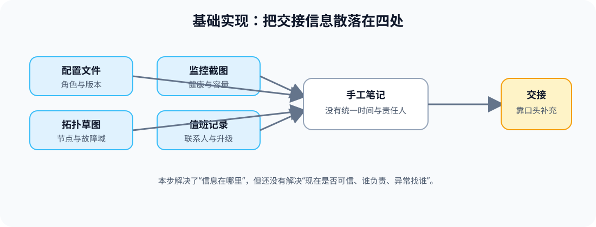
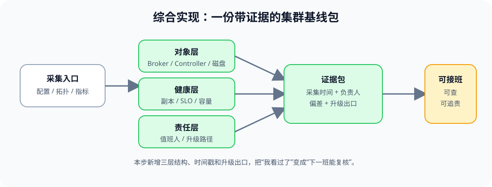

# 应用实战 · 运维全景与集群基线

> 对应课程：[第 1 课：运维全景与集群基线](../stages/1-集群运维基线/lessons/lesson-01-运维全景与集群基线.md) ｜ 覆盖知识点：运维对象分层与集群基线、环境、拓扑与故障域基线、SLO/值班台账/runbook
> 定位：**会用，不上生产**——把课上的分层、故障域和 SLO 组合成一次可交接的基线整理。
> 📖 结论已按官方文档核对（核查于 2026-09 ｜ 来源：[KRaft](https://kafka.apache.org/43/operations/kraft/)、[Monitoring](https://kafka.apache.org/43/operations/monitoring/)、[Basic Kafka Operations](https://kafka.apache.org/43/operations/basic-kafka-operations/)）。

## 场景：今晚把集群交给下一班

值班交接还有 20 分钟。下一班只问三个问题：“现在守着哪些对象？哪里坏了会一起坏？如果报警，先找谁？”你手里有几张配置截图和一份旧的值班笔记，但没有一份能在维护前快速复核的基线包。

**全貌一句话**：先把对象、故障域和服务目标整理成一张基线，再把它变成带时间、负责人和升级出口的交接证据包；完整方案还需要持续采集、告警和权限治理，本篇不展开。

### ① 基础实现：把信息抄成一张表

> **看图**：左侧的配置、拓扑、监控和旧记录都被人工抄进一张笔记，右侧虽然能交接，但没有统一的时间戳、责任人和偏差记录。

下面是一份“先能用”的手工交接表。它适合第一次盘点，不适合反复维护。

~~~yaml
cluster_name: "<CLUSTER_NAME>"
brokers:
  - id: "<BROKER_ID_1>"
    role: "broker"
    rack: "<RACK_A>"
  - id: "<BROKER_ID_2>"
    role: "broker"
    rack: "<RACK_B>"
controllers:
  voters: ["<CONTROLLER_ID_1>", "<CONTROLLER_ID_2>", "<CONTROLLER_ID_3>"]
health:
  under_replicated_partitions: "<VALUE>"
  offline_log_directories: "<VALUE>"
on_call:
  owner: "<ON_CALL_ROLE>"
  escalation: "<ESCALATION_PATH>"
~~~

#### 它的问题

- **对象和状态混在一起**：节点角色、实时健康值和联系人没有注明采集时间。
- **故障域不可复核**：只写了 rack 名称，没有说明哪些节点不能同时失去。
- **交接没有成功判据**：下一班不知道哪些值偏离了基线，也不知道何时需要升级。

### ② 综合实现：把手工表升级成证据包

> **看图**：比基础版新增了对象层、健康层和责任层，并把采集时间、偏差和升级出口绑定到同一份证据包；交接从“看过笔记”变成“下一班可以复核”。

把内容拆成三个层次时，基线的职责会清楚很多；实际落盘可以按团队习惯拆成多个文件：

~~~yaml
snapshot:
  collected_at: "<ISO_8601_TIMESTAMP>"
  collector: "<ON_CALL_ROLE>"
topology:
  failure_domains:
    - name: "<RACK_A>"
      members: ["<BROKER_ID_1>", "<CONTROLLER_ID_1>"]
    - name: "<RACK_B>"
      members: ["<BROKER_ID_2>", "<CONTROLLER_ID_2>"]
objects:
  brokers: ["<BROKER_ID_1>", "<BROKER_ID_2>"]
  controllers: ["<CONTROLLER_ID_1>", "<CONTROLLER_ID_2>", "<CONTROLLER_ID_3>"]
health:
  urp: "<CURRENT_URP>"
  offline_log_directories: "<CURRENT_OFFLINE_LOG_DIRECTORIES>"
  active_controller_count: "<CURRENT_ACTIVE_CONTROLLER_COUNT>"
expected_baseline:
  urp: 0
  offline_log_directories: 0
  active_controller_count: 1
service_objectives:
  availability_target: "<SLO_TARGET>"
  escalation_after: "<DURATION>"
deviations:
  - "<KNOWN_DEVIATION_OR_NONE>"
~~~

补充一条只读快照命令，把配置和运行态分开记录：

~~~bash
docker compose -f kafka/assets/stage6-observability/docker-compose.yml config --quiet
kafka-topics.sh --bootstrap-server "<BROKER_ENDPOINT>" --describe
kafka-metadata-quorum.sh --bootstrap-server "<BROKER_ENDPOINT>" describe --status
~~~

> 这些命令只用于演练材料中的证据采集；`<BROKER_ENDPOINT>` 和其他占位符必须替换成自己的环境值，不能把真实地址写入教程或交接档案。

> 🎯 **会用标志**：你能给下一班一份带采集时间、对象清单、故障域、健康状态、SLO、负责人和升级出口的基线包，并能说清每个字段来自配置还是运行态。

## 🧭 导航

- ⬅️ 回到课程：[第 1 课：运维全景与集群基线](../stages/1-集群运维基线/lessons/lesson-01-运维全景与集群基线.md)
- 📚 全部实战：[应用实战索引](INDEX.md)
- ➡️ 下一课实战：[02 · Topic 容量评审单](02-存储、容量与分区规划.md)
