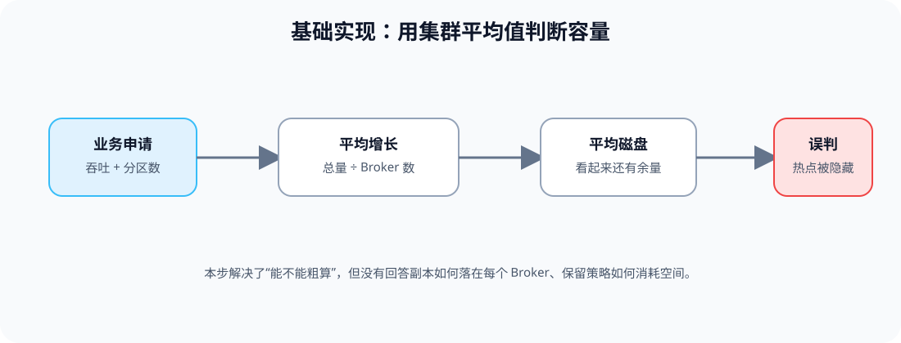
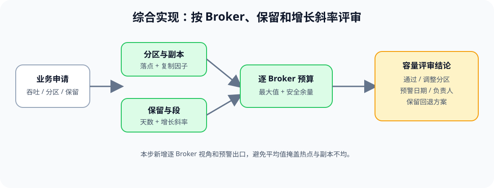

# 应用实战 · 存储、容量与分区规划

> 对应课程：[第 2 课：存储、容量与分区规划](../stages/1-集群运维基线/lessons/lesson-02-存储、容量与分区规划.md) ｜ 覆盖知识点：分区规模与并行度规划、日志存储与保留生命周期、容量模型与增长预警
> 定位：**会用，不上生产**——把一次新增高吞吐 Topic 的申请，演进成逐 Broker 的容量评审单。
> 📖 结论已按官方文档核对（核查于 2026-09 ｜ 来源：[Topic Configs](https://kafka.apache.org/43/configuration/topic-configs/)、[Hardware and OS](https://kafka.apache.org/43/operations/hardware-and-os/)、[Basic Kafka Operations](https://kafka.apache.org/43/operations/basic-kafka-operations/)）。

## 场景：新增 Topic，平均值说“够用”

业务预计每天写入 120 GiB，保留 7 天，申请 12 个分区。容量同学用“集群剩余空间 ÷ Broker 数”快速估算，结论是可以上线；但这个 Topic 的副本可能集中在同一批磁盘上，平均值掩盖了热点。

**全貌一句话**：先用简化公式得到数量级，再把分区、副本、保留和逐 Broker 最大值合进评审；完整方案还需要真实生产曲线、分区键分布和压测，本篇不展开。

### ① 基础实现：先算集群平均值

> **看图**：业务申请先被压成一个平均增长值，再和集群平均磁盘比较；这能快速估算量级，却看不出副本落点和 Broker 之间的倾斜。

用一个离线计算片段得到第一版数量级。数字是本场景的演练假设，不是通用阈值。

~~~bash
DAILY_LOGICAL_GIB=120
RETENTION_DAYS=7
REPLICATION_FACTOR=3
HEADROOM=0.30

awk -v daily_gib="$DAILY_LOGICAL_GIB" \
    -v days="$RETENTION_DAYS" \
    -v rf="$REPLICATION_FACTOR" \
    -v headroom="$HEADROOM" '
BEGIN {
  logical = daily_gib * days
  replicated = logical * rf
  budget = replicated * (1 + headroom)
  printf "logical_gib=%.1f replicated_gib=%.1f budget_gib=%.1f\n", logical, replicated, budget
}'
~~~

#### 它的问题

- **平均值隐藏倾斜**：某个 Broker 可能承载更多大分区或副本。
- **没有连接分区规划**：12 个分区是否足够并行，不能只看总 GiB。
- **保留策略没有落到增长斜率**：容量评审无法回答大约何时进入预警区。

### ② 综合实现：按副本落点和增长斜率评审

> **看图**：比基础版新增了分区与副本落点、保留与日志段、逐 Broker 预算和预警日期；评审结论不再只回答“集群平均够不够”。

先把申请固定成可复核的输入，再把每个 Broker 的最坏预算纳入评审：

~~~json
{
  "topic": "<TOPIC_NAME>",
  "partitions": 12,
  "replication_factor": 3,
  "daily_logical_gib": 120,
  "retention_days": 7,
  "broker_budget": [
    {"broker_id": "<BROKER_ID_1>", "free_gib": "<VALUE>", "planned_gib": "<VALUE>"},
    {"broker_id": "<BROKER_ID_2>", "free_gib": "<VALUE>", "planned_gib": "<VALUE>"},
    {"broker_id": "<BROKER_ID_3>", "free_gib": "<VALUE>", "planned_gib": "<VALUE>"}
  ],
  "decision": "<PASS_OR_ADJUST_PARTITIONS_OR_RETENTION>",
  "warning_owner": "<OWNER_ROLE>"
}
~~~

只读检查时，分别查看 Topic 的分区副本描述和各 Broker 的日志目录状态：

~~~bash
kafka-topics.sh --bootstrap-server "<BROKER_ENDPOINT>" --describe --topic "<TOPIC_NAME>"
kafka-log-dirs.sh --bootstrap-server "<BROKER_ENDPOINT>" --describe --broker-list "<BROKER_ID_LIST>"
~~~

> 这里的“逐 Broker 预算”是评审模型，不等于 Kafka 自动执行的容量调度；真正上线前还要核对副本布局、文件系统、业务峰值和批准的安全余量。

> 🎯 **会用标志**：你能把新增 Topic 的分区、复制因子、保留时间、逐 Broker 剩余空间、增长斜率和预警负责人写进同一张评审单，并指出平均值可能掩盖的风险。

## 🧭 导航

- ⬅️ 回到课程：[第 2 课：存储、容量与分区规划](../stages/1-集群运维基线/lessons/lesson-02-存储、容量与分区规划.md)
- 📚 全部实战：[应用实战索引](INDEX.md)
- ➡️ 下一课实战：[03 · Topic 变更申请与验证](03-Topic生命周期与配置治理.md)
