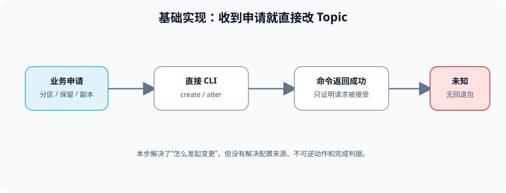
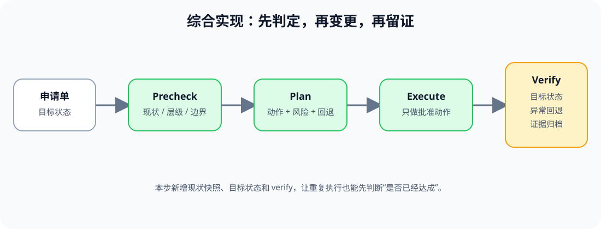

# 应用实战 · Topic 生命周期与配置治理

> 对应课程：[第 3 课：Topic 生命周期与配置治理](../stages/2-日常操作与容量治理/lessons/lesson-03-Topic生命周期与配置治理.md) ｜ 覆盖知识点：Topic 创建基线、配置层级与在线变更、分区扩容/删除与保留策略
> 定位：**会用，不上生产**——把一个 Topic 申请从“直接敲命令”演进成可验证、可解释、可回退的变更单。
> 📖 结论已按官方文档核对（核查于 2026-09 ｜ 来源：[Topic Configs](https://kafka.apache.org/43/configuration/topic-configs/)、[Broker Configs](https://kafka.apache.org/43/configuration/broker-configs/)、[Basic Kafka Operations](https://kafka.apache.org/43/operations/basic-kafka-operations/)）。

## 场景：业务说“只改一个配置”

业务申请把 `<TOPIC_NAME>` 的保留时间改成 7 天，并把分区数从 6 扩到 12。申请人认为两条 CLI 就够了；但配置可能来自 Broker 默认或 Topic 显式值，分区扩容会影响键分布，而且删除 Topic 是不可逆边界。

**全貌一句话**：把申请变成“现状 → 目标 → 批准动作 → 验证 → 回退说明”的变更链；完整方案还需要审批系统、权限和业务方确认，本篇不展开。

### ① 基础实现：直接创建或修改

> **看图**：基础版只有申请、CLI 和“命令返回成功”三个节点；它能发起动作，却没有确认命令是否已完成目标，也没有记录原值。

示例命令可以帮助学习者认识动作边界，但这里只作为变更单里的静态样例，不在共享环境执行：

~~~bash
kafka-topics.sh \
  --bootstrap-server "<BROKER_ENDPOINT>" \
  --create \
  --topic "<TOPIC_NAME>" \
  --partitions 6 \
  --replication-factor 3

kafka-configs.sh \
  --bootstrap-server "<BROKER_ENDPOINT>" \
  --entity-type topics \
  --entity-name "<TOPIC_NAME>" \
  --alter \
  --add-config retention.ms=604800000
~~~

#### 它的问题

- **没有现状快照**：不知道原来的分区数、复制因子和显式配置是什么。
- **没有层级判断**：命令成功不等于最终配置来源符合预期。
- **没有回退边界**：保留时间可以改回，分区扩容和删除 Topic 却不能按同一路径逆转。

### ② 综合实现：用目标状态驱动变更

> **看图**：比基础版新增了 Precheck、Plan、Verify 和证据归档；变更者先判断目标是否已经达成，再只执行批准动作。

先写目标状态和风险，再用只读命令填入实际现状：

~~~yaml
request:
  topic: "<TOPIC_NAME>"
  owner: "<OWNER_ROLE>"
  reason: "<CHANGE_REASON>"
before:
  partitions: "<CURRENT_PARTITION_COUNT>"
  replication_factor: "<CURRENT_REPLICATION_FACTOR>"
  explicit_configs: "<CURRENT_TOPIC_CONFIGS>"
target:
  partitions: 12
  retention_ms: 604800000
guardrails:
  allow_partition_increase: true
  allow_topic_delete: false
  rollback: "restore retention only; partition increase is not reversible"
verify:
  - "partition count equals target"
  - "effective retention is recorded"
  - "client distribution impact is reviewed"
~~~

~~~bash
kafka-topics.sh --bootstrap-server "<BROKER_ENDPOINT>" --describe --topic "<TOPIC_NAME>"
kafka-configs.sh --bootstrap-server "<BROKER_ENDPOINT>" --entity-type topics --entity-name "<TOPIC_NAME>" --describe
~~~

> 目标状态文件是评审材料，不是自动执行器；真实变更前仍需按环境权限、审批和客户端影响完成复核。

> 🎯 **会用标志**：你能从一份 Topic 申请中写出变更前快照、目标状态、不可逆边界、验证条件和可行的回退动作，而不是只给两条 CLI。

## 🧭 导航

- ⬅️ 回到课程：[第 3 课：Topic 生命周期与配置治理](../stages/2-日常操作与容量治理/lessons/lesson-03-Topic生命周期与配置治理.md)
- 📚 全部实战：[应用实战索引](INDEX.md)
- ➡️ 下一课实战：[04 · Broker 下线与分阶段搬迁](04-Broker成员与数据搬迁.md)
