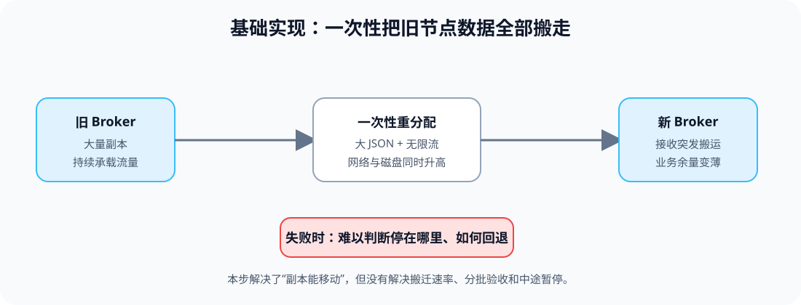
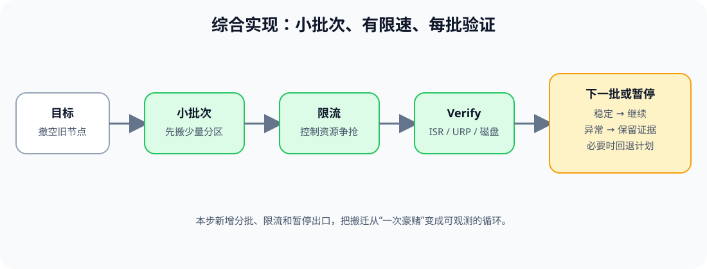

# 应用实战 · Broker 成员与数据搬迁

> 对应课程：[第 4 课：Broker 成员与数据搬迁](../stages/2-日常操作与容量治理/lessons/lesson-04-Broker成员与数据搬迁.md) ｜ 覆盖知识点：Broker 加入/下线与数据不会自动搬家、分区重分配/机架感知与限流、验证/回滚与优先副本均衡
> 定位：**会用，不上生产**——把“新增 Broker 后撤空旧节点”演进成小批次、有节奏、有暂停出口的搬迁计划。
> 📖 结论已按官方文档核对（核查于 2026-09 ｜ 来源：[Basic Kafka Operations](https://kafka.apache.org/43/operations/basic-kafka-operations/)、[Operations](https://kafka.apache.org/43/operations/)、[Monitoring](https://kafka.apache.org/43/operations/monitoring/)）。

## 场景：新 Broker 上线了，旧节点还很满

新节点已经加入集群，但既有分区不会因为它出现就自动搬过去。业务方希望“一次搬完旧节点上的所有副本”，而运维者需要保护网络、磁盘、ISR 和客户端延迟。

**全貌一句话**：先把目标副本集合写成计划，再用小批次、限流、逐批验证和回退出口完成搬迁；完整方案还需要容量预测、机架布局和变更审批，本篇不展开。

### ① 基础实现：一次性提交全部重分配

> **看图**：基础版把大量副本塞进一次重分配，旧节点、新节点、网络和磁盘同时承受突发压力；失败时很难判断停点。

下面是一个仅用于评审的重分配计划片段。数字是抽象的 Broker ID，不指向真实集群：

~~~json
{
  "version": 1,
  "partitions": [
    {"topic": "<TOPIC_NAME>", "partition": 0, "replicas": [101, 102, 104]},
    {"topic": "<TOPIC_NAME>", "partition": 1, "replicas": [102, 103, 104]}
  ]
}
~~~

#### 它的问题

- **资源峰值不可控**：多个大分区同时搬迁，可能挤压正常 Produce/Fetch 流量。
- **验证粒度太粗**：只能看到整批是否结束，不能快速定位某一批副本或某个 Broker 的异常。
- **回退不自然**：中途失败时，原始副本集合、当前集合和已追平集合可能同时存在。

### ② 综合实现：把搬迁拆成循环

> **看图**：比基础版新增了小批次、限流和 Verify；稳定就进入下一批，异常就保留证据并暂停，而不是继续堆压力。

把每一批的目标、资源上限和判据写在同一份计划里：

~~~yaml
migration:
  source_broker: "<SOURCE_BROKER_ID>"
  target_broker: "<TARGET_BROKER_ID>"
  batch_size: "<APPROVED_PARTITION_COUNT>"
  throttle: "<APPROVED_REPLICATION_THROTTLE>"
  rack_constraint: "<RACK_AWARENESS_RULE>"
batches:
  - id: "batch-01"
    reassignment_file: "<PLAN_FILE_01>"
    verify:
      - "URP remains at baseline"
      - "ISR catches up"
      - "target disk has headroom"
  - id: "batch-02"
    reassignment_file: "<PLAN_FILE_02>"
    verify:
      - "previous batch is stable"
      - "leader distribution is reviewed"
rollback:
  trigger: "health signal worsens or approved threshold is exceeded"
  action: "pause new batches, preserve status, use reviewed reverse plan"
~~~

迁移完成后的静态验证命令只查询状态：

~~~bash
kafka-reassign-partitions.sh \
  --bootstrap-server "<BROKER_ENDPOINT>" \
  --reassignment-json-file "<PLAN_FILE>" \
  --verify
kafka-topics.sh --bootstrap-server "<BROKER_ENDPOINT>" --describe
~~~

> 本篇不执行重分配；`--verify` 也必须在目标环境完成认证和权限核对后再使用。限流清理和优先副本均衡要作为收尾步骤单独记录。

> 🎯 **会用标志**：你能提交一份包含目标副本集合、批次、限流、机架约束、逐批成功判据、暂停条件和回退出口的搬迁计划。

## 🧭 导航

- ⬅️ 回到课程：[第 4 课：Broker 成员与数据搬迁](../stages/2-日常操作与容量治理/lessons/lesson-04-Broker成员与数据搬迁.md)
- 📚 全部实战：[应用实战索引](INDEX.md)
- ➡️ 下一课实战：[05 · 一小时维护窗口编排](05-日常维护与KRaft运维.md)
