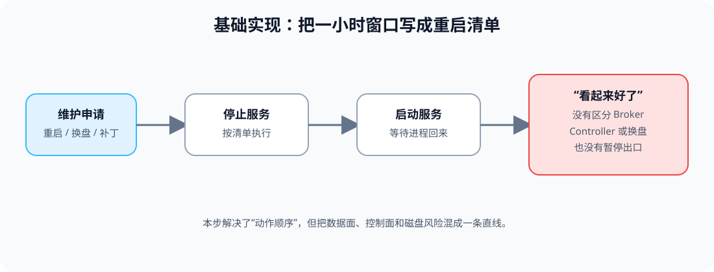
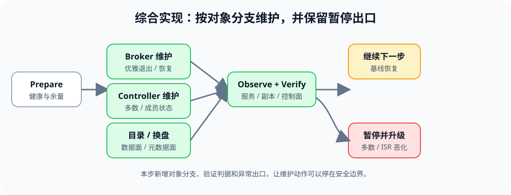

# 应用实战 · 日常维护与 KRaft 运维

> 对应课程：[第 5 课：日常维护与 KRaft 运维](../stages/2-日常操作与容量治理/lessons/lesson-05-日常维护与KRaft运维.md) ｜ 覆盖知识点：优雅关停与维护窗口、KRaft 控制器仲裁运维、磁盘/日志目录与 JVM/OS 维护
> 定位：**会用，不上生产**——把一张“重启清单”演进成能区分 Broker、Controller、数据目录和元数据目录的维护窗口编排。
> 📖 结论已按官方文档核对（核查于 2026-09 ｜ 来源：[Basic Kafka Operations](https://kafka.apache.org/43/operations/basic-kafka-operations/)、[KRaft](https://kafka.apache.org/43/operations/kraft/)、[Hardware and OS](https://kafka.apache.org/43/operations/hardware-and-os/)、[Monitoring](https://kafka.apache.org/43/operations/monitoring/)）。

## 场景：一小时里有四件事要做

维护窗口只有一小时：重启一台 Broker、检查 KRaft 控制器、评审一块数据盘替换，还要确认 JVM/OS 资源没有成为隐形故障。把它们排成一条直线，最容易在错误的对象上执行正确的命令。

**全貌一句话**：先确认余量，再按对象分支执行维护，最后用服务、副本、控制面和资源证据收尾；完整方案还需要变更审批、值班通知和实际回退资源，本篇不展开。

### ① 基础实现：一张直线式重启清单

> **看图**：基础版只有申请、停止、启动和“看起来好了”；它没有区分 Broker 与 Controller，也没有给磁盘目录和多数不足设置暂停出口。

先写一份最小清单，帮助发现它为什么不够：

~~~yaml
window:
  duration: "<MAINTENANCE_WINDOW>"
  owner: "<ON_CALL_ROLE>"
steps:
  - stop: "<TARGET_SERVICE>"
  - start: "<TARGET_SERVICE>"
  - check: "process is running"
result: "<LOOKS_OK>"
~~~

#### 它的问题

- **对象不明确**：Broker 重启和 Controller 成员维护的前置条件不同。
- **没有 Prepare**：副本、仲裁、目录和客户端是否有余量没有证据。
- **没有 Verify 与升级出口**：进程回来不等于 ISR、HighWatermark、磁盘和业务延迟回到基线。

### ② 综合实现：按对象分支的维护 Runbook

> **看图**：比基础版新增了 Broker、Controller、目录换盘三个分支，以及统一的 Observe/Verify 和“暂停并升级”出口。

把维护动作写成评审用 Runbook；命令只做只读检查，真正的停止、换盘和成员变更留在批准后的执行单：

~~~yaml
runbook:
  prepare:
    - "check reassignment and throttle state"
    - "check URP, OfflineReplica and UnderMinIsr"
    - "check Controller majority and metadata progress"
    - "record disk, fd, mmap, heap and GC baseline"
  branches:
    broker:
      action: "review graceful shutdown, then restart one Broker"
      verify: "member, ISR, leader, client errors and resources"
    controller:
      action: "identify static/dynamic quorum before membership action"
      verify: "CurrentVoters, LeaderEpoch, HighWatermark and lag"
    data_directory:
      action: "cordon, reassignment, verify, then replace directory"
      verify: "log directory, partitions, ISR and disk I/O"
    metadata_directory:
      action: "prove majority committed data before format review"
      verify: "quorum status and replication after recovery"
  stop_conditions:
    - "Controller majority is not available"
    - "ISR shrinks continuously"
    - "OfflineLogDirectoryCount is non-zero"
    - "client errors or resource latency keeps increasing"
~~~

维护前后的只读证据可以用这些命令采集：

~~~bash
kafka-metadata-quorum.sh --bootstrap-server "<BROKER_ENDPOINT>" describe --status
kafka-metadata-quorum.sh --bootstrap-server "<BROKER_ENDPOINT>" describe --replication
kafka-topics.sh --bootstrap-server "<BROKER_ENDPOINT>" --describe
java -version
ulimit -n
sysctl vm.max_map_count
~~~

> 本篇只演练 Runbook 设计，不执行 `format`、`add-controller`、`remove-controller`、重启、换盘或重分配。未知版本或未知 quorum 类型时，暂停并升级。

> 🎯 **会用标志**：你能把一小时维护拆成 Prepare、对象分支、Observe、Verify 和停止条件，并能说明为什么 metadata 目录不能套用普通数据目录的换盘流程。

## 🧭 导航

- ⬅️ 回到课程：[第 5 课：日常维护与 KRaft 运维](../stages/2-日常操作与容量治理/lessons/lesson-05-日常维护与KRaft运维.md)
- 📚 全部实战：[应用实战索引](INDEX.md)
