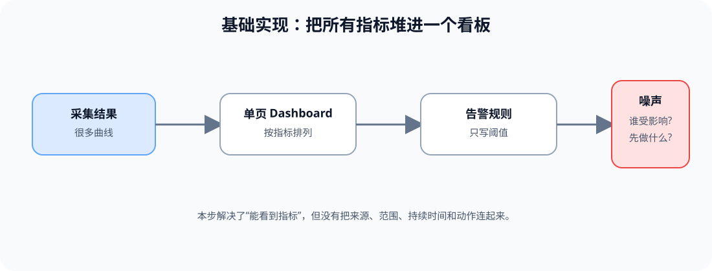
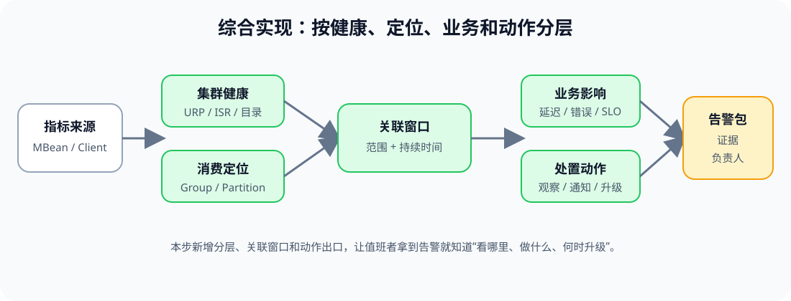

# 应用实战 · 可观测性基线与告警

> 对应课程：[第 6 课：可观测性基线与告警](../stages/3-可观测与故障排查/lessons/lesson-06-可观测性基线与告警.md) ｜ 覆盖知识点：指标采集链路与标签设计、健康基线与告警分级、Consumer lag/日志/看板
> 定位：**会用，不上生产**——把“所有曲线都放上去”的指标页，演进成能告诉值班者看哪里、做什么、何时升级的看板。
> 📖 结论已按官方文档核对（核查于 2026-09 ｜ 来源：[Monitoring](https://kafka.apache.org/43/operations/monitoring/)、[Basic Kafka Operations](https://kafka.apache.org/43/operations/basic-kafka-operations/)、[Prometheus JMX Exporter](https://github.com/prometheus/jmx_exporter/blob/main/README.md)）。

## 场景：凌晨收到五条红色告警

值班者打开大屏，看到 URP、请求延迟、Consumer Group lag 和磁盘曲线同时变红。每条告警都带了一个数字，却没有说明来源、范围、持续时间和动作。现在要把这张看板改成“拿到告警就能开始分诊”的工具。

**全貌一句话**：先把指标按健康、定位、业务和动作分层，再用标签、时间窗口和 SLO 影响把告警串成证据；完整方案还需要通知路由、权限和长期容量治理，本篇不展开。

### ① 基础实现：把所有指标堆进一个看板

> **看图**：基础版只有采集结果、单页 Dashboard 和只写阈值的规则；它解决了“能看到指标”，却没有告诉值班者“谁受影响、先做什么”。

先用一个看起来能工作的看板清单开始：

~~~yaml
dashboard:
  name: "<DASHBOARD_NAME>"
  panels:
    - UnderReplicatedPartitions
    - OfflineLogDirectoryCount
    - RequestHandlerAvgIdlePercent
    - consumer_lag
    - disk_usage
    - request_errors
alerts:
  - name: "<ALERT_1>"
    metric: "consumer_lag"
    condition: "> <THRESHOLD>"
  - name: "<ALERT_2>"
    metric: "request_errors"
    condition: "> <THRESHOLD>"
~~~

#### 它的问题

- **指标来源不清楚**：consumer_lag 可能来自 Group CLI、客户端指标或 Broker follower 指标。
- **范围没有约束**：不知道告警属于哪个集群、Broker、Topic、Partition 或 Group。
- **只有阈值没有时间和动作**：一次抖动也会通知，持续恶化却没有明确升级出口。

### ② 综合实现：按健康、定位、业务和动作分层

> **看图**：比基础版新增了集群健康、消费定位、范围与持续时间、业务影响和处置动作；告警最终带着证据和负责人到达值班者。

把看板和告警设计成一份可评审的目标状态：

~~~yaml
dashboard:
  name: "<DASHBOARD_NAME>"
  layers:
    cluster_health:
      signals:
        - metric: "UnderReplicatedPartitions"
          source: "kafka.server:type=ReplicaManager,name=UnderReplicatedPartitions"
        - metric: "OfflineLogDirectoryCount"
          source: "kafka.log:type=LogManager,name=OfflineLogDirectoryCount"
        - metric: "ActiveControllerCount"
          source: "kafka.controller:type=KafkaController,name=ActiveControllerCount"
    broker_diagnosis:
      signals:
        - "RequestQueueSize"
        - "RequestHandlerAvgIdlePercent"
        - "disk_io_latency"
    consumer_diagnosis:
      signals:
        - "group_lag"
        - "records-lag-max"
        - "consumer_group_rebalance"
    business_impact:
      signals:
        - "produce_error_rate"
        - "fetch_error_rate"
        - "end_to_end_latency"
  label_policy:
    always_available:
      - "cluster"
      - "environment"
    add_only_when_supported_by_signal:
      - "broker"
      - "topic"
      - "partition"
      - "group"

alert_policy:
  name: "<ALERT_NAME>"
  signal: "<METRIC_OR_STATE>"
  source: "<MBean_OR_CLIENT_METRIC>"
  scope:
    cluster: "<CLUSTER_LABEL>"
    broker: "<BROKER_LABEL_OR_ALL>"
    topic: "<TOPIC_LABEL_OR_ALL>"
    group: "<GROUP_LABEL_OR_ALL>"
  condition: "<BASELINE_DEVIATION>"
  duration: "<APPROVED_DURATION>"
  severity: "<CRITICAL_WARNING_INFO>"
  impact: "<SLO_OR_NO_KNOWN_IMPACT>"
  action: "<OBSERVE_NOTIFY_ESCALATE>"
  suppression: "<APPROVED_MAINTENANCE_WINDOW_ONLY>"
  evidence:
    - "<DASHBOARD_QUERY>"
    - "<CLI_SNAPSHOT>"
    - "<LOG_TIME_WINDOW>"
~~~

静态验证时只核对来源和展示口径，不发布规则：

~~~text
1. 先确认 MBean 或 Client Metric 的发布者
2. 再确认 Exporter 的名称和标签映射
3. 再确认 Dashboard 的时间窗口和筛选维度
4. 最后确认告警动作、负责人和升级出口
~~~

> 这里的 dashboard 配置是教学用目标状态，不是某个监控系统的可直接导入文件；`label_policy` 也不要求每条指标拥有全部维度，Prometheus 指标名和可用标签必须以目标 Exporter 配置为准。

> 🎯 **会用标志**：你能把一条告警绑定到来源、范围、持续时间、业务影响、处置动作和证据查询，并能解释它为什么不是简单的阈值通知。

## 🧭 导航

- ⬅️ 回到课程：[第 6 课：可观测性基线与告警](../stages/3-可观测与故障排查/lessons/lesson-06-可观测性基线与告警.md)
- 📚 全部实战：[应用实战索引](INDEX.md)
- ➡️ 下一课实战：课 7 应用实战（待对应课程生成）
