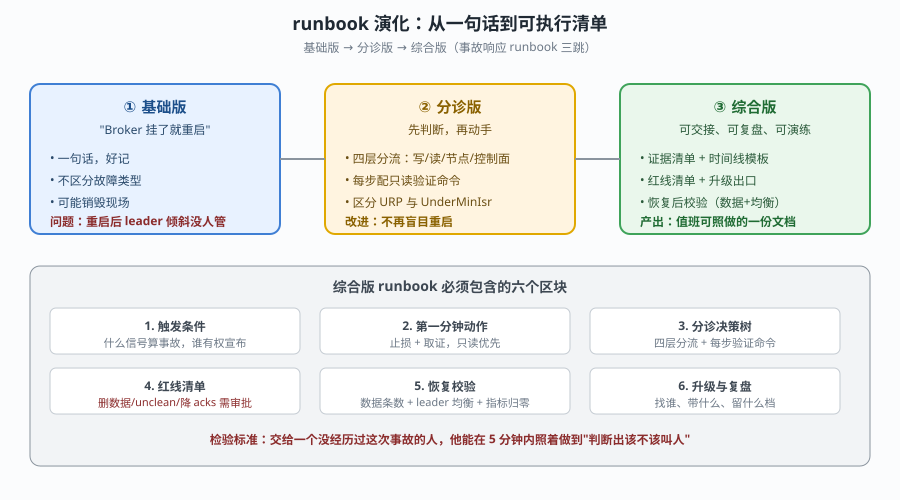
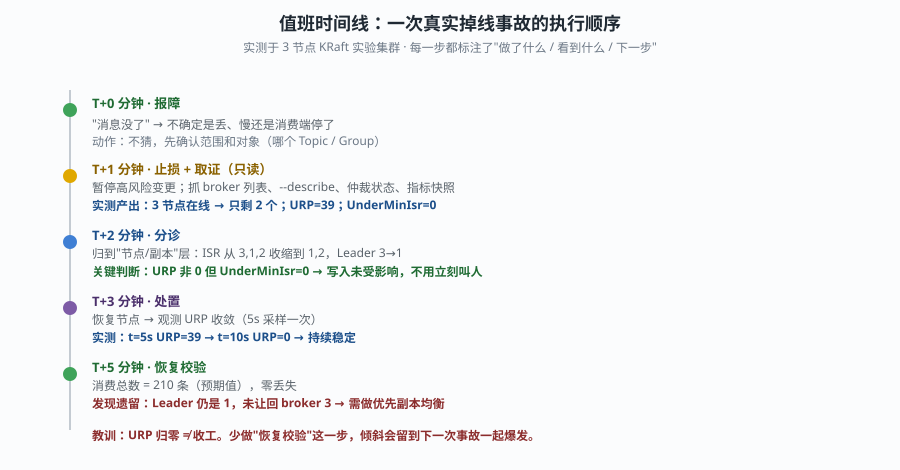

# 第 7 课实战 · 事故响应 runbook

> 所属课程：[课 7：Kafka 事故响应与故障排查](../stages/3-可观测与故障排查/lessons/lesson-07-Kafka事故响应与故障排查.md) ｜ 索引：[应用实战 INDEX](./INDEX.md)
> 实战目标：把课 7 学到的止血、取证、分诊和症状倒查，组装成一份**别人能照着执行**的值班 runbook。
> 🧪 **本实战基于本机真跑**（2026-09-20，3 节点 KRaft 实验集群），文中实测数字均为真实输出。

## 🎯 你要解决什么

课 7 讲了"掉一台 Broker 之后会发生什么"，但值班时没人会背这些知识。你需要一份文档：

- 让**没经历过这次事故的人**也能在 5 分钟内判断出"该不该叫人"；
- 每一步都写明**做什么、看到什么算通过、不通过怎么办**；
- 明确列出**红线**（哪些动作必须审批）。

这篇实战就是带你从一句"Broker 挂了就重启"，演化成那份可交接的文档。

## 📐 设计图

### 图 1：runbook 的三跳演进

> **看图**：基础版好记但会闯祸；分诊版加上判断分支；综合版补齐证据、红线、恢复校验和升级出口。检验标准是"交给陌生人能不能照做"。

### 图 2：值班时间线（真实执行顺序）

> **看图**：每个时间点的动作、观察到的实测数据和下一步判断；最后一步"恢复校验"是本次实测遗漏后补上的教训。

## 🧱 第一跳：基础版 runbook（先看它够不够用）

最朴素的写法：

~~~text
【Broker 掉线处理】
1. 重启 Broker
2. 确认服务恢复
~~~

**它解决了什么**：好记，两行字，谁都能背。

**它在实测中暴露的三个问题**：

| 问题 | 实测证据 | 后果 |
|------|----------|------|
| 不区分故障是否影响写入 | 停 1 台后 URP=39，但 UnderMinIsr=0，写入正常 | 可能把"余量变薄"当成"写入中断"，过度反应 |
| 没有取证步骤 | 重启会改变 leader 分布、滚动日志 | 现场丢失，复盘时无法还原 |
| 没有恢复后校验 | 恢复后 Leader 仍是 1，未让回 broker 3 | 负载倾斜累积，下次事故一起爆发 |

> 结论：基础版不够用。它最大的问题不是"写得太少"，而是**把最危险的动作放在了第一步，且没有前置条件**。

## 🔀 第二跳：分诊版 runbook（加上判断分支）

在基础版前面插入"先判断"，把四种症状分开：

~~~text
【Broker 掉线处理 v2】
0. 先做只读取证（30 秒）
   - kafka-broker-api-versions.sh   → 谁还在线
   - kafka-topics.sh --describe     → Leader / Replicas / ISR
   - 指标快照：URP / UnderMinIsr / OfflineLogDir / ActiveController

1. 判断影响面
   ├─ UnderMinIsr = 0 → 写入未受影响 → 继续观察，暂停高风险变更
   └─ UnderMinIsr ≠ 0 → 写入可能被拒 → 立刻升级 + 准备恢复副本

2. 处置
   - 恢复节点 → 每 5 秒采样 URP，直到归零
~~~

**关键改进**：把"重启"从第一步挪到了第 2 步，并且在前面加了**只读取证**和**影响面判断**。

**实测验证这个分支是对的**：

~~~text
停 broker 3 后：
  URP = 39.0                        ← 余量变薄
  UnderMinIsrPartitionCount = 0.0   ← 但写入门槛仍满足
  acks=all 写入：成功

把 min.insync.replicas 提到 3 再停 1 台：
  ISR = 2 < 3
  → NOT_ENOUGH_REPLICAS，acks=all 写入被拒
  → acks=1 仍能写（但可靠性下降）
~~~

**这一跳还缺什么**：仍然没有回答"验证不了时找谁"、"哪些动作要先审批"、"恢复后怎么证明真的好了"。

## 🏗️ 第三跳：综合版 runbook（可交接、可复盘、可演练）

下面是完整模板。方括号内容需替换为你环境的值。

### 区块 1 · 触发条件

~~~text
触发信号（任一）：
  - UnderMinIsrPartitionCount > 0 持续 2 分钟
  - OfflineLogDirectoryCount > 0
  - ActiveControllerCount ≠ 1
  - 业务侧报告"消息异常"且消费组 LAG 持续增长

宣布人：值班负责人
事故等级：
  🔴 立即处理：UnderMinIsr > 0 或有业务影响
  🟡 尽快处理：URP > 0 但 UnderMinIsr = 0
~~~

### 区块 2 · 第一分钟动作（只读，不改动系统）

~~~bash
# ① 谁在线
kafka-broker-api-versions.sh --bootstrap-server "<BROKER_ENDPOINT>" | grep -E '^kafka-'

# ② 分区布局与 ISR
kafka-topics.sh --bootstrap-server "<BROKER_ENDPOINT>" --describe --topic "<TOPIC_NAME>"

# ③ 控制面
kafka-metadata-quorum.sh --bootstrap-server "<BROKER_ENDPOINT>" describe --status

# ④ 关键指标
curl -sS "http://<EXPORTER_ENDPOINT>/metrics" | grep -E \
  '^kafka_server_replicamanager_(underreplicatedpartitions|underminisrpartitioncount)|^kafka_log_logmanager_(offlinelogdirectorycount)|^kafka_controller_kafkacontroller_(activecontrollercount)'
# ※ 必须锚定行首 ^：裸 grep 会命中 # HELP / # TYPE 行，
#   还会混入 kafka_cluster_partition_underreplicated_* 这类每分区指标（语义完全不同）

# ⑤ 消费组
kafka-consumer-groups.sh --bootstrap-server "<BROKER_ENDPOINT>" --describe --group "<GROUP_NAME>"
kafka-consumer-groups.sh --bootstrap-server "<BROKER_ENDPOINT>" --describe --group "<GROUP_NAME>" --state
~~~

> ⚠️ **环境踩坑（实测）**：在容器内跑 CLI 需清空 `KAFKA_JMX_OPTS`（`docker exec -e KAFKA_JMX_OPTS="" ...`），否则 javaagent 会二次绑定端口失败；且容器内要用 advertised listener 地址（如 `kafka-1:9092`），不是宿主机映射端口。

### 区块 3 · 分诊决策树

~~~text
报障"消息不对劲"
├─ 写不进去 → 查 UnderMinIsr + 生产端错误
│    ├─ NOT_ENOUGH_REPLICAS → ISR < min.insync.replicas → 恢复副本（不是改 acks）
│    └─ 其他错误 → 查请求错误指标与日志
├─ 读不出来/慢 → 查 LAG + 组成员
│    ├─ CONSUMER-ID = "-" 且 #MEMBERS = 0 → 消费者不在了，先找进程
│    └─ 有成员但 LAG 增长 → 消费能力不足或分区热点
├─ 节点/副本异常 → 查 URP + ISR
│    ├─ UnderMinIsr = 0 → 观察 + 暂停高风险变更
│    └─ UnderMinIsr ≠ 0 → 升级 + 恢复副本
└─ 控制面异常 → 查仲裁 + ActiveControllerCount
     └─ 元数据操作失败 ≠ 读写失败，分开归因
~~~

### 区块 4 · 红线清单

| 动作 | 为什么是红线 | 需要什么 |
|------|-------------|----------|
| 删除 Topic / 清数据 | 不可逆，把可恢复故障变成永久事故 | 书面审批 + 备份确认 |
| 开启 unclean leader election | 可能永久丢失已提交数据 | 业务负责人审批 |
| 把 `min.insync.replicas` 下调 | 降低可靠性门槛，风险转移到业务 | 审批 + 限时恢复 |
| 把 `acks` 从 all 改成 1 | 让失败从可见变成不可见 | 原则上禁止，仅临时且审批 |
| 重启未定位原因的节点 | 销毁现场、改变 leader 分布 | 先完成取证 |

### 区块 5 · 恢复校验（本次实测补上的关键一步）

~~~bash
# ① 指标归零
curl -s http://<EXPORTER_ENDPOINT>:17071/metrics | grep '^kafka_server_replicamanager_underreplicatedpartitions'
# 预期：0.0

# ② 数据完整性
kafka-console-consumer.sh --bootstrap-server "<BROKER_ENDPOINT>" --topic "<TOPIC_NAME>" \
  --from-beginning --timeout-ms 15000 | wc -l
# 预期：等于故障前条数 + 故障期间新增（本课实测 210 条，零丢失）

# ③ Leader 均衡检查（实测最容易漏的一步）
kafka-topics.sh --bootstrap-server "<BROKER_ENDPOINT>" --describe --topic "<TOPIC_NAME>"
# 看 Leader 是否还集中在少数节点；若是，执行优先副本均衡（见课 4）
~~~

### 区块 6 · 升级与复盘

~~~text
升级出口：
  - 谁：<值班升级人 / 业务负责人>
  - 带什么：触发时间、指标快照、--describe 输出、最近变更记录、已尝试动作
  - 何时：分诊无法收敛 / 需要触碰红线 / 30 分钟未恢复

复盘留档：
  - 时间线（T+0 到恢复）
  - 根因（要能被证据支持，不是"应该是"）
  - 影响面（受影响 Topic / 业务 / 数据条数）
  - 改进项（含 runbook 本身的修订）
~~~

## ✅ 验收清单

把你的 runbook 交给一个没参与过这次事故的人，让他对照下面自查：

- [ ] 能在 5 分钟内判断出"该不该叫人"
- [ ] 每个分支都写了**看到什么算通过**，而不只是"检查一下"
- [ ] 取证步骤全部是**只读**命令
- [ ] 红线清单至少包含删数据、unclean 选举、降 `acks` 三项
- [ ] 恢复校验包含**数据条数**和 **Leader 均衡**两项（不只是 URP 归零）
- [ ] 升级出口写明了"找谁、带什么、什么时候叫"
- [ ] 所有占位符已替换为本环境真实值（broker 地址 / topic / 端口）

## 🔗 相关

- 上一课实战：[06 · 可行动告警看板](./06-可观测性基线与告警.md)
- 本课正文：[课 7：Kafka 事故响应与故障排查](../stages/3-可观测与故障排查/lessons/lesson-07-Kafka事故响应与故障排查.md)
- 阶段主页：[阶段 3：可观测与故障排查](../stages/3-可观测与故障排查/overview.md)
- 返回：[应用实战索引](./INDEX.md)
