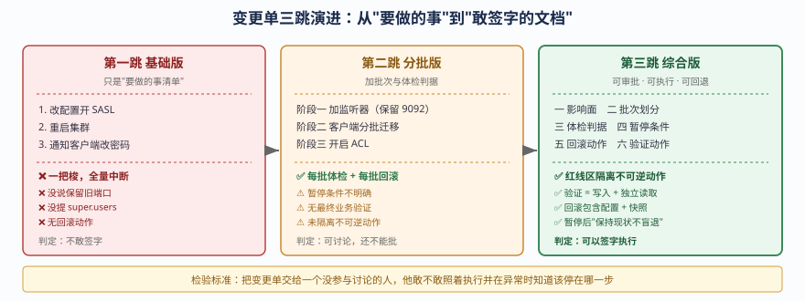
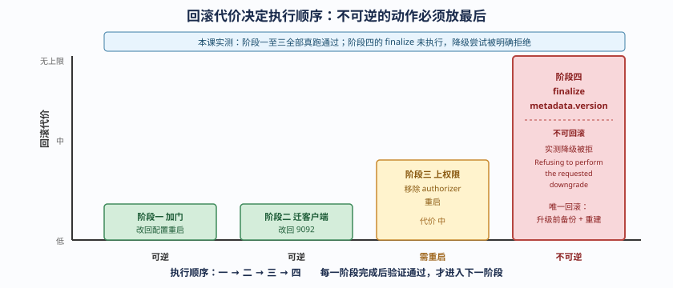

# 第 8 课实战 · 安全变更单与回滚包

> 所属课程：[课 8：安全运营与滚动变更](../stages/4-安全变更与灾备自动化/lessons/lesson-08-安全运营与滚动变更.md) ｜ 索引：[应用实战 INDEX](./INDEX.md)
> 实战目标：把课 8 学到的双监听器、凭据轮换、ACL 和滚动重启，组装成一份**能拿去审批、能照着执行、失败能回退**的变更单。
> 🧪 **本实战基于本机真跑**（2026-09-20，3 节点 KRaft 实验集群 `apache/kafka:4.0.0`），文中实测数字均为真实输出。

## 🎯 你要解决什么

课 8 讲了"怎么加安全、怎么滚动重启"，但真到执行那天，你的主管和审计只认一份东西：**变更单**。

一份能过关的变更单要回答：

- 这次改动**影响谁**、影响多久？
- 分**几批**做？每批做完**凭什么说可以继续**？
- 什么情况**停下来**？
- 每一步**怎么退回去**？
- 改完**怎么证明业务还活着**？

这篇实战带你从一句"今晚加个认证"，演化成那份可审批、可执行、可回退的变更单。

## 📐 设计图

### 图 1：变更单的三跳演进



> **看图**：基础版只是"要做的事清单"；分批版加上批次与体检判据；综合版补齐回滚包、验证动作和不可逆动作的隔离。检验标准是"交给另一个人，他敢不敢签字执行"。

### 图 2：四阶段回滚代价对比



> **看图**：横轴是四个阶段，纵轴是回滚代价。前三个阶段可逆，**第四阶段（finalize metadata.version）不可逆**——这张图决定了它们的执行顺序。

## 🧱 第一跳：基础版变更单（先看它够不够用）

最朴素的写法：

~~~text
【Kafka 安全加固变更】
1. 修改配置，开启 SASL 认证
2. 重启集群
3. 通知所有客户端更新密码
~~~

**它解决了什么**：三行字，说清了要做什么。

**它在实测中暴露的四个问题**：

| 问题 | 实测证据 | 后果 |
|------|----------|------|
| 不分批，一把梭 | 无 | 所有客户端同时认证失败，回滚要动全部客户端 |
| 没说保留旧端口 | 实测加 SASL 时保留 9092，老客户端零中断（仍连上 3 节点） | 白白制造中断 |
| 没提 super.users | 实测 `authorizer` 生效后无 ACL 即被拒 | 管理员把自己锁在门外，只能重建集群 |
| 没有回滚动作 | 无 | 出问题只能硬扛，无法止损 |

> 结论：基础版不够用。它把**三个可以分开的动作**（加监听器、迁客户端、上权限）压成了一步，导致任何一环出问题都是全量中断。

## 🔀 第二跳：分批版变更单（加上批次与体检判据）

在基础版基础上拆批次，每批加体检：

~~~text
【Kafka 安全加固变更 v2】

阶段一：加 SASL 监听器（保留 PLAINTEXT）
  - 改配置：KAFKA_LISTENERS 增加 SASL_PLAINTEXT://0.0.0.0:9095
  - 逐台重启：一次一台
  - 每批体检：在线节点数=3 且 URP=0
  - 验证：老客户端连 9092 仍可读写（实测通过）
  - 回滚：改回原配置重启（代价 低）

阶段二：客户端分批迁移到 9095
  - 按业务重要性分 3 批
  - 每批验证：新客户端连 9095 成功（实测列出 3 节点，端口 9095）
  - 回滚：客户端改回 9092（代价 低，因为旧门还在）

阶段三：开启 ACL
  - 前置：必须先配 super.users=User:admin;User:ANONYMOUS
  - 按最小权限授予 Write / Read
  - 验证：无 ACL 写入报 TopicAuthorizationException（实测）
  - 回滚：移除 authorizer 重启，或调整 ACL（代价 中）
~~~

**改进点**：批次 + 每批判据 + 每批回滚。

**仍缺的东西**：

1. **没说清楚暂停条件**——"每批体检"不通过时到底停不停？停多久？
2. **没有最终验证**——改完怎么证明业务真的还活着？
3. **没隔离不可逆动作**——如果这次变更里混进了 `finalize metadata.version`，回滚包就失效了。

## 🚀 第三跳：综合版变更单（可审批、可执行、可回退）

### 完整变更单模板

~~~text
【变更单】Kafka 集群接入 SASL/SCRAM 认证与 ACL 授权

━━━ 一、影响面 ━━━
受影响对象：全部生产/消费客户端、3 个 Broker
预期影响：无业务中断（保留 PLAINTEXT:9092 作为过渡）
窗口时长：约 40 分钟（3 批 × 约 12 分钟）
业务低峰：22:00 - 23:00

━━━ 二、批次划分 ━━━
批次 1：kafka-1 重启（约 12 分钟）
批次 2：kafka-2 重启（约 12 分钟）
批次 3：kafka-3 重启（约 12 分钟）
※ 一次只动一个节点，绝不同时动两个

━━━ 三、健康检查判据（三条全过才推进）━━━
① 在线节点数 == 3
   kafka-broker-api-versions.sh --bootstrap-server kafka-1:9092 | grep -cE '^kafka-[0-9]'
② URP == 0
   curl -sS http://localhost:17071/metrics | grep '^kafka_server_replicamanager_underreplicatedpartitions'
   ※ 必须锚定行首 ^：裸 grep 会同时命中 "# HELP ..." 行，取到的是指标名而非数值，判据会失真
③ Controller leader 存在
   kafka-metadata-quorum.sh --bootstrap-server kafka-1:9092 describe --status

━━━ 四、暂停条件（任一触发即中止后续批次）━━━
• 任一批次体检不通过
• URP 在 60 秒内未归零
• 出现 UnderMinIsr != 0
• 业务侧报告写入失败
※ 中止后：保持现状，不盲目回退（回退本身也是变更）

━━━ 五、回滚动作（每批独立）━━━
批次级回滚：改回该节点上一版配置并重启
整体回滚：还原 docker-compose.yml.bak.lesson08 并重建
※ 前置：变更前已备份 docker-compose.yml → docker-compose.yml.bak.lesson08

━━━ 六、验证动作（变更后必须执行）━━━
① 老客户端写 9092：成功（实测无报错）
② 新客户端写 9095：成功（实测无报错）
③ 读 offset 确认消息真的进去了：
   kafka-get-offsets.sh --topic sec-ops-demo --time -1
   （实测输出 0:3 / 1:1 / 2:1）
④ 无 ACL 用户写入被拒：TopicAuthorizationException（实测）

━━━ 七、红线（以下动作本次不做，需单独审批）━━━
✗ 下线 PLAINTEXT:9092
✗ 执行 kafka-features.sh upgrade --release-version（finalize metadata.version）
✗ 修改 inter.broker.listener.name
✗ 删除 super.users 配置
~~~

### 为什么"红线"这一节最重要

本课实测中，`metadata.version` 降级两次被明确拒绝：

```
Could not downgrade metadata.version to 21. The update failed for all features since
the following feature had an error: Invalid metadata.version 21. Refusing to perform
the requested downgrade because it might delete metadata information.
```

这意味着：**一旦 finalize，就没有"降级"这条路**。你的回滚方案只能是"升级前备份 + 重建集群"。

所以变更单必须**显式列出本次不做的不可逆动作**，而不是默认"反正能回退"。

## 🔍 实测验证：三批次滚动重启真实记录

本课真跑了完整的三批次滚动重启，以下是真实数据：

| 批次 | 动作 | 停节点后体检 | 恢复耗时 | 批次后体检 | 结论 |
|:----:|------|-------------|---------|-----------|------|
| 1/3 | 重启 kafka-1 | 在线节点=0 ❌ | 第 3 次检查（约 15s）回归 | URP=0.0, Leader=3 ✅ | 通过 |
| 2/3 | 重启 kafka-2 | 在线节点=2, URP=1.0 ❌ | 第 2 次检查（约 10s）回归 | URP=0.0, Leader=3 ✅ | 通过 |
| 3/3 | 重启 kafka-3 | 在线节点=2, URP=3.0, Leader=1 ❌ | 第 2 次检查（约 10s）回归 | URP=0.0, Leader=1 ✅ | 通过 |

**三个从实测中学到的设计要点**：

### 要点 1：体检探针不能连正在变更的节点

批次 1 显示"在线节点=0"——因为体检命令的 bootstrap-server 就是 `kafka-1:9092`，而 kafka-1 正在重启。

```bash
# ❌ 错误：探针连的是被变更对象
docker exec l15-kafka-1 ... --bootstrap-server kafka-1:9092

# ✅ 正确：探针连非变更目标（如变更 kafka-1 时连 kafka-2）
docker exec l15-kafka-2 ... --bootstrap-server kafka-2:9092
```

**这是本次实测最有价值的发现之一**：错误的探针会让"暂停条件"误触发，导致你在本可以继续的时候中止变更，或者更糟——在真出问题时因为见惯了误报而忽略。

### 要点 2：URP 非 0 是中间态，不是故障

批次 2 的 URP=1.0、批次 3 的 URP=3.0，都在恢复后归 0。

这与课 7 的结论一致：**URP 只说明副本在追赶**。所以判据应该是"URP 是否**在预期时间内归零**"，而不是"URP 是否为 0"。

### 要点 3：Leader 不会自动让回

批次 3 后 Controller Leader 从 3 变成 1，且**没有自动切回**。这与课 7 实测完全呼应，说明这是 Kafka 的稳定行为。

**实操含义**：滚动重启完成后，应该检查 leader 分布，必要时执行优先副本选举——**这一步要写进变更单的"验证动作"**，否则负载倾斜会累积。

## 🧰 回滚包清单

一个完整的回滚包应包含以下内容（本课实测环境）：

~~~text
rollback-kit/
├── docker-compose.yml.bak.lesson08   # 变更前完整配置（必备）
├── jaas/
│   └── kafka_server_jaas.conf        # 变更前 JAAS 文件
├── before-snapshot.txt               # 变更前状态快照
│   ├── advertised.listeners（3 节点）
│   ├── broker-api-versions 输出
│   ├── metadata-quorum --status 输出
│   └── kafka-features describe 输出
├── acl-backup.txt                    # 变更前 ACL 清单
└── verify.sh                         # 变更后验证脚本
~~~

**实测提醒**：本课踩到一个坑——**SCRAM 凭据存在 `__cluster_metadata` 里**。如果 `log.dirs` 未持久化，容器重建后三个用户全部失效并报 `SaslAuthenticationException`。

所以回滚包**不能只有配置文件**，还必须确认：

- `__cluster_metadata` 是否在备份范围内？
- 恢复后凭据是否可用？（本课未实测元数据备份恢复，仅实测了丢失现象）

## ⚠️ 三个实测踩坑（写进变更单的"已知风险"）

| 踩坑 | 现象 | 处置 |
|------|------|------|
| 镜像 SASL 分支 unbound variable | 容器起不来：`/etc/kafka/docker/configure: line 18: !1: unbound variable` | 显式设 `KAFKA_OPTS` 并挂 JAAS 文件 |
| 生产者静默失败 | `docker exec` 不加 `-i`，stdin 不传递；无报错但 offset 始终为 0 | 加 `-i`；写后必须独立读取验证 |
| 凭据随元数据丢失 | 容器重建后三个 SCRAM 用户全部 `SaslAuthenticationException` | 备份覆盖 `__cluster_metadata`；`log.dirs` 挂持久化卷 |

## ✅ 验收标准

这份变更单合格的判据（自查用）：

- [ ] 影响面写明了"谁受影响、多久"，且声明了是否中断
- [ ] 批次划分明确，且声明"一次只动一个节点"
- [ ] 健康检查判据是**可执行的命令**而非"感觉正常"
- [ ] 暂停条件写明"触发后做什么"（本课是"保持现状，不盲目回退"）
- [ ] 每个批次有独立回滚动作
- [ ] 验证动作包含**写入 + 独立读取**（不能只看"没报错"）
- [ ] 红线区显式列出本次不做的不可逆动作
- [ ] 回滚包含配置备份 + 状态快照

## 🔗 相关链接

- **课文**：[第 8 课：安全运营与滚动变更](../stages/4-安全变更与灾备自动化/lessons/lesson-08-安全运营与滚动变更.md)
- **上一课实战**：[第 7 课实战 · 事故响应 runbook](./07-Kafka事故响应与故障排查.md)
- **下一课实战**：第 9 课实战 · 跨集群切换演练（待生成）
- **返回**：[应用实战 INDEX](./INDEX.md) ｜ [课程目录](../02-课程目录.md)

## 🤖 接力提示词

```
我刚完成 Kafka 运维子教程第 8 课实战《安全变更单与回滚包》。
本课基于 3 节点 KRaft 集群真跑：三批次滚动重启（URP 0→1→3→0）、
体检探针误报、Leader 不自动让回、metadata 降级被拒。

请帮我检查这份变更单是否还有遗漏的审批要素，
或接着进入第 9 课实战《跨集群切换演练》。
```
