# Kafka Python 客户端子教程 · 学习路径总览

> 一句话定位：**把一个能跑通的 Python 脚本，做成敢上生产的长驻程序**。

## 为什么要单独开这条线

主教程 [课 9：代码开发实战](../stages/4-实战与架构落地/lessons/09-代码开发实战.md) 已经让你能把消息发出去、收回来。但"发得出去"和"敢上生产"之间隔着六件事：确认语义、吞吐天花板、事务边界、再均衡、并发模型、可观测。这条线就补这六件事。

## 路线图

```mermaid
flowchart LR
    subgraph S1["阶段 1 · 环境与选型"]
        A1["课 1 三库生态与实操环境 ✅"]
        A2["课 2 三库横评与 API 对照 ✅"]
        A3["课 3 AdminClient 与元数据 ✅"]
        A1 --> A2 --> A3
    end
    subgraph S2["阶段 2 · 理解层（kafka-python）"]
        B1["课 4 生产者内部 ✅"]
        B2["课 5 消费者内部 ✅"]
        B3["课 6 确认语义与幂等 ✅"]
        B1 --> B2 --> B3
    end
    subgraph S3["阶段 3 · 生产层（confluent-kafka）"]
        C1["课 7 吞吐调优（实测）✅"]
        C2["课 8 事务与 EOS ✅"]
        C3["课 9 序列化与 Schema ✅"]
        C4["课 10 消费者工程与并发 ✅"]
        C1 --> C2 --> C3 --> C4
    end
    subgraph S4["阶段 4 · 生产级集成"]
        D1["课 11 asyncio 三方对照 ✅"]
        D2["课 12 可观测与测试 ✅"]
        D3["课 13 结课实战 ✅"]
        D1 --> D2 --> D3
    end
    A3 --> B1
    B3 --> C1
    C4 --> D1
```

## 分工双主线（本线核心设计）

不是"两个库各讲一遍"，而是**每层用能承担不可替代价值的那个库**。判据是：这层的教学目的，哪个库讲得最清楚。

| 层 | 库 | 不可替代的价值 | 课程 |
|---|---|---|---|
| 理解层 | `kafka-python` | 纯 Python，**唯一能读源码**，把协议细节摊开 | 课 4、5、6 |
| 生产层 | `confluent-kafka` | librdkafka C 内核；高吞吐、事务 EOS、Schema Registry 独占 | 课 7、8、9、10 |
| 场景层 | `aiokafka` | 仅在 async 原生且不依赖 Schema Registry 时才是正解 | 课 11 |

这个分工顺带解决一个矛盾：源码解析是本线最大差异化价值，而 confluent 是 C 扩展读不了源码——分工后由 kafka-python 独占承担，两边不打架。

## 学完能答什么

| 问题 | 学完哪课能答 |
|------|-------------|
| 三个库到底该选哪个，判据是什么？ | 课 1、课 2 |
| 为什么 `commitSync()` 换成 kafka-python 就崩？ | 课 2（已在预研期实测核验） |
| `send()` 返回了，消息到底有没有到 Broker？ | 课 4、课 6 |
| 为什么 confluent 比 kafka-python 快一个量级？ | 课 7（本机实测） |
| 我要 exactly-once，三个库都能做到吗？ | 课 8 |
| 服务是 FastAPI，该用 aiokafka 还是 AIOConsumer？ | 课 11 |
| 消费者 lag 怎么从客户端侧暴露？ | 课 12 |

## 先修

- [主教程课 9：代码开发实战](../stages/4-实战与架构落地/lessons/09-代码开发实战.md)
- [主教程课 8：交付语义与幂等](../应用实战/08-交付语义与幂等.md)
- [主教程课 15：监控与可观测](../stages/6-运维与可观测/lessons/15-监控与可观测.md)

## 环境

`uv` 虚拟环境 + 容器化实操（宿主机无 Python 3.12，uv 跑在容器内），连 3 节点 Kafka 集群。详见 [00-学习档案](./00-学习档案.md)「实测环境说明」。

## 进度

4 阶段 / 13 课，**全部已完成**（课 1–13，2026-09-21 至 2026-09-23）。结课工程见 [capstone/](./capstone/)，核心产出为**三次性能误诊复盘**（同一份代码两种测法差 1.3 万倍）。详细进度见 [00-学习档案](./00-学习档案.md)。

## 课 1 实测结论（2026-09-21）

| 结论 | 证据 |
|---|---|
| `kafka-python` **没有停更** | 3.0.11 发布于 2026-08-16（距今 36 天）；`kafka-python-ng` 停在 2024-10-02（719 天） |
| `aiokafka` **不是纯 Python** | 有 4 个 `.so`（memory/legacy/default records + cutil） |
| 两库 namespace 冲突 | kafka-python 与 ng 的 import name 都是 `kafka`，pip 不报错但 import 结果不确定 |
| 环境必须在容器网络里 | broker 广播 `kafka-1:9092` 容器主机名，宿主机 DNS 解析失败 |

## 课 2 实测结论（2026-09-21）

| 结论 | 证据 |
|---|---|
| `commitSync`/`commitAsync` **三库全无**（0/3） | `hasattr` 实测；confluent 报错原文 `'cimpl.Consumer' object has no attribute 'commitSync'` |
| Producer 发送方法不同 | kafka-python/aiokafka 用 `send()`；confluent 只有 `produce()` |
| `enable.idempotence` 默认**相反** | kafka-python `True` vs aiokafka `False`；`acks` 在 aiokafka 跟随幂等（源码分支） |
| 3.0.11 的 `create/delete_topics` 返回结构变了 | 返回 `{'topics':[{...,'error_code':0}]}` 而非 `{topic: Future}`，老写法 `AttributeError` |
| 三库对本集群（Kafka 4.0.0）全连通 | 同 topic 连续写入 offset 0→1→2 成功 |

## 课 3 实测结论（2026-09-21）

| 结论 | 证据 |
|---|---|
| aiokafka **有** AdminClient | 在 `aiokafka.admin` 子模块；顶层 `__all__` 未导出 → `dir(aiokafka)` 查不到；10 个 API 全有 |
| **kafka-python 无消费组治理能力** | 5 个消费组 API 全部 `AttributeError`（confluent/aiokafka 都有） |
| 同一库内返回结构不统一 | `create/delete` → dict；`list_topics` → list；`create_partitions` → 响应对象 |
| `describe_topics` 分区号字段是 `partition_index` | 猜 `partition` → `KeyError`（分区数组本身才叫 `partitions`） |
| confluent 2.15 两处签名变化 | `describe_consumer_groups` 返回 dict 非 Future；`list_consumer_group_offsets` 需传 `ConsumerGroupTopicPartitions` 对象 |
| lag = log-end − committed | 实测故意留 4 条，算出 `总 lag = 4` 准确 |

## 课 4 实测结论（2026-09-21）

| 结论 | 证据 |
|---|---|
| `send()` 不发消息 | 源码：`send()` 只做 `accumulator.append()` + `sender.wakeup()`，然后 return future |
| **kafka-python 没有背压** | `buffer_memory=1` → `ValueError: Unrecognized configs`；全包搜无 BufferPool（只有协议编码用的 `EncodeBufferPool`） |
| 无界 send 会一直吃内存 | 20000 条 × 500B，RSS 30.0→37.7MB，1.3~1.9s 零阻塞 |
| `max_block_ms` 只等元数据 | 源码注释"buffer is full"是 Java 遗留，实现里无此路径 |
| 批次就绪四条件 | `full or expired(linger) or closed or flush_in_progress`（`RecordAccumulator.ready()`） |
| `linger_ms` 默认 0 | 意味着默认"来一条发一条"，提吞吐需手动调大 |
| `retries=inf` 非无限 | 受 `delivery_timeout_ms`（120s）封顶 |
| acks 代价看副本数 | rf=1 三档无差；rf=3 时 `acks=-1` 约为 `acks=0` 的 2 倍量级（5 轮中位 2.19×，区间 1.24~3.49×） |

## 课 5 实测结论（2026-09-21）

| 结论 | 证据 |
|---|---|
| `poll()` 先管心跳再拉数据 | 源码 `_poll_once` 五步：coordinator.poll → refresh_committed → reset/validate → fetch_records → sleep |
| 消费进度有两份 | 实测消费 10 条：`position=10` 但 `committed=None`；重开后**同一批重放** |
| 自动提交与"处理完"无关 | 按 `auto_commit_interval_ms`（5s）定时提交，实测 `committed=20` |
| 位移记在消费端内存 | `fetcher.py` L582：`self._subscriptions.assignment[tp].position = ...` |
| 4 分区均分 4 消费者 | 独立进程 + 连续稳定 12s 判定：`#1=[0] #2=[1] #3=[2] #4=[3]` 零重叠 |
| 本地 `assignment()` 是中间态 | 收敛轨迹 `#1: (0,1,2,3)→(0,1)→(0)`，`#2: ()→(1)` |
| `max_poll_interval_ms=300000` 是隐形杀手 | 单条处理超 5 分钟 → 被踢 → 分区转出 → 重复消费 |

## 课 6 实测结论（2026-09-21 · 阶段 2 收尾）

| 结论 | 证据 |
|---|---|
| 3.0.11 默认开幂等（KIP-679） | `enable_idempotence=True`、`acks=-1`、`retries=inf`、`inflight=5` |
| 隐式冲突会**静默关闭**幂等 | 实测 `acks=0` / `retries=0` / `inflight=10` 三档均变 `False`，仅一行 warning |
| 显式 `True` 则抛异常 | `KafkaConfigurationError: enable_idempotence=True is incompatible with user-provided acks=0` |
| PID 惰性初始化 | 发送前 `(-1,-1)` → 发送后 `(4013, 0)`；`_sequence_numbers` 从 0 起 |
| 幂等**跨会话失效** | 三个实例 PID 各异：`3015 / 2009 / 4014` |
| **幂等管写不管读** | 重复消费 10 条，但 topic 恒为 10 条 → 重复在消费侧 |
| `isolation_level` 默认 `read_uncommitted` | 会读到未提交/已中止事务消息（课 8 展开） |

## 课 11 实测结论（2026-09-23 · 阶段 4 开篇）

| 结论 | 证据 |
|---|---|
| `AIOConsumer`/`AIOProducer` 藏在 `confluent_kafka.aio` | 顶层 `hasattr` 为 `False`，五步核验确认存在（与课 3 aiokafka AdminClient 同坑第 2 次） |
| **`AIOConsumer` 是 ThreadPoolExecutor 包装** | 源码 `_call` → `_common.async_call(self.executor,...)`；docstring 自述 "per ThreadPoolExecutor call"；实测 `max_workers=2` |
| `AIOConsumer()` 只能在 async 上下文构造 | 同步构造 → `RuntimeError: no running event loop` |
| **纯 CPU 场景 async 几乎无收益** | 三方：aiokafka 11610 / AIOConsumer 6900 / 线程池 6499 msg/s（1.79x 以内） |
| **含 IO 场景 aiokafka 断层领先 7.26x** | aiokafka 50656 / AIOConsumer 12785 / 线程池 6979 msg/s；区间互不重叠 |
| **async 端点调同步阻塞 = 冻结整个事件循环** | 阻塞 0.5s 期间心跳协程 0 次 vs `run_in_executor` 49 次 |
| **FastAPI 并发请求 async 提速 2.30x 且方差更小** | 30 并发×20 条：X∈[0.030,0.034] vs Y∈[0.055,0.123] |
| `max_workers` 2→16 **性能零变化** | 四档中位 0.230/0.228/0.230/0.228s（1.01x）；瓶颈是批次调用开销非 worker 数 |
| 首版对照是**假结论**：70.67x 来自写法非库 | A/B 逐条 `await`（串行 3.373s）vs C 线程池（并发），统一批量并发后重测 |

## 课 12 实测结论（2026-09-23）

| 结论 | 证据 |
|---|---|
| stats 单次 JSON **10073 字节 / 23 顶层字段**；broker 33、分区 36 字段 | `l12_probe.sh` / `l12_dig_stats.sh` |
| 未建连 broker 快照 `state=INIT, tx=0` | 取值前须确认 `state==UP`，否则误判空闲 |
| **`assign()` 不进 cgrp**（`assignment_size=0`） | 只有 `subscribe()` 才有消费组语义 |
| `committed()` 未提交返回 **-1001** | 直接算 lag 凭空多 1001 条 |
| `partitions` 含 **`partition=-1`** 幽灵条目 | 朴素聚合被 -1 污染 |
| **`stats.consumer_lag` 只覆盖活跃 fetch 分区（1/4）** | 停止拉取即回退 -1；漏 17441 条 lag |
| `commited_offset`(typo) 与 `committed_offset` 值相同 | librdkafka 历史别名，用正确拼写 |
| **Python 版无 MockProducer**（Java 版有） | 四步核验：顶层/子模块/包内全文搜索 |
| `on_delivery` 与 `callback` **真实 API 都接受** | 行为验证各触发 20/20 |
| **fake 过严 → 测试假绿** | StrictFake 0/100 vs LooseFake 100/100 |
| **lag 是 gauge（双向实测）** | 阶段A 500→2500 递增；阶段B 2100→500 递减 |
| **rebalance 致单实例 lag 骤降 5000→2440**（消息未多消费） | 监控须按**消费组**聚合，不信单实例 |
| 被剥夺分区 `fetch_state=stopped` + `consumer_lag=0` | **0 ≠ 健康**，须结合 `assignment()` |
| rebalance 后 `position()` 返回 -1001 | 只用 `committed` 算 lag |
| 分层测试：Fake 0.25ms/100 条 vs 真集群 0.487s/300 条 | `l12_fake_test.sh` |
