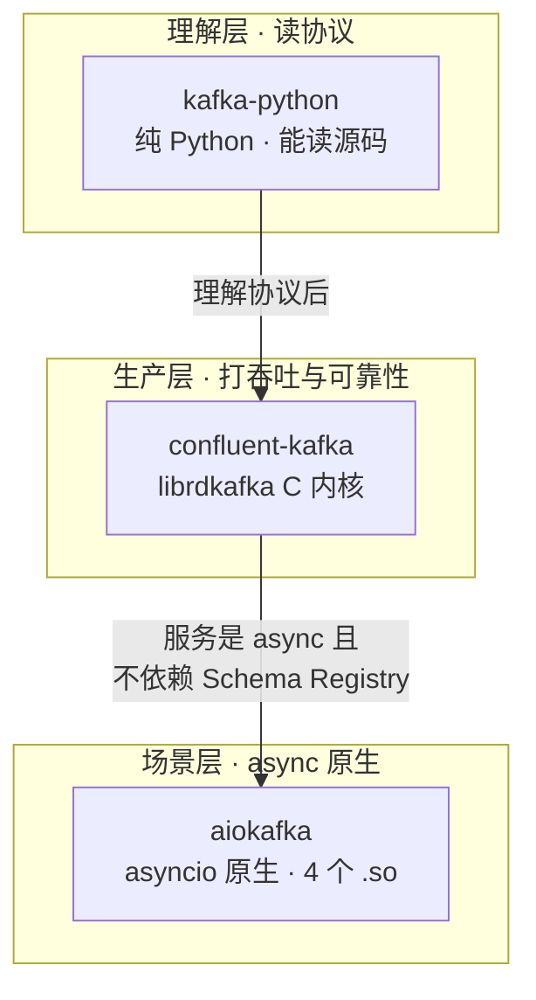
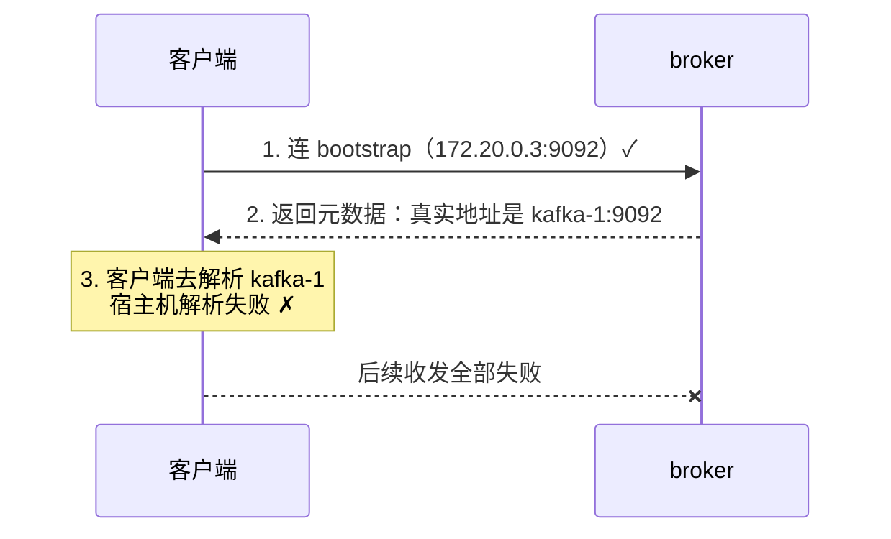

# 课 1 · 三库生态与实操环境

> 一句话：**先搞清楚 Python 圈里三个 Kafka 客户端到底是什么关系，再把能真跑通的环境立起来，最后学会证明"我真的连上了"**。

## 你将学到什么

- 三个库的真实关系与分工判据（不是"哪个快"，而是"哪层的教学/工程目的由谁承担"）
- 用 `uv` + 容器搭一套可复现的实操环境
- 一套**六层连通性自检**方法：从 DNS 一路验到真实收发
- 为什么"TCP 连上了"不等于"Kafka 能用"（advertised.listeners 坑）

## 先修

- [主教程课 9：代码开发实战](../../../stages/4-实战与架构落地/lessons/lesson-09-代码开发实战.md)：已经能发消息收消息
- 一台装了 Docker 的机器（本机为 WSL Ubuntu + Docker）

---

## 一、Python 的 Kafka 客户端生态：不是三个并列选项

你搜"Python Kafka 客户端"，会看到三个名字反复出现：`kafka-python`、`confluent-kafka`、`aiokafka`。网上的说法通常是"confluent 快 7 倍""kafka-python 停更了用 ng 代替"。

先看实测数据，再下结论。以下全部从 PyPI 现场拉取（2026-09-21）：

| 库 | 最新版 | 发布时间 | 距今 | wheel 类型 | 内核 |
|---|---|---|---|---|---|
| `kafka-python` | 3.0.11 | 2026-08-16 | 36 天 | `any` | **纯 Python，无 .so** |
| `kafka-python-ng` | 2.2.3 | 2024-10-02 | **719 天** | `any` | 纯 Python，无 .so |
| `confluent-kafka` | 2.15.1 | 2026-09-10 | 11 天 | `manylinux_2_28` / `win_amd64` | **C 扩展**（`cimpl.*.so`） |
| `aiokafka` | 0.14.0 | 2026-04-29 | 145 天 | `manylinux2014` / `win_amd64` | **C 扩展**（4 个 `.so`） |

> 🔴 **第一个反直觉结论**：`kafka-python` **没有停更**。它 2026-07-21、08-04、08-16 连发三个版本（3.0.9 → 3.0.10 → 3.0.11），比 `kafka-python-ng`（停在 2024-10-02）活跃得多。
> "kafka-python 停更了，改用 ng" 这个流传很广的说法，**在 2026-08 之后已经过期**。

> 🔴 **第二个反直觉结论**：`aiokafka` **不是纯 Python**。它有 4 个编译产物（`memory_records`、`legacy_records`、`default_records`、`cutil` 的 `.so`）。很多人以为它是"纯 Python 的异步版 kafka-python"，实际它在记录解析路径上用了 C 加速。

### 三库不是并列关系，是分层关系

把它们当成"三个竞品"就选错了。真实关系是**分层承担不同价值**：



| 层 | 库 | 不可替代的价值 | 本线课程 |
|---|---|---|---|
| 理解层 | `kafka-python` | 纯 Python，**唯一能读源码**，把协议细节摊开 | 课 4、5、6 |
| 生产层 | `confluent-kafka` | librdkafka C 内核；高吞吐、事务 EOS、Schema Registry 独占 | 课 7、8、9、10 |
| 场景层 | `aiokafka` | 仅在 async 原生且不依赖 Schema Registry 时才是正解 | 课 11 |

这个分工顺带解决一个矛盾：**源码解析是本线最大差异化价值，而 confluent 是 C 扩展读不了源码**。分工后由 kafka-python 独占承担，两边不打架。

### ⚠️ 一个必须知道的静默坑：两库 namespace 冲突

`kafka-python` 和 `kafka-python-ng` 的 **import name 都是 `kafka`**。实测后果：

```text
先装 kafka-python-ng 2.2.3：
  pip list  →  kafka-python-ng 2.2.3
  import kafka.__version__  →  3.0.11   ← 版本号串了

再装 kafka-python 3.0.11（两库共存）：
  pip install 退出码 = 0              ← pip 不报错
  pip list  →  两个都在
  import kafka  →  取决于安装顺序
```

**pip 不报错、退出码 0，但你 `import kafka` 拿到的库可能不是你以为的那个。** 这也解释了为什么前面修主教程时，`commitSync` 在两个库下都不存在——排查问题时如果连"当前 import 的是哪个库"都不确定，结论就不可信。

> 判据：**同一环境里只装一个**。本线统一用 `kafka-python` 3.0.11。

---

## 二、实操环境：为什么必须跑在容器里

### 先说结论

**必须把 Python 客户端跑在 `stage6-observability_kafka-net` 这个 Docker 网络里。** 宿主机直连会失败，而且失败得很隐蔽——TCP 能连上。

### 反证：宿主机视角实测

从 WSL 宿主机实测（2026-09-21）：

```text
127.0.0.1:9092    ✓ TCP 可连
172.20.0.3:9092   ✓ TCP 可连      ← 网桥 IP 通了
kafka-1:9092      ✗ DNS 解析失败  ← 卡在这里
```

再看 broker 自己广播的地址（`describe_cluster()` 实测输出，注意它返回的是 **dict** 不是对象）：

```text
cluster_id    = 5L6g3nShT-eMCtK--X86sw
controller_id = 3                    ← 这个值会漂移，你看到的可能不同
  broker 1: kafka-1:9092
      ↑ 广播的是主机名（kafka-1）而非 IP
        客户端所在环境必须能解析 kafka-1，否则后续收发必失败
  broker 2: kafka-2:9092
  broker 3: kafka-3:9092
```

> ℹ️ `controller_id` 是**动态值**：controller 会在 broker 间漂移。我两次实测分别拿到 `3` 和 `2`。**看 broker 列表的 `host` 字段即可，controller 是谁不重要。**

> 🔴 **API 坑**：`describe_cluster()` 返回 **dict**，键是 `broker_id` / `host` / `port`（不是 `nodeId`）。我第一版按对象属性写，实测返回 `?`；枚举真实结构后才拿到上面这些值。
> 判据：**拿不准返回结构时先打印原始对象**（`json.dumps(..., default=str)`），别猜属性名——这正是本线评审清单第 11 项的要求。

**根因清楚了**：broker 的 `advertised.listeners` 广播的是**容器主机名** `kafka-1:9092`，不是 IP。



所以：**第 1 步能连上不代表能用**，卡在第 3 步。

### 环境搭建（`uv` + 容器）

本线用 `uv` 管理虚拟环境，跑在容器内。原因：宿主机无 Python 3.12，且必须在容器网络里。

`uv` 版本实测：`uv 0.12.17`。

```bash
# 1. 进容器（关键：--network 必须指定）
docker run --rm -it --network stage6-observability_kafka-net \
  -v "$PWD:/app" python:3.12-slim bash

# 2. 装 uv 并建虚拟环境
pip install -q uv
uv venv /app/.venv
export VIRTUAL_ENV=/app/.venv
export PATH="/app/.venv/bin:$PATH"

# 3. 装客户端（三库可共存，实测通过）
uv pip install kafka-python==3.0.11 confluent-kafka==2.15.1 aiokafka==0.14.0
```

实测三库可同时导入（`kafka` 3.0.11 / `confluent_kafka` 2.15.1 / `aiokafka` 0.14.0）——注意 **confluent 和 aiokafka 没有 namespace 冲突**，冲突只发生在 kafka-python 与 kafka-python-ng 之间。

速度实测（同一库、同一环境）：

```text
pip     install kafka-python==3.0.11   real 1.594s
uv pip  install kafka-python==3.0.11   real 0.731s
```

`uv` 约快一倍，且依赖解析更严格。本线固定用它。

> 本线的 [`Dockerfile`](../../assets/bench/Dockerfile) 与 [`pyproject.toml`](../../assets/bench/pyproject.toml) 已把上述环境固化，可直接构建复用。

---

## 三、六层连通性自检：证明"我真的连上了"

很多人以为连通性就是"能 ping 通"。下面六层，任何一层挂了后面的都白搭。脚本见 [`verify_connectivity.py`](../../assets/bench/verify_connectivity.py)。

### 第 1–3 层：DNS → IP 归并 → TCP

实测输出：

```text
=== 第 1 层：DNS 解析 ===
  kafka-1        → 172.20.0.3
  kafka-2        → 172.20.0.5
  kafka-3        → 172.20.0.4
  l15-kafka-1    → 172.20.0.3
  l15-kafka-2    → 172.20.0.5
  l15-kafka-3    → 172.20.0.4

=== 第 2 层：IP 归并（谁和谁是同一台） ===
  172.20.0.3  kafka-1, l15-kafka-1   ← 同一容器的多个别名
  172.20.0.4  kafka-3, l15-kafka-3   ← 同一容器的多个别名
  172.20.0.5  kafka-2, l15-kafka-2   ← 同一容器的多个别名

=== 第 3 层：TCP 连通（9092） ===
  kafka-1:9092  ✓ TCP 可连
  kafka-2:9092  ✓ TCP 可连
  kafka-3:9092  ✓ TCP 可连
```

第 2 层很实用：**`kafka-N` 和 `l15-kafka-N` 是同一批容器的两个别名**（解析到相同 IP）。排查"我连的到底是哪个集群"时，这一步能直接拆穿错觉。

### 第 4 层：Kafka 协议握手

```text
=== 第 4 层：Kafka 协议握手 ===
  ✓ 握手成功，topic 数 = 3
    ['__consumer_offsets', 'acl-deny-demo', 'sec-ops-demo']
```

TCP 通 ≠ 协议握手通。这一步才能证明 broker 活着且能响应 Kafka 协议。

### 第 5 层：advertised.listeners 真相

就是前面那段 JSON。**看 `host` 字段是主机名还是 IP**——如果是主机名，客户端所在环境必须能解析它。

### 第 6 层：真实收发（最能说明问题）

```text
=== 第 6 层：真实收发 ===
  建 topic l1-connectivity-check
  ✓ 发送成功 partition=0 offset=0
  ✓ 收到：hello-lesson1 (p0@0)
  共收到 1 条 → 收发链路完整 ✓
  已清理 l1-connectivity-check
```

**只有走到这一步，才叫"连上了"。** 前五层全绿但第六层挂掉的情况很常见（权限、advertised 地址、topic 不存在等）。

> ⚠️ 自检脚本用完即删自建 topic，不污染集群。这是本线的卫生纪律。

---

## 四、一句话记住

> **三个库是分层不是竞品**：理解协议用 `kafka-python`（能读源码）、打吞吐用 `confluent-kafka`（C 内核）、async 服务用 `aiokafka`。环境必须跑在容器网络里，因为 broker 广播的是容器主机名；连通性自检要走完六层，**TCP 通了不算，能收发才算**。

## 常见误区

| 误区 | 真相 |
|---|---|
| "kafka-python 停更了，用 kafka-python-ng" | 已过期。kafka-python 2026-08-16 发了 3.0.11；ng 停在 2024-10-02 |
| "aiokafka 是纯 Python 的异步版" | 不是。它有 4 个 `.so`（记录解析用 C 加速） |
| "ping 通 / TCP 连上就是能用了" | 不够。broker 返回 `kafka-1:9092`，客户端解析不了就全挂 |
| "两个库都装上有备无患" | kafka-python 与 ng 的 import name 都是 `kafka`，pip 不报错但 import 结果不确定 |
| "confluent 比 kafka-python 快，所以全用 confluent" | 分工问题不是快慢问题。confluent 是 C 扩展，讲不了协议细节 |

## 本课实测资产

| 脚本 | 用途 |
|---|---|
| [`verify_lib_ecosystem.py`](../../assets/bench/verify_lib_ecosystem.py) | 从 PyPI 拉三库真实元数据（版本/时间/wheel 类型） |
| [`verify_so_files.py`](../../assets/bench/verify_so_files.py) | 检查三库是否含编译产物 `.so` |
| [`verify_namespace_conflict.py`](../../assets/bench/verify_namespace_conflict.py) | 验证两库 namespace 冲突 |
| [`verify_connectivity.py`](../../assets/bench/verify_connectivity.py) | 六层连通性自检 |
| [`verify_host_vs_container.py`](../../assets/bench/verify_host_vs_container.py) | 反证：宿主机直连为什么不行 |
| [`Dockerfile`](../../assets/bench/Dockerfile) / [`pyproject.toml`](../../assets/bench/pyproject.toml) | 固化环境 |

## 下一步

- 课 2：三库横评与 API 对照 —— 换库时哪些 API 会静默崩（`commitSync()` 那类）

## 导航

- ⬆️ 返回：[阶段 1 概览](./overview.md) · [课程目录](../../02-课程目录.md)
- 📖 进度：[00-学习档案](../../00-学习档案.md)
- 🔗 先修：[主教程课 9](../../../stages/4-实战与架构落地/lessons/lesson-09-代码开发实战.md)
