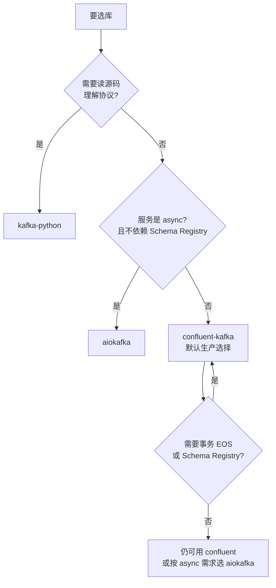

# 课 2 · 三库横评与 API 对照

> 一句话：**换库时哪些 API 会静默崩、哪些默认值会静默变，以及怎么用一套方法把它们提前挖出来**。

## 你将学到什么

- 三库 API 存在性矩阵：哪些方法只有部分库有（换库必崩）
- 换库陷阱的**真实报错样貌**（学员排查时能认出来）
- 配置项**默认值的核验方法**（每个库入口不同，本课最有复用价值的方法论）
- 版本兼容矩阵与选型决策

## 先修

- [课 1：三库生态与实操环境](./课1-三库生态与实操环境.md)：环境已立住、能连通

---

## 一、API 存在性矩阵：换库时哪里会崩

上一课埋了个伏笔：主教程里出现过 `commitSync()`，那是 Java 命名。现在把它放到三库里一起看。

实测方法：`hasattr(类, 方法名)`。以下为 Consumer 侧交叉对比（2026-09-21 实测，三库装在同一环境）：

| API | kafka-python | confluent | aiokafka | 备注 |
|---|:---:|:---:|:---:|---|
| `subscribe` / `assign` / `poll` / `commit` | ✓ | ✓ | ✓* | *aiokafka 无 `poll`，用 `getone`/`getmany` |
| `seek` / `position` / `committed` / `pause` / `resume` | ✓ | ✓ | ✓ | 三库一致 |
| `close` | ✓ | ✓ | **✗** | aiokafka 用 `stop()` |
| `seek_to_beginning` / `seek_to_end` | ✓ | **✗** | ✓ | confluent 用 `seek()` + watermark |
| `beginning_offsets` / `end_offsets` | ✓ | **✗** | ✓ | confluent 用 `get_watermark_offsets()` |
| `topics` / `partitions_for_topic` / `subscription` | ✓ | **✗** | ✓ | confluent 用 `list_topics()` |
| `commitSync` / `commitAsync` | **✗** | **✗** | **✗** | **三库全无，纯 Java 命名** |

> 🔴 **`commitSync` / `commitAsync` 在三个库里一个都不存在（0/3）**。这不是"某库的方言"，是**把 Java API 名字直接搬过来**了。这就是上一轮修主教程时那个坑的根因。

### Producer 侧最大的坑：`send` vs `produce`

```text
kafka-python · KafkaProducer   有 send()     ✗ 无 produce
confluent    · Producer        有 produce()  ✗ 无 send
aiokafka     · AIOKafkaProducer 有 send() / send_and_wait()
```

实测报错原文（confluent 上调 `commitSync`）：

```text
AttributeError: 'cimpl.Consumer' object has no attribute 'commitSync'
```

### 为什么这类坑危险

它不是"跑不起来"，而是**代码看着对、语法没问题、IDE 还可能自动补全出来**，直到运行到那一行才炸。更糟的是有些差异**根本不报错**（见第三节的 `acks` 默认值）。

---

## 二、替代 API 实测：不能只列名字，要真跑

光知道"没有 `seek_to_beginning`"没用，得知道**用什么替代、替代写法真能跑**。以下全部实测通过。

### confluent：`seek_to_beginning` 的替代

```python
from confluent_kafka import TopicPartition

parts = cfc.assignment()                      # 拿到分配
lo, hi = cfc.get_watermark_offsets(parts[0])  # (low, high)
cfc.seek(TopicPartition(parts[0].topic, parts[0].partition, lo))
```

实测输出：

```text
assignment: [TopicPartition{topic=l2-api-verify,partition=0,offset=-1000,...}]
get_watermark_offsets(l2-api-verify,0) → (low=0, high=1)
✓ seek(low=0) 成功 → 这就是 seek_to_beginning 的替代
```

`get_watermark_offsets` 一次返回 `(low, high)`，**同时替代了** `beginning_offsets` 和 `end_offsets` 两个方法。

### aiokafka：生命周期与拉取

```python
c = AIOKafkaConsumer(TOPIC, bootstrap_servers=BS, group_id="...")
await c.start()      # 不是 new，要显式 start
m = await c.getone() # 不是 poll()
await c.stop()       # 不是 close()
```

实测：`✓ getone 收到 ... (p0@0)`、`✓ 发送成功`、`✓ stop 正常`。

### 三库发送/消费的最小对照

| 动作 | kafka-python | confluent | aiokafka |
|---|---|---|---|
| 创建 | `KafkaProducer(...)` | `Producer({...})` | `AIOKafkaProducer(...)` + `await start()` |
| 发送 | `send()` + `flush()` | `produce()` + `flush()` | `send_and_wait()` |
| 创建消费者 | `KafkaConsumer(...)` | `Consumer({...})` | `AIOKafkaConsumer(...)` + `await start()` |
| 消费 | `poll()` | `consume()` / `poll()` | `getone()` / `getmany()` |
| 关闭 | `close()` | `close()` | `await stop()` |

---

## 三、⚠️ 静默差异：默认值不一样，且不报错

这一节是整课最该记住的。**API 缺失会 `AttributeError`，你会立刻发现；默认值不同则完全静默。**

### 实测：三库默认值对照

```text
配置                          kafka-python      aiokafka
─────────────────────────────────────────────────────────
acks                          -1 (all)          _missing 哨兵 → 实际 1
enable.idempotence            True              False          ← 完全不同
max.poll.records              500               None
session.timeout.ms            45000             10000
auto.offset.reset             'latest'          'latest'
enable.auto.commit            True              True
auto.commit.interval.ms       5000              5000
heartbeat.interval.ms         3000              3000
isolation.level               'read_uncommitted' 'read_uncommitted'
```

### 🔴 最危险的一条：`enable.idempotence` 默认相反

- `kafka-python`：**True**
- `aiokafka`：**False**

```python
# aiokafka/producer/producer.py
if enable_idempotence:
    if acks is _missing:
        acks = -1        # 幂等时才是 all
else:
    ...
    if acks is _missing:
        acks = 1         # 非幂等时只等 leader
```

**后果**：同一段 producer 逻辑，从 kafka-python 换到 aiokafka，可靠性语义从「全副本确认 + 幂等」**降成**「仅 leader 确认、无幂等」，而**代码不报任何错**。

> 这是本课的核心警示：**API 缺失是明坑（报错），默认值差异是暗坑（静默）**。明坑好修，暗坑要命。

### confluent 的特殊性

confluent 的配置**不进函数签名**（用 `**kwargs` 透传给 librdkafka），所以既查不到默认值，实例上也不暴露 `.conf`。

实测可用的核验方法 —— **传非法值反推 key 是否合法**：

```python
Producer({"bootstrap.servers": BS, "acks": "__INVALID__"})
# 若报 "No such configuration property" → key 名写错
# 若报别的错（值非法）                  → key 合法
```

实测 12 个常用 key（`acks`、`enable.idempotence`、`auto.offset.reset` 等）**全部合法**，说明 confluent 接受标准 librdkafka 命名（点分，不是 Python 下划线）。

---

## 四、配置项默认值核验方法（本课最有复用价值的部分）

**不要相信文档，直接读运行时的默认值。** 但每个库入口不同——我在写这课时连踩 4 个坑，把坑本身也给你：

| 版本 | 我猜的方法 | 实际结果 |
|---|---|---|
| v1 | `Producer.conf.get("acks")` | ❌ `cimpl.Producer` 无 `.conf` 属性 |
| v2 | `from kafka.consumer.kafka import DEFAULT_CONFIG` | ❌ 模块不存在（正确是 `kafka.consumer.group`） |
| v3 | `inspect.signature(KafkaProducer.__init__)` | ❌ 用 `**kwargs` 收配置，签名查不到 |
| v4 | 找模块级 dict | ❌ `DEFAULT_CONFIG` 是**类属性**不是模块级 |
| **v5** | **`KafkaProducer.DEFAULT_CONFIG`** | ✅ 55 项 producer / 65 项 consumer |

### 三库各自的入口（记住这张表）

| 库 | 默认值入口 | 示例 |
|---|---|---|
| `kafka-python` | **类属性** `DEFAULT_CONFIG` | `KafkaProducer.DEFAULT_CONFIG['acks']` |
| `aiokafka` | 函数签名 `inspect.signature` | `inspect.signature(AIOKafkaProducer.__init__).parameters['acks'].default` |
| `confluent-kafka` | **不暴露**（透传 librdkafka） | 只能"传非法值反推 key"，默认值需查 librdkafka 文档 |

源码位置（供你验证）：`kafka/producer/kafka.py:405`、`kafka/consumer/group.py:299`。

> 💡 **方法论沉淀**：拿不准对象结构时，**先 `dir()` / `inspect.getsource()` 探明，再取值**——不要猜属性名。这条在本课救了我 4 次，也是本线评审清单第 11 项的要求。

### 附：同一个库升版本也会变（3.0.11 的返回结构）

不只是换库，**升版本也会静默改行为**。写本课实测脚本时撞到的：

```python
# 老写法（很多教程这么写）—— 在 3.0.11 上会炸
fs = admin.create_topics([NewTopic(t, ...)])
for topic, fut in fs.items():
    fut.result()          # AttributeError: 'list' object has no attribute 'result'
```

实测 3.0.11 的真实返回是**结果对象，不是 Future 字典**：

```text
type = dict
{'topics': [{'name': 'l2-ret-probe', 'topic_id': '9edf...', 'error_code': 0, ...}]}
```

正确写法：

```python
fs = admin.create_topics([NewTopic(t, num_partitions=1, replication_factor=1)])
for item in fs["topics"]:
    if item.get("error_code") != 0:
        raise RuntimeError(f"{item['name']} 建失败: {item.get('error_message')}")
```

`delete_topics` 同构。**失败是静默的**——`error_code != 0` 不抛异常，你不检查就不知道没建成。

---

## 五、版本兼容矩阵与选型决策

### 本环境实测版本

```text
Broker      : apache/kafka:4.0.0（kafka_2.13-4.0.0.jar）
kafka-python: 3.0.11        （纯 Python）
confluent   : 2.15.1  librdkafka 2.15.1
aiokafka    : 0.14.0
```

三库对同一 4.0.0 集群**全部实测连通**，同 topic 连续写入成功（offset 0 → 1 → 2）：

```text
--- kafka-python ---   ✓ 发送成功 p0@0
--- confluent-kafka --- ✓ 投递成功 p0@1
--- aiokafka ---        ✓ 发送成功 p0@2
```

### 选型决策树



### 一句话判据

> **默认选 `confluent-kafka`**（生产级、吞吐、事务、Schema Registry 独占）；**要读源码讲协议用 `kafka-python`**；**服务本身 async 且不需要 Schema Registry 才用 `aiokafka`**。

### 换库检查清单（本课交付物）

换库前逐条过，能挡住 90% 的静默坑：

1. `send()` / `produce()` 发送方法名对不对
2. Consumer 生命周期：`close()` 还是 `stop()`，要不要 `start()`
3. 拉取方法：`poll()` / `consume()` / `getone()`
4. 位移查询：`beginning_offsets()` 还是 `get_watermark_offsets()`
5. **`enable.idempotence` 默认值**（kafka-python `True` vs aiokafka `False`）
6. **`acks` 实际生效值**（aiokafka 是哨兵，跟随幂等）
7. 配置命名风格：点分（`enable.auto.commit`）还是下划线（`enable_auto_commit`）

---

## 一句话记住

> **API 缺失会报错是明坑，默认值不同不报错是暗坑。** 换库前用 `hasattr` 查 API 存在性、用「类属性 `DEFAULT_CONFIG` / 签名 / 非法值反推」查默认值，别相信文档也别相信直觉。

## 常见误区

| 误区 | 真相 |
|---|---|
| "换个库，API 差不多" | Producer 发送方法就不同（`send` vs `produce`）；`commitSync` 三库全无 |
| "aiokafka 是 kafka-python 的 async 版，行为一样" | 默认 `enable.idempotence` 相反（True vs False），`acks` 语义也跟着变 |
| "默认值看文档就行" | confluent 的配置不进签名也不暴露实例属性；kafka-python 的 `DEFAULT_CONFIG` 是类属性，我找了 4 版才找对 |
| "confluent 和 kafka-python 配置名一样" | confluent 用点分 `enable.auto.commit`，Python 库用下划线 `enable_auto_commit` |
| "报错才能发现问题" | 最危险的是**不报错**的差异（静默降级） |

## 本课实测资产

| 脚本 | 用途 |
|---|---|
| [`verify_api_matrix.py`](../../assets/bench/verify_api_matrix.py) | 三库 API 存在性矩阵（`hasattr` 实测） |
| [`verify_api_surface.py`](../../assets/bench/verify_api_surface.py) | 列出三库真实公开方法面 |
| [`verify_api_mapping.py`](../../assets/bench/verify_api_mapping.py) | **替代 API 真跑通**（含 `commitSync` 报错原文） |
| [`verify_defaults5.py`](../../assets/bench/verify_defaults5.py) | 默认值核验最终版（类属性 `DEFAULT_CONFIG`） |
| [`verify_acks_source.py`](../../assets/bench/verify_acks_source.py) | `acks` 哨兵分支与静默降级结论 |
| [`verify_compat_matrix.py`](../../assets/bench/verify_compat_matrix.py) | 版本兼容矩阵 + 三库连通实测 |
| [`get_broker_version.sh`](../../assets/bench/get_broker_version.sh) | 查 broker 真实版本 |

## 下一步

- 课 3：AdminClient 与元数据治理 —— 不收发消息，只用代码管理集群

## 导航

- ⬅️ 上一课：[课 1 三库生态与实操环境](./课1-三库生态与实操环境.md)
- ⬆️ 返回：[阶段 1 概览](./overview.md) · [课程目录](../../02-课程目录.md)
- 📖 进度：[00-学习档案](../../00-学习档案.md)
