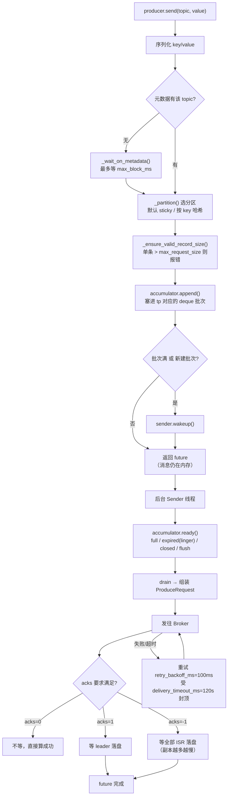

# 课 4 · 生产者内部机制

> 一句话：**`send()` 根本不发消息** —— 它只往内存里塞了一条记录，然后叫醒后台线程就返回了。

## 你将学到什么

- `send()` 的真实路径：累加器 → 唤醒 Sender → **立刻返回 future**
- 批次怎么攒、什么时候才算"可以发"（源码级四条件）
- **kafka-python 没有背压**（本课最反直觉的发现，附实测证据）
- acks / retries / 三个超时谁管什么，以及 **acks 的代价取决于副本数**

## 先修

- [课 3：AdminClient 与元数据治理](../1-环境与选型/课3-AdminClient与元数据治理.md)

---

## 一、`send()` 到底做了什么

### 源码说话：核心路径只有这几步

从 `kafka/producer/kafka.py` 的 `KafkaProducer.send()`（3.0.11，已剥离 docstring）：

```python
# 1. 序列化
key_bytes  = self._serialize(self.config['key_serializer'], topic, headers, key)
value_bytes = self._serialize(self.config['value_serializer'], topic, headers, value)

# 2. 等元数据（不是等发送！）
if self._metadata.partitions_for_topic(topic) is None:
    self._wait_on_metadata(topic, self.config['max_block_ms'])

# 3. 选分区
partition = self._partition(topic, partition, key, value, key_bytes, value_bytes)

# 4. 估算大小 + 校验单条上限
message_size = self._estimate_size_in_bytes(key_bytes, value_bytes, headers)
self._ensure_valid_record_size(message_size)

# 5. 【核心】塞进累加器 —— 就这一步，没有网络 I/O
result = self._accumulator.append(
    tp, timestamp_ms, key_bytes, value_bytes, headers,
    abort_on_new_batch=sticky_eligible)
future, batch_is_full, new_batch_created, abort_for_new_batch = result

# 6. 【核心】批次满了或新建了 → 叫醒 Sender
if batch_is_full or new_batch_created:
    self._sender.wakeup()

# 7. 立刻返回 future（消息还没发出去！）
return future
```

> 🔑 **本课第一结论**：`send()` 里**没有任何网络发送**。它做的是「序列化 → 选分区 → 塞累加器 → 叫醒 Sender → 返回 future」。
> 所以**`send()` 返回了，消息大概率还在内存里**。

### 累加器：每个分区一个批次队列

`kafka/producer/record_accumulator.py` 的 `append()`：

```python
with self._tp_lock(tp):
    dq = self._batches[tp]              # 每个 TopicPartition 一个 deque
    if dq:
        last = dq[-1]
        future = last.try_append(...)    # 优先塞进最后一批
        if future is not None:
            batch_is_full = len(dq) > 1 or last.records.is_full()
            return future, batch_is_full, False, False
    # 塞不进去（批次满了）→ 新建一批
    records = MemoryRecordsBuilder(
        self.config['message_version'],
        self.config['compression_attrs'],
        self.config['batch_size'])       # 默认 16384 = 16KB
    batch = ProducerBatch(tp, records, now=now)
    future = batch.try_append(...)
    dq.append(batch)
    self._incomplete.add(batch)
    return future, batch_is_full, True, False
```

结构是 `dict[TopicPartition] -> deque[ProducerBatch]`。**同分区的消息进同一批**，所以 batch 是压缩和吞吐的基本单位。

### 什么时候批次才算"可以发"

`RecordAccumulator.ready()` —— 源码里这段是整个发送节奏的开关：

```python
retry_backoff = self.config['retry_backoff_ms'] / 1000
linger = self.config['linger_ms'] / 1000
backing_off = bool(batch.attempts > 0
                   and (batch.last_attempt + retry_backoff) > now)
waited_time = now - batch.last_attempt
time_to_wait = retry_backoff if backing_off else linger
time_left = max(time_to_wait - waited_time, 0)
full = bool(len(dq) > 1 or batch.records.is_full())
expired = bool(waited_time >= time_to_wait)

sendable = (full or expired or self._closed or self.flush_in_progress())
```

**四选一，满足任一就发：**

| 条件 | 含义 |
|---|---|
| `full` | 批次满了（16KB 或后面还排着队） |
| `expired` | `linger_ms` 等到了（默认 0 ⇒ 立刻过期 ⇒ 来一条发一条） |
| `_closed` | producer 在关闭，赶紧发完 |
| `flush_in_progress()` | 有人在 `flush()` |

> 💡 **`linger_ms` 默认值是 `0`** —— 这意味着默认行为是"攒满 16KB 或立即发"，实际几乎每条一个请求。想提吞吐要**手动调大 `linger_ms`**（典型 5~100ms）。

---

## 二、背压：kafka-python 其实没有

这是本课最反直觉、也最有价值的一节。

### Java 客户端有 BufferPool，kafka-python 没有

Java 的 `KafkaProducer` 有 `BufferPool`：`buffer.memory` 默认 32MB，**内存耗尽时 `send()` 会阻塞**，最多等 `max.block.ms`，超时抛 `TimeoutException`。这是标准背压。

我按这个印象去 kafka-python 找，结果发现：

```python
>>> KafkaProducer.DEFAULT_CONFIG['buffer_memory']
None                      # ← 不是 32MB，是 None

>>> KafkaProducer(bootstrap_servers=BS, buffer_memory=1)
ValueError: Unrecognized configs: {'buffer_memory': 1}      # ← 传了直接报错
```

**不是"不生效"，是"根本不认识这个配置"**。

### 全包搜索的证据

```text
=== record_accumulator.py 里搜 buffer_memory ===
  （根本没出现）

=== 整个 kafka 包搜 BufferPool / buffer_memory ===
  只找到 6 处，且全是 EncodeBufferPool：
    protocol/api_message.py:223:  with EncodeBufferPool.acquire() as out:
    protocol/schemas/fields/codecs/encode_buffer.py:70: class EncodeBufferPool:
  → EncodeBufferPool 是「协议编码用的字节缓冲池」，跟生产者内存背压毫无关系
```

`RecordAccumulator` 的方法里只有一个 `deallocate(batch)`，而它**只是把 batch 从 `_incomplete` 集合移除**，不归还任何内存池。

### 实测：无界 send 会不会被限制

```python
p = KafkaProducer(bootstrap_servers=BS, linger_ms=60000, max_block_ms=5000)
for i in range(20000):
    p.send(T, b"y" * 500)      # 约 9.5 MB
```

实测输出：

```text
起始 RSS = 30.0 MB
  send   5000 条后 RSS = 32.8 MB (Δ+2.8)
  send  10000 条后 RSS = 34.5 MB (Δ+4.5)
  send  15000 条后 RSS = 36.2 MB (Δ+6.2)
send 20000 条 × 500B（约 9.5 MB）用时 1.93s
结束 RSS = 37.6 MB（Δ+7.7 MB）
→ 数据全在内存里，没有任何阻塞/拒绝 ⇒ 无背压上限
```

20000 条全部吞进去，**1.93 秒完成，零阻塞零报错**。

> 🔴 **生产影响**：kafka-python **不会因为缓冲区满而阻塞你的 `send()`**。如果 Sender 线程跟不上（Broker 慢/网络差），内存会一直涨直到 OOM。
> **要自己限流**：用信号量 / 有界队列控制并发，或监控 `_accumulator` 的未完成批次。

### ⚠️ 源码注释与实现不一致

`max_block_ms` 的 docstring 写着：

```text
max_block_ms (int): Number of milliseconds to block during
  send() and partitions_for(). These methods can be blocked
  either because the buffer is full or metadata unavailable.
```

"buffer is full" 这句是**从 Java 客户端照搬的注释**，但 kafka-python 里 `max_block_ms` **只用于等元数据**（`_wait_on_metadata`），没有任何等内存的代码路径。

> 这印证了旧笔记里"commitSync 是 Java 写法"的教训：**kafka-python 的注释/文档有大量 Java 遗留**，不能全信。

### 唯一的尺寸防线：单条上限

```python
def _ensure_valid_record_size(self, size):
    if size > self.config['max_request_size']:
        raise Errors.MessageSizeTooLargeError(...)
```

实测（默认 `max_request_size=1048576`）：

```text
send 1MB+100B 的消息
→ MessageSizeTooLargeError: [Error 10] The message is 1048764 bytes
  when serialized which is larger than the maximum request size
```

**只拦单条，不拦总量。**

---

## 三、acks、重试与超时链路

### 默认值实测

```python
DEFAULT_CONFIG['acks']                = -1        # 等所有 ISR
DEFAULT_CONFIG['retries']             = inf       # 无限？见下
DEFAULT_CONFIG['delivery_timeout_ms'] = 120000    # 120 秒封顶
DEFAULT_CONFIG['request_timeout_ms']  = 30000
DEFAULT_CONFIG['max_block_ms']        = 60000
DEFAULT_CONFIG['retry_backoff_ms']    = 100
DEFAULT_CONFIG['linger_ms']           = 0
DEFAULT_CONFIG['batch_size']          = 16384
```

### `retries=inf` 不是"无限"

**真正决定一条消息能活多久的是 `delivery_timeout_ms`（120s）**，`retries` 只是不限次数。超过 120 秒还没发出去就失败。

三者分工：

| 超时 | 管什么 | 触发后果 |
|---|---|---|
| `max_block_ms` (60s) | **等元数据**（`_wait_on_metadata`）；~~等内存~~（kafka-python 无此项） | `KafkaTimeoutError` |
| `request_timeout_ms` (30s) | **单次请求**等 Broker 响应的时间 | 该批次重试 |
| `delivery_timeout_ms` (120s) | **一条消息从 `send()` 到最终成功/失败的总寿命** | 最终失败 |

关系：`delivery_timeout_ms` 是总闸门，`request_timeout_ms` 是单轮上限，`retries` 只是允许重试多少轮。

### 🎯 acks 的代价取决于副本数（实测反转）

**这是本节最容易被误导的地方。**

我第一次测，rf=1 的 topic：

```text
acks    说明                    100条耗时    单条均值
0       不等确认                  108.4ms    1.08ms
1       等 leader 落盘            109.5ms    1.09ms
-1      等所有 ISR 落盘            104.6ms    1.05ms     ← 几乎没差别！
```

看起来 acks 完全不影响性能？**错** —— 因为 `replication_factor=1`，ISR 里只有 leader 自己，`acks=-1` 和 `acks=1` 是**等价**的。

用 `replication_factor=3` 重测（ISR 实测 `[3, 1, 2]`；每档 5 轮 × 200 条，取中位数）：

```text
partition 0: leader=3 replicas=[3, 1, 2] isr=[3, 1, 2]

  acks=0   不等确认      中位 0.0229ms  范围 [0.0199, 0.0329]
  acks=1   等 leader     中位 0.0381ms  范围 [0.0316, 0.0437]
  acks=-1  等全部 ISR    中位 0.0503ms  范围 [0.0408, 0.0694]

倍率（中位数）：
  acks=-1 / acks=0 = 2.19×   区间 [1.24×, 3.49×]
  acks=-1 / acks=1 = 1.32×   区间 [0.93×, 2.20×]
```

> ⚠️ **数值浮动如实说明**：本机是单机上的 3 节点容器集群（副本间几乎无网络延迟），倍率抖动很大。首轮单次测量曾得 188%，复验只有 66%——**单次百分比不可复现，不能当结论**。
>
> 上面 5 轮取中位数后，**方向是稳定的**（`acks=-1` 最慢、`acks=0` 最快），但倍率只能给量级：`acks=-1` 约为 `acks=0` 的 **2 倍上下**（1.2~3.5 倍波动）。
>
> 特别注意 `acks=-1 / acks=1` 的**最乐观值是 0.93×（比 acks=1 还快）**——三副本同机时 ISR 同步成本极低，两者经常打平。真实跨机房部署才会稳定拉开差距。

> 🔑 **结论**：`acks=-1` 的代价 ≈ **等最慢的那个副本**，副本越多越慢。rf=1 时它不花钱（三档几乎无差），rf=3 时约为 `acks=0` 的 2 倍量级。

### 配套陷阱：`min.insync.replicas`

若 topic 设了 `min.insync.replicas=2`，而存活副本 < 2，`acks=-1` 的写入会被 Broker **拒绝**（`NotEnoughReplicasError`）。这是"可用性 vs 可靠性"的经典取舍——配了严格确认就别指望单机可用。

---

## 四、完整链路图



---

## 一句话记住

> **`send()` 不发消息**（只入内存 + 唤醒 Sender + 返 future）；**kafka-python 没有背压**（`buffer_memory` 传了直接 `ValueError`，无界 send 会一直吃内存直到 OOM，必须自己限流）；**acks 的代价由副本数决定**（rf=1 时 `acks=-1` 免费，rf=3 时约为 `acks=0` 的 2 倍量级）。

## 常见误区

| 误区 | 真相 |
|---|---|
| "`send()` 返回了消息就到 Broker 了" | 没有。`send()` 只 `accumulator.append()`，发不发看 Sender 线程和 `linger_ms` |
| "`buffer_memory` 能限制内存" | kafka-python **不认识这个配置**，传了 `ValueError: Unrecognized configs` |
| "缓冲区满了 `send()` 会阻塞" | 不会。Java 客户端才会。kafka-python 会一直吃内存直到 OOM |
| "`retries=inf` 就是永远重试" | 不是。受 `delivery_timeout_ms`（120s）封顶 |
| "acks 影响不大" | rf=1 时确实不大；rf=3 时 `acks=-1` 约为 `acks=0` 的 2 倍量级（单机集群波动 1.2~3.5 倍） |
| "源码注释说 buffer is full 就会阻塞" | 注释是从 Java 照搬的，kafka-python 实现里没有这条路 |

## 本课实测资产

| 脚本 | 用途 |
|---|---|
| [`dump_producer_source.py`](../../assets/bench/dump_producer_source.py) | 定位源码文件与 `send()` 原文 |
| [`dump_send_core.py`](../../assets/bench/dump_send_core.py) | `send()` 核心路径（去 docstring） |
| [`dump_accumulator.py`](../../assets/bench/dump_accumulator.py) | 批次累加（ast 精确剥离 docstring） |
| [`dump_backpressure.py`](../../assets/bench/dump_backpressure.py) | `ready()` 就绪四条件 + `run_once` |
| [`dump_backpressure2.py`](../../assets/bench/dump_backpressure2.py) | 默认值清单 + 定位背压位置 |
| [`dump_backpressure3.py`](../../assets/bench/dump_backpressure3.py) | **全包搜 BufferPool，证明不存在** |
| [`verify_backpressure.py`](../../assets/bench/verify_backpressure.py) | **无背压实测**（RSS 增长证据） |
| [`verify_acks_retry.py`](../../assets/bench/verify_acks_retry.py) | acks 三档 + 超时三兄弟 |
| [`verify_acks_rf3.py`](../../assets/bench/verify_acks_rf3.py) | **rf=3 下 acks 代价反转** |

## 下一步

- 课 5：消费者内部机制 —— Fetcher 与 poll 循环、再均衡、位移提交路径

## 导航

- ⬅️ 上一课：[课 3 AdminClient 与元数据治理](../1-环境与选型/课3-AdminClient与元数据治理.md)
- ⬆️ 返回：[阶段 2 概览](./overview.md) · [课程目录](../../02-课程目录.md)
- 📖 进度：[00-学习档案](../../00-学习档案.md)
