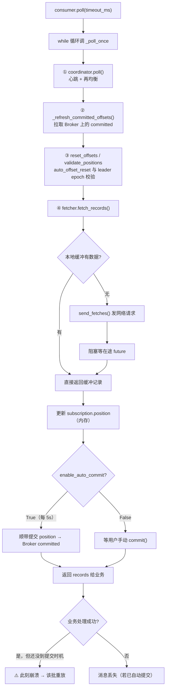

# 课 5 · 消费者内部机制

> 一句话：**消费进度存在两个地方** —— 内存里的 `position` 和 Broker 上的 `committed`；只有 `committed` 能活过崩溃，这个错位就是重复消费的全部来源。

## 你将学到什么

- `poll()` 一次到底做了哪五件事（源码级）
- Fetcher 怎么拉数据、位移记在哪
- 再均衡与分区分配的真实过程（含一个**极易误判的观测陷阱**）
- **at-least-once 为什么会重复**（实测证据链，为课 6 铺垫）

## 先修

- [课 4：生产者内部机制](./课4-生产者内部机制.md)

---

## 一、`poll()` 一次到底做了什么

### 外层：一个 while 循环

`KafkaConsumer.poll()`（3.0.11，已剥离 docstring）：

```python
def poll(self, timeout_ms=0, max_records=None, update_offsets=True):
    if timeout_ms < 0:
        raise ValueError('Timeout must not be negative')
    if max_records is None:
        max_records = self.config['max_poll_records']      # 默认 500
    if self._closed:
        raise Errors.IllegalStateError('KafkaConsumer is closed')

    timer = Timer(timeout_ms)
    while not self._closed:
        records = self._poll_once(timer, max_records, update_offsets=update_offsets)
        if records:
            return records
        elif timer.expired:
            break
    return {}
```

外层没什么：反复调 `_poll_once`，有数据就返回，超时就退出。

### 内层：`_poll_once` 的五步

```python
def _poll_once(self, timer, max_records, update_offsets=True):
    # ①【先处理协调器】心跳 + 再均衡
    if not self._coordinator.poll(timeout_ms=timer.timeout_ms):
        return {}

    # ② 刷新已提交位移
    self._refresh_committed_offsets(timeout_ms=timer.timeout_ms)

    # ③ 位移重置 / KIP-320 leader epoch 校验
    self._fetcher.reset_offsets_if_needed()
    self._fetcher.maybe_validate_positions()
    self._fetcher.validate_offsets_if_needed()

    # ④【再拉数据】
    poll_timeout_ms = timer.timeout_ms
    if self.config['group_id'] is not None:
        poll_timeout_ms = min(poll_timeout_ms,
                              self._coordinator.time_to_next_poll() * 1000)
    records, idle = self._fetcher.fetch_records(
        max_records, update_offsets=update_offsets, timeout_ms=poll_timeout_ms)

    # ⑤ 空闲时 sleep，防止忙等
    if not records and idle and poll_timeout_ms > 0:
        poll_timeout_ms = min(poll_timeout_ms, self.config['retry_backoff_ms'])
        time.sleep(poll_timeout_ms / 1000)
    return records
```

> 🔑 **本课第一结论**：`poll()` **先管协调器（心跳/再均衡），再拉数据**。
> 这解释了那个经典问题——"为什么我长时间不调用 `poll()` 就被踢出消费者组？"
> 因为心跳和再均衡**都挂在 `poll()` 上**。`poll()` 不调用， coordinator 就得不到执行机会。

### Fetcher：数据从哪来

`Fetcher.fetch_records()` 的核心逻辑：

```python
# 1. 先排空上次拉回来还没消费完的缓冲
records, partial = self.fetched_records(max_records, update_offsets=update_offsets)
if not partial:
    # 2. 缓冲空了，才发下一批 fetch 请求
    self.send_fetches()
if records:
    return records, False
# 3. 还没数据 → 阻塞等待在途请求完成
...
self._net.run(self._manager.wait_for, wakeup, timeout_ms)
records, _ = self.fetched_records(max_records, update_offsets=update_offsets)
```

**关键**：`poll()` 返回的数据**多数时候来自本地缓冲**，不是每次都发网络请求。Fetcher 提前预取，消费者从缓冲里拿。

### 位移记在哪：消费端内存

在 `fetcher.py` 里定位到位移更新点（L582）：

```python
self._subscriptions.assignment[tp].position = OffsetAndMetadata(...)
```

> **`position` 是纯内存状态**，存在 `SubscriptionState` 里。进程一死就没了。

---

## 二、位移提交：两个进度，只有一个活得下来

### 实测：消费了，但 Broker 不知道

```python
c = KafkaConsumer(T, ..., enable_auto_commit=False, max_poll_records=5)
for msg in c:
    got.append(msg.value)
    if len(got) >= 10:
        break
print(f"position  = {c.position(tp)}")     # 10
print(f"committed = {c.committed(tp)}")    # None
```

实测输出：

```text
消费到 10 条: ['msg-00', 'msg-01', 'msg-02'] ... ['msg-08', 'msg-09']
position（消费端内存）  = 10
committed（Broker 记录）= None
→ 消费了 10 条，但 Broker 完全不知道
```

### 关掉再开：原样重放

```text
又消费 10 条（重放！说明上一步没提交）
commit() 之后 committed = 10
```

**同一批消息被消费了两次** —— 这就是 at-least-once 的重复，现场抓到。

### 自动提交：按时间触发，与"处理完"无关

默认 `enable_auto_commit=True`、`auto_commit_interval_ms=5000`。

```text
自动提交模式消费完，committed = 20
→ 提交时机由 auto_commit_interval_ms 决定，在 poll() 里顺带触发，
  跟你的业务是否处理完【没有任何关系】
```

> 🔴 **这是最容易踩的坑**：自动提交**不保证**"处理完才提交"。它只保证"每 5 秒提交一次当前 `position`"。
> 如果第 5 秒时你正处理到第 3 条，那前 2 条连同第 3 条的位移一起被提交——**第 3 条其实还没处理完**。

### 崩溃时间线

```text
t0  poll() 拿到 msg 0~9
t1  业务处理完 msg 0~4
t2  【进程崩溃】
    ├─ position（内存）= 10   ← 随进程一起没了
    └─ committed（Broker）= 0 ← 持久化，还在
t3  重启 → 从 committed=0 开始 → msg 0~9 全部重放
```

> 🔑 **本课核心结论**：消费进度存在两个地方，只有 `committed` 能活过崩溃。
> 两者的**差值就是重复消费的窗口**。

---

## 三、再均衡与分区分配

### 三种分配策略（全量列举确认）

```text
assignors 包内模块: ['abstract', 'range', 'roundrobin', 'sticky']
  range      -> RangePartitionAssignor       ← 默认
  roundrobin -> RoundRobinPartitionAssignor
  sticky     -> （模块内无 *Assignor 顶层类，需从子模块取）
```

监听器必须**继承**，不能鸭子类型：

```python
# ✗ 错：TypeError: listener must be a ConsumerRebalanceListener
class L:
    def on_partitions_revoked(self, revoked): ...

# ✓ 对
class L(ConsumerRebalanceListener):
    def on_partitions_revoked(self, revoked): ...
    def on_partitions_assigned(self, assigned): ...
```

### ⚠️ 观测陷阱：本地 `assignment()` 会骗你

这是本课**最容易被误导**的地方，我踩了两轮。

**第一版**：单进程内创建 4 个 `KafkaConsumer`，逐个加入，读 `assignment()`：

```text
4 个消费者: ((0, 1), (3,), (1,), (3,))  收敛=False
C4 反复 revoked=[3] → assigned=[3] 无限循环
```

看起来像"分区 3 被两个消费者同时持有，分区 0 无人管"——**这在 Kafka 里不可能发生**。

**根因**：`consumer.assignment()` 返回的是**本地视图**，而再均衡是**多成员协作的异步过程**。在收敛之前读它，看到的是中间态：有人已 revoke、有人还没 assign。

另一个叠加因素：`consumer_timeout_ms=8000` 会让消费者**超时自动退出组**，触发反复再均衡（去掉后抖动消失）。

**正确做法**：跑**独立进程**，并**等到真正收敛**（连续 12 秒分配不变）再判定。实测：

```text
FINAL#1 assignment=(0,) converged=True elapsed=25.2s
FINAL#2 assignment=(1,) converged=True elapsed=25.1s
FINAL#3 assignment=(2,) converged=True elapsed=18.5s
FINAL#4 assignment=(3,) converged=True elapsed=16.0s

严格判定（恰好 4 分区且无重复）: True
```

**收敛轨迹**（每 10 秒采样一次）—— 中间态看得一清二楚：

```text
TRACE#1=[(0.2s, (0,1,2,3)), (10.2s, (0,1)), (25.2s, (0,))]
TRACE#2=[(1.0s, ()),        (9.6s,  (1,))]
TRACE#3=[(1.0s, ()),        (11.0s, (2,))]
TRACE#4=[(1.0s, ()),        (14.5s, (3,))]
```

`#1` 从独占 4 个分区，逐步让出到只剩 1 个；`#2/#3/#4` 从空手开始，逐个拿到分区。**最后 25 秒才稳定**——在此之前任何时刻采样，看到的都是"错"的。

> 🔴 **我在这上面连踩三次坑，三次根因都不同**：
>
> 1. **`kafka-consumer-groups.sh` 输出一直是空的** —— 我以为组没建立。实际是**课 4 装的 Prometheus JMX Exporter 占了端口，导致该 CLI 启动失败**（报 `java.net.BindException: Address in use`）。**工具坏了，不是 Kafka 坏了**。
> 2. **本地 `assignment()` 显示重复分区** —— 再均衡中间态（本节主题）。
> 3. **判定脚本写错** —— 我写 `len(set(flat)) == 4` 当作"无重叠"判据，但 `[(0,1),(2,),(2,),(3,)]` 去重后恰好 4 个不同值，**有重复也返回 True**。正确判据是 `len(flat) == 4 and len(set(flat)) == 4`。
>
> 三次都是**先怀疑工具/观测方式，而不是怀疑 Kafka** —— Kafka 不会让同组两个消费者持有同一分区。

### 心跳与超时参数

```text
session_timeout_ms      = 45000     # 多久没心跳算死
heartbeat_interval_ms   = 3000      # 心跳间隔（后台线程发）
max_poll_interval_ms    = 300000    # 两次 poll 最大间隔（5 分钟）
rebalance_timeout_ms    = None
```

> 🔴 **`max_poll_interval_ms=300000` 是隐形杀手**：单条消息处理超过 5 分钟 → 被踢出组 → 分区转给别人 → **重复消费**。
> 慢处理场景要么调大它，要么把处理丢到线程池、主线程只管 `poll()`。

---

## 四、完整链路图



---

## 一句话记住

> **`poll()` 先管心跳再拉数据**（不 poll 就被踢）；**消费进度有 `position`（内存）和 `committed`（Broker）两份**，只有后者活得过崩溃，**差值就是重复窗口**；**看到"分区重复分配"先怀疑观测方式**——本地 `assignment()` 是再均衡的中间态视图。

## 常见误区

| 误区 | 真相 |
|---|---|
| "`poll()` 就是去拉消息" | 它**先**做心跳/再均衡，拉数据排第 ④ 位 |
| "消费完消息就没了" | 消费只更新内存 `position`；不 `commit()` 的话 Broker 不知道 |
| "自动提交保证处理完才提交" | 不保证。按 `auto_commit_interval_ms`（5s）定时提交当前 `position` |
| "心跳是独立线程，poll 卡住没事" | 心跳线程是独立的，但**再均衡和位移刷新都靠 `poll()` 驱动**；且 `max_poll_interval_ms` 会踢人 |
| "两个消费者拿到了同一分区" | 不可能。那是本地 `assignment()` 的再均衡中间态，要用独立进程看收敛态 |
| "`C2` 加入后 `assignment()` 为空" | 再均衡未收敛的中间态，继续 `poll()` 就会拿到分区 |

## 本课实测资产

| 脚本 | 用途 |
|---|---|
| [`dump_consumer_overview.py`](../../assets/bench/dump_consumer_overview.py) | 消费者包结构、类继承、默认配置全量列举 |
| [`dump_poll.py`](../../assets/bench/dump_poll.py) | `poll()` 外层 while 循环 |
| [`dump_poll_once.py`](../../assets/bench/dump_poll_once.py) | **`_poll_once` 五步** |
| [`dump_fetcher.py`](../../assets/bench/dump_fetcher.py) | `fetch_records` + 定位位移更新点 L582 |
| [`verify_commit_path.py`](../../assets/bench/verify_commit_path.py) | **位移双轨实证**（position=10 / committed=None / 重放） |
| [`verify_rebalance.py`](../../assets/bench/verify_rebalance.py) | 再均衡收敛过程 |
| [`verify_rebalance_diag.py`](../../assets/bench/verify_rebalance_diag.py) | 空分配诊断（抓到再均衡死循环） |
| [`verify_rebalance_loop.py`](../../assets/bench/verify_rebalance_loop.py) | 定位 `consumer_timeout_ms` 致抖动 |
| [`verify_rebalance_auth.py`](../../assets/bench/verify_rebalance_auth.py) | 独立进程消费者（正确观测法） |
| [`verify_rebalance_strict.py`](../../assets/bench/verify_rebalance_strict.py) | 严格重叠判定（修正 `len(set())` 误判 bug） |
| [`verify_rebalance_v2.py`](../../assets/bench/verify_rebalance_v2.py) | **收敛判定版**：连续 12s 稳定才判定 |
| [`diag_group.sh`](../../assets/bench/diag_group.sh) | 定位 `kafka-consumer-groups.sh` 因 JMX 端口占用失败 |

## 下一步

- 课 6：确认语义与幂等 —— 三种语义的源码级差异、幂等生产者实现、如何用本课的双轨模型解释 at-least-once 的重复

## 导航

- ⬅️ 上一课：[课 4 生产者内部机制](./课4-生产者内部机制.md)
- ⬆️ 返回：[阶段 2 概览](./overview.md) · [课程目录](../../02-课程目录.md)
- 📖 进度：[00-学习档案](../../00-学习档案.md)
