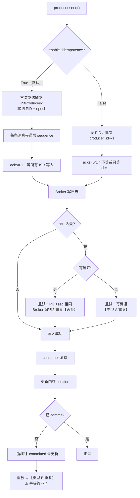

# 课 6 · 确认语义与幂等

> 一句话：**幂等能消除"生产者重试写两遍"，但消除不了"消费者读了两遍"** —— 后者才是 at-least-once 重复的真身。

## 你将学到什么

- 三种确认语义（`acks=0/1/-1`）在源码层面差在哪
- 幂等生产者的三元组机制（`producer_id` + `epoch` + `sequence`）
- **KIP-679 陷阱**：3.0.11 默认开幂等，但某些配置会**静默关掉**它
- **at-least-once 为什么会重复**（课 5 双轨模型的收口）

## 先修

- [课 4：生产者内部机制](./课4-生产者内部机制.md)
- [课 5：消费者内部机制](./课5-消费者内部机制.md)

---

## 一、三种确认语义：谁确认了才算成功

`acks` 决定 Broker 在什么条件下返回 ack：

| `acks` | 谁写入就算成功 | 丢数据风险 | 语义 |
|---|---|---|---|
| `0` | 谁都不等，发出即算 | **最高**：网络丢包就永远没了 | 最多一次 |
| `1` | leader 写入 | 中：leader 挂了、follower 还没同步 → 丢 | 较多一次 |
| `-1`/`all` | **所有 ISR 副本**写入 | 低 | at-least-once 的基础 |

课 4 实测过代价（rf=3，5 轮中位数）：`acks=0` 0.0229ms、`acks=1` 0.0381ms、`acks=-1` 0.0503ms。

> 💡 注意：rf=1 时三档延迟几乎一样——ISR 只有 leader 自己，`acks=-1 ≡ acks=1`。这解释了为什么单机集群测不出差异。

---

## 二、幂等生产者：三元组

### 机制

Broker 给每个生产者分配一个 **`producer_id`（PID）**，配一个 **`epoch`**，每条消息带一个**递增的 `sequence`**。Broker 用 `(PID, epoch, seq)` 判断"这条是不是重发"。

源码在 `transaction_manager.py`：

```python
class ProducerIdAndEpoch:
    def __init__(self, producer_id, epoch):
        self.producer_id = producer_id
        self.epoch = epoch
```

### 实测：惰性初始化

```python
p = KafkaProducer(bootstrap_servers=BS)     # 默认幂等开
show(p, "发送前")                            # PID=-1, epoch=-1
p.send(T, b"hello").get(timeout=15)
p.flush(timeout=15)
show(p, "发送后")                            # PID=3012, epoch=0
```

实测输出：

```text
enable_idempotence = True
[发送前] producer_id_and_epoch = ProducerIdAndEpoch(producer_id=-1, epoch=-1)
[发送后] producer_id_and_epoch = ProducerIdAndEpoch(producer_id=3012, epoch=0)
→ 首次发送才触发 InitProducerId（惰性初始化）
tm._sequence_numbers = {TopicPartition(topic='l6-idem', partition=0): 1}
```

**`-1` 就是"还没有"的意思**（`NO_PRODUCER_ID`）。首次 `send()` 才发 `InitProducerId` 请求。`_sequence_numbers` 发一条后变成 `1`，说明**序号从 0 开始**。

非幂等生产者连这个对象都没有：

```text
enable_idempotence = False
[发送后] producer_id_and_epoch = None
```

---

## 三、KIP-679：默认开启，但会静默关闭

### 这是本课最实用的部分

kafka-python **3.0.11** 的默认值（对应 KIP-679，Kafka 3.0+）：

```text
acks                                  = -1
enable_idempotence                    = True
retries                               = inf
max_in_flight_requests_per_connection = 5
```

**行为规则**：

1. 用户**隐式**提供冲突配置（`acks=0` / `retries=0` / `inflight>5`）→ **静默关闭幂等 + warning**
2. 用户**显式**设 `enable_idempotence=True` → 冲突**直接抛异常**
3. 设了 `transactional_id` → 自动强制幂等，且按严格模式（抛异常）

### 八组实测

| 配置 | 结果 | `enable_idempotence` |
|---|---|---|
| 全默认 | 幂等开 | `True` |
| `acks=0` | **静默关闭** | `False` |
| `acks=0` + 显式 `True` | **抛异常** | — |
| `retries=0` | 静默关闭 | `False` |
| `inflight=10` | 静默关闭 | `False` |
| 显式 `False` | 明确关闭 | `False` |
| `transactional_id=...` | 自动开启 | `True` |
| `transactional_id` + `acks=0` | **抛异常** | — |

异常原文：

```text
KafkaConfigurationError: enable_idempotence=True is incompatible with user-provided acks=0
```

warning 原文（**只在日志里，不打断程序**）：

```text
[WARNING] <KafkaProducer client_id=kafka-python-producer-1 transactional_id=None>:
Idempotence will be disabled because user-provided config conflicts
with idempotent defaults: acks=0
```

> 🔴 **陷阱**：你写 `acks=0` 只是想"快一点"，结果**幂等被悄悄关掉了**，程序照常跑、只往日志打一行 warning。生产环境如果没接日志采集，**你永远不会知道**。
>
> 想要冲突时**立刻暴露**，就显式写 `enable_idempotence=True`——让它抛异常而不是静默降级。

### 源码位置

`producer/kafka.py` 的 `__init__`：

```python
user_set_idempotence = 'enable_idempotence' in user_provided_configs
user_set_acks = 'acks' in user_provided_configs
user_set_retries = 'retries' in user_provided_configs
user_set_inflight = 'max_in_flight_requests_per_connection' in user_provided_configs

if self.config['transactional_id']:
    self.config['enable_idempotence'] = True
    # Transactional path is strict: any conflicting user-provided config must raise.
    user_set_idempotence = True
```

---

## 四、幂等的边界：只在单会话内有效

连开三个 producer 实例：

```text
第 1 个 producer 实例: PID=4009 epoch=0
第 2 个 producer 实例: PID=3013 epoch=0
第 3 个 producer 实例: PID=3014 epoch=0
→ PID 各不相同: [4009, 3013, 3014]
```

> 🔴 **PID 每次都变** → 幂等**跨会话失效**。进程重启后，Broker 认不出"这是刚才那个生产者"，重试产生的重复无法去重。
>
> 要跨会话幂等，必须用 `transactional_id`（Broker 用它做 fencing，见课 8）。

---

## 五、at-least-once 为什么会重复（课 5 收口）

### 完整因果链实测

```text
生产 10 条，topic 实际 10 条
第 1 轮消费 10 条: ['s-00', 's-01', 's-02']...
  position=10  committed=None
第 2 轮消费 10 条: ['s-00', 's-01', 's-02']...
  → 与第 1 轮完全相同: True
  【重复消费 10 条】
```

**决定性证据**：

```text
topic 实际条数 = 10（没有变成 20 条）
→ 证明重复发生在【消费侧】，broker 侧无重复
```

### 两类重复，必须分清

```text
┌─ 重复类型 A：producer 重试导致的重复
│   场景：send 成功但 ack 丢失 → producer 重试 → 同一条写两遍
│   幂等能否消除：✅ 能（PID + seq 让 broker 识别并丢弃重复批次）
│   topic 里会不会变多：不会（broker 已去重）
│
└─ 重复类型 B：consumer 提交滞后导致的重复
    场景：消费了但没 commit 就崩溃 → 重启后重放
    幂等能否消除：❌ 不能！
    原因：这是【两次不同的消费】，不是【同一次发送写两遍】
          broker 里只有 1 条消息，是消费者读了 2 次
    topic 里会不会变多：不会 ← 上面实测的 10 条就是这个
    解法：消费端幂等（去重表 / 唯一键 / 事务 + read_committed）
```

> 🔑 **本课核心结论**：幂等管的是**写**，管不了**读**。
> 很多人以为"开了幂等就不会重复消费"——**这是错的**。幂等防的是生产者重试把同一条写两遍，而 at-least-once 的重复来自消费者，两者根本不是一回事。

### 消费端怎么防重

**方案 1：业务幂等（最常用）**
用业务唯一键（订单号）先查去重表，存在则跳过。

**方案 2：手动提交，处理完再提交（缩小窗口，不消除）**

```python
for msg in consumer:
    process(msg)          # 先处理
    consumer.commit()     # 处理成功才提交
```

⚠️ 仍可能重复：`commit()` 成功但进程在之后崩溃——见课 5 双轨模型。

**方案 3：事务 + `read_committed`（Kafka 原生 EOS）**
`producer.begin_transaction()` / `send_offsets_to_transaction()`，消费端配 `isolation_level='read_committed'`。**课 8 讲**。

当前默认值：

```text
isolation_level 默认 = read_uncommitted
→ 默认会读到未提交/已中止事务的消息
```

---

## 六、完整链路图



---

## 一句话记住

> **幂等管写不管读**。3.0.11 默认开幂等（`acks=-1` + `retries=inf`），但你一写 `acks=0` 它就**静默关闭**（只有一行 warning）；幂等靠 `PID + epoch + seq` 消除生产者重试的重复，**跨会话失效**（每次重启 PID 都变）；而 at-least-once 的重复来自**消费侧提交滞后**，幂等**完全管不了**，只能靠业务去重或事务。

## 常见误区

| 误区 | 真相 |
|---|---|
| "kafka-python 默认不幂等" | **3.0.11 默认 `enable_idempotence=True`**（KIP-679） |
| "配 `acks=0` 只是快一点" | 它会**静默关闭幂等**，只打一行 warning |
| "配了冲突会报错提醒我" | 只有**显式**写 `enable_idempotence=True` 才报错；隐式冲突静默降级 |
| "开了幂等就不会重复消费" | **错**。幂等防生产者重试写两遍，防不了消费者读两遍 |
| "幂等能跨进程重启生效" | 不能。PID 每次重启都变（实测 4009/3013/3014） |
| "重复消费说明 broker 里消息重复了" | 实测：重复 10 条但 topic 始终 10 条，重复在**消费侧** |
| "`retries` 要设成 0 避免重复" | 反而会关掉幂等。幂等下应**保持默认 `inf`** |

## 本课实测资产

| 脚本 | 用途 |
|---|---|
| [`dump_idempotence_overview.py`](../../assets/bench/dump_idempotence_overview.py) | 幂等结构全量列举（54 处 `idempot` 命中） |
| [`dump_idem_config.py`](../../assets/bench/dump_idem_config.py) | 配置校验逻辑 + KIP-679 docstring 原文 |
| [`verify_idempotence_config.py`](../../assets/bench/verify_idempotence_config.py) | **八组配置实测**（静默关闭 vs 抛异常） |
| [`verify_idem_pid.py`](../../assets/bench/verify_idem_pid.py) | `producer_id_and_epoch` + warning 捕获 |
| [`verify_idem_send.py`](../../assets/bench/verify_idem_send.py) | **惰性初始化 + 三会话 PID 对比** |
| [`verify_semantics.py`](../../assets/bench/verify_semantics.py) | **两类重复的边界实证** |

## 下一步

- 课 7：吞吐调优与压缩（阶段 3 · 实测课）—— 批次、linger、压缩对吞吐的影响，confluent-kafka 与 kafka-python 对照

## 导航

- ⬅️ 上一课：[课 5 消费者内部机制](./课5-消费者内部机制.md)
- ⬆️ 返回：[阶段 2 概览](./overview.md) · [课程目录](../../02-课程目录.md)
- 📖 进度：[00-学习档案](../../00-学习档案.md) · [01-学习路径总览](../../01-学习路径总览.md)
