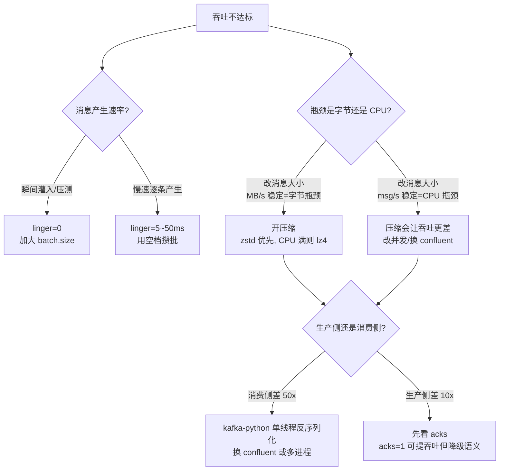

# 课 7 · 吞吐调优与压缩

> 一句话：**吞吐调优没有万能参数，只有"你的瓶颈在哪"这一个前提**。

## 你将学到什么

- 吞吐基准的**可复现方法论**（以及三个会让数字失真的脚本级陷阱）
- 两库吞吐的**真实差距**（本机实测，不引用网上 benchmark）
- 批次、linger、压缩三者的**调优判据**——以及为什么教科书结论在本机会反转
- 压缩率的**三种消息体对照**，理解"压缩率取决于你的数据而不是 codec 名字"

## 先修

- 课 4（生产者内部机制）：批次累积与 Sender 线程
- 课 6（确认语义与幂等）：`acks=all` 的代价
- 阶段 3 环境：`docker build -t kafka-pybench:3.12 assets/bench/`

---

## 一、先立规矩：吞吐数字怎么测才可信

网上流传的 Python Kafka 客户端性能数据**不可用**。检索到的 2025-2026 年"benchmark"存在硬伤：出现 `kafka-python EOS 950k > confluent-kafka 800k` 这类结论——纯 Python 反超 C 实现，违背基本常识；数据来源集中在内容农场，标注"2025 internal tests"却无可复现方法。

按本项目铁律（先核验再下结论），**本课所有数字均为本机实测**。

### 实测环境

| 项 | 值 |
|---|---|
| 客户端 | Docker `kafka-pybench:3.12`，接入 `stage6-observability_kafka-net` |
| Python | CPython 3.12.14（`python:3.12-slim`） |
| confluent-kafka | **2.15.1**（librdkafka 2.15.1） |
| kafka-python | **3.0.11** |
| 集群 | 3 节点 KRaft，apache/kafka:4.0.0 |
| Topic | 6 分区 / 3 副本 |
| 确认 | `acks=all`（最严，与生产一致） |

> ⚠️ 本课把预研期用的 `kafka-python-ng 2.2.3` 换成了 `kafka-python 3.0.11`，与课 1~6 完全同源。原因是 3.0.11 有 KIP-679 默认幂等（课 6 讲过），ng 没有——换库才能让课 6 结论贯穿到本课。

### 一个必踩的坑：advertised.listeners

broker 的 `KAFKA_ADVERTISED_LISTENERS` 配的是容器名 `kafka-1:9092`。客户端拿到这个地址后，若跑在宿主机上直连 `19192`，**会因地址不可达而失败**。

解法：让客户端容器接入同一 docker 网络，用容器名连接。（与课 15 记录的是同一个坑。）

---

## 二、基线：两库真实差距

5 万条 1KB 消息，`acks=all`，6 分区 3 副本，`compression=none`，`linger=10ms`：

| 库 | 生产 msg/s | 生产 MB/s | 消费 msg/s | 消费 MB/s |
|---|---|---|---|---|
| confluent-kafka | 81,591 ~ 103,875 | 79.7 ~ 101.4 | 453,499 ~ 472,505 | 442.9 ~ 461.4 |
| kafka-python 3.0.11 | 7,662 ~ 8,301 | 7.5 ~ 8.1 | 8,283 ~ 9,319 | 8.1 ~ 9.1 |
| **倍数** | **约 10~13x** | | **约 50x** | |

消费侧差距（50x）远大于生产侧（10x）。原因在课 5 讲过：kafka-python 的消费是单线程纯 Python 反序列化，而 librdkafka 在 C 层预取并解压缩。

> 📌 预研期（用 ng 2.2.3）测出的生产倍数是 4.9x~16.0x，本课用 3.0.11 复测是约 10~13x，**落在同一区间**。说明这个倍数对"哪个 fork"不敏感，但对**机器负载**很敏感——confluent 侧波动能到 3 倍，kafka-python 侧反而极稳定。

---

## 三、压缩：一个反直觉的结果

固定 `linger=10ms`，只改 codec，5 万条 1KB：

| codec | confluent 生产 | kafka-python 生产 | kafka-python 相对 none |
|---|---|---|---|
| none | 101,677 | 8,027 | 1.00x（基线） |
| gzip | 88,662 | 28,058 | **3.50x** |
| snappy | 120,232 | 32,200 | **4.01x** |
| lz4 | 74,516 | 35,444 | **4.42x** |
| zstd | 81,790 | 33,812 | **4.21x** |

**开压缩让 kafka-python 吞吐涨了 4 倍，而 confluent 几乎没变（甚至 lz4/gzip 还降了）。**

这个结果和"压缩费 CPU、应该降吞吐"的直觉相反。必须查根因，不能只报数字。

### 根因：kafka-python 的瓶颈是字节数，不是 CPU

验证手法：固定条数，只改**消息体大小**，看吞吐怎么变。

| 消息大小 | kafka-python msg/s | kafka-python MB/s | confluent msg/s | confluent MB/s |
|---|---|---|---|---|
| 128 B | 36,115 | 4.41 | 368,595 | 44.99 |
| 1 KB | 8,863 | 8.66 | 89,185 | 87.09 |
| 8 KB | 1,136 | **8.88** | 12,677 | **99.04** |

**两个库的 MB/s 都趋于稳定**（kp 稳定在 8.7~8.9，cf 在 87~99），而 msg/s 随消息变大成比例暴跌。

这说明瓶颈在**字节吞吐**（网络传输 + 序列化），不在 CPU。所以：

- **kafka-python**：CPU 有大把空闲（纯 Python 慢，但压缩调用的是 C 库），压缩减少的字节数直接变成吞吐 → 涨 4 倍
- **confluent**：CPU 已经跑满（librdkafka 本身就快到吃满 CPU），压缩抢走 CPU 却省不下多少时间 → 持平甚至下降

> 这就是"调优先看瓶颈"的第一课：**同一个参数，在两个瓶颈类型下效果完全相反。**

### 压缩率：取决于你的数据，不取决于 codec 名字

实测三种消息体（2000 条，单条独立压缩）：

| 数据集 | gzip | snappy | lz4 | zstd |
|---|---|---|---|---|
| JSON（含 900B 长 padding） | 13.88x | 9.72x | 11.37x | **14.32x** |
| 应用日志（高重复） | **0.87x** | **0.98x** | **0.82x** | **0.96x** |
| 随机字节（不可压） | 0.98x | 1.00x | 0.98x | 0.99x |

⚠️ **应用日志那一列全部 < 1**——压缩后反而变大。因为单条日志只有 ~105 B，各 codec 的帧头开销（gzip 18B、zstd 帧头等）占比过高。

但 Kafka **不是单条压缩，是整批压缩**。补测同样数据拼成一整批后：

| 数据集 | gzip | snappy | lz4 | zstd |
|---|---|---|---|---|
| JSON（含长 padding） | 173.15x | 19.81x | 111.48x | **472.10x** |
| 应用日志（高重复） | 24.88x | 15.25x | 13.03x | **44.39x** |
| 随机字节 | 1.00x | 1.00x | 1.00x | 1.00x |

**同一份数据，单条压缩 0.87x，整批压缩 24.88x——差 28 倍。**

> 这就是为什么"Kafka 压缩率"不能引用网上的表格：它同时取决于**消息体熵**和**批量大小**两个变量。你自己的日志和我的 JSON，压缩率能差一个数量级。

### codec 怎么选

结合两组实测（压缩率 + CPU 耗时）：

| codec | 压缩比 | CPU 单核吞吐 | 适用 |
|---|---|---|---|
| **zstd** | 最高（472x 整批） | 353 MB/s | 默认推荐，压缩比与速度均衡 |
| **lz4** | 中（111x） | **1,907 MB/s** | CPU 敏感、要极低延迟 |
| **snappy** | 最低（19.8x） | 519 MB/s | 历史遗留，新项目不必选 |
| **gzip** | 高（173x） | 167 MB/s（最慢） | 要极致压缩比、CPU 不敏感 |

> 本机结论：**新项目默认 zstd**；如果压测发现 producer CPU 先打满，换 lz4。

⚠️ 能力差异：`kafka-python` 默认**只支持 gzip**（snappy/lz4/zstd 需额外装 `python-snappy` / `lz4` / `zstandard`，不装直接 `AssertionError: Libraries for ... codec not found`）；`confluent-kafka` 因 librdkafka 静态链接，**五种开箱可用**。这也是选型的隐藏成本。

---

## 四、linger：教科书结论在本机反转

教科书说"调大 `linger.ms` 攒批，提升吞吐"。实测：

| linger | confluent 生产 | kafka-python 生产 |
|---|---|---|
| 0 ms | **152,804** | 8,301 |
| 10 ms | 121,410 | 7,662 |
| 50 ms | 72,671 | 8,491 |
| 100 ms | 74,144 | 8,551 |

**linger 从 0 加到 100，confluent 吞吐掉了 51%。**

### 为什么：linger 是"等待"，不是"提速"

拆解耗时（5 万条，confluent）：

| linger | produce 循环耗时 | flush 等待耗时 | 总耗时 |
|---|---|---|---|
| 0 ms | 94 ms | 197 ms | 291 ms |
| 10 ms | 95 ms | 474 ms | 569 ms |
| 100 ms | 87 ms | **738 ms** | 824 ms |

`produce()` 循环耗时**几乎不变**（87~95 ms，Python 侧投递 5 万条就这么快），而 **flush 等待随 linger 线性增长**。

也就是说：本 bench 是**瞬间灌入** 5 万条，消息在本地队列里早就堆满了，linger 攒批"攒"不到更多消息，只是**给每批白加了一段等待**。

### 反证：换一个场景，教科书就对了

让消息**慢速产生**（每条间隔 200 μs，模拟真实业务逐条生成），同样三档 linger：

| 场景 | linger=0 | linger=10 | linger=50 | 趋势 |
|---|---|---|---|---|
| 慢速生产（间隔 200μs，5000 条） | 3,030 | **3,472** | 3,457 | ↑ **提升 15%** |
| 瞬间灌入（无间隔，5 万条） | **169,963** | 123,018 | 73,593 | ↓ **下降 57%** |

**两条曲线方向完全相反。**

结论：**`linger.ms` 只在"消息产生速度慢于攒批速度"时才提吞吐**。此时它能把"两条消息之间本来会浪费的空档"用来攒批。压测式瞬间灌入时，它纯属增加延迟。

> ⚠️ 这解释了一个常见误操作：用压测脚本（瞬间灌入）调出来的 `linger=0` 最优，直接搬到线上（慢速产生）反而次优。**调参必须在与生产同构的速率下做。**

---

## 五、三个让数字失真的脚本级陷阱

这些若不修，实测出来的数字是**假的**，而且假得很隐蔽。

### 陷阱 1：confluent 的 `consume()` 会等满 timeout

`consumer.consume(num_messages=10000, timeout=5.0)` **不管是否拿够 10000 条，都会等满 5 秒**。实测拿 1,999 条耗时 5.00 秒 → 算出 400 msg/s 的假象（真实值高三个数量级）。

修正：以"拿到最后一条消息的时刻"作为计时终点。

```python
last_msg_at = start
while received < NUM_MESSAGES:
    msgs = consumer.consume(num_messages=10000, timeout=1.0)
    ...
    last_msg_at = time.perf_counter()
elapsed = last_msg_at - start        # 不能用循环外计时
```

### 陷阱 2：消费前必须等分区分配完成

`subscribe()` 后立刻 `consume()`，会在尚未 join 组时提前超时返回空，速率被严重低估。修正：先 `poll()` 到第一条消息再开始计时。

### 陷阱 3：两库 API 不一致（三个具体点）

| 场景 | confluent-kafka | kafka-python 3.0.11 |
|---|---|---|
| 不压缩 | `compression.type="none"`（字符串） | `compression_type=None`（传 `"none"` 抛 `ValueError`） |
| 删除 topic | `delete_topics([t], operation_timeout=15)`，**不能**按关键字传 `future` | `delete_topics([t], timeout_ms=15000)` |
| 内存缓冲 | `queue.buffering.max.messages` | **无此配置**，3.0.11 已移除（早期版本/ng 有 `buffer_memory`，传了报 `Unrecognized configs`） |

> 第三行是本次换库时实打实踩到的：预研脚本按 ng 写的 `buffer_memory=...`，在 3.0.11 上直接 `ValueError: Unrecognized configs`。**跨版本/fork 复用脚本时，参数名必须重新核对，不能靠记忆。**

---

## 六、调优决策路径



## 一句话记住

**吞吐调优的第一步不是试参数，是判断你的瓶颈在字节还是在 CPU——同一个参数，两种瓶颈下效果相反。**

## 常见误区

| 误区 | 事实 |
|---|---|
| "调大 linger 一定提吞吐" | 只在消息慢速产生时成立；压测式瞬间灌入时反向掉 57%（实测） |
| "压缩费 CPU 所以降吞吐" | kafka-python 开压缩涨 4 倍——它的瓶颈是字节数，CPU 有空闲 |
| "zstd 压缩比最高所以闭眼选" | 若 producer CPU 先满，lz4 单核 1,907 MB/s 更合适；且压缩率取决于你的数据熵 |
| "kafka-python 支持各种压缩" | 只内置 gzip；snappy/lz4/zstd 要额外装包，否则 `AssertionError` |
| "压测脚本的 linger 配置能直接上生产" | 压测是瞬间灌入，生产是慢速产生，两者最优值相反 |
| "网上 benchmark 的倍数可以直接用" | 实测区间 10~13x，但 confluent 侧负载敏感能波动 3 倍；必须本机实测 |

## 本课实测资产

| 脚本 | 用途 |
|---|---|
| [run-bench-l7.sh](../../assets/bench/run-bench-l7.sh) | 三组对照执行器（A 基线 / B 压缩 / C linger） |
| [diag_linger.sh](../../assets/bench/diag_linger.sh) | 拆解 produce/flush 耗时，定位 linger 反向根因 |
| [diag_linger_slow.sh](../../assets/bench/diag_linger_slow.sh) | 慢速生产反证，验证教科书前提 |
| [diag_compression_why.sh](../../assets/bench/diag_compression_why.sh) | 改消息体大小，判定瓶颈类型 |
| [measure_compression_ratio.sh](../../assets/bench/measure_compression_ratio.sh) | 三种消息体 × 4 codec 压缩率（单条/整批双口径） |
| [check_hygiene.sh](../../assets/bench/check_hygiene.sh) | 集群卫生检查（修正版，见下） |

### 顺带修掉的一个工具缺陷

课 5、课 6 两次复验都报告"集群干净"，但实际残留了 6 个 topic（`l4-bp-test`、`l5-final`、`l5-min`、`l5-rb-auth`、`l5-v2`、`l5-verify2`）。

根因：旧检查用 `kafka-topics.sh --list 2>/dev/null`，而 JMX Exporter 端口冲突（`java.net.BindException: Address in use`）会把 **stdout 一起吞掉** → grep 拿空输入 → 走 `||` 分支误报"干净"。

修正：改用客户端 API 列举，彻底绕开 CLI 的 JMX 污染。这是**假阴性的典型样本**——检查工具本身坏了，还表现得像"检查通过"。

## 下一步

课 8（事务与恰好一次）：本课把吞吐打上去了，但 `acks=all` + 幂等只保证**不丢**，不保证"处理且仅处理一次"。跨 Topic 的原子写入需要事务——那是 librdkafka 的独占能力，也是两库差距最大的一块。

## 导航

- ⬆️ 返回：[阶段 3 概览](overview.md)
- ⬅️ 上一课：[课 6 · 确认语义与幂等](../2-理解层-协议与源码/课6-确认语义与幂等.md)
- ➡️ 下一课：课 8 · 事务与恰好一次（待讲解）
- 📖 进度：[00-学习档案](../../00-学习档案.md)
