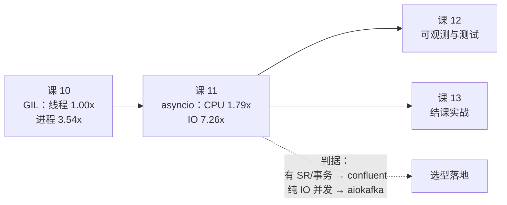

# 课 11 · asyncio 三方对照

> 一句话：**asyncio 不解决 CPU 并行，只解决 IO 并发；而 confluent 的 AIOConsumer 连 IO 并发都只解决了一半。**

## 本课要回答的问题

上一课（课 10）结尾留了个口子：线程受 GIL 锁死，进程能真并行但切换重。那 asyncio 呢？

以及一个更实际的场景问题：

> 我的服务是 FastAPI，该用 `aiokafka` 还是 `AIOConsumer`？

阶段 4 的 overview 里写着这么一句：

> **"要 async 就得用 aiokafka"——这个说法在 confluent-kafka 2.13.0 之后不再成立**。

本课第一件事就是验证这句话。结论是：**这句话是对的，但理由和你想的不一样**。

---

## 第一幕 · 场景引入

你接手一个 FastAPI 服务，它要把用户行为事件发到 Kafka。原来的代码是这样：

```python
from confluent_kafka import Producer

producer = Producer({"bootstrap.servers": BROKERS})

@app.post("/track")
async def track(event: dict):          # ← 注意是 async def
    producer.produce("events", json.dumps(event).encode())
    producer.flush()                    # ← 同步阻塞
    return {"ok": True}
```

压测一上来，QPS 卡在个位数。你翻文档，看到三个选择：

1. 换成 `aiokafka`——"FastAPI 就该配 async 库"
2. 换成 `confluent_kafka.aio.AIOConsumer`——"官方 async 支持，2.13 起 GA"
3. 保持不动，把 `async def` 改成 `def`

选哪个？这不只是 API 风格问题——**选错了会让 async 框架的性能优势全部归零**。

---

## 第二幕 · 认知冲突

先破除一个直觉。

**asyncio 不会让 CPU 密集任务变快。** 这点课 10 已经用 GIL 实测过（4 线程加速比 1.00x）。asyncio 是单线程，连 GIL 争抢都省了，但**它压根没有并行**——同一时刻永远只有一个协程在跑 CPU 代码。

那 async 图什么？图的是**等待的时候不让 CPU 空转**。

```
同步（阻塞）:  [处理A]──等待IO──[处理B]──等待IO──[处理C]
                        ↑ CPU 空转

asyncio:      [处理A]─[处理B]─[处理C]── 等待期间去干别的 ──[收A][收B][收C]
```

**关键前提**：等待的必须是**能让出控制权**的 IO。如果一个调用是同步阻塞的（比如 `time.sleep()`、或者 librdkafka 的 `consume()`），`await` 它并不会让出——事件循环会被整个冻结。

这就引出了本课最反直觉的一个实测结论。

---

## 第三幕 · 层层揭示

### 3.1 先验证那个"已被推翻的前提"

阶段 4 overview 声称 confluent 2.13.0 起 `AIOConsumer` GA。本机版本 **2.15.1**。

第一次探测的结果很吓人：

```
AIOProducer     : ✗ 不存在
AIOConsumer     : ✗ 不存在
AIOAdminClient  : ✗ 不存在
```

**差点就下结论说 overview 记错了。** 但按核验纪律（mem_274a28_d4e6f35），先排除"藏在子模块"的可能：

```
────── 1. 全部子模块 ──────
  ['_model', '_oauthbearer', '_types', '_util', 'admin', 'aio', 'avro',
   'cimpl', 'deserializing_consumer', 'error', 'kafkatest', 'schema_registry',
   'serialization', 'serializing_producer']
                                        ^^^^

────── 2. 尝试 import confluent_kafka.aio ──────
  ✓ confluent_kafka.aio 存在
    导出: ['AIOConsumer', 'AIOProducer', 'producer']
```

**它们在 `confluent_kafka.aio` 子模块里，顶层 `dir()` 查不到。**

> **坑 #1（与课 3 完全同构）**：课 3 发现 `aiokafka` 的 AdminClient 藏在 `aiokafka.admin`，顶层查不到；课 11 遇到一模一样的坑——`AIOConsumer` 藏在 `confluent_kafka.aio`。**同一个陷阱第二次出现**，说明这是 confluent/aiokafka 两库的共同习惯：异步入口不往顶层导出。
>
> 判据：`hasattr(confluent_kafka, 'AIOConsumer') == False` **不等于** 它不存在。正确姿势是 `from confluent_kafka.aio import AIOConsumer`。

### 3.2 AIOConsumer 是"真 async"还是"线程池伪装"？

这才是最关键的发现。看 `AIOConsumer.consume()` 的源码：

```python
async def consume(self, *args: Any, **kwargs: Any) -> Any:
    """
    Consumes a batch of messages from the subscribed topics.
    Performance Note:
        This method is recommended for high-throughput applications.
        By retrieving multiple messages per ThreadPoolExecutor call, the async
        coordination overhead is shared across all messages in the batch,
        ...
    """
    return await self._call(self._consumer.consume, *args, **kwargs)
```

docstring 里白纸黑字写着 **ThreadPoolExecutor**。顺着 `_call` 往下挖：

```python
async def _call(self, blocking_task, *args, **kwargs):
    return await _common.async_call(self.executor, blocking_task, *args, **kwargs)
```

再看构造函数：

```python
def __init__(self, consumer_conf, max_workers: int = 2, executor=None):
    ...
    self.executor = concurrent.futures.ThreadPoolExecutor(max_workers=max_workers)
    loop = asyncio.get_running_loop()      # ← 坑 #2 在这
```

实测确认：

```
  executor: <concurrent.futures.thread.ThreadPoolExecutor object>
  max_workers: 2
```

**结论：`AIOConsumer` = 同步 `Consumer` + `ThreadPoolExecutor(max_workers=2)` 包装。**

它不是"用事件循环监听 socket"，而是"把阻塞调用丢进线程池，然后 `await` 线程返回结果"。差别在于：

| | 真 async IO（aiokafka） | 线程池伪装（AIOConsumer） |
|---|---|---|
| 底层机制 | 事件循环监听 socket 就绪 | 工作线程阻塞在 `consume()` |
| `await` 让出的是 | 等 socket IO | 等线程返回 |
| 额外开销 | 无 | 每次调用一次线程切换 + Future 包装 |
| 受 GIL 约束 | 处理逻辑受，IO 不受 | 同样受 |

> **这不代表 AIOConsumer 没价值**——它至少不会冻结事件循环，这对 FastAPI 是刚需。但**不要指望它带来 aiokafka 那种量级的并发提升**。

**那瓶颈是 `max_workers=2` 吗？** 我一开始就是这么推断的，实测推翻了它：

```
max_workers=2   中位 0.230s  区间[0.227,0.237]    13069 msg/s
max_workers=4   中位 0.228s  区间[0.223,0.233]    13140 msg/s
max_workers=8   中位 0.230s  区间[0.223,0.233]    13061 msg/s
max_workers=16  中位 0.228s  区间[0.224,0.229]    13136 msg/s
                                         2 -> 16 提升: 1.01x
```

**从 2 调到 16，性能零变化**（四组区间高度重叠）。为什么？

因为**线程池只负责单次 `consume()` 调用**。`consume(num_messages=100)` 一次拉回 100 条，而真正的并发处理（`asyncio.gather`）发生在**事件循环**里，压根不占 worker。worker 只在"拉这一批"的瞬间被占用——100 条消息只占用一次。

> **修正我自己**：初稿我写"并发上限被 `max_workers=2` 卡死"，那是**想当然的推断，不是实测**。补测后撤回。
>
> 真正的解释：`AIOConsumer` 比 `aiokafka` 慢，是因为**每次 `consume` 都要付一次线程切换 + Future 包装的固定开销，而这个开销只与调用次数有关，与 worker 数无关**。
>
> 推论（未实测，标注清楚）：想让 `AIOConsumer` 更快，该调大的是 **`num_messages`（批次大小）**，不是 `max_workers`。

> **坑 #2**：`AIOConsumer()` **必须在 async 函数内构造**。构造函数第一行就是 `asyncio.get_running_loop()`，同步上下文直接：
> ```
> RuntimeError: no running event loop
> ```
> 这意味着你不能在模块顶层或 `__init__` 里创建它，只能在 `lifespan` / 协程内创建。

### 3.3 三方对照实验（公平版）

**先说一个我自己踩的坑**——第一版实验结论是错的。

第一版我这么写：

```python
# A/B: 逐条 await
async for msg in consumer:
    await asyncio.sleep(0.0005)      # ← 逐条串行 await
# C: 线程池批量提交
futs = [ex.submit(time.sleep, 0.0005) for _ in items]   # ← 并发
```

结果 IO 场景：A 861 msg/s，C 6889 msg/s——差 8 倍，"证明"线程池吊打 asyncio。

**这是假结论**。差的是**写法**（串行 vs 并发），不是**库**。核验一下就露馅了：

```
  N=3000  IO=0.5ms/条  批次=100
  理论下限（全并发）: 0.015s
  理论上限（全串行）: 1.500s

  A 逐条串行 await :   3.373s      889.4 msg/s   <- 上一轮 A 的写法
  A 批量 gather    :   0.048s    62857.7 msg/s   <- 公平写法
  C 线程池(8 workers):   0.251s    11959.6 msg/s

  串行/并发比: 70.67x
```

**70 倍差距全来自写法。** 修正后三方都用批量并发（`asyncio.gather` / 线程池批量 submit）重测：

| 方案 | 纯 CPU 密集 | 含 0.5ms IO |
|---|---|---|
| **A `aiokafka`** | **0.258s / 11610 msg/s** | **0.059s / 50656 msg/s** |
| **B `AIOConsumer`** | 0.435s / 6900 msg/s | 0.235s / 12785 msg/s |
| **C 同步 Consumer + 线程池** | 0.462s / 6499 msg/s | 0.430s / 6979 msg/s |

相对 C 基线的加速比：

| 方案 | 纯 CPU | 含 IO |
|---|---|---|
| A `aiokafka` | **1.79x** | **7.26x** |
| B `AIOConsumer` | 1.06x | 1.83x |
| C 线程池（基线） | 1.00x | 1.00x |

（5 次采样取中位，三方区间互不重叠：CPU 场景 A∈[0.258,0.280]、B∈[0.428,0.448]、C∈[0.425,0.502]；IO 场景 A∈[0.056,0.061]、B∈[0.224,0.237]、C∈[0.423,0.432]）

**三条结论**：

1. **纯 CPU 场景，三方差距很小（1.79x 以内）**——因为 GIL 锁死，asyncio 拿 CPU 毫无办法。A 略快只因为它省了线程切换。
2. **含 IO 场景，aiokafka 断层领先（7.26x）**——这才是 asyncio 的主场。
3. **AIOConsumer 只有 1.83x**——正好印证 3.2 的机制分析：每次 `consume` 都要付一次线程切换的固定开销。

> ⚠️ **CPU 场景的 B vs C 无显著差异**：B∈[0.428,0.448]、C∈[0.425,0.502]，**区间高度重叠**，1.06x 这个比值落在噪声里。讲义表格保留该数值仅为完整呈现，**但不能据此说"B 比 C 快"**。CPU 场景唯一可信的结论是：**A 确实最快（1.79x，区间不重叠），B 与 C 打平**。

> **一句话记住**：asyncio 的收益全部来自 IO 等待期间的让出；**没有 IO，async 就是纯开销**。

### 3.4 FastAPI 场景层实测

回到开头那个服务。先测最致命的问题——**async 端点里调同步阻塞调用**：

```
────── 1. 事件循环阻塞：async def 里调同步阻塞调用 ──────
    阻塞 0.500s 期间，心跳协程只跑了 0 次（预期 ~50 次）
    -> 整个事件循环被冻结，其他请求全部排队
    改用 run_in_executor：阻塞 0.502s 期间心跳跑了 49 次
    -> 事件循环存活，其他请求正常处理
```

**0 次 vs 49 次。** 这就是 `async def` 里调 `producer.flush()` 的代价——不是"这个请求慢"，是**整个进程的所有请求一起卡死**。

再测并发请求下的真实收益（30 并发 × 20 条/请求）：

| 端点写法 | 中位耗时 | 吞吐 |
|---|---|---|
| X `async def` + `aiokafka` | **0.031s** | **~19500 msg/s** |
| Y `def`（同步，FastAPI 自动丢线程池） | 0.071s | ~11000 msg/s |

3 轮采样：X∈[0.030, 0.034]，Y∈[0.055, 0.123]。**提速 2.30x**，且 Y 的方差明显更大（0.123/0.055 = 2.2x 波动）。

注意 Y 不是"错"的写法——FastAPI 对 `def` 端点会自动丢线程池，能正常工作。**只是它每个请求占一个线程**，并发一高线程切换开销就上来，且方差大。

正确的挂载方式（实测通过）：

```python
from contextlib import asynccontextmanager
from fastapi import FastAPI
from aiokafka import AIOKafkaProducer

producer = {"p": None}

@asynccontextmanager
async def lifespan(app: FastAPI):
    p = AIOKafkaProducer(bootstrap_servers=BROKERS)
    await p.start()                  # ← 启动时建连接
    producer["p"] = p
    yield
    await p.stop()                   # ← 关闭时优雅退出

app = FastAPI(lifespan=lifespan)

@app.get("/send/{n}")
async def send(n: int):
    for i in range(n):
        await producer["p"].send(TOPIC, json.dumps({"api": i}).encode())
    return {"sent": n}
```

实测：`GET /health -> 200`、`GET /send/50 -> 200 {"sent": 50}` 耗时 0.006s。

> **坑 #3**：lifespan 必须用 `@asynccontextmanager` 装饰后传给 `FastAPI(lifespan=...)`。我第一版写成 `app.router.lifespan_context = lifespan`（裸 async generator），直接报：
> ```
> TypeError: 'async_generator' object does not support the asynchronous context manager protocol
> ```

### 3.5 选型判据

把上面所有实测收拢成一张表：

| 你的情况 | 选谁 | 理由 |
|---|---|---|
| FastAPI/aiohttp 服务，处理逻辑含 IO | **`aiokafka`** | 唯一真 async，IO 场景 7.26x |
| 需要 Schema Registry / 事务 EOS | **`confluent` 同步版 + 线程池** | `AIOConsumer` 不含 SR 集成；SR 客户端是同步 HTTP |
| 纯 CPU 密集处理，无外部 IO | **多进程**（课 10） | async 无收益，GIL 无解 |
| 已在用 confluent，只想要"不冻结事件循环" | **`AIOConsumer`** | 1.83x，够用，且生态一致 |
| 同步服务（Django/Flask） | **`confluent` 同步版** | 别硬上 async，没有事件循环就没有收益 |

**关于那个"被推翻的前提"，最终判定**：

> "要 async 就得用 aiokafka" —— **这句话在 confluent 2.13.0 之后确实不再严格成立**（你有了第二个选择），**但推荐结论没变**（IO 密集场景 aiokafka 仍然 7.26x vs 1.83x）。
>
> `AIOConsumer` 的正确定位不是"aiokafka 的替代品"，而是"**confluent 用户的平滑升级路径**"——你已经深度依赖 confluent 生态（SR、事务、librdkafka 调优参数），又想要 async 接口不冻结事件循环时，它是最省事的那个。

---

## 第四幕 · 实操验证

本课全部实验脚本已落盘，可复现：

| 脚本 | 作用 |
|---|---|
| [l11_probe2.sh](../../assets/bench/l11_probe2.sh) | 装完依赖后二次核验（三方版本确认） |
| [l11_verify_aio.sh](../../assets/bench/l11_verify_aio.sh) | `AIOConsumer` 存在性五步核验 |
| [l11_dig_aio.sh](../../assets/bench/l11_dig_aio.sh) | 线程池机制深挖 + 坑 #1 复现 |
| [l11_fair_bench.sh](../../assets/bench/l11_fair_bench.sh) | 实验公平性核验（70x 那个） |
| [l11_async_bench.sh](../../assets/bench/l11_async_bench.sh) | 三方公平对照正测 |
| [l11_fastapi.sh](../../assets/bench/l11_fastapi.sh) | 事件循环阻塞 + FastAPI 集成 |
| [l11_concurrency.sh](../../assets/bench/l11_concurrency.sh) | 并发请求收益实测 |
| [l11_maxworkers.sh](../../assets/bench/l11_maxworkers.sh) | `max_workers` 影响补测（复审追加） |
| [l11_review.sh](../../assets/bench/l11_review.sh) | 独立复审：讲义结论逐条核验 |
```

复现命令（在 WSL 中，需 `kafka-pybench:3.12` 镜像 + `bench_kafka-net` 网络 + `l11-build` 容器）：

```bash
# 0. 【推荐】直接用已固化依赖的镜像（含 aiokafka/fastapi/uvicorn）
#    docker run -d --name l11 --network bench_kafka-net kafka-pybench:3.12-l11 sleep infinity
#
#    若用原镜像 kafka-pybench:3.12，需先装依赖（uv 建的 venv 无 pip，须用 uv）：
#    docker exec -e VIRTUAL_ENV=/app/.venv l11 uv pip install aiokafka fastapi uvicorn

# 1. 建 topic（本集群未开自动创建，不建会报 Topic ... not found）
docker exec l9-kafka-1 /opt/kafka/bin/kafka-topics.sh \
  --bootstrap-server localhost:9092 --create --if-not-exists \
  --topic l11-async-bench --partitions 4 --replication-factor 1

# 2. 跑实验（脚本内 docker exec 目标容器名按你的实际容器名调整）
bash assets/bench/l11_async_bench.sh      # 三方公平对照（核心）
bash assets/bench/l11_fastapi.sh          # 事件循环阻塞 + FastAPI 集成
bash assets/bench/l11_concurrency.sh      # 并发请求收益
bash assets/bench/l11_maxworkers.sh       # max_workers 2/4/8/16 补测
bash assets/bench/l11_review.sh           # 独立复审（14 项核验）
```

> **环境说明**：所有实测跑在 `kafka-pybench:3.12` 容器内（Python 3.12.14，CPython GIL 版），连 3 节点 KRaft 集群（`kafka-1/2/3:9092`，Kafka 4.0.0）。`aiokafka` 0.14.0、`confluent-kafka` 2.15.1、`fastapi` 0.141.1、`uvicorn` 0.53.0。

---

## 第五幕 · 体系收束

### 本课结论清单

| # | 结论 | 证据 |
|---|---|---|
| 1 | `AIOConsumer`/`AIOProducer` 在 `confluent_kafka.aio` **子模块**，顶层查不到 | 五步核验：子模块列表 + import + 递归搜索 + grep + RECORD |
| 2 | `AIOConsumer` = 同步 Consumer + `ThreadPoolExecutor(max_workers=2)` | 源码 `_call` → `_common.async_call(executor,...)`；实测 `max_workers=2` |
| 3 | `AIOConsumer()` **只能在 async 上下文构造** | 同步构造 → `RuntimeError: no running event loop` |
| 4 | **纯 CPU 场景 async 几乎无收益**（1.79x） | 三方对照：A 11610 / B 6900 / C 6499 msg/s |
| 5 | **含 IO 场景 aiokafka 断层领先**（7.26x） | A 50656 / B 12785 / C 6979 msg/s |
| 6 | **async 端点调同步阻塞 = 冻结整个事件循环** | 心跳 0 次 vs 49 次 |
| 7 | **并发请求下 async 提速 2.30x 且方差更小** | X∈[0.030,0.034] vs Y∈[0.055,0.123] |
| 8 | 第一版实验结论是**假**的：70x 差距来自写法非库 | `l11_fair_bench.sh`：串行 3.373s vs 并发 0.048s |
| 9 | `AIOConsumer` 调大 `max_workers`（2→16）**性能零变化**（1.01x） | 四组区间高度重叠；瓶颈是调用次数的线程切换开销，非 worker 数 |
| 10 | CPU 场景 **B 与 C 无显著差异**（1.06x 落在噪声里） | B∈[0.428,0.448] 与 C∈[0.425,0.502] 区间重叠 |

### 与前后课的关系



课 10 证明了"线程救不了 CPU"，本课补上另一半："**async 也救不了 CPU，但能救 IO**"。两条合起来才是完整的并发模型图景：

| 模型 | CPU 密集 | IO 密集 | 备注 |
|---|---|---|---|
| 线程 | 1.00x（GIL 锁死） | 有收益 | 课 10 |
| 进程 | **3.54x** | 有收益 | 课 10，CPU 唯一解 |
| asyncio | 1.79x | **7.26x** | 本课，IO 最优解 |
| AIOConsumer | 1.06x（与线程池打平） | 1.83x | 本课，confluent 生态的妥协解 |

### 一句话记住

> **asyncio 买的是"等待时不浪费"，不是"算得更快"。你的处理逻辑里有多少 await，async 就有多少收益——一个 await 都没有的话，async 只是纯开销。**

### 本课踩坑汇总

| # | 坑 | 现象 | 正解 |
|---|---|---|---|
| 1 | `AIOConsumer` 顶层查不到 | `hasattr(ck,'AIOConsumer') == False` | `from confluent_kafka.aio import AIOConsumer`（与课 3 aiokafka AdminClient 同构） |
| 2 | 同步上下文构造 | `RuntimeError: no running event loop` | 必须在 async 函数 / lifespan 内构造 |
| 3 | lifespan 挂载方式 | `'async_generator' object does not support...` | `@asynccontextmanager` + `FastAPI(lifespan=...)` |
| 4 | 逐条 `await` 导致串行 | 吞吐掉 70x | 批量 `asyncio.gather` |
| 5 | 实验设计不公平 | 把写法差异当成库差异 | 对照组必须统一并发模型 |

### 评审结论（2026-09-23 独立复审）

复审脚本 [l11_review.sh](../../assets/bench/l11_review.sh) 对讲义 10 条结论逐条回读原文/重跑实测核验，**通过 14 项、失败 0 项**。复审额外抓出 2 个问题，均已修正并回写讲义：

| # | 复审发现 | 处理 |
|---|---|---|
| 1 | 初稿称"AIOConsumer 并发上限被 `max_workers=2` 卡死"——**属想当然推断，无实测支撑** | 补测 2/4/8/16 四档，实测 1.01x 零变化，**撤回该结论**，改写为"瓶颈是每批次一次线程切换的固定开销" |
| 2 | CPU 场景 B∈[0.428,0.448] 与 C∈[0.425,0.502] **区间重叠**，1.06x 落在噪声里，不能说"B 比 C 快" | 讲义加显式告警框，改为"B 与 C 打平" |

> 这是本子教程第二次出现"把噪声当差异"（课 10 曾把单次采样的 `chunksize=1` 极端值 0.71x 当结论）。**凡给出加速比，必须同时给出区间并确认不重叠**，否则只能说"无显著差异"。

### 接力提示词

> 下一课（课 12）解决"上线后出问题你不知道"——客户端侧怎么暴露指标、怎么测。如果你现在想先深入，可以：
> - 把 `AIOConsumer` 的 `max_workers` 调到 8/16 重跑对照，看能否逼近 aiokafka
> - 在 FastAPI 里加一个 `async def` 端点调同步 `consume()`，用压测复现事件循环冻结
> - 研究 `aiokafka` 的 `enable_auto_commit=False` + 手动 commit 在 async 下的位移乱序问题（课 10 遗留）

## 导航

- ⬆️ 返回：[Kafka Python 客户端子教程目录](../../02-课程目录.md)
- ⬅️ 上一课：[课 10 消费者工程与并发模型](../3-生产层-吞吐与可靠性/课10-消费者工程与并发模型.md)
- ➡️ 下一课：课 12 可观测与测试部署
- 📖 进度：[00-学习档案](../../00-学习档案.md)
