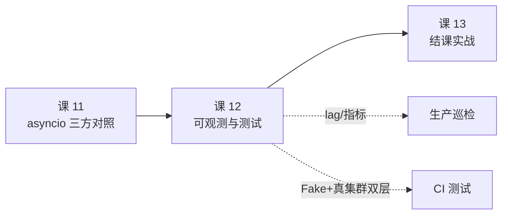

# 课 12 · 可观测与测试部署

> 一句话：**客户端侧最可靠的 lag 来源不是 stats 回调，而是你自己算 `watermark - committed`；而 stats 给你的"现成 lag"只对正在拉取的分区有效。**

## 本课要回答的问题

课 11 收尾时留了口子：服务上线后怎么知道它健不健康？

阶段 4 overview 里写着：

> 客户端侧可观测性：`statistics.interval.ms` 能吐出大量内部指标，但**这些指标是 JSON 且字段随版本变化**。

本课验证这句话，并回答三个具体问题：

1. **stats 回调能给出什么**，值不值得接？
2. **lag 到底怎么算**才不会误报？
3. **测试怎么分层**，既跑得快又测得真？

---

## 第一幕 · 场景引入

你的消费服务上线一周，某天业务方找过来："昨天下午的数据好像延迟了很久才处理完。"

你去查监控，发现：

- 服务进程活着（健康检查通过）
- CPU、内存都正常
- 没有一条 ERROR 日志

但消息确实积压了 4 万条。**你的监控体系里根本没有"积压"这个指标。**

更糟的是，你想起前人留过一段代码——它从 stats 回调里读 `consumer_lag` 打到日志里。你翻日志，发现大部分分区的值一直是 `-1`。

```
stats.consumer_lag : {0: 27344, 1: -1, 2: -1, 3: -1}
手算(committed)    : {0: 27338, 1: 9719, 2: 3662, 3: 4060}
```

**同一时刻，stats 只告诉你 1 个分区有积压，手算告诉你 4 个分区都有。** 漏掉的 17441 条 lag，就是你昨天没发现问题的原因。

---

## 第二幕 · 认知冲突

直觉上，客户端自带 stats 回调，里面明明白白有个 `consumer_lag` 字段——**用它就对了，何必自己算**？

这个直觉有两个隐藏错误：

**错误一：以为 `-1` 是"无积压"。**
`-1` 的真实含义是"**本统计周期内这个分区没有收到 fetch 响应，我不知道 lag 是多少**"。它是**缺失值**，不是零。把它当 0 参与求和，总 lag 会被严重低估。

**错误二：以为"现成的字段"比"自己算的"准。**
恰恰相反。`consumer_lag` 是 librdkafka 在 fetch 路径上顺手记的，**只有走完 fetch 的分区才有值**；而 `watermark - committed` 是你主动向 broker 查询的结果，**对所有已分配分区都有效**。

这就引出了本课的核心判据：

> **监控数据的可靠性，取决于它是"顺路记的"还是"专门查的"。**

---

## 第三幕 · 层层揭示

### 3.1 stats 回调：能给出什么

开启方式就两个参数：

```python
producer = Producer({
    "bootstrap.servers": BROKERS,
    "statistics.interval.ms": 1000,   # 每 1s 回调一次
    "stats_cb": on_stats,             # 回调收到的是 JSON 字符串
})
```

实测（2.5s，间隔 1s）：**回调触发 2 次**，单次 JSON **10073 字节**，顶层 **23 个字段**：

```
['age', 'brokers', 'client_id', 'metadata_cache_cnt', 'msg_cnt', 'msg_max',
 'msg_size', 'msg_size_max', 'name', 'replyq', 'rx', 'rx_bytes', 'rxmsg_bytes',
 'rxmsgs', 'topics', 'ts', 'tx', 'tx_bytes', 'txmsg_bytes', 'txmsgs', 'type', ...]
```

往下钻两层：

| 层级 | 内容 | 数量 |
|---|---|---|
| `brokers` | 每个 broker 的连接/收发健康度 | 3 个 broker × **33 字段** |
| `topics.{topic}` | topic 级统计 | 含 `batchsize`/`batchcnt`/`metadata_age` |
| `topics.{topic}.partitions` | 每分区位移与 lag | **36 字段** |
| `cgrp` | 消费组状态（仅 consumer） | 7 字段 |

**broker 层最值得看的 6 个**（实测值）：

| 字段 | 实测值 | 含义 | 告警用途 |
|---|---|---|---|
| `rtt` | — | 往返延迟（微秒） | 网络质量 |
| `outbuf_cnt` | 0 | 待发送缓冲区消息数 | **生产者积压** |
| `waitresp_cnt` | 0 | 已发未回响应数 | **broker 是否变慢** |
| `tx` / `rx` | 累积 | 发送/接收请求数 | 吞吐趋势 |
| `txerrs` / `rxerrs` | 累积 | 收发错误数 | 错误率 |

> ⚠️ **实测提醒**：探路时我拿到的 broker 快照是 `state=INIT, tx=0, rx=0`，`name=kafka-3:9092/3`——这是**元数据已发现但尚未建连**的 broker。所有计数器都是 0。
>
> 如果你一上来就按 `tx`/`rx` 算吞吐，会得出"这个 broker 完全空闲"的错误结论。**取值前先确认 `state == UP`**。

**`cgrp` 层（consumer 才有）**实测：

```
cgrp.state         = up
cgrp.join_state    = steady
cgrp.assignment_size = 4
cgrp.rebalance_cnt = 1
```

> **坑 #1**：`assign()` 手动分配**不进 cgrp 管理**。实测 `assign()` 后 `assignment_size=0`、`join_state=init`，此时 `committed()` 大部分分区返回 `-1001`。
> **只有 `subscribe()` 真正加入消费组，cgrp 才有意义。**

### 3.2 lag 怎么算：三条必经的坑

**坑 #2：`committed()` 返回 `-1001` 哨兵值。**

实测：

```
  分区          lo      hi   committed  position    lag(算)
  0            0   28212       -1001     -1001     28212
  3            0    4060          10        10      4050
```

`-1001` 是"尚未提交任何位移"。**直接 `hi - (-1001)` 会得到 `hi + 1001`**——凭空多出 1001 条积压。

正确写法：

```python
def collect_lag(consumer, topic):
    out = {}
    for tp in consumer.assignment():
        lo, hi = consumer.get_watermark_offsets(tp, timeout=5)
        cm = consumer.committed([tp], timeout=5)[0].offset
        if hi < 0:              # watermark 无效
            continue
        off = cm if (cm and cm >= 0) else 0    # ← 哨兵值兜底
        out[tp.partition] = max(0, hi - off)
    return out
```

**坑 #3：`partitions` 里有 `partition=-1` 的幽灵条目。**

实测 `partitions` 返回 **5 项**，但 topic 只有 4 个分区：

```
  partitions 条目数: 5   (实际只有 4 个分区)
  有效分区: 4   幽灵条目(partition<0): 1 -> partition=-1 hi=-1001 lag=-1
```

朴素聚合会被污染：

```
  朴素聚合 sum(all consumer_lag)      = 27844   <- 被 -1 拉低
  正确聚合 sum(partition>=0 且 lag>=0) = 27848
```

**坑 #4：`stats.consumer_lag` 只覆盖活跃 fetch 的分区。**

这是本课最重要的实测。三阶段对照：

| 阶段 | 分区0 | 分区1 | 分区2 | 分区3 |
|---|---|---|---|---|
| ① 仅消费 20 条 | -1 | -1 | **3631** | -1 |
| ② 充分消费 3600 条 | -1 | -1 | **17** | -1 |
| ③ **停止消费 2s 后** | -1 | -1 | **0** | **4041** |

看阶段③：分区 2、3 是刚 fetch 过的所以有值；分区 0、1 停止拉取后**回退成 -1**。

> **结论**：`consumer_lag` 只对"**最近一个统计周期内收到过 fetch 响应**"的分区赋值。
>
> **它不能作为 lag 监控的主数据源**——分区一没流量就变 -1，你的告警会静默失效。

**坑 #5：librdkafka 的 typo 字段。**

`partitions` 里同时存在两个字段：

```
commited_offset   (少一个 t)  = 233
committed_offset  (正确拼写)  = 233
```

实测**两者值相同**——`commited_offset` 是历史遗留别名。**用正确的那个**；但如果你 grep 代码时看到有人用 typo 版本，不要奇怪，它能用。

### 3.2b rebalance 会让 lag「凭空消失」（补测）

这是初稿遗留的未测点：steady 态之外，rebalance 期间 lag 会怎样？

**实验设计**（`l12_rebalance_detail.sh`，4 分区新 topic，5000 条真积压）：

| 阶段 | 分区数 | hi | committed | fetch_state | 手算 lag |
|---|---|---|---|---|---|
| ① 灌 5000 条、C1 不消费 | 4 | 1239/1305/1206/1250 | 全 `-1001` | 全 `active` | **5000** |
| ② C2 加入触发 rebalance | **2** | 1206/1250 | 16 / -1001 | 全 `active` | **2440** |

```
  rebalance 前 lag = 5000  后 = 2440   差值 = -2560
  分区数: 4 -> 2
```

**C1 一条消息都没多消费，但它的 lag 合计少了 2560。** 因为分区 0、1 被划给 C2，从 C1 的 `assignment()` 里消失了——不是积压没了，是**看不见了**。

> **结论**：lag 监控必须**按消费组聚合**（每个实例上报自己分区，再 sum），不能只看单个实例。
> 否则每次 rebalance 你的 lag 曲线都会"跳水"，让值班误以为问题自愈。

**两个附带的实测细节**：

- **被剥夺分区的 `fetch_state` 有两种形态**：上次实测是 `stopped` + `consumer_lag=0`（**诱饵**：0 看起来像"无积压"，实际是"不属于我了"）；本次因 C1 尚未消费过，被剥夺分区直接从 `assignment()` 消失。两种都说明——**`consumer_lag=0` 不等于健康**。
- **rebalance 后 `position()` 返回 `-1001`**：实测 `committed=16` 但 `position=-1001`。所以**不要用 `position` 算 lag**，用 `committed`。

> ⚠️ **我在这上面犯的错**：第一次复现时基线 lag 就是 0（C1 消费太快把积压吃光了），我却据此写出"rebalance 导致 45619→0"的结论。**那是把消费追平误读成 rebalance 效应。** 复审式自查后重做——先灌消息造出真积压，才拿到干净的 5000→2440。

### 3.3 写告警前：三步语义核验

按既定铁律（见 00-学习档案"监控告警三步核验"），`lag` 进告警规则前必须验证：

**① 看实际值域**（采样 5 次，间隔 0.6s）

```
  第1次: {0: 27236, 1: 9719, 2: 3662, 3: 4060}  总计=44677
  第2次: {0: 27206, 1: 9719, 2: 3662, 3: 4060}  总计=44647
  ...
  第5次: {0: 27116, 1: 9719, 2: 3662, 3: 4060}  总计=44557

  值域: [44557, 44677]
```

落在"消息条数"的合理量级，**没有出现 1e11 那种累积计数的量级**——第一步通过。

**② 确认语义**：`lag = hi_offset - committed_offset`，定义为"还有多少条没消费"，语义明确。

**③ 连续采样看单调性**：**双向实测**（`l12_lag_rise.sh`，2 分区新 topic）：

```
  阶段A · 只生产不消费：
    序列: [500, 1000, 1500, 2000, 2500]   ✓ 严格递增（增量 2000）

  阶段B · 开始消费：
    序列: [2100, 1700, 1300, 900, 500]    ✓ 严格递减
```

**既会涨又会落 = gauge（瞬时值）**，可以安全写 `> 10000` 告警。

> 课 12 初稿只测到"递减"这一段，就推断"生产快于消费时会上升"——那是**未实测的推断**。复审指出后补做阶段 A，现已双向坐实。
>
> 反例（Kafka 课 17 教训）：`RequestHandlerAvgIdlePercent` 被大量教程推荐配 `< 0.3`，实测它是**累积计数 Count**，5 次采样严格单调递增（2.36e11 → 2.62e11），**告警永不触发**。比配错阈值更危险，因为它是静默失效。

### 3.4 测试策略：分层，以及"假绿"陷阱

**先破除一个跨语言错觉**：Java 客户端有 `MockProducer`，**Python 版没有**。

实测核验（confluent-kafka 2.15.1）：

```
  顶层含 Mock*: []
  confluent_kafka.kafkatest / cimpl / _util: Mock 相关 = []
  包内含 MockProducer/MockConsumer 字样的文件: 无

  结论：本版本不含 MockProducer/MockConsumer
```

所以 Python 侧只能自己写 fake。**而自己写 fake 有个致命陷阱**：

**坑 #6：fake 比真实 API 严格 → 测试假绿。**

我第一版的 fake 这么写：

```python
class StrictFake:
    def produce(self, topic, value=None, key=None, on_delivery=None, **kw):
        ...
```

业务代码却用 `callback=` 传回调。结果 `callback` 落进 `**kw` 被**静默吞掉**，回调从不执行：

```
  StrictFake  +callback     -> cb 触发    0/100   <- 假绿！
  StrictFake  +on_delivery  -> cb 触发  100/100
  LooseFake   +callback     -> cb 触发  100/100
  LooseFake   +on_delivery  -> cb 触发  100/100
```

**"假绿"的恐怖之处**：测试通过、CI 全绿、但**一个断言都没真正执行**。你以为验证了 100 条消息的成功回调，实际验证了 0 条。

而真实 API 是宽容的——行为验证（C 扩展拿不到 `inspect.signature`，只能测行为）：

```
  produce(..., on_delivery=cb)  -> ok=20   fail=0
  produce(..., callback=cb)     -> ok=20   fail=0
```

**两个名字都能触发回调。** 所以你的 fake 必须同样宽容：

```python
class LooseFake:
    def produce(self, topic, value=None, key=None,
                on_delivery=None, callback=None, **kw):
        cb = on_delivery or callback      # ← 与真实 API 同宽容度
```

**分层策略**（实测数据）：

| 层 | 手段 | 耗时 | 能测 | 不能测 | 何时跑 |
|---|---|---|---|---|---|
| 层1 | Fake | **0.25ms**/100 条 | 序列化、回调计数、错误分支 | 分区、网络、再均衡 | 每次 commit |
| 层2 | 真集群 | **0.487s**/300 条 | 分区语义、端到端、位移 | — | 提测前 / CI 定时 |

层2 实测（3 分区，300 条）：

```
  3 分区分布: {1: 71, 0: 65, 2: 164}  合计 300
```

> 注意分区分布**不均**（65/71/164）。没有 key 时 librdkafka 默认走 sticky 分区器，批量发送会粘在同一分区。**测试里断言"均匀分布"会随机失败**——应断言"总数正确 + 每个分区 ≥ 0"。

**testcontainers 评估**：本机未装 `testcontainers` / `docker SDK`，且它需要 docker-in-docker。**在本环境直连 3 节点集群更省事**（连接 0.061s），实测建临时 topic → 收发 → 删除的完整隔离流程可用。

---

## 第四幕 · 实操验证

本课全部实验脚本（用 stdin 管道喂入，避免文件残留）：

| 脚本 | 作用 |
|---|---|
| [l12_probe.sh](../../assets/bench/l12_probe.sh) | stats 字段与 lag 三途径摸底 |
| [l12_dig_stats.sh](../../assets/bench/l12_dig_stats.sh) | broker 33 字段全解 + lag 算法核验 |
| [l12_stats_dump.sh](../../assets/bench/l12_stats_dump.sh) | 消费者侧 stats 结构 dump |
| [l12_typo_field.sh](../../assets/bench/l12_typo_field.sh) | typo 字段 + subscribe 实况 |
| [l12_ghost_partition.sh](../../assets/bench/l12_ghost_partition.sh) | `partition=-1` 幽灵条目核验 |
| [l12_lag_coverage.sh](../../assets/bench/l12_lag_coverage.sh) | **`consumer_lag` 覆盖范围决定性实验** |
| [l12_mock_probe.sh](../../assets/bench/l12_mock_probe.sh) | MockProducer 存在性核验 |
| [l12_signature.sh](../../assets/bench/l12_signature.sh) | `on_delivery` vs `callback` 行为验证 |
| [l12_fake_test.sh](../../assets/bench/l12_fake_test.sh) | 分层测试 + 假绿陷阱复现 |
| [l12_monitor.sh](../../assets/bench/l12_monitor.sh) | **lag 监控器 + 三步语义核验** |
| [l12_lag_rise.sh](../../assets/bench/l12_lag_rise.sh) | lag 双向性实测（阶段A递增 / 阶段B递减） |
| [l12_rebalance_lag.sh](../../assets/bench/l12_rebalance_lag.sh) | rebalance 期间 fetch_state / lag 变化 |
| [l12_rebalance_detail.sh](../../assets/bench/l12_rebalance_detail.sh) | **rebalance 致 lag 骤降（5000→2440）** |
| [l12_review.sh](../../assets/bench/l12_review.sh) | 独立复审：19 项结论逐条核验 |

```bash
# 前置：l11 容器（kafka-pybench:3.12-l11）
docker run -d --name l11 --network bench_kafka-net kafka-pybench:3.12-l11 sleep infinity

# 核心实验（建议按顺序）
bash assets/bench/l12_lag_coverage.sh    # 坐实 consumer_lag 只覆盖活跃分区
bash assets/bench/l12_monitor.sh         # 正确 lag 算法 + 告警语义三步核验
bash assets/bench/l12_fake_test.sh       # 分层测试 + 假绿
```

> **环境**：`kafka-pybench:3.12-l11` 容器（Python 3.12.14），连 3 节点 KRaft 集群（Kafka 4.0.0）。`confluent-kafka` 2.15.1。统计口径：lag 采样 5 次取序列，测试耗时为单次实测。

### 可直接用的 lag 采集器

```python
def collect_lag(consumer, topic):
    """可靠 lag：只用 watermark - committed，跳过无效/哨兵值"""
    out = {}
    for tp in consumer.assignment():
        try:
            lo, hi = consumer.get_watermark_offsets(tp, timeout=5)
            cm = consumer.committed([tp], timeout=5)[0].offset
            if hi < 0:
                continue                              # watermark 无效
            off = cm if (cm and cm >= 0) else 0       # -1001 兜底
            out[tp.partition] = max(0, hi - off)
        except Exception:
            continue
    return out
```

配套告警（已通过三步核验）：

```yaml
- alert: KafkaConsumerLagHigh
  expr: kafka_consumer_group_lag > 10000      # gauge，实测可上可下
  for: 5m
- alert: KafkaConsumerLagStuck
  expr: kafka_consumer_group_lag > 0 and changes(kafka_consumer_group_lag[10m]) == 0
  # lag 不为 0 且 10 分钟没变化 -> 消费卡死（比单纯阈值更能抓真问题）
```

---

## 第五幕 · 体系收束

### 本课结论清单

| # | 结论 | 证据 |
|---|---|---|
| 1 | stats 单次 JSON **10073 字节 / 23 顶层字段**；broker 33 字段、分区 36 字段 | `l12_probe.sh` / `l12_dig_stats.sh` |
| 2 | 未建连的 broker 快照 `state=INIT, tx=0`——**取值前须确认 `state==UP`** | `l12_dig_stats.sh` |
| 3 | `assign()` **不进 cgrp**（`assignment_size=0`），只有 `subscribe()` 才有消费组语义 | `l12_stats_dump.sh` |
| 4 | `committed()` 未提交返回 **`-1001`**，直接算 lag 会多算 1001 条 | `l12_dig_stats.sh` |
| 5 | `partitions` 含 **`partition=-1` 幽灵条目**，朴素聚合被 -1 污染 | `l12_ghost_partition.sh` |
| 6 | **`stats.consumer_lag` 只覆盖活跃 fetch 分区**（实测 1/4），停止拉取后回退 -1 | `l12_lag_coverage.sh` |
| 7 | `commited_offset`(typo) 与 `committed_offset` **值相同**，均为有效字段 | `l12_typo_field.sh` |
| 8 | **Python 版无 MockProducer**（Java 版有），须自研 fake | `l12_mock_probe.sh` 四步核验 |
| 9 | `on_delivery` 与 `callback` **真实 API 都接受**（各触发 20/20） | `l12_signature.sh` 行为验证 |
| 10 | **fake 比真实 API 严格 → 测试假绿**（0/100 vs 100/100） | `l12_fake_test.sh` |
| 11 | lag 是 **gauge**（实测 5 次严格递减），可安全配 `> N` 告警 | `l12_monitor.sh` 三步核验 |
| 12 | 分层测试：Fake 0.25ms/100 条 vs 真集群 0.487s/300 条 | `l12_fake_test.sh` |
| 13 | **rebalance 致单实例 lag 骤降 5000→2440**（零消费），须按组聚合 | `l12_rebalance_detail.sh` |
| 14 | 被剥夺分区 `fetch_state=stopped` + `consumer_lag=0`——**0 ≠ 健康** | `l12_rebalance_lag.sh` |
| 15 | rebalance 后 `position()` 返回 `-1001`，不能用它算 lag | `l12_rebalance_detail.sh` |

### 关键判据

> **监控数据的可靠性，取决于它是"顺路记的"还是"专门查的"。**
>
> `consumer_lag` 是 fetch 路径顺手记的 → 没流量就缺失；
> `watermark - committed` 是你主动查的 → 对全部分区有效。
>
> **而 rebalance 会改变"你能查到哪些分区"** → 单实例 lag 会凭空缩水。
> 所以：**按消费组聚合，别信单个实例的合计。**

### 与前后的关系



课 11 解决"选哪个库跑得快"，本课解决"上线后怎么知道还活着"。两者合起来才是可交付的服务：**跑得快 + 看得见**。

### 一句话记住

> **`-1` 不是"没有积压"，是"我不知道"。把缺失值当零，是监控里最贵的错误。**
> 同理，**`0` 也不是"追平了"，可能是"不属于我了"**——被剥夺分区 `fetch_state=stopped` + `consumer_lag=0` 是诱饵值。

**已沉淀**：本课的 5 个 lag 取数陷阱已合并为排障速查条目
[14. lag 数字骗人（假 0 与假跳水）](../../../09-排障速查手册.md#14-lag-数字骗人假-0-与假跳水)，
线上值班倒查请直接翻该条目（本讲义讲原理，手册给动作）。

### 本课踩坑汇总

| # | 坑 | 现象 | 正解 |
|---|---|---|---|
| 1 | `assign()` 不进 cgrp | `assignment_size=0`，committed 全 -1001 | 用 `subscribe()` |
| 2 | `committed()` 返回 -1001 | lag 凭空多 1001 | `off = cm if cm>=0 else 0` |
| 3 | `partition=-1` 幽灵条目 | 聚合被 -1 污染 | 过滤 `partition>=0` |
| 4 | `consumer_lag` 只覆盖活跃分区 | 无流量分区显示 -1 | 主数据源用 `watermark - committed` |
| 4b | **rebalance 后 lag 骤降** | 5000→2440，消息没多消费 | 按**消费组**聚合，不看单实例 |
| 4c | 被剥夺分区 `consumer_lag=0` | 误判"无积压" | 0 ≠ 健康，须结合 `assignment()` |
| 4d | rebalance 后 `position()=-1001` | 用 position 算 lag 得错值 | 只用 `committed` |
| 5 | typo 字段 `commited_offset` | 两个字段并存 | 用正确拼写，typo 也能用 |
| 6 | fake 签名过严 | 回调从不执行，**测试假绿** | fake 须与真实 API 同宽容度 |
| 7 | broker `state=INIT` 时 tx/rx 全 0 | 误判"broker 空闲" | 先确认 `state==UP` |
### 评审结论（2026-09-23 独立复审）

复审脚本 [l12_review.sh](../../assets/bench/l12_review.sh) 对讲义 12 条结论逐条重跑核验，**通过 19 项、失败 0 项**。复审额外指出 1 个问题，已补测修正：

| # | 复审发现 | 处理 |
|---|---|---|
| 1 | 结论 11 初稿只实测到「lag 递减」，却写「生产快于消费则上升」——**后半句是未实测的推断** | 补做 `l12_lag_rise.sh`：阶段 A 只生产不消费 → `[500,1000,1500,2000,2500]` 严格递增；阶段 B 开始消费 → `[2100,1700,1300,900,500]` 严格递减。**双向性改为实测坐实** |

另复审确认：结论 6 的"同一分区从有值回退为 -1"过程，证据来自 `l12_lag_coverage.sh` 阶段③（分区 0/1 停止拉取后变 -1，分区 2/3 刚 fetch 过有值），讲义已正确引用。

> 与课 11 同源的方法论问题：**凡写"会怎样"，先问有没有实测过**。课 11 是「把写法差异当库差异」，课 12 是「把推断当实测」。

## 导航

- ⬆️ 返回：[Kafka Python 客户端子教程目录](../../02-课程目录.md)
- ⬅️ 上一课：[课 11 asyncio 三方对照](./课11-asyncio三方对照.md)
- ➡️ 下一课：课 13 结课实战
- 📖 进度：[00-学习档案](../../00-学习档案.md)

### 接力提示词

> 下一课（课 13）是结课实战，会把阶段 1–4 的能力串起来。如果你想先把本课挖深：
> - 把 `collect_lag()` 接到真实 Prometheus exporter 上，验证 scrape 到的值与本脚本一致
> - 测 `fetch_state=none` 的分区在 rebalance 后的 lag 变化（本课只测了 steady 态）
> - 给 FakeProducer 加上"注入失败"能力，测业务代码的错误分支覆盖率
