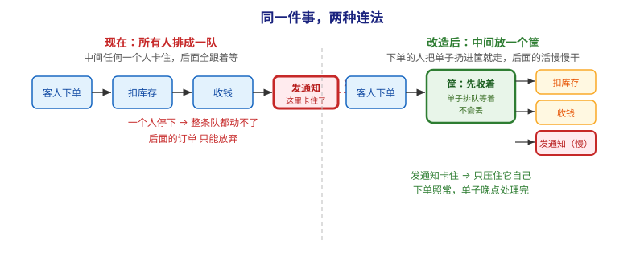
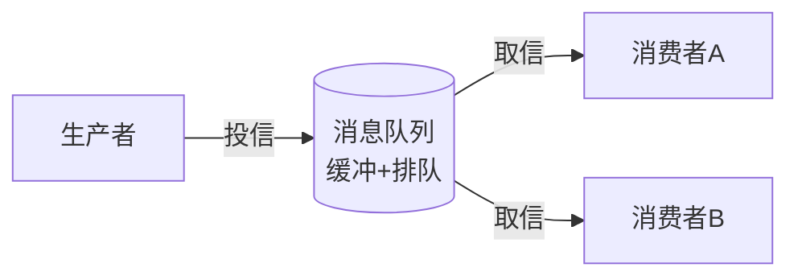
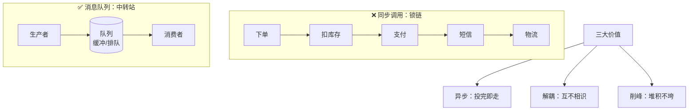

# 第 1 课：为什么需要消息队列

> 所属阶段：阶段 1《为什么需要 Kafka》｜ 水平：零基础 ｜ 本课知识点：直接同步调用的痛点 / 消息队列是什么 / 削峰·异步·解耦
> 故事情节：系统第一次扛不住流量，主角（消息的流动）被直接调用堵死在半路

## 🎯 本课目标

- 用真实场景说清"直接同步调用"为什么会让系统崩溃
- 用生活类比讲清"消息队列"到底是什么
- 解释削峰、异步、解耦三大价值如何对症解决问题

---

## 第一幕：起源与场景引入

> 本课是"动机课"，先不碰 Kafka。我们先制造一个你一定会遇到的麻烦，下一课 Kafka 才会作为"解药"登场。

想象你做了一个很受欢迎的电商小程序。用户下单后，你的代码要**一气呵成**做完这几件事：

1. 扣减库存
2. 调用支付接口
3. 发短信通知用户
4. 更新物流系统

你最直觉的写法，就是**一个接一个地调用**（专业说法：同步调用 / 串行调用）。代码大概长这样：

```
用户下单 → 扣库存 → 调支付 → 发短信 → 更物流 → 返回"下单成功"
```

上线第一天风平浪静。直到双十一零点，流量一下子冲进来——

> 🎬 **场景**：你的"发短信"服务突然变慢了（运营商接口抖动）。结果是：所有下单请求都卡在"发短信"这一步，后面的用户全部拿不到响应，库存也没扣成，页面一直转圈。你手忙脚乱重启服务，但流量还在涌，系统像被掐住喉咙一样喘不过气。

这就是我们要解决的第一个真问题。

> 📌 **一句话本质**：本课做的事，是把**「一件事从头到尾一口气干完」**改成**「先把要办的记下来，回头再慢慢办」**。
>
> ⚖️ **处境对照**（沿用第四幕那组假设数字：峰值 1000 笔/秒，发通知最多扛 200 笔/秒）：
> - **不这么做（一条链干到底）**：第 1 秒就有约 800 笔订单卡在发通知上超时失败，订单直接丢；扣库存、收钱也被一起拖死。
> - **这么做（中间加一个"先收着"的缓冲）**：同样第 1 秒，1000 笔全部"投进去"成功，用户立刻看到"下单成功"；发通知按 200 笔/秒慢慢干，第 5 秒积压消化完，**一条没丢**。
>
> ⏳ **数字来源说明**：以上为本课第四幕的**推算演示值**（用于讲清道理的假设数字），不是真实压测结果。真实系统的数字取决于你的接口耗时、机器数量与并发配置，行业里常见的定性结论是"同步链路任一环节变慢会整体拖慢"，具体倍数需自己压测。

---

## 第二幕：认知冲突

你可能会想："发短信慢，我多开几台机器不就行了？"

慢着——这里藏着三个你加机器也解决不了的矛盾：

- **耦合**：下单逻辑里"写死"了发短信、更物流。任何一环改接口、升级、挂掉，下单就跟着崩。它们被"焊死"在一起。
- **雪崩**：一个不相关的环节（发短信）变慢，整条链路被拖死，连"扣库存"这种核心动作都做不了。
- **积压**：流量一来，请求要么被处理、要么被拒绝，**没有"缓冲带"**。峰值一过，那些被拒绝的订单就永远消失了。

> ❓ **问题**：为什么"加机器"救不了？因为机器是平行的"处理能力"，但你的代码把步骤**串成了一条不能断的锁链**——链子上任何一环卡住，整条链都动不了。你需要的不是更多力气，而是**把锁链改成"中转站"**。

---

## 第三幕：层层揭示

### 一眼全局图（进入细节前先看一眼）



> 看图：**左边**是现在的做法——客人下单后，扣库存、收钱、发通知、更物流排成一队，中间"发通知"一卡住（红框），后面全跟着等，订单只能放弃；**右边**是本课的做法——下单的人把单子扔进中间那个绿色"筐"就走，后面的活儿各自慢慢干。差别在于：**中间多了一个"先收着"的地方，把"一条链"拆成了"两段"**——前面那段立刻完事，后面那段可以慢慢来。

**四条硬约束**说明：① 本图只回答"本课要解决什么问题、靠什么思路"；② 图上不出现术语（消息队列、生产者、消费者这些词都在下面才出场）；③ 已带读图指引；④ 图旁文字能独立说清同一件事。

### 本课地图（分几步走）

| 步 | 这一步要解决什么（人话） | 对应知识点 |
|:--:|------------------------|-----------|
| 1 | 先看清"一条链干到底"到底卡在哪 | 知识点 1：直接同步调用的痛点 |
| 2 | 想个办法把这条链拆开——中间放点什么 | 知识点 2：消息队列是什么 |
| 3 | 说清这么一拆，具体换来哪三个好处 | 知识点 3：削峰 · 异步 · 解耦 三大价值 |

> 只回答"分几步走、现在在哪"；不写机制、不写结论；**不标学习状态**（进度以 `00-学习档案.md` 为准）。

### 知识点 1：直接同步调用的痛点

> 🧭 第 1/3 步｜承接：第一幕里"发短信一慢，整条下单链路全卡死"这个麻烦 → 本步：把它拆开看清楚，到底是哪一种连接方式导致了"一环卡、全链死"

#### 直觉建立（类比）

把你的系统想象成**四个人手拉手传话**：A 对 B 说，B 对 C 说，C 对 D 说。只要 D 去上厕所，A、B、C 全得干等，整条线瘫痪。

更糟的是，如果有一天你想让 C 改成"用对讲机而不是喊话"，你得把 B 和 C 的手重新焊一遍——因为他们的手是牵着的。

> 💡 **类比的边界**：人传话还能"喊一声等回应"，但代码里的同步调用是**死等**——不拿到结果不往下走，期间占着线程/连接资源。

#### 概念与原理

同步调用 = 调用方必须**阻塞等待**被调用方返回，才继续执行。环节之间是"强绑定"关系。


> 看图：这是**一条从左到右的单向链**——每个方框必须等前一个完成才能开始。图中红色高亮的"发短信"一旦变慢，箭头方向（执行顺序）被锁死，前面全卡住。**没有缓冲、没有绕行。**

#### 一句话记住

**同步调用把"步骤"焊成了"锁链"——一环卡，全链死。**

---

### 知识点 2：消息队列是什么

> 🧭 第 2/3 步｜承接：上一步确认了"一条链干到底会一环卡全链死" → 本步：在中间放一个"先收着"的东西，把这条链拆成两段

#### 直觉建立（类比）

消息队列（Message Queue，简称 MQ）就像一个**公司的收发室邮箱**：

- 你（生产者）把信投进邮箱就走，不用等收信人（消费者）当场拆看；
- 信在邮箱里**排队**，不会因为收信人去吃饭就丢；
- 收信人有空了来取，一次取一封或多封，按投信顺序处理。

关键点：你和收信人**互相不认识**，只认这个邮箱。你把"传话锁链"变成了一个**中转站**。

> 💡 **类比的边界**：真实邮箱信取走就没了；MQ 的"消费"有两种模式——取走即删（队列模式）或保留供多人读（发布-订阅模式，Kafka 就是后者为主）。这点第 2 课对比 Kafka 与其他 MQ 时会再讲。

#### 概念与原理

消息队列是一个**介于生产者和消费者之间的缓冲中间件**：生产者把消息（数据）投进去就返回，消费者按自己的节奏来取。双方不直接对话，只和队列打交道。



> 看图：**中间**那个圆圈就是"先收着"的地方——左边的人只管往里放，右边的两拨人只管往外取，两拨人互不认识、互不等待。
>
> 生产者只管"投"，消费者只管"取"。中间那个圆圈就是**解耦+缓冲**的核心。

#### 🗣️ 行话对照

> 讲透后对标：下面这些是你在工作现场能搜到、能对上号的标准叫法。

- **消息队列 / Message Queue（MQ）**：就是本课说的"中间那个先收着的中转站"。在哪遇到：技术选型文档里的"引入 MQ"、招聘要求里的"熟悉 RabbitMQ/Kafka/RocketMQ"、架构图里的 MQ 组件。
- **生产者 Producer / 消费者 Consumer**：就是本课说的"放东西的人"和"取东西的人"。在哪遇到：所有 MQ 的客户端 API 类名（如 Kafka 的 `KafkaProducer` / `KafkaConsumer`）、官方文档的 Quickstart 章节。
- **点对点 vs 发布订阅（Point-to-Point / Pub-Sub）**：就是本课"取走即删"与"保留供多人读"两种模式的标准叫法。在哪遇到：RabbitMQ 的 queue/exchange 文档、Kafka 的 consumer group 文档、面试八股。

#### 一句话记住

**消息队列 = 生产者和消费者之间的"邮箱中转站"，投完即走、排队不丢。**

---

### 知识点 3：削峰 · 异步 · 解耦 三大价值

> 🧭 第 3/3 步｜承接：上一步已经在中间放了个"先收着"的中转站 → 本步：说清这一拆，具体换来哪三个好处

把"邮箱"放回去解决第一幕的麻烦，三类价值同时生效：

| 价值 | 白话解释 | 回扣第一幕的场景 |
|------|----------|------------------|
| **异步** | 生产者发完消息立刻返回，不等处理完 | 下单只负责"把订单投进队列"，0.01 秒就返回"已受理"，用户不转圈 |
| **解耦** | 生产者和消费者互不依赖，只认队列 | "发短信"挂了，不影响"扣库存"；想换短信服务商，只改消费者 |
| **削峰** | 突发流量先在队列里堆积，消费者按自己节奏处理 | 双十一洪峰来了，消息在队列里排队，消费者匀速处理，系统不被冲垮 |

> 💡 注意：**削峰 ≠ 消息凭空消失**。洪峰期间消息会"堆积"，等流量回落，消费者慢慢追上。队列就是那个"缓冲带"。

#### 🗣️ 行话对照（多策略 · 四列对照表）

> 本课讲的是"同一件事的三种好处"，这三种好处在行业里有标准叫法，也有对应的配置项与监控指标：

| 本课说法（人话） | 行业标准叫法 | 典型配置 / 在哪遇到 | 代价 |
|---|---|---|---|
| 投完就走，不等结果 | **异步化 / Asynchronous** | 代码里由"直接调用"改为"发消息"；Kafka 生产者 `acks=0/1` 控制等待程度 | 不能立刻拿到处理结果，需要回调或轮询 |
| 两边互不认识，只认中间那个 | **解耦 / Decoupling** | 架构图里的 MQ 组件；服务间不再直接依赖对方的接口 | 多一个中间件要运维，链路变长、排障更复杂 |
| 洪峰先堆着，慢慢消化 | **削峰填谷 / Peak Shaving、背压 Backpressure** | 监控上体现为"消费延迟 / 积压量"；Kafka 里看 consumer lag | 峰值期间处理会延迟，不能要求实时 |

> 🔴 以上标准叫法均为通用行业术语；对应的 Kafka 具体配置项（如 `acks`）会在第 5 课正式讲，此处只需知道"有这个坐标系"。

#### 一句话记住

**异步让生产者不等、解耦让环节互不影响、削峰让系统不被冲垮——一封信箱，三病同治。**

---

## 第四幕：实操验证

> 本课还没装 Kafka（那是第 3 课），我们用一个**数字推演**验证三大价值，不跑真命令。

假设你的系统平时每秒 100 个订单，双十一峰值每秒 1000 个，而"发短信"最多每秒处理 200 个。

**没有队列（同步）**：
- 第 1 秒：1000 个请求全卡在"发短信"，其中 800 个超时失败 → **订单直接丢失**
- 连锁：扣库存、支付也跟着失败

**有队列（异步 + 削峰）**：
- 第 1 秒：1000 个订单全部"投进队列"成功（投递动作极快），用户立刻看到"下单成功"
- "发短信"消费者以 200/秒匀速处理，队列里堆了 800 条
- 第 5 秒：积压消化完，所有短信发出，**一条没丢**

> ✅ **回扣场景**：你看，同样是"发短信变慢"，有队列时系统只是"暂时排队"，没有"崩溃丢单"。这就是动机课要你记住的感觉。

---

## 第五幕：体系收束

> 📍 **全局定位**：消息队列是"系统间通信的解药"。但本课讲的还是"通用 MQ 思想"——它有很多种实现（RabbitMQ、Redis 队列、Kafka…）。**Kafka 是其中为"高吞吐、分布式、可重放"而生的那一款**，专门对付海量事件流。
> 🔗 **下一步**：下一课《Kafka 是什么》会正式请主角登场，讲清它从哪来、和别的 MQ 差在哪、内部是哪四个角色在协作。

---

## 🐞 常见误区

1. **"消息队列就是缓存（Redis）"**：错。缓存是用来"存计算结果加速读取"的；队列是用来"暂存待处理任务、做异步和解耦"的。虽然 Redis 也能凑合做简单队列，但它在持久化、多消费者协调上弱很多。
2. **"加了队列就绝对不丢消息"**：错。队列能防"峰值冲垮导致丢失"，但如果队列自己磁盘坏了、或你配置了"不持久化"，消息仍会丢。可靠性是下一阶段（阶段 3）的主题。

## 一图总结



> 看图：**上半部分**是"锁链"——一步接一步，中间卡住后面全等；**下半部分**是"中转站"——下单的人把单子放进中间那个筐就走，取的人按自己节奏来；**最下面**是这么一拆换来的三个好处。差别就在于中间多了一个"先收着"的地方。

> **与课首入口的分工（勿混，三方视角）**：「一眼全局图」在课首、问题视角、零术语，给没学过的人看（回答"为什么需要它、靠什么思路"）；「本课地图」在课首、路线视角（回答"分几步走、现在在哪"），是表格不是图；本图在课末、知识视角，给刚学完的人复习用（回答"本课讲了什么"）。三者不可替代、不雷同。

## 课后小测

**Q1**：某公司下单接口里"调支付"和"更物流"是同步调用的。若"更物流"服务突然超时 30 秒，最可能直接导致什么？
- A. 支付成功率上升
- B. 下单接口整体变慢甚至超时失败（库存等核心动作也被拖死）
- C. 消息自动排队，系统无影响
- D. 物流系统自动重试修复下单

<details><summary>答案与解析</summary>

**答案：B**。同步调用是锁链，任一环节超时会使整条链路阻塞，连带"扣库存""调支付"都无法返回，下单接口变慢/失败。这正是"雪崩"。

</details>

**Q2**：消息队列"削峰"的本质是？
- A. 让流量凭空消失
- B. 把突发流量在队列中堆积，消费者按自身速率匀速处理
- C. 自动把多余请求丢弃
- D. 让生产者跑得更快

<details><summary>答案与解析</summary>

**答案：B**。削峰是"缓冲"而非"消灭"——洪峰期间消息堆积，流量回落后消费者慢慢追上，所以一条不丢。

</details>

## 🚀 下一批接力提示词

> 学完本批后，**复制下面这段文字发给 AI**，即可无缝进入下一批（无需重新描述上下文）：

```
继续学 Kafka。我的学习档案在 kafka/00-学习档案.md，
刚学完阶段 1《为什么需要 Kafka》的课《为什么需要消息队列》知识点 直接同步调用的痛点、消息队列是什么、削峰异步解耦，
请按大纲继续讲解下一批知识点（课2：Kafka 是什么 & 起源与定位）。
```

## 🧭 课程导航

➡️ **下一课**：[课 2：Kafka 是什么 & 起源与定位](lesson-02-Kafka是什么与起源定位.md)

📚 **返回目录**：[课程目录](../../../02-课程目录.md)
