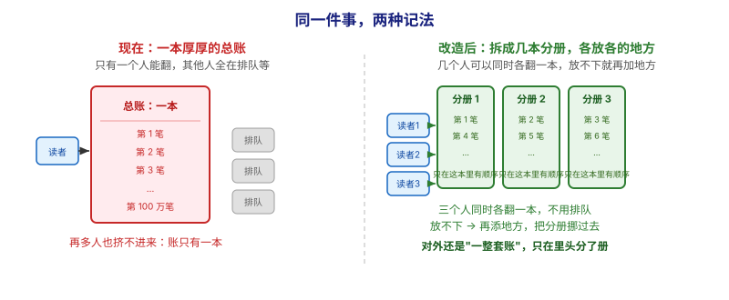
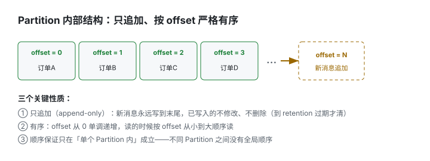
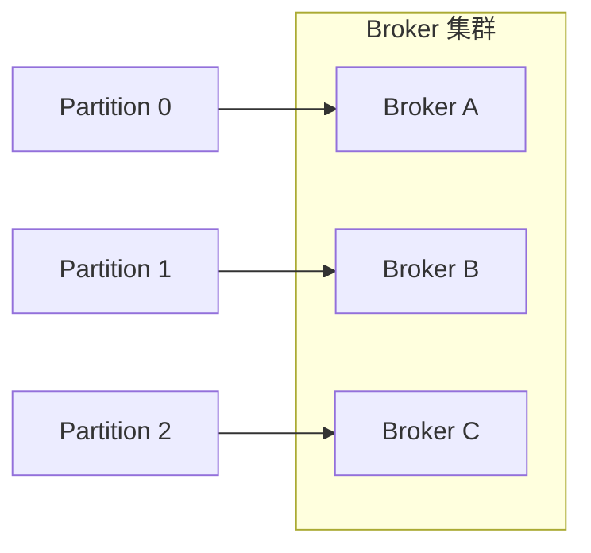
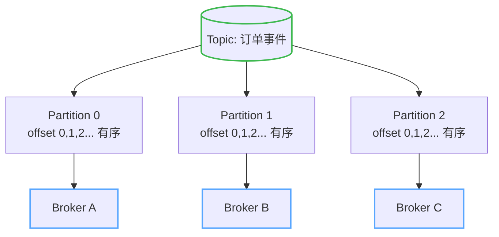

# 第 4 课：Topic、Partition 与 Broker

> 所属阶段：阶段 2《Kafka 核心架构》｜ 水平：零基础 ｜ 本课知识点：Topic 与 Partition / 顺序写磁盘 / 零拷贝 / Broker 与集群
> 故事情节：走进 Kafka 物流中心，看清"货架怎么分、仓库怎么分布、货怎么进出最快"

## 🎯 本课目标

- 用"分册账本"类比讲清 Topic 与 Partition 的分片模型，看懂 Partition 内部的 offset 结构
- 说清「顺序写磁盘」为什么比随机写快
- 说清「零拷贝」如何让数据从磁盘直达网卡
- 说清 Broker 是什么、Partition 如何分布到集群、为什么能横向扩展

---

## 第一幕：起源与场景引入

> 本课正式"走进"第 2 课那座中央枢纽。先不碰生产/消费代码，我们专门看**它内部怎么存数据**——因为存得好不好，直接决定了它能不能扛量。

把第 2 课的"订单事件 Topic"接着往下想。你建了一个 Topic 叫 `订单事件`，所有下单都往里写。一切正常。

直到某天大促，订单每秒涌进来 **100 万条**。你发现：一个消费线程从头到尾按顺序读，每秒最多处理 5 万条——后面 95 万条在排队，**Topic 成了瓶颈**。

> 🎬 **场景**：你有一本巨大的"订单总账"，但只有一个人能一页一页翻着读。人再多也挤不进去，因为账本只有一本。问题来了：**怎么让这本账能"多人同时翻"、还能"无限变厚"？**

> 📌 **一句话本质**：本课做的事，是把**「一本厚总账、一次只能一个人翻」**改成**「同一套账拆成几本分册、分开放、几个人各翻一本」**。
>
> ⚖️ **处境对照**（沿用第一幕与第四幕那组假设数字：峰值 100 万条/秒，单线程最多处理 5 万条/秒）：
> - **不这么做（只有一本总账）**：并行度恒为 **1**，每秒最多处理 **~5 万条**，剩下的 **95 万条**在排队；机器一坏，整本账**全瘫**。
> - **这么做（拆成 3 本分册、摊到 3 台机器）**：3 个读者**同时各翻一本**，上限提到 **~15 万条/秒**；坏 1 台，剩下 2 台继续。
>
> ⏳ **数字来源说明**：以上为**线性推算演示值**（按"并行度 × 单线程能力"算出来的），不是真实压测结果。真实吞吐取决于消息大小、批处理、磁盘与网络，行业里常见的定性结论是"分区数决定消费并行度上限"，具体倍数需自己压测。

---

## 第二幕：认知冲突

你可能会想："那就多建几个 Topic 呗？"

但 Topic 是"业务含义"的分类（订单事件、支付事件…），不能为了提速就乱拆。真正的矛盾是：

- **单 Topic 是一条顺序日志**，只能被**一个消费者顺序读**——天然无法并行；
- **一台机器的磁盘再大也有限**，数据迟早装满。

> ❓ **问题**：能不能做到——Topic 在"逻辑上"还是一个（业务方只管往 `订单事件` 写），但**底层被切成好几段、分散在多台机器上、还能被多个消费者同时读**？这就是 Partition（分区）要解决的。

---

## 第三幕：层层揭示

### 一眼全局图（进入细节前先看一眼）



> 看图：**左边**只有一本厚厚的总账，一次只能一个人翻，后面的人（灰色"排队"）全在干等——**再多人也挤不进来**；**右边**把同一套账拆成 3 本分册，分开放，3 个读者**同时各翻一本**，谁也不等谁；放不下时再添地方、把分册挪过去。关键差别：**对外看起来还是"一整套账"，只在里头分了册**——而且"顺序"只在单本分册内有意义，三本之间互不相干。

**四条硬约束**说明：① 本图只回答"本课要解决什么问题、靠什么思路"；② 图上不出现术语（Topic、Partition、Broker、offset 这些词都在下面才出场）；③ 已带读图指引；④ 图旁文字能独立说清同一件事。

### 本课地图（分几步走）

| 步 | 这一步要解决什么（人话） | 对应知识点 |
|:--:|------------------------|-----------|
| 1 | 看清"一套账拆成几本分册"到底怎么拆、顺序在哪还成立 | 知识点 1：Topic 与 Partition（分片思想） |
| 2 | 为什么它写起来那么快（其一） | 知识点 2：顺序写磁盘 |
| 3 | 为什么它读起来那么快 | 知识点 3：零拷贝 |
| 4 | 这些分册放在哪、怎么越放越多 | 知识点 4：Broker 与集群 |

> 只回答"分几步走、现在在哪"；不写机制、不写结论；**不标学习状态**（进度以 `00-学习档案.md` 为准）。

### 知识点 1：Topic 与 Partition（分片思想）

> 🧭 第 1/4 步｜承接：第一幕里"一本总账只能一人翻、100 万条堵在门口"这个麻烦 → 本步：把这套账拆成几本分册，看清楚顺序在哪还成立、在哪不成立

#### 直觉建立（类比）

把 Topic 想成一整套**同一类业务的账本**，而 **Partition 是这套账本"按册拆分的多本分册"**：

- `订单事件` 这个 Topic = "2026 年所有订单"这一主题；
- 它被拆成 `Partition 0 / 1 / 2` = 三本**独立编号的分册**；
- 每本分册内部，账是**按时间一本正经往下记的**（有序）；但三本分册之间，谁先记哪笔，不保证全局顺序。

> 💡 **类比的边界**：真实账本你合订成一册更方便查；但 Kafka 故意拆成多册，目的不是"好查"，而是"好并行、好扩容"——多个人能同时各翻一册。

#### 概念与原理

- **Topic** 是逻辑上的消息分类（如 `订单事件`）。
- **Partition（分区）** 是 Topic 的**物理分片**：一个 Topic 由 1~N 个 Partition 组成，每个 Partition 是一个**只追加（append-only）、按 offset 严格有序**的日志。
- **offset** 是消息在**单个 Partition 内**的位置编号（0,1,2…），单调递增。



> 看图：**上面**是"一套账"，被拆成**三本带编号的分册**；**每一本里面**是一串按 0、1、2… 编号的格子，新格子永远**加在末尾**（最右边虚线那格），不会插到中间。注意：**编号只在本册内有效**——三本册子各有各的 0、1、2，它们之间不排队、不比先后。

**这套拆法直接决定了两件事**：**并行**的上限 = 分册数（几个读者同时翻）；**扩容**的方式 = 再添地方放分册。记住：**分区是 Kafka 并行与扩展的基本单位**，后面讲生产者、消费者时，所有"并行度"都绕不开 Partition 数量。

#### 🗣️ 行话对照

> 讲透后对标：下面这些是你在任何 Kafka 文档里都会撞见的词，务必与"分册"这个直觉对上。

- **Topic（主题）**：就是本课说的"一整套账"。在哪遇到：`kafka-topics.sh --create --topic xxx`；**它只是逻辑名，不存数据**。
- **Partition（分区）**：就是本课说的"分册"。在哪遇到：`--partitions 3`；**真正存数据、真正有序的是它**，也是并行度的天花板。
- **Offset（位移）**：就是本课说的"格子编号"。在哪遇到：`--describe` 的位移字段、消费者"读到第几格"的进度、监控里的积压（lag）计算。**只在单个分区内有效**。
- **只追加（append-only）+ 分区内有序**：就是本课说的"永远加在末尾、本册内按顺序"。在哪遇到：官方文档 `Design` 与 `Implementation → Log` 章节；**"Kafka 只保证分区内有序"是面试与方案评审的高频考点**。

#### 一句话记住

**Topic 是逻辑分类，Partition 是物理分片；分区内有序，跨分区不保证全局顺序。**

---

### 知识点 2：顺序写磁盘（为什么快 · 上）

> 🧭 第 2/4 步｜承接：上一步把账拆成了分册（解决了并行） → 本步：回答另一个问题——为什么它往本子上记东西能这么快

#### 直觉建立（类比）

一般人觉得"写磁盘慢"。但 Kafka 反着用：**在账本最后一页接着写**，而不是"翻到第 372 页改一个字"。

- **顺序写** = 磁头沿一个方向一路写到底，不用来回寻道；
- **随机写** = 磁头在盘面东跳西跳，每次都要"找位置"，极慢。

> 💡 **类比的边界**：这个快主要是"相对随机写"而言。磁盘的**顺序 I/O**吞吐很高（机械盘可达数百 MB/s），Kafka 通过"永远追加末尾"把零散的随机写变成了整条顺序写。

#### 概念与原理

Kafka 把消息按到达顺序**追加到日志末尾**，磁盘磁头顺序移动、无需随机寻道，从而榨干磁盘的顺序吞吐。


> 看图：**上面**那排箭头一路朝右、顺着走到底 = 顺序写，**下面**那排箭头在盘面上东跳西跳 = 随机写。同样的写入量，下面那种要不停"找位置"，大部分时间花在**寻道**上而不是真正写。这就是"往末尾追加"能榨出高吞吐的原因。

#### 🗣️ 行话对照

> 讲透后对标：这是"Kafka 为什么快"被问得最多的第一条，记住它的标准说法。

- **顺序 I/O（Sequential I/O）**：就是本课说的"一路朝右写到底"。在哪遇到：所有讲 Kafka 性能的文章；对比项通常是随机 I/O。
- **随机 I/O（Random I/O）**：就是本课说的"东跳西跳找位置"。在哪遇到：传统数据库 B 树更新行记录的典型代价；**Kafka 刻意回避它**。
- **只追加日志（append-only log）**：就是本课说的"永远往末尾记"。在哪遇到：Kafka/Pulsar/数据库 WAL 的共同设计；**这也是"消息不可变"的由来**。
- **页缓存 `pagecache`**：就是本课说的"操作系统顺手帮你留的那块高速区"。在哪遇到：讲"Kafka 为什么敢直接用磁盘"的文章——**它靠的是操作系统的页缓存，而不是自己管内存**。

#### 一句话记住

**永远往日志末尾追加，把"随机写"变成"顺序写"，磁盘吞吐直接拉满。**

---

### 知识点 3：零拷贝（为什么快 · 下）

> 🧭 第 3/4 步｜承接：上一步解释了"写得快" → 本步：解释另一半——为什么"读出去"也能这么快

#### 直觉建立（类比）

零拷贝 = **仓库直接把货从货架搬上传送带发货**，不经过中间临时台（少倒一次手）。传统方式，货要在好几个台子间倒腾好几遍才上卡车。

> 💡 **类比的边界**：零拷贝不是"不拷贝"，而是**让操作系统内核直接把磁盘数据发到网卡**，跳过"先拷到应用程序内存"这多余一步。你只需记住：少了一次搬运，更快更省 CPU。

#### 概念与原理

消费者读消息时，若走传统路线，数据要经历「磁盘 → 内核缓冲 → 用户缓冲 → Socket 缓冲 → 网卡」共 4 次拷贝；Kafka 用 **sendfile（零拷贝）**，让内核直接把页缓存里的数据发到网卡，只剩 2 次拷贝，CPU 和内存带宽开销大幅下降。


> 看图：**上面**那条路要倒腾**四次**（磁盘 → 内核区 → 应用区 → 发送区 → 网卡），中间还要在内核态和用户态之间来回切换；**下面**那条路把"先搬到应用区再搬回去"这趟冤枉路省掉了，只剩**两次**，直接从内核区发到网卡。少搬两次 = 更快、更省 CPU。

#### 🗣️ 行话对照

> 讲透后对标：这是"Kafka 为什么快"的第二条标准答案。

- **零拷贝（Zero-Copy）**：就是本课说的"少倒一次手"。在哪遇到：Kafka、Netty、Nginx 的高性能讨论里几乎必提。
- **`sendfile` 系统调用**：就是本课说的"让内核直接发货"的那个开关。在哪遇到：Linux 系统调用文档；Java 侧的 `FileChannel.transferTo()` 就是它的封装。
- **内核态 / 用户态切换（context switch）**：就是本课说的"来回换场地"。在哪遇到：性能分析文章；**零拷贝省下的不只有拷贝，还有这层切换开销**。
- **页缓存直发（pagecache → NIC）**：就是本课说的"从内核那块高速区直接上卡车"。在哪遇到：讲 `sendfile` 原理的图；**这也是为什么读刚写过的消息特别快**。

#### 一句话记住

**零拷贝让内核把数据从磁盘直达网卡，少倒一次手，更快更省 CPU。**

---

### 知识点 4：Broker 与集群

> 🧭 第 4/4 步｜承接：前三步解决了"怎么拆、怎么写得快、怎么读得快" → 本步：回答最后一件——这些分册到底放在哪，放不下了怎么办

#### 直觉建立（类比）

**Broker = 一座仓库（一台 Kafka 服务器进程）**；**集群 = 好几座仓库连在一起**。那些"分册"（Partition）不能只堆在一座仓库里——要分散到不同仓库，这样：一座仓库着火（机器宕机），别的仓库还能顶上；货太多，就多盖几座仓库一起放。

#### 概念与原理

- **Broker** 是运行 Kafka 的**服务器进程**，一台机器上通常跑一个。
- 一个 Topic 的多个 Partition **分布在不同 Broker 上**（打散存放）。
- 一堆 Broker 组成一个**集群（Cluster）**，对外像一个整体。



> 看图：**右边**虚线框里是"仓库群"（一个整体），里面三个蓝框是三座独立的仓库；**左边**三本分册**各进一座仓库**，不堆在一起。这样放有两个直接后果：一座仓库出事，只影响它那本分册；货多了就再加一座仓库，把分册挪过去。

关键点（零基础先记住这 2 条）：

1. **Partition 在 Broker 间打散** → 单台机器坏掉，只是部分 Partition 暂时不可用，集群整体不塌（真正的"坏掉自动接管"靠副本，下阶段第 7 课细讲）。
2. **加机器 = 加 Broker = 能放下更多 Partition = 能扛更多量** → 这就是 Kafka 能"横向扩展"的根本原因。

#### 🗣️ 行话对照

> 讲透后对标：这四个词是运维和排障现场的高频词。

- **Broker（代理节点）**：就是本课说的"一座仓库"。在哪遇到：`server.properties`、`broker.id`、监控里按 broker 拆的指标。**它是进程，不是一台物理机**。
- **Cluster（集群）**：就是本课说的"仓库群"。在哪遇到：`--bootstrap-server` 后面填的是集群入口；`kafka-cluster.sh` 等工具。
- **`num.partitions`（默认分区数）**：就是本课说的"新建通道默认分几册"。在哪遇到：broker 级配置；**没显式指定分区数时生效的值**。
- **横向扩展（scale-out）**：就是本课说的"加仓库而不是换更大的仓库"。在哪遇到：容量规划文档；**这是 Partition + Broker 这套设计的最终目的**。
- **分区重分配 `kafka-reassign-partitions.sh`**：就是本课说的"把分册挪到新仓库"。在哪遇到：**扩容后必做的一步**——分册不会自动搬家。

#### 一句话记住

**Broker 是仓库，集群是仓库群；Partition 打散在 Broker 上，加机器就能加容量。**

---

## 第四幕：实操验证

> 上一课（第 3 课）你已经在本地起了 Kafka 并会跑 `kafka-topics.sh --describe`。这里用一个**数字推演 + 一条命令**回扣第一幕的"100 万订单/秒"瓶颈。

假设 `订单事件` Topic 的情况对比：

| 配置 | 并行读能力 | 每秒处理上限 | 机器故障影响 |
|------|-----------|--------------|--------------|
| 1 个 Partition / 1 个 Broker | 1 个消费线程 | ~5 万条 | 机器坏 = 全瘫 |
| 3 个 Partition / 3 个 Broker（一个消费组 3 个消费者） | 3 个消费线程并行 | ~15 万条 | 坏 1 台，剩 2 台继续 |

你可以在第 3 课的容器里亲手验证"3 个分区"长什么样：

```
# 创建一个 3 分区的 topic，再看它的分区分布
docker exec -it kafka /opt/kafka/bin/kafka-topics.sh --create \
  --topic orders --partitions 3 --replication-factor 1 \
  --bootstrap-server localhost:9092

docker exec -it kafka /opt/kafka/bin/kafka-topics.sh --describe \
  --topic orders --bootstrap-server localhost:9092
# 预期输出会列出 Partition: 0 / 1 / 2 三行，每行有 Leader/Replicas/ISR
```

> ✅ **回扣场景**：你看，把 Topic 切成 3 个 Partition、铺到 Broker、配 3 个消费者——并行度直接翻 3 倍，单机故障也不再是"全瘫"。**Topic 逻辑还是一个，底层已被 Partition + Broker 拆开并行了。**

---

## 第五幕：体系收束

> 📍 **全局定位**：Topic / Partition / Broker 是 Kafka 的**存储骨架**——Topic 是分类，Partition 是分片（并行单位），Broker 是载体（扩展单位）。顺序写 + 零拷贝是这个骨架"跑得快"的引擎。
> 🔗 **下一步**：骨架有了，数据怎么**写进去**？下一课《第 5 课：生产者 Producer》讲"发货方"如何把消息打包、选好分区、送进仓库。

---

## 🐞 常见误区

1. **"Partition 越多越好"**：错。Partition 数 = 消费并行度的上限，但太多会带来副作用——更多的开放文件句柄、更长的消费者再均衡（rebalance）时间、控制器管理负担加重。要按"目标吞吐 / 单分区吞吐"合理设，不是无脑拉满。
2. **"Topic 内部全局有序"**：错。**只有单个 Partition 内有序**（按 offset）；跨 Partition 不保证顺序。如果业务要求"同一用户的订单严格先后"，要靠"相同 key 落到同一分区"来保证（这是第 5 课分区策略的内容）。
3. **"Broker 必须是一台独立物理服务器"**：错。Broker 只是个**进程**，可以跑在物理机、虚拟机或容器里。重要的是"多个 Broker 组成集群"，而不是每台都是独立硬件。

## 📚 官方文档

- [Kafka 核心概念与术语（4.3）](https://kafka.apache.org/43/getting-started/introduction/)：Topic / Partition / Broker / offset 的官方定义
- [Kafka 日志存储实现（4.3）](https://kafka.apache.org/43/implementation/log/)：存储模型、分段与压实机制的权威说明

## 一图总结



> 看图：**最上面**是"一整套账"（逻辑上的分类），它**拆成**三个带编号的分册，每本内部按 0、1、2… 有序；三本分册**各落在一座仓库**里。四层从上到下就是本课的骨架：**分类 → 分片 → 有序 → 分散存放**。

> **与课首入口的分工（勿混，三方视角）**：「一眼全局图」在课首、问题视角、零术语，给没学过的人看（回答"为什么需要它、靠什么思路"）；「本课地图」在课首、路线视角（回答"分几步走、现在在哪"），是表格不是图；本图在课末、知识视角，给刚学完的人复习用（回答"本课讲了什么"）。三者不可替代、不雷同。

## 课后小测

**Q1**：关于 Kafka 的消息顺序，下列说法正确的是？
- A. 同一个 Topic 内所有消息全局严格有序
- B. 同一个 Partition 内消息按 offset 严格有序，跨 Partition 不保证
- C. Partition 之间也按 offset 全局有序
- D. Kafka 完全不保证任何顺序

<details><summary>答案与解析</summary>

**答案：B**。Kafka 的"有序"是**分区级别**的：消息在单个 Partition 内按 offset 单调递增、严格有序；跨 Partition 没有全局顺序。若业务需要某类消息有序，要靠相同 key 落到同一分区（第 5 课）。

</details>

**Q2**：一个 Topic 有 3 个 Partition，一个消费者组内最多能让几个消费者同时并行消费它？
- A. 1 个
- B. 3 个
- C. 任意多个，想加多少加多少
- D. 取决于 Broker 数量，与 Partition 无关

<details><summary>答案与解析</summary>

**答案：B**。Kafka 中**一个 Partition 在同一时刻只能被组内一个消费者消费**，所以并行消费上限 = Partition 数。3 个分区最多 3 个消费者并行；想再多加消费者也闲着（除非增加分区数）。

</details>

## 🚀 下一批接力提示词

> 学完本批后，**复制下面这段文字发给 AI**，即可无缝进入下一批（无需重新描述上下文）：

```
继续学 Kafka。我的学习档案在 kafka/00-学习档案.md，
刚学完阶段 2《Kafka 核心架构》的课《Topic、Partition 与 Broker》知识点 Topic与Partition、顺序写磁盘、零拷贝、Broker与集群，
请按大纲继续讲解下一批知识点（课5：生产者 Producer）。
```

## 🧭 课程导航

⬅️ **上一课**：[课 3：本地起 Kafka + CLI 快速上手](lesson-03-本地起Kafka与CLI快速上手.md)

➡️ **下一课**：[课 5：生产者 Producer](lesson-05-生产者Producer.md)

📚 **返回目录**：[课程目录](../../../02-课程目录.md)
