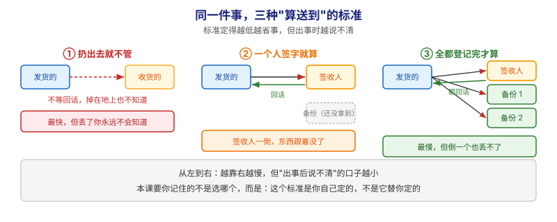
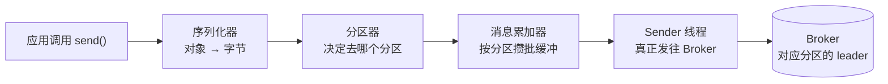
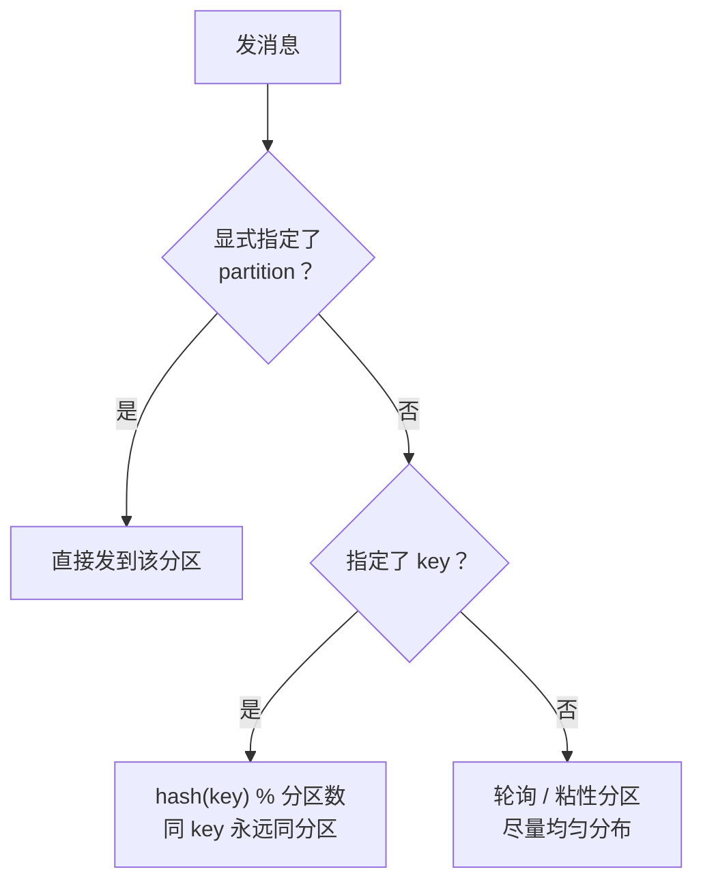
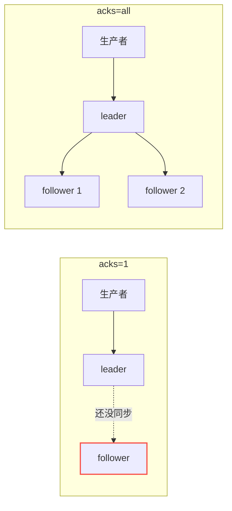
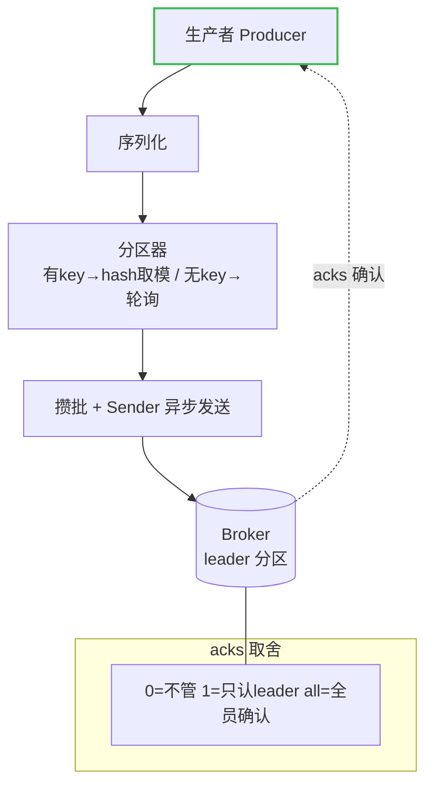

# 第 5 课：生产者 Producer

> 所属阶段：阶段 2《Kafka 核心架构》｜ 水平：零基础 ｜ 本课知识点：生产者发送流程 / 分区策略 / acks 与发送可靠性
> 故事情节：发货方上场——一条消息是怎么被打包、选好货架、送进仓库的

## 🎯 本课目标

- 画出一条消息从应用到 Broker 的发送路径
- 解释分区策略：key 如何决定消息落到哪个 Partition
- 说清 acks=0 / 1 / all 对"可靠性 vs 性能"的取舍

---

## 第一幕：起源与场景引入

> 上一课我们看的是 Kafka「怎么存」——Topic 分片、Broker 集群。这一课回到故事的起点：消息是怎么**进入** Kafka 的。主角（消息的流动）要先被「发货方」正确地送进仓库，后面的存储、消费才有意义。

还记得第 3 课你干过的事吗？你敲了这样一条命令：

```bash
docker exec -it kafka /opt/kafka/bin/kafka-console-producer.sh \
  --topic orders --bootstrap-server localhost:9092
```

然后随便敲几行字、回车，消息就「进 Topic」了。当时你只是在**用**生产者，没关心它背后发生了什么。现在我们把这块黑盒拆开。

> 🎬 **场景**：你现在是一家电商的「下单服务」——每来一个订单，你就往 Kafka 发一条消息。你心里其实有三个没底的问题：
> 1. 这条消息发出去，中间要经过哪几道工序才真正落到 Broker 的磁盘上？
> 2. 一个 Topic 有 3 个分区，这条消息到底进了哪个分区？凭什么？
> 3. 你按下「发送」那一刻，就真的「发送成功」了吗？如果 Broker 恰好挂了，消息是丢了还是被救回来了？

这就是生产者（Producer）要回答的三件事。

> 📌 **一句话本质**：本课做的事，是把**「把东西往门口一放就当完事」**改成**「先说清楚算'送到'的标准，再按这个标准发、并按这个标准等回话」**。
>
> ⚖️ **处境对照**（沿用知识点 3 的三档签收标准，以"发货后收货方立刻出事"为假设场景）：
> - **不这么做（扔出去就不管 / 只一个人签字）**：出事时你**根本不知道**东西丢了（档①），或以为送到了、其实备份还没拿到就跟着一起没了（档②）——**丢了也没有补救线索**。
> - **这么做（全都登记完才算送到）**：出事前就知道没送到（会报错/重试），**要么确认送到、要么明确知道失败**；代价是每批都要等最慢的那个登记完，速度最慢。
>
> ⏳ **数字来源说明**：以上为**定性对照**（按三档标准的语义推演），不是实测吞吐对比。真实的"快多少/慢多少"取决于副本数、网络往返与批处理配置，行业里常见的定性结论是"可靠性与延迟不可兼得"，具体倍数需自己压测。

---

## 第二幕：认知冲突

你可能觉得：「发消息不就是把数据丢过去吗，有什么好学的？」

但两个矛盾马上就冒出来：

- **分区怎么选？** 第 4 课你知道了——分区内有序、跨分区无序。那生产者发消息时，**凭什么决定**这条消息进哪个分区？如果它乱发，同一笔订单的先后顺序不就乱套了？如果它只会轮着发，那「想保证顺序」的业务（比如同一用户的订单必须按时间先后处理）怎么办？
- **发出去 = 成功了吗？** 你调用了 `send()`，方法返回了。但这代表 Broker 真的写进磁盘了吗？如果消息还在「半路」上 Broker 就挂了，是丢了、还是客户端会自动重试？你作为下单服务，敢不敢「只发一次就认为成功了」？

> ❓ **问题**：生产者既不能「乱选分区」，也不能「发了就不管」。它需要一套机制，既能**决定消息去哪**，又能**确认消息真的落地了**。这正是本课要拆的「发送流程」「分区策略」「acks 可靠性」三件事。

---

## 第三幕：层层揭示

### 一眼全局图（进入细节前先看一眼）



> 看图：**从左到右是三档"算送到"的标准**。**①** 扔出去就不管（红色虚线，不等回话）——最快，但掉在地上你永远不会知道；**②** 一个人签字就算（绿色回话箭头）——比①稳，可备份还没拿到时签字人一倒，东西跟着没了；**③** 全都登记完才算——最慢，但倒一个也丢不了。差别在于：**"算送到"这条线画在哪里，是你自己定的**；画得越低越省事，出事时越说不清。

**四条硬约束**说明：① 本图只回答"本课要解决什么问题、靠什么思路"；② 图上不出现术语（生产者、acks、leader、ISR 这些词都在下面才出场）；③ 已带读图指引；④ 图旁文字能独立说清同一件事。

### 本课地图（分几步走）

| 步 | 这一步要解决什么（人话） | 对应知识点 |
|:--:|------------------------|-----------|
| 1 | 先看清一件东西发出去，中间到底过了几道手 | 知识点 1：生产者发送流程 |
| 2 | 弄明白它凭什么决定落在哪一条上 | 知识点 2：分区策略 |
| 3 | 定下"算送到"的标准，看清三档标准的代价 | 知识点 3：acks 与发送可靠性 |

> 只回答"分几步走、现在在哪"；不写机制、不写结论；**不标学习状态**（进度以 `00-学习档案.md` 为准）。

### 知识点 1：生产者发送流程

> 🧭 第 1/3 步｜承接：第一幕里"消息发出去中间要经过哪几道工序"这个疑问 → 本步：把发货黑盒拆开，看清从"你要发"到"货进仓"的每一道手

#### 直觉建立（类比）

把生产者想成一个**发货部门**，一条消息从「你要发货」到「货进仓库」要过四道工序：

1. **打包**（序列化）：你手里是个「订单对象」，但物流只认得「一箱货」。得先把它装成能运输的样子（对象 → 字节）。
2. **选货架**（分区）：货进了仓库，得决定放进哪一条传送带（分区）。
3. **暂存待发**（消息累加器）：不是来一件发一件，而是**先堆在发货区，攒够一批再发**，省油省时。
4. **装车发出**（Sender 线程）：专门有一辆「送货的卡车」把攒好的货，一批批运到仓库。

> 💡 **类比的边界**：真实发货是「一件一件打包」，但 Kafka 的打包（序列化）和发送是**异步**的——你调用 `send()` 只是把货放进了「发货区」，真正「装车运走」是后面一个独立线程在干。所以 `send()` 返回 ≠ 消息已到 Broker，这是新手最容易误会的一点。

#### 概念与原理

生产者（Producer）把一条消息送进 Broker，内部要经过这几步：



> 看图：**从左到右是一条单向流水线**——先把"订单对象"装成能运输的字节，再决定放进哪一条，然后在**发货区按分区攒起来**（不是来一件发一件），最后由专门的卡车**一批批运走**。注意**分岔点在第 3 格**：货是在这里"等一等攒成批"的，这也是它快的秘密；而"应用调用 send"只到这一格就返回了，后面是另一个线程在干。

关键点（零基础先记住这 4 个角色）：

1. **序列化器（Serializer）**：把对象转成字节。发字符串要用 `StringSerializer`，发 JSON 要自定义序列化。
2. **分区器（Partitioner）**：决定消息进哪个分区（知识点 2 详讲）。
3. **消息累加器（RecordAccumulator）**：按分区把消息**攒成一批（batch）**再发，这是 Kafka 高吞吐的关键——「批量发货」比「一件一送」快得多。
4. **Sender 线程**：真正把攒好的批次发到对应分区的 leader Broker。

> 💡 重点：`send()` 是**异步**的，它把消息放进累加器就返回了，真正发网是 Sender 线程在后台干。所以「send 返回」和「Broker 收到」之间有时间差——这就是为什么后面要讲 acks（确认机制）。

#### 🗣️ 行话对照

> 讲透后对标：这四个零件有固定叫法，看源码和排查问题时都会遇到。

- **Serializer（序列化器）**：就是本课说的"打包"。在哪遇到：配置项 `key.serializer` / `value.serializer`；**配错会直接抛 `SerializationException`**。
- **Partitioner（分区器）**：就是本课说的"选货架"。在哪遇到：配置项 `partitioner.class`；默认实现按 key 哈希。
- **RecordAccumulator（消息累加器）**：就是本课说的"发货区、攒批"。在哪遇到：`batch.size`（每批多大）、`linger.ms`（最多等多久）——**这两个是生产者调优最常用的旋钮**。
- **Sender 线程**：就是本课说的"送货卡车"。在哪遇到：线程名 `kafka-producer-network-thread`；**它是后台线程，崩溃时未发出的批会丢**。
- **`send()` 返回 Future / 回调**：就是本课说的"发完给你一张回执单"。在哪遇到：`.get()` 阻塞等结果，或传 `Callback` 异步收结果；**"发了就不管"是丢消息还查不出来的典型原因**。

#### 一句话记住

**生产者 = 序列化打包 → 分区选路 → 攒批暂存 → Sender 线程异步发出，四道工序。send 返回 ≠ 已落地。**

---

### 知识点 2：分区策略

> 🧭 第 2/3 步｜承接：上一步看清了"攒批暂存"那一格 → 本步：回答它凭什么决定这一批落在哪一条上（这也决定了顺序还成不成立）

#### 直觉建立（类比）

货进仓库前，发货部门要决定放哪条传送带。规则就像「按快递单号分配快递柜」：

- 单号上有「片区编号」的，永远投进**固定的那格**（同一用户永远同一格，方便按顺序取）；
- 没写片区编号的，就**轮流投**，保证每格都差不多满。

> 💡 **类比的边界**：真实快递柜你可以「按货的大小」分格；Kafka 的分区只看三样东西——**有没有指定分区、有没有指定 key、两者都没有**，不看消息内容本身。

#### 概念与原理

生产者决定消息去哪个 Partition，只有三种情况（按优先级）：



> 看图：**从上到下是三个岔路口，按顺序判断**——先看"有没有指定第几条"（有就直接去那一条，优先级最高）；没有再看"有没有带上名字"（有就按名字算出一个固定编号，**同名永远同一条**）；两个都没有才走最下面"轮着来"。**顺序保证就藏在中间那条路里**：只要带上名字，同一名字的东西就永远排在同一条上。

1. **显式指定 partition**：代码里直接写死去第 2 个分区（`ProducerRecord` 带分区号），优先级最高。
2. **指定了 key（最常见）**：按 `hash(key) % 分区数` 计算（Kafka 默认用 **murmur2 哈希**）。**同一个 key 永远落到同一个分区**——这就是「保证顺序」的钥匙：同一用户的订单用 `userId` 当 key，就天然有序了。
3. **两者都没有**：老版本是**轮询（round-robin）**，一条换一个分区；**Kafka 2.4 起默认改为「粘性分区（sticky partitioning）」**——把连续的一批消息尽量发到同一个分区，减少「切换分区」的开销，吞吐更高（核查于 2026-08）。

> 💡 这里直接回答了第 4 课留下的那个问题：「同一用户的订单严格先后」怎么办？——**用 userId 当 key**，这些消息就都进同一个分区，顺序就有保证了。

#### 🗣️ 行话对照

> 讲透后对标：分区策略只有三种，是面试和方案评审的固定考点。

- **指定分区（specified partition）**：就是本课说的"直接写明放哪条"。在哪遇到：`ProducerRecord(topic, partition, key, value)` 这个四参构造。
- **按键哈希（key hashing）**：就是本课说的"按名字算固定编号"。在哪遇到：**默认分区器 `DefaultPartitioner`**；Kafka 用 **murmur2** 哈希取模。
- **粘性分区（Sticky Partitioning）**：就是本课说的"轮着来"的新版做法。在哪遇到：**Kafka 2.4 起默认**，把连续一批尽量粘在同一分区，减少切换开销、吞吐更高（核查于 2026-08）。
- **自定义分区器 `partitioner.class`**：就是本课说的"自己定规矩"。在哪遇到：需要按业务规则（如按地区、按租户）路由时替换默认实现。
- ⚠️ **易错点**：分区数变化会让 `hash(key) % 分区数` 的结果整体改变——**加分区会打乱"同 key 同分区"的历史分布**，涉及顺序的场景加分区要慎重。

#### 一句话记住

**分区三选一：有 partition 直发，有 key 就 hash 取模（同 key 同分区），都没有就轮询/粘性。**

---

### 知识点 3：acks 与发送可靠性

> 🧭 第 3/3 步｜承接：前两步解决了"怎么送、送到哪" → 本步：回答第一幕最关键的那一问——按下"发送"到底算不算送到了

#### 直觉建立（类比）

你寄一封重要快递，快递公司给你三种「签收标准」：

- **投出去就不管**：往邮筒一塞，不查有没有送到。最快，但丢了也不知道。
- **签收人本人签收**：收件人（leader）签字就当你送到了。但如果签收人签字后、还没来得及转交给仓库（follower），他自己突然消失了，快递还是可能丢。
- **签收 + 所有仓库都登记完**：不仅收件人签收，还要所有「备份仓库」都登记入册，才告诉你「送到了」。最慢，但最稳。

> 💡 **类比的边界**：这个「签收标准」就是 Kafka 的 `acks` 参数。它控制的是**生产者要等多少个副本确认，才算发送成功**——本质是在「快」和「不丢」之间做取舍。

#### 概念与原理

`acks` 有三个取值，可靠性递增、性能递减：

| acks | 含义 | 可靠性 | 性能 | 一句话 |
|------|------|--------|------|--------|
| **0** | 发出去就不等任何确认 | 最差，可能丢 | 最快 | 丢了也不管 |
| **1** | leader 写进本地日志就返回 | 中（leader 挂了可能丢） | 中 | 只认「头儿」签收 |
| **all（-1）** | 所有 ISR 副本都确认才返回 | 最强 | 最慢 | 全员签收才算数 |

三个关键补充：

1. **为什么 `acks=1` 会丢？** 因为 leader 返回确认时，数据可能还没同步到 follower。若 leader 在这时宕机，已确认的消息就丢了（这正是第 7 课要讲的副本机制的坑）。
2. **`acks=all` 就绝对不丢吗？** 还不够。要配合 **`min.insync.replicas`**（最小同步副本数）：它规定「ISR 至少要有几个副本，才接受写入」。如果设 `acks=all` 但 `min.insync.replicas=1`，那么 ISR 只有一个副本时照样写、照样丢。所以「不丢」= `acks=all` + `min.insync.replicas≥2` 一起用。
3. **默认值**：早期 Kafka 默认 `acks=1`，**Kafka 3.0 起默认改为 `all`**（更安全，但更看重吞吐的场景要自己调回 1）（核查于 2026-08）。



> 看图：**左边 `acks=1`**：生产者只等"签收人"一个回话（实线去、实线回），备份那条是**红色虚线——还没拿到**。这中间的空档就是丢东西的窗口：签收人此刻一倒，东西就没了。**右边 `acks=all`**：签收人加两个备份**全部拿到**才回话，窗口消失。差别只在"等几个回话"。

#### 🗣️ 行话对照（多策略 · 四列对照表）

> 本课讲的是"同一件事（确认送到）的三种标准"，这是 Kafka 可靠性取舍里最经典的一组：

| 本课说法（人话） | 行业标准叫法 | 典型配置 / 在哪遇到 | 代价 |
|---|---|---|---|
| 扔出去就不管 | `acks=0`（fire and forget） | 客户端配置 `acks=0` | 最快；**丢了完全不知情**，连报错都没有 |
| 一个人签字就算 | `acks=1`（leader 确认） | 客户端配置 `acks=1` | 快；**leader 已确认但未同步时宕机 → 丢** |
| 全都登记完才算 | `acks=all`（也叫 `acks=-1`，ISR 全体确认） | 客户端配置 `acks=all` **且** broker 配 `min.insync.replicas≥2` | 最慢；**不丢**，但 ISR 不足时写入会失败（可用性下降） |

> 🔴 **最常见的错误搭配**：只设 `acks=all` 却留着 `min.insync.replicas=1`——此时 ISR 只剩 1 个副本照样写、照样丢，**"配了 all"带来的安全感是假的**。两个必须一起设。
> 📌 **默认值变化**：早期 Kafka 默认 `acks=1`；**Kafka 3.0 起默认改为 `all`**（核查于 2026-08）——也就是说，你现在不配就已经是较安全的那档了。

#### 一句话记住

**acks 是「要几个副本确认」：0 最快最易丢，1 只认 leader，all 全员确认才不丢（还得配 min.insync.replicas）。**

---

## 第四幕：实操验证

> 我们用第 3 课的真集群，亲手验证「同 key 同分区」这条最关键的结论。先确保 Kafka 在跑、`orders` 有 3 个分区（没有就重建）：

```bash
# 1. 若容器已停，重新起（第 3 课的命令）
docker run -d --name kafka -p 9092:9092 \
  -e KAFKA_NODE_ID=1 -e KAFKA_PROCESS_ROLES='broker,controller' \
  -e KAFKA_CONTROLLER_QUORUM_VOTERS='1@kafka:29093' \
  -e KAFKA_LISTENERS='PLAINTEXT://0.0.0.0:9092,CONTROLLER://0.0.0.0:29093' \
  -e KAFKA_ADVERTISED_LISTENERS='PLAINTEXT://localhost:9092' \
  -e KAFKA_CONTROLLER_LISTENER_NAMES='CONTROLLER' \
  -e KAFKA_LISTENER_SECURITY_PROTOCOL_MAP='CONTROLLER:PLAINTEXT,PLAINTEXT:PLAINTEXT' \
  -e KAFKA_LOG_DIRS='/tmp/kraft-logs' \
  -e CLUSTER_ID='MkU3OEVBNTcwNTJENDM2Qk' apache/kafka:4.0.0

# 2. 建 3 分区的 topic（若已存在可跳过）
docker exec -it kafka /opt/kafka/bin/kafka-topics.sh --create \
  --topic orders --partitions 3 --replication-factor 1 --bootstrap-server localhost:9092
```

**验证「同 key 同分区」**：生产端用 `--property parse.key=true` 让 CLI 支持 `key:value` 格式：

```bash
docker exec -it kafka /opt/kafka/bin/kafka-console-producer.sh \
  --topic orders --property parse.key=true --property key.separator=: \
  --bootstrap-server localhost:9092
# 逐行输入（key:value），Ctrl+C 退出：
> user1:第一条订单
> user1:第二条订单
> user1:第三条订单
> user2:另一条订单
```

再开一个消费端，**打印每条消息的 key 和它所在的分区号**：

```bash
docker exec -it kafka /opt/kafka/bin/kafka-console-consumer.sh \
  --topic orders --from-beginning \
  --property print.key=true --property print.partition=true \
  --bootstrap-server localhost:9092
```

预期输出大致是（分区号可能不同，但**关键在规律**）：

```
Partition:1  user1  第一条订单
Partition:1  user1  第二条订单
Partition:1  user1  第三条订单
Partition:2  user2  另一条订单
```

> ✅ **回扣场景**：你看，`user1` 的三条消息**全部落在同一个 Partition（1）**，`user2` 落在另一个（2）。这就是「hash(key) % 分区数」在起作用——同一 key 永远同分区，顺序天然有保证。这也正是第 4 课「同一用户订单严格先后」的答案，现在你亲手验证了它。

---

## 第五幕：体系收束

> 📍 **全局定位**：故事主线是「消息的流动」。上一课（第 4 课）讲的是消息「住在哪」（存储骨架：Topic / Partition / Broker），这一课讲的是消息「怎么进来」——生产者是 Kafka 的**入口**。发送流程（怎么送）、分区策略（送到哪）、acks（送到没送到）三者合起来，就是一个「负责任的发货方」。
> 🔗 **下一步**：消息进来了，总得有人取。下一课《第 6 课：消费者与消费者组》讲「收货方」——多个消费者怎么分工、怎么记住「读到哪了」（offset）、换人时怎么交接（再均衡）。

---

## 🐞 常见误区

1. **「send() 返回就代表发送成功了」**：错。`send()` 是异步的，只把消息放进缓冲区，真正发送由 Sender 线程完成。想确认成功，要等返回的 `Future` / 回调（或设 `acks` 并检查结果）。
2. **「分区是随机选的」**：错。有 key 时是 `hash(key) % 分区数`，**确定性**的——同 key 必同分区。只有「既没 key 又没指定分区」时才轮询/粘性。
3. **「acks=all 就绝对不会丢」**：错。`acks=all` 还要搭配 `min.insync.replicas≥2` 才真正「不丢」。否则 ISR 只剩一个副本时照样可能丢（这是第 7 课的伏笔）。
4. **「多建几个分区，顺序问题就解决了」**：错。分区越多，key 越容易「散」，反而更难保证顺序。保证顺序靠「同 key 同分区」，不靠「多分区」。

## 📚 官方文档

- [Kafka 生产者配置（4.3）](https://kafka.apache.org/43/configuration/producer-configs/)：[`acks`](https://kafka.apache.org/43/configuration/producer-configs/#producerconfigs_acks)、[`linger.ms`](https://kafka.apache.org/43/configuration/producer-configs/#producerconfigs_linger.ms)、[`batch.size`](https://kafka.apache.org/43/configuration/producer-configs/#producerconfigs_batch.size) 等生产者参数完整参考（另需 `key.serializer`，属序列化器配置）
- [Kafka 快速开始（4.3）](https://kafka.apache.org/43/getting-started/quickstart/)：官方 Quickstart，含 console-producer 的 key 用法

## 一图总结



> 看图：**上方从左到右是发送流水线**（打包 → 选路 → 攒批异步发 → 落到仓库），**绿色虚线回箭头**是"按你定的标准回话"；**下方灰色框**是三档标准的一句话总结。整条链的关键在**那条回箭头**：它什么时候回来、代表什么，由你自己定。

> **与课首入口的分工（勿混，三方视角）**：「一眼全局图」在课首、问题视角、零术语，给没学过的人看（回答"为什么需要它、靠什么思路"）；「本课地图」在课首、路线视角（回答"分几步走、现在在哪"），是表格不是图；本图在课末、知识视角，给刚学完的人复习用（回答"本课讲了什么"）。三者不可替代、不雷同。

## 课后小测

**Q1**：生产者发送消息时，若指定了 `key="user123"`，这条消息会进入哪个分区？
- A. 随机选一个分区
- B. 永远进入 `hash("user123") % 分区数` 算出的那个固定分区
- C. 轮询到下一个分区
- D. 进入所有分区各一份

<details><summary>答案与解析</summary>

**答案：B**。指定 key 时，Kafka 用 murmur2 哈希对 key 取模得到固定分区，所以同 key 必同分区（保证顺序）；A/C 是「未指定 key」时的行为，D 是错的（一条消息只进一个分区）。

</details>

**Q2**：关于 `acks=1` 的说法，正确的是？
- A. 消息被所有副本确认后才返回，绝不丢
- B. leader 写入本地日志后即返回，若 leader 此时宕机且数据未同步，消息可能丢
- C. 与 `acks=0` 完全一样
- D. 必须等待 follower 同步才返回

<details><summary>答案与解析</summary>

**答案：B**。`acks=1` 只等 leader 写本地日志就返回，不等 follower 同步；这段「未同步窗口」正是 leader 宕机时丢消息的根源。A/D 描述的是 `acks=all`，C 明显错（`acks=0` 连确认都不等）。

</details>

**Q3**：要想「真正不丢消息」，最可靠的配置是？
- A. `acks=0`
- B. `acks=1`
- C. `acks=all` 且 `min.insync.replicas≥2`
- D. 只提高分区数量

<details><summary>答案与解析</summary>

**答案：C**。`acks=all` 等所有 ISR 副本确认，再配合 `min.insync.replicas≥2` 保证至少有两个副本在线才写入，才能做到「不丢」。A/B 都可能丢，D 与可靠性无关。

</details>

## 🚀 下一批接力提示词

> 学完本批后，**复制下面这段文字发给 AI**，即可无缝进入下一批（无需重新描述上下文）：

```
继续学 Kafka。我的学习档案在 kafka/00-学习档案.md，
刚学完阶段 2《Kafka 核心架构》的课《生产者 Producer》知识点 生产者发送流程、分区策略、acks与发送可靠性，
请按大纲继续讲解下一批知识点（课6：消费者与消费者组）。
```

## 🧭 课程导航

⬅️ **上一课**：[课 4：Topic、Partition 与 Broker](lesson-04-Topic、Partition与Broker.md)

➡️ **下一课**：[课 6：消费者与消费者组](lesson-06-消费者与消费者组.md)

📚 **返回目录**：[课程目录](../../../02-课程目录.md)
