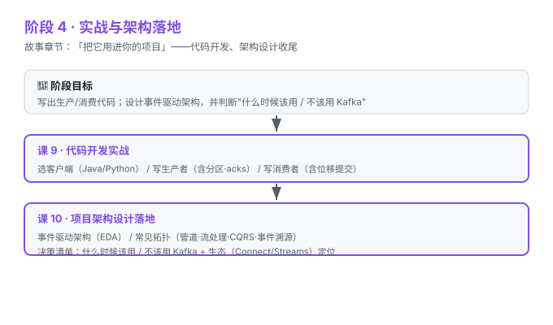

# 阶段 4：实战与架构落地

> 所属课程：Kafka 系统学习 ｜ 故事章节：「把它用进你的项目」 ｜ 上一阶段：[阶段 3](../3-可靠性与高可用/overview.md)

## 🎯 本阶段目标

- 写出最小可用的生产者 / 消费者代码（Java 或 Python 二选一即可）
- 设计基于 Kafka 的事件驱动架构，并判断"什么时候该用 / 不该用 Kafka"

## 📍 学习重点

- **代码回扣架构**：生产者/消费者代码是为"项目架构"服务的，不是孤立练习
- **决策比写法更重要**：知道 Kafka 不适合什么，比会写代码更值钱
- **生态一句话**：Kafka Connect（接外部系统）、Kafka Streams（流处理库）是它的左右手

## ✅ 必须掌握的知识点

| 知识点 | 所属课 | 学完应能 |
|--------|--------|----------|
| 选客户端与环境 | 课9 | 配好 Java/Python 客户端 |
| 写生产者 | 课9 | 写出发送消息的代码 |
| 写消费者 | 课9 | 写出带位移提交的消费代码 |
| 事件驱动架构 EDA | 课10 | 说清 EDA 与 Kafka 的关系 |
| 常见拓扑 | 课10 | 列举管道/流处理/CQRS/事件溯源 |
| 决策清单 | 课10 | 给出该不该用 Kafka 的判断 |

## 🗺️ 本阶段路径图

## 本阶段产出

- [x] `lessons/lesson-09-代码开发实战.md`
- [x] `lessons/lesson-10-项目架构设计落地.md`
- [x] `final-课程手册.md`（全书汇总，2026-09-02 汇总评审通过）

> 🏁 阶段 4 = 全课程收尾阶段。本阶段产出齐备后，[Kafka 系统学习](../../02-课程目录.md) 课程整体结课。
