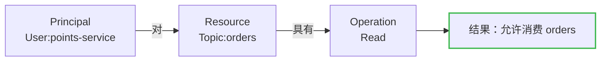
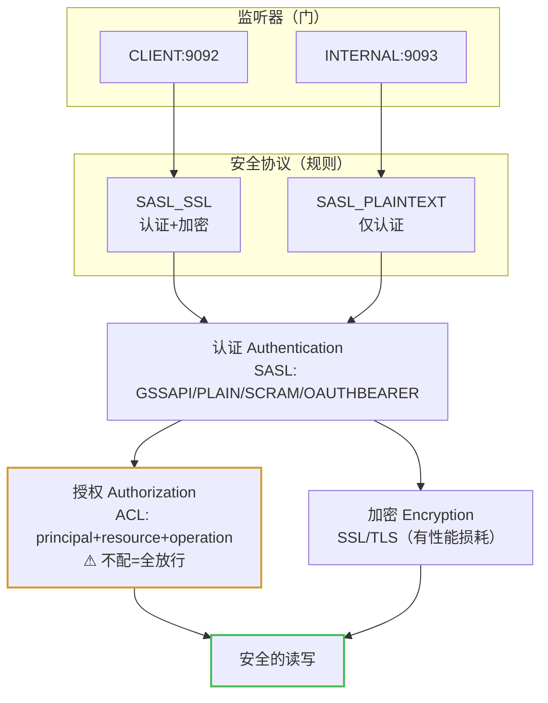

# 第 11 课：Kafka 安全体系

> 所属阶段：阶段 5《生产落地延伸》｜ 水平：零基础 ｜ 本课知识点：认证·授权·加密 / listeners 与协议映射
> 故事情节：仓库终于装上门禁——谁能进（认证）、能进哪间（授权）、路上会不会被偷看（加密）

## 🎯 本课目标

- 区分安全的三件事：认证（你是谁）、授权（你能干什么）、加密（路上会不会被偷看）
- 说清 SASL 四种机制分别是什么、该在什么场景选
- 配通 `listeners` 与 `listener.security.protocol.map`，理解这是排障高频点
- 能看懂并配出一个最小可用的 SASL + ACL 安全集群

---

## 第一幕：起源与场景引入

> 前 10 课我们一直在裸奔。不是比喻——课 3 起的那套容器，**任何人只要能连到 9092 端口，就能读走全部订单、也能伪造订单写进去**。开发环境无所谓，但这个故事接下来要上生产了。

公司要把订单链路接进 Kafka，安全团队甩来三个问题：

> 🎬 **场景**：
> 1. **谁能进？** 现在只要网络通，谁都能连上来发消息、收消息。风控团队的消费者，和隔壁部门某台被挖矿的机器，在 Kafka 眼里**没有任何区别**——它根本不问你是谁。
> 2. **进了能干什么？** 就算知道你是「积分服务」，它凭什么只能读 `orders` 而不能读 `payroll`（工资）？现在的情况是：**进了门，所有房间随便逛**。
> 3. **路上安全吗？** 订单消息在网线里跑的是**明文**。机房内网、跨机房专线、公网——任何一处被抓包，订单内容、用户手机号全是可读文本。

更麻烦的是第四件事：**这三个需求会互相纠缠**。你给 broker 开了认证，结果 broker 之间的内部通信也要求认证，配错就把自己锁在门外；你给外部开了 SSL，内部还走明文，那到底哪个端口走哪个协议？

这就是本课要回答的：**怎么认人**（认证 SASL/SSL）、**怎么管权限**（授权 ACL）、**怎么防偷看**（加密 SSL）、以及**怎么把这三样和端口对上号**（listeners 映射）。

---

## 第二幕：认知冲突

- **冲突一：「加个密码不就完了？」**。直觉是「给 Kafka 设个用户名密码」。但 Kafka 面对的客户端不是一个，是**三类**：业务生产者/消费者、broker 之间的内部通信、运维工具。给「外部用户」设密码简单，可 broker 之间互相通信也用同一套密码吗？运维工具呢？**认证对象比想象的多**，而且它们的信任级别完全不同。
- **冲突二：「认证 = 授权，登录了就有权限」**。这是最常见的混淆。认证只回答「你是谁」，像公司门禁刷工牌；授权回答「你能进哪间」，像工牌权限只开你这层的门。**刷了工牌不代表能进财务室**——但如果你只做了认证没做授权，那确实是「刷了工牌全楼通行」。
- **冲突三：「加密会拖垮性能，能不开就不开」**。半对。SSL 确实有性能损耗（官方明确写了：损耗大小取决于 CPU 类型和 JVM 实现）。但真正的问题不是「要不要开」，而是**在哪一段开**：broker 之间、客户端到 broker、跨机房——三段的威胁模型完全不同，一刀切全开或全不开都是错的。
- **冲突四：「配了 SSL 就等于安全了」**。最危险的想法。安全是**三件套的叠加**：只有认证没有授权 = 全楼通行；只有授权没有认证 = 随便冒名；都不加密 = 内容裸奔。而且**安全是可选的**——Kafka 官方明确说支持「非安全集群」，也支持认证/未认证、加密/未加密客户端**混用**。这意味着你的集群可能处于「部分安全」的中间态，而这个中间态往往比全裸更危险，因为你以为自己安全了。

> ❓ **问题**：一套完整的安全方案需要四层——认证（你是谁）、授权（你能干什么）、加密（路上防偷看），以及把这三层绑定到具体端口的**监听器映射**（哪个门走哪套规则）。

---

## 第三幕：层层揭示

### 知识点 1：认证·授权·加密——安全三件套

**一句话定义**：Kafka 安全由三件独立的事组成——**认证**（Authentication，确认连接方是谁，支持 SSL 或 SASL）、**授权**（Authorization，控制读写权限，可插拔、可接外部授权服务）、**加密**（Encryption，用 SSL 加密传输数据）；三者可独立开启，也可混用。

#### 直觉建立（类比）

把 Kafka 集群想象成一栋**写字楼**：

- **认证 = 门禁刷工牌**。证明「你是这家公司的员工」。没有工牌，大门都进不来。
- **授权 = 工牌的楼层权限**。你是市场部的，工牌只开 3 楼和 5 楼，财务室在 8 楼你刷不开。**进了门 ≠ 哪儿都能去**。
- **加密 = 楼里的谈话不被窃听**。你和大堂、和你同事说话的内容，走廊上的人听不懂（或者你走的是封闭电话亭）。

> 💡 **类比的边界**：写字楼的门禁通常只有一道，但 Kafka 的「门」有好几道，而且**每道门的规则可以不一样**——员工通道刷工牌、货运通道刷卡+登记、消防通道只出不进。这就是知识点 2 的 listeners，别把「一栋楼一个门禁」的直觉带过来。

#### 概念与原理

**1. 认证：SASL 的四种机制。** Kafka 支持用 **SSL** 或 **SASL** 做认证。生产上最常用的是 SASL，它有四种机制，按引入版本排列：

| 机制 | 引入版本 | 原理 | 适用场景 |
|------|----------|------|----------|
| **SASL/GSSAPI**（Kerberos） | 0.9.0.0 | 依托企业已有的 Kerberos 票据体系 | 大企业内网，已有 KDC |
| **SASL/PLAIN** | 0.10.0.0 | 用户名 + 密码（**明文传输凭据**，必须配 SSL） | 简单场景，配合 SSL 使用 |
| **SASL/SCRAM-SHA-256/512** | 0.10.2.0 | 挑战-应答，密码不上传，服务端存哈希 | **推荐的通用选择** |
| **SASL/OAUTHBEARER** | 2.0 | OAuth 2.0 令牌 | 云原生、已有统一身份体系 |

怎么选？给个决策路径：**有 Kerberos 就用 GSSAPI**（省一套密码管理）；**没有就用 SCRAM**（凭据不裸奔，官方支持完善）；PLAIN 只有在**确定全程 SSL** 时才用；OAUTHBEARER 适合已经上了 OAuth 的平台型团队。

> ⚠️ **PLAIN 的坑**：名字里带「PLAIN」不是因为它简单，是因为**密码是明文编码传输的**（base64，不是加密）。单独用 SASL/PLAIN 而不开 SSL，等于把密码写在明信片上寄出去。

**2. 授权：ACL 控制「谁能读写哪个 topic」。** 授权是**可插拔**的，官方支持对接外部授权服务；内置的默认实现是 ACL（Access Control List）。一条 ACL 表达的是「**某个 principal（身份）对某个 resource（资源）具有某种 operation（操作）**」。



关键认知：**没做授权 = 全放行**。Kafka 的默认授权器在没有任何 ACL 时允许所有操作——所以「开了认证但没配 ACL」的集群，安全性等于只做了一半。

**3. 加密：SSL/TLS。** 用 SSL 加密 broker↔客户端、broker↔broker、broker↔工具之间的传输。**官方明确提示存在性能损耗**，量级取决于 CPU 类型和 JVM 实现。这不是「开不开」的二选一，而是分段决策：

| 链路 | 是否加密 | 理由 |
|------|----------|------|
| 客户端 ↔ broker（跨公网/不可信网络） | 必须加密 | 凭据和数据都在公网上跑 |
| 客户端 ↔ broker（可信内网） | 建议加密 | 内网不等于安全，横向渗透很常见 |
| broker ↔ broker（同机房） | 视合规要求 | 性能敏感，内网威胁低时可权衡 |

**4. 安全是可选的，混用是常态。** 官方原话值得记住：支持非安全集群，也支持**认证/未认证、加密/未加密客户端混用**。这带来一个重要实践：给集群上安全可以**渐进式**——先开一个加密端口，让新客户端迁移过去，老的明文端口保留一段时间再关（对应官方的「在运行的集群中接入安全特性」指南）。

#### 一句话记住

**认证 = 你是谁（SASL 四选一，通用选 SCRAM），授权 = 你能干什么（ACL，不配就全放行），加密 = 路上防偷看（SSL，有性能损耗）；三者独立、可渐进开启、可混用。**

---

### 知识点 2：listeners 与协议映射

**一句话定义**：`listeners` 定义 broker 监听哪些地址与端口，`listener.security.protocol.map` 定义**每个监听器名字对应哪套安全协议**；两者配合，让同一个集群的不同端口可以走完全不同的安全规则。

#### 直觉建立（类比）

回到写字楼。它有多个门，每个门规则不同：

- **正门（CLIENT）**：员工刷工牌进（SASL_SSL）；
- **货运门（INTERNAL）**：内部员工专用，凭内部证件（SASL_PLAINTEXT）；
- **后门（PLAINTEXT）**：还没改造完，先敞开着（PLAINTEXT），等迁移完再关。

关键：**门（端口/监听器名）和规则（安全协议）是两层映射，不是一一对应的死绑定**。你可以让正门改规则（从明文升级到加密），而门本身不变——这正是渐进式迁移的基础。

#### 概念与原理

**1. 两个配置必须成对出现。**

```properties
# 监听哪些端口，每个端口起一个「监听器名」
listeners=CLIENT://:9092,INTERNAL://:9093

# 每个监听器名 → 用哪套安全协议
listener.security.protocol.map=CLIENT:SASL_SSL,INTERNAL:SASL_PLAINTEXT

# 集群内部 broker 之间用哪个监听器通信
inter.broker.listener.name=INTERNAL
```

**2. 安全协议的取值。** 常见的组合是「传输层 + 认证层」：

| 协议值 | 含义 | 用途 |
|--------|------|------|
| `PLAINTEXT` | 不加密、不认证 | 开发环境、迁移过渡 |
| `SSL` | 加密，**且可用 SSL 证书做认证** | 需要双向认证的场景 |
| `SASL_PLAINTEXT` | 认证，但**不加密** | 可信内网（凭据仍有泄露风险） |
| `SASL_SSL` | 认证 + 加密 | **生产推荐** |

> ⚠️ **最大的坑：`SASL_PLAINTEXT` 不是「不加密的明文」那么简单**。它意味着**认证凭据在网络上明文传输**。如果用的是 SASL/PLAIN（密码本身就是明文），两者叠加 = 密码在网络上裸奔。要么改用 SCRAM，要么上 `SASL_SSL`。

**3. `inter.broker.listener.name` 决定 broker 之间走哪个门。** 这个配置极易被忽略：broker 之间也要通信（副本同步就是 fetch），它们走哪个监听器，就用哪套安全协议。配错了会出现「客户端能连、broker 之间连不上」的诡异现象。

**4. advertised.listeners：客户端真正连的地址。** 课 9 踩过一次的坑这里再强调：`listeners` 是 broker **本地监听**什么地址，`advertised.listeners` 是 broker **告诉客户端**「你来连我这个地址」。客户端拿到后者去连接。在容器/NAT/云环境里两者通常不同——这是 Kafka 排障的**头号高频问题**（对应 09 排障手册的「双地址陷阱」）。

#### 一句话记住

**listeners 开端口、map 定规则、inter.broker 选内部通道、advertised 告诉客户端真地址——四者成套配置，错一个就是「连不上」或「连上了但不安全」。**

---

## 第四幕：实操验证

> 安全配置最容易「配完把自己锁在门外」。我们用一个**最小增量**的方式：在课 3 的容器旁边，用配置片段看懂结构，再给出可验证的 ACL 命令。**本课的实操以「看懂配置 + 跑通 ACL 命令」为目标**——完整的 SASL 集群涉及证书与 JAAS 文件，放在「进阶挑战」里。

**第 1 步：先看我们现在的集群有多裸。** 连进课 3 的容器，看监听配置：

```bash
docker exec -it kafka /opt/kafka/bin/kafka-broker-api-versions.sh \
  --bootstrap-server localhost:9092 >/dev/null 2>&1 && echo "无需任何凭据即可连接"
```

能连通且不需要任何用户名密码 —— 这就是 `PLAINTEXT` 监听器的现状：**任何人连得上就能读写全部数据**。

**第 2 步：读懂一份最小安全配置。** 下面这份是「客户端走 SASL_SSL、broker 之间走 SASL_PLAINTEXT」的典型生产结构（**先读懂，不要急着套用**）：

```properties
# 1) 开两个门
listeners=CLIENT://:9092,INTERNAL://:9093
# 2) 每个门用什么协议
listener.security.protocol.map=CLIENT:SASL_SSL,INTERNAL:SASL_PLAINTEXT
# 3) broker 之间走内部通道
inter.broker.listener.name=INTERNAL
# 4) 告诉客户端来连这个地址（容器内/云环境务必核对）
advertised.listeners=CLIENT://kafka:9092,INTERNAL://kafka:9093
# 5) broker 之间用什么 SASL 机制
sasl.mechanism.inter.broker.protocol=SCRAM-SHA-512
# 6) 启用 ACL 授权器
authorizer.class.name=org.apache.kafka.metadata.authorizer.StandardAuthorizer
# 7) 超级用户（管理员，不受 ACL 限制，务必设置否则可能把自己锁死）
super.users=User:admin
```

逐条对应知识点 2 的四件套。特别注意第 7 条：**开 ACL 前必须设超级用户**，否则管理员自己也动不了集群。

**第 3 步：跑通 ACL 命令（真实可执行）。** 假设集群已启用 ACL，下面是标准的授权命令。即便当前容器没开 ACL，也建议照着敲一遍熟悉语法：

```bash
# 允许 points-service 这个用户读取 orders 主题
docker exec -it kafka /opt/kafka/bin/kafka-acls.sh \
  --bootstrap-server localhost:9092 \
  --add --allow-principal User:points-service \
  --operation Read --topic orders

# 允许 order-service 写入 orders 主题
docker exec -it kafka /opt/kafka/bin/kafka-acls.sh \
  --bootstrap-server localhost:9092 \
  --add --allow-principal User:order-service \
  --operation Write --topic orders

# 查看某个主题上现有的 ACL
docker exec -it kafka /opt/kafka/bin/kafka-acls.sh \
  --bootstrap-server localhost:9092 --list --topic orders
```

> 💡 这几条命令在**未启用授权器**的集群上会报「授权器未启用」类错误，属正常现象——重点是掌握「principal + operation + resource」这个三段式表达。

**第 4 步：验证「没配 ACL = 全放行」。** 这是本课最该记住的实操结论：**如果只做认证不做授权，任何一个认证通过的用户都能读写所有 topic**。所以检查集群安全时，别只看「有没有开 SASL」，一定要问一句「ACL 配了没有」。

> ✅ **回扣场景**：安全团队的三个问题——「谁能进」→ SASL 认证（SCRAM 通用首选）；「进了能干什么」→ ACL 授权（不配=全放行）；「路上安全吗」→ SSL 加密（分段决策）。而把它们绑到端口上的，是 `listeners` + `listener.security.protocol.map` 这对映射。

> 🧗 **进阶挑战（可选）**：用 `docker compose` 起一个启用 SASL/SCRAM 的 Kafka：① 用 `kafka-storage.sh` 格式化时加 SCRAM 凭据；② 配置 JAAS 文件并用 `KAFKA_OPTS` 挂载；③ 客户端配 `sasl.jaas.config` 与 `sasl.mechanism=SCRAM-SHA-512`；④ 用 `kafka-console-producer.sh` 带 `--producer.config` 验证能发；⑤ 再去掉凭据验证会连不上。完整走一遍，安全的认知才算落地。

---

## 第五幕：体系收束

> 📍 **全局定位**：前 10 课解决的是「消息怎么可靠地流动」——不丢（课 5/7）、不重（课 8）、能写代码（课 9）、能设计架构（课 10）。本课补上的是**同一个问题的另一面**：消息流动给**正确的人**看。可靠性和安全性是两条独立的轴——一个集群可以很可靠但完全不安全（数据一份不丢，但谁都能读）。
> 🔗 **下一步**：课 12《多租户与配额》。安全解决「不相关的人不能访问」，多租户解决「相关的人不能互相拖垮」——多个团队共用一个集群时，怎么防止一个团队把带宽和磁盘吃光。

---

## 🐞 常见误区

1. **「配了认证就安全了」**：错。认证只管「你是谁」。不配 ACL，认证通过的用户照样能读全部 topic。安全是认证 + 授权 + 加密三件套。
2. **「SASL/PLAIN 就是简单模式，可以直接用」**：危险。PLAIN 的凭据是明文编码（base64）传输，必须配 SSL。否则等于密码在明信片上邮寄。
3. **「`SASL_PLAINTEXT` 等于没加密的认证，内网用没事」**：凭据本身在网络上明文。内网不等于可信，横向渗透是常态。要么上 `SASL_SSL`，要么至少用 SCRAM 而非 PLAIN。
4. **「SSL 太慢，生产上别开」**：官方确实提示有性能损耗，但量级取决于 CPU 与 JVM，且现代 CPU 的 AES-NI 指令集已大幅降低成本。正确的做法是**分段评估**（公网必开、内网权衡），而不是一刀切。
5. **「listeners 配好了客户端就能连」**：漏了 `advertised.listeners`。`listeners` 是本地监听，`advertised.listeners` 是告诉客户端的地址——容器/NAT/云环境里两者不同，这是 Kafka 排障的头号高频问题（回看 09 排障手册）。
6. **「开 ACL 后管理员照样能管集群」**：不一定。开 ACL 前必须设 `super.users`，否则管理员的操作也会被 ACL 拦住，把自己锁在门外。
7. **「安全要么全开要么不开」**：官方明确支持混用（认证/未认证、加密/未加密客户端共存）。正确姿势是**渐进迁移**：先开新端口，迁移客户端，最后关旧端口。

## 📚 官方文档

- [Security 总览（4.3）](https://kafka.apache.org/43/security/)：安全体系入口
- [Security Overview（4.3）](https://kafka.apache.org/43/security/security-overview/)：官方列出的三类安全措施与 SASL 四种机制的引入版本
- [Authentication using SASL（4.3）](https://kafka.apache.org/43/security/authentication-using-sasl/)：SASL 各机制的配置细节与 JAAS 配置
- [Authorization and ACLs（4.3）](https://kafka.apache.org/43/security/authorization-and-acls/)：ACL 的 principal/resource/operation 三段式与 `kafka-acls.sh` 用法
- [Encryption and Authentication using SSL（4.3）](https://kafka.apache.org/43/security/encryption-and-authentication-using-ssl/)：SSL 证书配置与性能提示
- [Listener Configuration（4.3）](https://kafka.apache.org/43/security/listener-configuration/)：listeners 与安全协议映射（排障高频）
- [Incorporating Security Features in a Running Cluster（4.3）](https://kafka.apache.org/43/security/incorporating-security-features-in-a-running-cluster/)：不停机渐进接入安全的官方步骤

## 一图总结



> 读法：**门（listeners）** 决定从哪个端口进，**规则（map）** 决定这个端口用哪套安全协议；进门后依次过**认证**（你是谁）、**授权**（你能干什么，黄色高危——不配就全放行）、**加密**（路上防偷看）三关，最后才是安全读写。

## 课后小测

**Q1**：团队给 Kafka 集群配好了 SASL/SCRAM 认证，所有客户端都能正常连接和收发消息，但没配任何 ACL。此时的安全状况是？
- A. 已经安全：认证通过的用户都是可信的
- B. 只做了一半：认证拦住了外部用户，但任何认证通过的用户都能读写所有 topic
- C. 已经安全：SCRAM 自带权限控制
- D. 完全没用：SCRAM 不配 ACL 时等同于匿名访问

<details><summary>答案与解析</summary>

**答案：B**。认证（你是谁）和授权（你能干什么）是两件独立的事。Kafka 的默认授权器在没有任何 ACL 时**允许所有操作**，所以认证通过 ≠ 有权限边界。这正是误区第 1 条。D 错在：认证确实拦住了没凭据的人，不是完全没用。

</details>

**Q2**：配置 `listener.security.protocol.map=CLIENT:SASL_PLAINTEXT` 并使用 SASL/PLAIN 机制，风险是什么？
- A. 没有风险，SASL_PLAINTEXT 是官方推荐配置
- B. 性能损耗大，吞吐会显著下降
- C. 认证凭据（密码）在网络上明文传输，被抓包即可获取
- D. 客户端无法连接，必须改用 SASL_SSL

<details><summary>答案与解析</summary>

**答案：C**。`SASL_PLAINTEXT` 表示**认证但不加密**；而 SASL/PLAIN 机制的凭据本身就是明文编码（base64）。两者叠加，密码等于在网络上裸奔。正确做法：改用 SCRAM（挑战-应答，不传密码本身），或升级到 `SASL_SSL`。D 错在客户端能连上，问题不是连不上而是不安全。

</details>

**Q3**：生产集群配好了 `listeners=CLIENT://:9092`，客户端从容器外连接时却一直报连接失败，但 `docker exec` 进容器内部用 `localhost:9092` 却正常。最可能的原因是？
- A. 没配 SSL，客户端拒绝连接
- B. 没配 `advertised.listeners`，客户端拿到的是容器内地址，从外面连不通
- C. ACL 没配，客户端被授权拦截
- D. `inter.broker.listener.name` 配置错误

<details><summary>答案与解析</summary>

**答案：B**。`listeners` 是 broker 本地监听的地址，`advertised.listeners` 才是 broker **告诉客户端**「你来连这个」的地址。客户端拿到后者去连；容器/NAT/云环境里两者不同，不配 advertised 就会把容器内地址发给外部客户端，自然连不通。这是 Kafka 排障的头号高频问题（回看 09 排障手册「双地址陷阱」）。

</details>

## 🚀 下一批接力提示词

> 学完本课后，**复制下面这段文字发给 AI**，即可无缝进入下一批（无需重新描述上下文）：

```
继续学 Kafka。我的学习档案在 kafka/00-学习档案.md，
刚学完阶段 5《生产落地延伸》的课《Kafka 安全体系》知识点 认证·授权·加密、listeners与协议映射，
请按大纲继续讲解下一批知识点（课12：多租户与配额）。
```

## 🧭 课程导航

⬅️ **上一课**：[课 10：项目架构设计落地](../../4-实战与架构落地/lessons/lesson-10-项目架构设计落地.md)

➡️ **下一课**：[课 12：多租户与配额](lesson-12-多租户与配额.md)

📚 **返回目录**：[课程目录](../../../02-课程目录.md)
