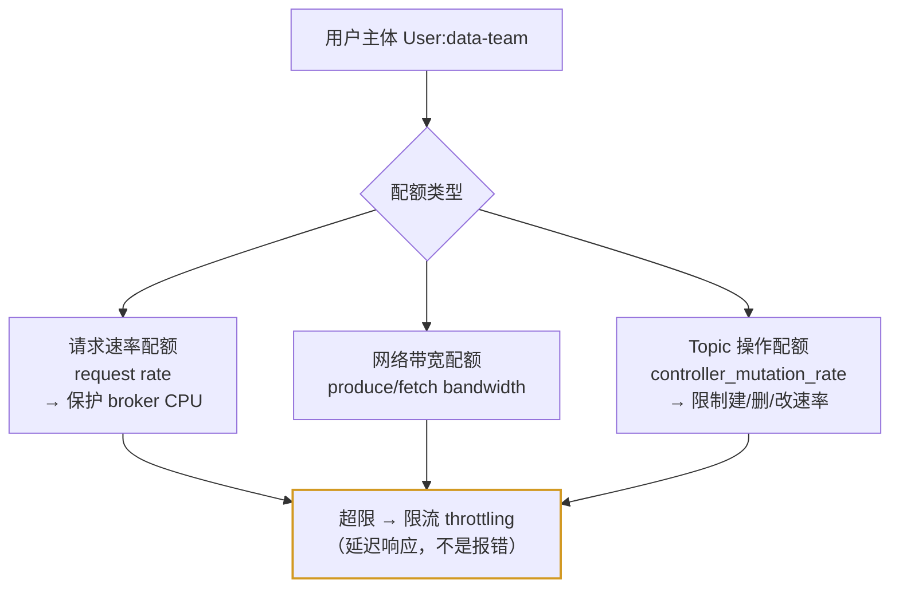
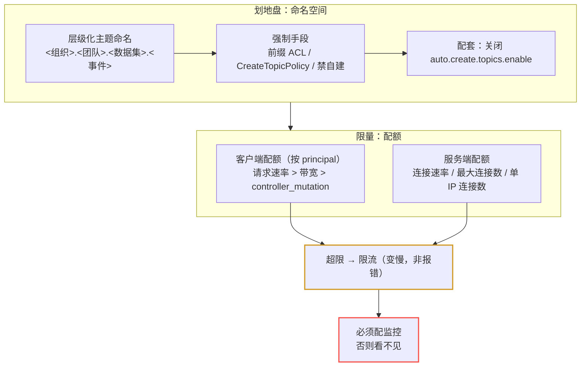

# 第 12 课：多租户与配额

> 所属阶段：阶段 5《生产落地延伸》｜ 水平：零基础 ｜ 本课知识点：多租户隔离与配额
> 故事情节：一栋楼住进十家公司——怎么保证不互相吵到，也不把电梯挤爆

## 🎯 本课目标

- 理解多租户的核心矛盾：资源共享 vs 互相干扰（吵闹的邻居）
- 用主题命名 + 前缀 ACL 划分租户空间
- 区分客户端配额与服务端配额，说清配额限的是什么、超限后发生什么
- 能配出并验证一条客户端配额

---

## 第一幕：起源与场景引入

> 课 11 给仓库装了门禁，挡住了「不该进的人」。但很快会出现新问题：**该进的人之间也会互相伤害**。

公司的 Kafka 集群越用越顺，风控、积分、订单、物流、数据五个团队都接了进来。某天下午，集群突然变慢，`orders` 的消费延迟从毫秒级飙到几十秒。排查发现：**数据团队在跑一个全量回溯任务，一个消费者把带宽吃满了**。

复盘会上，运维甩出三个问题：

> 🎬 **场景**：
> 1. **怎么分清谁的？** 五个团队几十个 topic 混在一起，命名随心所欲（`orders`、`order_new`、`test123`）。出事了连「这个 topic 是谁的」都要在群里问一轮。
> 2. **怎么防止一个人拖垮所有人？** 数据团队那个回溯任务是**合理业务**，不该禁止——但也不能让它把订单链路拖死。需要的是**限流**，不是封禁。
> 3. **限什么？** 限带宽？限请求数？限连接数？限创建 topic 的速度？——**不同的「吵闹方式」要用不同的尺子量**，限错了等于没限。

这就是本课的两件事：**怎么划地盘**（多租户命名空间）和**怎么限量**（配额 quota）。

---

## 第二幕：认知冲突

- **冲突一：「一个团队一个集群，物理隔离最干净」**。听起来最安全，但代价是**运维成本乘以 N**：十个小团队十套集群，升级、监控、故障处理全是十倍工作量，而每个集群的资源利用率可能只有 10%。共用集群的核心诉求是**降本**，隔离只是手段。
- **冲突二：「限流 = 限制带宽」**。最常见的误解。官方明确指出：**在多数场景下，用「请求速率配额」隔离用户的效果，比限制进出网络带宽更显著**。为什么？因为 broker 处理请求要消耗 **CPU**，CPU 被某个用户占满后，broker 能服务的有效带宽反而下降——**带宽是表象，CPU 才是瓶颈**。所以「限带宽」常常是限错了地方。
- **冲突三：「超限就直接拒绝」**。直觉是超速就报错。但 Kafka 的配额机制是**限流（throttling）**——超限后不是拒绝请求，而是**延迟响应**（把客户端的速度压下来）。这个区别很关键：客户端表现为「变慢」而不是「报错」，所以**没监控就发现不了自己被限流了**。
- **冲突四：「配额是客户端自己配的」**。错。配额是**服务端（broker）配置**，由管理员设定，对客户端是**强制的、透明的**。客户端改自己的配置绕不过去——这也是它能防「吵闹邻居」的原因。

> ❓ **问题**：多租户治理需要两层——**命名空间**（谁的地盘，用命名规范 + 前缀 ACL 落地）和**配额**（能用多少，客户端配额 + 服务端配额两类）。

---

## 第三幕：层层揭示

### 知识点：多租户隔离与配额

**一句话定义**：多租户（multi-tenancy）指多个团队/业务共享同一个 Kafka 集群，通过**主题命名规范 + ACL** 划分逻辑空间、通过**配额（quota）** 限制每个租户的资源用量；配额分**客户端配额**（按用户主体限制速率）与**服务端配额**（限制连接与 broker 侧资源）两类，超限后触发**限流**而非拒绝。

#### 直觉建立（类比）

把集群想象成一栋**合租的写字楼**：

- **命名空间 = 楼层分配**。3 楼给风控、5 楼给积分。不是物理隔断，是**约定 + 门禁权限**（前缀 ACL：你的工牌只开你这层）。
- **配额 = 电梯和带宽的使用上限**。不是不让你搬货，而是限制你**每分钟能运多少**，保证别人还能用电梯。
- **限流 = 电梯变慢，不是不让进**。你超载时电梯不会报错，只是**一层一层停得特别久**——你感觉「变慢了」，但活还在干。

> 💡 **类比的边界**：配额是**软限速**不是硬拒绝，这一点务必记住。它带来的直接后果是：**被限流的客户端只会「感觉变慢」，不会收到明确错误**。所以监控配额指标是运维的必选项（对应 09 排障手册的「消费者积压」排查思路）。

#### 概念与原理

**1. 划分地盘：主题命名 + 前缀 ACL。**

Kafka 里**没有命名空间这个实体**，官方的做法是用**层级化的主题命名**来定义「用户空间」（user spaces）——本质上是一组归属同一实体的 topic 集合。两种最常见的分组方式：

| 分组维度 | 命名结构 | 示例 | 适用 |
|----------|----------|------|------|
| **按团队/组织** | `<组织>.<团队>.<数据集>.<事件名>` | `acme.infosec.telemetry.logins` | 团队是使用 Kafka 的主体 |
| **按项目/产品** | `<项目>.<产品>.<事件名>` | `mobility.payments.suspicious` | 一个团队管多个项目，凭据按项目分 |

**命名反模式**：不要把**易变信息**放进主题名（比如预期的消费者名），也不要把**技术细节/元数据**放进去（比如分区数）——这些信息变一次，主题名就尴尬一次。

有了命名规范，怎么**强制**执行？官方给了三种手段（力度递增）：

1. **前缀 ACL**（[KIP-290](https://cwiki.apache.org/confluence/display/KAFKA/KIP-290%3A+Prefix+ACLs)）：最轻量。比如只允许 A 团队创建 `payments.teamA.` 开头的 topic。
2. **自定义 CreateTopicPolicy**（[KIP-108](https://cwiki.apache.org/confluence/display/KAFKA/KIP-108%3A+Create+Topic+Policy)，配置 `create.topic.policy.class.name`）：最灵活，能匹配复杂命名规则。
3. **禁止用户自建 topic**（用 ACL 拒绝），改由外部流程（脚本/自动化平台）代建。控制力最强。

> 💡 配套动作：官方建议**关闭 topic 自动创建**（`auto.create.topics.enable=false`）。回想课 4 提过这个参数——在多租户场景下它从「便利功能」变成了「治理漏洞」：不关掉，命名规范就是一纸空文。

**2. 客户端配额：按用户主体限速。**

客户端配额绑定的是 **用户主体（principal）**，而不是某个 topic——这意味着**无论这个用户读写哪个 topic，配额都生效**。这正是它适合多租户的原因：管的是「人」不是「数据」。



三类配额的价值排序值得记住（官方观点）：

- **请求速率配额（最该配）**：限制 broker 花在**请求处理路径**上的时间，直接保护 CPU。官方明确说：**在很多情况下，用请求速率配额隔离用户的效果，比设置进出带宽配额更显著**——因为过度的 CPU 占用会降低 broker 能服务的有效带宽。
- **网络带宽配额**：限制生产/消费的字节速率。有用，但如上所述，常常不是真正的瓶颈所在。
- **Topic 操作配额（`controller_mutation_rate`，[KIP-599](https://cwiki.apache.org/confluence/display/KAFKA/KIP-599%3A+Add+Controller+Mutation+Quota+Manager)）**：限制 create/delete/alter 等操作的速率，防止高并发的元数据操作**压垮 controller**。这是容易被忽略的一条——controller 是集群的大脑，元数据操作洪水会让它无暇他顾。

**3. 服务端配额：broker 侧的连接防护。**

与客户端配额相对，服务端配额限的是 broker 自身承受的连接压力，典型三项：**接受新连接的速率**、**每个 broker 的最大连接数**、**单个 IP 允许的最大连接数**。这类配额防的是「连接风暴」——比如某个客户端 bug 导致疯狂重连。

**4. 监控与计量：配额必须配监控才有意义。**

因为限流表现为「变慢」而非「报错」，**不监控就不知道自己被限流了**。官方建议多租户环境尤其要配监控，可用指标包括：认证失败率、请求延迟、消费积压（lag）、消费者组总数，以及**配额相关指标**。

存储维度的计量也值得做：用 JMX 指标 `kafka.log.Log.Size.<TOPIC-NAME>` 跟踪分区大小，从而在租户快要用满存储时告警。

#### 一句话记住

**多租户 = 用命名规范划地盘（前缀 ACL 强制）+ 用配额限量（客户端配额管用户速率、服务端配额管连接）；配额超限是「限流变慢」不是「报错」，所以必须配监控才看得见。**

---

## 第四幕：实操验证

> 配额是**服务端配置**，我们的单容器集群同样可以配并验证。重点走通「配一条配额 → 看它生效」的闭环。老规矩先确认容器在跑（`docker ps` 能看到 kafka）。

**第 1 步：看集群当前的默认状态。** 先确认自动创建 topic 这个「治理漏洞」是否开着：

```bash
docker exec -it kafka /opt/kafka/bin/kafka-configs.sh \
  --bootstrap-server localhost:9092 \
  --describe --entity-type brokers --entity-default
```

无输出说明没配过集群级默认配置（即沿用默认值 `auto.create.topics.enable=true`）。多租户场景下的第一个动作，就是把它关掉：

```bash
docker exec -it kafka /opt/kafka/bin/kafka-configs.sh \
  --bootstrap-server localhost:9092 \
  --alter --entity-type brokers --entity-default \
  --add-config auto.create.topics.enable=false
```

**第 2 步：给一个用户配一条客户端配额。** 把 `data-team` 这个主体的生产速率限制在 1 MB/s、消费速率限制在 2 MB/s（**数值仅用于演示，生产请按实际评估**）：

```bash
docker exec -it kafka /opt/kafka/bin/kafka-configs.sh \
  --bootstrap-server localhost:9092 \
  --alter --add-config 'producer_byte_rate=1048576,consumer_byte_rate=2097152' \
  --entity-type users --entity-name data-team
```

**第 3 步：验证配额确实写进去了。**

```bash
docker exec -it kafka /opt/kafka/bin/kafka-configs.sh \
  --bootstrap-server localhost:9092 \
  --describe --entity-type users --entity-name data-team
```

预期能看到类似输出：

```
Configs for user-principal 'data-team' are producer_byte_rate=1048576, consumer_byte_rate=2097152
```

看到这行，说明配额已生效于**服务端**——客户端无论怎么配自己的参数都绕不过去。

**第 4 步：体会「限流是变慢不是报错」。** 用课 3 的控制台生产者快速发一批消息，然后观察：如果触发了配额，客户端**不会收到拒绝错误**，而是**吞吐被压低**。这正是为什么配额必须配监控——**被限流的客户端主观感受只是「今天怎么有点慢」**。

> ✅ **回扣场景**：运维的三个问题——「怎么分清谁的」→ 层级化命名 + 前缀 ACL（并按官方建议关掉自动建 topic）；「怎么防止一个人拖垮所有人」→ 配额限流（是限速不是封禁，合理业务照跑）；「限什么」→ 优先配请求速率（保护 CPU，官方认为比限带宽更有效），辅以带宽配额，别忘 `controller_mutation_rate` 保护 controller。

> 🧗 **进阶挑战（可选）**：① 用 `--entity-type users --entity-name <principal> --add-config request_percentage=<n>` 配请求速率配额，观察限流行为与带宽配额的差异；② 配一条 `controller_mutation_rate`，用脚本高频创建/删除 topic，观察 controller 是否还稳定；③ 查 JMX 指标 `kafka.log.Log.Size.<topic>` 做存储计量，尝试配一个「租户存储接近上限」的告警项。

---

## 第五幕：体系收束

> 📍 **全局定位**：课 11 和本课是共享集群治理的**左右手**——课 11 解决「不相关的人不能访问」（安全边界），本课解决「相关的人不能互相拖垮」（资源边界）。二者组合起来，才敢把一个集群开放给多个团队共用。
> 🔗 **下一步**：课 13《协议与消息格式》。前 12 课我们一直站在「使用者」的视角（怎么配、怎么用），课 13 换个角度——钻到字节层面，看看一条消息在网络上到底长什么样。

---

## 🐞 常见误区

1. **「多租户就該物理隔离，一个团队一个集群」**：成本高到不现实（运维 ×N、资源利用率低）。共享集群 + 命名规范 + 配额是官方给出的折中方案。
2. **「限流就是限制带宽」**：优先该限的是**请求速率**——它保护的是 broker CPU。官方明确指出，很多情况下请求速率配额的隔离效果比带宽配额更显著。
3. **「超限会报错被拒绝」**：错。配额的机制是**限流（throttling）**，客户端表现为「变慢」而不是「报错」。这直接导致**不配监控就发现不了被限流**。
4. **「配额是客户端自己配置的」**：配额由管理员在**服务端**配置，对客户端强制生效、无法绕过。
5. **「配额按 topic 生效」**：客户端配额绑定的是**用户主体（principal）**，与读写哪个 topic 无关——这是它适合多租户的原因（管人不数据）。
6. **「命名规范靠自觉就行」**：不强制的规范会被逐渐破坏。用前缀 ACL、CreateTopicPolicy 或禁止自建 topic 来强制；同时**关掉 `auto.create.topics.enable`**，否则规范形同虚设。
7. **「配额配完就万事大吉」**：限流是静默的（变慢不报错），必须配监控才能看见。官方建议多租户环境尤其要监控配额指标，并用 `kafka.log.Log.Size.<TOPIC-NAME>` 做存储计量与告警。

## 📚 官方文档

- [Multi-Tenancy（4.3）](https://kafka.apache.org/43/operations/multi-tenancy/)：多租户官方指南（命名空间、配额、监控、数据契约）
- [Security 总览（4.3）](https://kafka.apache.org/43/security/)：与课 11 的认证/授权/加密配合阅读
- [Kafka Broker 配置（4.3）](https://kafka.apache.org/43/configuration/broker-configs/)：`auto.create.topics.enable` 等集群级配置
- [Monitoring（4.3）](https://kafka.apache.org/43/operations/monitoring/)：配额指标与 `kafka.log.Log.Size.<TOPIC-NAME>` 等 JMX 指标

## 一图总结



> 读法：上半部分是**划地盘**（命名规范 + 强制手段 + 关掉自动建 topic），下半部分是**限量**（客户端配额管用户速率、服务端配额管连接）；黄色是限流行为——**变慢不报错**；红色是它带来的必然后果：**不监控就发现不了**。

## 课后小测

**Q1**：多租户集群中，某团队的任务导致 broker CPU 打满、其他团队延迟飙升。按官方观点，优先配哪种配额？
- A. 消费带宽配额（consumer_byte_rate）
- B. 请求速率配额，限制 broker 花在该用户请求处理路径上的时间
- C. 单 IP 最大连接数
- D. 直接禁止该团队的任务

<details><summary>答案与解析</summary>

**答案：B**。官方明确指出：在很多情况下，**用请求速率配额隔离用户比设置进出带宽配额效果更显著**，因为过度的 broker CPU 占用（处理请求）会降低 broker 能服务的有效带宽——CPU 才是瓶颈，带宽是表象。A 是次选，C 防的是连接风暴，D 属于「禁止合理业务」，不是配额的设计意图。

</details>

**Q2**：给 `User:data-team` 配了生产带宽配额后，该用户持续超速。客户端会观察到什么？
- A. 收到配额超限的错误，发送失败
- B. 连接被断开，需要重连
- C. 不会报错，但吞吐被压低（变慢）
- D. 消息被丢弃一部分

<details><summary>答案与解析</summary>

**答案：C**。配额的机制是**限流（throttling）**——延迟响应以压低客户端速率，而不是拒绝请求。这带来一个运维上的关键结论：**被限流的客户端主观感受只是「变慢」，没有明确错误**，所以必须配监控才能发现。A/B/D 都把限流误解成了拒绝。

</details>

**Q3**：想强制团队遵守 `payments.teamA.` 的命名前缀，最轻量的官方手段是？
- A. 在wiki 里发一份命名规范文档
- B. 用前缀 ACL（KIP-290）限制该团队只能创建指定前缀的 topic
- C. 给每个团队单独部署一个集群
- D. 把 `auto.create.topics.enable` 设为 true

<details><summary>答案与解析</summary>

**答案：B**。前缀 ACL（KIP-290）是官方列出的、强制执行命名结构的最轻量手段（另两种是自定义 CreateTopicPolicy 和禁止用户自建 topic）。A 是「靠自觉」，会被逐渐破坏；C 是物理隔离，成本过高；D 方向相反——多租户场景应**关闭**自动创建，否则命名规范形同虚设。

</details>

## 🚀 下一批接力提示词

> 学完本课后，**复制下面这段文字发给 AI**，即可无缝进入下一批（无需重新描述上下文）：

```
继续学 Kafka。我的学习档案在 kafka/00-学习档案.md，
刚学完阶段 5《生产落地延伸》的课《多租户与配额》知识点 多租户隔离与配额，
请按大纲继续讲解下一批知识点（课13：协议与消息格式）。
```

## 🧭 课程导航

⬅️ **上一课**：[课 11：Kafka 安全体系](lesson-11-Kafka安全体系.md)

➡️ **下一课**：[课 13：协议与消息格式](lesson-13-协议与消息格式.md)

📚 **返回目录**：[课程目录](../../../02-课程目录.md)
