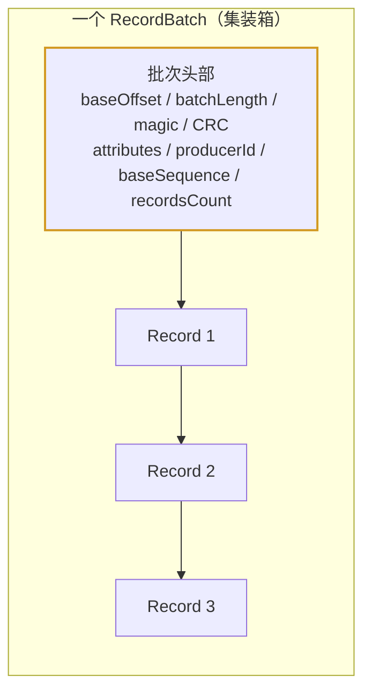
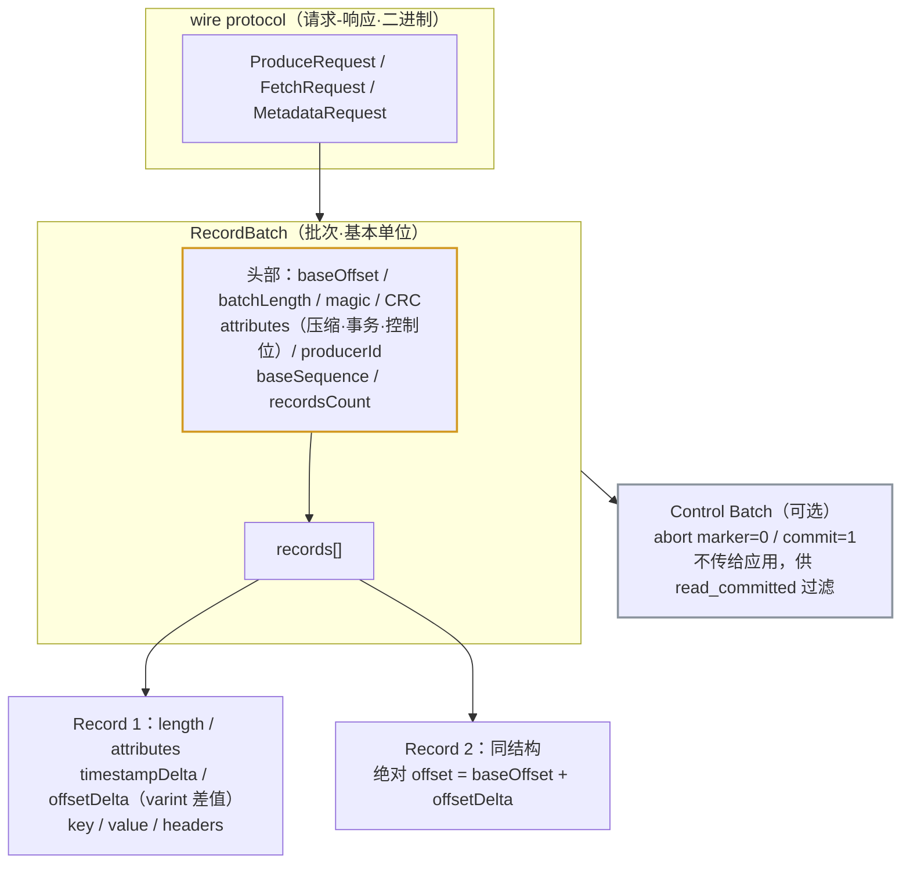

# 第 13 课：协议与消息格式

> 所属阶段：阶段 5《生产落地延伸》｜ 水平：零基础 ｜ 本课知识点：wire protocol 与消息格式
> 故事情节：拆开一个快递包裹——消息在网络和磁盘上到底长什么样

## 🎯 本课目标

- 理解 Kafka 协议的基本形态：请求-响应、二进制、可演进
- 看懂 RecordBatch 与 Record 的字节结构，说清为什么要「批量」
- 解释 magic、CRC、varint、control batch 这些字段各自解决什么问题
- 能用命令行/代码亲眼看到一条消息的真实字节

---

## 第一幕：起源与场景引入

> 前 12 课我们一直站在「使用者」视角：调 API、配参数、看现象。但有些问题在这个视角下**解释不了**。

几个真实场景：

> 🎬 **场景**：
> 1. **为什么压缩能省这么多？** 课 5 提过 `compression.type`。但你想过吗——如果每条消息独立压缩，「hello」这种短消息压缩后可能**反而变大**。Kafka 的压缩为什么有效？
> 2. **为什么升级客户端不会炸？** 公司的 Kafka 从 2.x 升到 4.x，老的生产者客户端居然还能用。两个版本相差好几年，凭什么还能对话？
> 3. **事务是怎么「标记」的？** 课 8 说消费者用 `read_committed` 过滤掉未提交的消息。可消费者怎么知道哪条消息属于一个**已中止的事务**？答案不在消息内容里，而在一批特殊的「标记」里。
> 4. **一条消息到底占多少字节？** 做容量规划时，`message.max.bytes` 默认 1MB 是怎么算出来的？一条只有 10 字节 payload 的消息，实际占了多少？

这四个问题的答案，全在**字节层面**。本课就是把消息拆开看。

---

## 第二幕：认知冲突

- **冲突一：「一条消息 = 一条记录」**。错。Kafka 里**消息永远按批写入**（Messages are always written in batches）。官方原文：一批消息的术语叫 **record batch**，一个 batch 含一条或多条 record；极端情况下可以只含一条。**批量不是优化，是格式的基本假设**——这直接回答了场景 1：压缩作用于**整批**，批里重复的 schema、相近的字段都能被压缩算法利用，所以才有效。
- **冲突二：「协议就是 API 文档」**。Kafka 的 wire protocol 是**二进制**的、有严格字节布局的协议。它不只是「怎么调用」，还包括「怎么演进」——这正是场景 2 的答案：协议设计时预留了版本号与可扩展字段，所以新旧客户端能共存。
- **冲突三：「消息里只要有 key 和 value 就够了」**。看一眼真实格式会发现，一条 record 除了 key/value 还有 **length、attributes、timestampDelta、offsetDelta、headers** 一大堆。这些「额外」字段各自解决一个问题：offsetDelta 让**批内偏移量只存差值**（省空间），timestampDelta 同理，headers 提供**不改消息体就能带元数据**的能力。
- **冲突四：「offset 每条消息都存一份」**。在 record 的字段里你**找不到绝对的 offset**，只有 `offsetDelta`——绝对 offset 由 batch 的 `baseOffset` 加上这个差值算出来。这就是 Kafka 能把「每条消息几十字节开销」压到很低的原因之一。

> ❓ **问题**：要回答这四个场景，需要理解三层——**协议层**（请求-响应与版本演进）、**批次层**（RecordBatch 的头部字段）、**记录层**（单条 Record 的紧凑编码）。

---

## 第三幕：层层揭示

### 知识点：wire protocol 与消息格式

**一句话定义**：Kafka 的 wire protocol 是客户端与 broker 之间交换的**二进制请求-响应协议**（如 Produce / Fetch / Metadata）；消息在协议和磁盘上**总是以 RecordBatch（批次）为单位**，一个批次含一条或多条 Record（记录），两者各有头部字段，采用 varint/varlong 变长编码与 CRC 校验。

#### 直觉建立（类比）

把消息想象成**发货**：

- **RecordBatch = 一个集装箱**。箱子上贴一张**总运单**（batch 头部）：这箱从哪个编号开始（baseOffset）、一共几件（recordsCount）、什么时候发的（baseTimestamp）、发货人是谁（producerId）、**封条校验码**（CRC）。
- **Record = 箱子里的一件货**。每件货挂一个小标签（record 头部）：相对第一件的**编号差**（offsetDelta，不是绝对编号）、相对发货时间的**时间差**（timestampDelta）、以及货物本身（key/value）。
- **varint = 弹性标签纸**。数字小就少用几字节——写「3」用一个字节，写「300」用两个字节。绝大多数场景都是小数字，于是普遍省空间。
- **CRC = 封条**。箱子中途被改动（比特翻转、磁盘损坏），封条对不上，立刻发现。

> 💡 **类比的边界**：集装箱的运单是给人看的，Kafka 的 batch 头部是给机器按固定字节偏移读的——**字段顺序和字节长度是格式的一部分**，不能随意调换。另外「封条」只覆盖部分字段（下面会讲 CRC 的范围），不是从头到尾全盖。

#### 概念与原理

**1. RecordBatch 的磁盘格式。** 下面是官方定义的完整字段（按字节顺序）：

```
baseOffset: int64              ← 批次中第一条记录的绝对 offset
batchLength: int32             ← 从本字段之后到批次末尾的字节数
partitionLeaderEpoch: int32    ← 分区 leader 纪元
magic: int8                    ← 格式版本号（当前为 2）
crc: uint32                    ← CRC-32C 校验
attributes: int16              ← 属性位（见下）
lastOffsetDelta: int32         ← 最后一条与第一条的 offset 差
baseTimestamp: int64           ← 批次中第一条的时间戳
maxTimestamp: int64            ← 批次中最大的时间戳
producerId: int64              ← 生产者 ID（幂等/事务用）
producerEpoch: int16           ← 生产者纪元（防僵尸实例）
baseSequence: int32            ← 起始序列号（去重用）
recordsCount: int32            ← 记录条数
records: [Record]              ← 记录数组
```

**`attributes` 是个位图**（16 位，一位一个开关）：

| 位 | 含义 |
|----|------|
| bit 0–2 | 压缩类型：0=无 / 1=gzip / 2=snappy / 3=lz4 / 4=zstd |
| bit 3 | timestampType（时间戳类型） |
| bit 4 | isTransactional（是否事务批次） |
| bit 5 | isControlBatch（是否控制批次） |
| bit 6 | hasDeleteHorizonMs（压实删除边界） |
| bit 7–15 | 未使用 |

几个值得记住的设计细节：

- **总大小 = `batchLength` + 12 字节**。官方明确：`batchLength` 统计的是**该字段之后**到批次末尾的字节数，所以整批大小要加上前面的 8 字节 baseOffset + 4 字节 batchLength。做容量估算时别算错。
- **CRC 的范围是「attributes 到批次末尾」，不覆盖 partitionLeaderEpoch**。为什么？官方解释了：partitionLeaderEpoch 是 broker 收到批次后才赋值的，**若纳入 CRC 就得为每个收到的批次重算校验**，代价太大。CRC 用的是 **CRC-32C（Castagnoli）多项式**。
- **必须先解析 magic 才能解释后面的字节**。因为 CRC 位于 magic 之后，客户端得先读出 magic 才知道该怎么理解「batchLength 到 magic 之间」的字节——这是**版本演进的锚点**，也是场景 2（新老客户端共存）的技术基础。
- **压缩时，压缩后的数据直接跟在 recordsCount 之后**。这印证了冲突一：压缩作用于**整批**，不是逐条。



**2. Record 的格式：** 注意这里大量使用**变长编码**（varint / varlong，与 Protobuf 编码相同）：

```
length: varint          ← 本条记录的长度
attributes: int8        ← 属性（bit 0-7 未使用，为将来预留）
timestampDelta: varlong ← 与批次 baseTimestamp 的时间差
offsetDelta: varint     ← 与批次 baseOffset 的 offset 差
keyLength: varint       ← key 长度（-1 表示 null）
key: byte[]
valueLength: varint     ← value 长度（-1 表示 null）
value: byte[]
headersCount: varint    ← header 数量
Headers => [Header]
```

三个关键点：

- **存差值不存绝对值**：`offsetDelta` 和 `timestampDelta` 都是相对批次的差值。一批几百条消息，offset 差值都很小（0、1、2…），varint 一字节搞定。这就是**场景 4 的答案**：一条小消息的元数据开销被压得极低。
- **空批次是合法的**。官方解释了一个反直觉现象：日志压实（compaction）时，即使批次里所有记录都被清掉了，**批次本身仍会被保留**——因为它承载着生产者的**最后序列号**（用于幂等去重）。如果丢了最后序列号，leader 切换后生产者可能收到 OutOfSequence 错误。所以**日志里可能出现「空的但必须存在」的批次**。
- **Header 的 key 保证非空，value 可为 null**，且**顺序在生产与消费之间保持不变**。这给了你一个不大但很有用的能力：不改消息体就能附加元数据（链路追踪 ID、schema 版本等）。

**3. Control Batch（控制批次）：事务的「标记」。** 这是场景 3 的答案。控制批次**只含一条 control record**，它**不会传给应用程序**，而是供消费者过滤已中止的事务消息。

控制记录的 key 遵循固定结构：

```
version: int16   ← 当前为 0
type: int16      ← 0 = abort marker（中止标记），1 = commit（提交）
```

value 的结构取决于 type，且**对客户端是不透明的**。回想课 8 的 `read_committed`：消费者读到一个 abort marker，就知道前面那些同事务的消息要丢弃——**判断依据就在这里**。

**4. 旧格式（0.11 之前）。** Kafka 0.11 之前，消息以 **message sets** 形式传输和存储。0.11 引入的这批改动（批次 + 幂等 + 事务）是 Kafka 的一次重大演进。理解这点有助于解释：为什么很多老文档和工具讲的「消息格式」和现在不一样。

#### 一句话记住

**消息永远按批存：RecordBatch 头部记「从哪开始、共几条、谁发的、校验码」，Record 里只存「相对差值」（offsetDelta/timestampDelta，varint 变长编码）以压缩开销；magic 字节是版本锚点，控制批次（abort/commit marker）是事务过滤的依据。**

---

## 第四幕：实操验证

> 本课实操的目标是**亲眼看到字节**。我们用课 3 的容器，把一条消息 dump 出来逐字节对照。老规矩先确认容器在跑（`docker ps` 能看到 kafka）。

**第 1 步：造几条消息。** 往课 3 建的 `orders` 里发两条带内容的消息：

```bash
docker exec -it kafka /opt/kafka/bin/kafka-console-producer.sh \
  --bootstrap-server localhost:9092 --topic orders

>hello
>world
```

（输入两行后按 `Ctrl+C` 退出。）

**第 2 步：找到消息在磁盘上的位置。** Kafka 的数据目录在容器内的 `/tmp/kraft-combined-logs`（课 3 的 combined 模式默认路径；若不同请按实际调整）：

```bash
docker exec -it kafka ls /tmp/kraft-combined-logs | head -20
```

能看到 `orders-0`、`orders-1` 等分区目录。进到某个分区看日志文件：

```bash
docker exec -it kafka ls -l /tmp/kraft-combined-logs/orders-0/
```

会有 `.log`、`.index`、`.timeindex` 三类文件——对应课 4 讲过的日志分段与索引。

**第 3 步：dump 出真实字节。** 用 `kafka-dump-log.sh` 查看批次结构：

```bash
docker exec -it kafka /opt/kafka/bin/kafka-dump-log.sh \
  --print-data-log --files /tmp/kraft-combined-logs/orders-0/00000000000000000000.log
```

输出大致形如（数值以你的实际输出为准）：

```
| baseOffset: 0 lastOffset: 1 count: 2 baseSequence: -1 lastSequence: -1
  producerId: -1 producerEpoch: -1 partitionLeaderEpoch: 0
  isTransactional: false isControl: false position: 0
  CreateTime: ... payload: hello
| baseOffset: 0 lastOffset: 1 count: 2 ... payload: world
```

逐项对照本课的格式：

- **`baseOffset: 0` / `lastOffset: 1` / `count: 2`** —— 这就是**批量**的证据：两条消息被打包进**同一个批次**，共享一个批次头部。回想冲突一：批量是格式的基本假设，不是优化。
- **`producerId: -1` / `producerEpoch: -1` / `baseSequence: -1`** —— 控制台生产者没开幂等，所以这些幂等/事务字段是 -1（表示未使用）。用课 8 的幂等生产者再发一批，这些位置就会出现真实的 PID 和序列号。
- **`isTransactional: false` / `isControl: false`** —— 对应 `attributes` 里的 bit 4 和 bit 5。

**第 4 步（可选）：用 Python 亲眼数一下 varint。** 想验证「小数字省空间」，可以在本机跑一小段：

```python
# varint 编码：数值越小，占用字节越少
def varint_size(n):
    size = 1
    while n >= 0x80:
        n >>= 7
        size += 1
    return size

for v in [0, 1, 127, 128, 1000, 100000]:
    print(f"{v:>8} -> {varint_size(v)} 字节")
```

输出会显示：0/1/127 各占 1 字节，128/1000 占 2 字节，100000 占 3 字节。而如果用定长 int32，它们**一律占 4 字节**。这就是 record 里 offsetDelta 用 varint 的原因——批内差值几乎都是小数字。

> ✅ **回扣场景**：四个问题——「压缩为什么有效」→ 压缩作用于整批（压缩数据直接跟在 recordsCount 后）；「升级为什么不炸」→ magic 字节作版本锚点，客户端先解析 magic 再解释后续字节；「事务怎么标记」→ control batch 的 abort/commit marker，消费者据此过滤；「一条消息占多少」→ 存差值 + varint，元数据开销被压到极低，且**整批大小 = batchLength + 12**。

> 🧗 **进阶挑战（可选）**：① 用 `kafka-dump-log.sh` 对比**开启压缩前后**的批次大小差异（`compression.type=gzip`），体会「批量压缩」的收益；② 用课 8 的事务生产者发一批并**故意中止事务**，再用 dump-log 找 `isControl: true` 的控制批次，亲眼看到 abort marker；③ 读官方 [Protocol](https://kafka.apache.org/protocol/) 页，找 ProduceRequest 的请求头结构，把它和本课的格式对照。

---

## 第五幕：体系收束

> 📍 **全局定位**：本课是前 12 课的「显微镜视角」。此前我们学的每一个机制，在字节层面都有对应物：`acks`（课 5）对应 broker 对批次的确认；`enable.idempotence`（课 8）对应 `producerId`/`producerEpoch`/`baseSequence` 三个字段；`read_committed`（课 8）对应 control batch 的 abort/commit marker；日志压实（课 6）对应「空批次仍保留」这个特殊规则。**理解了格式，机制就不再是需要背诵的结论。**
> 🔗 **下一步**：课 14《分层存储与配置进阶》，本阶段收官——讲 4.1+ 引入的分层存储（把冷数据放到远端存储）与配置管理进阶（配置提供器、系统属性）。

---

## 🐞 常见误区

1. **「一条消息独立存一条记录」**：错。消息**永远按批写入**，RecordBatch 是基本单位。压缩、offset 差值、序列号都是**批次级**概念——这也解释了为什么压缩有效（作用于整批）。
2. **「每条记录里存着绝对 offset」**：错。Record 里只有 `offsetDelta`（相对批次的差值），绝对 offset = `baseOffset` + `offsetDelta`。这是 Kafka 能把单条开销压得很低的关键。
3. **「CRC 校验整个批次」**：不完整。CRC 覆盖的是**从 attributes 到批次末尾**，**不包含 `partitionLeaderEpoch`**——因为该字段是 broker 收到后才赋值的，纳入校验会导致每批都要重算。
4. **「整批大小就是 batchLength」**：错。官方明确：整批大小 = **`batchLength` + 12 字节**（8 字节 baseOffset + 4 字节 batchLength 自身）。容量估算时容易算漏。
5. **「日志压实后不会有空批次」**：官方明确说明可能存在**空批次**——为了保留生产者的最后序列号（用于幂等去重）。丢掉它会导致 leader 切换后生产者报 OutOfSequence。
6. **「控制批次也是业务消息」**：不是。控制批次**不传给应用程序**，只供消费者过滤已中止的事务消息。它的 value 对客户端是**不透明**的。
7. **「消息格式自古以来就长这样」**：0.11 之前是 **message sets**，批次 + 幂等 + 事务都是 0.11 引入的。看老文档时要注意区分。

## 📚 官方文档

- [Message Format（4.3）](https://kafka.apache.org/43/implementation/message-format/)：RecordBatch / Record / Control Batch / Record Header 的完整字节定义（本课的权威出处）
- [Messages（4.3）](https://kafka.apache.org/43/implementation/messages/)：消息与批次的字段语义说明
- [Protocol（顶层）](https://kafka.apache.org/protocol/)：wire protocol 与 API 规范
- [Protocol（4.3 design）](https://kafka.apache.org/43/design/protocol/)：协议设计说明
- [Log 实现（4.3）](https://kafka.apache.org/43/implementation/log/)：批次如何落盘、压实与保留（回扣课 4）

## 一图总结



> 读法：协议层把请求送到 broker；**批次（黄色头部）是存储与传输的基本单位**，一条批次头 + 多条记录共享它；记录内部只存**相对差值**（varint），绝对 offset 由批次 baseOffset 加出来；灰色是可选的控制批次，事务的 abort/commit 标记就在这里。

## 课后小测

**Q1**：一条批次里 baseOffset=100，某条记录的 offsetDelta=3。该记录的绝对 offset 是多少？为什么要这样存？
- A. 103；因为 varint 存小差值省空间，绝对 offset 由 baseOffset 加出来
- B. 100；offsetDelta 只是排序用
- C. 3；offsetDelta 就是绝对 offset
- D. 无法计算，需要查索引文件

<details><summary>答案与解析</summary>

**答案：A**。Record 里**不存绝对 offset**，只存相对批次的 `offsetDelta`；绝对 offset = `baseOffset` + `offsetDelta`。这样设计的原因：批内差值都是 0、1、2… 这类小数字，varint 编码一个字节就能放下，而存 int64 绝对 offset 要 8 字节——**单条消息的元数据开销被压到极低**。

</details>

**Q2**：关于 RecordBatch 的 CRC，下列说法正确的是？
- A. CRC 覆盖整个批次的所有字节，从头到尾
- B. CRC 从 attributes 覆盖到批次末尾，不覆盖 partitionLeaderEpoch
- C. CRC 只校验 records 部分，不校验头部
- D. CRC 覆盖 magic 之前的所有字段

<details><summary>答案与解析</summary>

**答案：B**。官方明确：CRC 覆盖**从 attributes 到批次末尾**的数据，**不包含 `partitionLeaderEpoch`**——因为该字段是 broker 收到批次后才赋值的，若纳入校验，broker 就得为每个收到的批次重算 CRC，代价过大。另外 CRC 用的是 **CRC-32C（Castagnoli）** 多项式，且它位于 magic 之后，所以**必须先解析 magic 才能知道怎么解释前面的字节**。

</details>

**Q3**：日志压实（compaction）后，日志里可能出现「一条记录都不剩」的空批次。官方为什么保留它？
- A. 为了保持 offset 连续性，纯属历史遗留
- B. 为了保留生产者的最后序列号，供幂等去重与 leader 切换后恢复生产者状态
- C. 因为 Kafka 不支持物理删除批次
- D. 为了记录 baseTimestamp，供时间保留策略使用

<details><summary>答案与解析</summary>

**答案：B**。官方明确：压实时会**保留原始批次的首尾 offset/序列号**，因为这是**日志重载后恢复生产者状态**所必需的。若丢失最后序列号，分区 leader 故障后生产者可能收到 OutOfSequence 错误；base sequence number 则用于重复检测（broker 校验 incoming 批次的首尾序列号是否匹配）。所以「空但必须保留」的批次是设计使然。顺带一提，官方还指出 **`baseTimestamp` 在压实中不被保留**，会随之改变。

</details>

## 🚀 下一批接力提示词

> 学完本课后，**复制下面这段文字发给 AI**，即可无缝进入下一批（无需重新描述上下文）：

```
继续学 Kafka。我的学习档案在 kafka/00-学习档案.md，
刚学完阶段 5《生产落地延伸》的课《协议与消息格式》知识点 wire protocol 与消息格式，
请按大纲继续讲解下一批知识点（课14：分层存储与配置进阶）。
```

## 🧭 课程导航

⬅️ **上一课**：[课 12：多租户与配额](lesson-12-多租户与配额.md)

➡️ **下一课**：[课 14：分层存储与配置进阶](lesson-14-分层存储与配置进阶.md)

📚 **返回目录**：[课程目录](../../../02-课程目录.md)
