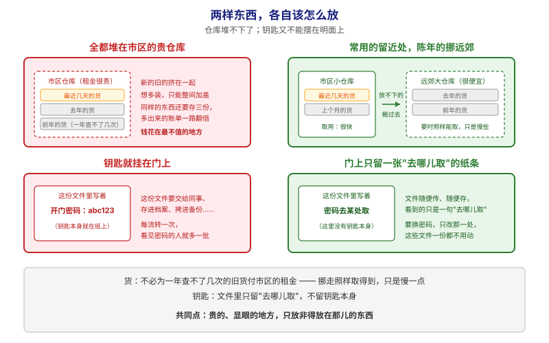
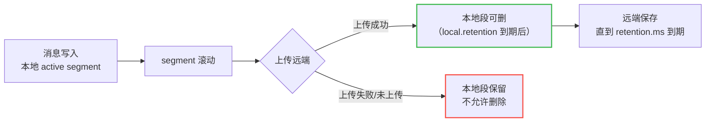
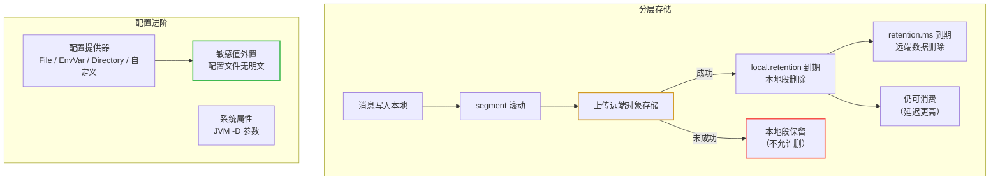

# 第 14 课：分层存储与配置进阶

> 所属阶段：阶段 5《生产落地延伸》｜ 水平：零基础 ｜ 本课知识点：分层存储与配置进阶
> 故事情节：仓库放不下了——把陈年旧货挪到远郊仓库，顺带把钥匙管理也理一理

## 🎯 本课目标

- 理解分层存储解决的问题：让 Kafka 能廉价地保存长期历史数据
- 说清两级保留（本地保留 vs 总保留）的含义与配置方式
- 记住分层存储的硬性限制（尤其是 compacted topic 不支持）
- 会用配置提供器把敏感配置从明文配置文件里挪出去

---

## 第一幕：起源与场景引入

> 前 13 课讲的都是「消息怎么流动」。本课换个角度——**消息堆在那里不动的时候，怎么办**。

公司的订单链路跑了两年，运维找到你：

> 🎬 **场景**：
> 1. **磁盘撑不住了。** `orders` 要保留**两年**（合规要求 + 数据团队要回溯），按现在的量算是几十 TB。全用 SSD 存，成本高得离谱。可这些历史数据**一年也就被查几次**——值得为它们买 SSD 吗？
> 2. **扩容遇到天花板。** 加机器能扩容量，但代价是**副本也随之增多**（课 7 的 RF=3），存储成本按副本倍数放大。而且 broker 越多，重启恢复越慢。有没有办法**不按比例加 broker** 也能扩容量？
> 3. **配置文件里有明文密码。** 上一课（课 11）刚给集群配了 SASL，结果密码被写死在 `server.properties` 里，这个文件还要进 Git。安全团队又来找了——怎么让**配置文件里不出现明文凭据**？

前两个问题指向同一个答案：**分层存储（Tiered Storage）**。第三个问题指向本课后半部分：**配置提供器（Configuration Providers）**。

> 📌 **一句话本质**：本课做的事，是把「贵的、显眼的地方，什么都往上堆」改成「**贵的、显眼的地方，只放非得放在那儿的东西**」——陈年旧货挪去便宜的远郊仓库（挪走照样取得到），钥匙从文件里挪出去、只留一句"去哪儿取"。
>
> ⚖️ **处境对照**（沿用第一幕的三个麻烦：`orders` 要留两年、加机器会遇到天花板、密码写进了配置文件）：
> - **不这么做（全堆本地 + 明文凭据）**：几十 TB 历史数据**一年查不了几次**却全占着 SSD，且**每加一台机器，副本跟着复制**，成本按倍数放大；密码明文写在 `server.properties` 里，文件一进 Git / 镜像 / 备份，**看见的人就多一批**。
> - **这么做（分层 + 配置外置）**：本地只留热数据，冷数据挪对象存储——**照样能消费，只是慢一点**；不必按副本倍数加机器；配置文件里只留**引用**，密码留在外部来源，换密码时**这些文件一份都不用动**。
>
> ⏳ **数字来源说明**：以上为**定性对照**（按"占的是哪种存储、文件流传到谁手里"比较），不是实测容量或成本数据。"两年 / 几十 TB / 一年查几次"是**本课场景设定的假设数字**，用于讲清量级。**真实成本与延迟取决于你的数据量、对象存储选型与实现方案**（且 Apache Kafka 不自带远端存储实现，见第四幕的前置说明），请以自己的评估为准。

---

## 第二幕：认知冲突

- **冲突一：「扩容 = 加 broker」**。这是课 4 以来的默认思路。但存冷数据这个场景下它失效了：加 broker 意味着**计算与存储等比增长**，可你只需要存储。分层存储的思路恰恰是**把存储和计算解耦**——热数据留在 broker 本地磁盘（低延迟），冷数据挪到远端对象存储（廉价）。
- **冲突二：「挪走了还能读吗？」**。直觉是「挪走 = 归档 = 读不了/很慢」。但分层存储的远端数据**仍然可以正常消费**——消费者从最早开始读，Kafka 会从远端拉取。差异是**延迟**，不是**可用性**。
- **冲突三：「保留策略还是一个 retention.ms」**。分层存储引入了两级保留，这是最容易搞混的地方：`local.retention.ms`（本地保留多久）和 `retention.ms`（总保留多久，含远端）。**只有上传到远端之后，本地段才允许被删除**——这条规则保证了数据不会「两边都没有」。
- **冲突四：「配置写文件里就行，反正有权限控制」**。文件进 Git、进镜像、进备份，权限控制就失效了。配置提供器的价值是把敏感值**留在文件之外**，配置文件里只留一个**引用**。

> ❓ **问题**：本课两件事——**分层存储**（本地/远端两级保留 + 启用与关闭的正确姿势 + 硬性限制）和**配置进阶**（配置提供器 + 系统属性）。

---

## 第三幕：层层揭示

### 一眼全局图（进入细节前先看一眼）



> 看图：**上面一组讲"货"，下面一组讲"钥匙"，两组都是"左边将就、右边讲究"**。上左边新的旧的挤在租金最贵的市区仓库，想多装只能整间加盖，而同样的东西还要存三份、账单翻倍；上右边**常用的留近处、陈年的挪远郊**——挪走不是扔掉，**要时照样能取，只是慢些**。下左边开门密码直接写在文件上，这份文件要交给同事、存进档案、拷进备份，**每流转一次，看见密码的人就多一批**；下右边文件里只写一句"密码去某处取"，**文件随便传，里面不含钥匙本身**。**最下面那句是两组的共同点**：贵的、显眼的地方，只放非得放在那儿的东西。

**四条硬约束**说明：① 本图只回答"本课要解决什么问题、靠什么思路"；② 图上不出现术语（分层存储、远端、本地保留、配置提供器、凭据这些词都在下面才出场）；③ 已带读图指引；④ 图旁文字能独立说清同一件事。

### 本课地图（分几步走）

| 步 | 这一步要解决什么（人话） | 对应知识点 |
|:--:|------------------------|-----------|
| 1 | 货怎么放：分清"近处留多久、远郊留多久"，以及挪走前必须先确保对方收到了 | 分层存储（两级保留 · 开关与限制） |
| 2 | 钥匙放哪：让配置文件里不再出现明文凭据 | 配置进阶（配置提供器 · 系统属性） |

> 只回答"分几步走、现在在哪"；不写机制、不写结论；**不标学习状态**（进度以 `00-学习档案.md` 为准）。

### 知识点：分层存储与配置进阶

> 🧭 第 1/2 步｜承接：第一幕里"磁盘撑不住"和"加机器遇到天花板"两个麻烦 → 本步：把仓库拆成近处和远郊两层，并定下"挪走前必须先确认对方收到了"这条铁律

**一句话定义**：分层存储（Tiered Storage）把日志段分为**本地（broker 磁盘）**与**远端（对象存储）**两层，通过 `local.retention.*` 与 `retention.*` 两级保留策略，在保持可消费能力的同时大幅降低长期存储成本；配置提供器（Configuration Providers）则允许从外部来源（文件/环境变量/目录，或自定义实现）加载配置，避免敏感信息写进配置文件。

#### 直觉建立（类比）

回到「仓库」的类比，这次给它加个**远郊仓库**：

- **本地仓库（broker 磁盘）**：就在市区，取货极快，但**租金贵**（SSD）。放最近几天的货。
- **远郊仓库（对象存储）**：便宜量大，但取货要开一小时车。放陈年旧货。
- **规则**：**一件货必须先安全送到远郊仓库，本地才能把它清掉**——否则就真丢了。
- **客户体验**：客户要陈年旧货，照样能拿到，只是**等得久一点**。

> 💡 **类比的边界**：真实的分层存储不会「等一小时」，但**延迟确实显著高于本地**。所以它适合的场景是「**冷数据、偶尔查**」，不适合「高频回溯」。另外远郊仓库**不是备份**——它是 Kafka 存储的一部分，数据仍受 Kafka 的保留策略管理。

#### 概念与原理

**1. 两级保留：本地 vs 远端。**

这是分层存储最容易混淆的地方，务必分清：

| 配置 | 含义 |
|------|------|
| `local.retention.ms` / `local.retention.bytes` | **本地**日志段保留多久（超时后本地段可删） |
| `retention.ms` / `retention.bytes` | **总**保留多久（超时后**远端**数据删除） |
| `remote.storage.enable` | topic 级开关，是否启用分层存储 |

关键规则（官方原文含义）：**本地日志段只有在成功上传到远端之后，才具备被删除的资格**。这条规则是数据安全的基础——它保证了任何时刻，数据要么在本地，要么在远端。



> 看图：**顺着箭头从左往右走**，中间那个岔口是整件事的**闸门**：**只有走上面那条（送到了远郊）才允许清近处**，绿色是"可以清了"；走下面那条（没送到或失败了）红色那格——**必须老实留着，不许清**。**这条铁律只为保一件事**：任何时刻，这批货至少在一处找得到。

**2. 启用与关闭的正确姿势。** 分层存储的开关有**集群级**和 **topic 级**两层，且关闭顺序有讲究：

- **集群级开关**：`remote.log.storage.system.enable`（broker 配置，默认关闭）。
- **topic 级开关**：创建 topic 时用 `--config remote.storage.enable=true`，或事后用 `kafka-configs.sh` 改。
- **Apache Kafka 不提供开箱即用的 RemoteStorageManager**——需要自己实现或选择第三方实现。这是官方明确的限制（此前 [场景解法库 · 场景 4 历史数据重放](../../../10-场景解法库/场景-04-历史数据重放.md) 已记录）。

关闭时有两种粒度：

| 目的 | 配置 | 说明 |
|------|------|------|
| **只读模式**（停止继续上传，保留已有远端数据） | `remote.storage.enable=true, remote.log.copy.disable=true` | 同时**必须**把 `local.retention.ms` / `local.retention.bytes` 设为与 `retention.*` 相同，或设为 `-2`。否则本地保留策略不再生效，可能导致**磁盘写满** |
| **彻底关闭并删除远端数据** | `remote.storage.enable=false, remote.log.delete.on.disable=true` | 远端日志一并删除 |

> ⚠️ **集群级关闭的硬性前置**：想关掉集群级分层存储，**必须先显式删除所有启用了分层存储的 topic**。官方明确：不删 topic 就直接关集群级开关，**broker 启动时会抛异常**。流程是：删 topic → 再设 `remote.log.storage.system.enable=false`。

**3. 四项硬性限制（必记）。** 官方列出的 Limitations：

1. **不支持 compacted topic**（压实主题不能用分层存储）——回扣课 6 的 log compaction，如果你的 topic 是压实型的，这条路走不通。
2. **关闭集群级分层存储前，必须先在启用它的所有 topic 上关闭**。
3. **分层存储相关的管理操作，仅支持 3.0 及以上版本的客户端**。
4. **不支持缺少 producer snapshot 文件的日志段**——这种情况可能出现在 **2.8.0 之前创建的 topic** 上（老 topic 要留意）。

**4. 配置提供器：把秘密移出配置文件。**

> 🧭 第 2/2 步｜承接：上一步把"货"分成了近处和远郊两层，解决了前两个麻烦 → 本步：换到第一幕的第三个麻烦——让**配置文件里不再出现明文凭据**

官方的定位很明确：用配置提供器**从外部来源加载配置数据**，其中就可能包括**敏感信息**（密码、API key、其他凭据）。三种内置实现：

| 提供器 | 取值来源 | 典型用途 |
|--------|----------|----------|
| `FileConfigProvider` | 文件 | 从受控文件读密码 |
| `EnvVarConfigProvider` | 环境变量 | 容器化部署（K8s Secret 注入 env） |
| `DirectoryConfigProvider` | 目录 | 一批配置文件集中放置 |
| 自定义 | 实现 `ConfigProvider` 接口 | 对接 Vault/KMS 等secret 系统 |

配置方式（先在 `config.providers` 声明别名与类，再给该别名传参）：

```properties
config.providers=provider1,provider2
config.providers.provider1.class=com.example.Provider1
config.providers.provider2.class=com.example.Provider2
config.providers.<provider_alias>.param.<name>=<value>
```

自定义实现只需实现 `ConfigProvider` 接口、打包成 JAR、加入 classpath，然后在配置里引用类名即可。

**5. 系统属性：通过 JVM `-D` 参数设置的配置。**

与 `server.properties` 不同，系统属性是 **Java 系统属性**，通常用 `-D` 传给 JVM。典型例子（并注意它们的**引入版本**）：

| 系统属性 | 作用 | 起始版本 | 默认值 |
|----------|------|----------|--------|
| `org.apache.kafka.sasl.oauthbearer.allowed.files` | 允许 SASL OAUTHBEARER 插件读取的文件列表（逗号分隔） | **4.1.0** | 空列表 |
| `org.apache.kafka.sasl.oauthbearer.allowed.urls` | 允许作为 OAUTHBEARER token/jwks 端点的 URL 列表 | **4.0.0** | 空列表 |

例如：

```bash
-Dorg.apache.kafka.sasl.oauthbearer.allowed.files=/tmp/token,/tmp/private_key.pem
```

> 💡 注意这两个属性**默认是空列表**——意味着 OAUTHBEARER 插件默认**不允许读取任何文件/URL**，必须显式配置。这是「默认安全」的设计取向（secure by default）。

#### 🗣️ 行话对照（本课说法 → 行业术语）

本课用"市区仓库 / 远郊仓库 / 钥匙"打比方，读文档和配参数时你会遇到下面这些行话——**同一件事的另一套名字**：

| 本课说法（人话） | 行业标准叫法 | 典型配置 / 在哪遇到 | 代价 / 注意 |
|---|---|---|---|
| 把货分近处和远郊两层存 | **Tiered Storage**（本文自拟译"分层存储"，社区常用译法、官方未定中文名） | `remote.log.storage.system.enable`（集群级）、`remote.storage.enable`（topic 级） | Apache Kafka **不自带**远端存储实现，需自建或选第三方 |
| 近处的仓库 | **local / local log segments**（本文沿用"本地"） | broker 本地磁盘 | 贵（SSD）、快 |
| 远郊的仓库 | **remote / remote storage**（本文沿用"远端"，指对象存储） | 由远端存储管理器对接 | 便宜、**延迟显著高于本地**；适合冷数据偶尔查 |
| 近处留多久 | `local.retention.ms` / `local.retention.bytes` | topic 级配置 | 到期只是"**取得删除资格**"，**还得先上传成功** |
| 总共留多久（含远郊） | `retention.ms` / `retention.bytes` | topic 级配置 | 到期后删的是**远端**数据 |
| "挪走前必须确认对方收到了" | 本地段**只有成功上传到远端后**才可被删除 | broker 内部规则，无开关 | 保证任何时刻至少一处有数据 |
| 只搬不再搬（只读） | `remote.log.copy.disable=true` | topic 级 | **必须同时**把 `local.retention.*` 与 `retention.*` 设同值或 `-2`，否则本地保留失效、**可能磁盘写满** |
| 连远郊的一起清掉 | `remote.storage.enable=false` + `remote.log.delete.on.disable=true` | topic 级 | 远端数据一并删除 |
| 挪走的是"账本型"仓库就不行 | **不支持 compacted topic**（本文自拟译"压实主题"，非通用译名） | 官方 Limitations 第一条 | 课 6 的 log compaction 主题走不了这条路 |
| 钥匙不去门上取 | **Configuration Providers**（本文自拟译"配置提供器"，社区常用译法、官方未定中文名） | `config.providers=<别名>` + `config.providers.<别名>.class=...` | 配置文件里只留**引用**，敏感值留在外部 |
| 从文件 / 环境变量 / 目录取 | `FileConfigProvider` / `EnvVarConfigProvider` / `DirectoryConfigProvider` | 内置三种实现 | 也可实现 `ConfigProvider` 接口自定义（如对接 Vault/KMS） |
| 另一类"不在文件里"的配置 | **System Properties**（本文沿用"系统属性"） | JVM `-D` 参数，如 `org.apache.kafka.sasl.oauthbearer.allowed.files` | 与 `server.properties` 不同源；多个属性**默认是空列表**（默认安全） |

> 📖 **关于译名**：本表带"本文自拟译"字样的中文名是**为便于阅读自拟的、非通用译名**；带"社区常用译法、官方未定中文名"的是社区在用但官方未定名的译法。**标注只在首次登场给一次**，后文不再重复括注。

#### 一句话记住

**分层存储 = 本地存热、远端存冷，`local.retention` 管本地、`retention` 管远端，本地段必须上传成功后才允许删；四大限制里最要紧的是「不支持 compacted topic」和「关集群级前必须删光分层 topic」。配置提供器把敏感值外置（文件/环境变量/目录/自定义），系统属性走 JVM `-D`。**

---

## 第四幕：实操验证

> ⚠️ **重要前置说明**：Apache Kafka **不提供开箱即用的 RemoteStorageManager**，我们的单容器环境**无法真实跑通**分层存储。因此本课的实操分两部分：**配置提供器可在本机真实验证**；**分层存储以「读配置 + 验命令语法」为主**，真实验证需要自建/选用 RSM 实现（见进阶挑战）。这一边界如实说明，不假装跑通。

**第 1 步：确认本地环境不支持分层存储。** 查看当前 broker 的分层存储开关（应为关闭或不存在该配置）：

```bash
docker exec -it kafka /opt/kafka/bin/kafka-configs.sh \
  --bootstrap-server localhost:9092 \
  --describe --entity-type brokers --entity-default
```

无相关输出 = 集群未启用分层存储，符合预期（默认 `remote.log.storage.system.enable=false`）。

**第 2 步：读懂一个分层存储 topic 的完整创建命令。** 官方示例（**读懂即可，当前环境执行会失败**）：

```bash
bin/kafka-topics.sh --create --topic tieredTopic --bootstrap-server localhost:9092 \
  --config remote.storage.enable=true \
  --config local.retention.ms=1000 \
  --config retention.ms=3600000 \
  --config segment.bytes=1048576 \
  --config file.delete.delay.ms=1000
```

对照知识点：

- `remote.storage.enable=true` —— 开启分层；
- `local.retention.ms=1000` —— 本地段上传后 1 秒即可删（**官方标注为测试用值**，生产别这么配）；
- `retention.ms=3600000` —— 远端数据保留 1 小时（同样为测试值）；
- `segment.bytes=1048576` —— 缩小段大小以加快滚动（官方标注 for test only）；
- `file.delete.delay.ms` —— 加快本地段删除延迟（for test only）。

**第 3 步：验证「远端数据仍可消费」的官方验证思路。** 官方给的验证方法值得记住——**从最早位置消费，确认能读到 offset 0**：

```bash
bin/kafka-console-consumer.sh --topic tieredTopic --from-beginning \
  --max-messages 1 --bootstrap-server localhost:9092 \
  --formatter-property print.offset=true
```

若能读到 offset 0，说明远端拉取链路正常。同时可检查远端目录（路径依实现不同）：

```bash
ls /tmp/kafka-remote-storage/kafka-tiered-storage/tieredTopic-0-*
```

会看到 `.log`、`.index`、`.timeindex`、`.snapshot`、`.leader_epoch_checkpoint` 等文件——**段文件的构成和本地一致**，只是位置在远端。

**第 4 步：真实可执行——验证配置提供器的思路。** 配置提供器的验证需要改 broker 配置并重启，这里给出**配置形态**供对照（不要在未评估的情况下直接改生产配置）：

```properties
# 声明两个提供器：从文件读、从环境变量读
config.providers=fileProvider,envProvider
config.providers.fileProvider.class=org.apache.kafka.common.config.provider.FileConfigProvider
config.providers.envProvider.class=org.apache.kafka.common.config.provider.EnvVarConfigProvider
```

声明后，配置值就可以写成对提供器的**引用**，而不是把密码直接写进来——**配置文件里不再出现明文凭据**，也就解决了场景 3 的「密码进 Git」问题。

> ✅ **回扣场景**：三个问题——「磁盘撑不住」→ 冷数据挪远端对象存储，本地只留热数据；「扩容天花板」→ 存储与计算解耦，不必按副本倍数加 broker；「明文密码」→ 配置提供器外置敏感值（文件/环境变量/目录/自定义实现）。

> 🧗 **进阶挑战（可选）**：① 选用或实现一个 RemoteStorageManager（如基于 S3/MinIO 的实现），用 MinIO 在本地搭一个 S3 兼容的对象存储，真实跑通「本地→远端→消费最早」的全链路；② 验证关闭顺序：先设 `remote.log.copy.disable=true` 观察只读行为，再删 topic，最后关集群级开关，看是否真的抛异常；③ 用 FileConfigProvider 把 SASL 密码外置，验证 broker 能正常启动且配置文件中无明文。

---


### 4.2 应用实战（动手篇 · 独立成册）

> 📘 **[→ 打开应用实战：分层存储与配置进阶](../../../应用实战/14-分层存储与配置进阶.md)**
>
> 课里讲的是「两级保留 + 配置外置」两条线，实战篇带你把边界跑清楚：① 基础版——只有一个 `retention.ms`，两年历史全占 SSD、且凭据明文躺在配置文件里；② 综合版——读懂 `local.retention.*` 与 `retention.*` 的分工与「上传成功才允许删本地」的闸门，并写出配置提供器的引用形态（本机无远端存储实现，分层部分只验配置与命令语法，如实标注不伪造输出）。

---

## 第五幕：体系收束

> 📍 **全局定位**：本课是阶段 5 的收官，也是整个 Kafka 课程的收官。回看五幕主线：课 1–2 回答「为什么需要」，课 3–6 回答「消息怎么流动」，课 7–8 回答「怎么不丢不重」，课 9–10 回答「怎么写代码与设计架构」，阶段 5（课 11–14）补上「怎么敢上生产」——安全（11）、资源治理（12）、底层格式（13）、成本与配置（14）。**从「会用」到「敢上生产」，这条线走完了。**
> 🔗 **下一步**：回到 [final-课程手册.md](../../../final-课程手册.md) 做全书回顾，或用 [10-场景解法库](../../../10-场景解法库/INDEX.md) 的开放设计题检验自己——现在是「先想后看」的最佳时机，你有 14 课的底子了。

---

## 🐞 常见误区

1. **「分层存储的远端数据等于备份，读不了或很麻烦」**：错。远端数据**仍可正常消费**，消费者从最早读即可；差异在**延迟**而非可用性。它仍是 Kafka 存储的一部分，受保留策略管理。
2. **「开了分层存储，本地想删就删」**：错。**本地日志段必须成功上传到远端后才具备删除资格**——这是防止「两边都没有」的关键规则。
3. **「`retention.ms` 就是本地保留时间」**：分层存储下有两级：`local.retention.*` 管本地段，`retention.*` 管远端（总）保留。混淆会导致数据过早或过晚删除。
4. **「关掉分层存储直接改 broker 配置就行」**：官方明确——**必须先显式删除所有启用了分层存储的 topic**，否则 broker 启动抛异常。顺序是：关 topic 级 → 删 topic → 关集群级。
5. **「只读模式只要设 `remote.log.copy.disable=true` 就够了」**：不够。官方要求**同时**把 `local.retention.ms` / `local.retention.bytes` 设为与 `retention.*` 相同**或设为 `-2`**；否则本地保留策略失效，可能导致**磁盘写满**。
6. **「压实（compacted）topic 也能用分层存储」**：**不支持**。这是官方列出的第一条限制。课 6 讲过的 log compaction 主题走不了这条路。
7. **「Apache Kafka 自带远端存储实现，开箱即用」**：不提供。需要自行实现或选用第三方 RemoteStorageManager（[场景解法库 · 场景 4](../../../10-场景解法库/场景-04-历史数据重放.md) 已记录此限制）。
8. **「OAUTHBEARER 插件默认能读配置文件里的 token」**：不能。相关系统属性（`...allowed.files` / `...allowed.urls`）**默认是空列表**，必须显式配置——默认安全取向。

## 📚 官方文档

- [Tiered Storage 运维（4.3）](https://kafka.apache.org/43/operations/tiered-storage/)：启用/关闭、两级保留、四项限制（本课的权威出处）
- [Tiered Storage Configs（4.3）](https://kafka.apache.org/43/configuration/tiered-storage-configs/)：`remote.log.storage.system.enable` 等配置项
- [Configuration Providers（4.3）](https://kafka.apache.org/43/configuration/configuration-providers/)：FileConfigProvider / EnvVarConfigProvider / DirectoryConfigProvider / 自定义实现
- [System Properties（4.3）](https://kafka.apache.org/43/configuration/system-properties/)：通过 JVM `-D` 设置的系统属性与其引入版本
- [Log 实现（4.3）](https://kafka.apache.org/43/implementation/log/)：日志段与保留策略（回扣课 4）
- [Multi-Tenancy（4.3）](https://kafka.apache.org/43/operations/multi-tenancy/)：与课 12 的配额治理配合阅读

## 一图总结



> 读法：上半部分是**分层存储的生命周期**——黄点是关键闸门（上传成功才允许删本地），红点是保护规则（未上传成功必须保留本地），最终远端数据按 `retention.ms` 删除且**始终可消费**；下半部分是**配置进阶**——配置提供器与系统属性共同解决「敏感值不进配置文件」。

> **与课首入口的分工（勿混，三方视角）**：「一眼全局图」在课首、问题视角、零术语，给没学过的人看（回答"为什么需要它、靠什么思路"）；「本课地图」在课首、路线视角（回答"分几步走、现在在哪"），是表格不是图；本图在课末、知识视角，给刚学完的人复习用（回答"本课讲了什么"）。三者不可替代、不雷同。

## 课后小测

**Q1**：某 topic 启用了分层存储，配置了 `local.retention.ms=3600000`、`retention.ms=604800000`。下列说法正确的是？
- A. 本地数据保留 1 小时，远端数据保留 7 天；本地段上传成功后才允许删除
- B. 本地和远端都保留 7 天
- C. 本地保留 7 天，远端保留 1 小时
- D. 数据 1 小时后彻底删除

<details><summary>答案与解析</summary>

**答案：A**。分层存储是**两级保留**：`local.retention.*` 管本地段，`retention.*` 管远端（总）保留。且官方明确：**本地日志段只有在上传到远端之后，才具备被删除的资格**——这条规则保证数据任何时刻至少存在于一处。B/C 混淆了两级配置，D 忽略了远端仍会保留。

</details>

**Q2**：管理员想关闭集群级分层存储，直接把 `remote.log.storage.system.enable=false` 写进 broker 配置并重启。会发生什么？
- A. 正常关闭，远端数据保留
- B. broker 启动抛异常，因为仍有 topic 启用了分层存储
- C. 自动禁用所有 topic 的分层存储
- D. 远端数据被自动删除，集群正常启动

<details><summary>答案与解析</summary>

**答案：B**。官方明确：想关闭集群级分层存储，**必须先显式删除所有启用了分层存储的 topic**；不删就关集群级开关，会导致**启动时抛异常**。正确顺序：先在 topic 级关闭（只读模式或彻底删除远端），再删除 topic，最后设集群级开关为 false。

</details>

**Q3**：关于配置提供器（Configuration Providers），下列说法错误的是？
- A. 可以用来从外部来源加载密码、API key 等敏感信息
- B. 内置实现包括 FileConfigProvider、EnvVarConfigProvider、DirectoryConfigProvider
- C. 可以通过实现 ConfigProvider 接口自定义，打包成 JAR 使用
- D. 配置提供器只能用于加载非敏感的普通配置，敏感信息必须写进配置文件

<details><summary>答案与解析</summary>

**答案：D**。官方定位恰恰相反：配置提供器用于**从外部来源加载配置数据，其中就可能包括敏感信息**（密码、API key、其他凭据）。把敏感值外置、让配置文件里只留引用，正是它的核心价值——也直接解决了「密码进 Git」的问题。A/B/C 均为官方原文支持的描述。

</details>

## 🚀 下一批接力提示词

> 学完本课后，**阶段 5 收官**。复制下面这段文字发给 AI，可做全书回顾与检验：

```
Kafka 课程已全部学完（4 阶段主线 10 课 + 阶段 5 生产落地延伸 4 课）。我的学习档案在 kafka/00-学习档案.md，
刚学完阶段 5 的课《分层存储与配置进阶》。
请帮我做全书回顾：用 final-课程手册.md 串联所有课程，并用 10-场景解法库/INDEX.md 的开放设计题检验我的掌握程度。
```

## 🧭 课程导航

⬅️ **上一课**：[课 13：协议与消息格式](lesson-13-协议与消息格式.md)

➡️ **下一课**：阶段 5 收官 → [课程手册](../../../final-课程手册.md) · [场景解法库](../../../10-场景解法库/INDEX.md)

📚 **返回目录**：[课程目录](../../../02-课程目录.md)
