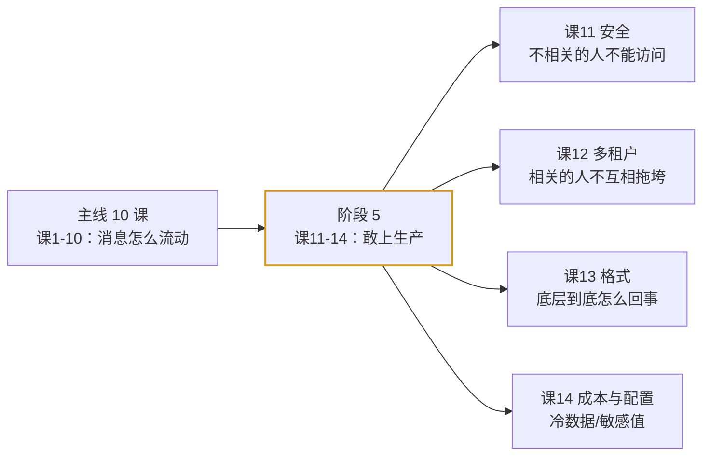

# 阶段 5：生产落地延伸

> 2026-09-10 新增。对照 Apache Kafka 4.3 官方文档索引（`web-index/`）核对主线 10 课后，补上生产必备但主线未覆盖的四个域。

## 阶段目标

从「会写 demo」走到「敢上生产」。主线 10 课解决的是**消息怎么可靠地流动**，本阶段解决的是**流动给正确的人看、且在共享环境下不互相伤害、并知道底层到底怎么回事、以及成本怎么控**。

## 为什么会有这个阶段

2026-09-10 用 `web-index/kafka/` 索引对主线 10 课做了一次覆盖核对，发现官方 4.3 文档里有以下内容课程零覆盖：

| 缺口 | 处置 |
|------|------|
| **ELR（Eligible Leader Replicas）** | ⚠️ 属**纠错**——已直接修订进**课 7**（与旧 ISR 模型冲突，不改会让已学内容过时） |
| 安全体系（认证/授权/加密/listeners） | 新建**课 11** |
| 多租户与配额 | 新建**课 12** |
| 协议与消息格式 | 新建**课 13** |
| 分层存储 | 新建**课 14**（合并配置提供器与系统属性） |

其中 ELR 优先级最高：课 7 原有结论「ISR 空了分区就不可用」在 4.1 起新集群默认启用 ELR 后**不再成立**，属知识过时，故就地修订而非另开新课。

## 课程清单

| 课 | 主题 | 核心问题 | 状态 |
|----|------|----------|------|
| 课 11 | Kafka 安全体系 | 谁能进、能干什么、路上是否被偷看 | ✅ 已完成 |
| 课 12 | 多租户与配额 | 怎么划地盘、怎么防止吵闹的邻居 | ✅ 已完成 |
| 课 13 | 协议与消息格式 | 消息在字节层面长什么样 | ✅ 已完成 |
| 课 14 | 分层存储与配置进阶 | 冷数据怎么存得便宜、密码怎么不进配置文件 | ✅ 已完成 |

## 与主线 10 课的关系

**本阶段是延伸补充，主线 10 课不依赖它。** 学完课 10 即可进入综合实战项目；阶段 5 建议在做过项目、要上生产前再学。

## 核心结论

- **可靠性与安全性是两条独立的轴**：一个集群可以很可靠（数据一份不丢）但完全不安全（谁都能读）。课 7/8 管前者，课 11 管后者。
- **安全是三件套且可渐进**：认证（你是谁）+ 授权（你能干什么）+ 加密（路上防偷看）；官方支持混用，所以可以「开新端口 → 迁客户端 → 关旧端口」。
- **配额是限流不是拒绝**：被限流的客户端表现为「变慢」而非报错，**不配监控就发现不了**。
- **批量是格式的基本假设而非优化**：Record 里只存 offsetDelta（相对差值、varint 编码），压缩作用于整批——这解释了压缩为何有效、单条开销为何极低。
- **分层存储解耦了存储与计算**：本地存热、远端存冷，但**必须上传成功才允许删本地**；且**不支持 compacted topic**。

## 官方文档入口

完整路由表见 [web-index/kafka/index.md](../../web-index/kafka/index.md)。本阶段涉及的分区：

- [security](../../web-index/kafka/topics/security.md)（课 11）
- [operations](../../web-index/kafka/topics/operations.md)（课 12 多租户、课 14 分层存储）
- [design-implementation](../../web-index/kafka/topics/design-implementation.md)（课 13）
- [configuration](../../web-index/kafka/topics/configuration.md)（课 14 配置提供器/系统属性）

## 导航

⬅️ **上一阶段**：[阶段 4：实战与架构落地](../4-实战与架构落地/overview.md)

📚 **返回目录**：[课程目录](../../02-课程目录.md)
