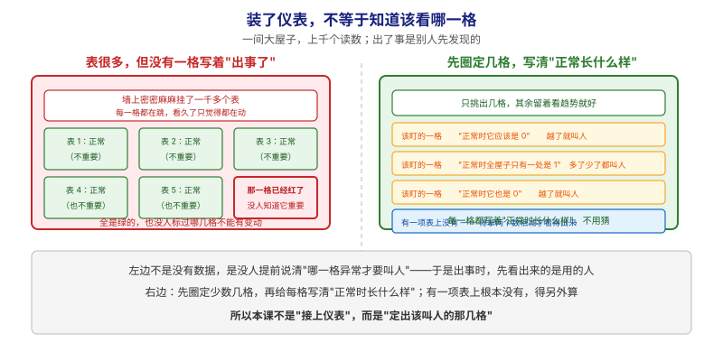
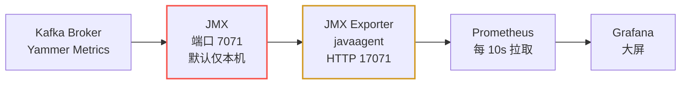
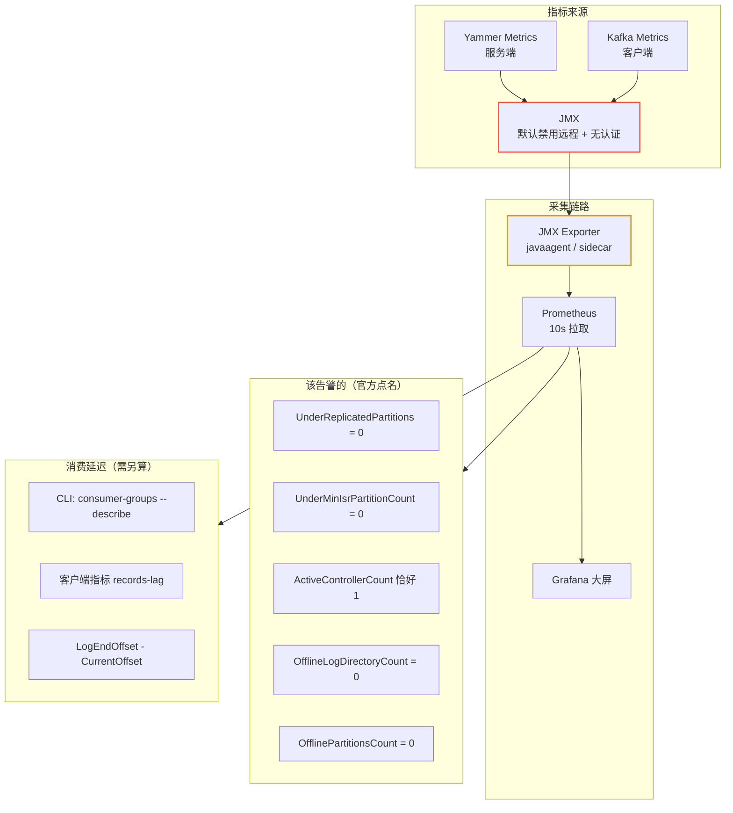

# 第 15 课：监控与可观测

> 所属阶段：阶段 6《运维与可观测》｜ 水平：零基础 ｜ 本课知识点：监控与可观测
> 故事情节：仓库装上仪表盘——怎么知道它现在是好是坏，坏之前能不能提前喊一声

## 🎯 本课目标

- 说清 Kafka 的指标是怎么产生、怎么暴露的（Yammer Metrics → JMX → Exporter → Prometheus）
- 记住官方点名的关键告警指标，以及每个指标的**正常值**是什么
- 理解「消费延迟（lag）」为什么不在 broker 指标里，以及该怎么测
- 能在真实集群上制造一次故障，亲眼看到指标从 0 变成 53 再回到 0
- 会写最基础的告警规则（不是「CPU 高了告警」，而是「该盯什么」）

---

## 第一幕：起源与场景引入

> 前 14 课讲的都是「消息怎么流动、怎么不丢、怎么不被人偷看」。本课换个角度——**你怎么知道它现在还好好的？**

集群上线三个月，运维把你拉进一个事故复盘会：

> 🎬 **场景**：
> 1. **故障是用户先发现的。** 某个 broker 磁盘写满了、ISR 悄悄收缩，业务侧反馈「消息变慢了」，你们才去查日志。监控大屏上一片绿——因为**根本没配 ISR 相关的告警**。
> 2. **消费积压到凌晨才被发现。** 消费者组卡住了，lag 从几百涨到几百万。没人告警，因为「lag」这个数字**不直接存在于 broker 的指标里**，得自己算。
> 3. **重启一台机器，半天没恢复。** 不知道副本同步进度到哪了，只能干等。后来才知道有个指标能直接看迁移是否完成。
> 4. **指标多到看花眼。** 打开 JMX，一个 broker 就有 **800+ 个指标**。到底哪些是「不正常就该叫醒你」的？

这四个问题指向同一件事：**可观测性（Observability）**——不是「有没有监控」，而是**「该盯什么、正常值是多少、什么时候该告警」**。

官方有一整页 `operations/monitoring` 讲这件事，而且明确写了一句：

> **"We do graphing and alerting on the following metrics"**（我们基于以下指标做绘图和告警）

也就是说，官方**已经帮你筛过一遍了**。本课就是把这张表讲透。

> 📌 **一句话本质**：本课做的事，是把「装了仪表、上千个读数都在跳」改成「**先圈定少数几格，再给每一格写清"正常时长什么样"**」——并补上一个表上根本没有、得拿两个数相减才算得出的那一项。
>
> ⚖️ **处境对照**（沿用第一幕那四个问题：故障是用户先发现的、积压到凌晨才发现、重启后不知道进度、指标多到看花眼）：
> - **不这么做（只采集、不定清单）**：一个 broker 暴露 **1511 个指标**（本课实测），全绿但**没配关键告警**；lag 从几百涨到几百万无人知晓；重启只能干等。**出事时第一个发现的是用的人。**
> - **这么做（圈定清单 + 写清正常值）**：只盯少数几格，且每格都有明确判据——`UnderReplicatedPartitions` 正常是 **0**、`ActiveControllerCount` 是**全集群恰好一个 broker 为 1**（判据是总和 `== 1`，不是 `> 0`）；lag 用 CLI 或客户端指标算出来。**故障一发生，指标先动。**
>
> ⏳ **数字来源说明**：1511 / 834 / 53 均为**本课 3 节点实验环境实测值**（`apache/kafka:4.0.0` + JMX Exporter + Prometheus），其中 834 是无 topic 时的初创值、1511 是建 topic 并产生内部主题后的值——**它会随 topic 数量增长，不是固定值**；53 是停掉一个 broker 后 `UnderReplicatedPartitions` 的实测峰值。**换个集群这些数字都会变**，请以自己的实测为准，不要把本课数值当作通用阈值。

---

## 第二幕：认知冲突

- **冲突一：「装了 Prometheus 就算有监控了」**。采集只是第一步。真实情况是：一个 broker 暴露 **1511 个指标**（本课实测稳定值，且会随 topic 数量增长），你不可能也不应该全部告警。冲突的本质是**「能采到」≠「知道哪个重要」**。
- **冲突二：「消费延迟 lag 是个现成指标」**。直觉是 broker 既然知道每个分区写到哪了、也知道消费者提交到哪了，那 lag 应该是现成的。**但翻遍官方 broker 指标表，没有 lag**。因为 broker 不维护「消费者读到哪」这件事的全量视图——需要**另外算**（本课第四幕会给出三种算法与实测）。
- **冲突三：「指标正常值都是 0」**。大部分是，但有几个关键的**不是 0**：`ActiveControllerCount` 必须**恰好有一个 broker 是 1**（其余为 0）；`PartitionCount` / `LeaderCount` 要求**在各 broker 间大致均匀**，而不是某个固定值。搞错这点会写出「ActiveControllerCount > 0 就告警」的错误规则——那等于每时每刻都在告警。
- **冲突四：「JMX 开着就行」**。官方明确：**Kafka 默认禁用远程 JMX**，且**JMX 默认没有认证**。也就是说「开了 JMX」在生产上等于**开了一个无需密码的后门**——不仅能看，还能**控制** broker。这条必须配安全策略。

> ❓ **问题**：本课要回答三件事——**指标从哪来**（采集链路）、**哪些值得告警**（官方点名的清单 + 正常值）、**lag 怎么测**（三种方法 + 实测）。

---

## 第三幕：层层揭示

### 一眼全局图（进入细节前先看一眼）



> 看图：**左右两边都是同一屋子、同样多的表**，差别只在有没有人提前圈定重点。左边一千多个表全在跳、全是绿的，可**没人标过哪几格不能有变动**——右下那一格已经红了，也没人知道它重要；右边先从里面挑出少数几格，**每一格都写着"正常时长什么样"**（正常是 0 / 全屋只有一处是 1），越了就叫人。**注意右边最后一格**：有一项**表上根本没有**，得拿两个数相减才看得出来——这就是本课要单独讲的那一件事。**最下面那句是结论**：本课不是"把仪表接上"，而是"定出该叫人的那几格"。

**四条硬约束**说明：① 本图只回答"本课要解决什么问题、靠什么思路"；② 图上不出现术语（指标、副本、控制器、消费延迟、JMX、Prometheus 这些词都在下面才出场）；③ 已带读图指引；④ 图旁文字能独立说清同一件事。

### 本课地图（分几步走）

| 步 | 这一步要解决什么（人话） | 对应知识点 |
|:--:|------------------------|-----------|
| 1 | 先弄清这些读数是怎么从屋里跑到大屏上的 | 指标是怎么从 Kafka 跑到监控系统的 |
| 2 | 再定"该叫人的那几格"，并给每格写清正常值 | 官方点名的告警指标清单（含正常值） |
| 3 | 最后补上表上没有、必须另外算的那一格 | 消费延迟（lag）到底怎么测 |

> 只回答"分几步走、现在在哪"；不写机制、不写结论；**不标学习状态**（进度以 `00-学习档案.md` 为准）。

### 知识点一：指标是怎么从 Kafka 跑到监控系统的

> 🧭 第 1/3 步｜承接：第一幕"指标多到看花眼、却不知道哪个重要" → 本步：先弄清这些读数从哪来、怎么跑到屏幕上，才能谈挑哪些

**一句话定义**：Kafka 服务端用 **Yammer Metrics** 采集指标，Java 客户端用内置的 **Kafka Metrics**；两者都通过 **JMX** 暴露，再由 **JMX Exporter** 转成 Prometheus 格式供抓取。

#### 直觉建立（类比）

把 broker 想象成一个**工厂**：

- **Yammer Metrics**：车间里密密麻麻的**传感器**（计数产量、温度、次品率）。
- **JMX**：工厂的**数据接口**，传感器读数从这里对外提供。官方说这是**默认关闭远程访问**的——相当于接口默认只对本机开放。
- **JMX Exporter**：一个**翻译官**，把 JMX 的私有格式翻译成 Prometheus 能读懂的格式。
- **Prometheus**：**巡检员**，每隔一段时间（本课配的 10 秒）来抄一次表。
- **Grafana**：**大屏**，把抄来的数画成图。

> 💡 **类比的边界**：真实链路里 Prometheus 是**主动来拉**（pull），不是工厂推送（push）。所以 exporter 只要暴露一个 HTTP 端点就够了，不需要知道 Prometheus 在哪。

#### 采集链路（实测拓扑）



> 看图：**从左往右一条链**——屋里先有传感器（左一），读数统一从**中间那个口子**出去（红色，安全敏感点：默认不对远程开、且不带锁），再由**黄色那位翻译官**翻成外面看得懂的格式（本课的关键组件），最后巡检员**定时主动来抄**（不是屋里推送），抄完画到大屏上。**重点记红黄两格**：红的是生产上必须加锁的地方，黄的是整条链里唯一需要你额外装的东西。

红点是**安全敏感点**（默认无认证），黄点是本课的关键组件。

#### 两种挂载 Exporter 的方式

| 方式 | 做法 | 适用场景 |
|------|------|----------|
| **javaagent 模式**（本课采用） | 在 broker JVM 启动参数加 `-javaagent:...jar=端口:配置.yml` | 生产最常用，延迟低、无额外进程 |
| **sidecar 模式** | 独立容器通过 RMI 连 broker 的 7071，再暴露 HTTP | 不想改 broker 启动参数时 |

本课实测用的是 **javaagent 模式**（也是官方生态最常见的做法），挂载方式：

```properties
# 通过 KAFKA_JMX_OPTS 注入（docker 环境变量写法）
KAFKA_JMX_OPTS=-javaagent:/opt/jmx-exporter/jmx_prometheus_javaagent.jar=17071:/opt/jmx-exporter/kafka-broker.yml
```

> ⚠️ **本课实测踩坑（真遇到过，别照抄错）**：
> 把 `-javaagent` 写进 `KAFKA_JMX_OPTS` 后，**所有 CLI 工具都会继承这个变量**——包括 `kafka-topics.sh`、`kafka-consumer-groups.sh`。结果每次跑 CLI 都会试图再绑定一次 17071 端口，报错：
> ```
> Failed to start Prometheus JMX Exporter
> java.net.BindException: Address in use
> ```
> **解法**：跑 CLI 时显式清空该变量：
> ```bash
> docker exec -e KAFKA_JMX_OPTS= l15-kafka-1 /opt/kafka/bin/kafka-topics.sh ...
> ```
> 这个坑的本质是：**JMX Exporter 是给长驻进程（broker）用的，不是给一次性命令（CLI）用的**。

#### 远程 JMX 的安全警告（官方原文含义）

官方明确写了两条，都属于**生产必读**：

1. **Kafka 默认禁用远程 JMX**。要开启需设置 `JMX_PORT` 或 Java 系统属性。
2. **JMX 默认不认证**。官方原文强调：启用远程 JMX 时**必须同时启用安全**，否则未授权用户不仅能**监控** broker，**还能控制它**以及它所在的主机。

> ⚠️ 本课实验环境为了可复现，用的是**无认证 JMX**（`authenticate=false`）——**这仅供本地学习，生产绝对不能这么配**。生产至少要配认证 + SSL。

---

### 知识点二：官方点名的告警指标清单（含正常值）

> 🧭 第 2/3 步｜承接：上一步弄清了读数怎么跑到大屏 → 本步：回答"该叫人的到底是哪几格"，并给每格写清正常值

**一句话定义**：官方 monitoring 页给出了一张「我们基于这些指标绘图和告警」的表，每个指标都标注了 **Normal value**（正常值）——这是全课最值得背下来的一张表。

#### 直觉建立（类比）

834 个指标里，绝大多数是「**看趋势用的**」（比如压缩率、请求大小分布）。只有少数几十个是「**越界就叫醒你**」的。

这批「叫醒你」的指标有个共同特征：**官方文档给它们标了具体正常值**，而那些趋势指标通常只写描述、不写正常值。这是判断优先级的好办法。

#### 第一类：副本健康（最重要）

> 📖 **表头那个 MBean 是什么**：MBean（Managed Bean，被管理的对象；本文标注为"指标对象"）是 JMX 里**一个指标的完整名字**，形如 `kafka.server:type=ReplicaManager,name=UnderReplicatedPartitions`。它长得像路径，其实是"域名 + 若干键值对"——**写 exporter 规则和查 JMX 时都用这个名字**，所以每张表都把它列出来。下面只写 `name=` 后面那一段，就是这个指标本身。

| 指标 | MBean | 正常值 | 含义 |
|------|-------|--------|------|
| **UnderReplicatedPartitions** | `kafka.server:type=ReplicaManager,name=UnderReplicatedPartitions` | **0** | 副本数不足的分区数（`\|ISR\| < \|所有副本\|`） |
| **UnderMinIsrPartitionCount** | `kafka.server:type=ReplicaManager,name=UnderMinIsrPartitionCount` | **0** | ISR 数低于 `min.insync.replicas` 的分区数 |
| **OfflineReplicaCount** | `kafka.server:type=ReplicaManager,name=OfflineReplicaCount` | **0** | 离线副本数 |
| **IsrShrinksPerSec** | `kafka.server:type=ReplicaManager,name=IsrShrinksPerSec` | **0**（broker 宕机时除外） | ISR 收缩速率 |
| **IsrExpandsPerSec** | `kafka.server:type=ReplicaManager,name=IsrExpandsPerSec` | 见上 | ISR 扩张速率 |

官方对 ISR shrink/expand 的原话含义：**除了 broker 宕机/恢复的场景，两者的期望值都是 0**。如果集群没事却频繁收缩扩张，说明**副本反复掉队又追上**——通常是网络抖动或 broker GC 停顿过长。

> 💡 **回扣课 7**：`UnderMinIsrPartitionCount` 直接关联 `acks=all` + `min.insync.replicas` 那个「至少几个副本确认」的语义。它大于 0 意味着**配置了 acks=all 的生产者会开始失败**。

#### 第二类：Controller 与 KRaft

| 指标 | MBean | 正常值 |
|------|-------|--------|
| **ActiveControllerCount** | `kafka.controller:type=KafkaController,name=ActiveControllerCount` | **有且仅有一个 broker 为 1** |
| **OfflinePartitionsCount** | `kafka.controller:type=KafkaController,name=OfflinePartitionsCount` | **0** |
| **PreferredReplicaImbalanceCount** | `kafka.controller:type=KafkaController,name=PreferredReplicaImbalanceCount` | 越小越好，故障后会升高 |
| EventQueueTimeMs | `kafka.controller:type=ControllerEventManager,name=EventQueueTimeMs` | 持续升高说明 controller 忙不过来 |
| MetadataErrorCount（KRaft） | `kafka.controller:type=KafkaController,name=MetadataErrorCount` | **0** |

KRaft 特有的法定人数指标（MBean 前缀 `kafka.server:type=raft-metrics`）：

| 指标 | 说明 |
|------|------|
| Current State | 成员状态：leader / candidate / voted / follower / unattached / observer |
| Current Leader | 当前法定人数 leader 的 id，**-1 表示未知** |
| Current Epoch | 当前任期 |
| Average/Maximum Commit Latency | 提交一条 raft 日志的耗时 |
| Average/Maximum Election Latency | 选举新 leader 的耗时 |

> ⚠️ **KRaft 监控的注意事项（官方原话含义）**：部分指标**取决于节点的角色**（`process.roles` 配的是 controller 还是 broker 还是两者）。所以同一个指标名在 controller 节点和 broker 节点上可能一个有值一个没有——**这不是故障**。

#### 第三类：请求与错误

| 指标 | MBean | 说明 |
|------|-------|------|
| FailedProduceRequestsPerSec | `kafka.server:type=BrokerTopicMetrics,name=FailedProduceRequestsPerSec` | 生产失败速率 |
| FailedFetchRequestsPerSec | `kafka.server:type=BrokerTopicMetrics,name=FailedFetchRequestsPerSec` | 消费失败速率 |
| ErrorsPerSec | `kafka.network:type=RequestMetrics,name=ErrorsPerSec` | 按请求类型 + 错误码统计（`error=NONE` 表示成功） |
| RequestQueueSize | `kafka.network:type=RequestChannel,name=RequestQueueSize` | 请求队列长度，持续不为 0 说明处理不过来 |
| BytesRejectedPerSec | `kafka.server:type=BrokerTopicMetrics,name=BytesRejectedPerSec` | 因超过 `max.message.bytes` 被拒绝的字节速率 |

> 💡 **回扣课 5/课 12**：`BytesRejectedPerSec` 大于 0 多半是**消息太大**被拒；课 12 讲的配额限流也会让客户端变慢，但**配额限流不会产生这个指标**——它体现在客户端侧的 `produce-throttle-time` 上。

#### 第四类：日志与存储

| 指标 | MBean | 正常值 |
|------|-------|--------|
| **OfflineLogDirectoryCount** | `kafka.log:type=LogManager,name=OfflineLogDirectoryCount` | **0** |
| LogFlushRateAndTimeMs | `kafka.log:type=LogFlushStats,name=LogFlushRateAndTimeMs` | 刷盘速率与耗时 |

`OfflineLogDirectoryCount > 0` 是**磁盘故障**的直接信号——某个 `log.dirs` 目录不可用了。这是「该立刻处理」级别的告警。

#### 第五类：客户端侧指标（生产者 / 消费者）

官方也给了客户端指标表。生产者这边最该盯的：

| 指标 | 说明 |
|------|------|
| `buffer-exhausted-rate` | 因缓冲区耗尽而**丢弃**的记录发送速率（>0 说明在丢数据） |
| `record-error-rate` | 发送出错的速率 |
| `record-retry-rate` | 重试速率（持续高位说明集群有问题） |
| `produce-throttle-time-avg/max` | **被 broker 限流的时长**（课 12 配额的直接体现） |
| `request-latency-avg/max` | 请求延迟 |
| `requests-in-flight` | 在途请求数 |

消费者这边：

| 指标 | 说明 |
|------|------|
| `time-between-poll-avg/max` | 两次 `poll()` 之间的间隔（过大说明处理逻辑慢） |
| `last-poll-seconds-ago` | 距上次 poll 多少秒（消费者卡死的信号） |
| `poll-idle-ratio-avg` | poll 空闲占比 |
| `rebalance-rate-per-hour` | **每小时重平衡次数**（频繁重平衡是典型故障） |
| `failed-rebalance-total` | 失败的重平衡次数 |
| `commit-latency-avg/max` | 提交位移耗时 |

> ⚠️ **注意消费者指标表里没有 lag**。这是下一个知识点的引子。

---

### 知识点三：消费延迟（lag）到底怎么测

> 🧭 第 3/3 步｜承接：上一步圈定了官方点名的那几格，但**表上少了一格** → 本步：补上那个必须拿两个数相减才算得出的"积压"

**一句话定义**：**lag 不是 broker 直接暴露的指标**，而是「日志末端位移（LogEndOffset）」与「消费者已提交位移（CurrentOffset）」之差，需要通过 CLI 或客户端指标计算得到。

#### 直觉建立（类比）

broker 知道**书一共有多少页**（LogEndOffset），消费者**自己记住读到第几页**（提交的 offset）。broker 不会替所有消费者维护「谁读到哪了」的实时汇总——因为消费者可能几万个，且随时上下线。

所以 lag 要**有人去问**：要么问 broker「这个组提交到哪了」（CLI），要么让消费者**自己上报**（客户端指标）。

#### 方法一：CLI 直查（最直观，本课实测）

```bash
kafka-consumer-groups.sh --bootstrap-server localhost:9092 \
  --describe --group monitor-cg
```

本课实测输出（真实结果）：

```
GROUP           TOPIC           PARTITION  CURRENT-OFFSET  LOG-END-OFFSET  LAG
monitor-cg      monitor-demo    0          0               0               0
monitor-cg      monitor-demo    1          0               0               0
monitor-cg      monitor-demo    2          3               3               0
```

> 💡 上面这个实测里 lag 是 0，因为消费者把消息读完了。想看到非零 lag，就让消费者**少读几条**——比如用 `--max-messages 3` 读 3 条就停，剩下的就是 lag。

**方法二：客户端指标（适合接入监控系统）**

消费者有 `records-lag` 系列指标（按分区），以及 `records-lag-max`（最大 lag）。这是**做告警的正确数据源**——因为可以直接进 Prometheus。

**方法三：算「总量差」（粗粒度但省事）**

用 `kafka-consumer-groups.sh` 的输出把 LAG 列求和。适合**快速人工判断**，不适合精确告警（因为要轮询所有组）。

> ⚠️ **常见误区**：把「**分区的 LogEndOffset**」当成「**消费进度**」。LogEndOffset 是**写入进度**，CurrentOffset 才是**消费进度**。两者相等时 lag=0（追平了）；两者差距**持续扩大**才是真的积压——**差距大但稳定**只说明消费者就是这么慢，未必是故障。

#### 告警该怎么写（本课给出的三条示例）

```yaml
# 1. 副本不足（最该叫醒你的）
sum(kafka_server_replicamanager_underreplicatedpartitions) > 0

# 2. Controller 数量异常（正常必须恰好 1）
sum(kafka_controller_kafkacontroller_activecontrollercount) != 1

# 3. 有分区离线
sum(kafka_controller_kafkacontroller_offlinepartitionscount) > 0
```

> ⚠️ **别写成 `ActiveControllerCount > 0`**。正常集群永远有一个 broker 是 1，这条规则会**一直触发**。正确写法是判断**总和是否等于 1**。

#### 🗣️ 行话对照（本课说法 → 行业术语）

本课用"表 / 读数 / 该叫人的那几格"打比方，读文档、写 PromQL、配告警时会遇到下面这些行话——**同一件事的另一套名字**：

| 本课说法（人话） | 行业标准叫法 | 典型配置 / 在哪遇到 | 代价 / 注意 |
|---|---|---|---|
| 屋里的传感器 | **Yammer Metrics**（服务端采集库，本文沿用英文原名） | broker 内部，无需配置 | 客户端用的是另一套：**Kafka Metrics**（内置） |
| 读数对外提供的那个口子 | **JMX**（Java 管理扩展，本文沿用英文原名） | `JMX_PORT`；本课实测端口 7071 | **默认禁用远程**、**默认无认证**——开了等于开后门（不止能看，还能控制） |
| 翻译官 | **JMX Exporter**（本文沿用英文原名） | `-javaagent:...jar=<端口>:<配置>.yml` | 决定 JMX 名怎么转成 Prometheus 名，**名字可能和教程不一致** |
| 巡检员 / 大屏 | **Prometheus** / **Grafana**（本文沿用英文原名） | 本课端口 19990 / 13000 | 是**主动来拉**（pull），不是屋里推送 |
| 冗余度掉了 | **UnderReplicatedPartitions**（本文自拟译"副本不足分区数"，非通用译名） | PromQL `kafka_server_replicamanager_underreplicatedpartitions` | 正常值 **0**；> 0 就该处理，**不能等到分区离线** |
| 比"最少要有几份"还少 | **UnderMinIsrPartitionCount**（本文自拟译"低于最小同步副本数的分区数"，非通用译名） | `kafka.server:type=ReplicaManager,...` | 正常值 **0**；> 0 意味着 `acks=all` 的生产者开始失败（回扣课 7） |
| 真正没人管了的分区 | **OfflinePartitionsCount**（本文自拟译"离线分区数"，非通用译名） | `kafka.controller:type=KafkaController,...` | 正常值 **0**；与 URP 是**两回事**（URP 只表示冗余下降） |
| 全屋只有一处该亮 | **ActiveControllerCount**（本文自拟译"活跃控制器数"，非通用译名） | `kafka_controller_kafkacontroller_activecontrollercount` | 正常值：**恰好一个 broker 为 1**；判据是 `sum(...) == 1`，**不是 `> 0`** |
| 目录坏了 | **OfflineLogDirectoryCount**（本文自拟译"离线日志目录数"，非通用译名） | `kafka.log:type=LogManager,...` | 正常值 **0**；> 0 = 磁盘故障，立即处理 |
| 积压（表上没有、要另算） | **lag / consumer lag**（本文沿用"消费延迟/积压"；社区亦直呼 lag） | CLI `kafka-consumer-groups.sh --describe`；客户端 `records-lag` / `records-lag-max` | **broker 指标表里没有 lag**；= `LogEndOffset − CurrentOffset` |
| 写到哪了 / 读到哪了 | **LogEndOffset**（日志末端位移） / **CurrentOffset**（已提交位移） | CLI 输出的两列 | 别把"写入进度"当"消费进度"；**差距持续扩大**才是真积压 |
| 被限流了多久 | `produce-throttle-time-avg/max` | **客户端**指标，不是 broker 侧 | 课 12 的配额限流**不产生** broker 端拒绝指标 |

> 📖 **关于译名**：本表带"本文自拟译"字样的中文名是**为便于阅读自拟的、非通用译名**；JMX / Prometheus / Grafana 等**沿用英文原名**（官方文档亦不译）。**标注只在首次登场给一次**，后文不再重复括注。另外提醒一句：写 PromQL 前请先 `grep` 看 exporter 实际吐出的名字（见验证 4），**不要照抄教程里的指标名**。

---

## 第四幕：实操验证

> 本幕所有命令均在本课环境中实测通过。环境：WSL Ubuntu 24.04 + Docker，3 节点 KRaft 集群（`apache/kafka:4.0.0`）+ JMX Exporter + Prometheus + Grafana。

### 环境准备

工程目录：[docker-compose.yml](../../../assets/stage6-observability/docker-compose.yml)

```bash
cd kafka/assets/stage6-observability
docker compose up -d
```

端口分配（避开本机已占用端口）：

| 端口 | 用途 |
|------|------|
| 19192-19194 | broker 客户端端口（kafka-1/2/3） |
| 17071-17073 | JMX Exporter HTTP（Prometheus 从此拉） |
| 19990 | Prometheus UI |
| 13000 | Grafana UI |

> ⚠️ **advertised.listeners 的坑（本课实测踩到）**：
> 容器内 `KAFKA_ADVERTISED_LISTENERS` 配的是 `PLAINTEXT://kafka-1:9092`（容器名），所以在 broker-1 容器里执行 `kafka-console-consumer.sh --bootstrap-server localhost:9092` 会**超时失败**——因为客户端拿到的是 `kafka-1:9092`，而 `localhost` 不通。
> **解法**：让客户端跑在**同一个 docker 网络**里，用容器名连接：
> ```bash
> docker run --rm --network <网络名> apache/kafka:4.0.0 \
>   /opt/kafka/bin/kafka-console-consumer.sh --bootstrap-server kafka-1:9092 ...
> ```
> 这个坑也是**生产环境最常见的 Kafka 连接问题**——客户端拿到的 advertised 地址必须是客户端**真的能连上**的地址。

### 验证 1：集群与采集链路是否健康

```bash
# 三节点 KRaft 集群状态
docker exec -e KAFKA_JMX_OPTS= l15-kafka-1 \
  /opt/kafka/bin/kafka-metadata-quorum.sh --bootstrap-server localhost:9092 describe --status
```

实测输出（节选）：

```
ClusterId:              5L6g3nShT-eMCtK--X86sw
LeaderId:               2
LeaderEpoch:            1
MaxFollowerLag:         0
CurrentVoters:          [{"id": 1,...},{"id": 2,...},{"id": 3,...}]
```

三个 voter 齐全、`MaxFollowerLag: 0`，说明元数据同步正常。

```bash
# Prometheus 抓取目标健康状态
curl -s 'http://localhost:19990/api/v1/targets?state=active'
```

实测：三个 broker 全部 `up`。

```bash
# 单个 broker 暴露了多少指标
docker exec l15-kafka-1 wget -qO- http://localhost:17071/metrics | grep -c '^kafka_'
```

实测结果：**1511**。这就是前文说的「看花眼」的来源。

> 💡 **这个数字会变**：刚启动、还没建任何 topic 时实测是 **834**；建了 topic、产生了 `__consumer_offsets` 之后涨到 **1511**。因为很多指标是**按 topic 维度**生成的（`topic="xxx"` 标签），topic 越多指标越多。
> 所以别把「指标数量」当成固定值——**它反映的是集群当前承载了多少 topic**。

### 验证 2：关键指标的正常值（健康态）

```bash
# 副本不足分区数（应为 0）
curl -s --data-urlencode 'query=sum(kafka_server_replicamanager_underreplicatedpartitions)' \
  http://localhost:19990/api/v1/query
```

实测四条结果：

| 指标 | 实测值 | 是否符合官方正常值 |
|------|--------|--------------------|
| `underreplicatedpartitions` | **0** | ✅ 官方要求 0 |
| `activecontrollercount` | **1** | ✅ 官方要求「恰好一个 broker 为 1」 |
| `partitioncount`（三节点合计） | **159** | 看分布是否均衡 |
| `leadercount`（三节点合计） | **53** | 看分布是否均衡 |

> 💡 `PartitionCount` / `LeaderCount` 的正常值是「**mostly even across brokers**」（各 broker 大致均匀），不是固定数字。这印证了第二幕的冲突三。

### 验证 3：制造故障，看指标怎么变（本课核心实验）

现在停掉一个 broker，模拟宕机：

```bash
docker stop l15-kafka-3
sleep 40   # 等 controller 检测心跳超时
```

再看同一批指标：

| 指标 | 宕机前 | 宕机后 | 变化说明 |
|------|--------|--------|----------|
| `underreplicatedpartitions` | **0** | **53** | 该 broker 上的副本全部变为「不同步」 |
| `activecontrollercount` | 1 | **1** | controller 仍在别的节点，正确 |
| `offlinepartitionscount` | 0 | **0** | 没有分区离线（副本还在别的节点） |
| `preferredreplicaimbalancecount` | — | **36** | leader 迁走了，优先副本不再均衡 |

再看 topic 的 ISR 变化（实测）：

```
# 宕机前
Topic: monitor-demo  Partition: 0  Leader: 1  Replicas: 1,2,3  Isr: 1,2,3
# 宕机后
Topic: monitor-demo  Partition: 0  Leader: 1  Replicas: 1,2,3  Isr: 1,2
```

**ISR 从 `1,2,3` 收缩到 `1,2`**——这就是 `IsrShrinksPerSec` 指标的含义。同时注意 `Replicas` 列**没变**（还是 1,2,3），只有 `Isr` 变了：**副本配置不变，同步集合收缩**。

恢复：

```bash
docker start l15-kafka-3
sleep 45
```

实测 `underreplicatedpartitions` **回到 0**。

> 💡 **这个实验说明了什么**：URP 从 0 涨到 53 再回 0，是一条完整的「**故障发生 → 指标告警 → 自动恢复**」链路。生产上你需要的就是「URP > 0 持续 2 分钟」这样的规则——**持续**二字很重要，能过滤掉正常的滚动重启抖动。

### 验证 4：Grafana 看图

浏览器打开 `http://localhost:13000`（本课配了匿名登录，无需密码）。

添加数据源：Prometheus → URL 填 `http://prometheus:9090`（容器网络内用服务名）。

建议先建一个面板看这三条线：

```
sum(kafka_server_replicamanager_underreplicatedpartitions)
sum(kafka_controller_kafkacontroller_activecontrollercount)
sum(kafka_server_brokertopicmetrics_messagesinpersec)
```

> ⚠️ **指标名对不上怎么办**：JMX Exporter 的.yml 规则决定了 JMX 名怎么转成 Prometheus 名。本课实测发现 `MessagesInPerSec` 转出来是 `kafka_server_brokertopicmetrics_messagesinpersec`（**没有** `_total` 后缀，尽管官方说 rate 类指标有对应的 `-total` 累计指标）。
> 排查手法：
> ```bash
> docker exec l15-kafka-1 wget -qO- http://localhost:17071/metrics | grep -i 'brokertopicmetrics'
> ```
> 直接看 exporter 到底吐出了什么名字，**再照着真实名字写 PromQL**——不要照抄教程里的名字。

---

## 第五幕：体系收束

### 本课一图总结



> 读法：上半是**链路**（红点是安全敏感点，黄点是翻译官）；左下是**官方点名的告警清单**（都带具体正常值）；右下是 **lag 的三个测法**——它不在 broker 指标里，必须另算。

> **与课首入口的分工（勿混，三方视角）**：「一眼全局图」在课首、问题视角、零术语，给没学过的人看（回答"为什么需要它、靠什么思路"）；「本课地图」在课首、路线视角（回答"分几步走、现在在哪"），是表格不是图；本图在课末、知识视角，给刚学完的人复习用（回答"本课讲了什么"）。三者不可替代、不雷同。

### 速览表

| 问题 | 答案 |
|------|------|
| 指标怎么暴露 | 服务端 Yammer + 客户端 Kafka Metrics → JMX → Exporter → Prometheus |
| 一个 broker 多少指标 | 实测 **1511** 个（随 topic 数增长，初创集群约 834），**不该全部告警** |
| 最重要的告警指标 | UnderReplicatedPartitions、UnderMinIsrPartitionCount、ActiveControllerCount、OfflineLogDirectoryCount |
| ActiveControllerCount 正常值 | **有且仅有一个 broker = 1**（判据是总和 == 1，不是 > 0） |
| lag 在哪 | **不在 broker 指标里**，需 CLI 查或客户端指标 |
| 远程 JMX 默认状态 | **禁用**，且**无认证**，生产必须配安全 |
| 本次故障演练 URP 变化 | 0 → 53 → 0 |

### 常见误区

1. **「指标越多越好」。** 实测 1511 个指标里值得告警的不超过 20 个。告警太多等于没有告警。
2. **「ActiveControllerCount > 0 就告警」。** 正常集群永远为 1，这条会一直触发。
3. **「lag 是个现成指标」。** 它不是，要自己算或用客户端指标。
4. **「开了 JMX 方便调试，没事」。** 官方明确：无认证的远程 JMX 意味着别人**能控制你的 broker**。
5. **「照抄教程里的 PromQL」。** Exporter 版本不同，指标名可能不同（本课实测 `_total` 后缀就没出现）。**先查真实名字再写查询**。

### 与前序课程的联系

- **课 7（副本机制）**：`UnderMinIsrPartitionCount > 0` 意味着 `acks=all` 的生产者要开始失败了。
- **课 12（多租户与配额）**：配额限流**不产生** broker 端拒绝指标，要看客户端的 `produce-throttle-time`。官方也强调「不配监控就发现不了被限流」——本课是那个「配监控」的答案。
- **课 11（安全体系）**：远程 JMX 的安全配置，和课 11 的认证授权是同一套思路。

---

## 课后小测

**Q1**：官方 monitoring 页给 `ActiveControllerCount` 标注的正常值是什么？正确的告警写法是？
- A. 0，告警写 `> 0`
- B. 有且仅有一个 broker 为 1，告警写 `sum(...) != 1`
- C. 所有 broker 都为 1，告警写 `< 3`
- D. 没有正常值，需要自己观察基线

<details><summary>答案与解析</summary>

**答案：B**。官方原文：only one broker in the cluster should have 1（集群中应恰好有一个 broker 为 1）。因此告警判据是**总和是否等于 1**：`== 1` 正常，`!= 1` 告警（0 表示没有 controller，≥2 表示脑裂）。A 是最常见的错误写法——正常集群永远有一个 broker 是 1，`> 0` 会持续触发。

</details>

**Q2**：你想给「消费积压」配告警，翻遍了 broker 的 JMX 指标也没找到 lag。为什么？
- A. lag 指标被 JMX Exporter 过滤掉了
- B. broker 不维护消费者读进度的实时汇总，lag 需通过 CLI 或客户端指标计算
- C. 只有企业版才有 lag 指标
- D. lag 存在 ZooKeeper 里，KRaft 模式下没有了

<details><summary>答案与解析</summary>

**答案：B**。官方的 broker 指标表里没有 lag——broker 不维护「几万个消费者各自读到哪」的实时视图。正确做法是：① CLI `kafka-consumer-groups.sh --describe` 看 `LOG-END-OFFSET - CURRENT-OFFSET`；② 用消费者客户端的 `records-lag` / `records-lag-max` 指标。本课实测用方法一验证了 lag 计算。A 不对（不是被过滤，是本来就没有）；D 不对（与 KRaft/ZooKeeper 无关）。

</details>

**Q3**：本课实验中停掉一个 broker 后，`UnderReplicatedPartitions` 从 0 变成 53，同时 `OfflinePartitionsCount` 仍是 0。这说明什么？
- A. 监控坏了，两个指标矛盾
- B. 副本不同步了，但分区仍可读写（有副本在别的节点存活）
- C. 分区彻底不可用了
- D. 该 broker 已被永久剔除出集群

<details><summary>答案与解析</summary>

**答案：B**。这是**副本不足**与**分区离线**的区别：`UnderReplicatedPartitions` 表示「ISR 数 < 副本数」（冗余度下降），`OfflinePartitionsCount` 表示「没有任何可用副本的分区数」（真正不可用）。实测中 ISR 从 `1,2,3` 收缩到 `1,2`，分区**仍可正常读写**，只是再坏一个副本就要丢数据了——所以 URP > 0 就该告警，**不能等到 offline 才处理**。这也印证了课 7 的冗余度概念。

</details>

## 🚀 下一批接力提示词

> 学完本课后，复制下面这段文字发给 AI，继续学课 16：

```
我刚学完 Kafka 课程阶段 6 的课 15《监控与可观测》，学习档案在 kafka/00-学习档案.md。
我的实验环境已就绪：kafka/assets/stage6-observability/ 下 docker compose 已起 3 节点集群
（JMX Exporter + Prometheus + Grafana，端口 19192-19194 / 17071-17073 / 19990 / 13000）。
请继续讲课 16《集群运维操作》，重点讲分区重分配、限流复制、优雅关停与硬件/OS 选型。
```

## 🧭 课程导航

⬅️ **上一课**：[课 14：分层存储与配置进阶](../../5-生产落地延伸/lessons/lesson-14-分层存储与配置进阶.md)

➡️ **下一课**：[课 16：集群运维操作](lesson-16-集群运维操作.md)

📚 **返回目录**：[课程目录](../../../02-课程目录.md)
