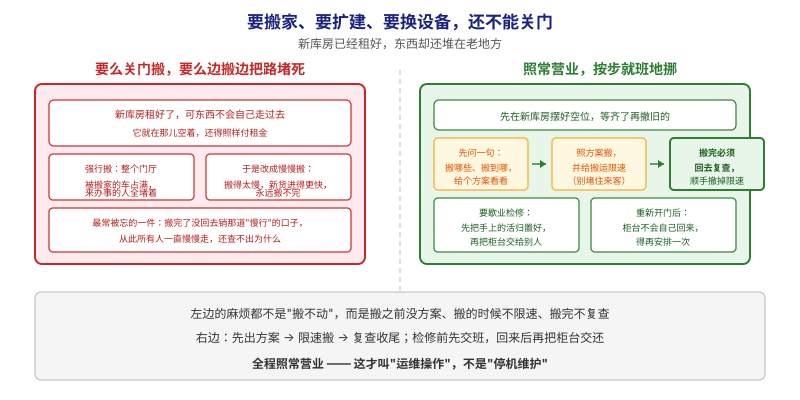
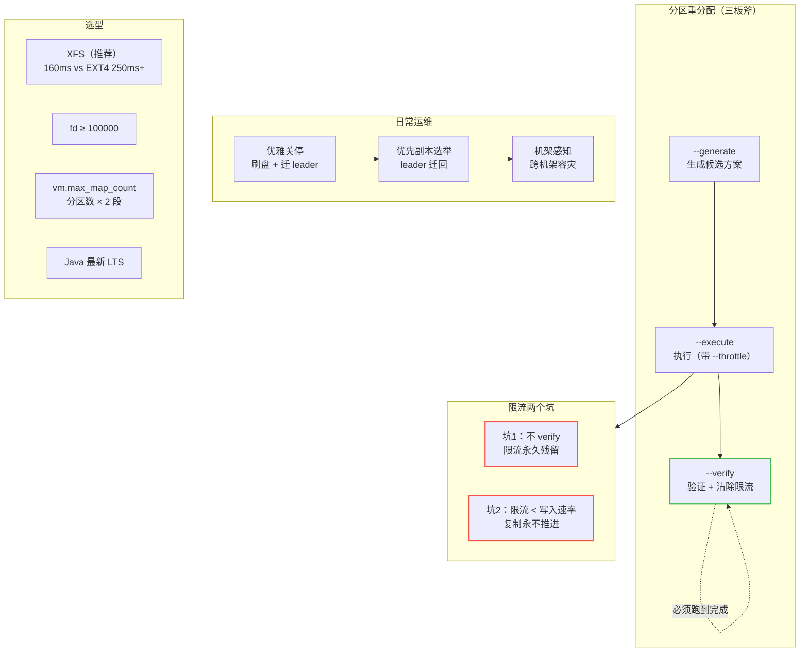

# 第 16 课：集群运维操作

> 所属阶段：阶段 6《运维与可观测》｜ 水平：零基础 ｜ 本课知识点：集群运维操作
> 故事情节：仓库要搬家、要扩建、要换设备——怎么在不关门的前提下做完

## 🎯 本课目标

- 会用分区重分配工具的三板斧（`--generate` / `--execute` / `--verify`），把分区搬到新 broker
- 记住限流复制的**两个坑**（忘记移除限流、限流低于写入速率导致复制不推进）
- 说清优雅关停做了哪两件优化，以及它**什么情况下会失败**
- 理解优先副本（preferred replica）与 leader 均衡，知道重启后为什么「负载没回来」
- 知道硬件/OS/Java 怎么选（XFS vs EXT4、文件描述符、vm.max_map_count、Java 版本）

---

## 第一幕：起源与场景引入

> 课 15 解决了「怎么知道集群好不好」。本课解决下一个问题——**集群要变动的时候，怎么安全地做**。

业务量涨了，领导批了三台新机器。你兴冲冲加进集群，然后发现：

> 🎬 **场景**：
> 1. **加了机器，但没用。** 新 broker 起来了，可**一个分区都没分给它**——旧 topic 的分区还全在老机器上。官方原话：新服务器「**不会自动被分配到任何数据分区**」，除非你主动搬迁，否则**它们不会做任何工作，直到有新 topic 创建**。
> 2. **搬迁把网络打满了。** 你执行了重分配，结果副本同步流量把生产流量挤爆，业务报警。想限速，又怕「限速之后搬不完」。
> 3. **重启一台机器，半天起不来。** 因为重启前没做优雅关停，起来后要**重放大量日志做恢复**。官方说：优雅关停会把日志刷盘，**避免重启时做日志恢复**。
> 4. **重启完了，负载没回来。** 这台机器重新加入后**所有分区都只是 follower**，不处理读写——客户端压力全在别的机器上。
> 5. **采购问你怎么选机器。** 磁盘用 XFS 还是 EXT4？官方其实给了对比测试数据。

这五个问题，全部属于**集群运维操作**——官方 `basic-kafka-operations`、`hardware-and-os`、`java-version` 三页的内容。

> 📌 **一句话本质**：本课做的事，是把「要搬家就得先关门，或者硬搬把路堵死」改成「**照常营业，按步就班地挪**」——先出方案、再限速搬、搬完必须回去复查；检修前先交班，回来后再把柜台交还。
>
> ⚖️ **处境对照**（沿用第一幕那五个麻烦：加了机器没用、搬迁打满网络、重启半天起不来、重启后负载没回来、不知道怎么选机器）：
> - **不这么做（硬搬 / 直接停）**：新 broker 一个分区都分不到（官方：新服务器**不会自动被分配到任何数据分区**，不主动搬就一直空转）；不限速则**复制流量挤爆生产流量**；不做优雅关停，重启时要**重放日志做恢复**；重启完**全是 follower**，压力还在别人身上。
> - **这么做（三板斧 + 限速 + 复查 + 优先副本）**：`--generate` 出方案 → `--execute` 带限速执行 → `--verify` **验证并清除限流**；关停前刷盘 + 提前迁走柜台；重启后用优先副本选举把柜台交还。**全程不关门。**
>
> ⏳ **数字来源说明**：本段为**定性对照**；课文中出现的 `10485760 B/s`（本课实测限流值）、`160ms / 250ms+`（**官方** XFS 与 EXT4 对比测试数据）、`100000`（官方文件描述符建议下限）、`50000 分区 → 100000 map area`（官方举例）等数字，**出处各不相同**：凡标注"本课实测"的来自本课 3 节点实验环境，**官方数据请以其文档当前表述为准**（Java 支持矩阵、文件系统对比都会随版本变化，不要照抄本课的具体数值）。

---

## 第二幕：认知冲突

- **冲突一：「加机器 = 扩容」**。直觉认为机器加进去自动分担。**错了**——加进去只是「有了空房子」，**数据不会自己搬进去**。必须显式执行重分配。
- **冲突二：「重分配工具会自动帮我均衡」**。官方明确：**该工具没有能力自动研究数据分布并做到均衡**。它只会「按你给的 topic 列表和目标 broker 列表，均匀地铺开」，**至于该搬哪些，得管理员自己判断**。
- **冲突三：「限速越狠越安全」**。真实风险相反：如果限流值**低于生产者的写入速率**，复制**永远追不上**，重分配卡死。官方给了判据：`max(BytesInPerSec) > throttle` 时复制无法推进。
- **冲突四：「kill 和优雅关停差不多」**。差别在两件事：优雅关停①**把日志刷盘**（省掉重启时的日志恢复）；②**提前把 leader 迁走**（分区不可用时间从秒级降到毫秒级）。但第二条**需要配置开关**，且**在副本不足时会失败**。
- **冲突五：「文件系统随便选」**。官方给了实测对比：XFS 的「Request Local Time」是 **160ms**，而最佳配置的 EXT4 是 **250ms+**，且 XFS 波动更小。

> ❓ **问题**：本课四块内容——**分区重分配**（含限流）、**优雅关停与 leader 均衡**、**硬件与 OS 选型**、**Java 版本与部署要点**。

---

## 第三幕：层层揭示

### 一眼全局图（进入细节前先看一眼）



> 看图：**左右两边是同一件事——把东西挪到新库房**，"差别只在有没有章法"。左边要么强行搬、把门厅占满（来办事的人全堵着），要么改成慢慢搬、**搬得比新货进来还慢，永远搬不完**；而且**最常被忘的是搬完没回去撤那道"慢行"的口子**，从此所有人一直慢慢走还查不出原因。右边三步走：先问一句"搬哪些、搬到哪"给出方案 → 照方案搬**并限速**（别堵住来客）→ **搬完必须回去复查，顺手撤掉限速**。**下面两格是另一半**：要歇业检修时**先交班**，重新开门后**柜台不会自己回来**，得再安排一次。**最下面那句是全课主旨**：全程照常营业——这才叫运维操作，不是停机维护。

**四条硬约束**说明：① 本图只回答"本课要解决什么问题、靠什么思路"；② 图上不出现术语（分区、副本、重分配、限流、优先副本、优雅关停这些词都在下面才出场）；③ 已带读图指引；④ 图旁文字能独立说清同一件事。

### 本课地图（分几步走）

| 步 | 这一步要解决什么（人话） | 对应知识点 |
|:--:|------------------------|-----------|
| 1 | 东西怎么挪到新库房：先出方案、再搬、最后复查 | 分区重分配（Partition Reassignment） |
| 2 | 搬的时候怎么不把路堵死：限速的两个坑 | 限流复制（Throttled Replication） |
| 3 | 要歇业检修 / 重新开门，怎么交接柜台 | 优雅关停与 leader 均衡 |
| 4 | 库房和设备该怎么选 | 硬件、OS 与 Java 选型 |

> 只回答"分几步走、现在在哪"；不写机制、不写结论；**不标学习状态**（进度以 `00-学习档案.md` 为准）。

### 知识点一：分区重分配（Partition Reassignment）

> 🧭 第 1/4 步｜承接：第一幕"新机器加进来却一个分区都没分给它" → 本步：学会把东西显式搬到新库房的三板斧

**一句话定义**：分区重分配工具把分区的副本**从一组 broker 搬到另一组**，用于集群扩容后的数据迁移、负载再均衡、以及下线机器前的数据腾挪。

#### 直觉建立（类比）

把分区想象成**货架上的箱子**，broker 是**仓库**。

- 加新仓库 ≠ 箱子自动飞过去。你需要**搬家公司**（重分配工具）。
- 搬家公司的规矩：先把箱子**复制到新仓库**（新节点作为 follower 追数据），**追平之后**才允许从旧仓库清掉。官方原话：Kafka 会把新服务器**作为该分区的 follower 加进去**，等它**完全复制完并加入 ISR**，才会让现有副本删除数据。
- 所以**搬迁期间磁盘占用会临时上升**（新旧两份都在），这是规划容量时必须考虑的。

#### 三种互斥模式（官方原文）

| 模式 | 作用 |
|------|------|
| `--generate` | 给定 topic 列表和目标 broker 列表，**生成一份候选迁移方案**（只是建议，不执行） |
| `--execute` | 按提供的方案**真正启动**重分配 |
| `--verify` | **检查**上一次 `--execute` 的分区状态：成功 / 失败 / 进行中 |

三者**互斥**（mutually exclusive），一次只能用一个。

#### 完整流程（本课实测）

**第 1 步：准备 topic 列表文件。**

```json
{
  "topics": [{"topic": "foo1"}, {"topic": "foo2"}],
  "version": 1
}
```

**第 2 步：`--generate` 生成方案。**

```bash
kafka-reassign-partitions.sh --bootstrap-server localhost:9092 \
  --topics-to-move-json-file topics-to-move.json \
  --broker-list "5,6" --generate
```

输出两段：**当前的分配**（供回滚用）和**建议的分配**。

**第 3 步：`--execute` 执行。**

```bash
kafka-reassign-partitions.sh --bootstrap-server localhost:9092 \
  --reassignment-json-file plan.json --execute
```

**第 4 步：`--verify` 验证。**

```bash
kafka-reassign-partitions.sh --bootstrap-server localhost:9092 \
  --reassignment-json-file plan.json --verify
```

> ⚠️ **第 4 步不是可选的**。官方明确警告：**必须周期性运行 `--verify`，直到重分配完成，以确保限流被移除**。下一节讲为什么。

#### 本课实测：一个真实的报错

把 **RF=3** 的 topic 迁到只有 **2 个 broker** 的目标列表：

```
Error: Replication factor: 3 larger than available brokers: 2.
org.apache.kafka.common.errors.InvalidReplicationFactorException:
  Replication factor: 3 larger than available brokers: 2.
```

**原因**：目标 broker 数量**必须 ≥ 副本因子**——因为一个分区的两个副本不能放在同一个 broker 上（那样就没有冗余意义了）。官方也明确：**迁移过程中副本因子保持不变**。

**解法**：要么目标列表给到 ≥3 个 broker，要么先把 topic 的副本因子降下来（降 RF 本身也要通过重分配做）。

---

### 知识点二：限流复制（Throttled Replication）与它的两个坑

> 🧭 第 2/4 步｜承接：上一步学会了怎么搬，但"搬的时候把路堵死了"还没解决 → 本步：给搬运限速，并记住限速的两个坑

**一句话定义**：重分配会消耗大量网络与磁盘带宽，用 `--throttle` 可以限制复制速率，避免打满生产流量；但**限流有两个必须知道的副作用**。

#### 坑一：限流不会自动消失（最危险）

官方原话要点：**重分配完成后必须及时移除限流**（通过运行 `--verify` 实现）。

这意味着：如果你执行了带 `--throttle` 的 `--execute`，**然后忘了跑 `--verify`**，那么**限流配置会一直留在 broker 上**——后续所有正常的副本同步都会被限速，集群长期处于「半速运行」状态，而且很难排查。

本课实测中，跑完 `--verify` 后工具输出了这两行，就是它在**自动清理**：

```
Clearing broker-level throttles on brokers 1,2,3
Clearing topic-level throttles on topic reassign-demo
```

而 `--execute` 时也给了明确警告（实测原文）：

```
Warning: You must run --verify periodically, until the reassignment completes,
to ensure the throttle is removed.
```

> 💡 **运维建议**：把 `--verify` 放进你的操作清单，**不是「可选的最佳实践」，而是流程的一部分**。

#### 坑二：限流太低会导致复制永远追不上

官方给出的判据：

```
max(BytesInPerSec) > throttle
```

即：**如果生产者的写入速率超过了限流值，复制就无法推进**（新数据进来的比搬走的还快）。

**怎么发现**：监控这个指标（官方给的）：

```
kafka.server:type=FetcherLagMetrics,name=ConsumerLag,clientId=([-.\w]+),topic=([-.\w]+),partition=([0-9]+)
```

官方原话：**这个 lag 应该在复制过程中持续下降**。如果它**不下降**，管理员就应该**提高限流值**。

> 💡 这条和课 15 串起来了：`BytesInPerSec` 正是课 15 讲过的 broker 吞吐指标。也就是说**限流值该设多少，要看你实际的写入吞吐**——不是一个拍脑袋的固定值。

#### 限流的作用范围（官方细节）

- **leader 限流**施加于**重分配前就存在的所有副本**（它们中任何一个都可能是 leader）。
- **follower 限流**施加于**所有的迁移目标**。
- 也可以用 `kafka-configs.sh --alter` 手动改限流配置。

---

### 知识点三：优雅关停与 leader 均衡

> 🧭 第 3/4 步｜承接：前两步解决了"怎么搬、怎么不堵路" → 本步：解决"要歇业检修怎么交接、重新开门后柜台怎么回来"

#### 优雅关停做了什么（官方原文要点）

Kafka 会自动检测 broker 关停/故障并为该机器上的分区选举新 leader——**无论是故障还是人为停机**。但对于**主动停机**，Kafka 支持更优雅的机制，带来**两项优化**：

1. **把日志同步到磁盘**，避免重启时做日志恢复（校验日志尾部所有消息的 checksum）。日志恢复很耗时，这能**加快主动重启**。
2. **在关停前把该机器的 leader 分区迁移到其他副本**，让 leadership 转移更快，**把每个分区的不可用时间缩短到几毫秒**。

第一项**只要不是硬 kill 就会自动发生**；第二项**需要开关**：

```properties
controlled.shutdown.enable=true
```

> ⚠️ **优雅关停会失败的情况（官方明确）**：只有当该 broker 上的**所有分区都有副本**（副本因子 > 1 **且**至少有一个副本存活）时，controlled shutdown 才会成功。官方解释：这是合理的，因为关掉最后一个副本会导致该分区不可用。

#### 重启后为什么不干活：优先副本（Preferred Replica）

broker 停止或崩溃后，它的 leader 分区会转移到其他副本。**当它重启后，它只会是所有分区的 follower**——不处理客户端读写。

为了避免这种不均衡，Kafka 有**优先副本（preferred replica）**的概念：如果副本列表是 `1,5,9`，那么 **1 是优先 leader**（因为它排在最前面）。

默认会自动恢复：

```properties
auto.leader.rebalance.enable=true
```

如果关掉自动均衡，就需要手动触发：

```bash
kafka-leader-election.sh --bootstrap-server localhost:9092 \
  --election-type preferred --all-topic-partitions
```

本课实测输出：

```
Successfully completed leader election (PREFERRED) for partitions reassign-demo-3
```

> 💡 **与课 15 的呼应**：这个「leader 不在优先副本上」的状态，在课 15 里对应 `PreferredReplicaImbalanceCount` 指标。本课实验中停掉 broker 后，该指标实测从 0 升到 **36**——就是这批需要迁回的分区数。

#### 机架感知（Balancing Replicas Across Racks）

把同一分区的副本分散到不同机架，把「 broker 容错」扩展到「机架容错」：

```properties
broker.rack=my-rack-id
```

在 topic 创建、修改或副本重分布时，机架约束会被遵守，**副本会尽量跨机架**（跨 `min(#racks, 副本因子)` 个机架）。

> ⚠️ **官方提醒**：如果各机架的 broker 数量不等，副本分配会**不均匀**——broker 少的机架会拿到更多副本，占用更多存储、承担更多复制流量。所以**建议每个机架配置相同数量的 broker**。

---

### 知识点四：硬件、OS 与 Java 选型

> 🧭 第 4/4 步｜承接：前三步都是"怎么动" → 本步：回答采购那句"机器该怎么选"，以及单个 broker 上能放多少东西的硬约束

#### 磁盘与文件系统

官方建议：

- **用多块盘**提升吞吐，且**不要**与应用程序日志或 OS 其他活动共享同一批盘，以保证延迟。
- **分区会轮转（round-robin）分配到各数据目录**，每个分区**完整地位于其中一个目录**。所以**如果分区间数据不均衡，会导致磁盘间负载不均**。

**RAID vs 多目录**（官方 tradeoff）：

| 方案 | 优点 | 缺点 |
|------|------|------|
| **多目录**（每块盘单独挂载） | 简单，无 RAID 开销 | 数据不均衡时会造成磁盘负载不均 |
| **RAID** | 可能在更低层次做负载均衡；容忍磁盘故障 | 通常**写吞吐损失大**、可用空间减少；且官方经验是 **RAID 重建的 I/O 强度会几乎拖垮服务器**，并不真正提升可用性 |

> 💡 官方的关键洞见：**Kafka 已经有副本机制，RAID 提供的冗余在应用层已经有了**。所以 RAID 的主要价值（冗余）被抵消，主要代价（性能）却实打实。

**XFS vs EXT4（官方实测数据）**：

| 对比项 | XFS | EXT4 |
|--------|-----|------|
| Request Local Time（越低越好） | **160ms** | 250ms+（最佳配置） |
| 平均等待时间 | 更低 | 较高 |
| 性能波动 | **更小** | 较大 |
| 调优需求 | **几乎不需要**（有大量自动调优） | 需要调多个挂载选项才能发挥性能 |

> ⚠️ **EXT4 的隐藏代价**：官方明确说，那些提升性能的 EXT4 挂载选项「**在故障场景下通常是不安全的，会导致更多数据丢失和损坏**」。单 broker 故障无所谓（可以从副本重建），但**多故障场景（如断电）可能导致文件系统损坏且不易恢复**。

**通用挂载选项**：官方建议对数据目录使用 `noatime`（禁用 atime 更新）。Kafka **完全不依赖 atime**，关掉它能消除大量文件系统写操作，**尤其在消费者 bootstrap 场景下**。

#### 应用刷盘 vs OS 刷盘

Kafka **总是立即把数据写到文件系统**，刷盘策略控制何时强制落到磁盘。

**官方推荐：使用默认的刷盘设置，即完全禁用应用级 fsync。**

理由（官方原话要点）：

- **Kafka 的持久性不依赖同步到磁盘**——失败的节点总是能从副本恢复。
- 依赖 OS 后台刷盘 + Kafka 自己的后台刷盘，提供了「无需调参、吞吐与延迟都好、且有完整恢复保证」的组合。
- 官方认为**副本提供的保证强于本地磁盘同步**。

应用级 fsync 的缺点：**磁盘使用模式更低效**（OS 重排写入的余地变小），且 **fsync 在多数 Linux 文件系统上会阻塞写入**，而后台刷盘用的是更细粒度的页级锁。

> 💡 官方也留了口子：「**偏执的人**仍然可以两者都要」——应用级 fsync 策略依然支持。

#### OS 层面三个配置（官方点名）

| 配置 | 建议 | 原因 |
|------|------|------|
| **文件描述符限制** | 至少 **100000** | broker 用 fd 跟踪日志段和连接。需要至少 `(分区数) × (分区大小/段大小)` 来跟踪所有日志段，外加连接数 |
| **最大 socket 缓冲区** | 可增大 | 用于跨数据中心的高性能数据传输 |
| **vm.max_map_count** | 需关注 | 见下 |

**vm.max_map_count 与分区数的关系（官方给了具体算法）**：

- 每个日志段需要一对 **index / timeindex** 文件，各消耗 **1 个 map area**，即**每个日志段 = 2 个 map area**。
- 因此**每个分区至少需要 2 个 map area**（当它只有一个日志段时）。
- 官方举例：在一个 broker 上创建 **50000 个分区**，会分配 **100000 个 map area**，在默认 `vm.max_map_count ≈ 65535` 的系统上**很可能导致 broker 以 `OutOfMemoryError (Map failed)` 崩溃**。
- 且**每个分区的日志段数通常不止一个**（取决于段大小、负载强度、保留策略），实际消耗更多。

> ⚠️ 这是**规划单机分区数上限时必须算的一笔账**。官方那个 LinkedIn 最忙集群的参考数据是 **60 brokers / 50k 分区（RF=2）**——平均每台约 830 个分区，远低于单机崩溃的阈值。

#### 内存估算

官方给的粗略方法：**假设你想缓冲 30 秒**，那么内存需求 ≈ `写入吞吐 × 30`。

#### Java 版本（官方 4.3 文档）

官方原文要点：

- **Java 17、Java 21、Java 25 完全支持**（fully supported）。
- **Java 11 仅支持部分模块**（clients、streams 及相关）。
- 比最新 LTS 更新的版本属于 **best-effort**（尽力而为），项目通常只用**最新的非 LTS 版本**做测试。
- 官方**推荐使用最新的 LTS 版本**（撰写本文时为 **Java 25**），出于性能、效率和支持考虑。
- 从安全角度，官方推荐**最新的补丁版本**——因为旧版本通常有已披露的安全漏洞。

官方给出的典型 JVM 参数：

```
-Xmx6g -Xms6g -XX:MetaspaceSize=96m -XX:+UseG1GC
-XX:MaxGCPauseMillis=20 -XX:InitiatingHeapOccupancyPercent=35
-XX:G1HeapRegionSize=16M -XX:MinMetaspaceFreeRatio=50
-XX:MaxMetaspaceFreeRatio=80 -XX:+ExplicitGCInvokesConcurrent
```

> 💡 注意 `-Xmx` 和 `-Xms` **设为相同值**（6g）——避免堆动态扩缩带来的抖动。这是 JVM 调优的常见做法，对 Kafka 这种长驻服务尤其重要。

**参考规模**（LinkedIn 最忙集群之一，峰值，使用上述参数）：**60 brokers / 50k 分区（副本因子 2）**。

#### KRaft Controller 换盘（官方特别提醒）

KRaft 模式下，controller 把集群元数据存在 `metadata.log.dir` 指定的目录（未配置则用第一个日志目录）。

如果这个目录的数据**因硬件故障丢失**或**硬件需要更换**，更换时要小心：**新的 controller 节点在「多数派 controller 已拥有全部已提交数据」之前，不应该格式化和启动**。

怎么判断多数派已经有了？用这个工具：

```bash
kafka-metadata-quorum.sh --bootstrap-server localhost:9092 describe --replication
```

官方输出示例：

```
NodeId  DirectoryId              LogEndOffset  Lag  LastFetchTimestamp  LastCaughtUpTimestamp  Status
1       dDo1k_pRSD-VmReEpu383g   966           0    1732367153528       1732367153528          Leader
2       wQWaQMJYpcifUPMBGeRHqg   966           0    1732367153304       1732367153304          Observer
```

> ⚠️ **注意看 Lag 列**：本课的 quorum 状态实测里 `MaxFollowerLag: 0` 就对应这个语义。换盘前**必须确认 Lag 为 0**，否则可能丢已提交的元数据。

#### 🗣️ 行话对照（本课说法 → 行业术语）

本课用"搬家 / 柜台 / 限速"打比方，读文档、执行命令、写运维手册时会遇到下面这些行话——**同一件事的另一套名字**：

| 本课说法（人话） | 行业标准叫法 | 典型配置 / 在哪遇到 | 代价 / 注意 |
|---|---|---|---|
| 搬家公司 | **Partition Reassignment**（本文自拟译"分区重分配"，社区常用译法、官方未定中文名） | `kafka-reassign-partitions.sh` | **不会自动均衡**——搬哪些得你自己判断 |
| 先出方案 / 照方案搬 / 回去复查 | `--generate` / `--execute` / `--verify` | 三个参数 | 三者**互斥**，一次只能用一个；**第 4 步（verify）不是可选的** |
| 给搬运限速 | `--throttle <字节/秒>`；`--replica-alter-log-dirs-throttle` | `--execute` 时附加 | 必须 **>`max(BytesInPerSec)`**，否则复制永不推进 |
| 忘了撤掉那道"慢行" | 限流**残留**在 broker / topic 上 | `--execute` 后的警告原文 | 集群长期半速运行；**只有跑 `--verify` 才会清除** |
| 怎么知道搬没搬动 | `FetcherLagMetrics` 的 `ConsumerLag` | MBean `kafka.server:type=FetcherLagMetrics,...` | lag 应**持续下降**；不下降就提高限流值 |
| 歇业前先归置好、再交班 | **Controlled Shutdown**（本文自拟译"优雅关停/受控关停"，社区常用译法） | `controlled.shutdown.enable=true` | 刷盘**只要不是硬 kill 就自动发生**；**提前迁 leader 需要这个开关**；分区有唯一副本时会**失败** |
| 柜台 | **leader**（本文沿用英文原名；社区常称"主副本/首领副本"） | `--describe` 输出的 `Leader` 列 | 重启后**不会自动回来** |
| 柜台本来该在谁那儿 | **preferred replica**（本文自拟译"优先副本"，社区常用译法） | 副本列表的**第一个** | 手动触发：`kafka-leader-election.sh --election-type preferred` |
| 让柜台自动回来 | `auto.leader.rebalance.enable` | 默认启用 | 关掉就要手动选举；对应课 15 的 `PreferredReplicaImbalanceCount` |
| 分店开在不同街区 | **Rack Awareness**（本文自拟译"机架感知"，社区常用译法） | `broker.rack=<机架标识>` | 各机架 broker 数**要相等**，否则副本分配不均 |
| 库房地面怎么铺 | **XFS vs EXT4**（文件系统，本文沿用英文原名） | 数据目录挂载 | 官方实测 XFS 160ms vs EXT4 250ms+；EXT4 调优参数**在故障场景下不安全** |
| 多块盘怎么用 | **多目录 vs RAID** | `log.dirs` 配多个路径 | 官方倾向多目录：**Kafka 已有副本，RAID 的冗余被抵消，性能代价却实打实** |
| 一次能开多少个柜台的门 | **文件描述符限制**（fd limit） | 官方建议 ≥ **100000** | 需 `(分区数) × (分区大小/段大小)` + 连接数 |
| 门牌册子够不够用 | `vm.max_map_count` | 每个日志段占 **2 个 map area** | 50000 分区 → 100000 areas，默认 65535 **会 OOM 崩溃** |
| 要不要每次写完就落盘 | 应用级 fsync vs **默认（禁用应用 fsync）** | `log.flush.interval.messages` / `.ms` | 官方推荐**默认**：持久性靠副本，不靠本地同步 |
| 用哪个版本的运行环境 | **Java 17 / 21 / 25 完全支持；11 仅 clients/streams** | `java -version` | 官方推荐**最新 LTS**；**支持矩阵随 Kafka 版本变化，以官方页面为准** |

> 📖 **关于译名**：本表带"本文自拟译"字样的中文名是**为便于阅读自拟的、非通用译名**；带"社区常用译法、官方未定中文名"的是社区在用但官方未定名的译法。`leader` / XFS / EXT4 / Java 等**沿用英文原名**。**标注只在首次登场给一次**，后文不再重复括注。

---

## 第四幕：实操验证

> 本幕所有命令均在本课环境中实测通过。环境沿用课 15 的 3 节点集群。

### 验证 1：分区重分配完整三步骤

**准备**：建一个 RF=2、4 分区的 topic（RF=3 迁到 2 个 broker 会报错，见验证 2）。

```bash
kafka-topics.sh --bootstrap-server localhost:9092 --create \
  --topic reassign-demo --partitions 4 --replication-factor 2
```

**迁移前分布**（实测，副本分散在 1,2,3 三个 broker）：

```
Partition: 0  Leader: 1  Replicas: 1,2  Isr: 1,2
Partition: 1  Leader: 2  Replicas: 2,3  Isr: 2,3
Partition: 2  Leader: 3  Replicas: 3,1  Isr: 3,1
Partition: 3  Leader: 1  Replicas: 1,2  Isr: 1,2
```

**`--generate`**（目标：全部迁到 broker 1,2）——实测输出：

```
Current partition replica assignment
{"version":1,"partitions":[{"topic":"reassign-demo","partition":0,"replicas":[1,2],...},
 {"topic":"reassign-demo","partition":1,"replicas":[2,3],...}, ...]}

Proposed partition reassignment configuration
{"version":1,"partitions":[{"topic":"reassign-demo","partition":0,"replicas":[1,2],...},
 {"topic":"reassign-demo","partition":1,"replicas":[2,1],...},
 {"topic":"reassign-demo","partition":2,"replicas":[1,2],...},
 {"topic":"reassign-demo","partition":3,"replicas":[2,1],...}]}
```

> 💡 注意分区 1 的建议是 `replicas:[2,1]`——把原来在 3 上的副本换成 1。且**副本顺序会变**（leader 通常取自副本列表第一个）。

**`--execute` 带限流**（实测输出）：

```
Current partition replica assignment
{...}   ← 官方提示：保存这段用于回滚

Save this to use as the --reassignment-json-file option during rollback
Warning: You must run --verify periodically, until the reassignment completes,
to ensure the throttle is removed.
The inter-broker throttle limit was set to 10485760 B/s
Successfully started partition reassignments for reassign-demo-0,1,2,3
```

**`--verify`**（实测输出）：

```
Status of partition reassignment:
Reassignment of partition reassign-demo-0 is completed.
Reassignment of partition reassign-demo-1 is completed.
Reassignment of partition reassign-demo-2 is completed.
Reassignment of partition reassign-demo-3 is completed.

Clearing broker-level throttles on brokers 1,2,3
Clearing topic-level throttles on topic reassign-demo
```

**迁移后分布**（实测，全部落在 1,2）：

```
Partition: 0  Leader: 1  Replicas: 1,2  Isr: 1,2
Partition: 1  Leader: 2  Replicas: 2,1  Isr: 2,1
Partition: 2  Leader: 1  Replicas: 1,2  Isr: 1,2
Partition: 3  Leader: 1  Replicas: 2,1  Isr: 1,2
```

> 💡 注意分区 3：`Replicas: 2,1` 但此刻 `Leader: 1`——**leader 不是副本列表的第一个**（优先副本是 2）。这正是**优先副本不均衡**的实例，下一个验证就把它修回来：选举完成后，分区 3 的 leader 会变成 **2**。

### 验证 2：复现 RF 报错（教学用）

把 RF=3 的 topic 迁到 2 个 broker：

```bash
kafka-reassign-partitions.sh --bootstrap-server localhost:9092 \
  --topics-to-move-json-file t2.json --broker-list "1,2" --generate
```

实测报错：

```
Error: Replication factor: 3 larger than available brokers: 2.
org.apache.kafka.common.errors.InvalidReplicationFactorException:
  Replication factor: 3 larger than available brokers: 2.
```

**结论**：目标 broker 数必须 ≥ 副本因子。

### 验证 3：优先副本选举（把 leader 迁回优先副本）

```bash
kafka-leader-election.sh --bootstrap-server localhost:9092 \
  --election-type preferred --all-topic-partitions
```

实测输出：

```
Successfully completed leader election (PREFERRED) for partitions reassign-demo-3
```

只处理了 `reassign-demo-3` 一个分区——**因为只有它的 leader 不在优先副本上**。

选举后再看分布（实测），分区 3 的 leader 已从 1 变为 **2**（即副本列表 `2,1` 的第一个）：

```
Partition: 3  Leader: 2  Replicas: 2,1  Isr: 1,2
```

> 💡 这条命令是**幂等且收敛**的：再跑一次会报告没有分区需要选举（本课实测第二次执行输出为空，即无需选举）。这也说明 `PreferredReplicaImbalanceCount` 指标（课 15）可以用来判断**是否有必要**跑这条命令——指标为 0 就不用跑。

### 验证 4：优雅关停

```bash
docker stop l15-kafka-3    # 发 SIGTERM，触发优雅关停
```

关停后查看分区状态（实测）：

```
Topic: monitor-demo  Partition: 0  Leader: 1  Replicas: 1,2,3  Isr: 1,2
```

**leader 已从 3 迁到 1，ISR 收缩到 1,2** —— 分区**仍可正常读写**，只是冗余度下降。这正是优雅关停第二阶段（提前迁移 leader）的效果。

同时用课 15 的监控观察：

```
underreplicatedpartitions: 0 → 53（故障态）→ 0（恢复后）
preferredreplicaimbalancecount: 36
```

恢复：

```bash
docker start l15-kafka-3
```

恢复后 URP 实测回到 **0**。

> ⚠️ **生产提示**：本课用容器 `docker stop` 演示。真实的**生产变更**还需要考虑：逐个 broker 滚动（一次只停一台）、确认 ISR 完全恢复再停下一台、以及 `controlled.shutdown.enable=true` 是否已开启。

### 验证 5：Java 与镜像版本（环境自查）

本课环境的实际版本（实测）：

```
Kafka: 4.0.0
Java:  openjdk version "21.0.6" 2025-01-21 LTS (Temurin-21.0.6+7)
```

自查命令：

```bash
docker exec l15-kafka-1 /opt/java/openjdk/bin/java -version
```

> 💡 **对照官方建议**：官方 4.3 文档写明 **Java 17、21、25 完全支持**，**Java 11 仅支持 clients/streams 子集**，并推荐使用**最新 LTS**（撰写文档时为 Java 25）。本课镜像内置的是 Java 21 LTS，**属于完全支持范围**，但不是最新的 LTS。
> **实际部署时以官方 `java-version` 页面的当前表述为准**——Java 支持矩阵会随 Kafka 版本变化，不要照抄本课的具体版本号。

---

## 第五幕：体系收束

### 本课一图总结



> 读法：上方是**重分配三步**（绿点是必须做到位的一步，两条红点是限流的两个坑）；中间是**日常运维**（关停 → 恢复 leader → 跨机架）；下方是**选型四要素**。

> **与课首入口的分工（勿混，三方视角）**：「一眼全局图」在课首、问题视角、零术语，给没学过的人看（回答"为什么需要它、靠什么思路"）；「本课地图」在课首、路线视角（回答"分几步走、现在在哪"），是表格不是图；本图在课末、知识视角，给刚学完的人复习用（回答"本课讲了什么"）。三者不可替代、不雷同。

### 速览表

| 问题 | 答案 |
|------|------|
| 加新 broker 会自动分担数据吗 | **不会**，必须显式执行重分配 |
| 重分配三模式 | `--generate` / `--execute` / `--verify`，**互斥** |
| 忘记 `--verify` 的后果 | **限流永久残留**，集群长期半速运行 |
| 限流值怎么定 | 必须 **`> max(BytesInPerSec)`**，否则复制不推进 |
| 复制是否在推进怎么看 | `FetcherLagMetrics` 的 ConsumerLag **应持续下降** |
| 优雅关停的两项优化 | ①刷盘省恢复 ②提前迁 leader（不可用到毫秒级） |
| 优雅关停何时失败 | 分区存在**唯一副本**时 |
| 重启后不干活的原因 | 重启后全是 follower，需优先副本选举 |
| XFS vs EXT4 | XFS 160ms vs EXT4 250ms+，且 XFS 免调优 |
| 文件描述符 | 至少 **100000** |
| 单机分区上限约束 | 每分区 ≥2 map area，50000 分区 → 100000 areas，易 OOM |
| 官方推荐刷盘策略 | **默认（禁用应用 fsync）**，靠副本保证持久性 |
| Java 版本 | 17/21/25 完全支持；11 仅 clients/streams；推荐最新 LTS |

### 常见误区

1. **「加机器就扩容了」。** 数据不会自己搬。
2. **「限流设小点更安全」。** 小于写入速率会导致复制**永远追不上**。
3. **「重分配完就没事了」。** 不跑 `--verify`，限流会一直留着。
4. **「重分配工具会自动均衡」。** 官方明确：它**不会**分析数据分布，**该搬哪些要你自己判断**。
5. **「kill 和优雅关停一样」。** 少了刷盘和 leader 预迁移，重启要慢得多。
6. **「重启后负载自动回来」。** 需要优先副本选举（或开启自动均衡）。
7. **「EXT4 调几个参数就和 XFS 一样」。** 官方明确那些参数**在故障场景下不安全**，可能造成文件系统损坏。

### 与前序课程的联系

- **课 4（分区）**：重分配改变的是分区的**副本分布**，分区数本身不变（改分区数是另一个操作）。
- **课 7（副本机制）**：搬迁期间新节点先作为 **follower 追数据**，追平进 ISR 后才删旧副本——正是课 7 的副本同步流程。
- **课 12（配额）**：配额限流作用于**客户端**，重分配限流作用于**broker 间复制**，两者是不同的机制，别混淆。
- **课 15（监控）**：限流值依据 `BytesInPerSec`；重分配是否推进看 `FetcherLagMetrics`；leader 是否均衡看 `PreferredReplicaImbalanceCount`。**本课的每个操作都需要课 15 的指标来验证**。

---

## 课后小测

**Q1**：你执行了带 `--throttle 10485760` 的分区重分配，任务显示已启动。之后你忙着处理别的事，没再管。可能发生什么？
- A. 重分配会自动完成并自动清除限流，没有影响
- B. 限流配置会残留在 broker 上，后续正常副本同步也被限速
- C. 重分配会因为超时自动回滚
- D. 限流只在重分配期间生效，到期自动失效

<details><summary>答案与解析</summary>

**答案：B**。官方明确：重分配完成后**必须及时移除限流**（通过运行 `--verify`）。工具的警告原文是 "You must run --verify periodically, until the reassignment completes, to ensure the throttle is removed."。本课实测中，`--verify` 输出了 `Clearing broker-level throttles on brokers 1,2,3`，正是它在清理。**不跑 `--verify`，限流不会自己消失**——集群会长期处于半速状态，且很难排查。

</details>

**Q2**：重分配执行了很久，`FetcherLagMetrics` 的 lag 一直不下降。最可能的原因是？
- A. 目标 broker 磁盘满了
- B. 限流值低于生产者的写入速率（`max(BytesInPerSec) > throttle`）
- C. topic 启用了分层存储
- D. 副本因子设置错误

<details><summary>答案与解析</summary>

**答案：B**。官方明确给出判据：当 `max(BytesInPerSec) > throttle` 时，复制**无法推进**——新数据进来的速度超过搬走的速度。官方建议监控 `kafka.server:type=FetcherLagMetrics,name=ConsumerLag`，lag 应**持续下降**；若不下降，应**提高限流值**。这也说明限流值不是拍脑袋定的，要看实际写入吞吐（即课 15 的 `BytesInPerSec` 指标）。

</details>

**Q3**：关于优雅关停（controlled shutdown），下列说法正确的是？
- A. 日志刷盘和 leader 预迁移都会自动发生，无需任何配置
- B. 日志刷盘会自动发生；leader 预迁移需要 `controlled.shutdown.enable=true`，且分区存在唯一副本时会失败
- C. 只有硬 kill 才会触发优雅关停
- D. 优雅关停会把该 broker 从集群中永久移除

<details><summary>答案与解析</summary>

**答案：B**。官方原文：日志同步到磁盘**只要不是硬 kill 就会自动发生**；而**受控的 leader 迁移需要设置 `controlled.shutdown.enable=true`**。且官方明确：只有当该 broker 上**所有分区都有副本**（副本因子 > 1 且至少一个副本存活）时，controlled shutdown 才会成功——因为关掉最后一个副本会让分区不可用。C 恰好说反（硬 kill 是**最不优雅**的）；D 错误（关停是可逆的，重启后重新加入）。

</details>

## 🚀 下一批接力提示词

> 学完本课后，**阶段 6 收官，也是整个 Kafka 课程体系的收官**。复制下面这段文字发给 AI：

```
我刚学完 Kafka 课程阶段 6 的课 16《集群运维操作》，学习档案在 kafka/00-学习档案.md。
至此主线 10 课 + 阶段 5（4 课）+ 阶段 6（2 课）全部学完。
实验环境在 kafka/assets/stage6-observability/（3 节点集群 + JMX Exporter + Prometheus + Grafana）。
请帮我做全书回顾：用 final-课程手册.md 串联所有课程，
并用 10-场景解法库.md 的开放设计题检验我的掌握程度。
```

## 🧭 课程导航

⬅️ **上一课**：[课 15：监控与可观测](lesson-15-监控与可观测.md)

➡️ **下一课**：阶段 6 收官 → [课程手册](../../../final-课程手册.md) · [场景解法库](../../../10-场景解法库.md)

📚 **返回目录**：[课程目录](../../../02-课程目录.md)
