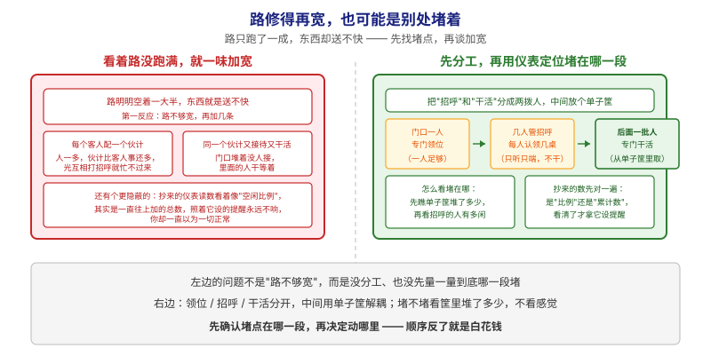
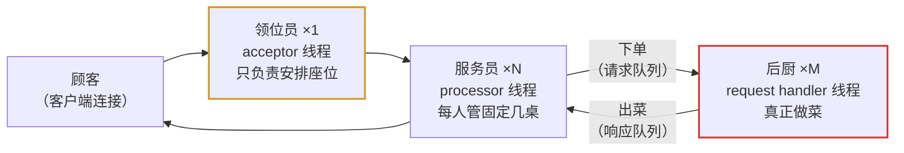
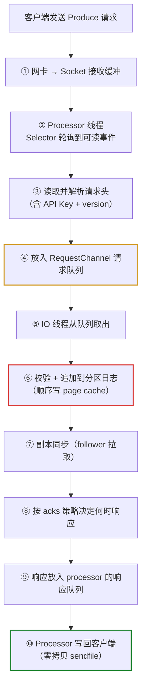
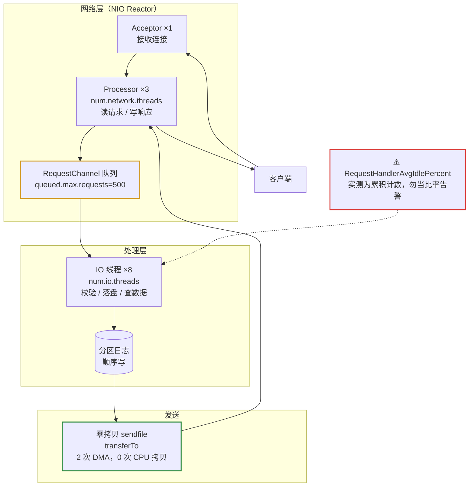

# 课 17：网络层与请求处理模型

> 所属阶段：阶段 7（实现原理）· 第 1 课
> 实测环境：3 节点 KRaft 集群（`apache/kafka:4.0.0`）+ JMX Exporter + Prometheus，Windows WSL Docker
> 全部数值均为本机实测，非纸面推演

---

## 第一幕：场景引入——「带宽没跑满，为什么吞吐上不去？」

你接手了一个 Kafka 集群，业务方反馈：

> 「我们给 broker 配了万兆网卡，但实际吞吐卡在 33 MB/s 就上不去了。CPU 也不高，磁盘也没满，网络监控显示带宽只用了一小部分。」

你登上看，确实：

```text
20000 records sent, 33955.9 records/sec (33.16 MB/sec), 160.90 ms avg latency
```

33 MB/s —— 离万兆网卡的理论上限差了两个数量级。

**问题出在哪？**

一种常见的错误反应是「加机器」。但在加机器之前，你得先能回答一个更基本的问题：**一个请求从网卡进来，到落盘，中间经过了哪些环节？**

这就是本课要解决的：**Kafka 的网络层与请求处理模型**。

> 📌 **一句话本质**：本课做的事，是把「路没跑满就以为路不够宽、一味加宽」改成「**先把"领位 / 招呼 / 干活"分成三拨、中间用单子筐解耦，再用仪表确认到底哪一段堵**」——顺序反了就是白花钱。
>
> ⚖️ **处境对照**（沿用第一幕的场景：万兆网卡、实测吞吐卡在 33 MB/s、CPU 与磁盘都不高）：
> - **不这么做（凭感觉加宽）**：连接数与线程数 1:1，上千连接就上千线程，**光互相打招呼就把算力吃光**；同一批人又接待又干活，门口堆着没人接；更隐蔽的是——**照抄教程拿一个"看着像空闲比例、其实是累计数"的指标设告警**，它永远不响，你却一直以为正常。
> - **这么做（分工 + 先看仪表）**：1 个领位 + N 个管招呼（默认 3）+ M 个干活（默认 8），中间用队列解耦；排查时**先看单子筐堆了多少，再看招呼的人有多闲**——实测 processor 空闲比 **1.0**、队列积压 **0**，直接证明**瓶颈不在这一段**。
>
> ⏳ **数字来源说明**：33.16 MB/s、33955.9 records/sec、平均延迟 160.90 ms、processor 空闲比 1.0、队列 0.0 均为**本课 3 节点实验环境实测值**（`apache/kafka:4.0.0`，单客户端 `kafka-producer-perf-test.sh` 压测）；`RequestHandlerAvgIdlePercent` 实测 **6.1e12 且 5 次采样严格单调递增**（每 3 秒约 +6.3e9），判定为**累积计数而非比率**。这些数字**只在本环境成立**——换机器、换 exporter 配置、换压测并发度都会变，**请以自己的实测为准**，尤其不要把 33 MB/s 当成集群上限（它只是单客户端压测的上限）。

---

## 第二幕：认知冲突——「一个连接一个线程」的直觉为什么是错的

### 2.1 你的直觉可能是这样

学过网络编程的人，第一反应通常是 BIO 模型：

```text
while (true) {
    Socket conn = serverSocket.accept();   // 阻塞等连接
    new Thread(() -> handle(conn)).start(); // 来一个连接开一个线程
}
```

这个模型简单直观，但有个致命问题：**连接数和线程数是 1:1 的**。

一个 Kafka 集群要面对什么量级的连接？

- 几十个 producer 实例
- 上百个 consumer 实例（一个消费组就可能有几十个成员）
- 每个 broker 还要和其他 broker 维持连接（副本拉取）
- 各种运维工具、监控探针

轻轻松松上千个连接。**开一千个线程，光上下文切换就把 CPU 吃光了**。

### 2.2 官方怎么说

Kafka 官方对网络层的描述（[Network Layer](https://kafka.apache.org/43/implementation/network-layer/)）极其简短，原文是：

> The network layer is a fairly straight-forward NIO server, and will not be described in great detail. The sendfile implementation is done by giving the `TransferableRecords` interface a `writeTo` method. This allows the file-backed message set to use the more efficient `transferTo` implementation instead of an in-process buffered write. **The threading model is a single acceptor thread and N processor threads which handle a fixed number of connections each.** This design has been pretty thoroughly tested elsewhere and found to be simple to implement and fast. **The protocol is kept quite simple to allow for future implementation of clients in other languages.**

注意官方的语气："will not be described in great detail"（不打算细讲）——因为这是个**成熟且标准**的设计，不是 Kafka 独创。

这句话里有三个关键信息：

1. **NIO**（非阻塞 IO），不是 BIO
2. **1 个 acceptor 线程 + N 个 processor 线程**，每个 processor 管固定数量的连接
3. 协议**刻意保持简单**，为的是让别人能用别的语言写客户端

第三点常被忽略，但它解释了 Kafka 生态为什么繁荣——协议简单到社区能轻松实现 [librdkafka（C/C++）](https://github.com/confluentinc/librdkafka)、[confluent-kafka-go](https://github.com/confluentinc/confluent-kafka-go)、[kafka-python](https://github.com/dpkp/kafka-python) 等几十种语言的客户端。

### 2.3 冲突的核心

| 你的直觉 | Kafka 的实际做法 |
|---------|-----------------|
| 一个连接一个线程 | 一个 processor 线程管**一批**连接 |
| 线程内完成读+处理+写 | 读/写由 processor 做，**处理交给另一组线程** |
| 阻塞等待 | 全程非阻塞（NIO + Selector） |

关键在于：**网络 IO 和请求处理被拆成了两组不同的线程**。为什么？因为它们的瓶颈性质完全不同——网络 IO 是 IO 密集，请求处理（尤其是落盘）涉及磁盘和锁。混在一起会互相拖累。

---

## 第三幕：层层揭示

### 一眼全局图（进入细节前先看一眼）



> 看图：**左右两边是同一个困惑——路只跑了一成，东西却送不快**，差别在怎么应对。左边凭感觉加宽：要么**每个客人配一个伙计**（人一多，光互相打招呼就忙不过来），要么**让同一批人又接待又干活**（门口堆着没人接）；还有个更隐蔽的坑——**抄来的仪表读数看着像"空闲比例"，其实是一直往上加的总数**，照它设的提醒永远不响，你却以为一切正常。右边先把活分成三拨：**门口一人专门领位**（一人足够）、**几人管招呼**（每人认领几桌，只听只端不干活）、**后面一批人专门干活**（从单子筐里取）；**下面两格是配套的查法**——堵不堵看**筐里堆了多少**、招呼的人有多闲，抄来的数**先看清是"比例"还是"累计数"**再用。**最下面那句是主旨**：先确认堵在哪一段，再决定动哪里。

**四条硬约束**说明：① 本图只回答"本课要解决什么问题、靠什么思路"；② 图上不出现术语（NIO、Reactor、acceptor、processor、零拷贝、JMX 这些词都在下面才出场）；③ 已带读图指引；④ 图旁文字能独立说清同一件事。

### 本课地图（分几步走）

| 步 | 这一步要解决什么（人话） | 对应知识点 |
|:--:|------------------------|-----------|
| 1 | 看清这条路是怎么分段的：谁领位、谁招呼、谁干活 | 网络层与请求处理模型（Reactor NIO） |
| 2 | 用一个真实例子走一遍：33 MB/s 到底是不是这条路堵了 | 实测：线程数与空闲比 |
| 3 | 抄来的仪表读数该怎么验：是"比例"还是"累计数" | 指标语义陷阱（先看再用） |
| 4 | 最后一小段为什么快：数据怎么少搬两趟 | 零拷贝 |

> 只回答"分几步走、现在在哪"；不写机制、不写结论；**不标学习状态**（进度以 `00-学习档案.md` 为准）。

### 3.1 一句话定义

> 🧭 第 1/4 步｜承接：第一幕"带宽没跑满，吞吐却上不去" → 本步：先看清这条路分几段、每段谁负责

> Kafka 的网络层是一个 **Reactor 模式的 NIO 服务器**：1 个 acceptor 线程负责接连接，N 个 processor 线程负责读写（每个管一批连接），M 个 request handler 线程负责真正的业务处理，中间用一个请求队列解耦。

### 3.2 直觉建立：餐厅模型

把这个模型想成一家餐厅：



- **领位员（acceptor）**：只有 1 个，因为「接客」这个动作很快，一个人够用。他不做菜，也不点单。
- **服务员（processor）**：有 N 个，每人固定负责几桌。他负责「听顾客说什么」（读请求）和「把菜端上去」（写响应），但**不做菜**。
- **后厨（request handler）**：有 M 个，真正干活（校验、落盘、查数据）。
- **下单窗口（请求队列）**：服务员把单子放这儿，后厨按顺序取。**这个队列是解耦的关键**——服务员不用等菜做好就能去服务下一桌。

> 看图（上图）：**顺着箭头走一圈**——黄色是领位（**只有一个人**，因为"接客"这个动作很快，一个人够用，他既不做菜也不点单）；中间是几个服务员，**每人固定认领几桌**，只负责听和端、**不做菜**；红色是后厨，真正干活。**关键是中间那个下单窗口**：服务员把单子放进去就能去服务下一桌，**不用等菜做好**——这个筐就是解耦的地方，也是整条路的咽喉。

对应到 Kafka 的配置项：

| 餐厅角色 | Kafka 组件 | 配置参数 | 默认值 |
|---------|-----------|---------|-------|
| 领位员 | Acceptor 线程 | （固定 1 个，不可配） | 1 |
| 服务员 | Processor 线程 | `num.network.threads` | **3** |
| 后厨 | Request Handler 线程 | `num.io.threads` | **8** |
| 下单窗口 | 请求队列 | `queued.max.requests` | 500 |
| 单份订单上限 | 单请求最大字节 | `socket.request.max.bytes` | 104857600（100MB） |

### 3.3 核心原理：请求的一生

一个 Produce 请求从进来到响应出去，完整链路：



**第④步的队列是整条链路的咽喉**。所有性能问题排查，第一个要看的就是这个队列有没有积压。

> 看图（上图）：**从上往下数十步，可以分成三段**。前三步（①②③）是"**接进来**"——网卡到缓冲、轮询到可读、解析请求头；中间第④步那格（黄色）是**咽喉**，单子先堆在这儿；第⑤⑥⑦⑧是"**真正干活**"（红色那格是落盘）；最后⑨⑩是"**送出去**"（绿色那格用了省力的搬法）。**排查顺序就按这个走**：先看第④步的筐堆了多少，筐是空的就说明前面后面都不是瓶颈。

### 3.4 实测：线程数与空闲比

> 🧭 第 2/4 步｜承接：上一步看清了这条路分几段、咽喉在哪 → 本步：拿一个真实例子走一遍，看 33 MB/s 到底是不是这条路堵了

我们用课 15 搭的 3 节点集群实测。

**第一步：确认 processor 线程数量**

```bash
curl -s http://localhost:17071/metrics | grep -E 'kafka_network_processor_idlepercent' | grep -v '^#'
```

实测输出：

```text
kafka_network_processor_idlepercent{networkprocessor="0"} 1.0
kafka_network_processor_idlepercent{networkprocessor="1"} 1.0
kafka_network_processor_idlepercent{networkprocessor="2"} 1.0
```

**只有 3 个 processor（编号 0/1/2）**，正好印证 `num.network.threads` 默认值 3。空闲比都是 **1.0**（100% 空闲）——因为此刻没有流量。

> 📌 若你的 exporter 配置没有为该指标声明 `labels`，输出会是带 `_objectname` 的长格式（如 `kafka_network_processor_idlepercent{_objectname="kafka.network<type=Processor, name=IdlePercent, networkProcessor=0><>Value"}`）。**两种格式等价，关键看 `networkProcessor` 的取值有几个。**

**第二步：打流量，看空闲比怎么变**

```bash
docker exec l15-kafka-1 bash -c 'export PATH=/opt/kafka/bin:$PATH; unset KAFKA_JMX_OPTS
kafka-producer-perf-test.sh --topic net-demo --num-records 20000 --record-size 1024 \
  --throughput -1 --producer-props bootstrap.servers=kafka-1:9092 acks=1'
```

实测结果：

```text
20000 records sent, 33955.9 records/sec (33.16 MB/sec),
160.90 ms avg latency, 256.00 ms max latency,
180 ms 50th, 238 ms 95th, 250 ms 99th, 255 ms 99.9th.
```

压测后指标：

```text
kafka_network_socketserver_networkprocessoravgidlepercent  1.0        ← processor 依然空闲
kafka_network_requestchannel_requestqueuesize              0.0        ← 队列零积压
```

**这个结果本身就是答案**：processor 空闲比 1.0、队列 0 积压 —— 说明**瓶颈根本不在网络层**。33 MB/s 是**客户端单线程压测**的上限，不是集群的上限。

这正是本课最重要的思维方式：**在调任何参数之前，先用指标确认瓶颈在不在你以为的地方。**

### 3.5 ⚠️ 实测踩坑：`RequestHandlerAvgIdlePercent` 是个陷阱

> 🧭 第 3/4 步｜承接：上一步用仪表定位了瓶颈 → 本步：换个角度——**仪表本身也可能骗你**，抄来的读数要先验再用

这是本课最值得记住的实测发现。

很多教程、博客都会告诉你：「监控 `RequestHandlerAvgIdlePercent`，低于 0.3 说明 IO 线程不够」。

我们照做，查到的值是：

```text
kafka_server_kafkarequesthandlerpool_requesthandleravgidlepercent  6.122678585934E12
```

**6.1 万亿。** 一个「比率」怎么会是 6.1e12？

如果你照着教程配 `RequestHandlerAvgIdlePercent < 0.3` 告警，**永远都不会触发**，而你会误以为「IO 线程很健康」。

**根因是什么？** 先看 HELP 行：

```text
# HELP kafka_server_kafkarequesthandlerpool_requesthandleravgidlepercent
  Attribute exposed for management
  kafka.server:name=RequestHandlerAvgIdlePercent,type=KafkaRequestHandlerPool,attribute=Count
                                                                                    ^^^^^
```

**`attribute=Count`** —— exporter 取的是这个 MBean 的 **Count 属性**，不是 Value。

为什么？因为我们的 exporter 配置末尾有一条兜底规则：

```yaml
  - pattern: 'kafka.(\w+)<type=(.+), name=(.+)><>(Value|Count)'
    name: kafka_$1_$2_$3
```

`(Value|Count)` 两个属性都可能匹配，而这个 MBean 在本环境中**只暴露了 Count 一个属性**（我们实测确认：exporter 输出里只有一条 requesthandler 记录，没有 Value 版本）。

**它到底是什么语义？** 连续采样 5 次，每 3 秒一次：

```text
sample 1: 2.36489227576E11
sample 2: 2.42772197115E11
sample 3: 2.49134616829E11
sample 4: 2.55369948383E11
sample 5: 2.61778758301E11
```

**严格单调递增**，每次约 +6.3e9。这是**累积计数**（纳秒级累计空闲时间的量级），不是比率。

对照组 `NetworkProcessorAvgIdlePercent` 同期稳定在 `0.9997967698116609` ~ `1.0` —— 这才是真正的 0~1 比率。

**结论与替代方案**：

| 想监控什么 | 别用 | 改用 |
|-----------|------|------|
| IO 线程是否够用 | ~~`RequestHandlerAvgIdlePercent`~~（本环境是累积计数） | `RequestQueueSize`（队列积压）+ `TotalTimeMs`（请求总耗时） |
| 网络线程是否够用 | — | `kafka_network_processor_idlepercent`（实测正常，0~1） |
| 请求是否积压 | — | `kafka_network_requestchannel_requestqueuesize`（实测 0.0） |

> 📌 **通用教训**：**任何指标在写进告警规则之前，先 curl 一次看它的实际值和 HELP 行**。值与语义不符（比率却很大、计数却会下降）时，先查 `attribute=` 是 Count 还是 Value。这条比记住某个具体指标名重要得多。

### 3.6 零拷贝：为什么 Kafka 能扛住高吞吐

> 🧭 第 4/4 步｜承接：前三步解决了"路分几段、堵在哪、仪表怎么验" → 本步：看最后一小段——数据怎么少搬两趟

回到官方那段话的第二句：

> The sendfile implementation is done by giving the `TransferableRecords` interface a `writeTo` method. This allows the file-backed message set to use the more efficient `transferTo` implementation instead of an in-process buffered write.

消费者拉数据时，数据在**磁盘上的日志文件**里。传统做法：

```text
磁盘 → 内核缓冲区 → 用户空间缓冲区 → Socket 缓冲区 → 网卡
       （DMA拷贝）    （CPU拷贝）      （CPU拷贝）
```

4 次拷贝，2 次 CPU 参与，2 次上下文切换。

零拷贝（`sendfile` / `transferTo`）：

```text
磁盘 → 内核缓冲区 → 网卡
       （DMA拷贝）   （DMA拷贝）
```

2 次拷贝，**0 次 CPU 拷贝**。

这就是课 4 讲过的零拷贝在网络层的落地。官方特意指出这个能力是通过给 `TransferableRecords` 接口加 `writeTo` 方法实现的——**让「文件支撑的消息集」自己决定怎么写出去**，而不是由调用方统一 `read()` 再 `write()`。

> ⚠️ **边界说明**：零拷贝只在**消费者拉取、且数据仍在 page cache / 文件**的路径上生效。如果消息需要解压、需要按事务隔离级别过滤、或者走了加密（SSL），就无法走纯零拷贝路径。

#### 🗣️ 行话对照（本课说法 → 行业术语）

本课用"领位 / 招呼 / 后厨"打比方，读文档、调参数、写告警时会遇到下面这些行话——**同一件事的另一套名字**：

| 本课说法（人话） | 行业标准叫法 | 典型配置 / 在哪遇到 | 代价 / 注意 |
|---|---|---|---|
| 这套分工方式 | **Reactor 模式**（本文沿用英文原名；社区亦译"反应器模式"） | 官方 Network Layer 页原文 | 官方自述"不打算细讲"——**成熟且标准**，非 Kafka 独创 |
| 非阻塞的路子 | **NIO**（Non-blocking IO，本文沿用英文原名） | 同上 | 与"一个连接一个线程"的 BIO 相对 |
| 领位员 | **Acceptor 线程**（本文自拟译"接收线程"，非通用译名） | **固定 1 个，不可配** | 只负责接连接 |
| 服务员 | **Processor 线程**（本文沿用"网络线程"；社区常直呼 processor） | `num.network.threads`，默认 **3** | 每个管**一批**连接，不是 1:1 |
| 后厨 | **Request Handler / IO 线程**（本文自拟译"请求处理线程"，非通用译名） | `num.io.threads`，默认 **8** | 管的是**请求处理**，与连接数无关（常见误配） |
| 下单窗口 | **RequestChannel**（本文沿用"请求通道"） | `queued.max.requests`，默认 500 | **咽喉**：排查先看它有没有积压 |
| 有没有积压 | `RequestQueueSize` | MBean `kafka.network:type=RequestChannel,...` | 本课实测 **0.0** |
| 招呼的人有多闲 | `NetworkProcessorAvgIdlePercent` / `kafka_network_processor_idlepercent` | 本课实测 **1.0**（0~1 比率，正常） | 一个 processor 一条记录，看 `networkProcessor` 有几个 |
| 干活的人有多闲（**陷阱**） | `RequestHandlerAvgIdlePercent` | **本环境实测 1e11~1e12 量级、单调递增** | HELP 行是 `attribute=**Count**`（累积计数），不是比率 → 照抄 `< 0.3` 告警**永不触发**；改用 `RequestQueueSize` + `TotalTimeMs` |
| 少搬两趟 | **零拷贝 / sendfile / transferTo**（本文沿用"零拷贝"；社区常用译法） | `TransferableRecords.writeTo` → `transferTo` | 4 次拷贝降到 2 次、**CPU 拷贝 0 次**；**解压 / 事务过滤 / SSL 时不生效** |
| 一段路要花多久 | `TotalTimeMs` | `kafka.network:type=RequestMetrics,...` | 按请求类型统计（Produce / Fetch / FetchFollower…） |
| 单个请求上限 | `socket.request.max.bytes` | 默认 **104857600**（100MB） | 超过即拒绝，与课 13 的 `message.max.bytes` 不是同一层 |

> 📖 **关于译名**：本表带"本文自拟译"字样的中文名是**为便于阅读自拟的、非通用译名**；NIO / Reactor / sendfile 等**沿用英文原名**。**标注只在首次登场给一次**，后文不再重复括注。
>
---

## 第四幕：实操验证

### 4.1 前置条件

沿用课 15/16 的实验环境。若已销毁，重新拉起：

```bash
cd /mnt/d/projects/learning/kafka/assets/stage6-observability
docker compose up -d
sleep 45
docker ps --format '{{.Names}}\t{{.Status}}' | grep l15-kafka
```

预期三个 broker 全部 `Up`。

> ⚠️ 本课所有 `docker exec` 里的命令都**必须**带 `export PATH=/opt/kafka/bin:$PATH; unset KAFKA_JMX_OPTS`。
> 前者因为该镜像的 CLI 不在默认 PATH；后者因为容器注入的 `KAFKA_JMX_OPTS` 含 `-javaagent`，CLI 继承后会因端口已被 broker 占用而启动失败（详见课 15 踩坑记录）。

### 4.2 步骤 1：确认网络线程数

```bash
curl -s http://localhost:17071/metrics | grep -E 'kafka_network_processor_idlepercent' | grep -v '^#'
```

预期：3 行，`networkProcessor=0/1/2`，值为 1.0（空闲）。未显式声明 labels 时会显示为 `_objectname=...networkProcessor=0...` 的长格式，同样正常。

### 4.3 步骤 2：建 topic 并压测

```bash
docker exec l15-kafka-1 bash -c 'export PATH=/opt/kafka/bin:$PATH; unset KAFKA_JMX_OPTS
kafka-topics.sh --bootstrap-server kafka-1:9092 --create --if-not-exists \
  --topic net-demo --partitions 6 --replication-factor 3'

docker exec l15-kafka-1 bash -c 'export PATH=/opt/kafka/bin:$PATH; unset KAFKA_JMX_OPTS
kafka-producer-perf-test.sh --topic net-demo --num-records 20000 --record-size 1024 \
  --throughput -1 --producer-props bootstrap.servers=kafka-1:9092 acks=1'
```

实测输出（本机）：

```text
20000 records sent, 33955.9 records/sec (33.16 MB/sec),
160.90 ms avg latency, 256.00 ms max latency,
180 ms 50th, 238 ms 95th, 250 ms 99th, 255 ms 99.9th.
```

### 4.4 步骤 3：看网络层是否成为瓶颈

```bash
echo "--- processor 空闲比 ---"
curl -s http://localhost:17071/metrics | grep -i 'networkprocessoravgidlepercent' | grep -v '^#'

echo "--- 请求队列积压 ---"
curl -s http://localhost:17071/metrics | grep -i 'requestchannel_requestqueuesize' | grep -v '^#'

echo "--- 各请求类型的耗时计数 ---"
curl -s http://localhost:17071/metrics | grep -E 'totaltimems' | grep -iE 'produce|fetch' | grep -v '^#'
```

实测：

```text
kafka_network_socketserver_networkprocessoravgidlepercent  1.0
kafka_network_requestchannel_requestqueuesize              0.0
kafka_network_requestmetrics_totaltimems{...request="Fetch"...Count}          12747.0
kafka_network_requestmetrics_totaltimems{...request="FetchFollower"...Count}  12615.0
kafka_network_requestmetrics_totaltimems{...request="FetchConsumer"...Count}    132.0
```

**解读**：processor 100% 空闲、队列 0 积压 → 网络层完全不是瓶颈。FetchFollower 有 12615 次，说明**副本同步流量是主要负载**。

### 4.5 步骤 4：验证那个陷阱指标

```bash
for i in 1 2 3; do
  curl -s http://localhost:17071/metrics | grep -i 'kafkarequesthandlerpool' | grep -v '^#' | awk '{print "sample: "$2}'
  sleep 3
done
```

预期：值持续增大（累积计数），且量级在 1e11 以上。**如果你看到的是 0.x 的小数，说明你的 exporter 配置与我不同，请以实际为准**——这正是本步骤要你亲手确认的事。

---

## 第五幕：体系收束

### 5.1 一图总结



> 读法：从上到下是**一条请求的完整旅程**——先由门口的人接进来（黄色那格是咽喉，先看它堆没堆），再交给后面一批人干活（落盘），最后走绿色那段"少搬两趟"的路送回去；红色那格是**仪表陷阱**：看着像空闲比例，其实是累计数，别拿它设提醒。

> **与课首入口的分工（勿混，三方视角）**：「一眼全局图」在课首、问题视角、零术语，给没学过的人看（回答"为什么需要它、靠什么思路"）；「本课地图」在课首、路线视角（回答"分几步走、现在在哪"），是表格不是图；本图在课末、知识视角，给刚学完的人复习用（回答"本课讲了什么"）。三者不可替代、不雷同。

### 5.2 核心结论（记住这五句）

1. **网络层是标准 Reactor NIO**：1 个 acceptor + N 个 processor（默认 3）+ M 个 IO 线程（默认 8），用请求队列解耦。
2. **队列是咽喉**：排查性能问题先看 `RequestQueueSize`，再看 processor 空闲比，最后才考虑调线程数。
3. **`RequestHandlerAvgIdlePercent` 在本环境实测是累积计数（1e11 量级、单调递增），不是 0~1 比率**——照抄教程配告警会失效。改用 `RequestQueueSize` + `TotalTimeMs`。
4. **零拷贝只在消费拉取路径生效**，靠 `TransferableRecords.writeTo` → `transferTo` 实现，把 4 次拷贝降到 2 次、CPU 拷贝降到 0 次。
5. **33 MB/s 不是集群上限**，是单客户端压测上限——processor 空闲比 1.0 已经证明了这一点。

### 5.3 常见误区

| # | 误区 | 正解 |
|---|------|------|
| 1 | 连接多了就加 `num.io.threads` | 连接数对应的是 `num.network.threads`（processor）；`num.io.threads` 管的是请求处理 |
| 2 | `RequestHandlerAvgIdlePercent` 是空闲比率，< 0.3 要告警 | 实测为累积计数；先 curl 验证语义再写告警 |
| 3 | 吞吐上不去就是网络瓶颈 | 实测 processor 空闲比 1.0、队列 0 积压，瓶颈在别处（如客户端并发、acks 策略） |
| 4 | 零拷贝对所有请求生效 | 只有「文件支撑的消息集」直接写出时生效；SSL、解压、事务过滤会走普通路径 |
| 5 | `num.network.threads` 越大越好 | 每个 processor 管一批连接，过多会增加 Selector 竞争；默认 3 适用于绝大多数场景 |

### 5.4 官方文档

- [Network Layer](https://kafka.apache.org/43/implementation/network-layer/)（本课本源，全文仅 3 段）
- [Apache Kafka 官方文档 · 4.3](https://kafka.apache.org/43/documentation.html)
- 完整路由表见 [web-index/kafka/index.md](../../../web-index/kafka/index.md)

### 5.5 课后小测

**Q1.** 某集群 processor 空闲比长期 0.98、请求队列 0 积压，但吞吐上不去。最可能的原因是什么？
<details><summary>答案</summary>瓶颈不在网络层。空闲比 0.98 说明 processor 几乎无事可做，队列 0 说明没有积压。应排查客户端并发度、`acks` 策略、分区数是否足够、磁盘 IO。本课实测的 33 MB/s 就是典型例子——单客户端压测的上限，而非集群上限。</details>

**Q2.** 你照教程配了 `RequestHandlerAvgIdlePercent < 0.3` 告警，从未触发。你该怎么做？
<details><summary>答案</summary>先 curl 看实际值与 HELP 行。本环境实测值为 1e11 量级且单调递增（`attribute=Count`），是累积计数而非比率，所以 `< 0.3` 永不成立。改用 `RequestQueueSize`（队列积压）和 `TotalTimeMs`（请求总耗时）监控 IO 线程压力。</details>

**Q3.** 零拷贝为什么能减少 CPU 开销？它在什么情况下会失效？
<details><summary>答案</summary>传统路径：磁盘→内核缓冲→用户空间→Socket 缓冲→网卡，4 次拷贝含 2 次 CPU 拷贝。零拷贝（`sendfile`/`transferTo`）让数据从内核缓冲直接到网卡，只剩 2 次 DMA 拷贝，CPU 拷贝为 0。失效场景：需要解压、需要按事务隔离级别过滤、启用 SSL 加密时，数据必须先进入用户空间处理，无法走纯零拷贝。</details>

---

**下一课**：[课 18：消费者位移与协调者](../lessons/lesson-18-消费者位移与协调者.md)

**上一课**：[课 16：集群运维操作](../../6-运维与可观测/lessons/lesson-16-集群运维操作.md)

**返回目录**：[课程目录](../../../02-课程目录.md)
