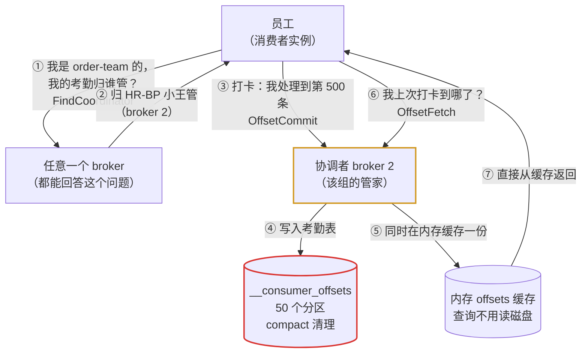
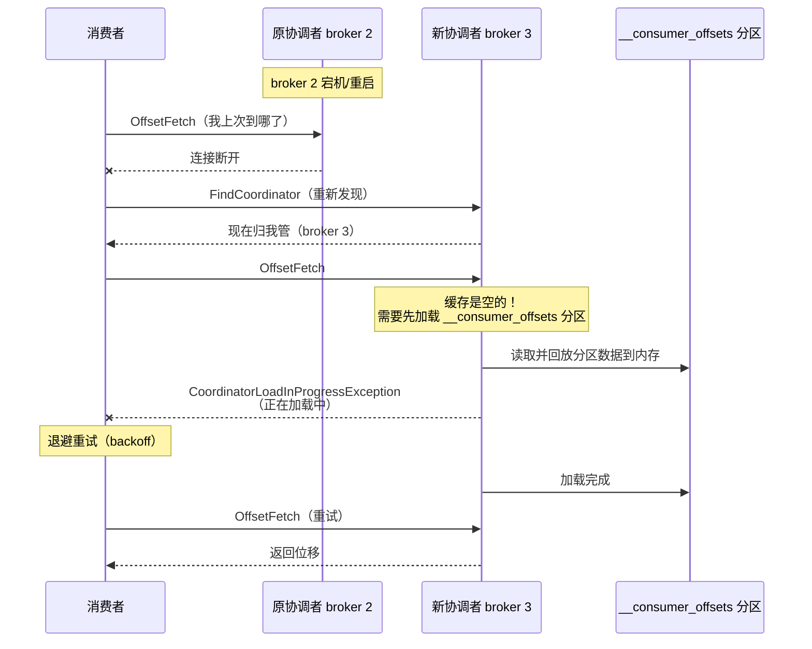
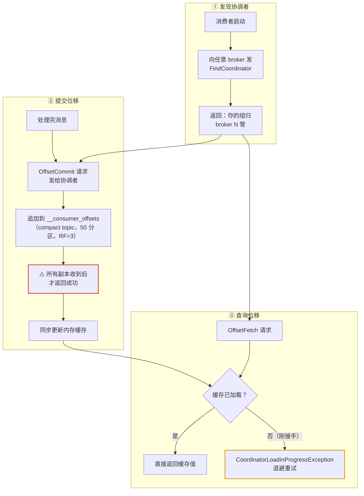
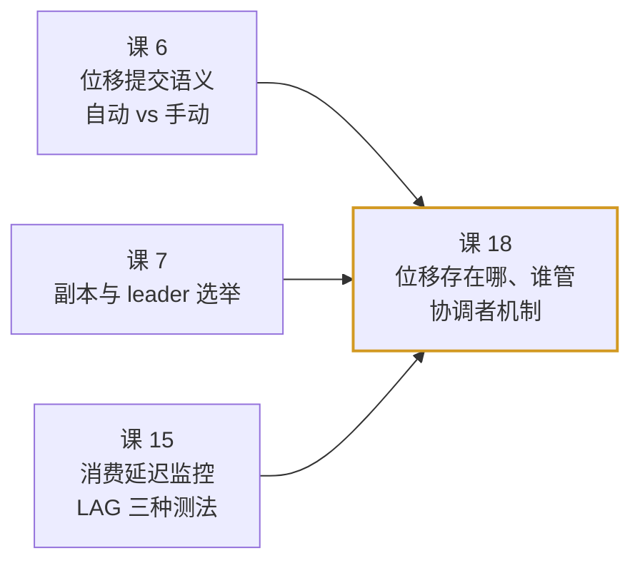

# 课 18：消费者位移与协调者

> 所属阶段：阶段 7（实现原理）· 第 2 课
> 实测环境：3 节点 KRaft 集群（`apache/kafka:4.0.0`），Windows WSL Docker
> 全部数值均为本机实测

---

## 第一幕：场景引入——「消费者组卡住了，重启也没用」

运维群里有人@你：

> 「我们的消费组 `order-team` 突然不消费了，LAG 一直在涨。重启消费者也没用，日志里刷这个：
> `CoordinatorLoadInProgressException`」

你查了一下，集群看起来是健康的：URP = 0，三个 broker 都在线。

但消费组就是不动。

**问题出在哪？**

要回答这个问题，你得理解消费者**把进度存在哪、由谁保管**。课 6 讲过「位移提交 = 往 `__consumer_offsets` 打卡」，但没讲：

- 这张「考勤表」由**谁**负责写？
- 消费者怎么知道该找**哪个 broker** 打卡？
- 那个 broker 换人了怎么办？

这就是本课的主题：**消费者位移与协调者（Group Coordinator）**。

---

## 第二幕：认知冲突——「进度存本地就行了，为什么要搞个协调者？」

### 2.1 一个看似合理的简化方案

「每个消费者把自己读到哪了记在本地文件不行吗？」

单机场景确实可以。但分布式下会立刻崩溃：

```text
消费者 A 在机器 1 上消费 partition-0，记在本地：offset=1000
机器 1 宕机
消费者 B 在机器 2 上接手 partition-0
→ 机器 2 上没有任何记录，B 不知道从哪开始
```

要么从头消费（重复处理几百万条），要么从最新开始（丢掉中间所有消息）。两个都不能接受。

### 2.2 那直接存在 Kafka 里呢？

课 6 已经给了答案：存在内部主题 `__consumer_offsets` 里。

但这带来一个新问题：**`__consumer_offsets` 本身也是一个 Kafka topic，有 50 个分区，分布在各个 broker 上**。

那么：

1. 消费组 `order-team` 的位移，该写进 50 个分区里的哪一个？
2. 谁来负责这个「写」动作？
3. 消费者怎么知道去问谁？

如果每个消费者都自己去算、自己去写，就会出现**并发写冲突**——两个消费者同时更新同一个消费组的位移，后写的覆盖先写的。

### 2.3 官方的设计

官方对这块的描述（[Distribution](https://kafka.apache.org/43/implementation/distribution/) 页面，标题为 *Consumer Offset Tracking*）原文：

> Kafka consumer tracks the maximum offset it has consumed in each partition and has the capability to commit offsets so that it can resume from those offsets in the event of a restart. Kafka provides the option to store all the offsets for a given consumer group in a designated broker (for that group) called the **group coordinator**. i.e., any consumer instance in that consumer group should send its offset commits and fetches to that group coordinator (broker).

关键设计：**每个消费组被指派一个专属的「组长 broker」，所有该组的位移提交与查询都找它。**

> Consumer groups are assigned to coordinators based on their group names. A consumer can look up its coordinator by issuing a **FindCoordinatorRequest** to any Kafka broker and reading the **FindCoordinatorResponse** which will contain the coordinator details.

**按组名分配**——这是关键。组名决定归属，而不是随机选。

### 2.4 冲突的核心

| 你的直觉 | Kafka 的设计 |
|---------|-------------|
| 每个消费者自己管自己的进度 | 每个**消费组**有一个**专属协调者 broker** 统一管理 |
| 进度写「一个地方」 | 写进 `__consumer_offsets` 这个**特定的 50 分区 topic** |
| 消费者直接写 | 消费者向协调者发请求，**由协调者写** |
| 协调者是固定的 | 协调者**会变**（broker 增减、分区 leader 变化），需要重新发现 |

---

## 第三幕：层层揭示

### 3.1 一句话定义

> **Group Coordinator（组协调者）** 是每个消费组专属的「管家 broker」：它负责接收该组的位移提交、把位移写进 `__consumer_offsets` 的对应分区、并缓存在内存里供快速查询。消费者通过 `FindCoordinator` 请求发现自己的协调者是谁。

### 3.2 直觉建立：公司考勤

把整个机制想成一家公司的考勤系统：



几个要点：

- **问任何一个 broker 都行**（第①步）：不需要知道协调者是谁才能问——这是「自举」设计。
- **按组名分配**：`order-team` 永远归同一个协调者（除非它挂了或集群变化）。
- **缓存是性能关键**：协调者把位移缓存在内存表，查询直接命中缓存，不读磁盘。

### 3.3 核心原理：一次位移提交的完整链路

官方原文对写入路径的描述：

> When the group coordinator receives an **OffsetCommitRequest**, it appends the request to a special **compacted** Kafka topic named `__consumer_offsets`. The broker sends a successful offset commit response to the consumer **only after all the replicas of the offsets topic receive the offsets**. In case the offsets fail to replicate within a configurable timeout, the offset commit will fail and the consumer may retry the commit after backing off.

**划重点**：

1. `__consumer_offsets` 是 **compacted（日志压实）** topic——只保留每个 (group, topic, partition) 的**最新**位移，历史值会被清理。
2. 提交成功需要**所有副本都收到**（不是 leader 收到就返回）。这一点和普通 topic 的 `acks=-1` 语义一致。
3. 复制超时则**提交失败**，消费者会退避重试。

> The brokers periodically compact the offsets topic since it only needs to maintain the most recent offset commit per partition. **The coordinator also caches the offsets in an in-memory table in order to serve offset fetches quickly.**

**查询路径**：

> When the coordinator receives an offset fetch request, it simply returns the last committed offset vector from the offsets cache. In case coordinator was just started or if it just became the coordinator for a new set of consumer groups (by becoming a leader for a partition of the offsets topic), **it may need to load the offsets topic partition into the cache. In this case, the offset fetch will fail with an `CoordinatorLoadInProgressException` and the consumer may retry the OffsetFetchRequest after backing off.**

### 3.4 这解释了开头的故障

回到第一幕的报错 `CoordinatorLoadInProgressException`：



**这是正常的、可自愈的过程**，不是 bug。消费者会自动退避重试，加载完成后恢复。

**什么时候需要人工介入？** 如果 `__consumer_offsets` 分区很大（比如积累了大量组的位移、或长期未压实），加载会耗时较久，表现为「消费组长时间无进展」。这时要排查压实是否正常工作。

### 3.5 实测：协调者到底是谁

我们用课 15 的 3 节点集群实测。

**第一步：创建测试 topic 并产生真实消费组**

```bash
docker exec l15-kafka-1 bash -c 'export PATH=/opt/kafka/bin:$PATH; unset KAFKA_JMX_OPTS
kafka-topics.sh --bootstrap-server kafka-1:9092 --create --if-not-exists \
  --topic coord-demo --partitions 4 --replication-factor 3'
```

实测输出：`Created topic coord-demo.`

**第二步：产生消息并真实消费**

```bash
docker exec l15-kafka-1 bash -c 'export PATH=/opt/kafka/bin:$PATH; unset KAFKA_JMX_OPTS
kafka-producer-perf-test.sh --topic coord-demo --num-records 2000 --record-size 256 \
  --throughput -1 --producer-props bootstrap.servers=kafka-1:9092 acks=1'
```

实测：`2000 records sent, 8130.1 records/sec (1.98 MB/sec), 18.13 ms avg latency`

```bash
docker exec l15-kafka-1 bash -c 'export PATH=/opt/kafka/bin:$PATH; unset KAFKA_JMX_OPTS
timeout 25 kafka-console-consumer.sh --bootstrap-server kafka-1:9092 \
  --topic coord-demo --group coord-team --from-beginning --max-messages 500'
```

实测：`Processed a total of 500 messages`

**第三步：查看消费组状态与协调者**

```bash
docker exec l15-kafka-1 bash -c 'export PATH=/opt/kafka/bin:$PATH; unset KAFKA_JMX_OPTS
kafka-consumer-groups.sh --bootstrap-server kafka-1:9092 --describe --group coord-team
echo "--- 协调者是谁 ---"
kafka-consumer-groups.sh --bootstrap-server kafka-1:9092 --describe --group coord-team --state'
```

实测输出：

```text
Consumer group 'coord-team' has no active members.

GROUP           TOPIC           PARTITION  CURRENT-OFFSET  LOG-END-OFFSET  LAG    CONSUMER-ID  HOST  CLIENT-ID
coord-team      coord-demo      3          0               488             488    -            -     -
coord-team      coord-demo      1          500             610             110    -            -     -
coord-team      coord-demo      2          0               488             488    -            -     -
coord-team      coord-demo      0          0               414             414    -            -     -

GROUP           COORDINATOR (ID)          ASSIGNMENT-STRATEGY  STATE   #MEMBERS
coord-team      kafka-2:9092  (2)         -                    Empty   0
```

**实测结论**：

| 观察项 | 实测值 | 说明 |
|-------|-------|------|
| 协调者 | **`kafka-2:9092 (2)`** | 组 `coord-team` 的位移由 broker 2 管理 |
| 组状态 | `Empty` | 消费者已退出，无活跃成员 |
| 分区 1 的位移 | `CURRENT-OFFSET=500` | 正是我们消费的 500 条，**已成功提交** |
| 分区 0/2/3 的位移 | `0` | `--max-messages 500` 提前退出，其余分区未消费 |
| LAG | 488/110/488/414 | 各分区剩余未消费量 |

注意分区 1 的 `CURRENT-OFFSET=500` 恰好等于消费条数——**位移提交链路真实跑通了**。

### 3.6 实测：`__consumer_offsets` 的真实状态

```bash
docker exec l15-kafka-1 bash -c 'export PATH=/opt/kafka/bin:$PATH; unset KAFKA_JMX_OPTS
kafka-topics.sh --bootstrap-server kafka-1:9092 --describe --topic __consumer_offsets
echo "--- 动态配置 ---"
kafka-configs.sh --bootstrap-server kafka-1:9092 --entity-type topics \
  --entity-name __consumer_offsets --describe'
```

实测输出：

```text
Topic: __consumer_offsets	TopicId: nmiZrSgsSYyjMAW8bvzp0w
	PartitionCount: 50	ReplicationFactor: 3
	Configs: compression.type=producer,cleanup.policy=compact,segment.bytes=104857600
	Topic: __consumer_offsets	Partition: 0	Leader: 2	Replicas: 2,3,1	Isr: 2,1,3
	Topic: __consumer_offsets	Partition: 1	Leader: 3	Replicas: 3,1,2	Isr: 1,2,3
	Topic: __consumer_offsets	Partition: 2	Leader: 1	Replicas: 1,2,3	Isr: 1,2,3
	Topic: __consumer_offsets	Partition: 3	Leader: 3	Replicas: 3,1,2	Isr: 1,2,3
	Topic: __consumer_offsets	Partition: 4	Leader: 1	Replicas: 1,2,3	Isr: 1,2,3
```

动态配置：

```text
  cleanup.policy=compact    (DEFAULT_CONFIG: log.cleanup.policy=delete)
  compression.type=producer
  segment.bytes=104857600   (DEFAULT_CONFIG: log.segment.bytes=1073741824)
```

**三点实测印证官方说法**：

1. **50 个分区、副本因子 3** —— 与官方和课 6 一致。
2. **`cleanup.policy=compact`** —— 注意它是**动态配置覆盖**了默认的 `delete`。这印证了官方「periodically compact」的说法。
3. **`segment.bytes=104857600`（100MB）** —— 远小于默认的 1GB。**这是为了让压实更频繁地发生**，减小单个 segment 体积、加快压实速度。这是个容易被忽略但很重要的调优细节。

### 3.7 协调者的分配规则

组 → 协调者的映射规则是：

```text
partition = hash(group.id) % 50          # __consumer_offsets 的分区数
coordinator = 该分区的 leader 所在的 broker
```

所以：

- 组名**决定**归属（同名的组永远映射到同一分区）
- 该分区的 **leader broker** 就是协调者
- 分区 leader 漂移 → 协调者更换 → 消费者需重新加载 → 可能触发 `CoordinatorLoadInProgressException`

这就把本课的机制和课 7 的副本 leader 选举串起来了：**协调者变更的本质，就是 `__consumer_offsets` 某个分区的 leader 换了。**

---

## 第四幕：实操验证

### 4.1 步骤 1：确认环境

```bash
docker ps --format '{{.Names}}\t{{.Status}}' | grep l15-kafka
```

预期三个 broker 全部 `Up`。

### 4.2 步骤 2：建 topic 并消费

```bash
docker exec l15-kafka-1 bash -c 'export PATH=/opt/kafka/bin:$PATH; unset KAFKA_JMX_OPTS
kafka-topics.sh --bootstrap-server kafka-1:9092 --create --if-not-exists \
  --topic coord-demo --partitions 4 --replication-factor 3
kafka-producer-perf-test.sh --topic coord-demo --num-records 2000 --record-size 256 \
  --throughput -1 --producer-props bootstrap.servers=kafka-1:9092 acks=1
timeout 25 kafka-console-consumer.sh --bootstrap-server kafka-1:9092 \
  --topic coord-demo --group coord-team --from-beginning --max-messages 500'
```

预期：`Processed a total of 500 messages`

### 4.3 步骤 3：查协调者

```bash
docker exec l15-kafka-1 bash -c 'export PATH=/opt/kafka/bin:$PATH; unset KAFKA_JMX_OPTS
kafka-consumer-groups.sh --bootstrap-server kafka-1:9092 --describe --group coord-team --state'
```

预期（你的协调者编号可能与本文不同，取决于 hash 结果）：

```text
GROUP           COORDINATOR (ID)          ASSIGNMENT-STRATEGY  STATE   #MEMBERS
coord-team      kafka-2:9092  (2)         -                    Empty   0
```

> 📌 **你的机器上协调者可能是 broker 1 或 3**，这是正常的——`hash("coord-team") % 50` 的结果决定它落在哪个分区，而分区 leader 分布在不同环境可能不同。**关键是理解规则，不是记住编号。**

### 4.4 步骤 4：验证位移确实提交了

```bash
docker exec l15-kafka-1 bash -c 'export PATH=/opt/kafka/bin:$PATH; unset KAFKA_JMX_OPTS
kafka-consumer-groups.sh --bootstrap-server kafka-1:9092 --describe --group coord-team'
```

预期：某个分区的 `CURRENT-OFFSET` 等于你消费的条数（如 500），其余为 0。

**如果你看到全部分区 `CURRENT-OFFSET` 都是 `-`**，说明该组从未提交过位移。

### 4.5 步骤 5：观察协调者变更（可选，制造故障）

```bash
# 停掉当前协调者所在的 broker（本例是 kafka-2，请按你的实际编号调整）
docker stop l15-kafka-2
sleep 10

# 重新查协调者
docker exec l15-kafka-1 bash -c 'export PATH=/opt/kafka/bin:$PATH; unset KAFKA_JMX_OPTS
kafka-consumer-groups.sh --bootstrap-server kafka-1:9092 --describe --group coord-team --state'

# 恢复
docker start l15-kafka-2
```

预期：协调者编号**发生变化**（从 2 变成 1 或 3）。这就是 `CoordinatorLoadInProgressException` 的触发场景。

> ⚠️ 此操作会造成 `__consumer_offsets` 部分分区短暂不可用，请在实验环境执行。

---

## 第五幕：体系收束

### 5.1 一图总结



### 5.2 核心结论（记住这五句）

1. **每个消费组有一个专属协调者 broker**，按 `hash(group.id) % 50` 决定归属分区，该分区的 leader 即协调者。
2. **消费者靠 `FindCoordinator` 发现协调者**，可向任意 broker 发起——这是自举设计。
3. **提交成功要求 `__consumer_offsets` 的所有副本都收到**，不是 leader 单独确认；超时则失败并退避重试。
4. **`CoordinatorLoadInProgressException` 是正常自愈过程**：协调者变更 → 新协调者缓存为空 → 加载中拒绝查询 → 加载完恢复。
5. **`__consumer_offsets` 是 compact topic，且 `segment.bytes` 被特意调小到 100MB**（默认 1GB），为的是让压实更频繁。

### 5.3 常见误区

| # | 误区 | 正解 |
|---|------|------|
| 1 | 位移存在消费者本地 | 存在 Kafka 内部主题 `__consumer_offsets`（实测 50 分区、RF=3、compact） |
| 2 | 消费者直接写 `__consumer_offsets` | 消费者向**协调者**发请求，由协调者写 |
| 3 | 协调者是固定的 | 随 `__consumer_offsets` 分区 leader 漂移而变更，需重新发现 |
| 4 | `CoordinatorLoadInProgressException` 是错误，要修 | 是**正常的加载中状态**，客户端会自动退避重试；只有长期不恢复才需介入 |
| 5 | `__consumer_offsets` 配置和其他 topic 一样 | 实测 `cleanup.policy=compact` 覆盖了默认 `delete`，`segment.bytes=100MB` 覆盖了默认 1GB |
| 6 | 位移提交成功 = leader 收到 | 官方明确：**所有副本**收到后才返回成功 |

### 5.4 官方文档

- [Distribution · Consumer Offset Tracking](https://kafka.apache.org/43/implementation/distribution/)（本课本源）
- [Apache Kafka 官方文档 · 4.3](https://kafka.apache.org/43/documentation.html)
- 完整路由表见 [web-index/kafka/index.md](../../../web-index/kafka/index.md)

### 5.5 与既有课程的关系



课 6 讲「**什么时候**提交」（语义），本课讲「**提交到哪、谁负责**」（机制）。课 7 的 leader 选举解释了协调者为什么会变。课 15 的 LAG 监控依赖本课的存储机制。

### 5.6 课后小测

**Q1.** 消费组 `order-team` 的协调者是 broker 2。如果 broker 2 宕机，会发生什么？
<details><summary>答案</summary>`__consumer_offsets` 中该组对应的分区 leader 会漂移到其他 broker（课 7 的 leader 选举），新 leader 成为新协调者。消费者检测到连接断开后会重新发 `FindCoordinator` 发现新协调者。新协调者内存缓存为空，需要先加载分区数据，期间 `OffsetFetch` 会返回 `CoordinatorLoadInProgressException`，客户端退避重试，加载完成后自动恢复。</details>

**Q2.** 为什么 `__consumer_offsets` 用 `compact` 而不是 `delete`？
<details><summary>答案</summary>因为只需要保留每个 (group, topic, partition) 的**最新**位移，历史位移毫无价值。compact（日志压实）正是保留 key 的最新值、清理旧值的策略。若用 delete，要么按时间删掉仍在使用的组位移，要么空间无限增长。实测确认该配置为动态覆盖：`cleanup.policy=compact`（默认 `delete`）。</details>

**Q3.** 位移提交响应迟迟不返回，可能是什么原因？
<details><summary>答案</summary>官方明确：协调者要等 `__consumer_offsets` 对应分区的**所有副本**都收到位移后才返回成功。若副本同步滞后（如 follower 落后、ISR 收缩、网络问题），提交会在可配置超时后失败。消费者应退避重试。排查方向：查 `__consumer_offsets` 分区的 ISR 是否完整、URP 是否为 0。</details>

---

**下一课**：[课 19：协议版本与兼容性](lesson-19-协议版本与兼容性.md)

**上一课**：[课 17：网络层与请求处理模型](lesson-17-网络层与请求处理模型.md)

**返回目录**：[课程目录](../../../02-课程目录.md)
