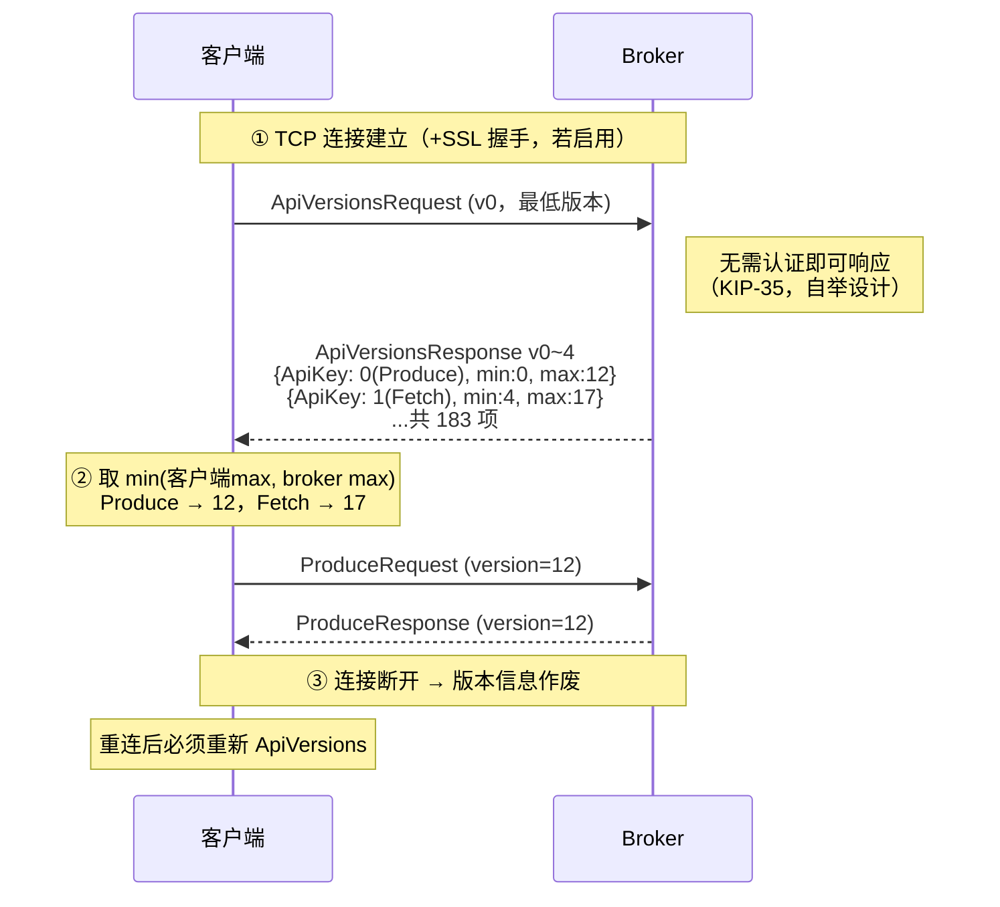
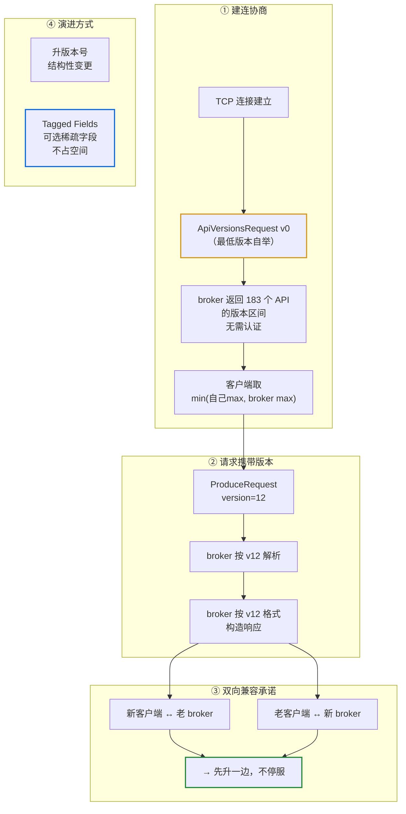
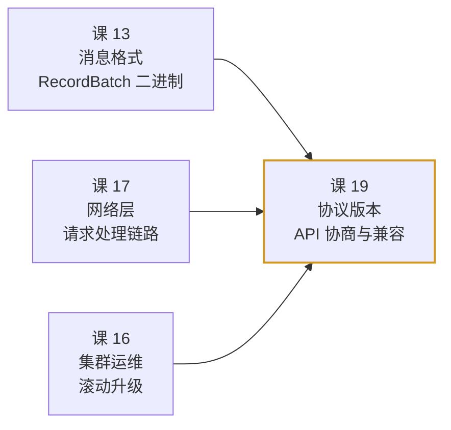

# 课 19：协议版本与兼容性

> 所属阶段：阶段 7（实现原理）· 第 3 课
> 实测环境：3 节点 KRaft 集群（`apache/kafka:4.0.0`），Windows WSL Docker
> 全部数值均为本机实测

---

## 第一幕：场景引入——「升级 broker 要不要停业务？」

你要把 Kafka 集群从 3.x 升到 4.0。老板问：

> 「升级要不要停业务？先升 broker 还是先升客户端？」

这是个价值百万的问题。如果答案是「必须全停一起升」，那意味着一次全站停服；如果答案是「可以滚动升级」，风险和时间成本天差地别。

**Kafka 给出的答案是什么？**

官方在 [Protocol](https://kafka.apache.org/43/design/protocol/) 页面的 *Compatibility* 一节开头，第一句话就是：

> Kafka has a **"bidirectional" client compatibility policy**. In other words, **new clients can talk to old servers, and old clients can talk to new servers**. This allows users to upgrade either clients or servers without experiencing any downtime.

**双向兼容**：新客户端能连老 broker，老客户端也能连新 broker。所以可以**先升一边，再升另一边，全程不停服**。

这个承诺是怎么兑现的？这就是本课要讲的：**协议版本与兼容性**。

---

## 第二幕：认知冲突——「协议只能有一个版本」的直觉

### 2.1 你的直觉

通常我们理解「协议版本」是这样的：

```text
服务提供 v1 接口 → 客户端用 v1 调用
服务升级到 v2   → v1 接口下线 → 客户端必须跟着改
```

要么是**强绑定**（必须同时升级），要么服务端**同时维护多套接口**（`/v1/xxx`、`/v2/xxx`）。

后者的成本很高：每加一个版本，服务端就要多一套代码路径。

### 2.2 Kafka 的做法：版本是「协商」出来的

Kafka 没有 `/v1`、`/v2` 这样的路径。它是这样工作的：

```text
客户端连上来 → 问 broker「你支持 Produce 的哪些版本？」
broker 回答  → 「我支持 0 到 12」
客户端      → 我最高支持 12，那咱就用 12
```

**每次请求都带着版本号**，broker 按这个版本解析和响应。

这就引出了一个关键问题：客户端怎么知道 broker 支持哪些版本？

### 2.3 自举难题

「问 broker 支持哪些版本」这个请求本身，也需要一个版本啊——**先有鸡还是先有蛋**？

Kafka 的解法是：**`ApiVersions` 请求本身用最低版本（v0）发送**，它是所有版本的公约数。拿到响应后，客户端就知道了 broker 的全部能力，之后的请求按需选用。

官方原文：

> In order to work against multiple broker versions, clients need to know what versions of various APIs a broker supports. The broker exposes this information **since 0.10.0.0** as described in **KIP-35**.

以及官方给出的完整握手序列：

> - Client sends **ApiVersionsRequest** to a broker after connection has been established with the broker. If SSL is enabled, this happens after SSL connection has been established.
> - On receiving ApiVersionsRequest, a broker returns its full list of supported ApiKeys and versions **regardless of current authentication state** (e.g., before SASL authentication).
> - Supported API versions obtained from a broker are **only valid for the connection** on which that information is obtained. In the event of disconnection, the client should obtain the information from the broker again, as the broker might have been upgraded/downgraded.

**三点注意**：

1. 在连接建立后（SSL 则在 SSL 握手后）立即发送。
2. **不要求认证**——这是刻意设计，未认证的客户端也要能问（否则无法自举）。
3. **只对本次连接有效**，断线重连要重新问（因为 broker 可能已经升降级了）。

### 2.4 冲突的核心

| 你的直觉 | Kafka 的设计 |
|---------|-------------|
| 一个 API 一个版本 | 一个 API **同时支持一个版本区间**（如 `Produce: 0 to 12`） |
| 版本写死在客户端 | 版本在**建连时协商**，取双方交集的最高版 |
| 服务端维护多套代码 | 每个 API 有版本化的 schema，broker 按请求携带的版本解析 |
| 版本信息全局有效 | **只对当前连接有效**，断线必须重问 |

---

## 第三幕：层层揭示

### 3.1 一句话定义

> Kafka 的协议由**一组带编号的 API（ApiKey）**构成，每个 API 支持一个**版本区间**。客户端建连后先发 `ApiVersions` 询问 broker 的能力集，之后每个请求都携带「双方都支持的最高版本」，broker 按该版本解析并响应。

### 3.2 直觉建立：多语言会议

想象一场国际会议：

```text
参会者（客户端）入场时问主办方（broker）：
  「你会哪些语言？每种语言熟练度多少？」
主办方递上一张表：
  「中文：1-10 级（我最高 10 级）」
  「英文：1-8 级」
  「日文：我不会」
参会者看表，选一个双方都懂的最高等级开始交谈
```

`ApiVersions` 就是那张能力表。每个 API 的 `min_version` 到 `max_version` 就是「熟练度区间」。

### 3.3 核心原理：版本协商



协商规则官方原文：

> The intention is that clients will support a range of API versions. When communicating with a particular broker, a given client should use **the highest API version supported by both** and indicate this version in their requests.
>
> The server will **reject requests with a version it does not support**, and will always respond to the client with **exactly the protocol format it expects** based on the version it included in its request.

**第二条极其重要**：broker 不只是「接受」请求，而是**用请求中声明的版本格式来构造响应**。这意味着：老客户端（用 v3）和新客户端（用 v13）连同一个 broker，拿到的**响应字节格式是不同的**，各自都能正确解析。

### 3.4 实测：broker 的能力表长什么样

我们用 `kafka-broker-api-versions.sh` 查询真实 broker。

```bash
docker exec l15-kafka-1 bash -c 'export PATH=/opt/kafka/bin:$PATH; unset KAFKA_JMX_OPTS
kafka-broker-api-versions.sh --bootstrap-server kafka-1:9092'
```

实测输出（截取）：

```text
kafka-1:9092 (id: 1 rack: null isFenced: false) -> (
	Produce(0): 0 to 12 [usable: 12],
	Fetch(1): 4 to 17 [usable: 17],
	ListOffsets(2): 1 to 10 [usable: 10],
	Metadata(3): 0 to 13 [usable: 13],
	OffsetCommit(8): 2 to 9 [usable: 9],
	OffsetFetch(9): 1 to 9 [usable: 9],
	FindCoordinator(10): 0 to 6 [usable: 6],
	JoinGroup(11): 2 to 9 [usable: 9],
	Heartbeat(12): 0 to 4 [usable: 4],
	ApiVersions(18): 0 to 4 [usable: 4],
	...
	ConsumerGroupHeartbeat(68): 0 to 1 [usable: 1],
	ShareGroupHeartbeat(76): UNSUPPORTED,
	...
)
```

**统计 API 总数**：

```bash
kafka-broker-api-versions.sh --bootstrap-server kafka-1:9092 | grep -c 'usable:'
```

实测：**183 个 API**。

这个输出里藏着四个必看的信息：

| 字段 | 示例 | 含义 |
|------|------|------|
| API 名与编号 | `Produce(0)` | ApiKey = 0，即 Produce |
| 支持区间 | `0 to 12` | broker 能解析 v0~v12 |
| 可用版本 | `[usable: 12]` | **当前客户端实际会用的版本** |
| 不支持 | `ShareGroupHeartbeat(76): UNSUPPORTED` | broker 完全不认识这个 API |

`UNSUPPORTED` 这一行很重要——它真实展示了「broker 不认识的 API」长什么样。这和「认识但版本不匹配」是两种不同的情况。

本环境实测 **UNSUPPORTED 共 33 个**（均为较新的 Share Group、Telemetry 等能力），举例：

```text
GetTelemetrySubscriptions(71): UNSUPPORTED,
PushTelemetry(72): UNSUPPORTED,
ShareGroupHeartbeat(76): UNSUPPORTED,
ShareGroupDescribe(77): UNSUPPORTED,
ShareFetch(78): UNSUPPORTED,
ShareAcknowledge(79): UNSUPPORTED,
InitializeShareGroupState(83): UNSUPPORTED,
ReadShareGroupState(84): UNSUPPORTED,
WriteShareGroupState(85): UNSUPPORTED,
DeleteShareGroupState(86): UNSUPPORTED,
ReadShareGroupStateSummary(87): UNSUPPORTED
```

而 `ConsumerGroupHeartbeat(68): 0 to 1 [usable: 1]` 则是**支持**的新协议——说明 UNSUPPORTED 反映的是「该 broker 版本尚未实现」，不是「编号大就不支持」。

### 3.5 实测：客户端真的用了协商后的版本吗

光看 `usable` 还不够有说服力。我们直接查 broker 侧记录的**实际请求版本**。

```bash
curl -s http://localhost:17071/metrics | grep -E 'requestspersec_count_total' | grep -v '^#'
```

实测输出（截取）：

```text
kafka_network_requestmetrics_requestspersec_count_total{request="ApiVersions",version="4"} 18.0
kafka_network_requestmetrics_requestspersec_count_total{request="Fetch",version="17"} 706.0
kafka_network_requestmetrics_requestspersec_count_total{request="FetchFollower",version="17"} 706.0
kafka_network_requestmetrics_requestspersec_count_total{request="Metadata",version="13"} 7.0
kafka_network_requestmetrics_requestspersec_count_total{request="AlterPartition",version="3"} 8.0
kafka_network_requestmetrics_requestspersec_count_total{request="BrokerHeartbeat",version="1"} 281.0
kafka_network_requestmetrics_requestspersec_count_total{request="BrokerRegistration",version="4"} 18.0
```

**对照验证**：

| 请求类型 | broker 支持区间 | 客户端实际使用 | 是否等于上界 |
|---------|---------------|--------------|-------------|
| `Fetch` | `4 to 17` | **17** | ✅ |
| `Metadata` | `0 to 13` | **13** | ✅ |
| `ApiVersions` | `0 to 4` | **4** | ✅ |

**完美印证官方规则**：客户端用的正是「双方都支持的最高版本」。

这就是「协商」的实证——不是猜的，是 broker 侧真实记录下来的。

### 3.6 老版本为什么还在：兼容的真实代价

你可能注意到 `Produce: 0 to 12` —— **为什么要保留 v0？v0 是 2013 年的格式了**。

因为**双向兼容承诺**：

```text
老客户端（只懂 v0~v3）连新 broker（支持 0~12）
  → 协商结果 v3
  → broker 必须能用 v3 格式解析和响应
```

如果 broker 删掉 v0~v3 的支持，所有老客户端立刻报废。所以：

- **版本只增不减**（废弃版本会保留很久，直到确认无人使用）
- 代价是 broker 侧要维护**多套 schema 转换逻辑**

这就是「双向兼容」的真实成本——不是免费的设计，是用 broker 的复杂度换来的运维自由度。

### 3.7 演进的另一种武器：Tagged Fields（标记字段）

如果每加一个字段都要升版本号，版本号会爆炸。官方给了另一个方案：

> The intended upgrade path is that new features would first be rolled out ... **without incrementing the version number**. This offers an additional way of evolving the message schema without breaking compatibility. **Tagged fields do not take up any space when the field is not set.** Therefore, if a field is rarely used, it is more efficient to use a tagged field than to add a new version.

**Tagged Fields（可选标记字段）** 的精髓：

```text
传统做法：加字段 → 必须升版本 → 所有客户端都要跟进
标记字段：加可选字段 → 不升版本 → 老客户端自动忽略（不认识就跳过）
```

而且**未设置时完全不占空间**——对稀疏字段极其高效。

对比总结：

| 演进方式 | 何时用 | 代价 |
|---------|-------|------|
| **升版本号** | 结构性变更（字段语义变、必填字段增删） | 客户端必须适配 |
| **Tagged Fields** | 新增**可选**的稀疏字段 | 无需升版，老客户端自动兼容 |

这也是为什么 Kafka 的很多新特性（如 KIP-848 新消费组协议的相关字段）能平滑引入。

### 3.8 API 版本区间为什么起点不是 0

注意 `Fetch(1): 4 to 17` —— **起点是 4 不是 0**。

为什么？因为 **v0~v3 已被彻底移除**。Kafka 在 4.0 中做了一次大清理，删掉了极旧的版本。

这引出一个重要判断：**「双向兼容」不是无限的**。官方有明确的废弃策略，过老的版本最终会被移除。所以「老客户端」的定义是有边界的——不是 2013 年的客户端还能连 4.0。

---

## 第四幕：实操验证

### 4.1 步骤 1：查看 broker 完整能力表

```bash
docker exec l15-kafka-1 bash -c 'export PATH=/opt/kafka/bin:$PATH; unset KAFKA_JMX_OPTS
kafka-broker-api-versions.sh --bootstrap-server kafka-1:9092'
```

预期：输出 183 个 API 及其版本区间。重点看：

```text
Produce(0): 0 to 12 [usable: 12],
Fetch(1): 4 to 17 [usable: 17],
Metadata(3): 0 to 13 [usable: 13],
ApiVersions(18): 0 to 4 [usable: 4],
```

### 4.2 步骤 2：统计 API 总数

```bash
docker exec l15-kafka-1 bash -c 'export PATH=/opt/kafka/bin:$PATH; unset KAFKA_JMX_OPTS
kafka-broker-api-versions.sh --bootstrap-server kafka-1:9092 | grep -c "usable:"'
```

预期：`183`（本文实测值；不同 Kafka 版本数量会不同）

### 4.3 步骤 3：找一个 UNSUPPORTED 的 API

```bash
docker exec l15-kafka-1 bash -c 'export PATH=/opt/kafka/bin:$PATH; unset KAFKA_JMX_OPTS
kafka-broker-api-versions.sh --bootstrap-server kafka-1:9092 | grep UNSUPPORTED'
```

预期（本环境实测 **33 个**，此处仅列前几项）：

```text
	GetTelemetrySubscriptions(71): UNSUPPORTED,
	PushTelemetry(72): UNSUPPORTED,
	ShareGroupHeartbeat(76): UNSUPPORTED,
	ShareGroupDescribe(77): UNSUPPORTED,
	...
```

统计数量：

```bash
kafka-broker-api-versions.sh --bootstrap-server kafka-1:9092 | grep -c UNSUPPORTED
```

预期：`33`

### 4.4 步骤 4：验证客户端实际使用的版本

先产生流量：

```bash
docker exec l15-kafka-1 bash -c 'export PATH=/opt/kafka/bin:$PATH; unset KAFKA_JMX_OPTS
kafka-producer-perf-test.sh --topic net-demo --num-records 8000 --record-size 512 \
  --throughput -1 --producer-props bootstrap.servers=kafka-1:9092 acks=1'
```

再查实际版本：

```bash
curl -s http://localhost:17071/metrics | grep -E 'requestspersec_count_total\{request="(Fetch|Metadata|ApiVersions)"' | grep -v '^#'
```

预期：`Fetch version=17`、`Metadata version=13`、`ApiVersions version=4`，**与 broker 的 usable 上界一致**。

### 4.5 步骤 5：查看客户端软件名（v3+ 特性）

`ApiVersions` 从 **v3** 起支持客户端上报自己的软件名与版本：

```text
ApiVersions Request (Version: 3) => { client_software_name client_software_version }
```

这是官方协议规范里记录的结构。它让 broker 能知道「连上来的到底是什么客户端」——用于可观测性和问题排查。

实测查客户端版本：

```bash
docker exec l15-kafka-1 bash -c 'export PATH=/opt/kafka/bin:$PATH; unset KAFKA_JMX_OPTS
kafka-broker-api-versions.sh --bootstrap-server kafka-1:9092 --version'
```

实测输出：`4.0.0`

---

## 第五幕：体系收束

### 5.1 一图总结



### 5.2 核心结论（记住这五句）

1. **Kafka 承诺双向兼容**：新客户端能连老 broker、老客户端能连新 broker，因此可以**先升一边、全程不停服**。
2. **版本在建连时协商**，取双方都支持的最高版本——实测 `Fetch version=17`、`Metadata version=13` 均等于 broker 上界。
3. **`ApiVersions` 用最低版本 v0 发送，且无需认证**，这是自举设计（KIP-35，自 0.10.0.0 起）；**版本信息只对当前连接有效**，断线必须重问。
4. **broker 按请求声明的版本构造响应**——不同版本的客户端连同一个 broker，拿到的字节格式不同，各自都能解析。
5. **演进有两条路**：结构性变更升版本号；可选稀疏字段用 **Tagged Fields**（不升版、未设置时不占空间）。

### 5.3 常见误区

| # | 误区 | 正解 |
|---|------|------|
| 1 | 升级必须 broker 和客户端同时进行 | 双向兼容允许先升一边；官方原话 "without experiencing any downtime" |
| 2 | 版本号是客户端写死的 | 建连时协商，取双方交集的最高版；实测值等于 broker usable 上界 |
| 3 | `ApiVersions` 结果可以缓存复用 | **只对当前连接有效**，断线重连后必须重新获取（broker 可能已升降级） |
| 4 | 所有 API 都从 v0 开始 | 实测 `Fetch(1): 4 to 17`，v0~v3 已被移除；「兼容老客户端」有边界 |
| 5 | 加字段就必须升版本号 | 可选稀疏字段可用 Tagged Fields，不升版且未设置时不占空间 |
| 6 | broker 只接受/拒绝版本 | 官方明确：broker 会**按请求声明的版本格式构造响应** |

### 5.4 官方文档

- [Protocol · Compatibility](https://kafka.apache.org/43/design/protocol/)（本课本源）
- [KIP-35 - Retrieving protocol version](https://cwiki.apache.org/confluence/display/KAFKA/KIP-35+-+Retrieving+protocol+version)（`ApiVersions` 的由来）
- [Apache Kafka 官方文档 · 4.3](https://kafka.apache.org/43/documentation.html)
- 完整路由表见 [web-index/kafka/index.md](../../../web-index/kafka/index.md)

### 5.5 与既有课程的关系



课 13 讲的是**消息体的二进制格式**（RecordBatch 长什么样），本课讲的是**请求/响应信封的版本协商**（用哪套格式解读）。两者是不同层次：课 13 是 payload，本课是 protocol。课 17 的请求解析环节正是用本课的版本号来选 schema。课 16 的「不停服升级」之所以可行，底层依据就是本课的双向兼容。

### 5.6 课后小测

**Q1.** 客户端连上 broker 后，为什么要先用 v0 发 `ApiVersions` 而不是直接用高版本？
<details><summary>答案</summary>自举难题：客户端还不知道 broker 支持哪些版本，无法选择「合适的高版本」。v0 是所有版本都支持的公约数，保证请求一定被理解。拿到能力表后，后续请求才能选双方都支持的最高版本。另外官方明确该响应**不要求认证**，正是为了让未认证的客户端也能完成自举。</details>

**Q2.** 你的客户端从 v9 升级到 v13，但 broker 只支持到 v12。会发生什么？
<details><summary>答案</summary>协商结果是 v12（取 `min(客户端13, broker12)`），客户端会用 v12 发请求，功能正常。这正是双向兼容的体现。若客户端**强制**要求 v13 特性而 broker 不支持，则该特性不可用或请求失败——官方明确 broker 会**拒绝不支持的版本**。</details>

**Q3.** 什么情况下该用 Tagged Fields 而不是升版本号？
<details><summary>答案</summary>新增**可选的、稀疏使用**的字段时。Tagged Fields 不需要升版本号，老客户端遇到不认识的标记字段会自动跳过（不破坏兼容），且**未设置时完全不占空间**，对很少用到的字段比新增版本更高效。若是结构性变更（必填字段增删、字段语义变化），则必须升版本号。</details>

---

**下一课**：阶段 7 完结，返回 [阶段 7 概览](../overview.md)

**上一课**：[课 18：消费者位移与协调者](lesson-18-消费者位移与协调者.md)

**返回目录**：[课程目录](../../../02-课程目录.md)
