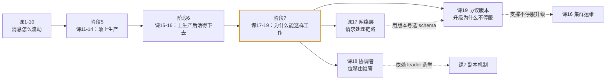

# 阶段 7：实现原理

> 2026-09-14 新增。补齐阶段 6 末尾「已知未覆盖」清单中登记的三项底层实现内容。
> ✅ **2026-09-14 交付**：三课均基于官方 4.3 原文 + 本机 3 节点集群实测。

## 阶段目标

前 6 个阶段解决的是「**怎么用 Kafka**」——怎么建模、怎么保证可靠、怎么上生产、怎么监控、怎么改。

本阶段解决的是「**它为什么能这样工作**」——把前面反复出现的机制，追到它们的实现依据。

一句话概括：**从「会用」走到「知道为什么」**。

## 为什么会有这个阶段

阶段 6 交付时登记了三项未覆盖内容，本阶段逐项处理：

| 原登记缺口 | 处置 | 说明 |
|-----------|------|------|
| 网络层实现（`implementation/network-layer`） | 新建**课 17** | 按原计划 |
| 分区分配机制（`implementation/distribution`） | ⚠️ **改题为课 18** | 见下方「主题偏差说明」 |
| 协议版本演进（`design/protocol`） | 新建**课 19** | 按原计划 |

### ⚠️ 主题偏差说明（课 18）

原计划课 18 讲「副本在 broker 间的分配算法」。**抓取官方 4.3 原文后发现该页面内容已变更**：

- `implementation/distribution` 页面现在的标题是 **Consumer Offset Tracking**，全文只讲消费者位移追踪（group coordinator、`__consumer_offsets`、`CoordinatorLoadInProgressException`），**已不包含副本分配算法**。
- 实际核查：全课程范围内检索 `rack|机架|副本分配|assignReplicasToBrokers` 共 9 处命中，其中副本分配相关内容已在**课 16**（机架感知章节）覆盖；官方页面无对应原文可供引用。

因此课 18 **改为讲解该官方页面的真实内容**——消费者位移与协调者。这个主题同样有实用价值：

- 课 6 只讲了「位移提交语义」（自动 vs 手动、丢 vs 重复），**没讲位移存在哪、由谁管**；
- `CoordinatorLoadInProgressException` 是真实运维中会遇到的报错（阶段开场场景），此前课程零覆盖。

> 若后续要补「副本分配算法」，需另找权威依据（如 Kafka 源码 `ReplicaAssignmentBuilder` 或 KIP 文档），不建议使用当前官方页面作为出处。

## 课程清单

| 课 | 主题 | 核心问题 | 官方出处 | 状态 |
|----|------|----------|---------|------|
| 课 17 | 网络层与请求处理模型 | 请求从网卡到落盘经过哪些环节 | `implementation/network-layer` | ✅ 已完成 |
| 课 18 | 消费者位移与协调者 | 进度存在哪、由谁保管 | `implementation/distribution` | ✅ 已完成 |
| 课 19 | 协议版本与兼容性 | 升级能不能不停服 | `design/protocol` | ✅ 已完成 |

## 与既有课程的关系



**本阶段是原理层，前 6 阶段不依赖它。** 学完前 16 课已具备完整的生产使用能力；本阶段回答的是「为什么这些操作是安全的」。

## 实验环境

沿用阶段 6 的 3 节点集群工程：

- [docker-compose.yml](../../assets/stage6-observability/docker-compose.yml)

```bash
cd /mnt/d/projects/learning/kafka/assets/stage6-observability
docker compose up -d
```

> ⚠️ **CLI 路径与环境变量**（本课阶段全部命令的前置条件）：
> 该镜像的 CLI 位于 `/opt/kafka/bin`，**不在默认 PATH**；容器注入的 `KAFKA_JMX_OPTS` 含 `-javaagent`，CLI 继承后会因端口被 broker 占用而启动失败。
> 因此所有 `docker exec` 命令必须写成：
> ```bash
> docker exec l15-kafka-1 bash -c 'export PATH=/opt/kafka/bin:$PATH; unset KAFKA_JMX_OPTS; <命令>'
> ```

## 关键实测数据

| 观测项 | 实测值 | 出处 |
|--------|-------|------|
| network processor 线程数 | **3**（编号 0/1/2） | 课 17，`num.network.threads` 默认值 |
| processor 空闲比（压测后） | **1.0**（队列 0 积压） | 课 17，证明网络层非瓶颈 |
| 压测吞吐 | 33955.9 records/sec（33.16 MB/sec） | 课 17 |
| `RequestHandlerAvgIdlePercent` | **1e11 量级、单调递增** | 课 17 ⚠️ 见下 |
| 协议 API 总数 | **183** 个（其中 UNSUPPORTED **33** 个） | 课 19 |
| `Fetch` 支持区间 / 实际使用 | `4 to 17` / **17** | 课 19 |
| `Metadata` 支持区间 / 实际使用 | `0 to 13` / **13** | 课 19 |
| `ApiVersions` 支持区间 / 实际使用 | `0 to 4` / **4** | 课 19 |
| `ConsumerGroupHeartbeat(68)` | `0 to 1`（支持） | 课 19 |
| `ShareGroupHeartbeat(76)` | **UNSUPPORTED** | 课 19 |
| 消费组 `coord-team` 协调者 | **broker 2** | 课 18 |
| `__consumer_offsets` | 50 分区、RF=3、compact | 课 18 |
| `__consumer_offsets` segment.bytes | **104857600**（默认 1GB） | 课 18 |
| 位移提交实测 | `CURRENT-OFFSET=500`（等于消费条数） | 课 18 |

### ⚠️ 重要实测发现：一个会让人配错告警的陷阱

`RequestHandlerAvgIdlePercent` 被大量教程推荐为「IO 线程是否够用」的告警指标（如 `< 0.3` 告警）。**本机实测它不是一个比率**：

```text
sample 1: 2.36489227576E11
sample 2: 2.42772197115E11
sample 3: 2.49134616829E11
sample 4: 2.55369948383E11
sample 5: 2.61778758301E11     ← 严格单调递增
```

其 exporter HELP 行显示 `attribute=Count`，且该 MBean 在本环境**只暴露 Count 一个属性**（无 Value）。对照组 `NetworkProcessorAvgIdlePercent` 稳定在 `0.9998~1.0`，才是真正的 0~1 比率。

**影响**：照抄教程配 `RequestHandlerAvgIdlePercent < 0.3` 告警，将**永远不触发**，且误以为 IO 线程健康。

**替代方案**：用 `kafka_network_requestchannel_requestqueuesize`（队列积压）+ `TotalTimeMs`（请求耗时）；网络线程用 `kafka_network_processor_idlepercent`。

> 📌 该发现已写入 [jmx-exporter 配置](../../assets/stage6-observability/jmx-exporter/kafka-broker.yml)的注释中，并保留了一条显式声明 `Processor IdlePercent` 取 Value 的规则。

**通用教训**：**任何指标写进告警规则前，先 curl 看实际值与 HELP 行的 `attribute=`**。值域与语义不符时先查证，不要照抄。

## 核心结论

- **网络层是标准 Reactor NIO**：1 acceptor + N processor（默认 3）+ M IO 线程（默认 8），请求队列解耦。**排查性能问题先看队列积压，而不是先调线程数。**
- **吞吐上不去未必是网络瓶颈**：实测 processor 空闲比 1.0、队列 0 积压，说明 33 MB/s 是单客户端压测上限而非集群上限。
- **零拷贝只在消费拉取路径生效**：靠 `TransferableRecords.writeTo` → `transferTo`，从 4 次拷贝（含 2 次 CPU）降到 2 次 DMA。
- **每个消费组有专属协调者 broker**，按 `hash(group.id) % 50` 决定归属分区，该分区 leader 即协调者；消费者通过 `FindCoordinator` 发现（可向任意 broker 发起）。
- **位移提交要求 `__consumer_offsets` 所有副本都收到**才返回成功，不是 leader 单独确认。
- **`CoordinatorLoadInProgressException` 是正常自愈过程**，非缺陷——协调者变更后新协调者加载缓存期间拒绝查询，客户端自动退避重试。
- **`__consumer_offsets` 的 `segment.bytes` 被特意调小到 100MB**（默认 1GB），为的是让压实更频繁。
- **Kafka 承诺双向兼容**：新客户端↔老 broker、老客户端↔新 broker 均可，因此**可先升一边、全程不停服**。
- **版本在建连时协商**，取双方交集最高版；`ApiVersions` 用最低版本 v0 发送且无需认证（KIP-35），**结果只对当前连接有效**。
- **演进有两条路**：结构性变更升版本号；可选稀疏字段用 Tagged Fields（不升版、未设置不占空间）。

## 官方文档入口

完整路由表见 [web-index/kafka/index.md](../../web-index/kafka/index.md)。本阶段涉及的分区：

- [design-implementation](../../web-index/kafka/topics/design-implementation.md)（课 17 网络层、课 19 协议）

## 已知未覆盖（本阶段完成后）

- **副本分配算法**：官方 4.3 的 `implementation/distribution` 页面已不含此内容（现为 Consumer Offset Tracking），无官方原文可依。若需补充，建议以源码或 KIP 为依据另立专题。
- **Kafka 源码级实现**：本阶段基于官方文档 + 黑盒实测，未深入源码（如 `SocketServer.scala`、`ReplicaAssignmentBuilder`）。如需源码专题，应另开课程。

> 到本课为止，官方 4.3 文档索引（`web-index/kafka/`）中「设计与实现」分区的主要内容已覆盖完毕。

## 导航

⬅️ **上一阶段**：[阶段 6：运维与可观测](../6-运维与可观测/overview.md)

📚 **返回目录**：[课程目录](../../02-课程目录.md)

## 📐 讲义规范升级（2026-09-14）

- **7 项要素已补齐**：课 17–19：三课均已补齐 7 项要素（原无「知识点：」标题，已按 3.x 小节结构适配衔接句） —— 一句话本质 / 处境对照 / 一眼全局图（SVG，零术语）/ 本课地图（表格）/ 🧭 知识点衔接句 / 读图指引 / 术语双轨·行话锚定
- **全局图落盘**：本阶段各课的「一眼全局图」SVG 存放于本阶段 ssets/，课内以 ../assets/ 引用，脚本核验引用可达、XML 合法且零术语
- **译名口径**：自拟译名一律括注「本文自拟译…非通用译名」，社区译名括注「社区常用译法、官方未定中文名」，官方不译的沿用英文原名；标注只在首次登场给一次
