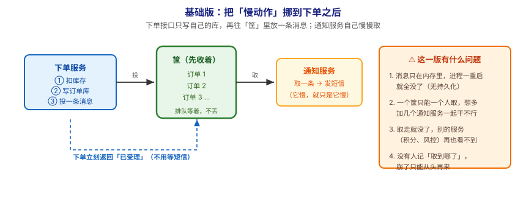
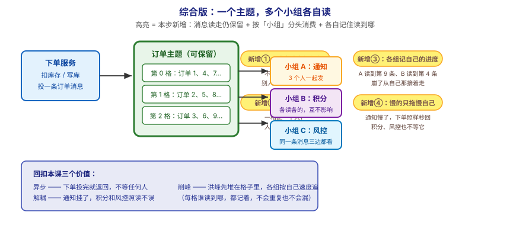

# 应用实战 · 为什么需要消息队列

> 对应课程：[第 1 课：为什么需要消息队列](../stages/1-为什么需要Kafka/lessons/lesson-01-为什么需要消息队列.md) ｜ 覆盖知识点：直接同步调用的痛点 / 消息队列是什么 / 削峰·异步·解耦
> 定位：**会用，不上生产**——课里学完，在这里动手（结构与边界见 SKILL.md「教学叙事骨架 · 应用实战」）。
> 免环境声明：本课还没装 Kafka（那是第 3 课），代码是**可运行的纯 Python 示例**，只用标准库模拟"筐"的行为，目的是让你**亲手摸到**同步与异步的差别。
> 📖 结论已按官方文档核对（核对于 2026-09 ｜ 来源：Apache Kafka 4.3 文档 · 本课为动机课，不引用具体配置项，无需版本锁定）

## 场景：下单之后那三件"不急但必须做"的事

**场景**：用户下单成功后，你要发短信、加积分、跑风控。这三件事**都不需要用户当场等结果**，但你现在的写法把它们全塞进了下单接口里——于是"发短信"一慢，整个下单就崩。本课的知识点，就是用来把这类"不急的事"从主链路里**挪出去**。

**全貌一句话**：真实方案还需要**消息不丢的保障**（副本与持久化，阶段 3）、**消费进度的记录**（消费组与位移，第 6 课）、**重复与丢失的处理**（交付语义，第 8 课）——本课不展开，这里只让你先看清"挪出去"这一步本身换来什么。

---

## ① 基础实现：把慢动作挪到下单之后



> 看图：左边下单服务做完自己该做的（扣库存、写库），再往中间那个绿色"筐"里投一条消息就返回；右边通知服务按自己节奏从筐里取。**这一版的核心变化是——下单不再等通知了**，返回路径（蓝色虚线）跳过了整个通知环节。

先看"改之前"是什么样。下面这段就是第一幕那条锁链：

```python
# sync_version.py —— 改之前：一条链干到底
import time


def send_sms(order_id):
    """模拟发短信：慢，且会拖死整条链"""
    time.sleep(0.5)          # 假设运营商接口抖动，每次要 0.5 秒
    return f"短信已发给订单 {order_id}"


def place_order_sync(order_id):
    """下单接口：所有事一口气干完才返回"""
    t0 = time.time()
    results = []
    results.append(f"库存已扣：{order_id}")
    results.append(f"订单已入库：{order_id}")
    results.append(send_sms(order_id))      # ⚠️ 卡在这里等 0.5 秒
    results.append(f"积分已加：{order_id}")
    return results, time.time() - t0


if __name__ == "__main__":
    # 模拟 5 个用户同时下单
    total = 0.0
    for i in range(1, 6):
        _, cost = place_order_sync(i)
        total += cost
        print(f"订单 {i}：用户等待 {cost:.2f} 秒")
    print(f"5 个用户累计等待 {total:.2f} 秒")
```

跑一下，你会看到类似输出：

```
订单 1：用户等待 0.50 秒
（…中略，5 单各 0.50 秒…）
5 个用户累计等待 2.51 秒
```

**每个用户都被"发短信"拖了 0.5 秒**——而短信跟"下单成功"压根没关系。

现在做第一步改造：下单只管把"该办的事"记进一个筐，立刻返回；通知服务自己慢慢取。

```python
# buffer_version.py —— 基础版：中间放一个筐
import queue
import threading
import time

task_box = queue.Queue()      # 这就是本课说的"先收着的筐"


def place_order_async(order_id):
    """下单接口：只做自己的事，把通知丢进筐就返回"""
    t0 = time.time()
    done = [f"库存已扣：{order_id}", f"订单已入库：{order_id}"]
    task_box.put({"type": "sms", "order_id": order_id})   # 投完就走
    return done, time.time() - t0


def sms_worker():
    """通知服务：按自己的节奏从筐里取，慢慢干"""
    while True:
        task = task_box.get()
        if task is None:                 # 收到"收工"信号就退出
            break
        time.sleep(0.5)                  # 它慢，但只拖慢它自己
        print(f"  [通知] 订单 {task['order_id']} 短信已发")
        task_box.task_done()


if __name__ == "__main__":
    worker = threading.Thread(target=sms_worker, daemon=True)
    worker.start()

    total = 0.0
    for i in range(1, 6):
        _, cost = place_order_async(i)
        total += cost
        print(f"订单 {i}：用户等待 {cost:.4f} 秒")     # 注意单位：毫秒级

    print(f"5 个用户累计等待 {total:.4f} 秒（下单全部秒回）")
    task_box.join()                       # 等筐里的活干完
    task_box.put(None)                    # 通知 worker 收工
    print("所有短信已发出，一条没丢")
```

输出大致是：

```
订单 1：用户等待 0.0000 秒
（…中略，5 单全部 0.0000 秒…）
5 个用户累计等待 0.0000 秒（下单全部秒回）
  [通知] 订单 1 短信已发
  （…中略…）
所有短信已发出，一条没丢
```

> ⚖️ **对比一下**：同步版 5 个用户累计等待 **2.51 秒**，缓冲版累计 **0.0000 秒**——慢动作还是那个慢动作，但它不再挡在用户面前了。

> ✅ **回扣第一幕**：同样是"发短信变慢"，同步版每个用户干等 0.5 秒，缓冲版用户**毫秒级返回**，短信一条没少发。这就是"把锁链拆成两段"的直接效果。

> ⚠️ **它的问题**：**这个筐是内存里的 `queue.Queue`，问题很大**——
> 1. **进程一重启，筐里的消息全没了**（内存队列，没落盘）；
> 2. **一条消息只归一个人**——你可以开 3 个 worker 一起取，但每条消息只会被其中**某一个**取走，另一个 worker 压根看不到它（想让两个人各干各的同一件事，做不到）；
> 3. **取走就没了**——积分服务、风控服务再也看不到这条订单消息，只能让下单服务再投一次；
> 4. **没人记"取到哪了"**——通知服务崩了重启，不知道哪几条发过，只能瞎猜。

---

## ② 综合实现：一个主题，多个小组各自读



> 看图：**比上一张多了四处高亮**——① 消息读走仍保留（不是取走就没，别人还能再读一遍）；② 分成好几格（一格配一个人，人多能一起扛）；③ 每个小组各自记自己的进度（A 读到第 9 条、B 读到第 4 条，崩了从自己那接着走）；④ 通知慢了只拖慢通知自己，下单、积分、风控都不等它。**核心差别：从"一个筐、取走就没"，变成"一份可保留的记录，多个小组各读各的、各记各的进度"。**

上面四个问题，正是 Kafka 这类"可保留、可分格、可按组记进度"的中转站要解决的。我们用一个模拟版本把这三个特性加进去：

```python
# topic_version.py —— 综合版：可保留 + 分格 + 各组记进度
import threading
import time

# ---- 用本课的话说：一个"可保留、分成好几格的订单记录本" ----
# ⚠️ 诚实声明：这里仍然用内存列表模拟"留着不删"这个**行为**，
#    进程重启照样会丢。真正的"重启不丢"要靠 Kafka 落盘 + 副本（阶段 3 才讲）。
PARTITIONS = 3                    # 分成 3 格（对应知识点：分格 = 后面要学的"分区"）
partitions = [[] for _ in range(PARTITIONS)]
lock = threading.Lock()


def produce(order_id):
    """下单服务：投一条消息，读走也保留（这里用列表模拟"留着不删"）"""
    slot = order_id % PARTITIONS           # 按订单号分格
    with lock:
        partitions[slot].append({"order_id": order_id})
    return f"订单 {order_id} 已记入第 {slot} 格"


# ---- 用本课的话说：每个"小组"各自记自己读到哪了 ----
progress = {}                     # {"通知组": {0: 3, 1: 2, 2: 1}, "积分组": {...}}
progress_lock = threading.Lock()


def consume(group_name, slot, worker_id, speed):
    """小组成员：从自己负责的那格里读，读完记下进度"""
    while True:
        with progress_lock:
            pos = progress.setdefault(group_name, {}).get(slot, 0)
        with lock:
            bucket = partitions[slot]
            if pos >= len(bucket):
                break
            msg = bucket[pos]               # 注意：读走但**不删**，别人还能读

        time.sleep(speed)                   # 各组的处理速度可以完全不同
        print(f"  [{group_name}-{worker_id}] 第 {slot} 格 → 处理订单 {msg['order_id']}")

        with progress_lock:
            progress[group_name][slot] = pos + 1     # 记下"我读到这了"

    print(f"  [{group_name}-{worker_id}] 第 {slot} 格：已读完")


def run_group(group_name, speed):
    """一个小组 = 每格配一个人，大家并着干"""
    threads = [
        threading.Thread(
            target=consume,
            args=(group_name, slot, f"w{slot}", speed),
        )
        for slot in range(PARTITIONS)
    ]
    for t in threads:
        t.start()
    for t in threads:
        t.join()


if __name__ == "__main__":
    # 1) 洪峰：一口气来 9 个订单（只打印前 3 条，避免刷屏）
    for i in range(1, 10):
        msg = produce(i)
        if i <= 3:
            print(msg)
    print(f"\n当前各格存量：{[len(p) for p in partitions]}\n")

    # 2) 三个小组同时开工，速度各不相同
    groups = [("通知组", 0.5), ("积分组", 0.2), ("风控组", 0.3)]
    threads = [
        threading.Thread(target=run_group, args=(name, spd))
        for name, spd in groups
    ]
    for t in threads:
        t.start()
    for t in threads:
        t.join()

    print(f"\n各小组最终进度：{progress}")
    print(f"消息仍在各格里（没被删）：{[len(p) for p in partitions]}")
```

输出会是三个小组**交错进行、各按各的速度**（通知慢不影响积分和风控）：

```
订单 1 已记入第 1 格
订单 2 已记入第 2 格
订单 3 已记入第 0 格

当前各格存量：[3, 3, 3]

  [积分组-w0] 第 0 格 → 处理订单 3
  [风控组-w1] 第 1 格 → 处理订单 1
  [积分组-w1] 第 1 格 → 处理订单 4
  [通知组-w2] 第 2 格 → 处理订单 2
  （…中略…）
各小组最终进度：{'通知组': {0: 3, 1: 3, 2: 3}, '积分组': {0: 3, 1: 3, 2: 3}, '风控组': {0: 3, 1: 3, 2: 3}}
消息仍在各格里（没被删）：[3, 3, 3]
```

> ✅ **本机实测**（WSL Ubuntu · Python 3，2026-09-16 跑通）：上面这段是真实输出，不是推测。你重点看两处——① 三个小组**交错输出**（积分最快先跑完，通知最慢拖到最后），但彼此不等待；② 最后一行"消息仍在各格里"，证明**读走不删**，这是"多个小组能各读各的"的前提。

**这段代码把基础版的四个问题逐个解决掉了**：

| 基础版的问题 | 综合版怎么解决 | 对应本课知识点 |
|---|---|---|
| 进程重启消息全没 | 消息**读走不删**，留在格子里（⚠️ 这里仍是内存模拟——真正的"重启不丢"要等第 7 课的副本机制） | 缓冲 + 保留（为阶段 3 的持久化做铺垫） |
| 一条消息只归一个人，别人看不到 | 每格配一个人（3 格 = 3 人并着干），且各组互不相干 | 削峰：人多就能一起扛 |
| 别的服务看不到 | 三个小组**各读各的**，同一条消息三边都能看 | 解耦：互不相识、互不影响 |
| 崩了不知读到哪 | `progress` 按组记录各自进度 | 为第 6 课"位移"埋伏笔 |

> 💡 **别急着记名词**：这里说的"格子"和"小组"，后面会有标准名字（分区 Partition / 消费者组 Consumer Group），第 4、6 课会正式讲。现在只要记住**这张图上的形状**——一份可保留的记录，多个小组各读各的、各记各的进度。

> ⏳ **数字来源说明**：上面代码里的 `0.5 / 0.2 / 0.3` 秒是为了让你肉眼看出"速度不同"而设的**演示值**，不是真实接口耗时。真实系统里各环节耗时不同，但"慢的那个只拖慢自己"这个结论不变。

> 🎯 **会用标志**：给你一条"用户下单后要做 3 件不急的事"的需求，你能说出为什么要把它从下单接口里挪出去、挪出去之后"谁慢谁自己慢"，并且能画出"一份记录、多个小组各读各的"这个形状。

## 🧭 导航

- ⬅️ 回到课程：[第 1 课：为什么需要消息队列](../stages/1-为什么需要Kafka/lessons/lesson-01-为什么需要消息队列.md)
- 📚 全部实战：[应用实战索引](INDEX.md)
- ➡️ 下一课实战：02 · Kafka 是什么与起源定位（未编写）
