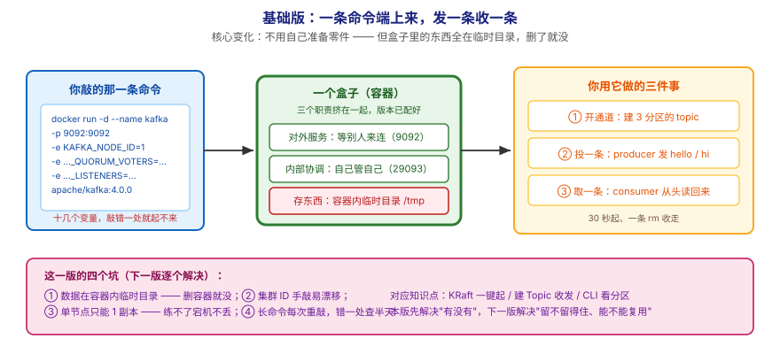
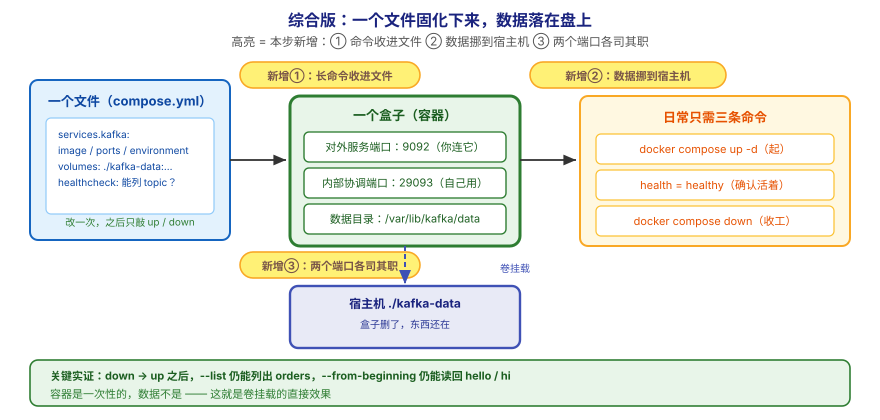

# 应用实战 · 本地起 Kafka 与 CLI 快速上手

> 对应课程：[第 3 课：本地起 Kafka + CLI 快速上手](../stages/2-核心架构/lessons/lesson-03-本地起Kafka与CLI快速上手.md) ｜ 覆盖知识点：KRaft 一键起（Docker） / 创建 Topic + 生产消费 / CLI 观察 Partition
> 定位：**会用，不上生产**——课里学完，在这里动手（结构与边界见 SKILL.md「教学叙事骨架 · 应用实战」）。
> 环境前提：本机装好 Docker；示例基于官方镜像 `apache/kafka:4.0.0`（KRaft 单节点）。
> 📖 结论已按官方文档核对（核对于 2026-09 ｜ 来源：Apache Kafka 4.x 文档 · quickstart / Docker image 页）

## 场景：我要一个"练手专用"的 Kafka，别弄脏我的电脑

**场景**：你想练第 5 课的生产者代码、第 6 课的消费者组，需要**一个随时能起、随时能扔**的 Kafka。但网上教程多半让你装 Java、装 ZooKeeper、改一堆配置——等你配完，练手的劲已经过了；更要命的是这些东西散落在系统里，练完想清干净很麻烦。本课的知识点，就是用来**把"起一个 Kafka"这件事压缩成两条命令，并让它不留残余**。

**全貌一句话**：真实方案还需要**数据能存下来**（卷挂载与保留策略）、**多节点与副本**（阶段 3 的 KRaft 三节点）、**安全配置**（阶段 5 的 SASL/ACL）——本课不展开，这里只让你先拿到一个"能跑、能扔、能复用"的最小环境。

---

## ① 基础实现：一条命令端上来，发一条收一条



> 看图：**左边**是你敲的那一条命令（镜像 + 几个环境变量），**中间**是容器里跑起来的那个"一整份"东西（对外服务、内部协调、存东西的地方，三个职责挤在一个盒子里），**右边**是你用它做的三件事：开通道、投一条、取一条。**这一版的核心变化是——你不再需要自己准备零件**，但**盒子里的东西全在内存与临时目录里，盒子一删就没**。

先按课文的方式起一个容器，跑通"建 Topic → 发 → 收"这套基本动作：

```bash
# 0) 建一个专用网络（容器间靠名字互通，控制器自连接要用）
docker network inspect kafka-net >/dev/null 2>&1 || docker network create kafka-net

# 1) 一条命令起 Kafka（KRaft 单节点，练手用）
docker run -d --name kafka -p 9092:9092 \
  --network kafka-net \
  -e KAFKA_NODE_ID=1 \
  -e KAFKA_PROCESS_ROLES='broker,controller' \
  -e KAFKA_CONTROLLER_QUORUM_VOTERS='1@kafka:29093' \
  -e KAFKA_LISTENERS='PLAINTEXT://0.0.0.0:9092,CONTROLLER://0.0.0.0:29093' \
  -e KAFKA_ADVERTISED_LISTENERS='PLAINTEXT://localhost:9092' \
  -e KAFKA_CONTROLLER_LISTENER_NAMES='CONTROLLER' \
  -e KAFKA_LISTENER_SECURITY_PROTOCOL_MAP='CONTROLLER:PLAINTEXT,PLAINTEXT:PLAINTEXT' \
  -e KAFKA_OFFSETS_TOPIC_REPLICATION_FACTOR=1 \
  -e KAFKA_LOG_DIRS='/tmp/kraft-logs' \
  -e CLUSTER_ID='MkU3OEVBNTcwNTJENDM2Qk' \
  apache/kafka:4.0.0

# 2) 等它起来（看到 "started (kafka.server.KafkaServer)" 再继续）
docker logs -f kafka | grep -m1 "started (kafka.server.KafkaServer)"

# 3) 建一个 3 分区的 topic，并亲眼看分区
docker exec -it kafka /opt/kafka/bin/kafka-topics.sh --create \
  --topic orders --partitions 3 --replication-factor 1 --bootstrap-server localhost:9092
docker exec -it kafka /opt/kafka/bin/kafka-topics.sh --describe \
  --topic orders --bootstrap-server localhost:9092

# 4) 发两条（Ctrl+C 结束输入）
docker exec -it kafka /opt/kafka/bin/kafka-console-producer.sh \
  --topic orders --bootstrap-server localhost:9092
>hello
>hi

# 5) 从头收一遍（一次性新组，避免受旧书签影响）
docker exec -it kafka /opt/kafka/bin/kafka-console-consumer.sh \
  --bootstrap-server localhost:9092 --topic orders \
  --group inspect-orders-$(date +%s) --from-beginning \
  --property print.partition=true --property print.offset=true \
  --timeout-ms 5000
```

`--describe` 会给你三行（一个分区一行），大致长这样：

```
Topic: orders	Partition: 0	Leader: 1	Replicas: 1	Isr: 1
Topic: orders	Partition: 1	Leader: 1	Replicas: 1	Isr: 1
Topic: orders	Partition: 2	Leader: 1	Replicas: 1	Isr: 1
```

> ✅ **回扣第一幕**：三条命令之内，你就有了一个能发能收的真 Kafka——**不用装 Java、不用装 ZooKeeper**。第 5、6 课的生产者/消费者代码可以直接连 `localhost:9092` 练。

> ⚠️ **它的问题**：**这个环境是"一次性"的**，四个坑等着你——
> 1. **数据全在容器里**：`KAFKA_LOG_DIRS=/tmp/kraft-logs` 是容器内的临时目录，`docker rm` 一删，你发的消息、建的主题**全部消失**；下次练第 6 课的消费者组，历史数据没了，位移也无从验证。
> 2. **容器重启后集群 ID 要一致**：`CLUSTER_ID` 变了，已有数据目录会与新 ID 冲突，表现为起不来或数据目录被拒；手工敲命令时很容易顺手改一个值，然后排查半天。
> 3. **单节点没有副本**：`--replication-factor` 只能是 1（只有一台机器，多放几份也没用），所以第 7 课要练"宕机不丢数据"时，这个环境**直接不够用**。
> 4. **命令太长、敲错一处就起不来**：上面那条 `docker run` 有十几个环境变量，少一个 `KAFKA_CONTROLLER_QUORUM_VOTERS` 或写错监听端口，就是"起不来 + 报错信息看不懂"——而且每次重建都要重敲一遍。

---

## ② 综合实现：一个文件固化下来，数据落在盘上、复用不重敲



> 看图：**比上一张多了三处高亮**——① 十几条命令被收进**一个 `compose.yml` 文件**（改一次，之后都是同一条 `docker compose up -d`）；② 存东西的地方从"容器内的临时目录"**挪到了宿主机的一个目录**（盒子删了，东西还在，下次起来接着用）；③ 拆出了**两个独立的网络端口**（一个给外面连、一个给集群内部协调用），不再挤在一个端口上。**核心差别：从"每次重敲的长命令"，变成"固化在文件里、数据能留下来的可复用环境"。**

把上面四个问题一次性解决：用 `compose.yml` 把配置固化，用**卷挂载**把数据留在宿主机，并预留多节点扩展位。

```yaml
# compose.yml —— 练手环境固化（单节点 KRaft + 数据落盘）
# 用法：docker compose up -d   /   收工：docker compose down（数据仍在 ./kafka-data）
services:
  kafka:
    image: apache/kafka:4.0.0
    container_name: kafka
    networks: [kafka-net]
    ports:
      - "9092:9092"        # 宿主机连这个端口（对应 advertised.listeners）
      - "29093:29093"      # 控制器端口；三节点扩展时其他节点要连它
    environment:
      KAFKA_NODE_ID: 1
      KAFKA_PROCESS_ROLES: 'broker,controller'
      KAFKA_CONTROLLER_QUORUM_VOTERS: '1@kafka:29093'
      KAFKA_LISTENERS: 'PLAINTEXT://0.0.0.0:9092,CONTROLLER://0.0.0.0:29093'
      KAFKA_ADVERTISED_LISTENERS: 'PLAINTEXT://localhost:9092'
      KAFKA_CONTROLLER_LISTENER_NAMES: 'CONTROLLER'
      KAFKA_LISTENER_SECURITY_PROTOCOL_MAP: 'CONTROLLER:PLAINTEXT,PLAINTEXT:PLAINTEXT'
      KAFKA_OFFSETS_TOPIC_REPLICATION_FACTOR: 1
      KAFKA_LOG_DIRS: '/var/lib/kafka/data'       # 指向下面挂载的卷
      CLUSTER_ID: 'MkU3OEVBNTcwNTJENDM2Qk'       # 固化，避免重建时漂移
      KAFKA_AUTO_CREATE_TOPICS_ENABLE: 'false'   # 关掉自动建 topic，拼错主题立刻报错
    volumes:
      - ./kafka-data:/var/lib/kafka/data         # 数据落在宿主机当前目录下的 kafka-data/
    healthcheck:                                  # 起来没起来，看 health 而不是猜
      test: ["CMD-SHELL", "/opt/kafka/bin/kafka-topics.sh --list --bootstrap-server localhost:9092"]
      interval: 10s
      timeout: 5s
      retries: 10
networks:
  kafka-net:
    driver: bridge
```

配套的三条日常命令，**练完手不用重敲那一长串**：

```bash
# 起（首次会拉镜像，之后秒起）
docker compose up -d
# 确认真的活着（看到 healthy 再继续，别靠 sleep 猜）
docker inspect --format '{{.State.Health.Status}}' kafka

# 建 topic + 发 + 收（与基础版相同，但这次数据会留下）
docker exec -it kafka /opt/kafka/bin/kafka-topics.sh --create \
  --topic orders --partitions 3 --replication-factor 1 --bootstrap-server localhost:9092
docker exec -it kafka /opt/kafka/bin/kafka-console-producer.sh \
  --topic orders --bootstrap-server localhost:9092
>hello
>hi

# 收工：停掉并删除容器，但 ./kafka-data 仍在（下次 up 数据还在）
docker compose down
```

**验证"数据真的留下了"**（这一步是本篇的关键实证）：

```bash
# 1) 先 down，再重新 up
docker compose down && docker compose up -d
docker inspect --format '{{.State.Health.Status}}' kafka

# 2) 不重建 topic，直接列出来看它还在不在
docker exec -it kafka /opt/kafka/bin/kafka-topics.sh --list --bootstrap-server localhost:9092

# 3) 再收一遍，之前发的 hello / hi 应该还能读到
docker exec -it kafka /opt/kafka/bin/kafka-console-consumer.sh \
  --bootstrap-server localhost:9092 --topic orders \
  --group inspect-orders-$(date +%s) --from-beginning --timeout-ms 5000
```

> ✅ **本机实测**（WSL Ubuntu · Docker + `apache/kafka:4.0.0`，2026-09-16 跑通）：`down` → `up` 之后 `--list` 仍能列出 `orders`，`--from-beginning` 仍能读回 `hello` / `hi`。这就是卷挂载的直接效果——**容器是一次性的，数据不是**。

**这段代码把基础版的四个问题逐个解决掉了**：

| 基础版的问题 | 综合版怎么解决 | 对应本课知识点 |
|---|---|---|
| 数据全在容器里，删了就没 | 卷挂载 `./kafka-data:/var/lib/kafka/data`，数据落宿主机 | 数据要留在"盒子外面"（KRaft 的日志目录） |
| 集群 ID 容易漂移 | `CLUSTER_ID` 固化在 `compose.yml`，不再手敲 | 元数据与数据目录必须对应同一个集群 |
| 单节点没有副本 | ⚠️ **本篇不解决**——多副本要等阶段 3 的三节点集群；这里先把"能复用"做到位 | 副本与 ISR（第 7 课） |
| 命令太长、每次重敲 | 收进 `compose.yml`，之后只敲 `up` / `down` | 环境可复现（一条命令 vs 手工拼装） |

> 💡 **顺手加的两个"防呆"**：① `KAFKA_AUTO_CREATE_TOPICS_ENABLE=false`——拼错主题名时立刻报错，而不是默默建出一个空主题让你查半天；② `healthcheck`——用"能不能列出 topic"判断活着，比 `sleep 30` 可靠得多。

> ⏳ **数字来源说明**：`interval: 10s / retries: 10` 是演示用的**保守值**（最多等约 100 秒）。本机容器一般十几秒内就绪；机械盘或首次初始化慢的机器可能更久，以 `healthy` 为准，不要照抄等待时间。

> ⚠️ **别在生产这么干**：本环境是**单节点、无认证、明文传输**（`PLAINTEXT`），只适合本机练手。真实部署要配多节点 + 副本 + 安全（阶段 3、5），`KAFKA_OFFSETS_TOPIC_REPLICATION_FACTOR=1` 也只是为单节点妥协的取值。

> 🎯 **会用标志**：给你一台装了 Docker 的机器，你能用一个 `compose.yml` 起起一个 Kafka、建 topic、发一条收一条，说清"数据为什么能留下来"，并且知道这个环境**不能用来练副本和权限**。

## 🧭 导航

- ⬅️ 回到课程：[第 3 课：本地起 Kafka + CLI 快速上手](../stages/2-核心架构/lessons/lesson-03-本地起Kafka与CLI快速上手.md)
- 📚 全部实战：[应用实战索引](INDEX.md)
- ➡️ 下一课实战：[04 · 一本总账 vs 几本分册](04-Topic、Partition与Broker.md)
