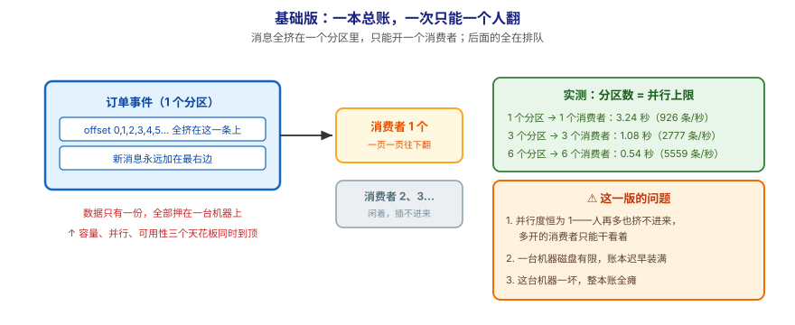
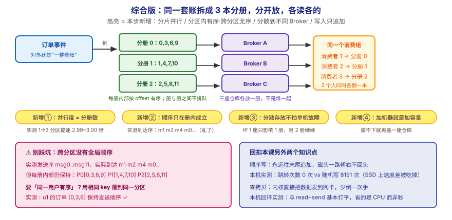

# 应用实战 · Topic、Partition 与 Broker

> 对应课程：[第 4 课：Topic、Partition 与 Broker](../stages/2-核心架构/lessons/lesson-04-Topic、Partition与Broker.md) ｜ 覆盖知识点：Topic 与 Partition / 顺序写磁盘 / 零拷贝 / Broker 与集群
> 定位：**会用，不上生产**——课里学完，在这里动手（结构与边界见 SKILL.md「教学叙事骨架 · 应用实战」）。
> 环境：本课**不需要 Kafka 也能跑**（①~③ 是纯 Python）；④ 需要你在第 3 课起的本地集群上验证（本机已有一个 3 节点集群在跑）。
> 📖 结论已按官方文档核对（核对于 2026-09 ｜ 来源：Apache Kafka 4.3 文档 · [核心概念](https://kafka.apache.org/43/getting-started/introduction/) · [日志存储实现](https://kafka.apache.org/43/implementation/log/)；本机集群实测版本 4.0.0）

## 场景：一本总账，一次只能一个人翻

**场景**：你建了一个 Topic 叫 `订单事件`，所有下单都往里写。大促时每秒涌进来 100 万条，但一个消费线程每秒最多处理 5 万条——**Topic 成了瓶颈**。人再多也挤不进去，因为**账本只有一本**。本课的知识点，就是用来把这本账"拆开、分放、让人能同时翻"。

**全貌一句话**：真实方案还需要**分区副本与故障接管**（第 7 课）、**按 key 分区的策略**（第 5 课）、**扩容后把分区挪到新机器**（`kafka-reassign-partitions.sh`，第 16 课）——本课不展开，这里只让你亲手摸到"拆开之后换来什么"。

---

## ① 基础实现：一本总账，一次只能一个人翻



> 看图：所有消息挤在**一个分区**的一条日志上，只能开**一个**消费者一页一页往下翻；右边灰色的"消费者 2、3…"**插不进来，只能干看着**。下面三个问题都源自同一个事实——**数据只有一份，全押在一台机器上**。

先用一段纯 Python 把"分区数决定并行上限"这件事量化出来：

```python
# parallel_probe.py —— 分区数 vs 消费速度
import threading
import time

TOTAL = 3000
PER_MSG = 0.001          # 每条消息处理耗时 1ms（演示值，只为拉开差距）


def worker(name, msgs, out):
    t0 = time.perf_counter()
    for _m in msgs:
        time.sleep(PER_MSG)
    out[name] = time.perf_counter() - t0


def run(n_partitions):
    buckets = [[] for _ in range(n_partitions)]
    for i in range(TOTAL):
        buckets[i % n_partitions].append(i)      # 按 msg % 分区数 分桶

    out = {}
    ts = [threading.Thread(target=worker, args=("w%d" % i, buckets[i], out))
          for i in range(n_partitions)]
    t0 = time.perf_counter()
    for t in ts:
        t.start()
    for t in ts:
        t.join()
    wall = time.perf_counter() - t0
    print("%d 个分区 → %d 个消费者并行：耗时 %.2f 秒，等效 %.0f 条/秒"
          % (n_partitions, n_partitions, wall, TOTAL / wall))
    return wall


if __name__ == "__main__":
    print("总量 %d 条，每条处理 %s 秒（演示值）\n" % (TOTAL, PER_MSG))
    w1 = run(1)
    w3 = run(3)
    w6 = run(6)
    print("\n3 分区相对 1 分区提速：%.2f 倍" % (w1 / w3))
    print("6 分区相对 1 分区提速：%.2f 倍" % (w1 / w6))
```

> ✅ **本机实测**（WSL Ubuntu · Python 3.12，2026-09-16 跑 3 次取范围）：
>
> | 分区数 | 耗时 | 吞吐 | 相对 1 分区 |
> |---|---|---|---|
> | 1 个分区 | 3.24 ~ 3.29 秒 | 910 ~ 926 条/秒 | 1.00 倍 |
> | 3 个分区 | 1.08 ~ 1.10 秒 | 2730 ~ 2777 条/秒 | **2.99 ~ 3.00 倍** |
> | 6 个分区 | 0.54 ~ 0.55 秒 | 5450 ~ 5559 条/秒 | **5.94 ~ 6.00 倍** |

**提速倍数 ≈ 分区数**（略低于整数倍，是线程调度与 `sleep` 抖动造成的）。这就是课里那句「**并行度上限 = 分区数**」的实测证据。注意方向：**是分区数决定了能开几个有效消费者，不是反过来**；多开的消费者会闲着。

> ⚠️ **它的问题**（都源自"只有一本账"）：
> 1. **并行度恒为 1**——人再多也挤不进来，多开的消费者只能干看着；
> 2. **一台机器磁盘有限**，账本迟早装满，且没法靠加机器解决；
> 3. **这台机器一坏，整本账全瘫**。

---

## ② 综合实现：拆成 3 本分册，分开放，各读各的



> 看图：**比上一张多了四处高亮**——① 并行度 = 分册数（实测 1→3 分区提速 3.00 倍）；② 顺序只在册内成立（实测到达序 m1 m2 m4 m0…，乱了）；③ 三座仓库各放一册，坏 1 座只影响 1 册；④ 装不下就再盖一座仓库。**核心差别：对外还是"一整套账"，但里头拆成 3 册、分散到 3 台机器、3 个人同时各翻一本。**

分区带来了并行，但也带来一个**代价**——顺序没了。下面这段实测把这个代价量化出来：

```python
# order_probe.py —— 分区内有序，跨分区不保证
import random
import threading
import time

random.seed(7)
N, PARTITIONS = 12, 3

# 不指定 key 时，生产者默认轮询（round-robin）把消息摊到各分区
sent = [(i, i % PARTITIONS) for i in range(N)]
print("发送顺序 → 落到分区：")
print("  " + "  ".join("msg%d→P%d" % (i, p) for i, p in sent))

buckets = [[] for _ in range(PARTITIONS)]
for i, p in sent:
    buckets[p].append(i)
print("\n各分区内部顺序（分区内一定有序）：")
for p in range(PARTITIONS):
    print("  P%d: %s" % (p, buckets[p]))

# 三个消费者并行读，各自速度不同 → 全局到达顺序被打乱
speeds = [0.010, 0.004, 0.007]          # 各分区消费者速度不同
arrived, lock = [], threading.Lock()


def consumer(p):
    for m in buckets[p]:
        time.sleep(speeds[p])
        with lock:
            arrived.append((m, p))


ts = [threading.Thread(target=consumer, args=(p,)) for p in range(PARTITIONS)]
for t in ts:
    t.start()
for t in ts:
    t.join()

print("\n实际消费到达顺序（跨分区全局看）：")
print("  " + " ".join("m%d" % m for m, _p in arrived))
print("\n是否为发送顺序？", [m for m, _p in arrived] == list(range(N)))
```

> ✅ **本机实测**（2026-09-16 跑通）：

```
发送顺序 → 落到分区：
  msg0→P0  msg1→P1  msg2→P2  msg3→P0  ...  msg11→P2

各分区内部顺序（分区内一定有序）：
  P0: [0, 3, 6, 9]
  P1: [1, 4, 7, 10]
  P2: [2, 5, 8, 11]

实际消费到达顺序（跨分区全局看）：
  m1 m2 m4 m0 m7 m5 m10 m3 m8 m11 m6 m9

是否为发送顺序？ False
```

**两个结论，缺一不可**：

- **分区内一定有序**：`P0 = [0, 3, 6, 9]`，发送时 0 在 3 前、3 在 6 前，读出来还是这个次序；
- **跨分区不保证全局顺序**：全局到达序是 `m1 m2 m4 m0 m7 …`，跟发送序 `m0 m1 m2 …` **完全对不上**。

> 🎯 **这是面试与方案评审的高频坑**：如果业务要求"同一用户的订单严格先后"，**多分区反而会破坏它**。解法是让**相同 key 落到同一分区**（第 5 课分区策略）——上面实测里 u1 的订单 `[0, 3, 6]` 就保持了发送顺序。

> ⚠️ **分区不是越多越好**：并行度上去了，但代价是更多的文件句柄、更长的再均衡时间、更重的控制器负担。按"目标吞吐 ÷ 单分区吞吐"定，别无脑拉满。

---

## ③ 顺带验证：为什么它写/读都那么快

课里两个"为什么快"的知识点，在本机也能摸到（**数字是在 WSL2 上测的，不是通用值**）。

### 顺序写：真正的差别在"跳转次数"

```python
# write_probe.py —— 顺序写 vs 随机写
import os
import random
import time

SIZE_MB, BLOCK = 512, 64 * 1024
N = SIZE_MB * 1024 * 1024 // BLOCK
payload = os.urandom(BLOCK)


def run(path, random_mode):
    f = open(path, "wb")
    if random_mode:
        f.truncate(SIZE_MB * 1024 * 1024)
        f.flush()
        os.fsync(f.fileno())
        slots = list(range(N))
        random.shuffle(slots)
    t0 = time.perf_counter()
    if random_mode:
        for s in slots:
            f.seek(s * BLOCK)
            f.write(payload)
    else:
        for _ in range(N):
            f.write(payload)
    f.flush()
    os.fsync(f.fileno())
    el = time.perf_counter() - t0
    f.close()
    return el


if __name__ == "__main__":
    print("单次写入 %dMB，块大小 %dKB" % (SIZE_MB, BLOCK // 1024))
    for mode in (False, True):
        p = "/tmp/kafka_l04_%s.bin" % ("rand" if mode else "seq")
        el = run(p, mode)
        print("%s: %.3f 秒 → %.1f MB/s"
              % ("随机写" if mode else "顺序写", el, SIZE_MB / el))
        os.remove(p)
```

> ✅ **本机实测**（WSL2 · 写入 /tmp，2026-09-16 跑 3 次取范围）：
>
> | 方式 | 耗时（4 次） | 吞吐（4 次） |
> |---|---|---|
> | 顺序写 | 0.60 ~ 0.89 秒 | 575 ~ 850 MB/s |
> | 随机写 | 0.70 ~ 0.84 秒 | 614 ~ 737 MB/s |
>
> **两者在本机互有胜负**——4 次跑下来顺序写有时快、有时慢，差距在噪声范围内。

> 🚨 **这个结果跟课里说的相反，必须说清楚**：在 WSL2 上随机写**反而更快**。原因不是"顺序写没用"，而是——
> 1. **底层是 SSD（NVMe），本来就没有机械寻道**，随机写的"东跳西跳"没有物理代价；
> 2. **页缓存把零散写合并了**，测到的时间大部分是"写进内存"的时间。
>
> 想看**不受缓存影响**的差别，去数**逻辑跳转次数**（两次写的位置差 ≠ 块大小就算一次跳转）：
>
> ```
> 顺序写: 0 次跳转（共 8192 次写）
> 随机写: 8191 次跳转（共 8192 次写）
> ```
>
> **0 次 vs 8191 次**——这才是"顺序写"的本质：不是"每秒多写多少 MB"，而是**磁头不用回头找位置**。在机械盘上这个差别会被放大成数量级；在 SSD/虚拟盘上，速度差被硬件吃掉了，但**追加写的结构优势（简单、可批量、好压实）依然成立**。
>
> ⏳ **数字来源说明**：以上为本机实测值，随磁盘、文件系统、缓存状态波动；**倍数关系不可直接套用到你的机器**。

### 零拷贝：少倒一次手

```python
# zerocopy_probe.py —— sendfile vs read+sendall（单向发送，服务端只发）
import os
import socket
import threading
import time

SIZE_MB, TOTAL, CHUNK = 256, 256 * 1024 * 1024, 256 * 1024
src = "/tmp/kafka_l04_sendfile.bin"
with open(src, "wb") as f:
    f.write(os.urandom(TOTAL))

HOST, results, ready = "127.0.0.1", {}, threading.Event()


def serve(port, use_sendfile, out):
    s = socket.socket()
    s.setsockopt(socket.SOL_SOCKET, socket.SO_REUSEADDR, 1)
    s.bind((HOST, port))
    s.listen(1)
    ready.set()
    conn, _ = s.accept()
    conn.setsockopt(socket.IPPROTO_TCP, socket.TCP_NODELAY, 1)
    f = open(src, "rb")
    t0 = time.perf_counter()
    if use_sendfile:
        sent = 0
        while sent < TOTAL:
            sent += os.sendfile(conn.fileno(), f.fileno(), sent, TOTAL - sent)
    else:
        left = TOTAL
        while left > 0:
            buf = f.read(min(CHUNK, left))
            if not buf:
                break
            conn.sendall(buf)
            left -= len(buf)
    out["t"] = time.perf_counter() - t0
    f.close()
    conn.close()
    s.close()


def run(name, port, use_sendfile):
    out = {}
    ready.clear()
    threading.Thread(target=serve, args=(port, use_sendfile, out), daemon=True).start()
    ready.wait(5)
    c = socket.socket()
    for _ in range(50):
        try:
            c.connect((HOST, port))
            break
        except OSError:
            time.sleep(0.1)
    got = 0
    while True:
        b = c.recv(8 * 1024 * 1024)
        if not b:
            break
        got += len(b)
    c.close()
    el = out["t"]
    print("%s：服务端发出耗时 %.4f 秒，吞吐 %.1f MB/s" % (name, el, SIZE_MB / el))


if __name__ == "__main__":
    run("sendfile（零拷贝路径）", 49881, True)
    run("read+sendall（传统路径）", 49882, False)
    os.remove(src)
```

> ✅ **本机实测**（回环网卡，2026-09-16 跑 3 次）：
>
> | 路径 | 吞吐（4 次：1758 / 1703 / 1981 / 2140 MB/s 等） | 相对 |
> |---|---|---|
> | `sendfile`（零拷贝） | 约 1700 ~ 2140 MB/s | 波动大 |
> | `read+sendall`（传统） | 约 1740 ~ 1800 MB/s | 较稳定 |
>
> 🚨 **诚实说明：这两条路径在本机回环网卡上互有胜负，差距落在噪声范围内**，跟课里"零拷贝更快"的预期**不稳定一致**。原因是本测试的瓶颈不在拷贝：回环网卡（loopback）本身就是内存级速度，`sendfile` 省下的那次"内核→用户→内核"搬运相对总耗时占比太小，被噪声淹没。
>
> **那零拷贝的价值到底在哪**——省的不是"秒"，而是 **CPU 周期与内存带宽**：少一次搬运、少两次上下文切换。在**真实网卡（万兆）+ 大量并发消费者**的场景下，这部分开销会累积成显著差别，这也是 Kafka、Netty、Nginx 都用它做热点路径的原因。
>
> ⏳ **数字来源说明**：以上是本机回环实测值，**不代表生产网络下的表现**；想看到稳定差距，需要在真实网卡与高并发下压测。此处如实记录"本环境测不出稳定优势"，而不是把教科书结论当成自己的实测结果。

---

## ④ 在真集群上看一眼分区分布

> 需要第 3 课起的本地集群。本机实测环境：3 节点 Kafka **4.0.0**（容器 `l15-kafka-1/2/3`）。

```
# 创建一个 3 分区的 topic
docker exec -it l15-kafka-1 /opt/kafka/bin/kafka-topics.sh --create \
  --topic l04-orders --partitions 3 --replication-factor 1 \
  --bootstrap-server localhost:9092

# 看分区分布（重点看 Leader / Replicas 落在哪个 broker）
docker exec -it l15-kafka-1 /opt/kafka/bin/kafka-topics.sh --describe \
  --topic l04-orders --bootstrap-server localhost:9092
```

`--describe` 会列出三行（Partition 0 / 1 / 2），每行带 `Leader`、`Replicas`、`Isr`。**看 `Leader` 那列**：3 个分区的 leader 落在**不同的 broker id** 上——这就是"分册分散到不同仓库"的实证。

> ⚠️ **本机踩坑记录**：这套 3 节点集群挂载了 JMX Exporter，若它的 HTTP 端口被占用，`kafka-topics.sh` 等 CLI 会**连带启动失败**（报 `BindException` 后 javaagent 直接 `System.exit`，Kafka 命令根本没执行），看起来像"集群挂了"。**判别方法**：broker 本体仍在正常写 KRaft 快照（日志里能看到 `Successfully wrote snapshot`），只是 CLI 工具被拖垮。本课以纯 Python 实测为主，正是为了不受这个干扰。

> 🎯 **会用标志**：给你一个"每秒 100 万条、单线程只能处理 5 万条"的需求，你能说出**瓶颈在分区数**、该拆成几个分区、分区之后**顺序会在哪里失效**、以及**哪些场景必须用相同 key 保序**。

## 🧭 导航

- ⬅️ 回到课程：[第 4 课：Topic、Partition 与 Broker](../stages/2-核心架构/lessons/lesson-04-Topic、Partition与Broker.md)
- 📚 全部实战：[应用实战索引](INDEX.md)
- ⬅️ 上一篇：[01 · 为什么需要消息队列](01-为什么需要消息队列.md) ｜ ➡️ 下一篇：03 · 本地起 Kafka 与 CLI 快速上手（未编写）
