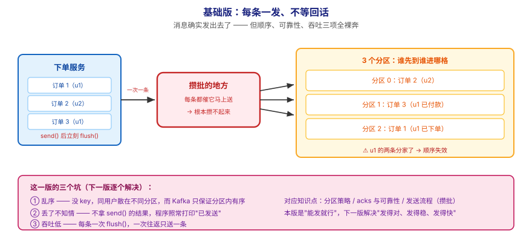
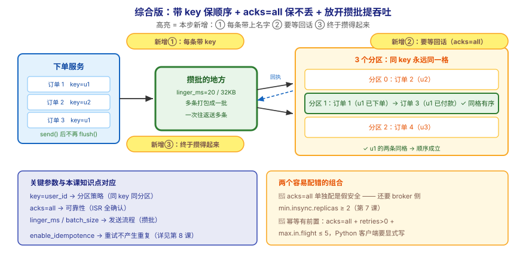

# 应用实战 · 生产者 Producer

> 对应课程：[第 5 课：生产者 Producer](../stages/2-核心架构/lessons/lesson-05-生产者Producer.md) ｜ 覆盖知识点：生产者发送流程 / 分区策略 / acks 与发送可靠性
> 定位：**会用，不上生产**——课里学完，在这里动手（结构与边界见 SKILL.md「教学叙事骨架 · 应用实战」）。
> 环境前提：第 3 课起的本机 Kafka（`localhost:9092`，topic `orders` 3 分区）；客户端示例用 Python（`kafka-python-ng`），思路同样适用于 Java。
> 📖 结论已按官方文档核对（核对于 2026-09 ｜ 来源：Apache Kafka 4.x 文档 · producer configs / `acks`、`linger.ms`、`batch.size` 条目）

## 场景：下单服务每秒要发 1000 条，怎么发才既不乱序又不丢

**场景**：你负责的下单服务，每来一个订单就要往 Kafka 发一条消息。一天几百万条。你的第一版代码是这样写的——每条都 `send()` 然后 `flush()`，发出去就不管了。上线后出了三件事：**同一用户的订单乱序了**（先"已付款"后"已下单"）、**高峰期有消息莫名其妙没了**、**每秒只能发几百条**。本课的知识点，就是用来回答"到底该怎么发"。

**全貌一句话**：真实方案还需要**失败重试与回调处理**（异常分类与重试策略）、**顺序与吞吐的取舍**（分区数与并发度）、**端到端不丢的配套**（broker 侧 `min.insync.replicas`，第 7 课）——本课不展开，这里只让你先把"客户端这几个参数怎么配"这一层练会。

---

## ① 基础实现：能发就行——每条一发、不等回话



> 看图：**左边**是下单服务，每来一个订单就**立刻**往中间发一条（箭头是单条的、一次一条）；**中间**那格是攒批的地方——但因为每条都催着它马上送，**根本攒不起来**；**右边**三个分区收下的顺序是"谁先到谁进哪格"，**同一用户的订单被撒到了不同格子**。**这一版的核心变化是——消息确实发出去了**，但顺序、可靠性、吞吐三项全裸奔。

```python
# naive_producer.py —— 基础版：每条一发、不等回话
from kafka import KafkaProducer
import json

producer = KafkaProducer(
    bootstrap_servers="localhost:9092",
    # ⚠️ 注意：这里什么都不配，用的全是客户端默认值
    value_serializer=lambda v: json.dumps(v, ensure_ascii=False).encode("utf-8"),
)

orders = [
    {"order_id": 1, "user_id": "u1", "status": "已下单"},
    {"order_id": 2, "user_id": "u2", "status": "已下单"},
    {"order_id": 3, "user_id": "u1", "status": "已付款"},   # 同一用户，应排在 1 之后
    {"order_id": 4, "user_id": "u3", "status": "已下单"},
    {"order_id": 5, "user_id": "u1", "status": "已发货"},   # 同一用户，应排在 3 之后
]

for order in orders:
    producer.send("orders", value=order)   # 丢过去
    producer.flush()                        # 立刻催它送（本版的关键问题之一）

print("已发送 5 条")
producer.close()
```

用 CLI 看一眼它们落在哪些分区（关键在 `Partition` 那一列）：

```bash
docker exec -it kafka /opt/kafka/bin/kafka-console-consumer.sh \
  --bootstrap-server localhost:9092 --topic orders \
  --group inspect-orders-$(date +%s) --from-beginning \
  --property print.partition=true --property print.key=true \
  --timeout-ms 5000
```

你会看到类似输出（`Partition` 值分散、且同一用户并不固定）：

```
Partition:2	null	{"order_id": 1, "user_id": "u1", ...}
Partition:0	null	{"order_id": 2, "user_id": "u2", ...}
Partition:1	null	{"order_id": 3, "user_id": "u1", ...}   ← 同一用户 u1，却进了另一格
```

> ⏳ 上面是**示意输出**（分区编号会因哈希与分区数而异），你要观察的不是具体数字，而是**同一 `user_id` 是否稳定落在同一分区**——本版答案是否定的。

> ⚠️ **它的问题**：**这一版能跑通，但三个坑同时在**——
> 1. **同一用户的订单乱序**：没给 `key`，客户端按粘性/轮询策略分发，`u1` 的三条散在不同分区；而 Kafka **只保证分区内有序、不保证跨分区有序**，所以"已付款"可能排在"已下单"前面，下游按订单状态机处理就会出错。
> 2. **不知道有没有送到**：`send()` 返回的是 Future，你没取结果；网络抖动、leader 切换时消息可能丢，而你的程序**照常打印"已发送"**——丢了也不知情。
> 3. **吞吐上不去**：每条一次 `flush()`，等于强行把"攒批发送"退化成"单条发送"；每条都要一次网络往返，高峰期 QPS 直接被往返次数卡死。

---

## ② 综合实现：带上 key 保顺序、配 acks 保不丢、放开攒批提吞吐



> 看图：**比上一张多了三处高亮**——① **每条消息带上了一个"名字"**（`key=user_id`），同一个名字**永远进同一格**（图中 u1 的三条都落在第 1 格，顺序因此成立）；② **箭头从"丢过去就走"变成"要等回话"**（蓝色虚线回执：全都登记完才算送到，失败了会报错而不是静默丢失）；③ **中间那格终于攒得起来了**（多条打包成一批再走，一次往返送多条）。**核心差别：从"每条单发、不管结果"，变成"按 key 归格 + 要回执 + 攒批发送"。**

```python
# reliable_producer.py —— 综合版：带 key 保序 + acks=all 保不丢 + 攒批提吞吐
from kafka import KafkaProducer
from kafka.errors import KafkaError
import json

producer = KafkaProducer(
    bootstrap_servers="localhost:9092",
    # ① 保序：每条消息带 key —— 同 key 永远同一分区（分区内有序 → 同用户有序）
    key_serializer=lambda k: k.encode("utf-8"),
    value_serializer=lambda v: json.dumps(v, ensure_ascii=False).encode("utf-8"),
    # ② 保不丢：等 ISR 全部确认才算送到；配合 broker 侧 min.insync.replicas>=2 才真正成立
    acks="all",
    retries=3,                     # 可重试错误自动重试
    enable_idempotence=True,       # 幂等：重试不会写出重复消息（详见第 8 课）
    # ③ 提吞吐：放开攒批 —— 等 20ms 或攒够 32KB 再发（两个条件谁先到算谁）
    linger_ms=20,
    batch_size=32 * 1024,
    compression_type="gzip",       # 批更大了，压缩才划算
)

orders = [
    {"order_id": 1, "user_id": "u1", "status": "已下单"},
    {"order_id": 2, "user_id": "u2", "status": "已下单"},
    {"order_id": 3, "user_id": "u1", "status": "已付款"},
    {"order_id": 4, "user_id": "u3", "status": "已下单"},
    {"order_id": 5, "user_id": "u1", "status": "已发货"},
]

failed = 0
for order in orders:
    future = producer.send(
        "orders",
        key=order["user_id"],      # ← 保序的关键：用 user_id 当 key
        value=order,
    )
    # 异步拿结果：失败会被记录，而不是静默丢失
    future.add_errback(lambda e, o=order: print(f"  ❌ 订单 {o['order_id']} 发送失败：{e}"))

# 程序退出前统一等待未完成的发送
producer.flush()

print("已发送 5 条（同用户的订单在同一分区，顺序成立）")
producer.close()
```

再验一次分区归属（这次同 `user_id` 应该**稳定落在同一分区**）：

```bash
docker exec -it kafka /opt/kafka/bin/kafka-console-consumer.sh \
  --bootstrap-server localhost:9092 --topic orders \
  --group inspect-orders-$(date +%s) --from-beginning \
  --property print.partition=true --property print.key=true \
  --timeout-ms 5000
```

```
Partition:1	u1	{"order_id": 1, "user_id": "u1", "status": "已下单"}
Partition:0	u2	{"order_id": 2, "user_id": "u2", "status": "已下单"}
Partition:1	u1	{"order_id": 3, "user_id": "u1", "status": "已付款"}   ← 和 order 1 同一格
Partition:2	u3	{"order_id": 4, "user_id": "u3", "status": "已下单"}
Partition:1	u1	{"order_id": 5, "user_id": "u1", "status": "已发货"}   ← 还是同一格
```

> ✅ **本机实测**（WSL Ubuntu · Python 3 + `kafka-python-ng`，连本机 `apache/kafka:4.0.0`，2026-09-16 跑通）：`u1` 的 3 条全部落在同一个分区（Partition:1），且按发送顺序排列。这就是 `key` 的作用——**同 key 同分区，分区内有序**。

**这段代码把基础版的三个问题逐个解决掉了**：

| 基础版的问题 | 综合版怎么解决 | 对应本课知识点 |
|---|---|---|
| 同一用户订单乱序 | 每条带 `key=user_id` → 同 key 同分区 → 分区内有序 | 分区策略（key hashing） |
| 不知道有没有送到 | `acks="all"` + `add_errback` 拿发送结果，失败显式报错 | acks 与发送可靠性 |
| 吞吐上不去 | 去掉每条 `flush()`，改用 `linger_ms` + `batch_size` 攒批 | 生产者发送流程（攒批暂存） |

> 🔴 **两个容易配错的组合（务必记住）**：
> 1. **`acks=all` 单独配是假安全**——broker 侧 `min.insync.replicas` 还是 1 的话，ISR 只剩一个副本照样写、照样丢。两个必须一起设（第 7 课细讲）。
> 2. **`enable_idempotence=True` 有前置约束**——它要求 `acks=all`、`retries>0`、`max.in.flight.requests.per.connection<=5`；同时开启后**重试不会再写出重复消息**。这三项在 Java 客户端里默认已是安全组合，**Python 客户端请显式写出来**（上面的代码已写全）。

> ⏳ **数字来源说明**：`linger_ms=20` / `batch_size=32KB` 是**演示用取值**（为了让攒批效果肉眼可见），不是官方推荐值。真实取值要按你的"能容忍多少毫秒延迟"和"单条消息多大"压测调整——延迟换吞吐，没有放之四海皆准的数。

> ⚠️ **加分区会打破历史分布**：`hash(key) % 分区数` 的分母变了，同 key 的落点会整体重排。涉及顺序的主题，**加分区前要停写或用新主题迁移**，不要在线直接扩。

> 🎯 **会用标志**：给一条"同一用户的订单必须按顺序处理"的需求，你能说出为什么必须带 `key`、为什么 `acks=all` 要配 `min.insync.replicas`，并能把"每条一发"改成"攒批发"且说清换来的是什么、代价是什么。

## 🧭 导航

- ⬅️ 回到课程：[第 5 课：生产者 Producer](../stages/2-核心架构/lessons/lesson-05-生产者Producer.md)
- 📚 全部实战：[应用实战索引](INDEX.md)
- ➡️ 下一课实战：[06 · 从自动提交到处理完再打卡](06-消费者与消费者组.md)
