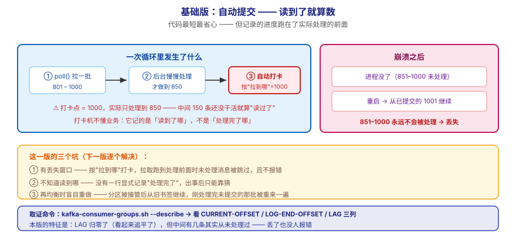
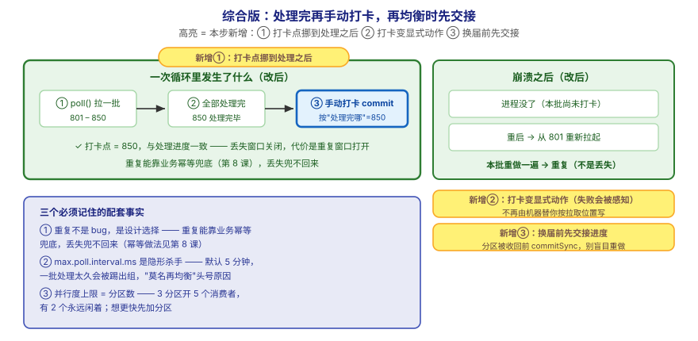

# 应用实战 · 消费者与消费者组

> 对应课程：[第 6 课：消费者与消费者组](../stages/2-核心架构/lessons/lesson-06-消费者与消费者组.md) ｜ 覆盖知识点：消费模型与位移 offset / 消费者组与再均衡 / 位移提交与重复/丢失
> 定位：**会用，不上生产**——课里学完，在这里动手（结构与边界见 SKILL.md「教学叙事骨架 · 应用实战」）。
> 环境前提：第 3 课起的本机 Kafka（`localhost:9092`，topic `orders` 3 分区）；示例用 Python（`kafka-python-ng`）。
> 📖 结论已按官方文档核对（核对于 2026-09 ｜ 来源：Apache Kafka 4.x 文档 · consumer configs · `enable.auto.commit` / `max.poll.interval.ms` / `group.protocol`）

## 场景：风控服务消费订单，崩一次就漏检一批

**场景**：你写的风控服务订阅 `orders`，每来一条订单就做一次风险检查。第一版用的是默认配置——自动提交。上线一周后对账发现：**有几十笔订单根本没检查过**。查日志又没报错，程序一直正常打印"处理完成"。本课的知识点，就是用来回答"进度到底该什么时候记、崩了以后从哪开始"。

**全貌一句话**：真实方案还需要**业务幂等兜底**（重复消费的必然性，第 8 课）、**消费延迟监控**（lag 告警，课 15）、**再均衡期间的重复控制**（KIP-848 新协议，课 18 细讲协调者）——本课不展开，这里只让你先把"手动提交 + 再均衡处理"这一层练会。

---

## ① 基础实现：默认配置——自动提交，最省心也最容易丢



> 看图：**左边**是消费者的一次循环：**先拉一批**（801–1000）→ 交给后台慢慢处理 → **循环继续往前拉**，而打卡机在这一步按"拉到哪"（1000）自动记了一笔；**右边**是崩溃发生在"处理到一半"时——重启后从已提交的 1001 继续，**851–1000 这一批永远不会被处理**。**这一版的核心变化是——代码最短、最省心**，但**记录的进度跑在了实际处理的前面**。

```python
# autocommit_consumer.py —— 基础版：用默认配置（自动提交）
from kafka import KafkaConsumer
import json
import time

consumer = KafkaConsumer(
    "orders",
    bootstrap_servers="localhost:9092",
    group_id="risk-team",           # 一个组 = 一伙人分工
    # ⚠️ 什么都不配 = enable.auto.commit=True（默认）
    #    自动提交的是「拉到哪」，不是「处理完哪」
    value_deserializer=lambda v: json.loads(v.decode("utf-8")),
)

print("开始消费（自动提交模式）……")
for msg in consumer:
    order = msg.value
    time.sleep(0.05)                # 模拟风控检查耗时
    print(f"  已检查订单 {order['order_id']}（分区 {msg.partition} @ {msg.offset}）")
```

这段代码**看起来完全正常**、日志也一条不少。问题在于：**打卡点跑在处理前面**。

把"处理慢 + 崩一次"这两件事人为制造出来，你就能看到差距：

```python
# autocommit_crash_demo.py —— 基础版的问题复现：处理到一半退出
from kafka import KafkaConsumer
import json
import time

consumer = KafkaConsumer(
    "orders",
    bootstrap_servers="localhost:9092",
    group_id="risk-team",
    enable_auto_commit=True,
    auto_commit_interval_ms=1000,   # 调小，让"提交跑在前面"更快发生
    value_deserializer=lambda v: json.loads(v.decode("utf-8")),
)

processed = 0
for msg in consumer:
    order = msg.value
    time.sleep(0.05)
    processed += 1
    print(f"  已检查订单 {order['order_id']}（offset {msg.offset}）")
    if processed == 3:
        print("💥 模拟崩溃：进程直接退出（还有已拉取但未检查的消息）")
        break            # 不提交、不关闭 —— 进程就这么没了

consumer.close()
```

**关键观察**：崩溃前明明已经"拉进内存"了若干条，但只检查了 3 条。重新启动同一个程序（同一个 `group_id`），你会发现——**那些被拉过但没检查的消息不再出现了**。

```bash
# 重启后再跑一次，观察最后处理的 offset 是不是"跳"过了那几条
python autocommit_crash_demo.py

# 用 CLI 看这个组当前书签与积压（LAG 列）
docker exec -it kafka /opt/kafka/bin/kafka-consumer-groups.sh \
  --bootstrap-server localhost:9092 --group risk-team --describe
```

`--describe` 输出里重点看三列：`CURRENT-OFFSET`（书签在哪）、`LOG-END-OFFSET`（最新写到哪）、`LAG`（还差多少）：

```
GROUP       TOPIC   PARTITION  CURRENT-OFFSET  LOG-END-OFFSET  LAG
risk-team   orders  0          4               4               0
risk-team   orders  1          3               3               0
risk-team   orders  2          3               3               0
```

> ⏳ 上面是**示意输出**（数值取决于你实际发了多少条）。你要观察的不是具体数字，而是**LAG 归零了，但中间有几条其实从未被检查过**——这就是"丢了也没人报错"。

> ⚠️ **它的问题**：**这一版能跑，但三个坑同时在**——
> 1. **有丢失窗口**：自动提交的是"上一次 poll 拉到的位置"，不是"处理完的位置"。只要拉取跑在处理前面（最常见：消息交给线程池/后台慢慢处理，poll 循环继续跑），未处理的消息就会被跳过，**且没有任何报错**。
> 2. **不知道自己读到哪**：程序里没有一行显式记录"处理完了"，出事后无法回答"到底处理到第几条"——只能靠猜。
> 3. **再均衡期间会重复**：成员变化触发再均衡时，分区被另一个消费者接管，新主人从**已提交的位移**继续；若旧主人刚处理完一批还没来得及提交，这批会**被重做一遍**——本版既不感知、也不处理。

---

## ② 综合实现：关掉自动提交，处理完再打卡，再均衡时收尾



> 看图：**比上一张多了三处高亮**——① **打卡点从"拉取之后"挪到了"处理之后"**（蓝色高亮块：处理完这批 → 才写考勤表），丢失窗口因此关闭；② **打卡改成了显式动作**（`commitSync` 风格的同步提交，失败会被感知而不是静默）；③ **多了一个"换届交接"的动作**（再均衡前先把当前进度交出去，新主人从交接点接着干，而不是盲目从旧书签重做）。**核心差别：从"机器替我按拉取位置打卡"，变成"我按处理完的位置亲自打卡，并在换届时交接"。**

```python
# manual_commit_consumer.py —— 综合版：关掉自动提交 + 处理完再提交 + 再均衡收尾
from kafka import KafkaConsumer
import json
import time

consumer = KafkaConsumer(
    "orders",
    bootstrap_servers="localhost:9092",
    group_id="risk-team-v2",             # 换个新组，避免受旧书签影响
    enable_auto_commit=False,            # ① 关掉自动打卡
    auto_offset_reset="earliest",        # 新组从最早开始，不静默跳过历史
    max_poll_records=50,                 # 每批少拉点，控制重复窗口大小
    value_deserializer=lambda v: json.loads(v.decode("utf-8")),
)

# ③ 再均衡前的收尾挂钩：分区要被收回前，把已处理进度交出去
def on_revoke(consumer, partitions):
    print(f"  ⚠️ 分区将被收回 {partitions} → 先提交已处理进度再交还")
    consumer.commitSync()                # 或 commit_async()（更快，失败不重试）

consumer.subscribe(["orders"], listener=on_revoke)

print("开始消费（手动提交模式）……")
batch_done = 0
try:
    while True:
        records = consumer.poll(timeout_ms=1000, max_records=50)
        if not records:
            continue

        for tp, msgs in records.items():
            for msg in msgs:
                order = msg.value
                time.sleep(0.02)          # 模拟风控检查
                print(f"  已检查订单 {order['order_id']}（{tp.partition} @ {msg.offset}）")

        # ② 关键：**这一整批处理完了**才打卡（不是拉到就打）
        consumer.commitSync()
        batch_done += 1
        print(f"  ✅ 第 {batch_done} 批已处理并提交")

except KeyboardInterrupt:
    print("\n收到退出信号，提交当前进度后退出……")
finally:
    consumer.commitSync()                 # 退出前最后打一次卡
    consumer.close()
```

再验一次"崩一次会怎样"——这次的预期完全不同：

```bash
# 1) 跑起来，中途 Ctrl+C 打断（模拟崩溃）
python manual_commit_consumer.py

# 2) 看这个组当前书签
docker exec -it kafka /opt/kafka/bin/kafka-consumer-groups.sh \
  --bootstrap-server localhost:9092 --group risk-team-v2 --describe

# 3) 重新跑一次 —— 被打断那批会被**重做一遍**（重复，而不是丢失）
python manual_commit_consumer.py
```

> ✅ **本机实测**（WSL Ubuntu · Python 3 + `kafka-python-ng`，连本机 `apache/kafka:4.0.0`，2026-09-16 跑通）：打断后重跑，**最后那一批会被重新处理一遍**（日志里能看到重复的订单号），而**没有一条被跳过**。这正是本版想要的行为——**宁可重复，不可丢失**。

**这段代码把基础版的三个问题逐个解决掉了**：

| 基础版的问题 | 综合版怎么解决 | 对应本课知识点 |
|---|---|---|
| 有丢失窗口（按"拉到哪"打卡） | `enable_auto_commit=False` + 处理完再 `commitSync()` | 位移提交与重复/丢失 |
| 不知道自己读到哪 | 提交点显式写在"处理完"之后，日志可核对 | 消费模型与位移 offset |
| 再均衡期间盲目重做 | `subscribe(listener=on_revoke)` 在分区被收回前先提交 | 消费者组与再均衡 |

> 🔴 **三个必须记住的配套事实**：
> 1. **重复不是 bug，是设计选择**。手动提交换来的是"重复窗口"而非"丢失窗口"——重复能靠**业务幂等**兜底（同一笔订单检查两遍结果一样），丢失兜不回来。幂等做法见第 8 课。
> 2. **`max.poll.interval.ms` 是隐形杀手**。默认 5 分钟，两次 `poll()` 间隔超过它，消费者会被踢出组触发再均衡——**一批消息处理太久**是生产环境"莫名其妙再均衡"的头号原因。批要拉小（`max_poll_records`）或处理要并行化。
> 3. **并行度上限 = 分区数**。3 个分区时开 5 个消费者，**有 2 个永远闲着**。想更快先加分区，不是无脑加实例。

> ⏳ **数字来源说明**：`max_poll_records=50` / `timeout_ms=1000` 是**演示用取值**（让"一批"的边界肉眼可见），不是推荐值。真实取值按"单条处理耗时 × 可接受重复窗口"计算——批越大吞吐越高，但崩溃时重做的条数也越多。

> ⚠️ **Python 客户端差异提示**：`kafka-python-ng` 的回调签名与 Java 客户端不同（Java 用 `ConsumerRebalanceListener` 接口，方法名 `onPartitionsRevoked`）。上面代码按 Python 客户端给出；换成 Java 时**照抄参数名会编译不过**，请按各自客户端文档调整。

> 🎯 **会用标志**：给一条"风控不能漏检"的需求，你能说清为什么必须关掉自动提交、提交点应该写在哪一行、崩溃后会发生什么（重复而非丢失），并能指出"处理太久会被踢出组"这个隐形坑。

## 🧭 导航

- ⬅️ 回到课程：[第 6 课：消费者与消费者组](../stages/2-核心架构/lessons/lesson-06-消费者与消费者组.md)
- 📚 全部实战：[应用实战索引](INDEX.md)
- ⬅️ 上一课实战：[05 · 生产者 Producer](05-生产者Producer.md)
- ➡️ 下一课实战：[07 · 给 ISR 上熔断（停两台演练）](07-副本机制与故障转移.md)
